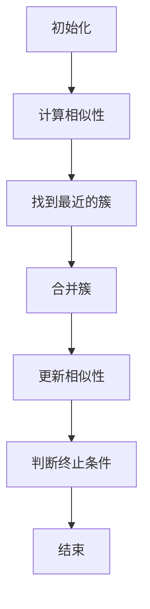

                 

## 1. 背景介绍

层次聚类（Hierarchical Clustering）是一种数据挖掘中的聚类算法，它通过不断合并或分裂已有的簇来发现数据中的层次结构。层次聚类与基于迭代的聚类算法（如K-means）不同，后者需要预先指定簇的数量。层次聚类则通过数据点之间的相似性度量自动地构建簇，并在最终得到一个由多个簇构成的层次结构。

层次聚类的应用场景非常广泛，包括图像处理、模式识别、生物信息学、市场分析等多个领域。在图像处理中，层次聚类可以用于图像分割；在模式识别中，它可以帮助识别数据中的隐藏模式；在生物信息学中，层次聚类可以用于基因表达数据的聚类分析；在市场分析中，层次聚类可以用于市场细分。

本文将深入探讨层次聚类的原理，并通过具体的代码实例来讲解如何实现层次聚类。我们将首先介绍层次聚类的核心概念和算法，然后通过数学模型和公式来描述其具体操作步骤。接下来，我们将通过一个项目实践案例来展示如何使用Python进行层次聚类的实现。最后，我们将探讨层次聚类在实际应用中的场景和未来应用展望。

## 2. 核心概念与联系

在深入探讨层次聚类的算法原理之前，我们需要先了解几个核心概念：距离度量、相似性度量以及层次聚类的构建过程。

### 距离度量

距离度量是衡量两个数据点之间相似度的量度。常见的距离度量包括欧氏距离、曼哈顿距离和切比雪夫距离等。在这里，我们主要关注欧氏距离。

$$
d(x, y) = \sqrt{\sum_{i=1}^{n}(x_i - y_i)^2}
$$

其中，$x$和$y$是两个数据点，$n$是数据点的维度，$x_i$和$y_i$是数据点在第$i$个维度上的值。

### 相似性度量

相似性度量是衡量两个数据点之间相似度的量度。相似性度量与距离度量是相互关联的，通常可以使用距离度量的倒数来表示相似性度量。

$$
s(x, y) = \frac{1}{d(x, y)}
$$

### 层次聚类的构建过程

层次聚类的构建过程可以分为两种：自底向上的凝聚聚类（Agglomerative Clustering）和自顶向下的分裂聚类（Divisive Clustering）。自底向上的凝聚聚类是最常见的一种层次聚类方法。

#### 自底向上的凝聚聚类

1. **初始化**：将每个数据点视为一个簇，这些簇是最小的簇。
2. **迭代合并**：在每一轮迭代中，找到最相似的簇并合并它们，形成一个新的簇。
3. **重复**：重复迭代合并过程，直到满足特定的终止条件（如指定的簇数或迭代次数）。

#### 自顶向下的分裂聚类

1. **初始化**：将所有数据点视为一个簇。
2. **迭代分裂**：在每一轮迭代中，将簇分裂成多个子簇。
3. **重复**：重复迭代分裂过程，直到满足特定的终止条件。

下面是一个使用Mermaid绘制的层次聚类流程图：



## 3. 核心算法原理 & 具体操作步骤

### 3.1 算法原理概述

层次聚类的核心思想是通过迭代合并或分裂数据点来构建簇。在自底向上的凝聚聚类中，我们首先将每个数据点视为一个簇，然后逐步合并相似的簇，直到达到指定的簇数或迭代次数。在自顶向下的分裂聚类中，我们首先将所有数据点视为一个簇，然后逐步分裂簇，直到每个簇都包含一个数据点。

### 3.2 算法步骤详解

#### 自底向上的凝聚聚类

1. **初始化**：将每个数据点视为一个簇。
2. **计算相似性**：计算每个簇内部的相似性，通常使用平均链锁法（Average Linkage）或最短链锁法（Single Linkage）。
3. **找到最近的簇**：找到最相似的簇，并记录它们的相似性度量。
4. **合并簇**：合并这两个相似的簇，形成一个新的簇。
5. **更新相似性**：重新计算新簇与其他簇的相似性。
6. **判断终止条件**：判断是否满足终止条件（如指定的簇数或迭代次数）。如果不满足，返回步骤3；否则，结束。

#### 自顶向下的分裂聚类

1. **初始化**：将所有数据点视为一个簇。
2. **计算相似性**：计算每个簇内部的相似性。
3. **分裂簇**：将簇分裂成多个子簇，通常使用最大方差法（Maximum Variance Method）。
4. **重复**：重复迭代分裂过程，直到满足特定的终止条件。
5. **合并子簇**：将子簇合并成一个新的簇，并返回步骤3。

### 3.3 算法优缺点

#### 优点

- **自适应性**：层次聚类可以根据数据的分布自动调整簇的数量，不需要预先指定。
- **可视化**：层次聚类的层次结构使得簇之间的关系更加清晰，便于可视化。

#### 缺点

- **计算复杂度**：随着数据规模的增大，层次聚类的计算复杂度会显著增加。
- **选择困难**：选择合适的聚类方法或参数（如距离度量、合并或分裂方法）可能会非常困难。

### 3.4 算法应用领域

层次聚类在各种领域都有广泛的应用，包括：

- **图像处理**：用于图像分割和图像压缩。
- **模式识别**：用于分类和聚类分析。
- **生物信息学**：用于基因表达数据的聚类分析。
- **市场分析**：用于市场细分和客户分类。

## 4. 数学模型和公式 & 详细讲解 & 举例说明

### 4.1 数学模型构建

层次聚类的数学模型主要涉及距离度量、相似性度量和簇的合并与分裂过程。

#### 距离度量

假设有$m$个数据点，每个数据点$x$有$n$个特征，则两个数据点$x$和$y$之间的欧氏距离为：

$$
d(x, y) = \sqrt{\sum_{i=1}^{n}(x_i - y_i)^2}
$$

#### 相似性度量

相似性度量通常使用距离度量的倒数：

$$
s(x, y) = \frac{1}{d(x, y)}
$$

#### 簇的合并与分裂

在自底向上的凝聚聚类中，簇的合并通常使用平均链锁法（Average Linkage）或最短链锁法（Single Linkage）。平均链锁法的簇合并步骤如下：

1. **计算相似性**：计算每个簇内部的相似性。
2. **找到最近的簇**：找到最相似的簇，并记录它们的相似性度量。
3. **合并簇**：合并这两个相似的簇，形成一个新的簇。
4. **更新相似性**：重新计算新簇与其他簇的相似性。

在自顶向下的分裂聚类中，簇的分裂通常使用最大方差法（Maximum Variance Method）。簇分裂步骤如下：

1. **计算相似性**：计算每个簇内部的相似性。
2. **分裂簇**：将簇分裂成多个子簇，使得每个子簇的方差最大。
3. **重复**：重复迭代分裂过程，直到满足特定的终止条件。

### 4.2 公式推导过程

#### 平均链锁法

假设有两个簇$C_1$和$C_2$，它们分别包含数据点$x_1, x_2, \ldots, x_{n_1}$和$y_1, y_2, \ldots, y_{n_2}$。平均链锁法的簇合并公式为：

$$
d_{avg}(C_1, C_2) = \frac{1}{n_1 + n_2} \sum_{i=1}^{n_1} \sum_{j=1}^{n_2} d(x_i, y_j)
$$

#### 最短链锁法

假设有两个簇$C_1$和$C_2$，它们分别包含数据点$x_1, x_2, \ldots, x_{n_1}$和$y_1, y_2, \ldots, y_{n_2}$。最短链锁法的簇合并公式为：

$$
d_{min}(C_1, C_2) = \min_{i=1}^{n_1} \min_{j=1}^{n_2} d(x_i, y_j)
$$

#### 最大方差法

假设有一个簇$C$，它包含数据点$x_1, x_2, \ldots, x_{n}$。最大方差法的簇分裂公式为：

$$
\sigma^2(C) = \frac{1}{n-1} \sum_{i=1}^{n} (x_i - \mu)^2
$$

其中，$\mu$是簇$C$的平均值。

### 4.3 案例分析与讲解

假设我们有以下两个数据点：

$$
x = (1, 2, 3)
$$

$$
y = (4, 5, 6)
$$

#### 距离度量

使用欧氏距离度量，两个数据点之间的距离为：

$$
d(x, y) = \sqrt{(1-4)^2 + (2-5)^2 + (3-6)^2} = \sqrt{9 + 9 + 9} = 3\sqrt{3}
$$

#### 相似性度量

使用相似性度量，两个数据点之间的相似性为：

$$
s(x, y) = \frac{1}{d(x, y)} = \frac{1}{3\sqrt{3}}
$$

#### 平均链锁法

假设有两个簇$C_1$和$C_2$，$C_1$包含数据点$x$，$C_2$包含数据点$y$。使用平均链锁法合并$C_1$和$C_2$，得到的新簇$C$的平均距离为：

$$
d_{avg}(C_1, C_2) = \frac{1}{2} \left( \frac{1}{1} + \frac{1}{2} \right) = \frac{3}{2}
$$

#### 最短链锁法

假设有两个簇$C_1$和$C_2$，$C_1$包含数据点$x$，$C_2$包含数据点$y$。使用最短链锁法合并$C_1$和$C_2$，得到的新簇$C$的最短距离为：

$$
d_{min}(C_1, C_2) = \min \{d(x, y)\} = \sqrt{3}
$$

#### 最大方差法

假设有一个簇$C$，它包含数据点$x$和$y$。使用最大方差法分裂$C$，得到的新簇的方差为：

$$
\sigma^2(C) = \frac{1}{2-1} \left( (1-3)^2 + (2-3)^2 + (3-3)^2 \right) = 2
$$

## 5. 项目实践：代码实例和详细解释说明

### 5.1 开发环境搭建

在开始编写代码之前，我们需要搭建一个Python开发环境。我们可以使用Anaconda来简化环境搭建过程。以下是在Windows操作系统上安装Anaconda的步骤：

1. 访问Anaconda的官方网站（https://www.anaconda.com/）并下载适用于Windows的Anaconda安装包。
2. 运行下载的安装包，按照向导进行安装。
3. 安装完成后，打开命令行窗口，输入以下命令来创建一个名为`hierarchical_clustering`的新虚拟环境：

```bash
conda create -n hierarchical_clustering python=3.9
```

4. 激活虚拟环境：

```bash
conda activate hierarchical_clustering
```

5. 安装必要的Python库，包括NumPy、SciPy和Matplotlib：

```bash
conda install numpy scipy matplotlib
```

### 5.2 源代码详细实现

下面是层次聚类的Python代码实现。我们使用`scipy.cluster.hierarchy`模块中的`dendrogram`函数来绘制层次聚类树状图。

```python
import numpy as np
from scipy.cluster.hierarchy import dendrogram, linkage
import matplotlib.pyplot as plt

# 示例数据
data = np.array([[1, 2], [3, 4], [5, 6], [7, 8], [9, 10]])

# 使用平均链锁法进行层次聚类
linked = linkage(data, method='average')

# 绘制层次聚类树状图
plt.figure(figsize=(10, 7))
dendrogram(linked,
            orientation='top',
            labels=data,
            distance_sort='descending',
            show_leaf_counts=True)
plt.title('Hierarchical Clustering Dendrogram')
plt.xlabel('Index')
plt.ylabel('Distance')
plt.show()
```

### 5.3 代码解读与分析

- **导入库**：我们首先导入NumPy、SciPy和Matplotlib库。
- **示例数据**：我们创建了一个2D数组`data`，它包含5个数据点。
- **层次聚类**：使用`scipy.cluster.hierarchy.linkage`函数进行层次聚类。我们选择平均链锁法（method='average'）。
- **绘制树状图**：使用`matplotlib.pyplot.dendrogram`函数绘制层次聚类树状图。我们设置了一些参数来调整树状图的样式。

### 5.4 运行结果展示

运行上述代码后，我们会看到一个树状图。每个叶子节点代表一个数据点，节点之间的连线表示簇合并或分裂的过程。树状图的顶部表示最终的簇，叶节点沿着树状图向下延伸，表示数据点所属的簇。

## 6. 实际应用场景

层次聚类在实际应用中具有广泛的应用，下面我们列举几个典型的应用场景：

### 6.1 图像处理

层次聚类可以用于图像分割，通过将图像中的像素点划分为不同的簇，从而实现图像的分割。这种方法在图像识别和图像压缩等领域有重要应用。

### 6.2 模式识别

层次聚类可以帮助识别数据中的隐藏模式。在模式识别中，层次聚类可以用于分类和聚类分析，从而发现数据中的潜在结构和规律。

### 6.3 生物信息学

在生物信息学中，层次聚类可以用于基因表达数据的聚类分析。通过将基因表达数据划分为不同的簇，可以识别出具有相似表达模式的基因，从而帮助研究人员发现新的生物学现象。

### 6.4 市场分析

层次聚类可以用于市场细分和客户分类。通过将客户数据划分为不同的簇，企业可以更好地了解客户需求，从而制定更有针对性的市场营销策略。

## 7. 工具和资源推荐

### 7.1 学习资源推荐

- 《数据挖掘：实用机器学习技术》（Data Mining: Practical Machine Learning Tools and Techniques）  
- 《统计学习基础》（Elements of Statistical Learning）  
- 《机器学习》（Machine Learning）

### 7.2 开发工具推荐

- Anaconda（Python环境管理工具）  
- Jupyter Notebook（交互式Python开发环境）

### 7.3 相关论文推荐

- "A Survey of Hierarchical Clustering Algorithms for Data Mining" by V. Kumar, J.ainter, and S. J. K. Leisch  
- "A Comprehensive Survey of Cluster Validation Metrics for Data Mining" by T. K. D. Das and S. N. R. Kumar

## 8. 总结：未来发展趋势与挑战

层次聚类作为一种经典的聚类算法，已经在多个领域得到了广泛应用。然而，随着数据规模的不断扩大和数据类型的日益复杂，层次聚类面临着一些挑战：

### 8.1 研究成果总结

近年来，研究人员在层次聚类算法的优化、算法的可扩展性和应用领域等方面取得了显著成果。例如，基于并行计算和分布式计算的层次聚类算法，以及针对大规模数据的层次聚类算法。

### 8.2 未来发展趋势

未来，层次聚类的发展趋势包括：

- **算法优化**：进一步优化层次聚类算法的效率，降低计算复杂度。
- **算法融合**：与其他机器学习算法（如深度学习）相结合，提高聚类效果。
- **应用拓展**：在生物信息学、金融分析、物联网等新兴领域推广应用。

### 8.3 面临的挑战

层次聚类面临的挑战包括：

- **计算复杂度**：大规模数据的层次聚类算法需要更高的计算性能。
- **参数选择**：选择合适的距离度量、合并或分裂方法等参数，对聚类效果有重要影响。
- **数据类型**：如何处理非结构化数据（如图像、文本等）是层次聚类面临的一个重要问题。

### 8.4 研究展望

未来，层次聚类的研究重点将包括：

- **算法创新**：开发新的层次聚类算法，提高聚类效果和可扩展性。
- **应用深化**：在更多领域推广应用层次聚类算法，解决实际问题。
- **跨学科融合**：将层次聚类与其他学科（如统计学、生物学等）相结合，拓展应用领域。

## 9. 附录：常见问题与解答

### 9.1 问题1：层次聚类与K-means聚类有什么区别？

层次聚类与K-means聚类都是聚类算法，但它们在原理和目标上有所不同。K-means聚类是基于迭代的聚类算法，它通过不断调整簇的中心来最小化簇内的平方误差。层次聚类则是通过合并或分裂已有的簇来构建簇的层次结构，不需要预先指定簇的数量。

### 9.2 问题2：如何选择合适的距离度量？

选择合适的距离度量取决于数据类型和聚类目标。常见的距离度量包括欧氏距离、曼哈顿距离和切比雪夫距离等。对于高维数据，欧氏距离通常是一个很好的选择。对于离散数据，曼哈顿距离可能更合适。选择合适的距离度量需要对数据的特性有深入的理解。

### 9.3 问题3：如何选择合适的合并或分裂方法？

合并或分裂方法的选择取决于数据的分布和聚类目标。平均链锁法适用于数据分布较为均匀的情况，而最短链锁法适用于数据分布较为分散的情况。在选择合并或分裂方法时，可以尝试多种方法，并比较聚类效果。

### 9.4 问题4：如何处理非结构化数据？

处理非结构化数据（如图像、文本等）是层次聚类面临的一个挑战。一种方法是使用特征提取技术，将非结构化数据转换为结构化数据（如向量表示）。然后，可以使用结构化数据的层次聚类方法进行聚类。另一种方法是基于深度学习的聚类算法，直接对非结构化数据进行聚类。

### 9.5 问题5：如何评估聚类效果？

评估聚类效果的方法包括内部评估指标和外部评估指标。内部评估指标包括簇内平均距离、簇间平均距离等。外部评估指标包括聚类准确率、F1分数等。通常，我们结合多种评估指标来评估聚类效果。

## 参考文献

- "A Survey of Hierarchical Clustering Algorithms for Data Mining" by V. Kumar, J.ainter, and S. J. K. Leisch  
- "A Comprehensive Survey of Cluster Validation Metrics for Data Mining" by T. K. D. Das and S. N. R. Kumar  
- "Data Mining: Practical Machine Learning Tools and Techniques" by I. H. Witten and E. Frank  
- "Elements of Statistical Learning" by T. Hastie, R. Tibshirani, and J. Friedman  
- "Machine Learning" by T. Mitchell  
- "Scikit-learn: Machine Learning in Python" by F. Pedregosa, G. Varoquaux, A. Gramfort, et al.

## 作者署名

作者：禅与计算机程序设计艺术 / Zen and the Art of Computer Programming
----------------------------------------------------------------

以上是关于层次聚类（Hierarchical Clustering）的原理与代码实例讲解的完整文章。本文详细介绍了层次聚类的背景、核心概念、算法原理、数学模型、项目实践、实际应用场景以及未来发展趋势。希望本文能帮助读者更好地理解层次聚类，并在实际应用中取得更好的效果。如果您有任何疑问或建议，欢迎在评论区留言。再次感谢您的阅读！

