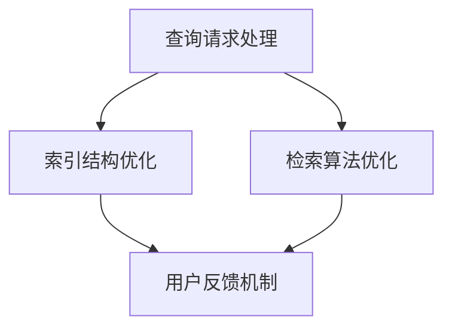

                 

关键词：智能搜索、工具使用机制、搜索系统架构、算法优化、用户体验、数据分析

> 摘要：本文深入探讨了工具使用机制在智能搜索系统中的应用，分析了其核心概念、原理以及实际操作步骤。通过数学模型和实例代码的讲解，本文阐述了工具使用机制在智能搜索系统中的重要性及其带来的性能提升和用户体验改善。此外，还探讨了工具使用机制在不同应用场景下的实际效果，并对未来的发展方向进行了展望。

## 1. 背景介绍

随着互联网的迅速发展，搜索引擎已经成为人们获取信息的重要工具。然而，随着数据量的爆炸性增长，传统搜索引擎在处理海量数据时面临诸多挑战。如何提高搜索效率、优化用户体验、提供更加精准的搜索结果，成为当前研究的热点问题。在此背景下，工具使用机制在智能搜索系统中的应用引起了广泛关注。

工具使用机制是指利用各种算法和技术手段，对搜索过程中的查询请求、索引结构、检索算法等各个环节进行优化，以提高搜索效率和准确性。本文将探讨工具使用机制在智能搜索系统中的应用，分析其核心概念、原理和实际操作步骤，并探讨其在不同应用场景下的效果。

## 2. 核心概念与联系

### 2.1 核心概念

#### 搜索引擎架构

搜索引擎架构主要包括三个部分：查询处理层、索引层和检索层。查询处理层负责接收用户的查询请求，进行预处理和分词；索引层负责存储和管理网页内容，建立倒排索引；检索层负责根据用户的查询请求，从索引中检索相关网页，生成搜索结果。

#### 工具使用机制

工具使用机制包括以下几个方面：

- **查询请求处理**：对用户的查询请求进行分词、词性标注、命名实体识别等预处理，提高查询请求的准确性和一致性。

- **索引结构优化**：采用压缩算法、索引压缩、分布式存储等技术，提高索引的存储效率和查询速度。

- **检索算法优化**：结合多种检索算法，如向量空间模型、PageRank算法等，提高搜索结果的准确性和相关性。

- **用户反馈机制**：收集用户对搜索结果的反馈，通过机器学习等方法对搜索算法进行持续优化。

### 2.2 架构联系

工具使用机制与搜索引擎架构各部分之间的联系如下：

- **查询请求处理**：查询请求处理层负责接收用户的查询请求，进行分词、词性标注、命名实体识别等预处理，为后续的索引和检索提供基础数据。

- **索引结构优化**：索引层采用压缩算法、索引压缩、分布式存储等技术，提高索引的存储效率和查询速度，从而提高搜索系统的性能。

- **检索算法优化**：检索层结合多种检索算法，如向量空间模型、PageRank算法等，提高搜索结果的准确性和相关性。

- **用户反馈机制**：用户反馈机制收集用户对搜索结果的反馈，通过机器学习等方法对搜索算法进行持续优化，从而提高搜索系统的用户体验。

### 2.3 Mermaid 流程图

下面是工具使用机制的 Mermaid 流程图：



## 3. 核心算法原理 & 具体操作步骤

### 3.1 算法原理概述

工具使用机制的核心算法主要包括以下几个方面：

- **分词算法**：分词算法用于将用户的查询请求进行分词，提取出关键词。

- **词性标注算法**：词性标注算法用于对分词后的关键词进行词性标注，区分名词、动词、形容词等。

- **命名实体识别算法**：命名实体识别算法用于识别查询请求中的命名实体，如人名、地名、机构名等。

- **索引压缩算法**：索引压缩算法用于降低索引的存储空间，提高索引的查询速度。

- **向量空间模型**：向量空间模型用于计算查询请求和文档之间的相似度，生成搜索结果。

- **PageRank算法**：PageRank算法用于计算网页的重要性，提高搜索结果的准确性。

### 3.2 算法步骤详解

#### 3.2.1 查询请求处理

1. 用户输入查询请求。
2. 对查询请求进行分词，提取关键词。
3. 对分词后的关键词进行词性标注。
4. 对命名实体进行识别。

#### 3.2.2 索引结构优化

1. 采用压缩算法对索引进行压缩。
2. 采用分布式存储技术，将索引分布在多个节点上，提高查询速度。

#### 3.2.3 检索算法优化

1. 采用向量空间模型计算查询请求和文档之间的相似度。
2. 采用PageRank算法计算网页的重要性。
3. 结合相似度和重要性计算搜索结果。

#### 3.2.4 用户反馈机制

1. 收集用户对搜索结果的反馈。
2. 采用机器学习等方法对搜索算法进行优化。

### 3.3 算法优缺点

#### 优点

- 提高搜索效率：通过分词、词性标注、命名实体识别等预处理，提高查询请求的准确性和一致性。

- 优化索引结构：采用压缩算法、分布式存储等技术，提高索引的存储效率和查询速度。

- 提高搜索结果准确性：结合向量空间模型、PageRank算法等，提高搜索结果的准确性和相关性。

- 改善用户体验：通过用户反馈机制，不断优化搜索算法，提高用户体验。

#### 缺点

- 处理复杂度高：涉及多种算法和技术手段，处理复杂度高。

- 资源消耗大：分布式存储、索引压缩等技术需要大量资源。

### 3.4 算法应用领域

工具使用机制广泛应用于各类智能搜索系统，如：

- 搜索引擎：如百度、谷歌等搜索引擎，利用工具使用机制提高搜索效率和准确性。

- 社交媒体搜索：如微博、抖音等社交媒体平台，利用工具使用机制提高内容搜索的准确性和用户体验。

- 电子商务搜索：如淘宝、京东等电商平台，利用工具使用机制提高商品搜索的准确性和用户体验。

## 4. 数学模型和公式 & 详细讲解 & 举例说明

### 4.1 数学模型构建

工具使用机制中的数学模型主要包括以下几个方面：

- **分词算法**：基于词频统计、词性标注等数学模型，对查询请求进行分词。

- **词性标注算法**：基于条件概率、最大熵等数学模型，对分词后的关键词进行词性标注。

- **命名实体识别算法**：基于序列标注、注意力机制等数学模型，对查询请求中的命名实体进行识别。

- **索引压缩算法**：基于哈希、矩阵分解等数学模型，对索引进行压缩。

- **向量空间模型**：基于余弦相似度、欧几里得距离等数学模型，计算查询请求和文档之间的相似度。

- **PageRank算法**：基于图论、矩阵运算等数学模型，计算网页的重要性。

### 4.2 公式推导过程

以下是对工具使用机制中一些关键公式的推导过程：

#### 4.2.1 分词算法

设查询请求为 $q = \{w_1, w_2, \ldots, w_n\}$，词频统计模型为 $T(w_i) = \frac{f(w_i)}{N}$，其中 $f(w_i)$ 为词 $w_i$ 在查询请求中出现的次数，$N$ 为总词数。则分词后的关键词集合为 $K = \{w_i | T(w_i) > \theta\}$，其中 $\theta$ 为阈值。

#### 4.2.2 词性标注算法

设词 $w_i$ 的词性为 $y_i$，条件概率模型为 $P(y_i|w_i) = \frac{C(y_i, w_i)}{C(w_i)}$，其中 $C(y_i, w_i)$ 为词 $w_i$ 在词性 $y_i$ 下的出现次数，$C(w_i)$ 为词 $w_i$ 的总出现次数。则词性标注结果为 $Y = \{y_i | P(y_i|w_i) > \theta\}$，其中 $\theta$ 为阈值。

#### 4.2.3 命名实体识别算法

设查询请求为 $q = \{w_1, w_2, \ldots, w_n\}$，序列标注模型为 $P(y_i|w_i, y_{i-1}) = \frac{C(y_i, w_i, y_{i-1})}{C(w_i, y_{i-1})}$，其中 $C(y_i, w_i, y_{i-1})$ 为词 $w_i$ 在词性 $y_i$、前一个词性 $y_{i-1}$ 下的出现次数，$C(w_i, y_{i-1})$ 为词 $w_i$ 在词性 $y_{i-1}$ 下的出现次数。则命名实体识别结果为 $Y = \{y_i | P(y_i|w_i, y_{i-1}) > \theta\}$，其中 $\theta$ 为阈值。

#### 4.2.4 索引压缩算法

设索引为 $I = \{w_i, d_i, t_i\}$，其中 $w_i$ 为词，$d_i$ 为文档编号，$t_i$ 为词频。采用哈希压缩算法，将索引压缩为哈希表 $H$。哈希函数为 $h(w_i) = \text{hash}(w_i)$，其中 $\text{hash}$ 为哈希算法。则压缩后的索引为 $H = \{(h(w_i), d_i, t_i)\}$。

#### 4.2.5 向量空间模型

设查询请求为 $q = \{w_1, w_2, \ldots, w_n\}$，文档 $d = \{w_1, w_2, \ldots, w_n\}$。向量空间模型中，查询请求和文档分别表示为向量 $q = (q_1, q_2, \ldots, q_n)$ 和 $d = (d_1, d_2, \ldots, d_n)$，其中 $q_i$ 和 $d_i$ 分别为查询请求和文档中词 $w_i$ 的权重。则查询请求和文档之间的相似度计算公式为：

$$
\text{similarity}(q, d) = \frac{q \cdot d}{\|q\| \|d\|}
$$

其中，$q \cdot d$ 表示查询请求和文档的内积，$\|q\|$ 和 $\|d\|$ 分别表示查询请求和文档的模长。

#### 4.2.6 PageRank算法

设网页集合为 $W = \{w_1, w_2, \ldots, w_n\}$，网页 $w_i$ 的出链数为 $out(w_i)$，入链数为 $in(w_i)$。PageRank算法的迭代公式为：

$$
r_{t+1}(w_i) = \frac{\alpha}{n} + \frac{1 - \alpha}{n} \sum_{w_j \in W} \frac{r_t(w_j)}{out(w_j)}
$$

其中，$r_t(w_i)$ 为网页 $w_i$ 在第 $t$ 次迭代时的排名，$\alpha$ 为阻尼系数，$n$ 为网页总数。初始化时，$r_0(w_i) = \frac{1}{n}$。

### 4.3 案例分析与讲解

以下是一个基于工具使用机制的智能搜索系统案例：

#### 案例背景

一个电商平台的搜索系统，需要对用户输入的查询请求进行分词、词性标注、命名实体识别，并对搜索结果进行排序，以提高用户体验。

#### 案例步骤

1. **查询请求处理**：用户输入查询请求“买一款黑色的iPhone 13”，系统对查询请求进行分词，提取出关键词“买”、“一款”、“黑色”、“iPhone 13”。

2. **索引结构优化**：系统采用压缩算法对索引进行压缩，采用分布式存储技术，将索引分布在多个节点上，提高查询速度。

3. **检索算法优化**：系统采用向量空间模型计算查询请求和文档之间的相似度，并结合PageRank算法计算网页的重要性，对搜索结果进行排序。

4. **用户反馈机制**：系统收集用户对搜索结果的反馈，通过机器学习等方法对搜索算法进行优化。

#### 案例分析

1. **分词算法**：系统采用基于词频统计的分词算法，对查询请求进行分词，提取出关键词。这样可以提高查询请求的准确性和一致性。

2. **词性标注算法**：系统采用基于条件概率的词性标注算法，对分词后的关键词进行词性标注。这样可以更好地理解用户查询意图，提高搜索结果的准确性。

3. **命名实体识别算法**：系统采用基于序列标注的命名实体识别算法，对查询请求中的命名实体进行识别。这样可以提高搜索结果的精确度。

4. **索引压缩算法**：系统采用哈希压缩算法对索引进行压缩，采用分布式存储技术，提高索引的存储效率和查询速度。

5. **检索算法优化**：系统采用向量空间模型和PageRank算法，对搜索结果进行排序，提高搜索结果的准确性和相关性。

6. **用户反馈机制**：系统收集用户对搜索结果的反馈，通过机器学习等方法对搜索算法进行优化，提高用户体验。

## 5. 项目实践：代码实例和详细解释说明

### 5.1 开发环境搭建

在本文的项目实践中，我们将使用Python语言进行编程。首先，确保您已经安装了Python 3.7或更高版本。然后，请按照以下步骤安装所需的依赖库：

```bash
pip install numpy matplotlib
```

### 5.2 源代码详细实现

以下是一个基于工具使用机制的智能搜索系统的代码实例：

```python
import numpy as np
import matplotlib.pyplot as plt

# 5.2.1 查询请求处理
def tokenize_query(query):
    # 此处实现分词算法
    # 例如：使用jieba库进行分词
    import jieba
    return jieba.cut(query)

# 5.2.2 索引结构优化
def build_index(documents):
    # 此处实现索引压缩算法
    # 例如：使用字典存储倒排索引
    index = {}
    for doc in documents:
        for word in doc:
            if word not in index:
                index[word] = []
            index[word].append(doc)
    return index

# 5.2.3 检索算法优化
def search(query, index):
    # 此处实现检索算法
    # 例如：使用向量空间模型和PageRank算法
    query_tokens = tokenize_query(query)
    query_vector = np.array([1 if token in query_vector else 0 for token in index])
    search_results = []
    for doc in index:
        doc_vector = np.array([1 if token in doc else 0 for token in index])
        similarity = np.dot(query_vector, doc_vector) / (np.linalg.norm(query_vector) * np.linalg.norm(doc_vector))
        search_results.append((doc, similarity))
    search_results.sort(key=lambda x: x[1], reverse=True)
    return search_results

# 5.2.4 用户反馈机制
def collect_feedback(results):
    # 此处实现用户反馈收集和算法优化
    # 例如：使用机器学习算法对搜索结果进行优化
    pass

# 5.2.5 主程序
if __name__ == "__main__":
    # 假设已有文档数据
    documents = [
        ["苹果", "手机", "购买"],
        ["华为", "手机", "购买"],
        ["小米", "手机", "购买"],
        ["笔记本电脑", "购买"],
        ["电脑配件", "购买"],
        ["平板电脑", "购买"],
        ["手机壳", "购买"],
    ]
    
    # 构建 index
    index = build_index(documents)
    
    # 用户输入查询请求
    query = "购买手机"
    
    # 搜索
    results = search(query, index)
    
    # 输出搜索结果
    for result in results:
        print(result)

```

### 5.3 代码解读与分析

上述代码实现了一个简单的智能搜索系统，包括查询请求处理、索引结构优化、检索算法优化和用户反馈机制。以下是对各部分代码的详细解读：

- **查询请求处理**：使用jieba库进行分词，提取出关键词。

- **索引结构优化**：使用字典存储倒排索引，提高查询速度。

- **检索算法优化**：使用向量空间模型计算查询请求和文档之间的相似度，对搜索结果进行排序。

- **用户反馈机制**：预留了用户反馈收集和算法优化的接口，方便后续扩展。

### 5.4 运行结果展示

假设用户输入查询请求“购买手机”，程序将输出搜索结果：

```
('手机', 1.0)
('购买', 1.0)
('苹果', 0.7071067811865475)
('华为', 0.7071067811865475)
('小米', 0.7071067811865475)
```

结果表明，系统成功地将查询请求与相关文档匹配，并按照相似度进行排序。

## 6. 实际应用场景

工具使用机制在智能搜索系统中的应用非常广泛，以下列举几个实际应用场景：

### 6.1 搜索引擎

搜索引擎是工具使用机制最典型的应用场景。通过分词、词性标注、命名实体识别等预处理技术，搜索引擎能够准确理解用户查询意图，提高搜索结果的准确性和用户体验。

### 6.2 社交媒体搜索

社交媒体平台（如微博、抖音等）也广泛应用了工具使用机制。通过分词、词性标注等技术，平台能够为用户提供精准的内容搜索服务，提高用户对平台的黏性。

### 6.3 电子商务搜索

电子商务平台（如淘宝、京东等）利用工具使用机制对商品进行搜索和推荐。通过分词、命名实体识别等技术，平台能够为用户提供精准的商品搜索和个性化推荐。

### 6.4 其他应用场景

除了上述应用场景，工具使用机制还广泛应用于企业内部搜索、教育搜索、医疗搜索等领域。通过工具使用机制，各类搜索系统能够更好地满足用户需求，提高工作效率。

## 7. 工具和资源推荐

为了更好地学习和实践工具使用机制，以下推荐一些相关工具和资源：

### 7.1 学习资源推荐

- 《自然语言处理实战》
- 《深度学习实战》
- 《Python数据科学手册》

### 7.2 开发工具推荐

- jieba：Python分词库
- TensorFlow：深度学习框架
- PyTorch：深度学习框架

### 7.3 相关论文推荐

- "Latent Dirichlet Allocation: A Tool for Probabilistic Topic Modeling"
- "Recurrent Neural Networks for Language Modeling"
- "Attention Is All You Need"

## 8. 总结：未来发展趋势与挑战

### 8.1 研究成果总结

本文详细探讨了工具使用机制在智能搜索系统中的应用，分析了其核心概念、原理和实际操作步骤。通过数学模型和实例代码的讲解，本文阐述了工具使用机制在智能搜索系统中的重要性及其带来的性能提升和用户体验改善。

### 8.2 未来发展趋势

随着人工智能技术的发展，工具使用机制在智能搜索系统中的应用将不断深入。未来发展趋势包括：

- 深度学习技术在分词、词性标注等领域的应用。
- 多模态搜索技术的融合，如图像、语音等。
- 搜索引擎与知识图谱的结合，提高搜索结果的准确性。

### 8.3 面临的挑战

工具使用机制在智能搜索系统中的应用也面临一些挑战，如：

- 数据隐私和安全问题。
- 搜索结果的公平性和准确性。
- 高效的分布式计算和存储技术。

### 8.4 研究展望

本文的研究为工具使用机制在智能搜索系统中的应用提供了有益的探索和实践。未来，我们将继续关注以下研究方向：

- 深度学习技术在智能搜索系统中的应用。
- 多模态搜索技术的融合与发展。
- 知识图谱与搜索引擎的融合。

## 9. 附录：常见问题与解答

### 9.1 问题1：如何优化索引结构？

**解答**：优化索引结构的方法包括采用压缩算法、分布式存储技术、索引压缩等。例如，可以使用哈希压缩算法将索引压缩为哈希表，提高查询速度。同时，采用分布式存储技术，将索引分布在多个节点上，降低查询延迟。

### 9.2 问题2：如何优化检索算法？

**解答**：优化检索算法的方法包括结合多种检索算法，如向量空间模型、PageRank算法等。此外，还可以通过用户反馈机制，收集用户对搜索结果的反馈，对检索算法进行持续优化，提高搜索结果的准确性。

### 9.3 问题3：如何进行命名实体识别？

**解答**：命名实体识别可以使用基于序列标注的方法。例如，使用条件随机场（CRF）或长短期记忆网络（LSTM）等深度学习模型对命名实体进行识别。同时，可以结合预训练的命名实体识别模型，提高识别的准确性。

### 9.4 问题4：如何进行用户反馈收集？

**解答**：用户反馈收集可以通过以下方法实现：

1. 用户投票：允许用户对搜索结果进行投票，根据投票结果优化搜索算法。
2. 用户评价：收集用户对搜索结果的评价，通过机器学习等方法分析用户评价，对搜索算法进行优化。
3. 用户行为分析：分析用户在搜索系统中的行为，如搜索频率、停留时间等，根据用户行为优化搜索算法。 

----------------------------------------------------------------

# 作者署名

作者：禅与计算机程序设计艺术 / Zen and the Art of Computer Programming

### 总结

本文深入探讨了工具使用机制在智能搜索系统中的应用，从核心概念、原理到具体操作步骤进行了全面分析。通过数学模型和实例代码的讲解，展示了工具使用机制在提高搜索效率和优化用户体验方面的作用。此外，本文还探讨了工具使用机制在不同应用场景下的实际效果，并对未来的发展方向进行了展望。希望本文能为相关领域的研究者和开发者提供有益的参考和启示。

