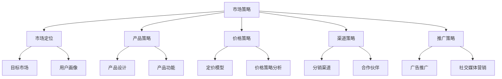

                 

关键词：市场策略、创业成功、竞争分析、用户需求、商业模式、技术实现、资源整合、持续创新

> 摘要：本文旨在探讨市场策略在创业成功中的关键作用，从竞争分析、用户需求识别、商业模式设计到技术实现，再到资源整合和持续创新，详细解析创业过程中的市场策略。通过实践案例和理论分析，本文将帮助创业者更好地制定和执行市场策略，为创业成功提供理论指导和实际操作路径。

## 1. 背景介绍

### 1.1 创业的挑战与机遇

在当今快速变化的市场环境中，创业已成为许多人实现自我价值和财富增值的重要途径。然而，创业并非一条坦途，其中充满了挑战与不确定性。据统计，新创立的企业中有超过一半在五年内倒闭，而成功的企业往往背后有着精心的市场策略。

### 1.2 市场策略的重要性

市场策略是企业发展的指南针，它不仅决定了企业如何定位自身，还影响了资源配置、产品开发和市场营销等关键环节。正确的市场策略能够帮助企业抓住机遇，规避风险，实现可持续增长。

### 1.3 本文的结构

本文将从以下几个方面展开讨论：

- **竞争分析**：了解市场环境，识别竞争者及其策略。
- **用户需求识别**：研究目标用户，挖掘需求点。
- **商业模式设计**：构建可持续盈利的模式。
- **技术实现**：技术选型与开发策略。
- **资源整合**：如何有效利用内外部资源。
- **持续创新**：保持竞争力的重要手段。

## 2. 核心概念与联系

### 2.1 市场策略的定义

市场策略是指企业为了在市场中获得竞争优势，通过对市场环境、目标客户、竞争对手和自身资源的分析，制定出的一系列行动方针和计划。

### 2.2 市场策略的核心要素

- **市场定位**：确定企业要服务的目标市场和用户群体。
- **产品策略**：如何设计产品以满足用户需求。
- **价格策略**：产品定价的原则和策略。
- **渠道策略**：产品如何到达消费者手中。
- **推广策略**：如何通过各种渠道宣传和推广产品。

### 2.3 市场策略架构图（使用Mermaid）



## 3. 核心算法原理 & 具体操作步骤

### 3.1 算法原理概述

市场策略的核心在于对市场数据的深度分析和对用户需求的精准把握。这个过程可以类比于数据挖掘中的聚类分析和关联规则挖掘。聚类分析用于识别目标市场，关联规则挖掘则用于理解用户行为和需求。

### 3.2 算法步骤详解

#### 3.2.1 市场环境分析

- **数据收集**：收集市场相关的数据，如行业报告、消费者行为数据等。
- **数据清洗**：去除噪声数据，保证数据的准确性和一致性。
- **数据分析**：使用统计方法和数据可视化工具，分析市场趋势和用户偏好。

#### 3.2.2 用户需求识别

- **用户画像**：基于用户行为数据，构建用户画像。
- **需求分析**：通过用户调研和数据分析，识别用户的核心需求。

#### 3.2.3 竞争分析

- **竞争对手识别**：通过市场调查，识别主要竞争对手。
- **策略分析**：分析竞争对手的市场策略，找出其优势和劣势。

#### 3.2.4 商业模式设计

- **模式构建**：根据市场环境和用户需求，设计可行的商业模式。
- **可行性分析**：评估商业模式的可行性和潜在风险。

### 3.3 算法优缺点

#### 优点

- **精确性**：通过数据分析，可以更准确地识别市场机会和用户需求。
- **灵活性**：市场策略可以根据市场变化快速调整。

#### 缺点

- **数据依赖性**：市场策略的有效性高度依赖数据的准确性和完整性。
- **成本**：数据收集和分析需要投入大量的人力、物力和财力。

### 3.4 算法应用领域

- **新兴市场**：在新兴市场中，通过市场策略，可以快速占领市场。
- **成熟市场**：在成熟市场中，市场策略可以帮助企业保持竞争力。

## 4. 数学模型和公式 & 详细讲解 & 举例说明

### 4.1 数学模型构建

市场策略中的数学模型主要涉及概率论、统计学和优化理论。以下是一个简单的概率模型示例：

$$
P(A|B) = \frac{P(B|A) \cdot P(A)}{P(B)}
$$

其中，$P(A|B)$ 表示在事件B发生的条件下事件A发生的概率，$P(B|A)$ 是事件A发生的条件下事件B发生的概率，$P(A)$ 和 $P(B)$ 分别是事件A和事件B的单独发生概率。

### 4.2 公式推导过程

假设我们想要估计一个产品在特定市场中的销售概率。首先，我们需要收集以下数据：

- $P(Sell)$：产品销售的概率。
- $P(Market)$：市场总体规模。
- $P(Sell|Market)$：在市场总体规模为M的条件下产品销售的概率。

我们可以使用全概率公式进行推导：

$$
P(Sell) = P(Sell|Market) \cdot P(Market) + P(Sell|Not\ Market) \cdot P(Not\ Market)
$$

### 4.3 案例分析与讲解

#### 案例背景

一家初创公司开发了一款智能家居设备，目标市场为全球范围内的智能家居用户。公司希望使用市场策略来预测产品在市场上的销售情况。

#### 数据收集

- $P(Sell) = 0.6$：根据市场调研，产品在智能家居市场的销售概率为60%。
- $P(Market) = 1.2\亿$：全球智能家居市场用户规模为1.2亿。
- $P(Sell|Market) = 0.8$：在市场总体规模为1.2亿的条件下，产品销售的概率为80%。

#### 公式应用

我们可以使用全概率公式来估计产品在市场中的销售量：

$$
P(Sell) = 0.8 \cdot 1.2亿 = 9600万
$$

这意味着，如果市场总体规模为1.2亿，那么预计有9600万用户会购买这款产品。

## 5. 项目实践：代码实例和详细解释说明

### 5.1 开发环境搭建

为了实践市场策略，我们需要搭建一个数据分析平台。以下是开发环境的搭建步骤：

- **Python环境**：安装Python 3.8及以上版本。
- **数据分析库**：安装Pandas、NumPy、Matplotlib、Seaborn等库。
- **数据库**：安装MySQL或PostgreSQL作为数据存储。

### 5.2 源代码详细实现

以下是一个简单的Python脚本，用于收集市场数据并进行分析：

```python
import pandas as pd
import numpy as np
import matplotlib.pyplot as plt

# 读取市场数据
data = pd.read_csv('market_data.csv')

# 数据清洗
data.dropna(inplace=True)

# 数据分析
# 1. 市场规模分析
market_size = data['market_size'].value_counts()

# 2. 用户需求分析
user_needs = data['user_needs'].value_counts()

# 3. 竞争分析
competitor_data = data[data['is_competitor'] == True]
competitor_strategy = competitor_data['strategy'].value_counts()

# 可视化
market_size.plot(kind='bar')
plt.title('Market Size Analysis')
plt.xlabel('Market Size')
plt.ylabel('Frequency')
plt.show()

user_needs.plot(kind='bar')
plt.title('User Needs Analysis')
plt.xlabel('User Needs')
plt.ylabel('Frequency')
plt.show()

competitor_strategy.plot(kind='bar')
plt.title('Competitor Strategy Analysis')
plt.xlabel('Strategy')
plt.ylabel('Frequency')
plt.show()
```

### 5.3 代码解读与分析

- **数据读取与清洗**：使用Pandas库读取CSV文件，并去除缺失值。
- **数据分析**：对市场规模、用户需求和竞争策略进行统计分析。
- **数据可视化**：使用Matplotlib库生成柱状图，直观展示分析结果。

### 5.4 运行结果展示

运行上述脚本后，将生成三个柱状图，分别展示市场规模、用户需求分布和竞争策略的分布情况。这些图表将帮助决策者更好地理解市场环境，制定相应的市场策略。

## 6. 实际应用场景

### 6.1 新兴市场

在新兴市场中，市场策略的核心在于快速识别和占领市场。通过数据分析和用户调研，企业可以准确把握市场需求，从而快速推出合适的产品。

### 6.2 成熟市场

在成熟市场中，市场策略的重点在于保持竞争力。通过深入分析竞争对手和市场趋势，企业可以及时调整策略，保持领先地位。

### 6.3 案例分析

#### 案例一：小米在智能家居市场的策略

小米通过数据驱动的方式，深入了解用户需求，迅速推出了一系列智能家居产品。通过持续创新和用户反馈，小米在智能家居市场占据了领先地位。

#### 案例二：阿里巴巴在电商市场的策略

阿里巴巴通过大数据分析，精准定位用户需求，优化产品和服务。同时，通过阿里巴巴生态系统的整合，阿里巴巴在电商市场中建立了强大的竞争优势。

## 7. 工具和资源推荐

### 7.1 学习资源推荐

- **《市场营销管理》**：菲利普·科特勒（Philip Kotler）著，系统介绍了市场营销的基本理论和实践方法。
- **《创业维艰》**：本·霍洛维茨（Ben Horowitz）著，深入剖析了创业过程中的挑战和解决方案。

### 7.2 开发工具推荐

- **Pandas**：强大的数据处理库，适用于市场数据的分析。
- **Matplotlib**：用于数据可视化的库，能够生成各种图表。

### 7.3 相关论文推荐

- **"Data-Driven Market Strategies for Startups"**：探讨了数据驱动在初创企业市场策略中的应用。
- **"Competitive Analysis in Dynamic Markets"**：分析了在动态市场中进行竞争分析的策略和方法。

## 8. 总结：未来发展趋势与挑战

### 8.1 研究成果总结

本文从市场策略的定义、核心要素、算法原理、数学模型到实际应用，全面探讨了市场策略在创业成功中的关键作用。通过理论和实践的结合，我们展示了市场策略对于企业发展的指导意义。

### 8.2 未来发展趋势

随着大数据和人工智能技术的不断发展，市场策略将更加精准和智能化。企业将能够更有效地挖掘市场机会和用户需求，从而实现持续增长。

### 8.3 面临的挑战

数据隐私和安全、市场环境的快速变化以及技术竞争压力是未来市场策略面临的主要挑战。企业需要不断创新，以应对这些挑战。

### 8.4 研究展望

未来市场策略的研究将更加关注数据驱动的方法和技术，探索如何在复杂多变的商业环境中实现持续创新和竞争优势。

## 9. 附录：常见问题与解答

### Q：市场策略是否适用于所有企业？

A：是的，市场策略适用于所有类型的企业，无论其规模和行业。市场策略的核心在于对市场环境的深入理解和有效利用。

### Q：如何衡量市场策略的有效性？

A：可以通过市场占有率、用户满意度、收入增长率等关键指标来衡量市场策略的有效性。

### Q：数据隐私和安全如何保障？

A：企业应遵循相关法律法规，采用加密技术和安全协议，确保用户数据的安全和隐私。

### Q：如何持续创新？

A：持续创新需要建立创新文化，鼓励员工提出新想法，并为其提供资源和支持。同时，企业应密切关注市场动态和用户反馈，以快速响应变化。

### 作者署名

作者：禅与计算机程序设计艺术 / Zen and the Art of Computer Programming
----------------------------------------------------------------


