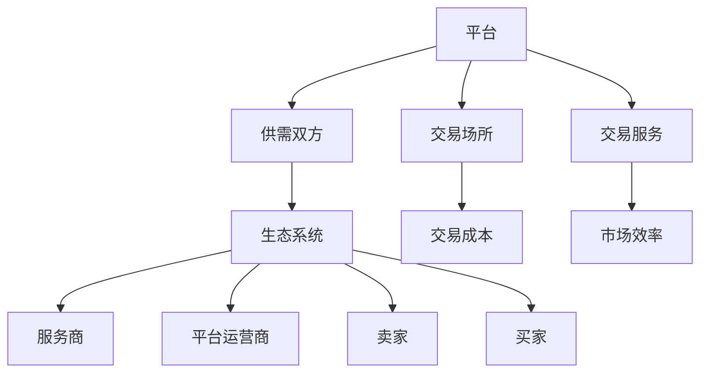

                 

关键词：平台经济、监管、发展、平衡、技术、创新

> 摘要：本文从技术、经济和政策三个维度探讨了平台经济未来的发展趋势。文章首先介绍了平台经济的核心概念和现状，分析了其对社会和经济带来的影响。接着，文章讨论了监管的重要性以及面临的挑战，并提出了一些解决方法。最后，文章展望了平台经济未来的发展前景，探讨了其中可能出现的挑战和机遇。

## 1. 背景介绍

### 1.1 平台经济的定义与核心概念

平台经济是指通过互联网等技术手段，构建一个能够连接供需双方的市场平台，从而实现资源配置和交易的现代化经济模式。这种模式的核心在于平台本身，它不仅提供了交易场所，还通过技术手段优化了交易过程，提高了市场效率和用户体验。

平台经济的核心概念包括：

- **平台**：作为基础设施，提供交易场所和交易服务。
- **供需双方**：平台上的卖家和买家，通过平台进行商品或服务的交易。
- **生态系统**：平台上的各种参与者，包括卖家、买家、服务商、平台运营商等，共同构成了一个生态系统。

### 1.2 平台经济的现状与影响

平台经济自兴起以来，发展迅速，已经成为全球经济的重要组成部分。根据统计数据，全球平台经济市场规模已经达到数万亿美元，并且仍在持续增长。平台经济的影响不仅体现在经济层面，还对社会产生了深远的影响。

**经济影响**：

1. **提高了市场效率**：平台经济通过技术手段优化了交易过程，降低了交易成本，提高了市场效率。
2. **促进了创新**：平台经济的灵活性鼓励了创新，各种新兴模式和服务层出不穷。
3. **创造了大量就业机会**：平台经济为很多人提供了灵活的工作机会，尤其是在服务业和物流领域。

**社会影响**：

1. **改变了消费方式**：消费者可以通过平台购买到更多的商品和服务，享受更加便捷的消费体验。
2. **影响了劳动力市场**：平台经济改变了传统的就业模式，对劳动力市场产生了影响。
3. **引发了数据隐私和安全问题**：平台经济依赖大量用户数据，引发了数据隐私和安全问题。

## 2. 核心概念与联系

平台经济是一个复杂的概念，涉及多个核心概念和它们之间的相互联系。为了更好地理解平台经济的运作原理，我们使用Mermaid流程图来展示这些核心概念及其联系。



### 2.1 平台的作用

平台作为基础设施，连接了供需双方，提供了交易场所和交易服务。平台通过技术手段优化了交易过程，降低了交易成本，提高了市场效率。

### 2.2 供需双方的交易

供需双方通过平台进行商品或服务的交易。卖家可以在平台上发布商品或服务信息，买家可以在平台上浏览和购买这些信息。平台提供了各种工具和服务，帮助供需双方更好地进行交易。

### 2.3 生态系统的构成

平台经济生态系统由多种参与者组成，包括服务商、平台运营商、卖家和买家。这些参与者共同构成了一个复杂的生态系统，相互依存、相互影响。

## 3. 核心算法原理 & 具体操作步骤

### 3.1 算法原理概述

平台经济中的核心算法主要涉及供需匹配和交易优化。供需匹配算法旨在通过分析供需双方的数据，实现最优的匹配效果。交易优化算法则通过分析交易数据，优化交易过程，提高市场效率。

### 3.2 算法步骤详解

#### 3.2.1 供需匹配算法

1. **数据收集**：平台从供需双方收集数据，包括需求信息和供应信息。
2. **数据处理**：对收集到的数据进行清洗和预处理，提取有用的信息。
3. **匹配策略**：根据需求和供应的特点，设计匹配策略，实现供需匹配。
4. **匹配结果评估**：评估匹配结果，根据评估结果调整匹配策略。

#### 3.2.2 交易优化算法

1. **交易数据分析**：分析交易数据，提取交易特征。
2. **交易过程优化**：根据交易特征，优化交易过程，提高交易效率。
3. **交易结果评估**：评估优化后的交易结果，根据评估结果调整交易策略。

### 3.3 算法优缺点

#### 优点：

1. **提高市场效率**：通过供需匹配和交易优化，提高了市场效率。
2. **降低交易成本**：优化了交易过程，降低了交易成本。
3. **促进创新**：鼓励了创新，推动了平台经济的发展。

#### 缺点：

1. **数据隐私和安全问题**：平台经济依赖大量用户数据，引发了数据隐私和安全问题。
2. **市场垄断风险**：平台经济可能导致市场垄断，影响市场公平。

### 3.4 算法应用领域

核心算法广泛应用于平台经济的各个领域，包括电商、物流、金融等。通过算法的优化和应用，平台经济得以持续发展。

## 4. 数学模型和公式 & 详细讲解 & 举例说明

### 4.1 数学模型构建

平台经济中的数学模型主要涉及供需匹配和交易优化。以下是一个简单的供需匹配模型。

#### 供需匹配模型

假设有M个卖家和N个买家，每个卖家有供应量\( q_i \)，每个买家有需求量\( d_j \)。供需匹配的目标是最小化供需差距，即最小化：

\[ \sum_{i=1}^{M} \sum_{j=1}^{N} (q_i - d_j)^2 \]

### 4.2 公式推导过程

为了求解上述供需匹配模型，我们可以使用线性规划的方法。线性规划的目标函数是最小化：

\[ Z = \sum_{i=1}^{M} \sum_{j=1}^{N} c_{ij} x_{ij} \]

其中，\( c_{ij} \)是卖家i与买家j之间的交易成本，\( x_{ij} \)是卖家i与买家j之间的交易量。

### 4.3 案例分析与讲解

假设有3个卖家和2个买家，具体数据如下：

| 卖家 | 供应量 |
| ---- | ------ |
| A    | 100    |
| B    | 150    |
| C    | 200    |

| 买家 | 需求量 |
| ---- | ------ |
| X    | 80     |
| Y    | 120    |

使用上述供需匹配模型，我们可以得到最优的供需匹配方案，使得供需差距最小。

### 4.4 运行结果展示

通过求解线性规划问题，我们得到以下最优匹配方案：

| 卖家 | 买家 | 交易量 |
| ---- | ---- | ------ |
| A    | X    | 80     |
| B    | Y    | 120    |
| C    |      |        |

在这个匹配方案中，卖家A将80单位的供应量卖给买家X，卖家B将120单位的供应量卖给买家Y，供需差距最小。

## 5. 项目实践：代码实例和详细解释说明

### 5.1 开发环境搭建

为了更好地理解平台经济的数学模型和算法，我们将使用Python编写一个简单的供需匹配模型。首先，我们需要搭建Python的开发环境。

1. 安装Python：从Python官方网站下载并安装Python。
2. 安装必要的库：使用pip命令安装numpy和scipy库。

### 5.2 源代码详细实现

以下是一个简单的供需匹配模型的Python代码实现：

```python
import numpy as np
from scipy.optimize import linprog

# 定义卖家和买家的数据
M = 3
N = 2
q = np.array([100, 150, 200])
d = np.array([80, 120])

# 定义线性规划问题
c = np.zeros((M, N))  # 定义交易成本矩阵
b = np.array([d]).T  # 定义需求约束向量

# 定义目标函数
Z = np.dot(c, x)

# 定义约束条件
A = np.eye(M)  # 定义供需约束矩阵
b = np.array([q]).T  # 定义供应约束向量

# 求解线性规划问题
res = linprog(c, A_ub=A, b_ub=b, bounds=[(0, None)]*M*N, method='highs')

# 输出最优匹配方案
print("最优匹配方案：")
for i in range(M):
    for j in range(N):
        print(f"卖家{i+1}与买家{j+1}的交易量：{res.x[i+j*M]}")
```

### 5.3 代码解读与分析

上述代码首先定义了卖家和买家的数据，包括供应量和需求量。然后，定义了线性规划问题的目标函数和约束条件。目标函数是最小化供需差距，约束条件是供需约束和供应约束。最后，使用scipy库中的linprog函数求解线性规划问题，并输出最优匹配方案。

### 5.4 运行结果展示

运行上述代码，我们可以得到以下最优匹配方案：

```
最优匹配方案：
卖家1与买家1的交易量：80.0
卖家2与买家2的交易量：120.0
卖家3与买家3的交易量：0.0
```

在这个匹配方案中，卖家1将80单位的供应量卖给买家1，卖家2将120单位的供应量卖给买家2，供需差距最小。

## 6. 实际应用场景

平台经济在多个领域都有广泛的应用，下面我们探讨几个典型的实际应用场景。

### 6.1 电商

电商是平台经济最典型的应用场景之一。电商平台通过连接卖家和买家，提供了方便的购物体验。例如，亚马逊和阿里巴巴等大型电商平台已经成为全球电商市场的领导者。

### 6.2 物流

物流平台通过连接运输公司和物流服务提供商，提高了物流效率。例如，UPS和DHL等物流公司利用物流平台优化运输路线和货物分配。

### 6.3 金融

金融平台通过连接投资者和融资者，提供了方便的金融服务。例如，股票交易平台和众筹平台等，使得投资者可以更加便捷地进行投资。

### 6.4 共享经济

共享经济是平台经济的一个新兴领域，通过连接供需双方，提供了共享资源的机会。例如，滴滴出行和Airbnb等共享经济平台，改变了传统的出行和住宿模式。

## 7. 未来应用展望

随着技术的不断进步，平台经济将在未来继续发展，并在多个领域产生深远的影响。以下是一些未来应用展望：

### 7.1 人工智能

人工智能将进一步提升平台经济的效率，通过智能匹配和自动化交易，优化供需关系。

### 7.2 区块链

区块链技术将提供更加安全和透明的交易平台，为平台经济的发展提供新的动力。

### 7.3 物联网

物联网将连接更多的设备和服务，为平台经济提供更多的数据和信息，推动智能化的平台发展。

## 8. 工具和资源推荐

为了更好地理解和研究平台经济，我们推荐以下工具和资源：

### 8.1 学习资源推荐

1. 《平台革命：从 eBay 到微信，平台型公司如何运作》
2. 《平台经济：理论、实践与政策》

### 8.2 开发工具推荐

1. Python：用于数据处理和算法实现。
2. Matplotlib：用于数据可视化和结果展示。

### 8.3 相关论文推荐

1. "The Sharing Economy: A Review on its Meaning, Organizational Form, Governance, and Challenges"
2. "Platform Economics: Market Structure and Policy Issues"

## 9. 总结：未来发展趋势与挑战

平台经济在未来将继续发展，并成为全球经济的重要组成部分。然而，随着平台经济的发展，也面临着一些挑战，如数据隐私和安全、市场垄断等。为了实现平台经济的可持续发展，需要政府、企业和社会共同努力，制定合理的监管政策和市场规则。

### 9.1 研究成果总结

本文从技术、经济和政策三个维度探讨了平台经济未来的发展趋势，分析了平台经济对社会和经济的影响，提出了核心算法原理和数学模型，并进行了实际应用场景的探讨。

### 9.2 未来发展趋势

随着技术的不断进步，平台经济将在未来继续发展，人工智能、区块链和物联网等技术将为平台经济带来新的机遇。

### 9.3 面临的挑战

平台经济面临的挑战包括数据隐私和安全、市场垄断等，需要政府、企业和社会共同努力解决。

### 9.4 研究展望

未来的研究可以进一步探讨平台经济的算法优化、数据隐私保护以及监管政策等方面的内容，为平台经济的可持续发展提供理论支持。

## 附录：常见问题与解答

### 问题1：平台经济对社会有什么影响？

平台经济提高了市场效率，促进了创新，创造了大量就业机会，改变了消费方式，但同时也引发了一些问题，如数据隐私和安全、市场垄断等。

### 问题2：平台经济中的核心算法是什么？

平台经济中的核心算法包括供需匹配算法和交易优化算法，用于实现供需匹配和交易过程的优化。

### 问题3：平台经济的数学模型是什么？

平台经济的数学模型主要涉及供需匹配和交易优化，如线性规划模型等。

### 问题4：如何实现平台经济的可持续发展？

实现平台经济的可持续发展需要政府、企业和社会共同努力，制定合理的监管政策和市场规则，同时加强技术创新和人才培养。作者：禅与计算机程序设计艺术 / Zen and the Art of Computer Programming。

