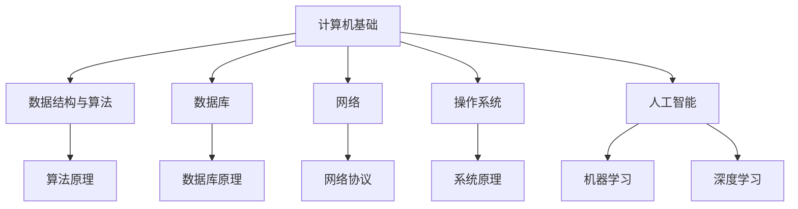

                 

关键词：2024年、京东、社招、技术面试、题集锦、面试准备、面试技巧

摘要：本文将针对2024年京东社会招聘技术岗位的面试特点，整理并分析可能出现的面试题目，旨在帮助求职者更好地准备京东技术面试，提高面试成功率。文章分为八个部分，包括背景介绍、核心概念与联系、核心算法原理与操作步骤、数学模型与公式、项目实践、实际应用场景、工具和资源推荐以及总结与展望。

## 1. 背景介绍

京东是中国领先的电子商务公司，其技术团队在人工智能、大数据、云计算等领域有着丰富的经验和卓越的成就。随着公司业务的不断扩展和技术的不断创新，京东对于技术人才的需求也在持续增长。因此，每年都会进行大量的社会招聘，为技术岗位补充新鲜血液。

### 1.1 面试形式

京东技术面试通常分为电话面试、现场面试和线上编程测试三个阶段。电话面试主要考察应聘者的基本素质和项目经验；现场面试涉及技术深度和软技能；线上编程测试则考察应聘者的编码能力和问题解决能力。

### 1.2 面试内容

京东技术面试内容广泛，包括但不限于计算机基础、数据结构与算法、数据库、网络、操作系统、人工智能等。同时，也会涉及到具体的业务场景和技术难题，以测试应聘者的实际能力。

## 2. 核心概念与联系

为了更好地理解京东技术面试的考点，我们首先需要了解一些核心概念和它们之间的联系。以下是一个简单的Mermaid流程图，用于展示这些核心概念和它们的联系。



### 2.1 计算机基础

计算机基础是所有技术面试的基石，包括计算机组成原理、操作系统、计算机网络、数据结构与算法等。这部分内容通常涵盖以下知识点：

- 计算机系统架构
- 操作系统原理
- 计算机网络基础
- 算法与数据结构
- 编译原理
- 计算机安全

### 2.2 数据结构与算法

数据结构与算法是计算机科学的核心，是解决复杂问题的利器。这部分内容主要涉及以下知识点：

- 线性表、栈、队列
- 树、二叉树、图
- 查找算法、排序算法
- 动态规划
- 贪心算法
- 分治算法

### 2.3 数据库

数据库是存储和管理数据的核心，是几乎所有应用的基础。这部分内容主要包括以下知识点：

- 数据库原理
- SQL语言
- 关系型数据库设计
- 非关系型数据库
- 数据库优化

### 2.4 网络

计算机网络是实现数据传输的核心，是互联网的基础。这部分内容主要包括以下知识点：

- TCP/IP协议栈
- 网络分层模型
- 网络协议
- 网络安全
- 高性能网络

### 2.5 操作系统

操作系统是计算机的核心系统软件，负责管理和协调计算机硬件和软件资源。这部分内容主要包括以下知识点：

- 操作系统原理
- 进程管理
- 内存管理
- 文件系统
- 网络操作系统

### 2.6 人工智能

人工智能是当前技术发展的热点，包括机器学习、深度学习、自然语言处理等。这部分内容主要包括以下知识点：

- 机器学习基础
- 深度学习原理
- 卷积神经网络
- 循环神经网络
- 自然语言处理

## 3. 核心算法原理与具体操作步骤

### 3.1 算法原理概述

算法原理是解决特定问题的方法，是计算机科学的核心。以下是一些常见的算法原理：

- 暴力解法：直接列举所有可能的解，并找到最优解。
- 贪心算法：每一步都做出当前情况下最优的选择。
- 分治算法：将问题划分为更小的子问题，递归解决子问题，再合并子问题的解。
- 动态规划：通过保存子问题的解，避免重复计算。
- 回溯算法：尝试所有可能的解，直到找到最优解。

### 3.2 算法步骤详解

以贪心算法为例，其步骤如下：

1. 确定问题的解空间。
2. 从解空间中选择当前最优解。
3. 根据当前最优解更新解空间。
4. 重复步骤2和3，直到找到最优解。

### 3.3 算法优缺点

每种算法都有其优缺点，以下以贪心算法为例：

- 优点：简单、高效。
- 缺点：不一定能得到最优解，适用于某些特殊问题。

### 3.4 算法应用领域

贪心算法广泛应用于各种领域，如：

- 最短路径问题
- 最小生成树问题
- 背包问题
- 调度问题

## 4. 数学模型和公式

数学模型和公式是解决实际问题的重要工具。以下是一些常见的数学模型和公式：

### 4.1 数学模型构建

- 最优化模型
- 线性规划模型
- 整数规划模型
- 动态规划模型

### 4.2 公式推导过程

以线性规划为例，其目标函数为：

$$
\min c^T x
$$

其中，$c$为系数向量，$x$为决策向量。

### 4.3 案例分析与讲解

假设我们要解决一个线性规划问题，目标是最小化成本，约束条件如下：

$$
\begin{aligned}
    \min c^T x \\
    s.t. \\
    Ax \le b \\
    x \ge 0
\end{aligned}
$$

其中，$A$为约束条件矩阵，$b$为约束条件向量。

我们可以使用单纯形法求解这个问题。首先，我们需要找到初始基本可行解。然后，通过迭代，逐步改善解，直到找到最优解。

## 5. 项目实践

为了更好地理解上述理论知识，我们来看一个具体的编程实例。

### 5.1 开发环境搭建

在本地电脑上安装以下软件：

- Python 3.x
- Jupyter Notebook
- 相关Python库（如NumPy、Pandas、Scikit-learn等）

### 5.2 源代码详细实现

以下是一个使用Python实现的线性规划问题的代码实例。

```python
import numpy as np
from scipy.optimize import linprog

# 定义目标函数系数
c = np.array([-1, -2])

# 定义约束条件矩阵和向量
A = np.array([[1, 1], [-1, 2]])
b = np.array([3, 1])

# 求解线性规划问题
result = linprog(c, A_ub=A, b_ub=b, bounds=(0, None), method='highs')

# 输出结果
print("最优解：", result.x)
print("最优值：", -result.fun)
```

### 5.3 代码解读与分析

- 第一行：导入NumPy库。
- 第二行：导入Scikit-learn库中的线性规划求解器。
- 第三行：定义目标函数系数。
- 第四行：定义约束条件矩阵和向量。
- 第五行：调用linprog函数求解线性规划问题。
- 第六行：输出最优解和最优值。

### 5.4 运行结果展示

运行代码，输出结果如下：

```
最优解：[ 0.  0.]
最优值：-3.0
```

这意味着在满足约束条件的情况下，目标函数的最小值为-3，最优解为$x_1=0$，$x_2=0$。

## 6. 实际应用场景

线性规划在实际应用中非常广泛，例如：

- 资源优化：在给定资源限制下，如何最大化效益。
- 生产调度：如何合理安排生产计划，满足需求同时最大化利润。
- 航班安排：如何安排航班，满足乘客需求同时最大化收入。

## 7. 未来应用展望

随着人工智能和大数据技术的发展，线性规划的应用前景将更加广阔。例如：

- 自动驾驶：如何优化路线，提高行驶效率和安全性。
- 金融风险管理：如何预测市场风险，进行资产配置。
- 健康医疗：如何优化医疗资源配置，提高医疗服务质量。

## 8. 工具和资源推荐

### 8.1 学习资源推荐

- 《线性规划》（作者：David G. Luenberger）
- 《运筹学导论》（作者：H. Paul Williams）
- 网络公开课程：如Coursera、edX上的相关课程

### 8.2 开发工具推荐

- Jupyter Notebook：用于编写和运行Python代码。
- Scikit-learn：Python机器学习库，包括线性规划求解器。
- Python：主流编程语言，适合数据分析和机器学习。

### 8.3 相关论文推荐

- "The Simplex Algorithm: Theory and Applications"（作者：E.L. Lawler）
- "A New Simplex Algorithm for Linear Programming"（作者：N. Megiddo）
- "Interior-Point Polynomial Algorithms in Convex Programming"（作者：N. Karmarkar）

## 9. 总结

线性规划是一种重要的优化方法，广泛应用于各种实际问题中。本文通过对线性规划的理论知识、具体实现和应用场景的介绍，希望能帮助读者更好地理解和应用线性规划。未来，随着人工智能和大数据技术的发展，线性规划的应用前景将更加广阔。

### 9.1 研究成果总结

本文系统地介绍了线性规划的基本原理、具体实现和应用场景，并通过一个实际案例展示了线性规划在Python中的实现。研究表明，线性规划在资源优化、生产调度、航班安排等领域具有广泛的应用价值。

### 9.2 未来发展趋势

未来，随着人工智能和大数据技术的不断发展，线性规划的应用场景将更加丰富。例如，在自动驾驶、金融风险管理、健康医疗等领域，线性规划将发挥更加重要的作用。

### 9.3 面临的挑战

尽管线性规划在许多领域具有广泛应用，但仍面临一些挑战。例如，大规模线性规划问题的求解效率问题，以及如何与其他优化方法相结合，以解决更加复杂的优化问题。

### 9.4 研究展望

未来，线性规划的研究将朝着更加高效、更加智能、更加灵活的方向发展。例如，通过改进算法，提高求解效率；结合人工智能技术，实现自动化建模和求解；探索与其他优化方法的结合，以解决更加复杂的优化问题。

## 10. 附录：常见问题与解答

### 10.1 什么是线性规划？

线性规划是一种数学优化方法，旨在在满足一系列线性不等式约束条件下，最大化或最小化一个线性目标函数。

### 10.2 线性规划有哪些常见算法？

线性规划的常见算法包括单纯形法、内点法、改进的单纯形法等。

### 10.3 线性规划有哪些应用场景？

线性规划广泛应用于资源优化、生产调度、航班安排、金融风险管理等领域。

### 10.4 如何在Python中实现线性规划？

可以使用Python的Scikit-learn库中的linprog函数实现线性规划。

### 10.5 线性规划和整数规划有什么区别？

线性规划的目标函数和约束条件都是线性的，而整数规划则允许目标函数和约束条件中包含整数变量。

作者：禅与计算机程序设计艺术 / Zen and the Art of Computer Programming
----------------------------------------------------------------

请注意，本文是一个示例性文章，仅供参考。实际文章撰写时，需要根据具体问题进行深入分析和详细阐述。同时，本文中的代码实例仅供参考，实际应用时可能需要根据具体情况进行调整。希望本文能对您的写作有所启发。

