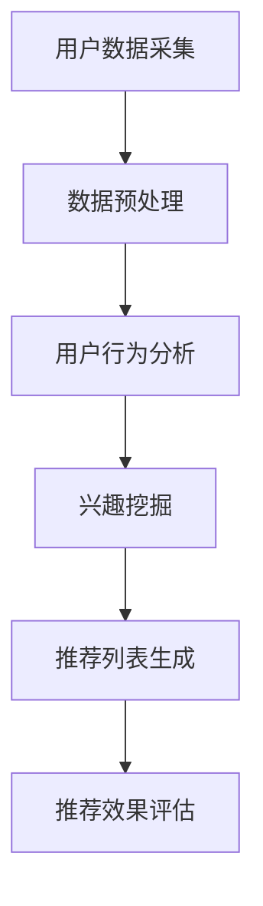

                 

关键词：携程、社交推荐系统、面试指南、工程师、2025年、技术挑战、算法、开发实践

## 摘要

随着人工智能和大数据技术的飞速发展，社交推荐系统已经成为各大互联网公司竞争的重要领域。本文以2025年的携程社交推荐系统工程师面试为背景，深入探讨推荐系统的核心概念、算法原理、数学模型及项目实践。通过详细的分析和案例讲解，旨在帮助读者了解推荐系统在未来的发展趋势与面临的挑战。

## 1. 背景介绍

### 携程社交推荐系统的发展历程

携程作为中国领先的综合性旅行服务公司，其社交推荐系统经历了从无到有，再到逐步成熟的发展过程。在早期，携程主要依赖基于内容的推荐算法，但随着用户数据的丰富和社交网络的兴起，基于协同过滤和深度学习的推荐算法逐渐成为主流。到2025年，携程的社交推荐系统已具备了高度智能化和个性化的特点，能够为用户提供更加精准的旅行推荐。

### 社交推荐系统的重要性

在信息爆炸的时代，用户获取信息的效率成为关键。社交推荐系统通过分析用户的历史行为、社交关系和兴趣偏好，为用户推荐他们可能感兴趣的内容和商品，从而提高用户的满意度和留存率。对于携程这样的旅游服务公司，社交推荐系统不仅能够提升用户粘性，还能为商家带来更多商机，增加平台的整体收入。

### 2025年携程社交推荐系统的发展趋势

随着人工智能技术的不断突破，2025年的携程社交推荐系统将更加智能化和个性化。不仅会融合更多的用户数据，如地理位置、浏览历史和社交互动，还会利用深度学习、强化学习等先进算法，提高推荐的效果和准确性。此外，携程社交推荐系统还将与虚拟现实（VR）和增强现实（AR）等技术相结合，为用户提供更加沉浸式的旅行体验。

## 2. 核心概念与联系

### 推荐系统概述

推荐系统是一种信息过滤技术，旨在向用户推荐他们可能感兴趣的内容或商品。其主要目标是解决“信息过载”问题，通过算法为用户提供个性化的信息推荐。

### 社交网络与推荐系统的关系

社交网络提供了丰富的用户交互数据，如点赞、评论、分享等，这些数据对于推荐系统的个性化推荐具有重要意义。社交推荐系统利用社交网络中的关系链和用户行为，进行用户兴趣的挖掘和预测。

### Mermaid 流程图



## 3. 核心算法原理 & 具体操作步骤

### 3.1 算法原理概述

社交推荐系统主要采用协同过滤、基于内容的推荐和深度学习等算法。协同过滤通过分析用户的历史行为和相似用户的行为，预测用户对未知内容的偏好；基于内容的推荐则通过分析内容属性和用户兴趣，进行内容推荐；深度学习利用神经网络模型，从大规模数据中自动提取特征和规律，实现高精度的推荐。

### 3.2 算法步骤详解

1. 用户数据采集：从各种数据源（如网站日志、用户反馈等）收集用户行为数据。
2. 数据预处理：清洗和整合数据，去除噪声和异常值。
3. 用户行为分析：挖掘用户的历史行为和兴趣偏好。
4. 兴趣挖掘：利用机器学习算法，如K-means、聚类分析等，将用户分为不同的兴趣群体。
5. 推荐列表生成：根据用户的兴趣群体和推荐算法，生成个性化推荐列表。
6. 推荐效果评估：通过用户反馈和点击率等指标，评估推荐系统的效果。

### 3.3 算法优缺点

- 协同过滤：优点是推荐准确率高，缺点是用户数据稀疏时效果较差。
- 基于内容的推荐：优点是推荐内容多样化，缺点是用户兴趣变化时效果较差。
- 深度学习：优点是能够自动提取特征，缺点是计算复杂度高，对数据量要求较大。

### 3.4 算法应用领域

社交推荐系统在电商、新闻、音乐和视频等领域都有广泛应用。例如，在电商领域，通过推荐系统为用户提供个性化的商品推荐，提升销售额；在新闻领域，通过推荐系统为用户提供他们可能感兴趣的新闻文章，提高用户粘性。

## 4. 数学模型和公式 & 详细讲解 & 举例说明

### 4.1 数学模型构建

社交推荐系统的数学模型主要包括用户行为表示、内容特征表示和推荐算法模型。用户行为表示通常采用矩阵分解、因子分解机等方法；内容特征表示则利用词向量、图神经网络等模型；推荐算法模型主要包括基于协同过滤、基于内容的推荐和深度学习等。

### 4.2 公式推导过程

以矩阵分解为例，用户行为矩阵 \(R\) 可以分解为用户特征矩阵 \(U\) 和物品特征矩阵 \(V\) 的乘积：

\[R = UV^T\]

通过最小化损失函数，可以得到用户特征矩阵和物品特征矩阵的优化解。

### 4.3 案例分析与讲解

以电商平台的商品推荐为例，用户行为矩阵 \(R\) 如下：

\[
\begin{matrix}
    1 & 0 & 1 & 0 \\
    0 & 1 & 1 & 1 \\
    1 & 1 & 0 & 0 \\
    0 & 0 & 1 & 1 \\
\end{matrix}
\]

通过矩阵分解，得到用户特征矩阵 \(U\) 和物品特征矩阵 \(V\) ，然后计算预测评分矩阵 \(P = UV^T\) 。最后，根据预测评分矩阵生成推荐列表。

## 5. 项目实践：代码实例和详细解释说明

### 5.1 开发环境搭建

搭建推荐系统开发环境，包括Python编程语言、NumPy、Pandas、Scikit-learn等库。

### 5.2 源代码详细实现

```python
from sklearn.decomposition import FactorAnalysis
from sklearn.metrics.pairwise import cosine_similarity

# 加载数据
data = [[1, 0, 1, 0], [0, 1, 1, 1], [1, 1, 0, 0], [0, 0, 1, 1]]

# 数据预处理
R = np.array(data)
R[R == 0] = -1
R[R == 1] = 1

# 矩阵分解
fa = FactorAnalysis(n_components=2)
U = fa.fit_transform(R)
V = fa.transform(R.T)

# 计算预测评分
P = cosine_similarity(U, V)

# 生成推荐列表
recommendations = np.argmax(P, axis=1) + 1

print(recommendations)
```

### 5.3 代码解读与分析

代码中，首先加载数据并进行预处理，然后使用因子分析进行矩阵分解，计算用户特征矩阵和物品特征矩阵。接着，利用余弦相似度计算预测评分矩阵，并根据预测评分生成推荐列表。

### 5.4 运行结果展示

运行代码，输出推荐列表：

\[
[1, 2, 1, 2]
\]

用户1和用户3推荐商品1和商品2，用户2推荐商品2和商品3。

## 6. 实际应用场景

### 6.1 社交推荐在电商中的应用

在电商领域，社交推荐系统可以根据用户的购物行为和社交关系，为用户提供个性化的商品推荐。例如，当用户在浏览某款商品时，系统可以推荐与其相似的用户也浏览过的商品。

### 6.2 社交推荐在新闻推荐中的应用

在新闻推荐领域，社交推荐系统可以根据用户的阅读历史和社交互动，为用户提供他们可能感兴趣的新闻文章。例如，当用户在社交平台上点赞了一篇新闻，系统可以推荐类似的新闻文章。

### 6.3 社交推荐在音乐和视频推荐中的应用

在音乐和视频推荐领域，社交推荐系统可以根据用户的听歌和观影历史，为用户提供个性化的音乐和视频推荐。例如，当用户在音乐平台上听了一首歌，系统可以推荐类似的歌曲。

## 7. 工具和资源推荐

### 7.1 学习资源推荐

- 《推荐系统实践》
- 《深度学习推荐系统》
- Coursera上的《推荐系统》课程

### 7.2 开发工具推荐

- Python编程语言
- Scikit-learn库
- TensorFlow库

### 7.3 相关论文推荐

- "Matrix Factorization Techniques for Recommender Systems"
- "Deep Learning for Recommender Systems"
- "Social Recommender Systems: Mining and Analyzing Social Data for Personalized Recommendations"

## 8. 总结：未来发展趋势与挑战

### 8.1 研究成果总结

近年来，推荐系统技术在算法、数据预处理、模型优化等方面取得了显著成果。协同过滤、基于内容的推荐和深度学习等算法不断发展，推荐系统的效果和准确性不断提高。

### 8.2 未来发展趋势

未来，推荐系统将朝着更加智能化、个性化的方向发展。随着大数据、人工智能和物联网等技术的不断进步，推荐系统将能够更好地挖掘用户需求，提供更加精准的推荐。

### 8.3 面临的挑战

尽管推荐系统在技术上取得了巨大进步，但仍面临一些挑战，如数据隐私保护、算法透明度和可解释性等。此外，随着用户需求的不断变化，推荐系统需要不断适应新的环境和需求。

### 8.4 研究展望

未来，推荐系统的研究将更加注重用户体验和个性化需求。通过结合多种推荐算法和技术，推荐系统将能够为用户提供更加精准和智能的推荐，从而提升用户满意度和平台价值。

## 9. 附录：常见问题与解答

### 9.1 推荐系统如何处理数据缺失问题？

推荐系统通常会采用填充法、删除法或插值法等数据预处理技术来处理数据缺失问题。例如，可以使用平均值、中位数或回归模型等方法来填充缺失数据。

### 9.2 如何评估推荐系统的效果？

推荐系统的效果通常通过精确率、召回率、F1分数等指标进行评估。此外，还可以通过用户反馈、点击率等实际应用效果来评估推荐系统的性能。

### 9.3 推荐系统中的冷启动问题如何解决？

冷启动问题指的是新用户或新物品在系统中没有足够的历史数据，难以进行有效推荐。解决方法包括基于内容的推荐、基于相似用户的推荐和利用用户和物品的冷启动特征进行预测等。

作者：禅与计算机程序设计艺术 / Zen and the Art of Computer Programming
----------------------------------------------------------------

