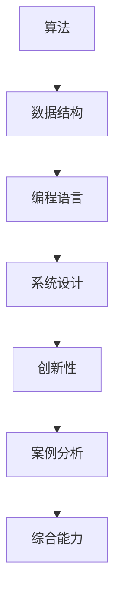

                 

关键词：2025年百度校招、算法面试、面试题库、答案解析

摘要：本文将详细介绍2025年百度校招的算法面试题库及答案，帮助求职者更好地准备面试，提高通过率。文章涵盖了算法面试的核心概念、核心算法原理、数学模型和公式、项目实践、实际应用场景以及未来发展趋势与挑战等内容。

## 1. 背景介绍

随着人工智能技术的快速发展，百度作为中国领先的人工智能公司，其校招算法面试已经成为众多求职者的关注焦点。本文旨在梳理2025年百度校招算法面试的常见题目及答案，帮助求职者更好地应对面试，提升竞争力。

### 1.1 百度校招算法面试的特点

- **技术深度**：百度校招算法面试问题通常具有较高的技术深度，涉及各类经典算法和数据结构。
- **案例分析**：面试题目往往结合具体案例进行分析，考察应聘者的实际应用能力。
- **创新性**：面试题目鼓励创新思维，考察应聘者解决问题的能力。
- **综合能力**：除了算法和数据结构，面试还可能涉及编程语言、系统设计等方面。

### 1.2 面试准备策略

- **算法基础**：掌握常见的算法和数据结构，如排序、搜索、图论等。
- **编程能力**：熟练掌握至少一种编程语言，如C++、Python等。
- **项目经验**：积累实际项目经验，能够结合具体案例进行讲解。
- **逻辑思维**：锻炼逻辑思维能力，能够清晰、有条理地表达自己的观点。

## 2. 核心概念与联系

为了更好地理解百度校招算法面试的核心概念，我们可以使用Mermaid流程图来展示各概念之间的关系。

### 2.1 算法

算法是计算机解决特定问题的方法步骤，是算法面试的核心。常见的算法有排序算法、搜索算法、图算法等。

### 2.2 数据结构

数据结构是存储和管理数据的方式，是算法的基础。常见的数据结构有数组、链表、树、图等。

### 2.3 编程语言

编程语言是编写算法的工具，是面试的基本要求。常见的编程语言有C++、Python、Java等。

### 2.4 系统设计

系统设计是解决复杂问题的过程，涉及到系统的整体架构和各个模块的设计。

### 2.5 创新性

创新性是考察应聘者解决新问题或改进现有问题的能力，是面试的重要方面。

### 2.6 案例分析

案例分析是结合具体问题进行分析和解决，考察应聘者的实际应用能力。

### 2.7 综合能力

综合能力是考察应聘者多方面素质的综合体现，包括逻辑思维、沟通能力、团队协作等。

## 3. 核心算法原理 & 具体操作步骤

### 3.1 算法原理概述

算法原理是算法的核心，是解决问题的关键。常见的算法原理包括贪心算法、动态规划、分治算法等。

### 3.2 算法步骤详解

算法步骤是算法实现的具体过程，是面试的重点。以下以排序算法为例进行说明：

- **冒泡排序**：通过反复遍历要排序的数列，一次比较两个元素，如果他们的顺序错误就把他们交换过来。遍历数列的工作是重复进行直到没有再需要交换，也就是说该数列已经排序完成。
- **选择排序**：首先在未排序序列中找到最小（大）元素，存放到排序序列的起始位置，然后，再从剩余未排序元素中继续寻找最小（大）元素，然后放到已排序序列的末尾。以此类推，直到所有元素均排序完毕。
- **插入排序**：通过构建有序序列，对于未排序数据，在已排序序列中从后向前扫描，找到相应位置并插入。

### 3.3 算法优缺点

每种算法都有其优缺点，面试中需要根据具体问题选择合适的算法。以下以冒泡排序为例：

- **优点**：实现简单，易于理解。
- **缺点**：时间复杂度高，不适合大规模数据处理。

### 3.4 算法应用领域

算法广泛应用于各个领域，如搜索引擎、推荐系统、图像处理等。以下以排序算法在搜索引擎中的应用为例：

- **搜索引擎**：通过排序算法对搜索结果进行排序，提高用户体验。

## 4. 数学模型和公式 & 详细讲解 & 举例说明

### 4.1 数学模型构建

数学模型是算法的理论基础，是解决问题的关键。以下以动态规划为例进行说明：

动态规划的核心思想是将复杂问题分解为若干个子问题，并利用子问题的解构建原问题的解。

### 4.2 公式推导过程

动态规划的基本公式为：

\[ f(i) = \min_{j \leq i} (f(j) + c(i, j)) \]

其中，\( f(i) \) 表示第 \( i \) 个子问题的最优解，\( c(i, j) \) 表示从子问题 \( j \) 到子问题 \( i \) 的代价。

### 4.3 案例分析与讲解

以下以最长公共子序列（LC

