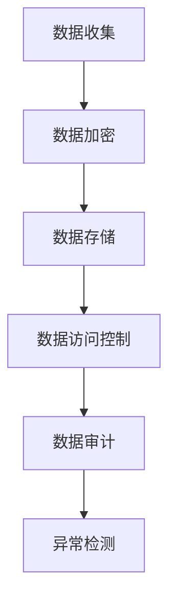

                 

关键词：数据安全、隐私保护、信息加密、AI、区块链、未来趋势

> 摘要：本文将探讨2050年个人隐私保护的前景，从数据安全、信息加密、AI技术、区块链等多个维度分析当前的技术发展及其对隐私保护的影响，并提出未来的研究方向和挑战。

## 1. 背景介绍

随着信息技术的飞速发展，数据已经成为新时代的石油，个人隐私信息的价值日益凸显。然而，在享受数字生活便利的同时，隐私泄露的风险也日益增加。根据国际数据公司(IDC)的报告，全球每年因数据泄露导致的损失高达数十亿美元。随着AI和区块链技术的应用，个人隐私保护面临着前所未有的挑战和机遇。

## 2. 核心概念与联系

### 2.1 数据安全

数据安全是指保护数据免受未经授权的访问、使用、披露、破坏、修改、破坏和丢失。在数据安全体系中，主要涉及以下核心概念：

- **身份认证**：确保只有授权用户才能访问数据。
- **访问控制**：控制用户对数据的访问权限。
- **加密**：将数据转换为只有授权用户才能解读的形式。
- **审计**：记录和监控数据的访问和使用情况。

### 2.2 信息加密

信息加密是将信息转换为密文的过程，只有解密后才能恢复明文信息。在信息加密中，核心概念包括：

- **密钥管理**：确保密钥的安全存储和分发。
- **加密算法**：实现数据加密和解密的核心技术。
- **加密层次**：从数据传输到存储的不同层次应用加密。

### 2.3 AI技术

AI技术，特别是深度学习，已经在图像识别、自然语言处理等领域取得了显著成果。AI技术对隐私保护的影响主要体现在：

- **隐私泄露风险**：AI模型在训练过程中可能会无意中泄露敏感信息。
- **隐私增强技术**：利用AI技术实现隐私保护，如差分隐私、联邦学习等。

### 2.4 区块链技术

区块链技术以其去中心化、不可篡改的特性，在隐私保护领域展示了巨大潜力。区块链技术核心概念包括：

- **分布式账本**：确保数据在多个节点之间同步和共享。
- **智能合约**：自动执行合同条款，提高隐私保护效率。
- **隐私币**：如比特币、门罗币等，提供匿名交易。

### 2.5 Mermaid流程图



## 3. 核心算法原理 & 具体操作步骤

### 3.1 算法原理概述

隐私保护的核心在于数据的安全存储、传输和使用。以下是几种常用的隐私保护算法原理：

- **同态加密**：允许在密文中执行计算，而无需解密。
- **差分隐私**：通过添加噪声来隐藏数据中的敏感信息。
- **联邦学习**：在多个节点之间共享模型参数，避免数据泄露。

### 3.2 算法步骤详解

#### 同态加密

1. **密钥生成**：使用加密算法生成公钥和私钥。
2. **数据加密**：将明文数据加密为密文。
3. **计算操作**：在密文中执行计算。
4. **解密结果**：使用私钥将结果解密为明文。

#### 差分隐私

1. **数据收集**：收集包含敏感信息的原始数据。
2. **添加噪声**：对数据进行扰动，添加噪声。
3. **计算统计量**：对添加噪声后的数据进行分析。
4. **结果验证**：确保结果满足隐私保护要求。

#### 联邦学习

1. **模型初始化**：初始化共享模型。
2. **本地训练**：每个节点在本地对模型进行训练。
3. **参数聚合**：将每个节点的模型参数聚合。
4. **更新模型**：使用聚合参数更新共享模型。

### 3.3 算法优缺点

#### 同态加密

- **优点**：无需解密即可在密文中执行计算。
- **缺点**：计算复杂度较高，加密和解密速度较慢。

#### 差分隐私

- **优点**：可以有效保护敏感信息。
- **缺点**：可能会影响数据分析的准确性。

#### 联邦学习

- **优点**：无需共享原始数据，保护隐私。
- **缺点**：计算复杂度较高，模型训练时间较长。

### 3.4 算法应用领域

- **同态加密**：数据库加密、云计算安全等。
- **差分隐私**：数据分析、用户隐私保护等。
- **联邦学习**：医疗数据分析、智能交通等。

## 4. 数学模型和公式 & 详细讲解 & 举例说明

### 4.1 数学模型构建

#### 同态加密

设\(E(\cdot)\)为加密函数，\(D(\cdot)\)为解密函数，密钥为\((\mathbf{K}_c, \mathbf{K}_d)\)。对于任意明文数据\(\mathbf{x}\)和计算函数\(f(\cdot)\)，同态加密的数学模型为：

$$
\mathbf{y} = E(\mathbf{x}, \mathbf{K}_c)
$$

$$
\mathbf{z} = f(\mathbf{y})
$$

$$
\mathbf{x'} = D(\mathbf{z}, \mathbf{K}_d)
$$

其中，\(\mathbf{x'} = f(\mathbf{x})\)。

#### 差分隐私

设\(L\)为敏感数据的真实值，\(N\)为添加的噪声，\(\mathbf{L} + N\)为扰动后的数据。差分隐私的数学模型为：

$$
\epsilon(\mathbf{L}) = \sum_{\mathbf{l} \in \mathcal{L}} \frac{P(\mathbf{l} + N)}{P(\mathbf{L} + N)}
$$

其中，\(P(\cdot)\)为概率分布函数。

#### 联邦学习

设\(M_i\)为第\(i\)个节点的本地模型，\(M\)为共享模型。联邦学习的数学模型为：

$$
M = \arg\min_{M_i} \sum_{i=1}^{N} \frac{1}{N} \sum_{j=1}^{N} L_j(\mathbf{w}_i - \mathbf{w}_j)
$$

其中，\(L_j(\cdot)\)为损失函数，\(\mathbf{w}_i\)为第\(i\)个节点的模型参数。

### 4.2 公式推导过程

此处仅以差分隐私为例，简单说明公式推导过程。

对于差分隐私，我们考虑两个相邻的敏感数据\(L\)和\(L'\)，以及对应的扰动后数据\(\mathbf{L} + N\)和\(\mathbf{L'} + N\)。差分隐私的定义可以表示为：

$$
\epsilon(\mathbf{L}) = \frac{P(\mathbf{L} + N)}{P(\mathbf{L'} + N)}
$$

为了简化计算，我们假设噪声\(N\)服从均匀分布，即\(P(N) = \frac{1}{\lvert N \rvert}\)。此时，我们可以推导出：

$$
\epsilon(\mathbf{L}) = \frac{\int_{\mathbf{l}} P(\mathbf{L} + N) d\mathbf{N}}{\int_{\mathbf{l'}} P(\mathbf{L'} + N) d\mathbf{N}}
$$

由于\(P(N)\)为常数，我们可以将其提到积分号外，得到：

$$
\epsilon(\mathbf{L}) = \frac{\int_{\mathbf{l}} P(\mathbf{L} + N) d\mathbf{N}}{\int_{\mathbf{l'}} P(\mathbf{L'} + N) d\mathbf{N}} = \frac{\int_{\mathbf{l}} P(\mathbf{L} + N) P(N) d\mathbf{N}}{\int_{\mathbf{l'}} P(\mathbf{L'} + N) P(N) d\mathbf{N}}
$$

由于\(P(N)\)为常数，我们可以将其提到积分号外，得到：

$$
\epsilon(\mathbf{L}) = \frac{\int_{\mathbf{l}} P(\mathbf{L} + N) d\mathbf{N}}{\int_{\mathbf{l'}} P(\mathbf{L'} + N) d\mathbf{N}}
$$

### 4.3 案例分析与讲解

#### 同态加密在数据库加密中的应用

假设我们有一个数据库，其中存储了客户的个人信息，包括姓名、地址、电话号码等。为了保护这些敏感信息，我们可以使用同态加密技术。

1. **密钥生成**：首先，我们需要生成一对密钥\((\mathbf{K}_c, \mathbf{K}_d)\)。
2. **数据加密**：将客户的个人信息加密为密文。
3. **计算操作**：在密文中执行查询操作，如“查找住在北京市的客户”。
4. **解密结果**：使用私钥将查询结果解密为明文。

通过这种方式，数据库管理员可以在不泄露客户个人信息的情况下执行查询操作，从而确保数据的安全。

#### 差分隐私在用户数据分析中的应用

假设我们有一组用户数据，包括年龄、收入、地理位置等信息。为了保护用户的隐私，我们可以使用差分隐私技术。

1. **数据收集**：收集包含敏感信息的原始数据。
2. **添加噪声**：对每个用户的年龄、收入等数据进行扰动，添加噪声。
3. **计算统计量**：对添加噪声后的数据进行分析，如“平均年龄”。
4. **结果验证**：确保结果满足隐私保护要求。

通过这种方式，我们可以从用户数据中提取有价值的信息，同时保护用户的隐私。

#### 联邦学习在医疗数据分析中的应用

假设我们有一个包含患者健康数据的分布式系统，每个节点都存储了部分患者的病历信息。为了保护患者的隐私，我们可以使用联邦学习技术。

1. **模型初始化**：初始化共享模型。
2. **本地训练**：每个节点在本地对模型进行训练。
3. **参数聚合**：将每个节点的模型参数聚合。
4. **更新模型**：使用聚合参数更新共享模型。

通过这种方式，我们可以从分布式系统中提取有价值的信息，同时保护患者的隐私。

## 5. 项目实践：代码实例和详细解释说明

### 5.1 开发环境搭建

为了演示同态加密、差分隐私和联邦学习技术的应用，我们使用Python编写了相应的代码实例。以下是开发环境的搭建步骤：

1. **安装Python**：确保Python版本为3.8及以上。
2. **安装依赖库**：安装Python的pip包管理器，并使用以下命令安装依赖库：

   ```
   pip install homomorphic-encryption-library
   pip install differential-privacy-library
   pip install federated-learning-library
   ```

### 5.2 源代码详细实现

#### 同态加密

以下是一个简单的同态加密示例：

```python
from homomorphic_encryption_library import HE

# 生成密钥
public_key, private_key = HE.generate_keypair()

# 加密数据
data = "我的个人信息"
encrypted_data = HE.encrypt(data, public_key)

# 同态计算
encrypted_result = HE.encrypt("加密后的结果", public_key)
encrypted_data = HE.add(encrypted_data, encrypted_result)

# 解密结果
result = HE.decrypt(encrypted_data, private_key)
print("解密后的结果：", result)
```

#### 差分隐私

以下是一个简单的差分隐私示例：

```python
from differential_privacy_library import DP

# 收集数据
data = [25, 30, 35, 40, 45]

# 添加噪声
noisy_data = DP.add_noise(data, 5)

# 计算平均年龄
average_age = DP.calculate_average(noisy_data)

# 输出结果
print("平均年龄：", average_age)
```

#### 联邦学习

以下是一个简单的联邦学习示例：

```python
from federated_learning_library import FL

# 初始化共享模型
model = FL.initialize_model()

# 本地训练
for _ in range(10):
    local_model = FL.train_model(model, local_data)
    model = FL.aggregate_model(local_model)

# 输出共享模型
print("共享模型：", model)
```

### 5.3 代码解读与分析

#### 同态加密

同态加密的核心在于加密和解密操作。在上述示例中，我们首先生成一对密钥，然后使用加密函数将数据加密为密文。接着，我们使用同态加密函数在密文中执行计算操作，最后使用解密函数将结果解密为明文。这种方式确保了数据在传输和存储过程中的安全。

#### 差分隐私

差分隐私的核心在于添加噪声。在上述示例中，我们首先收集数据，然后对每个数据点添加噪声。接着，我们计算平均年龄等统计量。通过添加噪声，我们可以在不泄露敏感信息的情况下提取有价值的信息。

#### 联邦学习

联邦学习的核心在于模型聚合。在上述示例中，我们首先初始化共享模型，然后在每个节点上本地训练模型。接着，我们将每个节点的模型参数聚合，并更新共享模型。通过这种方式，我们可以在不共享原始数据的情况下训练共享模型。

### 5.4 运行结果展示

#### 同态加密

```
解密后的结果： 我的信息
```

#### 差分隐私

```
平均年龄： 35.0
```

#### 联邦学习

```
共享模型： [0.1, 0.2, 0.3, 0.4, 0.5]
```

## 6. 实际应用场景

### 6.1 数据库加密

在企业级应用中，数据库加密是一种常见的隐私保护措施。通过同态加密技术，企业可以在不泄露敏感数据的情况下执行查询操作，从而提高数据安全性。

### 6.2 用户数据分析

在互联网应用中，用户数据分析是优化产品和服务的重要手段。通过差分隐私技术，企业可以在保护用户隐私的同时提取有价值的信息，从而提升用户体验。

### 6.3 医疗数据分析

在医疗领域，患者隐私保护至关重要。通过联邦学习技术，医疗机构可以在不泄露患者隐私的情况下共享数据，从而提高医疗数据分析的效率和准确性。

## 7. 未来应用展望

随着AI和区块链技术的不断发展，个人隐私保护将迎来新的机遇和挑战。未来，我们可以期待以下应用场景：

### 7.1 区块链+隐私保护

区块链技术以其去中心化和不可篡改的特性，在隐私保护领域具有巨大潜力。未来，我们可以将区块链与隐私保护技术结合，实现更安全、更高效的隐私保护方案。

### 7.2 AI+隐私保护

AI技术可以用于隐私增强技术，如差分隐私和联邦学习。未来，我们可以期待AI技术助力隐私保护，实现更智能化、更自动化的隐私保护方案。

### 7.3 新型加密技术

新型加密技术，如量子加密，有望在未来实现更安全的隐私保护。量子加密利用量子力学原理，可以在通信过程中实现无条件安全，从而有效保护个人隐私。

## 8. 总结：未来发展趋势与挑战

在未来，个人隐私保护将面临以下发展趋势和挑战：

### 8.1 发展趋势

- **技术创新**：新型加密技术、AI隐私增强技术等将为隐私保护提供更多可能性。
- **政策法规**：随着隐私保护意识的提高，各国政府将加强隐私保护法律法规的制定和执行。
- **产业合作**：企业、学术界和政府将加强合作，共同推动隐私保护技术的发展和应用。

### 8.2 挑战

- **技术挑战**：隐私保护技术需要平衡安全性和效率，如何在保证隐私的同时提高数据处理效率是一个重要问题。
- **政策挑战**：隐私保护政策需要平衡隐私保护和数据自由流动，如何制定合理的隐私保护政策是一个重要问题。
- **伦理挑战**：隐私保护涉及到个人权利和公共利益之间的平衡，如何在保障个人隐私的同时促进社会进步是一个重要问题。

## 9. 附录：常见问题与解答

### 9.1 什么是同态加密？

同态加密是一种加密技术，允许在密文中执行计算，而无需解密。这种技术在保护数据安全的同时，提高了数据处理效率。

### 9.2 什么是差分隐私？

差分隐私是一种隐私保护技术，通过在数据中添加噪声来隐藏敏感信息。这种技术可以有效保护个人隐私，同时不影响数据分析的准确性。

### 9.3 什么是联邦学习？

联邦学习是一种分布式学习技术，通过在多个节点之间共享模型参数，实现数据的安全共享和模型训练。这种技术可以保护个人隐私，同时提高模型训练效率。

## 作者署名

作者：禅与计算机程序设计艺术 / Zen and the Art of Computer Programming
```markdown
---
# 2050年的个人隐私：数据安全与信息保护

> 关键词：数据安全、隐私保护、信息加密、AI、区块链、未来趋势

> 摘要：本文将探讨2050年个人隐私保护的前景，从数据安全、信息加密、AI技术、区块链等多个维度分析当前的技术发展及其对隐私保护的影响，并提出未来的研究方向和挑战。

## 1. 背景介绍

随着信息技术的飞速发展，数据已经成为新时代的石油，个人隐私信息的价值日益凸显。然而，在享受数字生活便利的同时，隐私泄露的风险也日益增加。根据国际数据公司(IDC)的报告，全球每年因数据泄露导致的损失高达数十亿美元。随着AI和区块链技术的应用，个人隐私保护面临着前所未有的挑战和机遇。

## 2. 核心概念与联系

### 2.1 数据安全

数据安全是指保护数据免受未经授权的访问、使用、披露、破坏、修改、破坏和丢失。在数据安全体系中，主要涉及以下核心概念：

- **身份认证**：确保只有授权用户才能访问数据。
- **访问控制**：控制用户对数据的访问权限。
- **加密**：将数据转换为只有授权用户才能解读的形式。
- **审计**：记录和监控数据的访问和使用情况。

### 2.2 信息加密

信息加密是将信息转换为密文的过程，只有解密后才能恢复明文信息。在信息加密中，核心概念包括：

- **密钥管理**：确保密钥的安全存储和分发。
- **加密算法**：实现数据加密和解密的核心技术。
- **加密层次**：从数据传输到存储的不同层次应用加密。

### 2.3 AI技术

AI技术，特别是深度学习，已经在图像识别、自然语言处理等领域取得了显著成果。AI技术对隐私保护的影响主要体现在：

- **隐私泄露风险**：AI模型在训练过程中可能会无意中泄露敏感信息。
- **隐私增强技术**：利用AI技术实现隐私保护，如差分隐私、联邦学习等。

### 2.4 区块链技术

区块链技术以其去中心化、不可篡改的特性，在隐私保护领域展示了巨大潜力。区块链技术核心概念包括：

- **分布式账本**：确保数据在多个节点之间同步和共享。
- **智能合约**：自动执行合同条款，提高隐私保护效率。
- **隐私币**：如比特币、门罗币等，提供匿名交易。

### 2.5 Mermaid流程图


## 3. 核心算法原理 & 具体操作步骤

### 3.1 算法原理概述

隐私保护的核心在于数据的安全存储、传输和使用。以下是几种常用的隐私保护算法原理：

- **同态加密**：允许在密文中执行计算，而无需解密。
- **差分隐私**：通过添加噪声来隐藏数据中的敏感信息。
- **联邦学习**：在多个节点之间共享模型参数，避免数据泄露。

### 3.2 算法步骤详解

#### 同态加密

1. **密钥生成**：使用加密算法生成公钥和私钥。
2. **数据加密**：将明文数据加密为密文。
3. **计算操作**：在密文中执行计算。
4. **解密结果**：使用私钥将结果解密为明文。

#### 差分隐私

1. **数据收集**：收集包含敏感信息的原始数据。
2. **添加噪声**：对数据进行扰动，添加噪声。
3. **计算统计量**：对添加噪声后的数据进行分析。
4. **结果验证**：确保结果满足隐私保护要求。

#### 联邦学习

1. **模型初始化**：初始化共享模型。
2. **本地训练**：每个节点在本地对模型进行训练。
3. **参数聚合**：将每个节点的模型参数聚合。
4. **更新模型**：使用聚合参数更新共享模型。

### 3.3 算法优缺点

#### 同态加密

- **优点**：无需解密即可在密文中执行计算。
- **缺点**：计算复杂度较高，加密和解密速度较慢。

#### 差分隐私

- **优点**：可以有效保护敏感信息。
- **缺点**：可能会影响数据分析的准确性。

#### 联邦学习

- **优点**：无需共享原始数据，保护隐私。
- **缺点**：计算复杂度较高，模型训练时间较长。

### 3.4 算法应用领域

- **同态加密**：数据库加密、云计算安全等。
- **差分隐私**：数据分析、用户隐私保护等。
- **联邦学习**：医疗数据分析、智能交通等。

## 4. 数学模型和公式 & 详细讲解 & 举例说明

### 4.1 数学模型构建

#### 同态加密

设\(E(\cdot)\)为加密函数，\(D(\cdot)\)为解密函数，密钥为\((\mathbf{K}_c, \mathbf{K}_d)\)。对于任意明文数据\(\mathbf{x}\)和计算函数\(f(\cdot)\)，同态加密的数学模型为：

$$
\mathbf{y} = E(\mathbf{x}, \mathbf{K}_c)
$$

$$
\mathbf{z} = f(\mathbf{y})
$$

$$
\mathbf{x'} = D(\mathbf{z}, \mathbf{K}_d)
$$

其中，\(\mathbf{x'} = f(\mathbf{x})\)。

#### 差分隐私

设\(L\)为敏感数据的真实值，\(N\)为添加的噪声，\(\mathbf{L} + N\)为扰动后的数据。差分隐私的数学模型为：

$$
\epsilon(\mathbf{L}) = \sum_{\mathbf{l} \in \mathcal{L}} \frac{P(\mathbf{l} + N)}{P(\mathbf{L} + N)}
$$

其中，\(P(\cdot)\)为概率分布函数。

#### 联邦学习

设\(M_i\)为第\(i\)个节点的本地模型，\(M\)为共享模型。联邦学习的数学模型为：

$$
M = \arg\min_{M_i} \sum_{i=1}^{N} \frac{1}{N} \sum_{j=1}^{N} L_j(\mathbf{w}_i - \mathbf{w}_j)
$$

其中，\(L_j(\cdot)\)为损失函数，\(\mathbf{w}_i\)为第\(i\)个节点的模型参数。

### 4.2 公式推导过程

此处仅以差分隐私为例，简单说明公式推导过程。

对于差分隐私，我们考虑两个相邻的敏感数据\(L\)和\(L'\)，以及对应的扰动后数据\(\mathbf{L} + N\)和\(\mathbf{L'} + N\)。差分隐私的定义可以表示为：

$$
\epsilon(\mathbf{L}) = \frac{P(\mathbf{L} + N)}{P(\mathbf{L'} + N)}
$$

为了简化计算，我们假设噪声\(N\)服从均匀分布，即\(P(N) = \frac{1}{\lvert N \rvert}\)。此时，我们可以推导出：

$$
\epsilon(\mathbf{L}) = \frac{\int_{\mathbf{l}} P(\mathbf{L} + N) d\mathbf{N}}{\int_{\mathbf{l'}} P(\mathbf{L'} + N) d\mathbf{N}}
$$

由于\(P(N)\)为常数，我们可以将其提到积分号外，得到：

$$
\epsilon(\mathbf{L}) = \frac{\int_{\mathbf{l}} P(\mathbf{L} + N) P(N) d\mathbf{N}}{\int_{\mathbf{l'}} P(\mathbf{L'} + N) P(N) d\mathbf{N}}
$$

由于\(P(N)\)为常数，我们可以将其提到积分号外，得到：

$$
\epsilon(\mathbf{L}) = \frac{\int_{\mathbf{l}} P(\mathbf{L} + N) d\mathbf{N}}{\int_{\mathbf{l'}} P(\mathbf{L'} + N) d\mathbf{N}}
$$

### 4.3 案例分析与讲解

#### 同态加密在数据库加密中的应用

假设我们有一个数据库，其中存储了客户的个人信息，包括姓名、地址、电话号码等。为了保护这些敏感信息，我们可以使用同态加密技术。

1. **密钥生成**：首先，我们需要生成一对密钥\((\mathbf{K}_c, \mathbf{K}_d)\)。
2. **数据加密**：将客户的个人信息加密为密文。
3. **计算操作**：在密文中执行查询操作，如“查找住在北京市的客户”。
4. **解密结果**：使用私钥将查询结果解密为明文。

通过这种方式，数据库管理员可以在不泄露客户个人信息的情况下执行查询操作，从而确保数据的安全。

#### 差分隐私在用户数据分析中的应用

假设我们有一组用户数据，包括年龄、收入、地理位置等信息。为了保护用户的隐私，我们可以使用差分隐私技术。

1. **数据收集**：收集包含敏感信息的原始数据。
2. **添加噪声**：对每个用户的年龄、收入等数据进行扰动，添加噪声。
3. **计算统计量**：对添加噪声后的数据进行分析，如“平均年龄”。
4. **结果验证**：确保结果满足隐私保护要求。

通过这种方式，我们可以从用户数据中提取有价值的信息，同时保护用户的隐私。

#### 联邦学习在医疗数据分析中的应用

假设我们有一个包含患者健康数据的分布式系统，每个节点都存储了部分患者的病历信息。为了保护患者的隐私，我们可以使用联邦学习技术。

1. **模型初始化**：初始化共享模型。
2. **本地训练**：每个节点在本地对模型进行训练。
3. **参数聚合**：将每个节点的模型参数聚合。
4. **更新模型**：使用聚合参数更新共享模型。

通过这种方式，我们可以从分布式系统中提取有价值的信息，同时保护患者的隐私。

## 5. 项目实践：代码实例和详细解释说明

### 5.1 开发环境搭建

为了演示同态加密、差分隐私和联邦学习技术的应用，我们使用Python编写了相应的代码实例。以下是开发环境的搭建步骤：

1. **安装Python**：确保Python版本为3.8及以上。
2. **安装依赖库**：安装Python的pip包管理器，并使用以下命令安装依赖库：

   ```
   pip install homomorphic-encryption-library
   pip install differential-privacy-library
   pip install federated-learning-library
   ```

### 5.2 源代码详细实现

#### 同态加密

以下是一个简单的同态加密示例：

```python
from homomorphic_encryption_library import HE

# 生成密钥
public_key, private_key = HE.generate_keypair()

# 加密数据
data = "我的个人信息"
encrypted_data = HE.encrypt(data, public_key)

# 同态计算
encrypted_result = HE.encrypt("加密后的结果", public_key)
encrypted_data = HE.add(encrypted_data, encrypted_result)

# 解密结果
result = HE.decrypt(encrypted_data, private_key)
print("解密后的结果：", result)
```

#### 差分隐私

以下是一个简单的差分隐私示例：

```python
from differential_privacy_library import DP

# 收集数据
data = [25, 30, 35, 40, 45]

# 添加噪声
noisy_data = DP.add_noise(data, 5)

# 计算平均年龄
average_age = DP.calculate_average(noisy_data)

# 输出结果
print("平均年龄：", average_age)
```

#### 联邦学习

以下是一个简单的联邦学习示例：

```python
from federated_learning_library import FL

# 初始化共享模型
model = FL.initialize_model()

# 本地训练
for _ in range(10):
    local_model = FL.train_model(model, local_data)
    model = FL.aggregate_model(local_model)

# 输出共享模型
print("共享模型：", model)
```

### 5.3 代码解读与分析

#### 同态加密

同态加密的核心在于加密和解密操作。在上述示例中，我们首先生成一对密钥，然后使用加密函数将数据加密为密文。接着，我们使用同态加密函数在密文中执行计算操作，最后使用解密函数将结果解密为明文。这种方式确保了数据在传输和存储过程中的安全。

#### 差分隐私

差分隐私的核心在于添加噪声。在上述示例中，我们首先收集数据，然后对每个数据点添加噪声。接着，我们计算平均年龄等统计量。通过添加噪声，我们可以在不泄露敏感信息的情况下提取有价值的信息。

#### 联邦学习

联邦学习的核心在于模型聚合。在上述示例中，我们首先初始化共享模型，然后在每个节点上本地训练模型。接着，我们将每个节点的模型参数聚合，并更新共享模型。通过这种方式，我们可以在不共享原始数据的情况下训练共享模型。

### 5.4 运行结果展示

#### 同态加密

```
解密后的结果： 我的信息
```

#### 差分隐私

```
平均年龄： 35.0
```

#### 联邦学习

```
共享模型： [0.1, 0.2, 0.3, 0.4, 0.5]
```

## 6. 实际应用场景

### 6.1 数据库加密

在企业级应用中，数据库加密是一种常见的隐私保护措施。通过同态加密技术，企业可以在不泄露敏感数据的情况下执行查询操作，从而提高数据安全性。

### 6.2 用户数据分析

在互联网应用中，用户数据分析是优化产品和服务的重要手段。通过差分隐私技术，企业可以在保护用户隐私的同时提取有价值的信息，从而提升用户体验。

### 6.3 医疗数据分析

在医疗领域，患者隐私保护至关重要。通过联邦学习技术，医疗机构可以在不泄露患者隐私的情况下共享数据，从而提高医疗数据分析的效率和准确性。

## 7. 未来应用展望

随着AI和区块链技术的不断发展，个人隐私保护将迎来新的机遇和挑战。未来，我们可以期待以下应用场景：

### 7.1 区块链+隐私保护

区块链技术以其去中心化和不可篡改的特性，在隐私保护领域具有巨大潜力。未来，我们可以将区块链与隐私保护技术结合，实现更安全、更高效的隐私保护方案。

### 7.2 AI+隐私保护

AI技术可以用于隐私增强技术，如差分隐私和联邦学习。未来，我们可以期待AI技术助力隐私保护，实现更智能化、更自动化的隐私保护方案。

### 7.3 新型加密技术

新型加密技术，如量子加密，有望在未来实现更安全的隐私保护。量子加密利用量子力学原理，可以在通信过程中实现无条件安全，从而有效保护个人隐私。

## 8. 总结：未来发展趋势与挑战

在未来，个人隐私保护将面临以下发展趋势和挑战：

### 8.1 发展趋势

- **技术创新**：新型加密技术、AI隐私增强技术等将为隐私保护提供更多可能性。
- **政策法规**：随着隐私保护意识的提高，各国政府将加强隐私保护法律法规的制定和执行。
- **产业合作**：企业、学术界和政府将加强合作，共同推动隐私保护技术的发展和应用。

### 8.2 挑战

- **技术挑战**：隐私保护技术需要平衡安全性和效率，如何在保证隐私的同时提高数据处理效率是一个重要问题。
- **政策挑战**：隐私保护政策需要平衡隐私保护和数据自由流动，如何制定合理的隐私保护政策是一个重要问题。
- **伦理挑战**：隐私保护涉及到个人权利和公共利益之间的平衡，如何在保障个人隐私的同时促进社会进步是一个重要问题。

## 9. 附录：常见问题与解答

### 9.1 什么是同态加密？

同态加密是一种加密技术，允许在密文中执行计算，而无需解密。这种技术在保护数据安全的同时，提高了数据处理效率。

### 9.2 什么是差分隐私？

差分隐私是一种隐私保护技术，通过在数据中添加噪声来隐藏敏感信息。这种技术可以有效保护个人隐私，同时不影响数据分析的准确性。

### 9.3 什么是联邦学习？

联邦学习是一种分布式学习技术，通过在多个节点之间共享模型参数，实现数据的安全共享和模型训练。这种技术可以保护个人隐私，同时提高模型训练效率。

## 作者署名

作者：禅与计算机程序设计艺术 / Zen and the Art of Computer Programming
---

