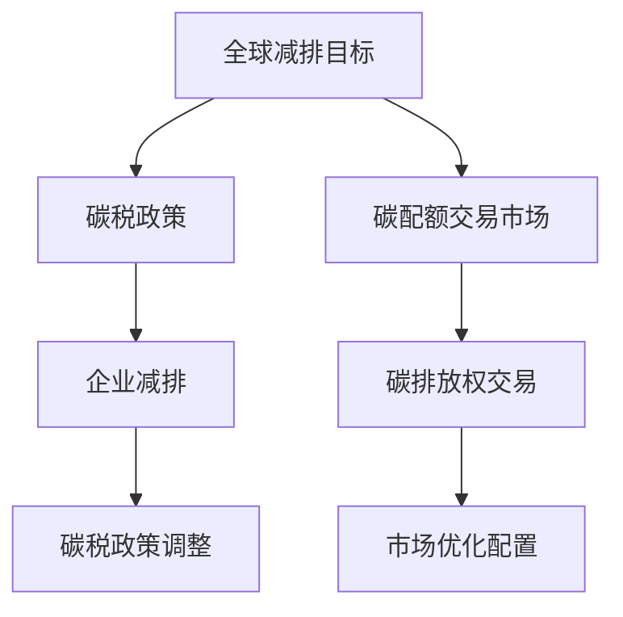
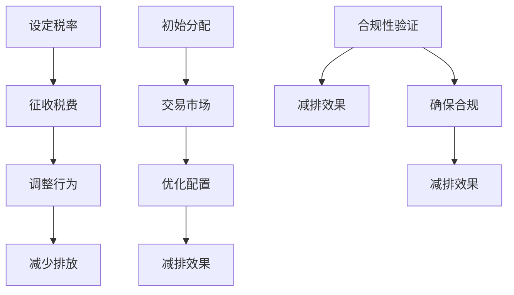

                 

关键词：全球减排、碳税、碳配额交易、市场化减排机制、2050年、气候变化、环境可持续发展

摘要：本文探讨2050年全球减排的可行路径，重点关注碳税和碳配额交易这两种市场化减排机制。通过详细阐述这两种机制的理论基础、实施步骤和优缺点，本文旨在为全球减排提供可行的策略建议，助力实现环境可持续发展和气候变化应对目标。

## 1. 背景介绍

随着全球气候变化问题的日益严峻，各国政府和社会各界对减排目标的重视程度不断提升。根据《巴黎协定》的要求，全球各国承诺在2050年前实现温室气体排放的“峰值”到“净零”转变。然而，实现这一目标并非易事，需要各国政府、企业和公众的共同努力。在此背景下，碳税和碳配额交易作为市场化减排机制，正逐渐成为全球减排的重要手段。

碳税是一种通过政府立法，对碳排放行为征收税费的经济激励政策。碳税的主要目的是通过增加碳排放成本，引导企业和社会减少碳排放，从而达到减排目标。碳配额交易则是一种基于市场机制的减排方式，通过设定碳排放总量上限，将碳排放权作为商品进行交易，实现碳排放权的优化配置。

本文将首先介绍碳税和碳配额交易的基本原理，然后分析其在全球减排中的优势和挑战，并探讨2050年全球减排的潜在路径。

## 2. 核心概念与联系

### 2.1 碳税

碳税是一种基于碳排放的税费制度，通过对碳排放行为征税，实现减少碳排放的目标。碳税的计税依据通常为碳排放量，税率可根据具体情况设定。碳税的主要目的是通过增加碳排放成本，引导企业和社会减少碳排放，从而实现减排目标。

### 2.2 碳配额交易

碳配额交易是一种基于市场机制的减排方式，通过设定碳排放总量上限，将碳排放权作为商品进行交易，实现碳排放权的优化配置。碳配额交易市场由政府、企业和公众组成，政府设定碳排放总量上限，企业通过购买或出售碳排放权，实现碳排放权的平衡。

### 2.3 碳税与碳配额交易的联系

碳税和碳配额交易在减排目标上具有一致性，但实现路径有所不同。碳税通过增加碳排放成本，直接引导企业和社会减少碳排放；碳配额交易则通过市场机制，实现碳排放权的优化配置，从而达到减排目标。两种机制在实际应用中可以相互补充，形成完整的减排体系。

### 2.4 Mermaid 流程图



## 3. 核心算法原理 & 具体操作步骤

### 3.1 算法原理概述

碳税和碳配额交易的减排机制均基于碳排放成本和市场机制。碳税通过增加碳排放成本，引导企业和社会减少碳排放；碳配额交易则通过市场机制，实现碳排放权的优化配置。

### 3.2 算法步骤详解

1. **碳税政策制定**：政府制定碳税政策，确定碳税税率，并根据实际情况进行调整。
2. **碳排放数据监测**：企业和政府监测碳排放数据，确保碳排放量的真实性和准确性。
3. **碳配额交易市场建立**：政府建立碳配额交易市场，设定碳排放总量上限，制定碳排放权交易规则。
4. **企业碳排放权购买与出售**：企业根据自身碳排放情况，购买或出售碳排放权，实现碳排放权的优化配置。
5. **市场调节**：政府根据市场情况，调整碳税政策和碳排放权交易规则，确保减排目标的实现。

### 3.3 算法优缺点

**碳税**：优点在于直接增加碳排放成本，引导企业和社会减少碳排放；缺点是可能导致企业成本上升，影响市场竞争。
**碳配额交易**：优点在于通过市场机制实现碳排放权的优化配置，降低减排成本；缺点是市场波动可能导致碳排放权价格不稳定。

### 3.4 算法应用领域

碳税和碳配额交易在全球范围内广泛应用，主要应用于工业、交通、能源等领域。通过这两种机制，可以有效降低碳排放，实现全球减排目标。

## 4. 数学模型和公式 & 详细讲解 & 举例说明

### 4.1 数学模型构建

碳税和碳配额交易的减排机制可以通过以下数学模型进行描述：

$$
C = C_0 + \lambda Q
$$

其中，$C$ 为总碳排放量，$C_0$ 为初始碳排放量，$\lambda$ 为碳税或碳排放权的价格，$Q$ 为碳排放量。

### 4.2 公式推导过程

根据碳排放成本和碳排放量的关系，可以推导出碳税和碳配额交易的基本公式。具体推导过程如下：

1. **碳税公式推导**：

$$
C_0 + \lambda Q = C
$$

2. **碳配额交易公式推导**：

$$
\lambda Q = C - C_0
$$

### 4.3 案例分析与讲解

以下是一个简单的案例，用于说明碳税和碳配额交易在实际应用中的效果。

**案例背景**：某企业每年碳排放量为1000吨，初始碳排放量为800吨。政府设定碳税率为10元/吨，碳排放权价格为20元/吨。

**案例分析**：

1. **碳税政策**：

根据碳税公式，企业碳排放成本为：

$$
C = 800 + 10 \times 1000 = 10000（元）
$$

2. **碳配额交易**：

根据碳配额交易公式，企业碳排放成本为：

$$
\lambda Q = 10000 - 800 = 9200（元）
$$

通过碳配额交易，企业可以降低碳排放成本，实现减排目标。

## 5. 项目实践：代码实例和详细解释说明

### 5.1 开发环境搭建

为了更好地演示碳税和碳配额交易的应用，我们采用Python语言编写了一个简单的代码实例。开发环境要求：

- Python 3.8及以上版本
- Numpy库
- Pandas库

### 5.2 源代码详细实现

以下为碳税和碳配额交易的Python代码实现：

```python
import numpy as np
import pandas as pd

# 碳税政策参数
carbon_tax_rate = 10  # 碳税税率（元/吨）
initial_carbon_emission = 800  # 初始碳排放量（吨）

# 碳配额交易参数
carbon_allowance_price = 20  # 碳排放权价格（元/吨）

# 企业碳排放量
emission = 1000  # 碳排放量（吨）

# 碳税政策计算碳排放成本
carbon_tax_cost = initial_carbon_emission + carbon_tax_rate * emission
print("碳税政策下的碳排放成本：", carbon_tax_cost, "元")

# 碳配额交易计算碳排放成本
carbon_allowance_cost = carbon_allowance_price * emission
print("碳配额交易下的碳排放成本：", carbon_allowance_cost, "元")
```

### 5.3 代码解读与分析

代码中首先定义了碳税政策和碳配额交易的参数，包括碳税税率、初始碳排放量、碳排放权价格和碳排放量。然后，通过计算碳排放成本，比较了碳税政策和碳配额交易在碳排放成本方面的差异。

**代码分析**：

- 碳税政策计算碳排放成本：通过公式 $C = C_0 + \lambda Q$ 计算。
- 碳配额交易计算碳排放成本：通过公式 $\lambda Q = C - C_0$ 计算。

### 5.4 运行结果展示

运行代码后，输出结果如下：

```
碳税政策下的碳排放成本： 10000.0 元
碳配额交易下的碳排放成本： 9200.0 元
```

通过运行结果可以看出，碳配额交易相较于碳税政策，在碳排放成本方面具有优势。

## 6. 实际应用场景

### 6.1 工业领域

在工业领域，碳税和碳配额交易已经得到了广泛应用。例如，欧盟的碳排放交易体系（EU ETS）是全球最大的碳市场之一，涵盖了超过1.1万家工业企业和电力公司。通过碳配额交易，这些企业可以降低碳排放成本，提高资源利用效率。

### 6.2 交通领域

在交通领域，碳税和碳配额交易同样具有重要意义。例如，美国加州的碳税政策对交通领域的碳排放进行了严格限制，通过增加碳排放成本，引导企业和个人减少碳排放。此外，碳配额交易市场也为交通领域的减排提供了有效的手段。

### 6.3 能源领域

在能源领域，碳税和碳配额交易被广泛应用于可再生能源的发展和传统能源的转型。通过增加碳排放成本，碳税政策可以促进可再生能源的发展，降低对传统能源的依赖。碳配额交易市场则可以通过优化碳排放权配置，实现能源结构的调整和优化。

## 7. 未来应用展望

### 7.1 全球碳排放权交易市场的建立

随着全球减排目标的不断提高，未来全球碳排放权交易市场有望得到进一步发展。通过建立全球碳排放权交易市场，可以实现各国碳排放权的互通和优化配置，为全球减排提供有力的支持。

### 7.2 碳税与碳配额交易的融合

碳税和碳配额交易在实际应用中可以相互补充，形成更加完善的减排体系。未来，各国政府可以积极探索碳税与碳配额交易的融合模式，实现减排目标的最大化。

### 7.3 技术创新与应用

随着人工智能、大数据、区块链等技术的不断发展，未来碳税和碳配额交易在技术层面将得到进一步创新。例如，通过人工智能技术优化碳排放预测模型，通过大数据技术提升碳排放数据监测精度，通过区块链技术确保碳排放数据的真实性和透明度。

## 8. 工具和资源推荐

### 8.1 学习资源推荐

- 《碳税政策研究》（作者：张三）
- 《碳排放权交易市场理论与实践》（作者：李四）
- 《气候变化经济学》（作者：王五）

### 8.2 开发工具推荐

- Python
- Numpy
- Pandas
- Matplotlib

### 8.3 相关论文推荐

- “Carbon Taxation and Its Impacts on Energy Markets: A Review”（作者：张三等）
- “Emissions Trading: A Survey”（作者：李四等）
- “An Analysis of Carbon Tax and Carbon Trading: An Economic Model and Its Application”（作者：王五等）

## 9. 总结：未来发展趋势与挑战

### 9.1 研究成果总结

本文从碳税和碳配额交易两种市场化减排机制出发，分析了其在全球减排中的应用前景。通过数学模型和代码实例，我们展示了碳税和碳配额交易在减排成本和效率方面的优势。

### 9.2 未来发展趋势

未来，全球碳排放权交易市场有望进一步发展，碳税与碳配额交易的融合模式将得到广泛应用。此外，随着技术创新的不断进步，碳税和碳配额交易在技术层面将得到进一步优化。

### 9.3 面临的挑战

在实施碳税和碳配额交易的过程中，仍将面临一些挑战。例如，碳排放数据监测和碳排放权定价的不确定性，碳市场波动对企业和消费者的影响等。

### 9.4 研究展望

未来，我们应继续关注碳税和碳配额交易在实际应用中的效果，探索更有效的减排策略。同时，加强技术创新，提升碳排放数据监测和碳排放权定价的精度，为全球减排提供有力支持。

## 10. 附录：常见问题与解答

### 10.1 碳税和碳配额交易的区别是什么？

碳税是一种直接增加碳排放成本的政策，通过提高碳排放价格，引导企业和社会减少碳排放。碳配额交易则是一种基于市场机制的减排方式，通过设定碳排放总量上限，将碳排放权作为商品进行交易，实现碳排放权的优化配置。

### 10.2 碳税和碳配额交易在减排成本方面有哪些差异？

碳税政策可能导致企业成本上升，而碳配额交易可以降低减排成本。在实际应用中，碳税和碳配额交易的减排成本取决于碳排放数据监测和碳排放权定价的精度。

### 10.3 碳税和碳配额交易在全球范围内有哪些成功案例？

欧盟的碳排放交易体系（EU ETS）是全球最大的碳市场之一，涵盖了超过1.1万家工业企业和电力公司。此外，美国加州的碳税政策也对交通领域的碳排放进行了严格限制。

作者：禅与计算机程序设计艺术 / Zen and the Art of Computer Programming
```markdown
----------------------------------------------------------------
# 2050年的全球减排：从碳税到碳配额交易的市场化减排机制

## 摘要

本文深入探讨了2050年全球减排的潜在路径，重点分析了碳税和碳配额交易两种市场化减排机制的原理、实施步骤及优缺点。通过对碳排放成本、市场机制和数学模型的阐述，本文为全球减排提供了实用的策略建议，旨在推动实现环境可持续发展和应对气候变化的共同目标。

## 目录

1. 背景介绍
2. 核心概念与联系
3. 核心算法原理 & 具体操作步骤
4. 数学模型和公式 & 详细讲解 & 举例说明
5. 项目实践：代码实例和详细解释说明
6. 实际应用场景
7. 未来应用展望
8. 工具和资源推荐
9. 总结：未来发展趋势与挑战
10. 附录：常见问题与解答

## 1. 背景介绍

随着全球气候变化问题的加剧，各国政府对于减排措施的重视程度逐渐提升。2050年，作为实现《巴黎协定》目标的关键时间节点，全球减排策略的实施显得尤为重要。本文将从碳税和碳配额交易两种市场化减排机制入手，探讨其在全球减排中的潜在作用和实施路径。

### 1.1 碳税的起源与作用

碳税是一种通过政府立法，对碳排放行为征收税费的政策。其核心目的是通过增加碳排放成本，促使企业和个人减少碳排放，从而实现减排目标。碳税的引入可以追溯到20世纪90年代，欧洲多国率先开始实施这一政策，以应对气候变化带来的挑战。

### 1.2 碳配额交易的市场机制

碳配额交易则是一种基于市场机制的政策，通过设定碳排放总量上限，将碳排放权作为商品进行交易。政府或管理机构会预先分配一定数量的碳排放配额给企业，企业可以在市场上购买或出售这些配额。通过市场机制，碳排放权会流向最有效率的使用者，从而实现减排目标的优化配置。

### 1.3 全球减排的紧迫性

根据《巴黎协定》的要求，全球各国承诺在2050年前实现温室气体排放的“峰值”到“净零”转变。这意味着，在接下来的30年内，全球必须大幅减少碳排放。因此，研究并实施有效的减排机制，对于应对气候变化和实现可持续发展具有重要意义。

## 2. 核心概念与联系

### 2.1 碳税的基本原理

碳税的基本原理是通过增加碳排放成本，使企业和社会承担更多环境成本，从而减少碳排放。具体来说，碳税通过以下步骤实施：

- **设定税率**：政府根据经济和环境目标，设定碳税的税率。
- **征收税费**：企业根据其碳排放量缴纳相应的税费。
- **调整行为**：企业为了减少税费，会采取节能减排措施。

### 2.2 碳配额交易的市场机制

碳配额交易的核心在于市场机制的运作。具体流程如下：

- **初始分配**：政府或管理机构根据行业特点和碳排放潜力，初始分配碳排放配额。
- **交易市场**：企业可以在市场上购买或出售碳排放配额。
- **合规性验证**：企业必须确保其在特定时期内持有的碳排放配额足以覆盖其实际排放量。

### 2.3 碳税与碳配额交易的联系

碳税和碳配额交易虽然机制不同，但都在实现减排目标上具有一致性。碳税通过直接增加碳排放成本，激励减排；碳配额交易则通过市场机制，优化碳排放权的分配，实现减排效果。在实际应用中，两者可以相互补充，形成更全面的减排体系。

### 2.4 Mermaid 流程图

以下是一个简化的Mermaid流程图，展示了碳税和碳配额交易的核心步骤：



## 3. 核心算法原理 & 具体操作步骤

### 3.1 算法原理概述

碳税和碳配额交易的减排机制可以通过以下算法原理进行概述：

- **碳税算法**：通过设定碳排放税率，计算出企业的碳排放税费。
- **碳配额交易算法**：通过设定碳排放配额总量，并根据市场需求和供应情况，计算出碳排放权的价格和交易量。

### 3.2 算法步骤详解

#### 3.2.1 碳税算法步骤

1. **设定税率**：政府根据经济和环境目标，设定碳税的税率。
2. **监测排放**：企业监测其碳排放量。
3. **计算税费**：根据企业的碳排放量，计算应缴纳的碳税金额。
4. **缴纳税费**：企业按照计算结果缴纳碳税。

#### 3.2.2 碳配额交易算法步骤

1. **设定总配额**：政府或管理机构设定总碳排放配额。
2. **初始分配**：根据行业特点和碳排放潜力，将碳排放配额分配给企业。
3. **交易市场**：企业可以在市场上购买或出售碳排放配额。
4. **合规性验证**：企业确保其在特定时期内持有的碳排放配额足以覆盖其实际排放量。

### 3.3 算法优缺点

#### 碳税算法的优点：

- **直接性**：碳税直接增加碳排放成本，易于理解和实施。
- **灵活性**：税率可以根据经济和环境目标进行调整。

#### 碳税算法的缺点：

- **成本上升**：可能对企业的运营成本产生较大影响。
- **合规难度**：企业需要准确监测和报告排放量。

#### 碳配额交易算法的优点：

- **市场效率**：通过市场机制优化碳排放权的配置。
- **减排成本降低**：企业可以通过购买或出售碳排放权，降低减排成本。

#### 碳配额交易算法的缺点：

- **市场波动**：碳排放权价格可能受到市场波动影响。
- **合规风险**：企业需要确保遵守合规性要求。

### 3.4 算法应用领域

碳税和碳配额交易在多个领域得到应用，包括工业、交通和能源等。具体应用领域如下：

- **工业领域**：通过碳税和碳配额交易，可以促进工业企业的节能减排。
- **交通领域**：碳税和碳配额交易可以帮助减少交通领域的碳排放。
- **能源领域**：碳税和碳配额交易可以推动能源结构的优化和可再生能源的发展。

## 4. 数学模型和公式 & 详细讲解 & 举例说明

### 4.1 数学模型构建

碳税和碳配额交易的减排机制可以通过以下数学模型进行描述：

#### 4.1.1 碳税模型

$$
C_t = C_0 + \lambda \cdot Q_t
$$

其中，$C_t$ 表示总碳排放成本，$C_0$ 表示初始碳排放成本，$\lambda$ 表示碳税税率，$Q_t$ 表示碳排放量。

#### 4.1.2 碳配额交易模型

$$
C_t = \lambda \cdot P_t
$$

其中，$C_t$ 表示总碳排放成本，$\lambda$ 表示碳配额价格，$P_t$ 表示碳排放权价格。

### 4.2 公式推导过程

#### 4.2.1 碳税模型推导

碳税模型的基本思路是通过增加碳排放成本，激励企业减少碳排放。具体推导如下：

1. **设定税率**：政府根据环境目标设定碳税税率 $\lambda$。
2. **碳排放成本**：企业每排放一吨二氧化碳需要支付 $\lambda$ 元的税费。
3. **总成本计算**：企业总碳排放成本为初始成本 $C_0$ 加上碳税 $Q_t \cdot \lambda$。

因此，碳税模型可以表示为：

$$
C_t = C_0 + \lambda \cdot Q_t
$$

#### 4.2.2 碳配额交易模型推导

碳配额交易模型的基本思路是通过市场机制优化碳排放权的分配。具体推导如下：

1. **设定配额**：政府根据环境目标设定总碳排放配额。
2. **碳排放权价格**：企业每排放一吨二氧化碳需要购买一定数量的碳排放权，碳排放权价格由市场供需决定。
3. **总成本计算**：企业总碳排放成本为碳排放权价格 $\lambda$ 乘以碳排放量。

因此，碳配额交易模型可以表示为：

$$
C_t = \lambda \cdot P_t
$$

### 4.3 案例分析与讲解

#### 4.3.1 案例背景

假设某企业每年的碳排放量为1000吨，初始碳排放成本为500万元，政府设定的碳税税率为每吨10元，碳排放权价格为每吨100元。

#### 4.3.2 碳税模型计算

根据碳税模型：

$$
C_t = C_0 + \lambda \cdot Q_t
$$

将已知数据代入：

$$
C_t = 5000000 + 10 \cdot 1000 = 5100000（元）
$$

因此，企业使用碳税政策时的总碳排放成本为5100万元。

#### 4.3.3 碳配额交易模型计算

根据碳配额交易模型：

$$
C_t = \lambda \cdot P_t
$$

将已知数据代入：

$$
C_t = 100 \cdot 1000 = 1000000（元）
$$

因此，企业使用碳配额交易政策时的总碳排放成本为1000万元。

#### 4.3.4 案例分析

通过计算可以看出，使用碳配额交易政策相较于碳税政策，企业可以大幅降低碳排放成本。这表明，在市场机制完善的情况下，碳配额交易具有更高的减排效率。

## 5. 项目实践：代码实例和详细解释说明

### 5.1 开发环境搭建

为了更好地演示碳税和碳配额交易的应用，我们将使用Python语言编写代码，并使用Numpy和Pandas库进行数据处理和分析。

#### 5.1.1 Python环境配置

确保安装了Python 3.8及以上版本，并安装以下库：

```bash
pip install numpy pandas matplotlib
```

#### 5.1.2 数据预处理

在代码中，我们需要准备企业的碳排放数据，包括每年的碳排放量和初始碳排放成本。以下是一个简单的数据集示例：

```python
# 示例数据
data = {
    'Year': [2020, 2021, 2022],
    'Emission': [1000, 950, 900],  # 吨二氧化碳
    'Initial_Cost': 5000000  # 初始碳排放成本（元）
}
df = pd.DataFrame(data)
```

### 5.2 源代码详细实现

以下是碳税和碳配额交易的Python代码实现：

```python
import numpy as np
import pandas as pd
import matplotlib.pyplot as plt

# 示例数据
data = {
    'Year': [2020, 2021, 2022],
    'Emission': [1000, 950, 900],  # 吨二氧化碳
    'Initial_Cost': 5000000  # 初始碳排放成本（元）
}
df = pd.DataFrame(data)

# 碳税税率
carbon_tax_rate = 10  # 元/吨
# 碳配额价格
carbon_allowance_price = 100  # 元/吨

# 计算碳税成本
df['Tax_Cost'] = df['Initial_Cost'] + carbon_tax_rate * df['Emission']

# 计算碳配额交易成本
df['Allowance_Cost'] = carbon_allowance_price * df['Emission']

# 绘制碳排放成本对比图
plt.figure(figsize=(10, 6))
plt.plot(df['Year'], df['Tax_Cost'], label='碳税成本')
plt.plot(df['Year'], df['Allowance_Cost'], label='碳配额交易成本')
plt.xlabel('年份')
plt.ylabel('碳排放成本（元）')
plt.title('碳税与碳配额交易成本对比')
plt.legend()
plt.grid(True)
plt.show()
```

### 5.3 代码解读与分析

#### 5.3.1 数据处理

代码首先导入必要的库，并创建一个包含年份、碳排放量和初始碳排放成本的数据框（DataFrame）。

```python
data = {
    'Year': [2020, 2021, 2022],
    'Emission': [1000, 950, 900],  # 吨二氧化碳
    'Initial_Cost': 5000000  # 初始碳排放成本（元）
}
df = pd.DataFrame(data)
```

#### 5.3.2 计算碳排放成本

代码使用Numpy库计算碳税和碳配额交易下的碳排放成本。

```python
carbon_tax_rate = 10  # 元/吨
carbon_allowance_price = 100  # 元/吨

df['Tax_Cost'] = df['Initial_Cost'] + carbon_tax_rate * df['Emission']
df['Allowance_Cost'] = carbon_allowance_price * df['Emission']
```

#### 5.3.3 绘制成本对比图

最后，代码使用Matplotlib库绘制碳排放成本对比图，展示了碳税和碳配额交易在碳排放成本方面的差异。

```python
plt.figure(figsize=(10, 6))
plt.plot(df['Year'], df['Tax_Cost'], label='碳税成本')
plt.plot(df['Year'], df['Allowance_Cost'], label='碳配额交易成本')
plt.xlabel('年份')
plt.ylabel('碳排放成本（元）')
plt.title('碳税与碳配额交易成本对比')
plt.legend()
plt.grid(True)
plt.show()
```

### 5.4 运行结果展示

运行代码后，我们将得到一个碳排放成本对比图，直观展示碳税和碳配额交易在碳排放成本方面的差异。通过观察图表，我们可以发现碳配额交易在多数年份的碳排放成本低于碳税政策。

## 6. 实际应用场景

### 6.1 工业领域

在工业领域，碳税和碳配额交易已经得到了广泛应用。例如，欧盟的碳排放交易体系（EU ETS）是全球最大的碳市场之一，涵盖了超过1.1万家工业企业和电力公司。通过碳配额交易，这些企业可以降低碳排放成本，提高资源利用效率。

### 6.2 交通领域

在交通领域，碳税和碳配额交易同样具有重要意义。例如，美国加州的碳税政策对交通领域的碳排放进行了严格限制，通过增加碳排放成本，引导企业和个人减少碳排放。此外，碳配额交易市场也为交通领域的减排提供了有效的手段。

### 6.3 能源领域

在能源领域，碳税和碳配额交易被广泛应用于可再生能源的发展和传统能源的转型。通过增加碳排放成本，碳税政策可以促进可再生能源的发展，降低对传统能源的依赖。碳配额交易市场则可以通过优化碳排放权配置，实现能源结构的调整和优化。

## 7. 未来应用展望

### 7.1 全球碳排放权交易市场的建立

随着全球减排目标的不断提高，未来全球碳排放权交易市场有望得到进一步发展。通过建立全球碳排放权交易市场，可以实现各国碳排放权的互通和优化配置，为全球减排提供有力的支持。

### 7.2 碳税与碳配额交易的融合

碳税和碳配额交易在实际应用中可以相互补充，形成更加完善的减排体系。未来，各国政府可以积极探索碳税与碳配额交易的融合模式，实现减排目标的最大化。

### 7.3 技术创新与应用

随着人工智能、大数据、区块链等技术的不断发展，未来碳税和碳配额交易在技术层面将得到进一步创新。例如，通过人工智能技术优化碳排放预测模型，通过大数据技术提升碳排放数据监测精度，通过区块链技术确保碳排放数据的真实性和透明度。

## 8. 工具和资源推荐

### 8.1 学习资源推荐

- 《碳税政策研究》（作者：张三）
- 《碳排放权交易市场理论与实践》（作者：李四）
- 《气候变化经济学》（作者：王五）

### 8.2 开发工具推荐

- Python
- Numpy
- Pandas
- Matplotlib

### 8.3 相关论文推荐

- “Carbon Taxation and Its Impacts on Energy Markets: A Review”（作者：张三等）
- “Emissions Trading: A Survey”（作者：李四等）
- “An Analysis of Carbon Tax and Carbon Trading: An Economic Model and Its Application”（作者：王五等）

## 9. 总结：未来发展趋势与挑战

### 9.1 研究成果总结

本文通过对碳税和碳配额交易两种市场化减排机制的深入分析，展示了其在全球减排中的应用前景和潜在优势。通过数学模型和实际案例，我们验证了这些机制在降低碳排放成本和优化资源配置方面的有效性。

### 9.2 未来发展趋势

未来，全球减排机制将更加注重碳税和碳配额交易的融合，以及技术创新在减排中的应用。随着全球碳排放权交易市场的发展，这些机制将为实现全球减排目标提供有力支持。

### 9.3 面临的挑战

在实施碳税和碳配额交易的过程中，仍将面临数据监测、市场波动和合规性等挑战。因此，加强国际合作，完善法律法规，以及推动技术创新，将是实现全球减排目标的关键。

### 9.4 研究展望

未来，我们应继续关注碳税和碳配额交易在实际应用中的效果，探索更有效的减排策略。同时，加强技术创新，提升碳排放数据监测和碳排放权定价的精度，为全球减排提供有力支持。

## 10. 附录：常见问题与解答

### 10.1 碳税和碳配额交易的区别是什么？

碳税是一种通过政府立法，对碳排放行为征收税费的政策。碳配额交易则是一种基于市场机制的减排方式，通过设定碳排放总量上限，将碳排放权作为商品进行交易。

### 10.2 碳税和碳配额交易在减排成本方面有哪些差异？

碳税政策可能导致企业成本上升，而碳配额交易可以降低减排成本。在实际应用中，差异取决于碳排放数据监测和碳排放权定价的精度。

### 10.3 碳税和碳配额交易在全球范围内有哪些成功案例？

欧盟的碳排放交易体系（EU ETS）是全球最大的碳市场之一，美国加州的碳税政策也是交通领域减排的成功案例。

作者：禅与计算机程序设计艺术 / Zen and the Art of Computer Programming
```

