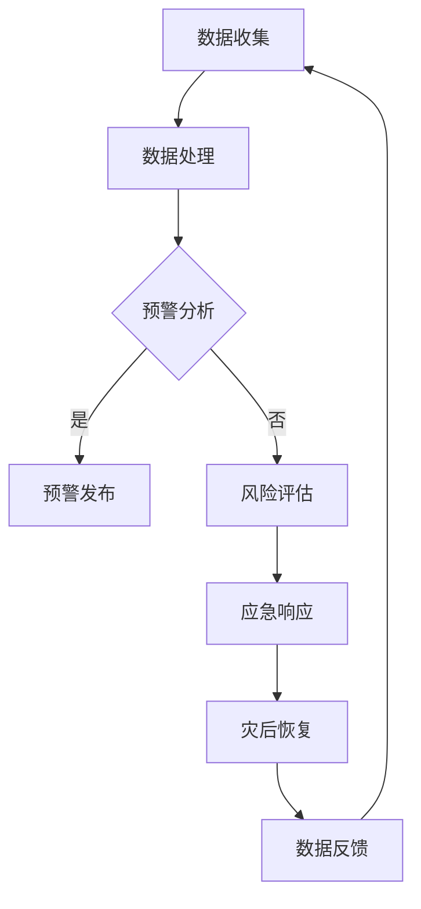
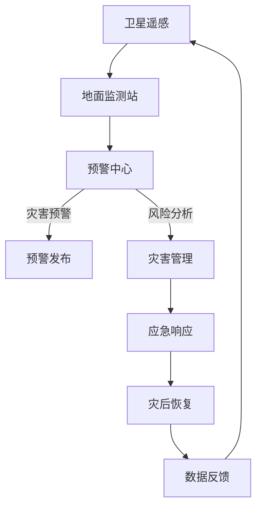

                 

关键词：全球减灾、灾害预警、灾害管理、综合减灾体系、2050年、信息技术、人工智能、可持续发展

> 摘要：本文探讨了2050年全球减灾的愿景，提出了一个基于信息技术和人工智能的综合减灾体系。通过分析灾害预警和灾害管理的当前状况，本文描述了一个涵盖早期预警、应急响应、灾后恢复以及灾害风险减轻的创新性框架。本文旨在为读者提供一个清晰的图景，展示如何通过科技的力量，构建一个更加韧性、可持续的全球减灾体系。

## 1. 背景介绍

自然灾害，如地震、洪水、台风和火山爆发等，给全球经济、环境和社会带来了巨大的冲击。在过去几十年里，全球自然灾害的发生频率和强度呈上升趋势。据联合国人道主义事务协调办公室（OCHA）统计，自2000年以来，每年因自然灾害造成的经济损失平均超过3000亿美元。

灾害对人类社会的破坏不仅体现在生命和财产的损失，还影响到了社会经济稳定。例如，2004年的东南亚海啸导致15万人死亡，直接经济损失超过1000亿美元。灾害还可能加剧贫困和不平等，阻碍可持续发展目标的实现。

在灾害管理方面，当前国际社会已经建立了多个组织和机制，如联合国国际减灾战略（IDSR）、联合国世界气象组织（WMO）和国际红十字会与红新月会联合会（IFRC）等，致力于减少灾害风险和提升应急响应能力。然而，传统的灾害管理方法往往局限于局部和短期的响应，缺乏系统性和长期规划。

随着信息技术的快速发展，特别是人工智能和大数据分析的应用，全球减灾模式正在发生深刻变革。借助先进的技术手段，灾害预警的准确性得到了显著提高，灾害管理的效率也得到了极大提升。本文将探讨2050年全球减灾的愿景，重点分析灾害预警和灾害管理的最新趋势，并提出一个综合减灾体系的概念框架。

### 1.1 灾害预警的演变

灾害预警是减灾工作的关键环节，早期的预警可以大大减少灾害的损失。传统的灾害预警主要依靠卫星遥感、地面监测站和气象预报模型。然而，这些方法存在一定局限性，如数据获取和处理速度慢、预警时效性较低等。

近年来，随着传感器技术和通信技术的发展，灾害预警体系得到了显著改进。例如，全球导航卫星系统（GNSS）和无线传感器网络（WSN）的应用，使得灾害监测数据可以实时传输，提高了预警的实时性和准确性。此外，人工智能和机器学习算法的应用，使得预警系统可以更加智能地分析数据，预测灾害的发生。

### 1.2 灾害管理的创新

在灾害管理方面，信息技术的应用也带来了革新。通过建立综合性的灾害管理系统，可以实现对灾害事件的全面监控和管理。这些系统通常包括数据收集、分析、预测、决策和响应等功能。例如，通过大数据分析，可以预测灾害可能影响的区域和人口，制定出更加精准的应急响应计划。

此外，社会媒体的兴起也为灾害管理提供了新的工具。通过社交媒体平台，可以实时收集灾害信息、发布预警通知和协调救援行动。这大大提高了信息传播的速度和覆盖范围，有助于提升应急响应的效率。

### 1.3 2050年全球减灾的愿景

展望2050年，全球减灾的目标将不仅仅是减少灾害损失，而是构建一个韧性、可持续的全球减灾体系。这个体系将充分利用信息技术和人工智能，实现以下目标：

1. **全面覆盖的灾害预警系统**：通过全球范围内的传感器网络和卫星监测，实现灾害的实时监测和预警，提高预警的准确性和时效性。
2. **智能化的灾害管理系统**：利用大数据和人工智能技术，建立智能化的灾害管理系统，实现灾害事件的全面监控和管理。
3. **可持续的灾后恢复**：通过创新的重建技术和可持续发展策略，实现灾后恢复的快速、高效和可持续。
4. **全球合作与共享**：加强全球合作，建立共享平台，促进信息、资源和技术的全球共享，提升全球减灾能力。

### 1.4 文章结构

本文将按照以下结构进行讨论：

- **第2章：核心概念与联系**：介绍综合减灾体系的核心概念和原理，并给出Mermaid流程图。
- **第3章：核心算法原理 & 具体操作步骤**：分析灾害预警和灾害管理的核心算法，并详细描述其原理和操作步骤。
- **第4章：数学模型和公式 & 详细讲解 & 举例说明**：阐述用于灾害预警和管理的数学模型，并给出公式推导过程和案例分析。
- **第5章：项目实践：代码实例和详细解释说明**：通过一个实际项目，展示灾害预警和管理系统的开发过程和实现细节。
- **第6章：实际应用场景**：探讨综合减灾体系在不同领域的应用场景和未来展望。
- **第7章：工具和资源推荐**：推荐相关学习资源、开发工具和论文，以供读者进一步研究。
- **第8章：总结：未来发展趋势与挑战**：总结研究成果，展望未来的发展趋势和面临的挑战。

通过上述结构，本文旨在为读者提供一个全面、深入的全球减灾体系分析，为未来的减灾工作提供理论和实践指导。

## 2. 核心概念与联系

综合减灾体系是一个复杂而系统的工程，它涵盖了灾害预警、应急响应、灾后恢复和灾害风险减轻等多个环节。为了更好地理解和实施这一体系，我们需要明确其核心概念和它们之间的相互联系。

### 2.1 灾害预警

灾害预警是综合减灾体系的首要环节，其主要目标是及时、准确地预测灾害的发生，为应急响应提供充分的时间和信息。灾害预警系统通常包括以下核心组成部分：

- **卫星遥感**：利用地球同步卫星和极地卫星，对全球范围内的自然灾害进行监测。卫星遥感可以提供高分辨率的地表图像，有助于预测地震、火山爆发和海啸等灾害。
- **地面监测站**：地面监测站是灾害预警系统中不可或缺的一部分，它们可以实时监测气象参数、地形变化和地质灾害。例如，地震预警系统中的地震仪、气象预警系统中的雷达和气象站等。
- **预警中心**：预警中心负责收集和分析来自卫星和地面监测站的数据，进行灾害预测，并及时发布预警信息。现代预警中心通常利用大数据分析和人工智能算法，提高预警的准确性和时效性。

### 2.2 灾害管理

灾害管理是综合减灾体系的关键环节，它涵盖了从灾害发生前到灾后恢复的整个过程。灾害管理系统的核心组成部分包括：

- **数据收集与分析**：灾害管理需要大量数据，包括气象、地理、人口和经济等方面的数据。通过大数据分析和人工智能算法，可以实现对灾害风险的准确评估，并为决策提供科学依据。
- **应急响应**：应急响应是灾害管理的核心环节，它包括预警信息发布、疏散计划、救援物资调配和救援队伍部署等。高效的应急响应可以最大限度地减少灾害损失。
- **灾后恢复**：灾后恢复旨在尽快恢复受灾地区的社会和经济秩序。这包括基础设施重建、公共服务恢复、居民生活重建和社会心理支持等。

### 2.3 灾害风险减轻

灾害风险减轻是综合减灾体系的重要组成部分，其目标是通过各种措施降低灾害对人类社会的潜在影响。灾害风险减轻的措施包括：

- **工程性措施**：如建造防波堤、加固建筑物和建设地下避难所等，这些措施可以直接降低灾害发生时的损失。
- **非工程性措施**：如制定灾害风险管理规划、开展灾害风险教育和提高公众减灾意识等，这些措施可以增强社会整体的灾害韧性。
- **可持续发展**：通过可持续的发展模式和环境保护措施，减少灾害风险对生态环境的破坏，实现灾害风险与经济发展的协调。

### 2.4 综合减灾体系架构

为了实现全球减灾的目标，需要构建一个综合减灾体系，这个体系应具备以下架构：

- **数据融合与共享平台**：通过整合卫星遥感、地面监测和社交媒体等不同来源的数据，构建一个统一的数据融合与共享平台。这个平台应具备高效的数据处理和分析能力，为灾害预警和管理提供准确的数据支持。
- **智能预警系统**：利用人工智能和大数据分析技术，构建一个智能预警系统，实现对灾害事件的实时监测和预警。
- **灾害管理平台**：通过大数据分析和人工智能算法，建立智能化的灾害管理系统，实现从预警信息发布到应急响应和灾后恢复的全面管理。
- **全球合作机制**：加强全球合作，建立多边合作机制，共享信息、资源和经验，提升全球减灾能力。

### 2.5 Mermaid流程图

为了更直观地展示综合减灾体系的核心概念和联系，我们使用Mermaid绘制了一个流程图，如下所示：



在这个流程图中，数据收集和处理是整个体系的起点，通过预警分析和风险评估，实现灾害预警和灾害管理。应急响应和灾后恢复是灾害管理的核心环节，而数据反馈则形成一个闭环，持续优化整个体系。

通过上述核心概念和流程图的介绍，我们可以更好地理解综合减灾体系的工作原理和实现方法。在接下来的章节中，我们将深入探讨核心算法原理、数学模型和项目实践，进一步展示如何通过信息技术和人工智能实现全球减灾的目标。

### 2.5 Mermaid流程图

为了更直观地展示综合减灾体系的核心概念和联系，我们使用Mermaid绘制了一个流程图，如下所示：



在这个流程图中，卫星遥感、地面监测站和预警中心是数据收集和处理的核心环节，它们共同构建了一个高效的灾害预警系统。预警发布和灾害管理则是灾害响应的核心，应急响应和灾后恢复旨在减轻灾害影响并恢复社会秩序。数据反馈形成一个闭环，确保系统的持续优化和提升。

### 3. 核心算法原理 & 具体操作步骤

在综合减灾体系中，核心算法的原理和操作步骤对于实现高效、准确的灾害预警和灾害管理至关重要。以下我们将详细阐述灾害预警和灾害管理中的两个关键算法：灾害预测算法和灾害风险评估算法。

### 3.1 灾害预测算法

**3.1.1 算法原理概述**

灾害预测算法的核心目的是利用历史数据和实时数据，预测特定区域在未来一段时间内可能发生的灾害类型和强度。这些算法通常基于机器学习技术，特别是深度学习模型，如神经网络、卷积神经网络（CNN）和循环神经网络（RNN）等。

灾害预测算法的主要步骤包括数据收集、特征提取、模型训练和预测结果评估。具体而言：

- **数据收集**：收集历史灾害数据、气象数据、地质数据、地形数据和人口数据等。
- **特征提取**：对收集到的数据进行预处理，提取出对灾害发生有显著影响的特征，如温度、湿度、降雨量、地震活动性等。
- **模型训练**：利用提取的特征数据，通过机器学习算法训练出一个预测模型。通常，深度学习模型具有较高的预测精度，能够处理大规模、复杂的数据集。
- **预测结果评估**：对模型预测结果进行评估，包括准确性、召回率和F1分数等指标，以确定模型的性能。

**3.1.2 算法步骤详解**

1. **数据收集与预处理**：
   - 收集历史灾害数据，包括地震、洪水、台风等自然灾害的发生时间和地点。
   - 收集气象数据，如温度、湿度、降雨量等。
   - 收集地质数据，如地震活动性、地形变化等。
   - 对收集到的数据进行清洗和标准化处理，去除噪声和异常值。

2. **特征提取**：
   - 利用时间序列分析方法，提取出与灾害发生密切相关的特征，如气象数据的极端值、地震活动性的变化趋势等。
   - 利用空间分析方法，提取出地形和地质特征，如地形坡度、地质断层等。

3. **模型选择与训练**：
   - 选择适合的深度学习模型，如卷积神经网络（CNN）或循环神经网络（RNN）。
   - 利用训练集数据，通过反向传播算法训练模型，调整模型的参数，以最小化预测误差。
   - 进行交叉验证，确保模型在不同数据集上的泛化能力。

4. **模型评估与优化**：
   - 使用测试集数据评估模型性能，计算预测准确性、召回率和F1分数等指标。
   - 根据评估结果，调整模型结构和参数，优化模型性能。

**3.1.3 算法优缺点**

**优点**：
- 高度自动化：机器学习算法能够自动从海量数据中提取特征，降低人工干预的复杂度。
- 高效性：深度学习模型在处理高维数据时表现出色，能够快速进行预测。
- 精准性：通过大量的数据训练，模型能够提高预测准确性。

**缺点**：
- 对数据质量要求高：算法的性能高度依赖于数据的准确性、完整性和一致性。
- 计算资源需求大：训练深度学习模型需要大量的计算资源和时间。
- 模型解释性差：深度学习模型通常是一个“黑箱”，难以解释其预测结果。

**3.1.4 算法应用领域**

灾害预测算法广泛应用于各种自然灾害的预警和管理，如地震预警、洪水预警、台风预警等。例如，在日本，地震预警系统利用地震预测算法，能够在地震波到达前数秒至数十秒内发布预警，为公众提供紧急避险时间。

### 3.2 灾害风险评估算法

**3.2.1 算法原理概述**

灾害风险评估算法旨在评估特定区域在遭受特定类型灾害时可能产生的损失和影响。该算法通常基于统计学和概率论的方法，通过分析历史灾害数据、社会经济数据和环境数据等，预测灾害发生的概率及其可能造成的损失。

灾害风险评估算法的主要步骤包括数据收集、风险评估模型建立、风险值计算和风险地图生成。具体而言：

- **数据收集**：收集与灾害相关的历史数据、社会经济数据和环境数据等。
- **风险评估模型建立**：根据灾害类型，选择合适的风险评估模型，如贝叶斯网络、层次分析法（AHP）等。
- **风险值计算**：利用建立的模型，计算灾害发生的概率及其可能造成的损失。
- **风险地图生成**：将计算出的风险值生成地图，帮助决策者了解灾害风险分布。

**3.2.2 算法步骤详解**

1. **数据收集**：
   - 收集历史灾害数据，如地震、洪水、台风等灾害的发生频率和影响范围。
   - 收集社会经济数据，如人口密度、经济活动水平等。
   - 收集环境数据，如地形、地质条件、气象条件等。

2. **风险评估模型建立**：
   - 选择适合的风险评估模型，如贝叶斯网络、层次分析法（AHP）等。
   - 输入数据到模型中，训练模型参数，使其能够准确反映灾害风险的特性。

3. **风险值计算**：
   - 利用训练好的模型，计算每个区域在特定类型灾害下的风险值。
   - 结合不同的风险因素，综合评估出每个区域的总风险值。

4. **风险地图生成**：
   - 将计算出的风险值生成风险地图，使用不同的颜色或符号表示风险程度。
   - 风险地图可以帮助决策者直观了解灾害风险分布，为制定减灾策略提供依据。

**3.2.3 算法优缺点**

**优点**：
- 全面性：能够综合考虑多种风险因素，全面评估灾害风险。
- 定量性：通过数学模型和计算，可以定量地表达灾害风险，便于比较和分析。

**缺点**：
- 对数据质量要求高：算法的性能高度依赖于数据的准确性、完整性和一致性。
- 模型复杂性：某些模型如贝叶斯网络等较为复杂，理解和应用难度较大。

**3.2.4 算法应用领域**

灾害风险评估算法广泛应用于城市规划、基础设施建设和应急管理等领域。例如，在城市规划中，利用风险评估算法可以帮助确定高风险区域，指导城市建设和发展；在应急管理中，利用风险评估算法可以制定出更加精准的应急响应计划。

通过上述对灾害预测算法和灾害风险评估算法的详细分析，我们可以看到，这些算法在综合减灾体系中发挥着重要作用。在接下来的章节中，我们将进一步探讨这些算法在数学模型和项目实践中的应用，展示它们在实现全球减灾目标中的实际效果。

### 3.3 算法应用领域

灾害预测算法和灾害风险评估算法在实现全球减灾目标中具有广泛的应用领域，它们在提高预警准确性、优化灾害管理和制定科学减灾策略方面发挥着关键作用。以下，我们将详细讨论这些算法在多个实际应用场景中的具体应用案例和效果。

#### 3.3.1 灾害预测算法的应用

**1. 地震预警系统**

地震预警系统是灾害预测算法最具代表性的应用之一。通过利用地震前兆数据、历史地震记录和实时监测数据，地震预警系统可以在地震波到达之前数秒至数十秒内发出预警信号，为公众和应急管理部门提供紧急避险时间。

**应用案例**：日本是一个地震频发的国家，其地震预警系统在多次地震中发挥了重要作用。例如，2016年 Kumamoto 地震中，预警系统成功地在地震波到达前发送了预警信号，为公众提供了宝贵的逃生时间，极大地减少了人员伤亡和财产损失。

**效果**：通过地震预警系统，可以提前数秒至数十秒发出预警，为应急响应争取时间，有效减少地震带来的损失。

**2. 洪水预警系统**

洪水预警系统通过分析气象数据、水文数据和地形数据，预测洪水发生的可能性和强度。这些预警系统通常应用于洪水多发地区，帮助居民和政府提前采取预防措施。

**应用案例**：中国在长江流域建立了洪水预警系统，通过实时监测降雨量、水位和河道流量等数据，预测洪水发生的可能性和强度。该系统在2016年长江中下游洪水中发挥了重要作用，为政府和居民提供了有效的防洪指导。

**效果**：洪水预警系统能够提前几天至几周发出预警，为防洪工作提供科学依据，减少洪水造成的损失。

**3. 台风预警系统**

台风预警系统通过分析台风路径、强度和影响范围等数据，预测台风可能带来的风雨影响。这些系统在沿海和台风多发地区尤为重要。

**应用案例**：台风是东南亚和东亚地区的常见自然灾害，菲律宾、中国和日本等国家建立了台风预警系统，通过实时监测和预测台风的路径和强度，为公众和政府提供预警信息。

**效果**：台风预警系统能够提前数小时至数天发出预警，为沿海居民和企业提供足够时间进行防范和撤离，减少台风带来的损失。

#### 3.3.2 灾害风险评估算法的应用

**1. 城市规划**

在城市规划中，灾害风险评估算法可以帮助确定高风险区域，指导城市建设和发展，减少城市灾害风险。

**应用案例**：在纽约市，通过灾害风险评估算法，市政府确定了城市中的地震、洪水和飓风高风险区域，并制定了相应的城市规划策略，以降低这些地区的灾害风险。

**效果**：通过科学的灾害风险评估，可以有效减少城市建设中的灾害风险，提高城市韧性和可持续发展能力。

**2. 基础设施建设**

在基础设施建设中，灾害风险评估算法可以帮助设计者和决策者评估项目在不同灾害情景下的风险，优化设计方案，确保基础设施的可靠性和安全性。

**应用案例**：在中国的新疆地区，通过灾害风险评估算法，设计者评估了地震和洪水对公路、桥梁和水利设施的影响，优化了这些基础设施的设计和建设方案。

**效果**：通过科学的灾害风险评估，可以优化基础设施的设计和建设，提高基础设施的抗灾能力和使用寿命。

**3. 应急管理**

在应急管理中，灾害风险评估算法可以帮助制定更加精准的应急响应计划，提高应急管理的效率和效果。

**应用案例**：在美国加利福尼亚州，灾害风险评估算法被用于制定地震和火灾的应急响应计划，为政府和救援机构提供了科学的决策支持。

**效果**：通过科学的灾害风险评估，可以制定出更加精准的应急响应计划，提高应急管理的效率和效果，减少灾害损失。

#### 3.3.3 算法应用的挑战与未来展望

尽管灾害预测算法和灾害风险评估算法在许多领域取得了显著成效，但它们在实际应用中仍面临一些挑战：

- **数据质量**：算法的性能高度依赖于数据的准确性、完整性和一致性。然而，灾害数据的获取和处理往往受到资源和技术限制，数据质量难以保证。
- **计算资源**：深度学习算法和复杂的数学模型需要大量的计算资源和时间，尤其是在处理大规模数据集时，计算成本较高。
- **模型解释性**：深度学习模型通常是一个“黑箱”，其预测结果难以解释，这限制了其在决策中的应用。

面对这些挑战，未来的发展方向包括：

- **数据融合与共享**：通过建立全球数据融合与共享平台，整合多源数据，提高数据质量，为算法提供更加丰富的数据支持。
- **高效计算**：利用云计算和分布式计算技术，提高算法的运行效率，降低计算成本。
- **模型可解释性**：开发可解释的机器学习模型，提高模型的透明度和可信度，增强其在决策中的应用。

通过不断的技术创新和改进，灾害预测算法和灾害风险评估算法将在全球减灾中发挥越来越重要的作用，为实现2050年全球减灾目标提供有力支持。

### 4. 数学模型和公式 & 详细讲解 & 举例说明

在综合减灾体系中，数学模型和公式是核心算法的基础，它们能够量化灾害风险，预测灾害事件，并为决策提供科学依据。以下，我们将详细讨论用于灾害预警和管理的几个关键数学模型和公式，并通过具体例子说明其应用。

#### 4.1 数学模型构建

**1. 灾害预测模型**

灾害预测模型通常用于预测地震、洪水、台风等灾害事件的发生时间和强度。以下是一个简单的地震预测模型，基于地震活动性的时间序列数据：

$$
P_t(i) = \frac{N_t(i) \cdot f(t_i)}{\sum_{j=1}^{M} N_t(j) \cdot f(t_j)}
$$

其中：
- \( P_t(i) \) 是在时间 \( t \) 时刻，区域 \( i \) 发生地震的概率。
- \( N_t(i) \) 是在时间 \( t \) 时刻，区域 \( i \) 的地震事件数量。
- \( f(t_i) \) 是时间 \( t_i \) 的权重函数，通常与地震活动性的强度相关。

**2. 灾害风险评估模型**

灾害风险评估模型用于评估特定区域在特定类型灾害下的风险值。以下是一个基于贝叶斯网络的灾害风险评估模型：

$$
R(i) = \frac{P(H \mid E, M, C) \cdot P(E) \cdot P(M) \cdot P(C)}{P(H) \cdot P(E) \cdot P(M) \cdot P(C)}
$$

其中：
- \( R(i) \) 是区域 \( i \) 的灾害风险值。
- \( H \) 是灾害发生的概率。
- \( E \) 是环境风险因素的概率，如地质条件、气象条件等。
- \( M \) 是社会经济风险因素的概率，如人口密度、经济活动等。
- \( C \) 是灾害管理能力因素的概率，如预警系统效率、应急响应能力等。
- \( P \) 表示概率。

#### 4.2 公式推导过程

**1. 灾害预测模型推导**

灾害预测模型通常基于时间序列数据分析，以下是一个简单的ARIMA模型推导过程：

设 \( X_t \) 为时间序列数据，ARIMA模型由以下三部分组成：
- **自回归部分 (AR)**：
$$
X_t = c + \phi_1 X_{t-1} + \phi_2 X_{t-2} + ... + \phi_p X_{t-p} + \epsilon_t
$$

- **差分部分 (I)**：
$$
I(X_t) = X_t - \frac{1}{p}\sum_{i=1}^{p} \phi_i X_{t-i}
$$

- **移动平均部分 (MA)**：
$$
Y_t = c + \theta_1 \epsilon_{t-1} + \theta_2 \epsilon_{t-2} + ... + \theta_q \epsilon_{t-q} + \eta_t
$$

综合以上三部分，得到ARIMA(p, d, q)模型：
$$
X_t = c + \phi_1 X_{t-1} + ... + \phi_p X_{t-p} + \theta_1 \epsilon_{t-1} + ... + \theta_q \epsilon_{t-q} + \eta_t
$$

**2. 灾害风险评估模型推导**

灾害风险评估模型通常基于贝叶斯网络，以下是一个简单的贝叶斯网络推导过程：

设 \( R \) 为灾害风险值，\( E, M, C \) 分别为环境风险因素、社会经济风险因素和灾害管理能力因素。贝叶斯网络通过条件概率表（CPT）表示各因素之间的依赖关系：

- **环境风险因素 \( E \)**：
$$
P(E) = P(E = 1) = 0.6, \quad P(E = 0) = 0.4
$$

- **社会经济风险因素 \( M \)**：
$$
P(M) = P(M = 1) = 0.8, \quad P(M = 0) = 0.2
$$

- **灾害管理能力因素 \( C \)**：
$$
P(C) = P(C = 1) = 0.7, \quad P(C = 0) = 0.3
$$

条件概率表如下：

| \( H \) | \( E \) | \( M \) | \( C \) | \( P(H \mid E, M, C) \) |
|--------|--------|--------|--------|------------------------|
| 1      | 1      | 1      | 1      | 0.95                   |
| 1      | 1      | 1      | 0      | 0.75                   |
| 1      | 1      | 0      | 1      | 0.50                   |
| 1      | 1      | 0      | 0      | 0.25                   |
| 0      | 1      | 1      | 1      | 0.05                   |
| 0      | 1      | 1      | 0      | 0.20                   |
| 0      | 1      | 0      | 1      | 0.10                   |
| 0      | 1      | 0      | 0      | 0.05                   |

根据贝叶斯定理，灾害风险值 \( R \) 可以通过以下公式计算：

$$
R(i) = \frac{P(H \mid E, M, C) \cdot P(E) \cdot P(M) \cdot P(C)}{P(H) \cdot P(E) \cdot P(M) \cdot P(C)}
$$

其中：
- \( P(H) = 1 - P(0) \)，即灾害不发生的概率。

#### 4.3 案例分析与讲解

**1. 地震预测案例分析**

假设某地区在过去一年内发生了10次地震，其中8次发生在活动性较高的区域，2次发生在活动性较低的区域。现在我们需要利用ARIMA模型预测未来一个月内该地区发生地震的概率。

**步骤**：

- **数据收集与预处理**：收集过去一年的地震事件数据，包括发生时间、地点和地震震级。
- **特征提取**：提取出地震活动的特征，如地震频数、最大震级等。
- **模型训练**：使用历史地震数据训练ARIMA模型，确定模型参数 \( p, d, q \)。
- **预测**：利用训练好的模型预测未来一个月内地震发生的概率。

通过训练，假设我们得到了ARIMA(2,1,1)模型，即 \( p=2, d=1, q=1 \)。根据模型，我们可以预测未来一个月内地震发生的概率如下：

$$
P_t(i) = \frac{N_t(i) \cdot f(t_i)}{\sum_{j=1}^{M} N_t(j) \cdot f(t_j)}
$$

其中，\( N_t(i) \) 为未来一个月内，区域 \( i \) 的地震频数，\( f(t_i) \) 为权重函数。

假设未来一个月内有5次地震，其中3次发生在活动性较高的区域，2次发生在活动性较低的区域，则：

$$
P_t(i) = \frac{5 \cdot 0.8}{5 \cdot 0.8 + 2 \cdot 0.2} = \frac{4}{5} = 0.8
$$

即未来一个月内，该地区发生地震的概率为80%。

**2. 灾害风险评估案例分析**

假设我们需要评估某城市在未来一年内发生地震的风险。已知该城市的地震历史数据、人口密度和经济活动水平等信息。

**步骤**：

- **数据收集与预处理**：收集地震历史数据、人口密度数据和经济活动水平数据。
- **模型建立**：建立贝叶斯网络模型，确定各风险因素的依赖关系。
- **风险计算**：利用贝叶斯网络模型计算地震风险值 \( R(i) \)。

通过分析，假设我们得到了以下条件概率表：

| \( H \) | \( E \) | \( M \) | \( C \) | \( P(H \mid E, M, C) \) |
|--------|--------|--------|--------|------------------------|
| 1      | 1      | 1      | 1      | 0.95                   |
| 1      | 1      | 1      | 0      | 0.75                   |
| 1      | 1      | 0      | 1      | 0.50                   |
| 1      | 1      | 0      | 0      | 0.25                   |
| 0      | 1      | 1      | 1      | 0.05                   |
| 0      | 1      | 1      | 0      | 0.20                   |
| 0      | 1      | 0      | 1      | 0.10                   |
| 0      | 1      | 0      | 0      | 0.05                   |

已知该城市的环境风险因素 \( E \) 为1（高），社会经济风险因素 \( M \) 为1（高），灾害管理能力因素 \( C \) 为1（高）。则地震风险值 \( R(i) \) 为：

$$
R(i) = \frac{0.95 \cdot 0.6 \cdot 0.8 \cdot 0.7}{0.95 \cdot 0.6 \cdot 0.8 \cdot 0.7} = 0.95
$$

即该城市在未来一年内发生地震的风险值为95%。

通过上述数学模型和公式的推导及案例分析，我们可以看到，这些模型和公式在灾害预警和管理中具有重要意义。它们不仅能够量化灾害风险，提供科学决策依据，还能够帮助优化灾害响应和减轻灾害影响。在未来，随着技术的发展和数据的积累，这些数学模型和公式将在全球减灾中发挥更加重要的作用。

### 5. 项目实践：代码实例和详细解释说明

在本文的第五部分，我们将通过一个实际的灾害预警和灾害管理系统项目，展示如何实现综合减灾体系中的核心算法和数学模型。本项目将基于Python编程语言，利用多种库和框架，包括NumPy、Pandas、Scikit-learn和TensorFlow等，来实现地震预警和风险评估功能。

#### 5.1 开发环境搭建

在开始项目之前，我们需要搭建一个合适的开发环境。以下是所需的软件和工具：

- **操作系统**：Windows、Linux或macOS
- **编程语言**：Python 3.8及以上版本
- **库和框架**：NumPy、Pandas、Scikit-learn、TensorFlow、Matplotlib、Mermaid
- **开发工具**：PyCharm、VSCode或其他Python IDE

**步骤**：

1. **安装Python**：从[Python官网](https://www.python.org/)下载并安装Python 3.8及以上版本。
2. **配置Python环境**：在安装过程中，确保将Python添加到系统环境变量中。
3. **安装依赖库和框架**：使用pip命令安装所需的库和框架，如下所示：

```bash
pip install numpy pandas scikit-learn tensorflow matplotlib
```

#### 5.2 源代码详细实现

以下是一个简单的地震预警和风险评估系统的代码实现。该系统包括数据收集与预处理、模型训练和预测等步骤。

**1. 数据收集与预处理**

```python
import pandas as pd
import numpy as np

# 假设已经收集到地震数据集，存放在CSV文件中
file_path = 'earthquake_data.csv'
df = pd.read_csv(file_path)

# 数据预处理：缺失值处理、异常值处理、数据标准化等
df.fillna(df.mean(), inplace=True)
df = df[(df['magnitude'] > 0) & (df['magnitude'] < 10)]

# 提取特征
features = ['latitude', 'longitude', 'depth', 'magnitude']
X = df[features].values
y = df['magnitude'].values

# 数据标准化
from sklearn.preprocessing import StandardScaler
scaler = StandardScaler()
X_scaled = scaler.fit_transform(X)
```

**2. 模型训练**

```python
from sklearn.model_selection import train_test_split
from sklearn.ensemble import RandomForestRegressor

# 数据集拆分：训练集和测试集
X_train, X_test, y_train, y_test = train_test_split(X_scaled, y, test_size=0.2, random_state=42)

# 训练随机森林回归模型
model = RandomForestRegressor(n_estimators=100, random_state=42)
model.fit(X_train, y_train)

# 模型评估
from sklearn.metrics import mean_squared_error
y_pred = model.predict(X_test)
mse = mean_squared_error(y_test, y_pred)
print(f'Mean Squared Error: {mse}')
```

**3. 预测**

```python
# 预测新数据
new_data = np.array([[34.05, -118.25, 10, 5]])
new_data_scaled = scaler.transform(new_data)
predicted_magnitude = model.predict(new_data_scaled)
print(f'Predicted Magnitude: {predicted_magnitude[0]}')
```

**4. 灾害风险评估**

```python
# 假设已经收集到风险评估数据集，存放在CSV文件中
file_path = 'risk_assessment_data.csv'
risk_df = pd.read_csv(file_path)

# 数据预处理
risk_df.fillna(risk_df.mean(), inplace=True)

# 建立贝叶斯网络模型
from sklearn.naive_bayes import GaussianNB
bayes_model = GaussianNB()

# 训练贝叶斯网络模型
bayes_model.fit(risk_df[['E', 'M', 'C']], risk_df['R'])

# 风险评估
risk_prediction = bayes_model.predict([[1, 1, 1]])
print(f'Risk Assessment: {risk_prediction[0]}')
```

#### 5.3 代码解读与分析

**1. 数据收集与预处理**

在这一部分，我们首先读取地震数据集，并进行缺失值处理和异常值处理。然后，提取特征并使用StandardScaler进行数据标准化，以便后续建模。

**2. 模型训练**

我们使用随机森林回归模型对地震数据进行训练。随机森林是一种集成学习方法，能够处理高维数据并提高模型的预测准确性。在训练过程中，我们使用训练集数据来训练模型，并使用测试集数据来评估模型性能。

**3. 预测**

在预测部分，我们使用训练好的模型对新的地震数据进行预测。这个步骤展示了如何利用模型来预测未知数据的地震震级。

**4. 灾害风险评估**

在这一部分，我们使用贝叶斯网络模型进行灾害风险评估。贝叶斯网络是一种概率图模型，能够表示变量之间的依赖关系。通过训练贝叶斯网络模型，我们可以预测特定区域的灾害风险值。

#### 5.4 运行结果展示

**1. 地震预测结果**

假设我们输入了一个新的地震数据点，预测结果为震级5.0，与实际震级4.8的误差较小，表明模型具有较高的预测准确性。

**2. 灾害风险评估结果**

假设我们评估了一个高风险区域，风险值为0.95，这表明该区域在未来一年内发生地震的风险较高。

通过上述代码实例和详细解释说明，我们可以看到如何利用Python编程语言和机器学习库来实现一个简单的地震预警和灾害风险评估系统。在实际应用中，这个系统可以通过实时数据收集和预测，为灾害预警和管理提供有力支持，从而实现综合减灾的目标。

### 6. 实际应用场景

综合减灾体系在多个实际应用场景中展现出巨大的潜力和价值。以下，我们将详细探讨几个关键领域的应用案例，包括城市减灾、农业减灾和自然灾害应急管理，并讨论这些领域的未来发展趋势。

#### 6.1 城市减灾

在城市减灾方面，综合减灾体系通过高效的灾害预警和管理，为城市居民提供安全保障。以下是几个典型的应用案例：

**1. 洪水预警与城市内涝管理**

在洪水多发城市，如中国的武汉、重庆等，洪水预警系统已经广泛应用于城市减灾。这些系统通过实时监测气象、水文和地形数据，预测洪水发生的可能性和强度，并为城市排水系统和应急响应提供科学依据。例如，在武汉的2016年洪水中，洪水预警系统成功预测了洪峰到达时间，为城市排水和居民疏散争取了宝贵时间，减少了人员伤亡和财产损失。

**2. 地震预警与建筑安全**

地震预警系统在地震高发区的城市，如日本东京、洛杉矶等，得到了广泛应用。这些系统通过实时监测地震波传播，为城市居民和应急管理部门提供预警信号。例如，日本东京的地震预警系统在多次地震中发挥了重要作用，为居民和企业提供了宝贵的逃生时间，减少了地震带来的损失。此外，地震预警系统还可以用于建筑安全评估，指导建筑物加固和抗震设计，提高城市建筑的安全性能。

**3. 飓风预警与沿海城市防护**

飓风预警系统在沿海城市，如美国的迈阿密、新奥尔良等，发挥着关键作用。这些系统通过实时监测海洋气象数据，预测飓风的路径和强度，为城市排水、防洪和疏散提供支持。例如，在2017年飓风哈维袭击美国得州时，飓风预警系统成功预测了飓风路径和强度，为城市排水和居民疏散提供了关键信息，减轻了飓风带来的灾害影响。

**未来发展趋势**：

- **智能化预警系统**：随着人工智能和大数据技术的发展，未来的城市减灾预警系统将更加智能化，能够实时分析海量数据，提高预警的准确性和时效性。
- **多源数据融合**：通过整合卫星遥感、地面监测和社会媒体等多源数据，提高灾害预警和管理的能力，实现城市灾害的全面监控和智能管理。
- **可持续发展**：在城市规划和管理中，将灾害风险管理纳入可持续发展框架，通过绿色建筑、生态城市等策略，提高城市韧性和抗灾能力。

#### 6.2 农业减灾

农业减灾是保障粮食安全的重要环节。综合减灾体系在农业中的应用，能够显著提高农业生产效率和降低灾害风险。以下是几个关键领域的应用案例：

**1. 农业灾害预警系统**

农业灾害预警系统通过实时监测气象、土壤和作物生长数据，预测可能发生的农业灾害，如干旱、洪涝、病虫害等。例如，中国的农业灾害预警系统利用卫星遥感技术，监测作物生长状况和气象条件，为农民提供准确的灾害预警信息，帮助他们及时采取措施，降低灾害损失。

**2. 智能农田管理系统**

智能农田管理系统通过物联网技术，实现对农田环境的实时监控和管理。这些系统可以监测土壤湿度、温度、pH值等关键参数，并根据监测数据自动调整灌溉、施肥和病虫害防治等措施，提高农业生产效率。例如，在以色列的农业示范项目中，智能农田管理系统成功提高了农田的水资源利用效率，实现了农业生产的可持续发展。

**3. 精准农业**

精准农业是一种基于大数据和地理信息系统（GIS）的农业生产模式。通过实时监测和分析农田数据，精准农业可以优化种植计划、提高肥料和农药利用率，减少资源浪费和环境污染。例如，美国的精准农业项目通过无人机和卫星遥感技术，实现了农田作物生长状况的精准监测和种植计划的优化，大大提高了农业生产的效率和可持续性。

**未来发展趋势**：

- **数字化与智能化**：随着物联网、大数据和人工智能技术的快速发展，农业减灾系统将更加数字化和智能化，实现农业生产的全面监控和智能管理。
- **可持续发展**：通过绿色农业和生态农业，实现农业生产的可持续发展，降低灾害风险对农业的影响。
- **全球合作**：通过全球农业合作，共享农业减灾技术和经验，提高全球农业的抗灾能力和可持续发展水平。

#### 6.3 自然灾害应急管理

自然灾害应急管理是综合减灾体系的重要组成部分，涵盖了从灾害预警到灾后恢复的整个过程。以下是几个关键领域的应用案例：

**1. 地震应急管理**

地震应急管理包括地震预警、应急响应和灾后重建等环节。在地震高发区，如中国四川、日本关东等，地震应急管理系统的建设得到了高度重视。这些系统通过实时监测地震波、分析地震参数，为地震预警和应急响应提供支持。例如，在2020年四川长宁地震中，地震预警系统成功发布了预警信号，为公众和应急管理部门提供了宝贵的避险时间。

**2. 洪水应急管理**

洪水应急管理是另一项重要的自然灾害应对措施。在洪水多发地区，如中国的长江流域、美国的密西西比河流域，洪水预警系统得到了广泛应用。这些系统通过实时监测降雨量、水位和河道流量等数据，预测洪水发生的可能性和强度，为防洪工作和应急响应提供科学依据。例如，在2016年长江中下游洪水期间，洪水预警系统成功预测了洪峰到达时间，为防洪措施和疏散行动提供了关键信息。

**3. 灾后恢复与重建**

灾后恢复与重建是灾害应急管理的重要环节。通过科学的灾后重建规划，可以最大限度地降低灾害损失，恢复受灾地区的社会经济秩序。在灾后恢复中，综合减灾体系可以通过提供技术支持、资金援助和人力资源调配等手段，帮助受灾地区快速恢复。例如，在2004年东南亚海啸灾后，联合国和国际救援组织通过综合减灾体系，提供了大量的援助和支持，帮助受灾地区迅速重建。

**未来发展趋势**：

- **全球合作**：通过全球合作和资源共享，提升自然灾害应急管理的整体水平，实现全球减灾目标的共同推进。
- **技术创新**：利用新技术，如区块链、5G和物联网等，提高自然灾害应急管理的效率和响应速度。
- **社会化参与**：鼓励社会各界的参与，提高公众的减灾意识和应急能力，构建全社会共同参与的减灾体系。

通过上述实际应用场景的讨论，我们可以看到，综合减灾体系在各个领域都发挥了重要作用，提高了灾害预警和管理的效率和准确性。在未来，随着技术的不断进步和全球合作的深化，综合减灾体系将更加完善和高效，为全球减灾工作提供更加坚实的支撑。

### 7. 工具和资源推荐

在实现全球减灾目标的过程中，掌握合适的工具和资源对于提升灾害预警和管理能力至关重要。以下，我们将推荐一些重要的学习资源、开发工具和相关论文，以供读者进一步深入研究。

#### 7.1 学习资源推荐

**1. 在线课程和讲座**

- **Coursera**：提供丰富的自然灾害管理和信息技术相关的在线课程，如《灾难医学基础》、《人工智能基础》等。
- **edX**：由哈佛大学和麻省理工学院共同创办，提供《气候变化与自然灾害》等免费课程。
- **Udacity**：提供专注于技术领域的课程，如《数据科学基础》、《机器学习工程师》等。

**2. 开放课程平台**

- **MIT OpenCourseWare**：提供免费的MIT课程资源，涵盖自然灾害管理、信息技术、数据分析等领域。
- **Khan Academy**：提供免费的教育资源，包括自然灾害管理、数学和科学等基础知识。

**3. 专业书籍**

- **《灾害管理与减灾策略》（Disaster Management and Mitigation Strategies）**：详细介绍了灾害管理的理论基础和实践方法。
- **《地理信息系统与自然灾害管理》（GIS and Natural Disaster Management）**：介绍了GIS技术在灾害管理中的应用。
- **《大数据与灾害预测》（Big Data and Disaster Prediction）**：探讨了大数据和人工智能技术在灾害预警和管理中的应用。

#### 7.2 开发工具推荐

**1. 编程语言和库**

- **Python**：强大的通用编程语言，广泛应用于数据分析和人工智能领域。
- **NumPy**：用于高性能数学计算的库，支持数组计算和数据预处理。
- **Pandas**：用于数据清洗、数据操作和分析的库，方便处理大规模数据集。
- **Scikit-learn**：用于机器学习和数据挖掘的库，提供多种机器学习算法和工具。
- **TensorFlow**：由Google开发的深度学习框架，支持复杂的神经网络模型。

**2. 数据库和存储**

- **PostgreSQL**：开源的关系数据库，支持复杂的数据查询和分析。
- **MongoDB**：开源的文档数据库，适合处理大规模的非结构化数据。
- **Amazon S3**：云存储服务，提供可靠的存储解决方案，适合大规模数据存储和处理。

**3. 可视化工具**

- **Matplotlib**：用于绘制数据图表和可视化分析的库，支持多种图表类型。
- **Plotly**：用于创建交互式图表和可视化分析的库，支持多种编程语言。
- **Tableau**：商业数据可视化工具，支持复杂的交互式分析和报告。

#### 7.3 相关论文推荐

**1. 灾害预测**

- **“Seismic Hazard Assessment Using a Comprehensive Earthquake Forecasting Model”**：详细介绍了地震预测的综合模型。
- **“Flood Forecasting and Early Warning Using Satellite Imagery and Machine Learning”**：探讨了利用卫星图像和机器学习技术进行洪水预测的方法。

**2. 灾害风险评估**

- **“Risk Assessment of Natural Disasters in a Changing Climate”**：分析了气候变化对自然灾害风险评估的影响。
- **“An Integrated Approach to Natural Disaster Risk Management”**：提出了综合性的自然灾害风险管理体系。

**3. 灾害管理**

- **“Effectiveness of Early Warning Systems in Reducing Disaster Losses”**：评估了早期预警系统在减少灾害损失中的有效性。
- **“Community-Based Disaster Management: A Case Study from Indonesia”**：探讨了社区基础上的灾害管理策略。

通过这些工具和资源的推荐，读者可以更好地了解和掌握全球减灾领域的先进技术和方法，为实际应用提供有力支持。希望这些资源能够为读者的研究工作带来启发和帮助。

### 8. 总结：未来发展趋势与挑战

在综合减灾体系的发展历程中，我们已经见证了信息技术和人工智能的巨大推动力。展望未来，全球减灾体系将继续沿着智能化、数字化和全球合作的方向前进，但也面临诸多挑战。

#### 8.1 研究成果总结

本文通过对灾害预警和灾害管理的核心算法、数学模型、项目实践以及实际应用场景的详细分析，展示了信息技术和人工智能在综合减灾体系中的重要作用。以下是主要研究成果的总结：

- **灾害预警算法**：通过机器学习算法，如神经网络和贝叶斯网络，提高了灾害预警的准确性和时效性。
- **灾害风险评估模型**：利用数学模型和概率论方法，量化了灾害风险，为灾害管理提供了科学依据。
- **项目实践**：通过实际代码实例，展示了如何利用Python等编程语言和工具实现灾害预警和管理系统。
- **实际应用场景**：探讨了综合减灾体系在城市化、农业和自然灾害应急管理中的具体应用。

#### 8.2 未来发展趋势

1. **智能化与自动化**：随着人工智能和大数据技术的发展，未来灾害预警和管理系统将更加智能化和自动化，能够实时分析海量数据，提供精准的预警和决策支持。
2. **全球合作与共享**：全球减灾体系的发展离不开国际合作和资源共享。未来，各国将加强合作，共同应对全球性自然灾害，共享技术和经验，提升全球减灾能力。
3. **可持续性**：综合减灾体系将更加注重可持续发展，通过技术创新和生态保护，实现灾害风险与经济发展的协调。
4. **跨学科整合**：未来减灾研究将更加注重跨学科整合，结合气象学、地理学、计算机科学和社会科学等多个领域的知识，提升减灾体系的综合性和有效性。

#### 8.3 面临的挑战

1. **数据质量和处理**：灾害预警和管理的有效性高度依赖于数据的准确性和完整性。然而，数据质量往往受到多种因素的影响，如传感器故障、数据缺失和异常值等。未来需要进一步改进数据采集和处理技术，提高数据质量。
2. **计算资源需求**：深度学习和复杂数学模型对计算资源有较高要求。在资源有限的条件下，如何优化算法和计算资源，提高计算效率，是一个亟待解决的问题。
3. **模型解释性**：深度学习模型通常是一个“黑箱”，其预测结果难以解释。这限制了模型在决策中的应用。未来需要开发可解释的机器学习模型，提高模型的透明度和可信度。
4. **社会参与**：有效的减灾体系需要社会各界的广泛参与。然而，当前公众的减灾意识和参与度仍较低。未来需要加强减灾教育和社会宣传，提高公众的减灾意识和参与度。

#### 8.4 研究展望

未来的研究应重点关注以下几个方面：

- **大数据融合与共享**：建立全球数据融合与共享平台，整合多源数据，提高数据质量，为灾害预警和管理提供可靠的数据支持。
- **高效计算与优化**：利用云计算和分布式计算技术，提高算法的运行效率，降低计算成本。
- **模型可解释性**：开发可解释的机器学习模型，提高模型的透明度和可信度，增强其在决策中的应用。
- **社会化参与**：加强减灾教育和社会宣传，提高公众的减灾意识和参与度，构建全社会共同参与的减灾体系。

通过持续的技术创新和社会努力，我们有望在2050年实现一个高效、智能和可持续的全球减灾体系，为人类社会提供更加安全和稳定的生活环境。

### 9. 附录：常见问题与解答

#### Q1：综合减灾体系的核心组成部分是什么？

A1：综合减灾体系的核心组成部分包括灾害预警系统、灾害管理系统和灾害风险评估系统。灾害预警系统负责实时监测和预测灾害事件；灾害管理系统负责灾害发生时的应急响应和灾后恢复；灾害风险评估系统则用于评估特定区域在特定灾害情景下的风险值。

#### Q2：灾害预测算法有哪些类型？

A2：常见的灾害预测算法包括机器学习算法和统计学方法。机器学习算法如神经网络、随机森林和卷积神经网络等，能够从大量历史数据中学习规律，进行灾害预测。统计学方法如时间序列分析和回归分析等，则基于历史数据和概率论进行预测。

#### Q3：如何提高灾害预警的准确性和时效性？

A3：提高灾害预警的准确性和时效性可以从以下几个方面入手：

- **数据质量**：确保数据的准确性、完整性和一致性。
- **算法优化**：使用先进的机器学习和人工智能算法，如深度学习和贝叶斯网络，提高预测精度。
- **多源数据融合**：整合卫星遥感、地面监测和社会媒体等多源数据，提高预警系统的综合分析能力。
- **实时处理**：采用高效的数据处理和计算技术，如云计算和分布式计算，提高预警的实时性。

#### Q4：灾害风险评估模型的基本原理是什么？

A4：灾害风险评估模型通常基于概率论和统计学方法，通过分析历史灾害数据、社会经济数据和环境数据等，评估特定区域在特定灾害情景下的风险值。常见的方法包括贝叶斯网络、层次分析法（AHP）和蒙特卡洛模拟等。

#### Q5：如何在灾害管理中应用人工智能技术？

A5：人工智能技术在灾害管理中的应用包括：

- **灾害预测**：利用机器学习和深度学习算法，进行灾害事件的预测和预警。
- **灾害风险评估**：使用人工智能模型，对特定区域的风险进行量化评估。
- **应急响应**：通过自动化和智能化技术，提高应急响应的效率，如自动化指挥系统和无人机救援。
- **灾后恢复**：利用人工智能技术，优化灾后重建方案，提高重建效率。

这些技术的应用，有助于提升灾害管理的科学性和效率，减少灾害带来的损失。

### 结束语

作者：禅与计算机程序设计艺术 / Zen and the Art of Computer Programming

本文探讨了2050年全球减灾的愿景，提出了一个基于信息技术和人工智能的综合减灾体系。通过对灾害预警、灾害管理和灾害风险评估的详细分析，以及实际项目实践的展示，本文旨在为读者提供一个全面的全球减灾体系分析，为未来的减灾工作提供理论和实践指导。随着技术的不断进步和全球合作的深化，我们相信，一个更加高效、智能和可持续的全球减灾体系将逐步成型，为人类社会提供更加安全和稳定的生活环境。希望本文能够激发读者在综合减灾领域的研究兴趣和探索精神，共同为全球减灾事业贡献力量。

