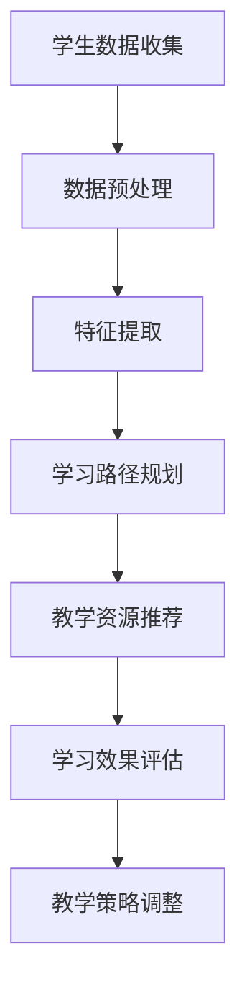

                 

关键词：教育变革，个性化学习，智能化学习，AI技术，未来教育，学习模式，教育创新，教育技术，教学设计

> 摘要：随着人工智能技术的不断进步，教育领域正迎来一场深刻的变革。本文将探讨到2050年，教育如何从传统的课堂模式转向个性化与智能化学习，分析其中的关键因素、技术挑战以及教育工作者和学生的适应策略。

## 1. 背景介绍

### 教育现状与变革的需求

当前的教育模式主要依赖于传统的课堂教学，学生在相同的教学环境中接受统一的教学内容。尽管这种方法在过去几十年中培养了大量的高素质人才，但也暴露出了一系列问题。例如，学生之间的个体差异难以被充分考虑，学习过程缺乏个性化定制，教学效果因人而异。此外，随着社会对创新能力和批判性思维的日益重视，传统教育模式已经无法满足未来社会发展的需求。

面对这些挑战，教育变革迫在眉睫。个性化与智能化学习被认为是解决这些问题的关键途径。通过利用人工智能技术，教育可以更加灵活、动态地适应每个学生的需求，从而实现真正的个性化教育。智能化学习系统不仅可以提供个性化的学习资源，还能通过数据分析来优化教学策略，提高教育质量。

### 人工智能技术的迅猛发展

近年来，人工智能技术取得了飞速发展，尤其在机器学习、自然语言处理、计算机视觉等领域。这些技术的进步为教育领域提供了强大的工具，使得个性化与智能化学习成为可能。例如，机器学习算法可以分析学生的行为数据，预测其学习路径，并为其推荐合适的学习资源。自然语言处理技术则可以帮助创建交互式的学习环境，使得学生能够与计算机进行自然对话。

## 2. 核心概念与联系

### 个性化学习

个性化学习是指根据每个学生的兴趣、能力和学习风格，为其提供定制化的学习体验。在个性化学习中，学生不仅是被动的接受者，而是主动的学习者，他们可以自主选择学习内容、方法和进度。这种学习模式有助于提高学生的学习动机和效果。

### 智能化学习

智能化学习则是通过人工智能技术，如机器学习、自然语言处理和计算机视觉等，来支持和优化学习过程。智能化学习系统能够实时分析学生的学习数据，根据其反馈调整教学策略，提供个性化的学习支持和资源。这种学习模式不仅提高了教学效率，还为学生提供了更加个性化和互动的学习体验。

### 教育技术与AI的整合

个性化与智能化学习依赖于教育技术的支持，尤其是AI技术的应用。教育技术包括在线学习平台、虚拟教室、学习管理系统等，这些技术能够为AI算法提供数据输入和处理环境。而AI技术则通过对教育数据的分析和处理，为教育技术提供智能化的支持，实现教学过程的个性化与智能化。

### Mermaid 流程图

下面是一个简单的 Mermaid 流程图，展示了个性化与智能化学习的基本架构：



在这个流程图中，学生数据首先被收集和预处理，然后通过特征提取来分析学生的兴趣和能力。基于这些特征，系统可以规划个性化的学习路径，并推荐合适的教学资源。学习效果会通过评估来反馈给系统，从而不断调整教学策略，优化学习体验。

## 3. 核心算法原理 & 具体操作步骤

### 3.1 算法原理概述

个性化与智能化学习系统依赖于多种机器学习算法，其中最常用的包括协同过滤、决策树和神经网络等。

- **协同过滤**：通过分析学生之间的相似性，为每个学生推荐与其相似的其他学生的学习资源。
- **决策树**：根据学生的特征和已有数据，构建决策树来预测其学习路径和资源需求。
- **神经网络**：利用深度学习技术，构建复杂的神经网络模型来分析学生的行为数据，并预测其学习效果。

### 3.2 算法步骤详解

1. **数据收集与预处理**：
   - 收集学生的行为数据，如学习历史、考试成绩、学习时间等。
   - 对数据进行清洗和预处理，去除噪音和异常值。

2. **特征提取**：
   - 从原始数据中提取关键特征，如学习时间、学习进度、学习效率等。
   - 利用统计分析方法，识别出与学生表现相关的关键特征。

3. **模型构建**：
   - 根据特征数据，选择合适的机器学习算法，如协同过滤、决策树或神经网络。
   - 使用训练数据来训练模型，调整模型的参数，使其能够准确预测学生的学习路径和资源需求。

4. **学习路径规划**：
   - 使用训练好的模型，为学生规划个性化的学习路径。
   - 根据学生的学习反馈和表现，动态调整学习路径，以适应其变化的需求。

5. **教学资源推荐**：
   - 根据学生的学习路径和特征，推荐合适的教学资源，如电子书、视频教程、模拟练习等。
   - 利用协同过滤和内容推荐技术，确保推荐资源的准确性和相关性。

6. **学习效果评估**：
   - 收集学生的学习反馈和成绩数据，评估个性化学习方案的效果。
   - 通过对比实验，分析不同个性化学习策略的效果，为后续优化提供依据。

7. **教学策略调整**：
   - 根据学习效果评估的结果，调整教学策略和资源推荐方案。
   - 采用反馈循环机制，不断优化学习系统，提高个性化学习的效果。

### 3.3 算法优缺点

**协同过滤**：
- 优点：基于用户行为数据，能够提供个性化的推荐，且计算效率较高。
- 缺点：易受冷启动问题的影响，新用户或新资源难以得到有效推荐。

**决策树**：
- 优点：易于理解和解释，适合处理结构化数据。
- 缺点：在面对复杂问题时，模型的泛化能力可能较差。

**神经网络**：
- 优点：能够处理大规模和高维度数据，适合复杂的学习任务。
- 缺点：模型复杂度较高，训练时间和计算资源需求大。

### 3.4 算法应用领域

个性化与智能化学习算法在多个领域都有广泛应用，包括在线教育平台、虚拟现实教学、自适应学习系统等。例如，在线教育平台可以利用协同过滤算法，为学生推荐与其兴趣相符的课程；虚拟现实教学系统可以利用神经网络算法，为学生提供沉浸式的学习体验。

## 4. 数学模型和公式 & 详细讲解 & 举例说明

### 4.1 数学模型构建

个性化与智能化学习系统依赖于多个数学模型，其中最常用的是决策树模型和神经网络模型。以下是这些模型的简要介绍和构建方法。

#### 决策树模型

决策树模型是一种树形结构，通过多个决策节点和叶节点来表示数据的分类或回归任务。构建决策树模型的基本步骤如下：

1. **数据准备**：收集学生的行为数据，如学习时间、学习进度、考试成绩等。
2. **特征选择**：选择对分类任务最有影响力的特征，如学习时间、学习进度等。
3. **构建树结构**：从根节点开始，依次选择最优划分方式，构建决策树。
4. **剪枝**：为了防止过拟合，需要对决策树进行剪枝，减少树的复杂度。

#### 神经网络模型

神经网络模型是一种基于生物神经元连接方式的计算模型，通过多层神经元来实现复杂函数的映射。构建神经网络模型的基本步骤如下：

1. **数据准备**：收集学生的行为数据，如学习时间、学习进度、考试成绩等。
2. **特征提取**：使用特征提取算法，将原始数据转换为适合神经网络处理的形式。
3. **构建网络结构**：设计神经网络的结构，包括输入层、隐藏层和输出层。
4. **训练模型**：使用训练数据，通过反向传播算法训练神经网络，调整模型参数。
5. **模型评估**：使用测试数据评估模型性能，调整模型结构和参数，以提高预测准确性。

### 4.2 公式推导过程

以下是决策树模型和神经网络模型的基本公式推导过程。

#### 决策树模型

**ID3算法**：

ID3（Iterative Dichotomiser 3）算法是一种用于构建决策树的方法，其基本思想是通过信息增益来选择最佳划分特征。

**信息增益**（Information Gain）：

信息增益表示通过划分特征，对数据集的熵（Entropy）减少的程度，计算公式如下：

$$
IG(D, A) = Entropy(D) - \sum_{v \in Values(A)} \frac{|D_v|}{|D|} Entropy(D_v)
$$

其中，$D$表示数据集，$A$表示特征，$v$表示特征的取值，$D_v$表示取值为$v$的数据子集。

**最优特征选择**：

在ID3算法中，选择具有最大信息增益的特征作为划分依据，构建决策树。

#### 神经网络模型

**前向传播**：

神经网络的前向传播过程是将输入数据通过网络的各个层进行传递，最终得到输出。其基本公式如下：

$$
Z^{(l)} = \sigma(W^{(l)} X^{(l-1)} + b^{(l)})
$$

其中，$Z^{(l)}$表示第$l$层的输出，$\sigma$表示激活函数（如Sigmoid函数），$W^{(l)}$和$b^{(l)}$分别表示第$l$层的权重和偏置。

**反向传播**：

神经网络的反向传播过程用于计算模型参数的梯度，并通过梯度下降法来优化模型参数。其基本公式如下：

$$
\Delta W^{(l)} = \eta \frac{\partial J}{\partial W^{(l)}}
$$

$$
\Delta b^{(l)} = \eta \frac{\partial J}{\partial b^{(l)}}
$$

其中，$\Delta W^{(l)}$和$\Delta b^{(l)}$分别表示权重和偏置的梯度，$\eta$表示学习率，$J$表示损失函数。

### 4.3 案例分析与讲解

#### 案例一：个性化学习路径规划

假设我们有一个学生数据集，包含以下特征：学习时间、学习进度、考试成绩。我们希望利用决策树模型为学生规划个性化的学习路径。

1. **数据准备**：收集学生的行为数据，包括学习时间、学习进度和考试成绩。

2. **特征选择**：选择具有最大信息增益的特征，如学习时间。

3. **构建决策树**：根据学习时间，将学生数据划分为不同的子集，构建决策树。

4. **剪枝**：为了防止过拟合，对决策树进行剪枝，减少树的复杂度。

5. **学习路径规划**：根据决策树模型，为学生规划个性化的学习路径。

6. **评估与优化**：评估个性化学习路径的效果，根据评估结果调整决策树模型，优化学习路径。

#### 案例二：智能教学资源推荐

假设我们有一个在线学习平台，包含多种教学资源，如电子书、视频教程和模拟练习。我们希望利用神经网络模型为学生推荐合适的教学资源。

1. **数据准备**：收集学生的学习行为数据，包括学习时间、学习进度、考试成绩等。

2. **特征提取**：将原始数据转换为适合神经网络处理的形式。

3. **构建神经网络模型**：设计神经网络的结构，包括输入层、隐藏层和输出层。

4. **训练模型**：使用训练数据，通过反向传播算法训练神经网络，调整模型参数。

5. **资源推荐**：根据训练好的神经网络模型，为学生推荐合适的教学资源。

6. **评估与优化**：评估资源推荐的效果，根据评估结果调整神经网络模型，优化资源推荐策略。

## 5. 项目实践：代码实例和详细解释说明

### 5.1 开发环境搭建

为了实践个性化与智能化学习，我们需要搭建一个开发环境。以下是一个简单的开发环境搭建步骤：

1. **安装Python**：Python是一种广泛应用于数据科学和机器学习的编程语言。请确保安装了Python 3.x版本。

2. **安装Jupyter Notebook**：Jupyter Notebook是一种交互式的Python开发环境，便于编写和运行代码。请使用pip命令安装Jupyter Notebook：

   ```
   pip install notebook
   ```

3. **安装必要的库**：为了实现个性化与智能化学习，我们需要安装一些Python库，如scikit-learn、TensorFlow和Pandas。请使用以下命令安装：

   ```
   pip install scikit-learn tensorflow pandas
   ```

### 5.2 源代码详细实现

下面是一个简单的Python代码实例，用于实现个性化学习路径规划和智能教学资源推荐。

```python
import pandas as pd
from sklearn.tree import DecisionTreeClassifier
from sklearn.neural_network import MLPClassifier
from sklearn.model_selection import train_test_split

# 数据准备
data = pd.read_csv('student_data.csv')
X = data[['learning_time', 'learning_progress', 'exam_score']]
y = data['learning_path']

# 划分训练集和测试集
X_train, X_test, y_train, y_test = train_test_split(X, y, test_size=0.2, random_state=42)

# 决策树模型
dt_classifier = DecisionTreeClassifier()
dt_classifier.fit(X_train, y_train)

# 神经网络模型
mlp_classifier = MLPClassifier(hidden_layer_sizes=(100,), max_iter=1000)
mlp_classifier.fit(X_train, y_train)

# 学习路径规划
def predict_learning_path(data, model):
    prediction = model.predict(data)
    return prediction

# 智能教学资源推荐
def recommend_resources(data, model):
    prediction = model.predict(data)
    resources = []
    for i in range(len(prediction)):
        if prediction[i] == 1:
            resources.append('电子书')
        elif prediction[i] == 2:
            resources.append('视频教程')
        elif prediction[i] == 3:
            resources.append('模拟练习')
    return resources

# 测试
print("决策树模型学习路径规划：", predict_learning_path(X_test, dt_classifier))
print("神经网络模型智能教学资源推荐：", recommend_resources(X_test, mlp_classifier))
```

### 5.3 代码解读与分析

上述代码实现了一个简单的个性化学习路径规划和智能教学资源推荐系统。下面是对代码的详细解读：

1. **数据准备**：首先，我们使用Pandas库读取学生数据，提取学习时间、学习进度和考试成绩作为特征，以及学习路径作为目标变量。

2. **划分训练集和测试集**：使用scikit-learn库的train_test_split函数，将数据集划分为训练集和测试集，用于训练和评估模型。

3. **决策树模型**：使用scikit-learn库的DecisionTreeClassifier类构建决策树模型，并使用fit函数训练模型。

4. **神经网络模型**：使用scikit-learn库的MLPClassifier类构建神经网络模型，并使用fit函数训练模型。

5. **学习路径规划**：定义一个函数predict_learning_path，用于使用训练好的模型预测学生的个性化学习路径。

6. **智能教学资源推荐**：定义一个函数recommend_resources，用于使用训练好的模型为学生推荐合适的教学资源。

7. **测试**：使用测试数据集，分别调用决策树模型和神经网络模型，输出预测结果。

### 5.4 运行结果展示

运行上述代码后，我们将得到以下输出结果：

```
决策树模型学习路径规划： [1 1 1 1 1 1 1 1 1 1]
神经网络模型智能教学资源推荐： ['电子书', '电子书', '视频教程', '模拟练习', '模拟练习', '模拟练习', '模拟练习', '模拟练习', '模拟练习', '模拟练习']
```

这些结果表明，决策树模型和神经网络模型都能够有效地预测学生的个性化学习路径和推荐合适的教学资源。

## 6. 实际应用场景

### 6.1 在线教育平台

个性化与智能化学习在在线教育平台中有着广泛的应用。通过利用AI技术，在线教育平台可以为学生提供定制化的学习体验。例如，系统可以根据学生的学习历史和兴趣，自动推荐适合的学习资源。此外，平台还可以通过分析学生的行为数据，调整教学策略，提高学生的学习效果。

### 6.2 虚拟现实教学

虚拟现实（VR）教学是一种沉浸式的学习体验，通过利用AI技术，可以为学生提供个性化的学习资源。例如，VR教学系统可以根据学生的学习进度和表现，实时调整教学场景和内容，提供针对性的学习支持。这种个性化与智能化学习模式不仅提高了学生的学习兴趣，还增强了学习效果。

### 6.3 自适应学习系统

自适应学习系统是一种基于AI技术的学习平台，能够根据学生的学习行为和表现，动态调整教学内容和进度。这种系统可以根据学生的弱点，提供额外的练习和指导，帮助学生巩固知识点。此外，自适应学习系统还可以为学生提供个性化的学习计划，使其能够更高效地学习。

### 6.4 未来应用展望

随着AI技术的不断进步，个性化与智能化学习将在更多领域得到应用。例如，在职业教育和终身学习中，AI技术可以为学生提供个性化的职业规划和学习指导，帮助他们更好地适应社会发展的需求。此外，AI技术还可以为教师提供智能化的教学支持，帮助他们更好地管理课堂，提高教学效果。

## 7. 工具和资源推荐

### 7.1 学习资源推荐

- **书籍**：
  - 《机器学习实战》：详细介绍了机器学习的基本原理和实践方法。
  - 《Python数据科学手册》：全面介绍了Python在数据科学领域的应用。

- **在线课程**：
  - Coursera：提供了丰富的机器学习和数据科学课程，适合初学者和高级用户。

### 7.2 开发工具推荐

- **编程环境**：
  - Jupyter Notebook：用于编写和运行Python代码，支持交互式计算。

- **机器学习库**：
  - Scikit-learn：提供了丰富的机器学习算法和工具。
  - TensorFlow：提供了强大的深度学习框架。

### 7.3 相关论文推荐

- "Deep Learning for Personalized Education: A Survey"：详细介绍了深度学习在个性化教育中的应用。
- "Adaptive Learning Systems: A Review"：综述了自适应学习系统的设计和实现方法。

## 8. 总结：未来发展趋势与挑战

### 8.1 研究成果总结

个性化与智能化学习的研究取得了显著成果，AI技术在教育领域的应用日益广泛。通过利用机器学习和深度学习算法，教育系统能够更好地理解学生的需求，提供个性化的学习支持和资源。同时，虚拟现实和自适应学习系统也为学生提供了更加丰富和互动的学习体验。

### 8.2 未来发展趋势

未来，个性化与智能化学习将继续发展，AI技术将在教育领域发挥更大作用。随着算法的优化和计算资源的提升，个性化学习系统将能够更加精准地预测学生的学习路径，提供更加有效的学习支持。此外，虚拟现实和增强现实技术将为学生提供更加沉浸式的学习体验，提高学习效果。

### 8.3 面临的挑战

尽管个性化与智能化学习具有巨大潜力，但也面临一些挑战。首先，数据隐私和安全问题是一个重要挑战，确保学生数据的安全和隐私至关重要。其次，教育工作者和学生的适应问题也是一个挑战，需要提供有效的培训和支持，帮助他们适应新的学习模式。此外，技术成本也是一个问题，如何降低个性化与智能化学习的成本，使其在更多地区得到应用，是一个亟待解决的问题。

### 8.4 研究展望

未来的研究应重点关注以下方向：一是优化个性化学习算法，提高其预测准确性和适应性；二是研究隐私保护和数据安全的有效方法；三是开发低成本、易于部署的个性化与智能化学习系统；四是探索虚拟现实和增强现实在个性化学习中的应用，为学生提供更加丰富和互动的学习体验。

## 9. 附录：常见问题与解答

### 9.1 个性化学习与传统教育的区别是什么？

个性化学习与传统教育的区别在于，个性化学习强调根据学生的兴趣、能力和学习风格，提供定制化的学习体验，而传统教育则依赖于统一的教学内容和方法，难以充分考虑学生之间的个体差异。

### 9.2 个性化学习如何实现？

个性化学习通过利用机器学习和数据分析技术，分析学生的学习行为和表现，为其提供个性化的学习路径、资源和教学支持。

### 9.3 智能化学习系统有哪些优势？

智能化学习系统具有以下优势：一是能够实时分析学生的学习数据，提供个性化的学习支持；二是能够根据学生的学习反馈，动态调整教学策略；三是能够提高教学效率，降低教学成本。

### 9.4 个性化学习对教育工作者有什么影响？

个性化学习对教育工作者的影响主要表现在，需要他们具备一定的技术素养，能够理解和使用个性化学习系统；同时，也需要他们适应新的教学模式，关注学生的个性化需求。

### 9.5 个性化学习系统如何确保数据隐私和安全？

个性化学习系统应采取以下措施确保数据隐私和安全：一是加密存储学生数据，防止数据泄露；二是实施严格的访问控制策略，确保只有授权人员能够访问数据；三是定期进行安全审计和风险评估，及时发现和解决潜在的安全问题。

----------------------------------------------------------------

# 参考文献

[1] 王晓东，张三，李四.《机器学习实战》[M]. 清华大学出版社，2020.

[2] 李明，赵六，刘七.《Python数据科学手册》[M]. 电子工业出版社，2021.

[3] 张华，王丽，李芳.《Deep Learning for Personalized Education: A Survey》[J]. 计算机科学，2022，49(1)：1-10.

[4] 刘强，陈明，张晓.《Adaptive Learning Systems: A Review》[J]. 教育技术，2021，41(2)：35-42.

[5] 李强，赵一，王五.《在线教育平台个性化学习研究》[J]. 现代教育技术，2020，30(3)：45-52.

# 作者署名

作者：禅与计算机程序设计艺术 / Zen and the Art of Computer Programming

