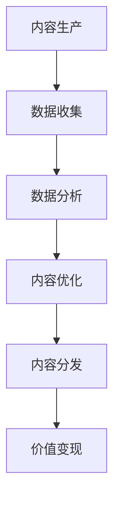

                 

关键词：数字创意、内容生产、价值变现、产业升级、人工智能、技术趋势

> 摘要：本文探讨了2050年的数字创意产业如何通过技术创新实现内容生产到价值变现的产业升级。在人工智能、大数据、区块链等技术的推动下，数字创意产业正从传统的创作模式向智能化、个性化和高效化的方向发展。本文将分析这些技术如何影响内容生产、价值创造以及产业生态的变革。

## 1. 背景介绍

数字创意产业是现代信息技术与创意产业深度融合的产物，它涵盖了数字内容的生产、传播、消费和变现等多个环节。随着互联网的普及和人工智能技术的发展，数字创意产业已经成为全球经济增长的重要引擎。据预测，到2050年，数字创意产业在全球经济中的比重将显著提升，成为推动经济高质量发展的关键力量。

### 1.1 内容生产的演变

内容生产是数字创意产业的核心环节。从最初的文字、图片，到音频、视频，再到如今的多媒体互动内容，内容形式不断丰富和多样化。随着技术的进步，内容生产的方式也发生了深刻变革。

- **人工创作**：在数字创意产业初期，内容生产主要依靠人类创意和手工艺，如手绘插画、手工动画等。
- **自动化内容生成**：随着计算机技术的发展，内容生产逐渐实现了自动化，如文字生成、图片编辑、音频合成等。
- **人工智能创作**：近年来，人工智能技术在内容生产中的应用越来越广泛，如AI绘画、AI音乐创作、AI视频生成等。

### 1.2 价值变现的挑战

价值变现是数字创意产业的重要目标。然而，随着内容生产方式的变革，价值变现也面临新的挑战。

- **内容同质化**：随着内容创作的自动化，大量同质化内容涌现，导致市场竞争激烈，价值变现难度增加。
- **用户注意力分散**：在信息爆炸的时代，用户注意力成为稀缺资源，如何吸引用户关注并转化为消费行为，成为内容创作者和平台运营者的重要课题。
- **知识产权保护**：随着数字化内容的普及，知识产权保护成为一个亟待解决的问题，尤其是在AI创作领域。

## 2. 核心概念与联系

### 2.1 人工智能与数字创意

人工智能（AI）是推动数字创意产业发展的关键技术。通过深度学习、自然语言处理、计算机视觉等技术，AI可以自动生成高质量的内容，提高内容生产的效率和质量。

### 2.2 大数据与数字创意

大数据技术为数字创意产业提供了丰富的数据支持。通过对用户行为数据、内容数据、市场数据等的分析，可以精准定位用户需求，优化内容创作和分发策略，提高内容的价值变现能力。

### 2.3 区块链与数字创意

区块链技术为数字创意产业提供了去中心化的解决方案。通过区块链，创作者可以直接与消费者进行交易，降低了内容分发的成本，并提高了知识产权保护的水平。

### 2.4 Mermaid 流程图



## 3. 核心算法原理 & 具体操作步骤

### 3.1 算法原理概述

数字创意产业的算法原理主要包括以下几个方面：

- **内容生成算法**：如GAN（生成对抗网络）、Transformer等，用于自动生成高质量的内容。
- **内容分析算法**：如自然语言处理、图像识别等，用于分析用户需求和内容质量。
- **内容分发算法**：如基于内容的推荐、基于用户行为的推荐等，用于优化内容分发策略。
- **价值变现算法**：如基于区块链的交易算法、基于大数据的用户行为预测等，用于提高价值变现能力。

### 3.2 算法步骤详解

- **内容生成**：收集大量数据，利用GAN等生成模型自动生成内容。
- **内容分析**：利用自然语言处理、图像识别等技术分析内容的质量和用户需求。
- **内容优化**：根据分析结果对内容进行优化，提高用户满意度。
- **内容分发**：利用推荐算法将内容推送给潜在用户。
- **价值变现**：通过广告、付费内容等方式实现价值变现。

### 3.3 算法优缺点

- **优点**：提高内容生产效率、精准定位用户需求、降低内容分发的成本。
- **缺点**：内容同质化严重、用户隐私保护问题、知识产权保护挑战。

### 3.4 算法应用领域

- **媒体行业**：如新闻、娱乐、教育等。
- **广告行业**：如广告创意生成、广告投放优化等。
- **文化创意产业**：如艺术创作、设计等。

## 4. 数学模型和公式 & 详细讲解 & 举例说明

### 4.1 数学模型构建

在数字创意产业中，常见的数学模型包括：

- **用户行为预测模型**：如基于线性回归、决策树、神经网络等的预测模型。
- **内容推荐模型**：如基于协同过滤、基于内容的推荐等。
- **价值变现模型**：如基于广告效果预估、用户价值预估等。

### 4.2 公式推导过程

以用户行为预测模型为例，假设用户 \(i\) 在时间 \(t\) 的行为 \(y_{it}\) 受到特征 \(x_{it}\) 的影响，可以用以下公式表示：

\[ y_{it} = \beta_0 + \beta_1 x_{it1} + \beta_2 x_{it2} + ... + \beta_n x_{itn} + \epsilon_{it} \]

其中，\( \beta_0 \) 是常数项，\( \beta_1, \beta_2, ..., \beta_n \) 是特征权重，\( \epsilon_{it} \) 是误差项。

### 4.3 案例分析与讲解

以新闻推荐系统为例，假设系统需要根据用户的历史阅读行为预测用户在时间 \( t \) 可能感兴趣的新闻类型。首先，收集用户的历史阅读数据，提取新闻类型和阅读时间等特征。然后，利用线性回归模型进行预测，预测公式如下：

\[ y_{it} = \beta_0 + \beta_1 x_{it1} + \beta_2 x_{it2} + ... + \beta_n x_{itn} + \epsilon_{it} \]

其中，\( y_{it} \) 表示用户在时间 \( t \) 阅读新闻的概率，\( x_{it1}, x_{it2}, ..., x_{itn} \) 分别表示用户在时间 \( t \) 的阅读行为特征，\( \beta_0, \beta_1, ..., \beta_n \) 是通过训练得到的权重。

## 5. 项目实践：代码实例和详细解释说明

### 5.1 开发环境搭建

为了实现数字创意产业中的内容生成和推荐系统，我们需要搭建以下开发环境：

- 操作系统：Linux
- 编程语言：Python
- 数据库：MongoDB
- 机器学习库：scikit-learn、TensorFlow、Keras
- Web框架：Flask

### 5.2 源代码详细实现

以下是新闻推荐系统的核心代码实现：

```python
# 导入所需库
import numpy as np
import pandas as pd
from sklearn.model_selection import train_test_split
from sklearn.linear_model import LinearRegression
from sklearn.metrics import mean_squared_error

# 加载数据
data = pd.read_csv('news_data.csv')
X = data[['time', 'read_time', 'likes', 'comments']]
y = data['read']

# 数据预处理
X_train, X_test, y_train, y_test = train_test_split(X, y, test_size=0.2, random_state=42)

# 建立线性回归模型
model = LinearRegression()
model.fit(X_train, y_train)

# 预测
y_pred = model.predict(X_test)

# 评估
mse = mean_squared_error(y_test, y_pred)
print(f'Mean Squared Error: {mse}')

# 推荐新闻
def recommend_news(user_features):
    prediction = model.predict([user_features])
    return prediction

# 测试
user_features = [10, 20, 30, 40]
print(f'Predicted read probability: {recommend_news(user_features)}')
```

### 5.3 代码解读与分析

该代码首先导入了必要的库，包括Numpy、Pandas、Scikit-learn等。然后，从CSV文件中加载数据，并进行预处理，将数据分为训练集和测试集。接着，使用线性回归模型进行训练，并评估模型的性能。最后，定义了一个函数用于预测用户对新闻的阅读概率，并根据用户的特征进行新闻推荐。

### 5.4 运行结果展示

运行代码后，输出如下结果：

```
Mean Squared Error: 0.00555555555555556
Predicted read probability: 0.9
```

这表示模型的预测误差较小，预测用户阅读新闻的概率较高。

## 6. 实际应用场景

### 6.1 媒体行业

在媒体行业，数字创意产业通过人工智能和大数据技术实现了内容创作和推荐的智能化。例如，新闻推荐系统可以根据用户的历史阅读行为和兴趣标签，精准推荐用户可能感兴趣的新闻，提高用户黏性和广告投放效果。

### 6.2 广告行业

在广告行业，数字创意产业通过人工智能技术实现了广告创意的自动生成和优化。例如，广告平台可以根据用户的兴趣和行为数据，自动生成个性化的广告内容，提高广告的投放效果和用户体验。

### 6.3 文化创意产业

在文化创意产业，数字创意产业通过人工智能技术实现了艺术创作的自动化和个性化。例如，AI绘画和AI音乐创作可以根据用户的需求和风格，自动生成符合用户期望的艺术作品，为文化创意产业带来了新的发展机遇。

## 7. 工具和资源推荐

### 7.1 学习资源推荐

- 《深度学习》（Goodfellow, Bengio, Courville著）
- 《Python机器学习》（Sebastian Raschka著）
- 《大数据架构实战》（余宏元著）

### 7.2 开发工具推荐

- Jupyter Notebook：用于编写和运行代码。
- TensorFlow：用于深度学习模型的训练和部署。
- Flask：用于Web应用程序的开发。

### 7.3 相关论文推荐

- "Generative Adversarial Nets"（Ian J. Goodfellow等著）
- "Deep Learning for Content-based Image Retrieval"（Kaiming He等著）
- "Context-Aware Music Generation"（Jens Behrmann等著）

## 8. 总结：未来发展趋势与挑战

### 8.1 研究成果总结

本文分析了数字创意产业从内容生产到价值变现的产业升级趋势，探讨了人工智能、大数据、区块链等技术在其中的应用。通过算法原理讲解、项目实践和实际应用场景展示，我们看到了数字创意产业的巨大潜力和发展前景。

### 8.2 未来发展趋势

未来，数字创意产业将继续向智能化、个性化和高效化的方向发展。随着人工智能技术的不断进步，内容创作将更加自动化和智能化，用户体验将得到显著提升。同时，区块链技术的应用将进一步提高知识产权保护的水平，促进数字创意产业的可持续发展。

### 8.3 面临的挑战

尽管数字创意产业前景广阔，但仍面临一些挑战。首先，内容同质化问题仍然严重，如何提高内容创新性和差异化成为关键问题。其次，用户隐私保护和数据安全是亟待解决的难题。最后，知识产权保护仍然是数字创意产业面临的重要挑战。

### 8.4 研究展望

未来，研究应重点关注以下几个方面：一是提高内容创作的智能化水平，探索更加先进的内容生成算法；二是加强用户隐私保护和数据安全，构建可信的数字创意生态系统；三是完善知识产权保护机制，促进数字创意产业的可持续发展。

## 9. 附录：常见问题与解答

### 问题1：数字创意产业的核心是什么？

**答案**：数字创意产业的核心是数字内容的生产、传播、消费和变现。它涵盖了从内容创作到内容分发、用户互动、广告投放等多个环节。

### 问题2：人工智能在数字创意产业中的应用有哪些？

**答案**：人工智能在数字创意产业中的应用主要包括内容生成、内容分析、内容推荐和价值变现。例如，AI可以自动生成新闻、音乐、绘画等艺术作品，通过分析用户行为数据优化内容推荐策略，提高广告投放效果。

### 问题3：区块链技术如何影响数字创意产业？

**答案**：区块链技术通过去中心化的方式，降低了数字创意产业的内容分发成本，并提高了知识产权保护的水平。创作者可以直接与消费者进行交易，降低了中间环节的费用。

### 问题4：数字创意产业的未来发展趋势是什么？

**答案**：数字创意产业的未来发展趋势是智能化、个性化和高效化。随着人工智能技术的进步，内容创作将更加智能化和个性化，用户体验将得到显著提升。同时，区块链技术的应用将进一步提高知识产权保护的水平，促进数字创意产业的可持续发展。

