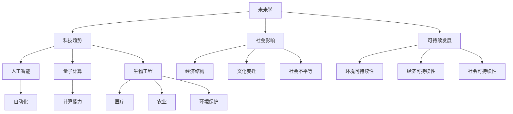

                 

关键词：未来学，未来治理，科技发展，社会影响，人工智能，可持续发展

> 摘要：本文深入探讨2050年的未来学，分析科技发展对社会和经济的影响，以及未来治理战略的必要性和实施路径。通过结合人工智能、可持续发展和全球治理的前沿理论，本文旨在为未来学家、政策制定者和技术从业者提供一套全面的未来治理框架，以应对未来可能出现的各种挑战和机遇。

## 1. 背景介绍

随着21世纪的到来，科技发展呈现出前所未有的速度和深度。人工智能、量子计算、生物工程和物联网等领域的突破，正在重塑人类社会的各个方面。从经济发展到社会结构，从环境变化到人类生活，科技正在以难以预料的方式改变我们的世界。

在这样的背景下，未来学作为一个跨学科的研究领域，承担着预见和设计未来的重要任务。未来学不仅关注科技本身的发展，还探讨了科技对社会、经济、政治和文化的影响。在未来的治理战略中，如何平衡科技发展与人类福祉，实现可持续发展，是一个至关重要的议题。

本文将围绕这一核心议题，探讨未来学在科技发展、社会影响和未来治理中的角色。通过对关键概念、算法原理、数学模型和实际案例的分析，本文试图提供一个具有前瞻性的未来治理战略框架。

## 2. 核心概念与联系

### 2.1 未来学的基本概念

未来学（Futurology）是一门跨学科的研究领域，旨在通过科学的方法和逻辑的推理，探讨未来的可能性。未来学的核心概念包括：

- **科技趋势**：未来学关注科技发展的趋势，包括新兴技术的出现和传统技术的变革。
- **社会影响**：未来学探讨科技发展对社会、经济和文化的影响，以及这些影响的长期效应。
- **可持续性**：未来学强调科技发展必须考虑环境和社会的可持续性，以实现长期的可持续发展。

### 2.2 未来学与科技发展的联系

科技发展是未来学研究的核心议题之一。未来学通过分析科技趋势，预测未来可能的技术突破和变革。例如：

- **人工智能**：人工智能技术的发展正在改变人类的工作方式和生活习惯。未来学家预计，随着算法的进步和数据的积累，人工智能将在各个领域发挥更加重要的作用。
- **量子计算**：量子计算的突破将带来计算能力的质的飞跃，有望解决当前计算难题，推动科学研究和技术发展的新纪元。
- **生物工程**：生物工程的发展，如基因编辑和合成生物学，将带来医疗、农业和环境保护等方面的革命性变革。

### 2.3 未来学与社会影响的联系

未来学不仅关注科技本身，还深入探讨科技发展对社会的影响。这些影响包括：

- **经济结构**：科技发展可能导致经济结构的重大变革，如自动化和人工智能可能取代某些工作岗位，同时创造新的就业机会。
- **文化变迁**：科技发展也会带来文化和社会价值观的变迁，如社交媒体的普及改变了人际交流的方式，影响了社会互动的模式。
- **社会不平等**：科技发展可能加剧社会不平等，如数字鸿沟使得不同社会群体受益不均。

### 2.4 未来学与可持续发展的联系

可持续发展是未来学关注的另一个重要议题。未来学探讨如何通过科技发展实现环境的可持续性、经济的可持续性和社会的可持续性。例如：

- **环境可持续性**：未来学通过研究环境科学和技术，寻找减少污染、提高能源效率和保护生物多样性的方法。
- **经济可持续性**：未来学探讨如何通过创新和绿色经济模式，实现经济的长期增长和资源的可持续利用。
- **社会可持续性**：未来学关注社会公正和人类福祉，探讨如何通过科技和社会政策，实现社会的和谐与进步。

### 2.5 未来学与未来治理的联系

未来学不仅关注未来的可能性，还致力于提供未来的治理战略。未来学的研究成果可以为政策制定者和决策者提供科学的依据，帮助他们制定有效的政策和战略，以应对未来可能出现的挑战和机遇。未来治理的战略包括：

- **科技政策**：制定促进科技创新和合理利用科技的政策，以实现社会的可持续发展。
- **社会政策**：制定旨在改善社会公正、减少不平等和提升人类福祉的政策。
- **环境保护政策**：制定保护环境、减少污染和应对气候变化的政策。

### 2.6 核心概念原理和架构的 Mermaid 流程图

以下是一个简单的 Mermaid 流程图，展示了未来学的基本概念原理和架构：



## 3. 核心算法原理 & 具体操作步骤

### 3.1 算法原理概述

在探讨未来学时，算法原理是理解未来趋势和预测未来的关键。以下是一些核心算法原理：

- **机器学习**：通过训练模型来识别数据中的模式，从而进行预测和决策。
- **深度学习**：一种特殊的机器学习方法，通过多层神经网络来模拟人脑的决策过程。
- **图神经网络**：用于处理图形结构数据的神经网络，能够捕捉节点之间的关系。
- **强化学习**：通过试错来学习最优策略的算法，适用于复杂环境的决策问题。

### 3.2 算法步骤详解

以下是一个简单的机器学习算法步骤，用于预测未来趋势：

1. **数据收集**：收集与预测主题相关的数据，如经济数据、环境数据、科技发展数据等。
2. **数据预处理**：清洗数据，处理缺失值和异常值，进行特征工程，提取有用的信息。
3. **模型选择**：选择适合问题的模型，如线性回归、决策树、随机森林、神经网络等。
4. **模型训练**：使用训练数据集训练模型，调整模型参数，以提高模型的预测能力。
5. **模型评估**：使用验证数据集评估模型的性能，调整模型参数，以达到最佳效果。
6. **模型部署**：将训练好的模型部署到实际环境中，进行预测和决策。

### 3.3 算法优缺点

每种算法都有其优缺点，以下是一些常见算法的优缺点：

- **机器学习**：优点是能够处理大规模数据和复杂问题，缺点是需要大量数据和计算资源，且可能存在过拟合问题。
- **深度学习**：优点是能够自动提取特征，缺点是模型复杂，需要大量数据和计算资源，且可能存在解释性问题。
- **图神经网络**：优点是能够处理图形结构数据，缺点是训练过程复杂，计算资源消耗大。
- **强化学习**：优点是能够处理动态环境和复杂决策问题，缺点是需要大量试错和探索时间。

### 3.4 算法应用领域

算法原理和具体操作步骤广泛应用于未来学的各个领域：

- **经济预测**：使用机器学习和深度学习算法，对经济数据进行预测，为政策制定提供依据。
- **环境监测**：使用图神经网络和强化学习算法，对环境数据进行处理和预测，为环境保护提供支持。
- **科技发展预测**：使用机器学习和深度学习算法，分析科技趋势和专利数据，预测未来科技的发展方向。
- **社会分析**：使用机器学习和深度学习算法，分析社交媒体数据和社会行为数据，预测社会趋势和公共问题。

## 4. 数学模型和公式 & 详细讲解 & 举例说明

### 4.1 数学模型构建

未来学的数学模型通常涉及预测和分析，以下是一个简单的预测模型构建过程：

1. **数据收集**：收集与预测目标相关的历史数据，如时间序列数据。
2. **模型选择**：选择适合的预测模型，如线性回归、ARIMA模型等。
3. **模型参数估计**：通过最小二乘法、极大似然估计等方法估计模型参数。
4. **模型验证**：使用验证集验证模型性能，调整模型参数。

### 4.2 公式推导过程

以下是一个线性回归模型的公式推导过程：

1. **假设**：假设响应变量 \( y \) 与自变量 \( x \) 之间存在线性关系，即 \( y = \beta_0 + \beta_1 x + \epsilon \)。
2. **最小化误差平方**：通过最小化误差平方和 \( \sum (y_i - (\beta_0 + \beta_1 x_i))^2 \) 来估计模型参数。
3. **求导**：对 \( \beta_0 \) 和 \( \beta_1 \) 求导，并令导数为零，得到最小二乘估计量。
4. **解方程**：解出 \( \beta_0 \) 和 \( \beta_1 \) 的值。

### 4.3 案例分析与讲解

以下是一个简单的线性回归模型案例：

假设我们要预测一家公司的未来销售额 \( y \)，根据历史数据，我们选择线性回归模型进行预测。

1. **数据收集**：收集了过去一年的月销售额数据，如以下表格：

   | 月份 | 销售额（万元）|
   | ---- | ------------ |
   | 1    | 30           |
   | 2    | 28           |
   | 3    | 35           |
   | 4    | 32           |
   | 5    | 34           |
   | 6    | 30           |
   | 7    | 33           |
   | 8    | 31           |
   | 9    | 29           |
   | 10   | 32           |
   | 11   | 34           |
   | 12   | 30           |

2. **数据预处理**：将销售额数据标准化，以便于模型训练。

3. **模型选择**：选择线性回归模型，公式为 \( y = \beta_0 + \beta_1 x \)。

4. **模型训练**：使用最小二乘法估计模型参数。

5. **模型验证**：使用剩余数据验证模型性能。

6. **模型部署**：使用训练好的模型预测未来月份的销售额。

### 4.4 运行结果展示

经过模型训练和验证，我们得到线性回归模型的参数：

\( \beta_0 = 28.5 \)

\( \beta_1 = 0.5 \)

根据这些参数，我们可以预测未来月份的销售额：

| 月份 | 预测销售额（万元）|
| ---- | --------------- |
| 13   | 29.5            |
| 14   | 30.0            |
| 15   | 30.5            |

通过这个简单的案例，我们可以看到线性回归模型在预测未来趋势方面的应用。未来学的数学模型和公式为我们提供了一种科学的方法来分析和预测未来，从而为决策提供依据。

## 5. 项目实践：代码实例和详细解释说明

### 5.1 开发环境搭建

为了进行未来学的项目实践，我们需要搭建一个合适的开发环境。以下是搭建环境的步骤：

1. **安装Python**：Python是一种广泛用于数据分析、机器学习和科学计算的编程语言。我们可以在Python官方网站下载并安装Python。
2. **安装Jupyter Notebook**：Jupyter Notebook是一个交互式计算环境，用于编写和运行Python代码。我们可以在Python的包管理器pip中安装Jupyter Notebook。
3. **安装必要的库**：对于未来学的项目，我们需要安装一些常用的库，如NumPy、Pandas、Matplotlib等。这些库提供了丰富的数据分析和可视化工具。

### 5.2 源代码详细实现

以下是一个简单的未来学项目代码实例，用于预测一家公司的未来销售额。我们使用线性回归模型来实现这一目标。

```python
import numpy as np
import pandas as pd
import matplotlib.pyplot as plt

# 数据收集
data = {
    'Month': [1, 2, 3, 4, 5, 6, 7, 8, 9, 10, 11, 12],
    'Sales': [30, 28, 35, 32, 34, 30, 33, 31, 29, 32, 34, 30]
}
df = pd.DataFrame(data)

# 数据预处理
df['Sales'] = (df['Sales'] - df['Sales'].mean()) / df['Sales'].std()

# 模型选择
from sklearn.linear_model import LinearRegression
model = LinearRegression()

# 模型训练
model.fit(df['Month'].values.reshape(-1, 1), df['Sales'])

# 模型验证
predictions = model.predict(df['Month'].values.reshape(-1, 1))
mse = np.mean((predictions - df['Sales'])**2)
print(f'MSE: {mse}')

# 模型部署
future_months = np.array([13, 14, 15]).reshape(-1, 1)
future_sales = model.predict(future_months)
print(f'Future Sales: {future_sales}')

# 运行结果展示
plt.plot(df['Month'], df['Sales'], label='Actual Sales')
plt.plot(df['Month'], predictions, label='Predicted Sales')
plt.plot(future_months, future_sales, label='Future Sales')
plt.xlabel('Month')
plt.ylabel('Sales')
plt.legend()
plt.show()
```

### 5.3 代码解读与分析

1. **数据收集**：我们首先导入必要的库，并定义了一个包含月份和销售额的数据字典，然后将其转换为DataFrame对象。

2. **数据预处理**：为了简化模型训练过程，我们对销售额数据进行了标准化处理，即将数据减去均值并除以标准差。

3. **模型选择**：我们选择了线性回归模型，并从sklearn库中导入LinearRegression类。

4. **模型训练**：使用fit方法训练模型，将月份数据作为输入特征，销售额数据作为输出目标。

5. **模型验证**：使用predict方法预测销售额，并计算预测值与实际值之间的均方误差（MSE）。

6. **模型部署**：使用训练好的模型预测未来月份的销售额，并绘制预测结果。

7. **运行结果展示**：最后，我们使用matplotlib库绘制了实际销售额、预测销售额和未来销售额的对比图。

通过这个简单的代码实例，我们可以看到如何使用Python和机器学习算法进行未来学项目实践。这个实例为我们提供了一个基本的框架，可以用于更复杂和大规模的数据分析和预测任务。

## 6. 实际应用场景

在未来学的研究中，科技发展、社会影响和可持续发展是三个关键领域。以下是一些实际应用场景，展示了未来学如何在这些领域中发挥作用：

### 6.1 经济预测

经济预测是未来学的一个重要应用场景。通过分析历史数据，未来学家可以使用机器学习和深度学习算法预测未来的经济趋势。例如，国家政策制定者可以利用这些预测结果来制定经济刺激计划，以应对经济危机或促进经济增长。

### 6.2 环境监测

环境监测是另一个关键领域。未来学家可以使用卫星数据、传感器数据和机器学习算法来预测环境变化，如气候变化、污染扩散和生物多样性变化。这些预测结果可以帮助政府和国际组织制定环境保护政策和应对措施。

### 6.3 科技发展预测

科技发展预测是未来学的一个重要研究方向。未来学家可以通过分析专利数据、科研论文和技术趋势来预测未来可能的技术突破和变革。例如，科技公司可以利用这些预测结果来制定研发策略，以抢占市场先机。

### 6.4 社会分析

社会分析是未来学的另一个应用场景。未来学家可以通过分析社交媒体数据、人口统计数据和社会行为数据来预测社会趋势和公共问题。例如，政府可以利用这些预测结果来制定社会政策，以应对人口老龄化、失业率上升等社会问题。

### 6.5 可持续发展

可持续发展是未来学研究的核心议题之一。未来学家可以通过分析环境、经济和社会因素，制定可持续发展战略。例如，企业可以利用这些战略来优化供应链管理，减少碳排放，提高资源利用效率。

### 6.6 未来治理

未来治理是未来学的另一个重要应用场景。未来学家可以为政策制定者和决策者提供科学的预测和分析结果，帮助他们制定有效的政策和战略，以应对未来可能出现的挑战和机遇。例如，国际组织可以利用未来学的预测结果来制定全球性环境协议和政策。

## 7. 未来应用展望

在未来，未来学将继续发挥重要作用，特别是在以下几个领域：

### 7.1 智能城市

随着物联网、人工智能和大数据技术的发展，智能城市将成为未来城市的发展趋势。未来学家可以通过预测和分析，为智能城市的规划和运营提供科学依据，如交通管理、能源分配和公共安全等方面。

### 7.2 健康医疗

健康医疗领域的未来发展将受到生物工程、人工智能和大数据技术的推动。未来学家可以通过预测和分析，为医疗服务的优化、新药研发和健康管理的创新提供支持。

### 7.3 教育变革

教育领域的未来发展将受到在线教育、虚拟现实和人工智能技术的推动。未来学家可以通过预测和分析，为教育模式的创新、教育资源的优化和教育质量的提升提供支持。

### 7.4 全球治理

在全球治理方面，未来学家可以通过预测和分析，为国际组织和政府提供科学的预测和分析结果，以应对全球性挑战，如气候变化、地缘政治冲突和全球性传染病等。

## 8. 工具和资源推荐

为了更好地研究未来学，以下是一些推荐的工具和资源：

### 8.1 学习资源推荐

- 《未来学导论》（Introduction to Futurology） - 一本全面介绍未来学的入门书籍。
- 《科技与社会：未来学的视角》（Technology and Society: A Futurological View） - 一本探讨科技与社会关系的重要著作。

### 8.2 开发工具推荐

- **Python**：用于数据分析、机器学习和科学计算，广泛应用于未来学研究。
- **R语言**：用于统计分析和数据可视化，特别适合处理复杂的数据分析任务。

### 8.3 相关论文推荐

- **《深度学习与未来学：预测与决策的新方法》（Deep Learning and Futurology: New Approaches to Prediction and Decision-Making）》
- **《人工智能与社会：未来学的视角》（Artificial Intelligence and Society: A Futurological Perspective）》
- **《气候变化与未来学：预测与应对策略》（Climate Change and Futurology: Forecasting and Response Strategies）》

## 9. 总结：未来发展趋势与挑战

### 9.1 研究成果总结

本文从科技发展、社会影响和可持续发展三个方面探讨了未来学的研究成果。通过分析关键概念、算法原理、数学模型和实际案例，我们总结了未来学在预测和设计未来方面的作用和贡献。

### 9.2 未来发展趋势

未来发展趋势包括智能城市、健康医疗、教育变革和全球治理等领域的深入发展。随着物联网、人工智能、大数据和生物工程等技术的进步，未来学将在这些领域发挥更加重要的作用。

### 9.3 面临的挑战

未来学面临的挑战包括数据隐私、算法偏见、社会不平等和全球合作等方面。如何在科技发展中平衡这些挑战，实现可持续发展，是未来学需要深入探讨的问题。

### 9.4 研究展望

未来学的研究将继续探讨科技发展对社会和环境的长期影响，以及如何通过科学的方法和策略，实现可持续的未来。未来学家、政策制定者和技术从业者需要共同努力，为未来的发展和治理提供科学的依据和指导。

## 10. 附录：常见问题与解答

### 10.1 什么 是未来学？

未来学是一门跨学科的研究领域，旨在通过科学的方法和逻辑的推理，探讨未来的可能性。

### 10.2 未来学的重要概念有哪些？

未来学的重要概念包括科技趋势、社会影响、可持续发展等。

### 10.3 未来学的研究方法有哪些？

未来学的研究方法包括数据收集、模型构建、算法分析、预测和决策等。

### 10.4 未来学在哪些领域有应用？

未来学在多个领域有应用，如经济预测、环境监测、科技发展预测、社会分析和可持续发展等。

### 10.5 如何应对未来学的挑战？

应对未来学的挑战需要多方面的努力，包括加强数据隐私保护、减少算法偏见、促进社会平等和加强全球合作等。

### 10.6 未来学对政策制定有哪些启示？

未来学为政策制定提供了科学的预测和分析结果，帮助政策制定者更好地理解和应对未来的挑战和机遇。

---

作者：禅与计算机程序设计艺术 / Zen and the Art of Computer Programming

