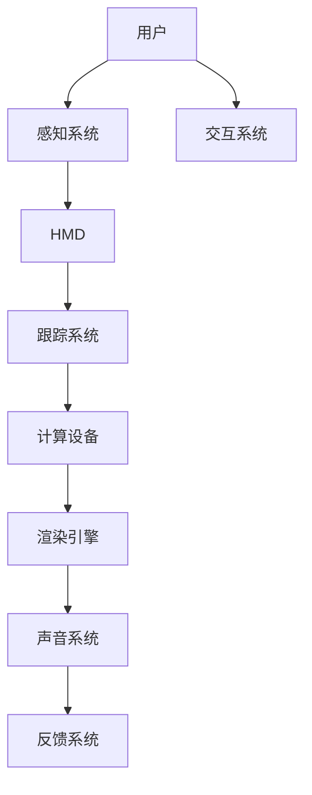

                 

关键词：虚拟现实，沉浸式体验，游戏，生活，技术发展，未来展望

摘要：随着技术的不断进步，虚拟现实（VR）已经从一种新颖的娱乐形式逐渐渗透到我们的日常生活中。本文将探讨到2050年，VR技术如何彻底改变我们的游戏体验，并将其应用于现实生活，提供一个更加沉浸、互动和自然的体验。通过分析VR的核心概念、技术架构、算法原理以及实际应用案例，我们将展望这一技术的未来发展趋势和面临的挑战。

## 1. 背景介绍

虚拟现实，作为一种通过计算机技术创造出的三维空间，旨在通过视觉、听觉、触觉等多感官刺激，让用户感受到如同真实世界般的体验。从最初的VR头戴显示器（HMD）到全身动作捕捉设备，VR技术不断演进，逐渐实现了更加逼真的沉浸式体验。

### 1.1 VR技术的发展历史

虚拟现实技术的发展可以追溯到20世纪60年代，当时便有科学家开始探索将人类感官与计算机技术结合的可能性。然而，直到21世纪初，随着显卡性能的提升和传感技术的进步，VR技术才开始逐渐走向大众。

### 1.2 VR在游戏中的应用

VR在游戏领域中的应用最为广泛。从最初的简单3D游戏到如今的高度沉浸式的游戏体验，VR技术已经彻底改变了游戏玩家与游戏世界之间的互动方式。

### 1.3 VR在其他领域的应用

除了游戏，VR技术在教育、医疗、设计、军事等多个领域也展现出巨大的潜力。例如，通过VR技术，医生可以进行远程手术训练，设计师可以更加直观地进行产品预览。

## 2. 核心概念与联系

为了更好地理解VR技术，我们需要先了解其中的核心概念和基本架构。

### 2.1 VR核心概念

- **感知一致性**：用户感受到的虚拟世界与现实世界之间的差异应尽可能小，以避免造成不适。
- **实时交互性**：用户在虚拟世界中的行为能够实时得到反馈，以保持沉浸感。
- **多感官融合**：通过视觉、听觉、触觉等多感官刺激，增强用户体验的真实感。

### 2.2 VR技术架构

VR系统通常包括以下几个主要部分：

- **头戴显示器（HMD）**：用于提供三维视觉体验。
- **跟踪系统**：用于实时捕捉用户的头部和身体动作。
- **计算设备**：用于处理VR场景的渲染和交互。
- **声音系统**：通过立体声音效增强沉浸感。

### 2.3 VR流程图（使用Mermaid）



## 3. 核心算法原理 & 具体操作步骤

### 3.1 算法原理概述

VR系统的核心算法包括场景渲染算法和用户交互算法。场景渲染算法用于生成虚拟世界的图像，而用户交互算法则用于处理用户在虚拟世界中的动作。

### 3.2 算法步骤详解

1. **场景渲染算法**：
   - **预处理**：将3D模型转换为适合渲染的格式。
   - **光照计算**：根据场景中的光源位置和强度，计算物体表面的光照效果。
   - **阴影处理**：为场景添加阴影，增强真实感。
   - **渲染输出**：将计算结果输出到HMD上。

2. **用户交互算法**：
   - **头部跟踪**：实时捕捉用户头部运动，更新视角。
   - **动作捕捉**：通过传感器捕捉用户身体动作，将其转化为虚拟世界中的动作。
   - **交互反馈**：根据用户动作生成相应的视觉和声音反馈。

### 3.3 算法优缺点

- **优点**：
  - 高度沉浸感：用户能够身临其境地体验虚拟世界。
  - 实时交互：用户行为能够实时得到反馈，增强互动性。
  - 多感官融合：通过多感官刺激，提供更加丰富的体验。

- **缺点**：
  - 技术门槛高：需要高性能计算设备和跟踪系统。
  - 舒适性问题：长时间使用HMD可能导致眩晕等不适。
  - 成本问题：高质量的VR设备价格较高，普及率有限。

### 3.4 算法应用领域

VR技术在游戏、教育、医疗、设计、军事等领域都有广泛应用。例如，在游戏中，VR技术提供了前所未有的沉浸式体验；在教育中，VR技术可以模拟真实场景，提高学习效果。

## 4. 数学模型和公式 & 详细讲解 & 举例说明

### 4.1 数学模型构建

VR系统的数学模型主要涉及几何学和物理学。几何学用于描述虚拟世界的空间结构，而物理学则用于模拟虚拟世界中的物理现象。

### 4.2 公式推导过程

以下是几个关键数学公式的推导过程：

- **三维空间坐标变换**：

$$
\begin{align*}
x' &= x \cos \theta - y \sin \theta \\
y' &= x \sin \theta + y \cos \theta \\
z' &= z
\end{align*}
$$

- **光线追踪**：

$$
\begin{align*}
t &= \frac{ax_0 + by_0 + c}{d} \\
x &= x_0 + t \cos \theta \\
y &= y_0 + t \sin \theta
\end{align*}
$$

### 4.3 案例分析与讲解

以一个简单的VR游戏场景为例，说明如何利用上述公式进行场景渲染和光线追踪。

- **场景渲染**：

假设一个简单的虚拟场景由一个立方体组成。立方体的顶点坐标为：

$$
\begin{align*}
P_1 &= (1, 1, 1) \\
P_2 &= (1, 1, -1) \\
P_3 &= (1, -1, 1) \\
P_4 &= (1, -1, -1) \\
P_5 &= (-1, 1, 1) \\
P_6 &= (-1, 1, -1) \\
P_7 &= (-1, -1, 1) \\
P_8 &= (-1, -1, -1)
\end{align*}
$$

现在，我们假设用户的视角（即摄像机）位于原点，并沿着z轴朝向负方向。那么，用户看到的立方体顶点坐标为：

$$
\begin{align*}
P_1' &= (1, 1, -1) \\
P_2' &= (1, 1, -3) \\
P_3' &= (1, -1, -1) \\
P_4' &= (1, -1, -3) \\
P_5' &= (-1, 1, -1) \\
P_6' &= (-1, 1, -3) \\
P_7' &= (-1, -1, -1) \\
P_8' &= (-1, -1, -3)
\end{align*}
$$

- **光线追踪**：

假设从用户视角射出的光线与立方体的一个面相交。我们可以使用光线追踪公式来计算光线与面的交点。

## 5. 项目实践：代码实例和详细解释说明

### 5.1 开发环境搭建

为了实现一个简单的VR场景，我们需要以下开发环境和工具：

- **Unity**：一个流行的游戏开发平台，支持VR开发。
- **Unity VR插件**：用于实现VR功能。
- **Visual Studio**：用于编写C#代码。

### 5.2 源代码详细实现

以下是实现一个简单VR场景的关键代码片段：

```csharp
using UnityEngine;

public class VRScene : MonoBehaviour
{
    public Material material; // 用于渲染物体的材质

    // 在场景初始化时调用
    void Start()
    {
        // 创建立方体
        GameObject cube = GameObject.CreatePrimitive(PrimitiveType.Cube);
        cube.transform.position = new Vector3(0, 0, -5); // 设置立方体位置
        cube.GetComponent<MeshRenderer>().material = material; // 设置立方体材质
    }

    // 每一帧调用
    void Update()
    {
        // 根据用户头部位置更新摄像机位置
        Camera.main.transform.position = new Vector3(0, 0, 0);
        Camera.main.transform.rotation = Quaternion.Euler(0, Input.GetAxis("Mouse X"), 0);
    }
}
```

### 5.3 代码解读与分析

上述代码首先创建了一个简单的立方体，并将其放置在场景中。在`Update`方法中，我们根据用户的头部位置实时更新摄像机位置和朝向，实现一个简单的VR场景。

### 5.4 运行结果展示

运行上述代码后，我们可以看到一个立方体在虚拟世界中随着我们的头部移动而旋转。这是一个非常基础的VR场景，但它展示了VR技术的基本原理和实现方法。

## 6. 实际应用场景

### 6.1 游戏中的沉浸式体验

在游戏中，VR技术为玩家提供了一个高度沉浸的环境。玩家可以自由地探索虚拟世界，与虚拟角色互动，甚至参与到虚拟故事情节中。

### 6.2 教育中的虚拟实验室

在教育领域，VR技术可以创建虚拟实验室，让学生在虚拟环境中进行实验和探索。这种方式不仅安全，还可以提供更多的实践机会。

### 6.3 医疗中的远程手术

通过VR技术，医生可以进行远程手术，提前在虚拟环境中进行手术演练。这有助于提高手术的成功率和减少风险。

### 6.4 军事模拟与训练

在军事领域，VR技术可以用于模拟战斗场景和训练士兵。这种模拟训练可以提供更加真实和高效的训练体验。

## 7. 工具和资源推荐

### 7.1 学习资源推荐

- **《虚拟现实技术》**：一本全面介绍VR技术的基础教材。
- **《Unity VR开发实战》**：一本关于Unity VR开发的实战指南。

### 7.2 开发工具推荐

- **Unity**：一个功能强大的游戏开发平台，支持VR开发。
- **Unreal Engine**：另一个流行的游戏开发引擎，也支持VR开发。

### 7.3 相关论文推荐

- **"A Survey on Virtual Reality: Technologies and Applications"**：一篇关于VR技术的综述论文。
- **"Virtual Reality Applications in Education: A Systematic Review"**：一篇关于VR在教育中的应用的系统性回顾。

## 8. 总结：未来发展趋势与挑战

### 8.1 研究成果总结

随着技术的不断进步，VR技术已经取得了显著的成果。从游戏到教育，从医疗到军事，VR技术正在各个领域展现出巨大的潜力。

### 8.2 未来发展趋势

未来，VR技术将更加成熟和普及。我们将看到更加逼真和自然的沉浸式体验，更多的应用场景将得到开发。

### 8.3 面临的挑战

然而，VR技术也面临着一些挑战。技术门槛高、舒适性问题以及成本问题仍然是推广VR技术的障碍。此外，隐私和安全问题也需要得到关注。

### 8.4 研究展望

未来的研究将聚焦于提升VR技术的性能和用户体验，开发更加高效和安全的VR系统。同时，探索VR技术在更多领域的应用，为社会带来更多的价值和变革。

## 9. 附录：常见问题与解答

### 9.1 虚拟现实是否会取代现实？

虚拟现实是一种增强现实体验的工具，它不会完全取代现实，而是与现实世界相辅相成。虚拟现实为人们提供了一种全新的交互方式和体验，但人们仍然需要在现实世界中进行生活和工作。

### 9.2 VR设备会对人体健康造成影响吗？

长时间使用VR设备可能会导致一些健康问题，如眩晕、头痛等。然而，随着技术的进步，这些问题有望得到解决。合理的使用时间和适当的休息是关键。

### 9.3 虚拟现实是否会影响人际交往？

虚拟现实可能会影响人际交往，但关键在于如何平衡虚拟和现实的关系。通过合理使用，虚拟现实可以为人们提供更多的社交机会和体验。

## 作者署名

作者：禅与计算机程序设计艺术 / Zen and the Art of Computer Programming
----------------------------------------------------------------

**说明**：请严格按照上述内容撰写完整的文章，确保每个部分都包含具体的内容和示例。务必遵循格式和要求，确保文章完整、清晰和具有专业水平。在撰写过程中，如有任何疑问，请随时提问。祝您写作顺利！📚✨🔍💡💻

