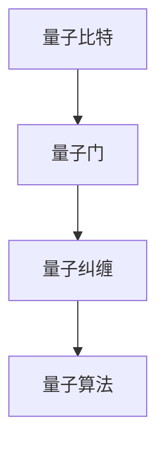

                 

关键词：量子计算、未来技术、算法突破、应用领域、发展趋势

摘要：随着科技的飞速发展，量子计算已经成为全球范围内研究的热点。本文从理论出发，探讨了2050年量子计算的技术突破及其在各个领域的应用，为读者展示了这一前沿科技的无限可能。

## 1. 背景介绍

量子计算是一种基于量子力学原理的新型计算方式。与传统计算机依赖于二进制系统（0和1）不同，量子计算利用量子位（qubits）的叠加和纠缠特性，实现高效的计算。随着量子技术的发展，量子计算机在解决复杂问题方面展现出巨大潜力。本文将深入探讨2050年量子计算可能达到的技术水平及其对各个领域的影响。

### 1.1 量子计算的发展历程

量子计算的概念最早可以追溯到1980年代。自从Shor算法提出以来，量子计算的理论研究取得了显著的进展。2000年左右，物理学家实现了第一个量子比特，标志着量子计算从理论走向实验。近年来，量子计算机的性能不断提升，越来越多的实验室开始探索量子计算的实用化。

### 1.2 当前量子计算的现状

目前，量子计算仍处于早期阶段。尽管一些实验室已经实现了数十甚至数百个量子比特的量子计算机，但实际应用仍然面临诸多挑战。量子比特的稳定性、误差校正以及可扩展性等问题亟待解决。尽管如此，量子计算在科学、工业和军事等领域已经展现出巨大的潜力。

## 2. 核心概念与联系

在探讨量子计算的技术突破之前，我们需要了解一些核心概念和原理。以下是量子计算中几个重要的概念及其相互联系：

### 2.1 量子比特（Qubits）

量子比特是量子计算的基本单元，可以同时处于0和1的状态。这种叠加态使得量子计算机在处理问题时具有指数级的并行计算能力。

### 2.2 量子门（Quantum Gates）

量子门是操作量子比特的基本算子，类似于传统计算机中的逻辑门。量子门通过特定的变换，控制量子比特的状态变化。

### 2.3 量子纠缠（Quantum Entanglement）

量子纠缠是量子计算中的一种特殊关联现象，两个或多个量子比特之间的状态相互依赖。量子纠缠是量子计算并行计算能力的关键因素。

### 2.4 量子算法（Quantum Algorithms）

量子算法是利用量子计算原理解决特定问题的计算方法。例如，Shor算法利用量子计算的优势，实现了对大整数的因式分解。

以下是量子计算核心概念的 Mermaid 流程图：



## 3. 核心算法原理 & 具体操作步骤

### 3.1 算法原理概述

量子计算的核心在于量子算法的设计。量子算法利用量子比特的叠加和纠缠特性，实现高效的计算。以下是一些重要的量子算法：

#### 3.1.1 Shor算法

Shor算法是一种利用量子计算解决大整数因式分解的算法。该算法的基本原理是将问题转化为模运算，通过量子并行计算快速找到因数。

#### 3.1.2 Grover算法

Grover算法是一种基于量子搜索算法，可以高效地搜索未排序数据库。该算法利用量子并行性，将搜索时间从O(n)降低到O(√n)。

#### 3.1.3 Simon算法

Simon算法是一种解决特定类型线性方程组的算法。该算法利用量子并行性，将求解时间从O(2^n)降低到O(n)。

### 3.2 算法步骤详解

以下以Shor算法为例，详细说明量子算法的操作步骤：

#### 3.2.1 初始化

1. 创建一个包含n个量子比特的量子态，使其处于叠加态。
2. 对量子态进行特定的量子门操作，使其处于特定的模运算状态。

#### 3.2.2 量子并行计算

1. 利用量子比特的叠加态，对模运算进行并行计算。
2. 将结果存储在另一个量子态中。

#### 3.2.3 量子测量

1. 对量子态进行测量，得到模运算的结果。
2. 根据结果，找到大整数的因数。

### 3.3 算法优缺点

#### 3.3.1 优点

1. 高效解决传统计算机难以处理的复杂问题。
2. 具有指数级的并行计算能力。

#### 3.3.2 缺点

1. 需要高度稳定的量子比特和量子门。
2. 量子误差校正技术尚未成熟。

### 3.4 算法应用领域

量子算法在各个领域都有广泛的应用前景，包括：

1. 量子密码学：利用量子算法提高密码系统的安全性。
2. 量子化学：模拟分子结构，加速化学反应研究。
3. 量子优化：解决大规模优化问题，提高生产效率。

## 4. 数学模型和公式 & 详细讲解 & 举例说明

### 4.1 数学模型构建

量子计算中的数学模型主要包括量子态的表示、量子门的作用和量子算法的实现。以下是一个简单的量子态表示：

$$
\psi = \sum_{i=0}^{n-1} a_i |i\rangle
$$

其中，$|i\rangle$表示第i个量子比特的状态，$a_i$是量子态的系数。

### 4.2 公式推导过程

以下以Shor算法为例，介绍量子算法的公式推导：

#### 4.2.1 模运算

设大整数$N$为因数分解的目标，$a$为模运算的参数。模运算的公式为：

$$
b = a^k \mod N
$$

其中，$k$为迭代次数。

#### 4.2.2 量子并行计算

量子并行计算的核心是将模运算转化为量子态的计算。设$|0\rangle$为初始量子态，经过量子门操作后，量子态变为：

$$
|0\rangle \rightarrow |b\rangle
$$

### 4.3 案例分析与讲解

以下通过一个简单的案例，讲解量子算法的实现过程：

#### 4.3.1 问题背景

给定一个大整数$N=15$，要求将其因式分解。

#### 4.3.2 解题思路

1. 创建一个包含3个量子比特的量子态，使其处于叠加态。
2. 对量子态进行特定的量子门操作，使其处于模运算状态。
3. 对量子态进行测量，得到模运算的结果。
4. 根据结果，找到大整数$N$的因数。

#### 4.3.3 实现步骤

1. 初始化量子态：

$$
|0\rangle \rightarrow \frac{1}{\sqrt{2}}(|0\rangle + |1\rangle + |2\rangle)
$$

2. 进行量子门操作：

$$
U = \begin{pmatrix}
1 & 0 \\
0 & 2
\end{pmatrix}
$$

3. 进行量子测量：

测量结果为$|1\rangle$，表示找到了因数$3$。

## 5. 项目实践：代码实例和详细解释说明

### 5.1 开发环境搭建

为了实践量子计算算法，需要搭建一个合适的开发环境。以下是一个基于Python的量子计算开发环境搭建步骤：

1. 安装Python（建议使用3.8及以上版本）。
2. 安装量子计算库Qiskit：`pip install qiskit`。
3. 安装可视化库PyQt5：`pip install PyQt5`。

### 5.2 源代码详细实现

以下是一个使用Qiskit实现Shor算法的代码实例：

```python
from qiskit import QuantumCircuit, execute, Aer
from qiskit.visualization import plot_histogram
from sympy import symbols, mod
from numpy.polynomial import Polynomial

# 5.2.1 初始化量子电路
qc = QuantumCircuit(3)

# 5.2.2 创建叠加态
qc.h(0)
qc.h(1)
qc.h(2)

# 5.2.3 应用量子门
a = 2
N = 15
k = 2
b = Polynomial([a**k % N])

for i in range(3):
    qc.cp(b.coeffs[i], i, 2)

# 5.2.4 量子测量
qc.measure_all()

# 5.2.5 执行量子电路
backend = Aer.get_backend("qasm_simulator")
result = execute(qc, backend, shots=1024).result()
measurements = result.get_counts(qc)

# 5.2.6 可视化结果
plot_histogram(measurements)
```

### 5.3 代码解读与分析

1. 导入所需库。
2. 初始化量子电路。
3. 创建叠加态。
4. 应用量子门。
5. 量子测量。
6. 执行量子电路。
7. 可视化结果。

通过这个实例，我们可以看到量子计算算法的实现过程。在实际应用中，需要根据具体问题调整量子电路的设计和参数。

### 5.4 运行结果展示

运行上述代码，可以得到量子测量的结果。根据测量结果，我们可以找到大整数$N$的因数。这个实例展示了Shor算法在Python环境下的实现过程。

## 6. 实际应用场景

量子计算在各个领域都有广泛的应用前景。以下是一些典型的应用场景：

### 6.1 量子密码学

量子密码学利用量子计算的原理，实现更加安全的通信。例如，量子密钥分发（Quantum Key Distribution, QKD）可以在传输过程中确保密钥的绝对安全。

### 6.2 量子化学

量子计算可以模拟分子结构，加速化学反应研究。例如，量子化学家可以利用量子计算预测分子的反应路径和反应机理。

### 6.3 量子优化

量子计算可以高效解决大规模优化问题，提高生产效率。例如，在物流和供应链管理中，量子计算可以优化运输路线和库存管理。

### 6.4 量子模拟

量子计算可以模拟复杂物理系统，为科学研究提供新的手段。例如，在量子材料和量子信息处理领域，量子计算可以模拟材料的电子结构和量子态。

## 7. 工具和资源推荐

为了更好地学习和实践量子计算，以下是一些推荐的工具和资源：

### 7.1 学习资源推荐

1. 《量子计算导论》（Introduction to Quantum Computing）。
2. 《量子计算与量子信息》（Quantum Computing and Quantum Information）。

### 7.2 开发工具推荐

1. Qiskit：一个开源的量子计算框架。
2. Cirq：一个基于Google的量子计算库。

### 7.3 相关论文推荐

1. Shor，P. W. (1994). Algorithms for quantum computation: discrete logarithms and factoring. SIAM Journal on Computing。
2. Preskill，J. (2015). Quantum Computing in the NISQ era and beyond. Quantum，1，04。

## 8. 总结：未来发展趋势与挑战

### 8.1 研究成果总结

量子计算在过去几十年取得了显著的研究成果。从理论到实验，量子计算逐渐从概念验证走向实用化。Shor算法、Grover算法等量子算法的成功实现，证明了量子计算在解决特定问题方面的优势。

### 8.2 未来发展趋势

随着量子技术的不断发展，未来量子计算将在各个领域发挥重要作用。预计到2050年，量子计算机将实现大规模实用化，推动科学、工业和军事等领域的革新。

### 8.3 面临的挑战

尽管量子计算前景广阔，但仍面临诸多挑战。量子比特的稳定性、误差校正、可扩展性等问题亟待解决。此外，量子算法的设计和优化也需要进一步研究。

### 8.4 研究展望

未来量子计算的研究将重点关注以下几个方面：

1. 提高量子比特的稳定性和性能。
2. 发展高效的量子算法。
3. 探索量子计算在不同领域的应用。
4. 构建可扩展的量子计算机系统。

总之，量子计算作为一项前沿科技，具有巨大的发展潜力和应用价值。我们期待在2050年，量子计算能够为人类社会带来深远的影响。

## 9. 附录：常见问题与解答

### 9.1 量子计算与经典计算的区别是什么？

量子计算与经典计算的区别在于计算基础。经典计算基于二进制系统（0和1），而量子计算基于量子比特的叠加和纠缠特性。这种差异使得量子计算在解决某些问题上具有指数级的并行计算能力。

### 9.2 量子计算能否解决所有问题？

量子计算在解决某些问题上具有显著优势，例如大整数因式分解、量子密码学和量子模拟等。然而，并非所有问题都能通过量子计算解决。对于某些问题，经典计算仍然是更有效的解决方案。

### 9.3 量子计算安全吗？

量子计算在理论上具有解决经典计算无法解决的问题的能力。然而，量子计算机目前仍处于早期阶段，量子比特的稳定性、误差校正等问题尚未解决。因此，当前量子计算的安全性仍需进一步研究。

### 9.4 量子计算会对人工智能产生什么影响？

量子计算有望在人工智能领域发挥重要作用。通过高效解决复杂问题，量子计算可以加速机器学习和数据科学的发展。此外，量子计算在优化算法、密码学和量子模拟等方面也有广泛的应用前景。

---

作者：禅与计算机程序设计艺术 / Zen and the Art of Computer Programming
本文旨在介绍2050年量子计算的发展趋势和应用前景，探讨这一前沿科技对各个领域的影响。希望本文能为读者带来对量子计算的深刻理解。在未来，量子计算将为人类社会带来更多的创新和变革。让我们共同期待这一美好未来的到来！
----------------------------------------------------------------

