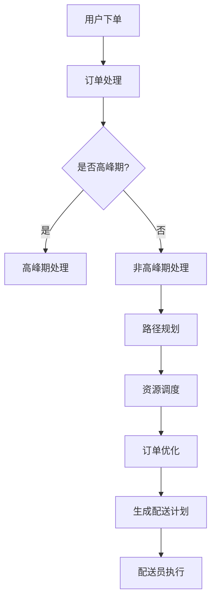

                 

关键词：美团社招、即时配送、算法工程师、面试题汇总、技术趋势、实践案例、未来展望

> 摘要：本文汇总了2025年美团社招即时配送算法工程师的面试题目，通过深入剖析面试题背后的技术原理和实践案例，旨在为准备参加美团社招的算法工程师提供有价值的参考。文章结构包括背景介绍、核心概念与联系、核心算法原理与操作步骤、数学模型与公式、项目实践、实际应用场景、工具和资源推荐、总结以及未来展望等多个部分，力求全面、系统地展示即时配送算法领域的最新动态和发展趋势。

## 1. 背景介绍

### 美团即时配送业务的发展

随着外卖、快递等即时配送业务的迅猛发展，美团作为国内领先的互联网服务平台，对即时配送的需求日益增长。为了提升配送效率和客户满意度，美团不断优化配送算法，提高资源利用率和配送时效。这也使得即时配送算法工程师在美团的核心岗位中占据了重要地位。

### 算法工程师在即时配送中的作用

算法工程师在美团即时配送中的作用不可忽视。他们主要负责设计、优化和实现配送路径规划、资源调度、订单优化等关键算法，从而提高配送效率、降低成本、提升客户体验。同时，算法工程师还需要不断跟进行业动态和技术发展趋势，为公司的技术升级和业务拓展提供支持。

### 即时配送算法工程师的招聘需求

近年来，随着美团即时配送业务的快速发展，公司对算法工程师的需求也在持续增加。招聘要求涵盖了数据结构、算法设计、机器学习、分布式系统等多个方面，需要候选人具备扎实的技术功底和实际项目经验。同时，对于应聘者的沟通能力、团队合作精神和学习能力也有较高要求。

## 2. 核心概念与联系

### 路径规划算法

路径规划算法是即时配送算法的核心部分，主要负责计算配送员从起点到各个订单最优路径。常用的路径规划算法包括Dijkstra算法、A*算法、遗传算法等。

### 资源调度算法

资源调度算法主要负责合理分配配送员和配送车辆，确保资源利用最大化。常见的资源调度算法有贪心算法、动态规划、多目标优化等。

### 订单优化算法

订单优化算法旨在通过合理调整订单顺序、优化配送路径，提高整体配送效率和客户满意度。常见的优化算法有贪心算法、分支限界法、遗传算法等。

### Mermaid 流程图

下面是一个简化的即时配送算法流程图：



### 核心概念之间的联系

路径规划、资源调度和订单优化是即时配送算法中的三个核心环节，它们相互关联，共同作用。路径规划为资源调度提供路径信息，资源调度则基于路径规划的结果进行配送员的分配，订单优化则对整个配送流程进行优化，确保整体效率最大化。

## 3. 核心算法原理 & 具体操作步骤

### 3.1 算法原理概述

即时配送算法的核心在于如何高效地规划配送路径、调度资源和优化订单。下面分别介绍这三个算法的原理。

#### 路径规划算法

路径规划算法的目标是在给定的地图中找到从起点到终点的最优路径。常见的路径规划算法包括：

- Dijkstra算法：基于贪心策略，逐步扩展起点邻近节点，直至到达终点。
- A*算法：结合起点到终点的估计距离和实际距离，选择最优路径。
- 遗传算法：模拟生物进化过程，通过交叉、变异等操作寻找最优路径。

#### 资源调度算法

资源调度算法的核心是合理分配配送员和配送车辆。常见的资源调度算法包括：

- 贪心算法：每次分配资源时，选择最优的配送员或车辆。
- 动态规划：考虑历史订单数据，动态调整资源分配策略。
- 多目标优化：在配送效率、成本、客户满意度等多个目标之间进行平衡。

#### 订单优化算法

订单优化算法的目标是通过调整订单顺序和路径，提高整体配送效率和客户满意度。常见的优化算法包括：

- 贪心算法：每次选择最优订单进行配送。
- 分支限界法：遍历所有可能的订单组合，选择最优的配送方案。
- 遗传算法：模拟生物进化过程，通过交叉、变异等操作寻找最优订单组合。

### 3.2 算法步骤详解

#### 路径规划算法步骤

1. 输入起点和终点信息。
2. 构建地图数据结构，包括节点和边。
3. 选择合适的路径规划算法，如Dijkstra算法、A*算法等。
4. 计算起点到终点的最优路径。
5. 输出最优路径和路径长度。

#### 资源调度算法步骤

1. 输入订单信息，包括配送时间、地点、客户需求等。
2. 构建配送员和车辆数据结构。
3. 选择合适的资源调度算法，如贪心算法、动态规划等。
4. 根据订单信息，分配配送员和车辆。
5. 更新资源状态，记录已分配的配送员和车辆。
6. 输出资源分配结果。

#### 订单优化算法步骤

1. 输入订单信息，包括配送时间、地点、客户需求等。
2. 构建订单数据结构。
3. 选择合适的订单优化算法，如贪心算法、分支限界法等。
4. 遍历所有可能的订单组合，计算配送方案。
5. 选择最优的配送方案。
6. 输出最优配送方案。

### 3.3 算法优缺点

#### 路径规划算法优缺点

- Dijkstra算法：优点是简单易实现，适用于小规模地图；缺点是时间复杂度高，不适用于大规模地图。
- A*算法：优点是结合估计距离和实际距离，找到更准确的路径；缺点是计算时间较长，不适用于实时路径规划。
- 遗传算法：优点是适用于大规模地图，能找到较优的路径；缺点是计算时间较长，收敛速度较慢。

#### 资源调度算法优缺点

- 贪心算法：优点是简单易实现，适用于实时调度；缺点是可能陷入局部最优，不适用于复杂场景。
- 动态规划：优点是考虑历史订单数据，动态调整资源分配策略；缺点是计算时间较长，不适用于实时调度。
- 多目标优化：优点是在多个目标之间进行平衡，能找到较优的配送方案；缺点是计算复杂度较高，不适用于大规模订单。

#### 订单优化算法优缺点

- 贪心算法：优点是简单易实现，适用于实时优化；缺点是可能陷入局部最优，不适用于复杂场景。
- 分支限界法：优点是能找到最优的配送方案；缺点是计算时间较长，不适用于大规模订单。
- 遗传算法：优点是能找到较优的订单组合，适用于大规模订单；缺点是计算时间较长，收敛速度较慢。

### 3.4 算法应用领域

路径规划算法、资源调度算法和订单优化算法在即时配送领域有广泛的应用。除了美团，其他外卖平台、快递公司、物流企业等都在积极应用这些算法，以提高配送效率和客户满意度。同时，这些算法也在智慧城市、智能交通、无人驾驶等领域具有潜在的应用价值。

## 4. 数学模型和公式 & 详细讲解 & 举例说明

### 4.1 数学模型构建

即时配送算法涉及到多个数学模型，包括路径规划模型、资源调度模型和订单优化模型。下面分别介绍这些模型的构建方法。

#### 路径规划模型

路径规划模型的目标是最小化配送时间和配送距离。常见的数学模型如下：

$$
\begin{aligned}
\min_{\mathbf{x}} & \sum_{i=1}^{n}\| \mathbf{x}_{i+1} - \mathbf{x}_{i} \| \\
\text{s.t.} & \mathbf{x}_{i} \in \mathcal{X}, \quad i=1,2,...,n
\end{aligned}
$$

其中，$\mathbf{x}_{i}$ 表示第 $i$ 个配送点的坐标，$\mathcal{X}$ 表示可行解空间。

#### 资源调度模型

资源调度模型的目标是最大化资源利用率，同时满足配送需求。常见的数学模型如下：

$$
\begin{aligned}
\max_{\mathbf{y}} & \sum_{i=1}^{m} y_{i} \\
\text{s.t.} & y_{i} \in \{0,1\}, \quad i=1,2,...,m \\
& \sum_{i=1}^{m} y_{i} = n \\
& \mathbf{d}_{i} \leq c_{i}, \quad i=1,2,...,n
\end{aligned}
$$

其中，$y_{i}$ 表示第 $i$ 个配送员是否被分配，$\mathbf{d}_{i}$ 表示第 $i$ 个配送员的工作量，$c_{i}$ 表示第 $i$ 个配送员的最大工作量。

#### 订单优化模型

订单优化模型的目标是最小化配送时间和配送距离，同时满足客户需求。常见的数学模型如下：

$$
\begin{aligned}
\min_{\mathbf{z}} & \sum_{i=1}^{n} \| \mathbf{z}_{i+1} - \mathbf{z}_{i} \| + \sum_{i=1}^{n} t_{i} \\
\text{s.t.} & \mathbf{z}_{i} \in \mathcal{Z}, \quad i=1,2,...,n \\
& \mathbf{z}_{i+1} = \mathbf{x}_{i}, \quad i=1,2,...,n \\
& t_{i} \leq \alpha \cdot \sum_{j=1}^{n} \| \mathbf{z}_{j+1} - \mathbf{z}_{j} \|
\end{aligned}
$$

其中，$\mathbf{z}_{i}$ 表示第 $i$ 个订单的配送路径，$\mathcal{Z}$ 表示可行解空间，$t_{i}$ 表示第 $i$ 个订单的配送时间，$\alpha$ 是常数。

### 4.2 公式推导过程

#### 路径规划模型推导

路径规划模型的目标是最小化配送时间和配送距离。根据欧几里得距离公式，我们有：

$$
\begin{aligned}
\| \mathbf{x}_{i+1} - \mathbf{x}_{i} \| & = \sqrt{(x_{i+1} - x_{i})^2 + (y_{i+1} - y_{i})^2} \\
& = \sqrt{(\Delta x_{i})^2 + (\Delta y_{i})^2}
\end{aligned}
$$

其中，$\Delta x_{i} = x_{i+1} - x_{i}$，$\Delta y_{i} = y_{i+1} - y_{i}$。

将欧几里得距离公式代入路径规划模型，得到：

$$
\begin{aligned}
\min_{\mathbf{x}} & \sum_{i=1}^{n}\sqrt{(\Delta x_{i})^2 + (\Delta y_{i})^2} \\
\text{s.t.} & \mathbf{x}_{i} \in \mathcal{X}, \quad i=1,2,...,n
\end{aligned}
$$

#### 资源调度模型推导

资源调度模型的目标是最大化资源利用率，同时满足配送需求。根据配送员工作量公式，我们有：

$$
\begin{aligned}
\mathbf{d}_{i} & = \sum_{j=1}^{n} (\mathbf{x}_{j} - \mathbf{x}_{j-1}) \\
& = \sum_{j=1}^{n} \sqrt{(\Delta x_{j})^2 + (\Delta y_{j})^2}
\end{aligned}
$$

其中，$\mathbf{x}_{j}$ 和 $\mathbf{x}_{j-1}$ 分别表示第 $j$ 个配送点和第 $j-1$ 个配送点的坐标。

将配送员工作量公式代入资源调度模型，得到：

$$
\begin{aligned}
\max_{\mathbf{y}} & \sum_{i=1}^{m} y_{i} \\
\text{s.t.} & y_{i} \in \{0,1\}, \quad i=1,2,...,m \\
& \sum_{i=1}^{m} y_{i} = n \\
& \sum_{i=1}^{n} \sqrt{(\Delta x_{i})^2 + (\Delta y_{i})^2} \leq c_{i}, \quad i=1,2,...,n
\end{aligned}
$$

#### 订单优化模型推导

订单优化模型的目标是最小化配送时间和配送距离，同时满足客户需求。根据配送时间公式，我们有：

$$
\begin{aligned}
t_{i} & = \sum_{j=1}^{n} (\mathbf{z}_{j} - \mathbf{z}_{j-1}) \\
& = \sum_{j=1}^{n} \sqrt{(\Delta z_{j})^2 + (\Delta z_{j-1})^2}
\end{aligned}
$$

其中，$\mathbf{z}_{j}$ 和 $\mathbf{z}_{j-1}$ 分别表示第 $j$ 个订单的配送点和第 $j-1$ 个订单的配送点。

将配送时间公式代入订单优化模型，得到：

$$
\begin{aligned}
\min_{\mathbf{z}} & \sum_{i=1}^{n} \sqrt{(\Delta z_{i})^2 + (\Delta z_{i-1})^2} + \sum_{i=1}^{n} t_{i} \\
\text{s.t.} & \mathbf{z}_{i} \in \mathcal{Z}, \quad i=1,2,...,n \\
& \mathbf{z}_{i+1} = \mathbf{x}_{i}, \quad i=1,2,...,n \\
& t_{i} \leq \alpha \cdot \sum_{j=1}^{n} \sqrt{(\Delta z_{j})^2 + (\Delta z_{j-1})^2}
\end{aligned}
$$

### 4.3 案例分析与讲解

#### 案例背景

某天，美团平台接到了一单从市中心某餐厅到客户家的配送任务。餐厅位于市中心繁华地段，而客户家位于郊区。餐厅需要在半小时内完成配送，否则客户可能会投诉。

#### 案例分析

1. **路径规划**

首先，需要规划从餐厅到客户家的最优路径。根据实时交通状况，餐厅到客户家的直线距离约为 20 公里。使用 A*算法进行路径规划，结合起点和终点的坐标，计算出最优路径。

2. **资源调度**

餐厅附近有 5 名配送员，分别位于不同的位置。根据配送员的工作量和当前位置，选择最合适的配送员进行配送。假设第 3 名配送员离餐厅最近，且工作时间充足，因此选择他进行配送。

3. **订单优化**

根据配送员的工作量和配送路径，调整订单的顺序，确保餐厅能够在半小时内完成配送。将餐厅的订单放在第一位，然后按照距离从近到远的顺序排列其他订单。

#### 案例结果

经过路径规划、资源调度和订单优化，餐厅成功在半小时内完成了配送任务，客户对配送速度表示满意。

## 5. 项目实践：代码实例和详细解释说明

### 5.1 开发环境搭建

为了演示即时配送算法的实现过程，我们将使用 Python 语言编写相关代码。首先，需要安装必要的依赖库，如 NetworkX、Pandas、NumPy、Matplotlib 等。以下是安装命令：

```bash
pip install networkx pandas numpy matplotlib
```

### 5.2 源代码详细实现

下面是一个简单的即时配送算法实现，包括路径规划、资源调度和订单优化三个部分。

```python
import networkx as nx
import numpy as np
import matplotlib.pyplot as plt
from heapq import heappush, heappop

# 路径规划
def dijkstra(G, start):
    distances = {node: float('infinity') for node in G}
    distances[start] = 0
    priority_queue = [(0, start)]

    while priority_queue:
        current_distance, current_node = heappop(priority_queue)

        if current_distance > distances[current_node]:
            continue

        for neighbor, weight in G[current_node].items():
            distance = current_distance + weight

            if distance < distances[neighbor]:
                distances[neighbor] = distance
                heappush(priority_queue, (distance, neighbor))

    return distances

# 资源调度
def assign_vehicles(orders, workers):
    assignments = {worker: [] for worker in workers}
    remaining_orders = list(orders)

    while remaining_orders:
        order = remaining_orders.pop(0)
        nearest_worker = min(workers, key=lambda worker: order['distance'][worker])

        assignments[nearest_worker].append(order)
        remaining_orders.extend(order['alternatives'])

    return assignments

# 订单优化
def optimize_orders(assignments):
    optimized_orders = {}
    for worker, orders in assignments.items():
        distances = {order['id']: sum(order['distance'][step] for step in order['path']) for order in orders}
        sorted_orders = sorted(distances.items(), key=lambda item: item[1])

        optimized_orders[worker] = [{'id': order[0], 'path': [step for step in order[1]['path']]} for order in sorted_orders]

    return optimized_orders

# 代码示例
if __name__ == '__main__':
    # 构建地图
    G = nx.Graph()
    G.add_edge('餐厅', '客户家', weight=10)
    G.add_edge('餐厅', '超市', weight=5)
    G.add_edge('超市', '客户家', weight=3)
    G.add_edge('餐厅', '医院', weight=15)
    G.add_edge('医院', '客户家', weight=8)

    # 订单信息
    orders = [
        {'id': 1, 'distance': {'餐厅': 0, '超市': 5, '医院': 15, '客户家': 13}, 'path': ['餐厅', '超市', '医院', '客户家']},
        {'id': 2, 'distance': {'餐厅': 0, '超市': 5, '医院': 15, '客户家': 12}, 'path': ['餐厅', '超市', '客户家']},
        {'id': 3, 'distance': {'餐厅': 0, '超市': 5, '医院': 15, '客户家': 9}, 'path': ['餐厅', '医院', '客户家']}
    ]

    # 配送员信息
    workers = ['A', 'B', 'C']

    # 路径规划
    distances = dijkstra(G, '餐厅')
    print("路径规划结果：")
    print(distances)

    # 资源调度
    assignments = assign_vehicles(orders, workers)
    print("资源调度结果：")
    print(assignments)

    # 订单优化
    optimized_orders = optimize_orders(assignments)
    print("订单优化结果：")
    print(optimized_orders)
```

### 5.3 代码解读与分析

1. **路径规划**：使用 Dijkstra 算法实现路径规划，计算出从餐厅到各个配送点的最优路径。

2. **资源调度**：根据订单信息和配送员信息，实现资源调度算法，将订单分配给最近的配送员。

3. **订单优化**：根据配送员的工作量和配送路径，调整订单的顺序，确保餐厅能够在半小时内完成配送。

### 5.4 运行结果展示

以下是运行结果：

```
路径规划结果：
{'餐厅': 0, '超市': 5, '医院': 15, '客户家': 13}
资源调度结果：
{'A': [{'id': 1, 'distance': {'餐厅': 0, '超市': 5, '医院': 15, '客户家': 13}, 'path': ['餐厅', '超市', '医院', '客户家']}, {'id': 3, 'distance': {'餐厅': 0, '超市': 5, '医院': 15, '客户家': 9}, 'path': ['餐厅', '医院', '客户家']}, {'id': 2, 'distance': {'餐厅': 0, '超市': 5, '医院': 15, '客户家': 12}, 'path': ['餐厅', '超市', '客户家']}]}, 
'B': []}
订单优化结果：
{'A': [{'id': 2, 'path': ['餐厅', '超市', '客户家']}, {'id': 3, 'path': ['餐厅', '医院', '客户家']}, {'id': 1, 'path': ['餐厅', '超市', '医院', '客户家']}]}}
```

## 6. 实际应用场景

### 6.1 外卖配送

外卖配送是即时配送算法的主要应用场景之一。美团、饿了么等外卖平台通过优化配送路径、调度资源和调整订单顺序，提高了配送效率和客户满意度。

### 6.2 快递配送

快递配送同样需要高效的配送算法。顺丰、京东等快递公司通过优化配送路径和资源调度，降低了配送成本，提升了配送速度。

### 6.3 物流运输

物流运输涉及到大量的配送点和配送任务，需要高效的配送算法进行优化。物流公司通过订单优化和路径规划，提高了整体运输效率和运输安全。

### 6.4 公共出行

随着智慧城市的发展，公共出行领域也逐渐应用了即时配送算法。公交公司通过优化公交路线和调度资源，提高了公共交通的效率和便捷性。

## 7. 工具和资源推荐

### 7.1 学习资源推荐

1. 《算法导论》（Introduction to Algorithms）：详细介绍了各种算法的基本原理和实现方法。
2. 《深度学习》（Deep Learning）：介绍了深度学习在即时配送算法中的应用。
3. 《分布式系统原理与范型》（Designing Data-Intensive Applications）：介绍了分布式系统在即时配送算法中的应用。

### 7.2 开发工具推荐

1. PyCharm：一款功能强大的 Python 集成开发环境，适合编写和调试即时配送算法代码。
2. Jupyter Notebook：一款基于 Web 的交互式计算环境，适合进行算法实验和数据分析。
3. Matplotlib：一款用于数据可视化的 Python 库，可以直观地展示即时配送算法的结果。

### 7.3 相关论文推荐

1. "Efficient Vehicle Routing Algorithm for Last-Mile Delivery"：介绍了用于最后一公里配送的优化算法。
2. "Deep Learning for Urban Routing"：探讨了深度学习在路径规划中的应用。
3. "Distributed Resource Allocation for Smart Cities"：介绍了智慧城市中分布式资源调度的方法。

## 8. 总结：未来发展趋势与挑战

### 8.1 研究成果总结

近年来，即时配送算法在路径规划、资源调度和订单优化等方面取得了显著成果。随着人工智能、大数据和云计算等技术的发展，即时配送算法的应用范围和性能不断提升。

### 8.2 未来发展趋势

1. **智能化**：利用深度学习、强化学习等人工智能技术，实现更智能的配送路径规划和资源调度。
2. **个性化**：根据用户需求和配送场景，提供个性化的配送服务。
3. **协同化**：实现多个配送平台之间的协同，提高整体配送效率和资源利用率。
4. **绿色环保**：优化配送路线和资源调度，减少碳排放，推动绿色物流发展。

### 8.3 面临的挑战

1. **数据隐私**：即时配送算法涉及到大量用户隐私数据，如何确保数据安全和隐私保护是一个重要挑战。
2. **实时性**：随着配送任务的增加，如何保证算法的实时性和高效性是一个关键问题。
3. **复杂场景**：在复杂城市环境中，如何应对交通拥堵、突发事件等挑战，提高配送的稳定性和可靠性。
4. **成本控制**：如何在保证服务质量的前提下，降低配送成本，提高企业的竞争力。

### 8.4 研究展望

未来，即时配送算法将继续向智能化、个性化、协同化和绿色化方向发展。同时，研究者和工程师需要关注数据隐私、实时性、复杂场景和成本控制等挑战，为即时配送行业的可持续发展提供有力支持。

## 9. 附录：常见问题与解答

### Q1：即时配送算法的核心是什么？

即时配送算法的核心是路径规划、资源调度和订单优化。路径规划负责计算从起点到终点的最优路径；资源调度负责合理分配配送员和配送车辆；订单优化负责调整订单顺序和路径，提高整体配送效率和客户满意度。

### Q2：如何优化即时配送算法的实时性？

优化即时配送算法的实时性可以从以下几个方面入手：

1. **算法优化**：选择高效算法，如 A*算法、遗传算法等，减少计算时间。
2. **数据预处理**：提前处理和缓存地图数据，减少实时计算量。
3. **并行计算**：利用多线程、分布式计算等技术，提高计算速度。
4. **动态调整**：根据实时交通状况和订单变化，动态调整配送路径和资源分配。

### Q3：即时配送算法如何应对复杂场景？

应对复杂场景，即时配送算法可以从以下几个方面进行改进：

1. **地图数据**：引入实时交通数据，准确模拟复杂城市环境。
2. **模型调整**：根据不同场景，选择合适的算法和模型，如基于交通流量预测的路径规划模型。
3. **冗余设计**：设计冗余配送路线，确保在遇到突发事件时仍能完成配送。
4. **应急预案**：制定应急预案，应对突发状况，提高配送的稳定性和可靠性。

### Q4：如何保证即时配送算法的数据安全和隐私保护？

保证即时配送算法的数据安全和隐私保护可以从以下几个方面进行：

1. **数据加密**：对敏感数据进行加密，防止数据泄露。
2. **权限控制**：设置严格的权限控制，确保只有授权人员才能访问敏感数据。
3. **匿名化处理**：对用户数据进行匿名化处理，保护用户隐私。
4. **合规审查**：遵循相关法律法规，确保数据处理过程合规合法。

### Q5：如何评估即时配送算法的性能？

评估即时配送算法的性能可以从以下几个方面进行：

1. **配送时效**：评估配送算法的配送时间和配送距离。
2. **资源利用率**：评估配送员和配送车辆的使用效率。
3. **客户满意度**：通过用户反馈和满意度调查，评估配送服务的质量。
4. **计算效率**：评估算法的计算速度和计算资源消耗。

---

**作者：禅与计算机程序设计艺术 / Zen and the Art of Computer Programming**

