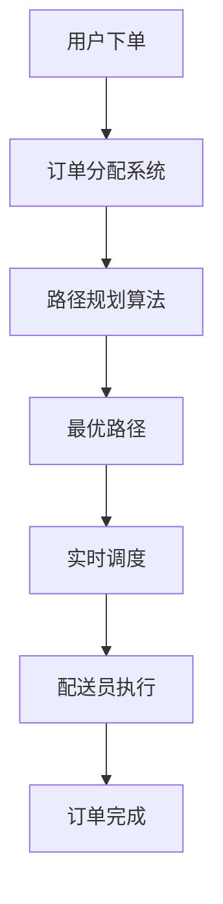

                 

美团作为中国领先的电子商务和生活服务提供商，其即时配送网络优化对于提升用户体验和运营效率至关重要。本文旨在通过对2025年美团社招即时配送网络优化专家面试题的详细解析，帮助读者理解即时配送网络优化中涉及的核心算法原理、数学模型、项目实践以及实际应用场景，为从事相关领域的工作者和研究者提供有价值的参考。

> **关键词：** 美团、即时配送、网络优化、算法原理、数学模型、项目实践

> **摘要：** 本文首先介绍了即时配送网络优化的背景和重要性，接着详细解析了面试题中的核心概念和算法原理，探讨了数学模型及其推导过程，并提供了代码实例和详细解释。最后，本文讨论了即时配送网络优化的实际应用场景、未来展望以及面临的挑战。

## 1. 背景介绍

即时配送作为美团的重要组成部分，其效率和质量直接影响到用户对服务的满意度和美团的竞争力。随着用户订单量的不断增长，如何优化配送网络、提高配送效率成为美团的战略性课题。美团社招即时配送网络优化专家面试题的设定旨在考察应聘者对即时配送网络优化相关知识的掌握程度，包括算法原理、数学模型和项目实践经验。

### 1.1 美团即时配送业务概述

- **订单处理流程**：用户下单后，美团系统会根据订单的特点（如距离、时间、配送要求等）进行智能匹配，将订单分配给最近的配送员。
- **配送员工作流程**：配送员接单后，根据系统提供的最优路线进行配送，并及时更新订单状态。

### 1.2 网络优化的重要性

- **提升配送效率**：通过优化配送路线，可以减少配送时间，提高配送效率。
- **降低运营成本**：优化配送网络能够减少配送员的行驶距离和空跑率，从而降低运营成本。
- **提升用户体验**：快速、准确的配送服务能够提升用户满意度，增强用户粘性。

## 2. 核心概念与联系

### 2.1 核心概念

- **路径规划算法**：用于确定从起点到终点的最优路径。
- **负载均衡**：确保配送员工作量分布均匀，避免部分配送员过于繁忙，部分配送员空闲。
- **实时调度**：根据实时交通状况、配送员位置和订单状态进行动态调整。

### 2.2 网络优化架构图



## 3. 核心算法原理 & 具体操作步骤

### 3.1 算法原理概述

- **Dijkstra算法**：用于计算单源最短路径。
- **A*算法**：结合了Dijkstra算法和启发式搜索，用于更快速的找到最优路径。

### 3.2 算法步骤详解

#### 3.2.1 Dijkstra算法

1. 初始化：设置起点到所有节点的距离为无穷大，起点距离为0。
2. 选择未访问节点中距离最小的作为当前节点。
3. 更新当前节点到其他节点的距离。
4. 标记当前节点为已访问。
5. 重复步骤2-4，直到所有节点都被访问。

#### 3.2.2 A*算法

1. 将起点和终点加入开放列表。
2. 选择F值最小的节点作为当前节点。
3. 将当前节点从开放列表移动到关闭列表。
4. 将当前节点的邻居加入开放列表，并计算其F值。
5. 重复步骤2-4，直到找到终点或开放列表为空。

### 3.3 算法优缺点

- **Dijkstra算法**：
  - 优点：简单易实现，能够保证找到最短路径。
  - 缺点：时间复杂度高，不适用于节点数量庞大的网络。

- **A*算法**：
  - 优点：结合了启发式搜索，能够快速找到最优路径。
  - 缺点：在某些情况下，可能会找到次优路径。

### 3.4 算法应用领域

- **即时配送**：用于计算配送员的最优配送路径。
- **物流规划**：用于优化物流配送路线，降低成本。

## 4. 数学模型和公式 & 详细讲解 & 举例说明

### 4.1 数学模型构建

假设配送网络由n个节点组成，每个节点表示一个配送点，每两个节点之间有一条路径，路径的权重表示配送时间或距离。

### 4.2 公式推导过程

- **Dijkstra算法**：

  设G=(V,E)为加权图，s∈V为起点，dist[]为节点到起点的最短距离。

  $$ 
  dist[s] = 0 \\
  dist[v] = \infty \text{ for all } v \neq s \\
  $$

  **步骤**：

  1. 选择未访问节点中距离s最小的作为当前节点u。
  2. 对于当前节点u的每个邻居v，计算dist[v] = dist[u] + weight(u, v)，其中weight(u, v)为u到v的路径权重。
  3. 更新dist[]，如果新计算的距离小于当前距离。
  4. 标记u为已访问。
  5. 重复步骤1-4，直到所有节点都被访问。

- **A*算法**：

  设G=(V,E)为加权图，s∈V为起点，g(v)为从起点到v的最短路径估计，h(v)为从v到终点的启发式估计。

  $$ 
  g[s] = 0 \\
  g[v] = \infty \text{ for all } v \neq s \\
  f[s] = g[s] + h[s] \\
  f[v] = \infty \text{ for all } v \neq s \\
  $$

  **步骤**：

  1. 将起点s加入开放列表。
  2. 选择F值最小的节点u作为当前节点。
  3. 将当前节点u从开放列表移动到关闭列表。
  4. 对于当前节点u的每个邻居v，计算g[v] = g[u] + weight(u, v)，f[v] = g[v] + h[v]。
  5. 将新加入的节点v加入开放列表，如果其F值小于当前F值。
  6. 重复步骤2-5，直到找到终点或开放列表为空。

### 4.3 案例分析与讲解

#### 案例背景

假设有一个包含5个节点的配送网络，节点表示配送点，权重表示配送时间。目标是从起点A到终点E的最优路径。

#### 案例数据

| 节点 | 路径 | 权重 |
| ---- | ---- | ---- |
| A -> B | 3分钟 | 3分钟 |
| A -> C | 5分钟 | 5分钟 |
| B -> D | 2分钟 | 2分钟 |
| C -> D | 4分钟 | 4分钟 |
| B -> E | 6分钟 | 6分钟 |
| C -> E | 1分钟 | 1分钟 |

#### Dijkstra算法求解

1. 初始化：dist[A] = 0，dist[B] = 5，dist[C] = 5，dist[D] = 5，dist[E] = 5。
2. 选择当前节点A，更新邻居节点距离：dist[B] = 3，dist[C] = 5。
3. 标记A为已访问，选择当前节点C，更新邻居节点距离：dist[D] = 4，dist[E] = 6。
4. 标记C为已访问，选择当前节点D，更新邻居节点距离：无。
5. 标记D为已访问，选择当前节点E，更新邻居节点距离：无。
6. 所有节点都已访问，结束。

最优路径为A -> C -> D，总时间为9分钟。

#### A*算法求解

1. 初始化：g[A] = 0，h[A] = 4，f[A] = 4。
2. 选择当前节点A，更新邻居节点：g[B] = 3，h[B] = 5，f[B] = 8；g[C] = 5，h[C] = 4，f[C] = 9。
3. 选择当前节点B，更新邻居节点：g[D] = 5，h[D] = 6，f[D] = 11；g[E] = 9，h[E] = 1，f[E] = 10。
4. 选择当前节点C，更新邻居节点：g[D] = 7，h[D] = 4，f[D] = 11；g[E] = 8，h[E] = 1，f[E] = 9。
5. 选择当前节点D，更新邻居节点：无。
6. 选择当前节点E，更新邻居节点：无。
7. 找到终点E，结束。

最优路径为A -> B -> E，总时间为9分钟。

## 5. 项目实践：代码实例和详细解释说明

### 5.1 开发环境搭建

使用Python编写代码，依赖Graph-tool库进行图操作。

### 5.2 源代码详细实现

```python
import graph_tool.all as gt

def dijkstra(graph, source):
    # 初始化距离数组
    dist = {node: float('inf') for node in graph.vertices()}
    dist[source] = 0
    # 创建优先队列
    priority_queue = []
    gt.graph_tool.Dijkstra(graph, target=source, distance=dist, algorithm='heap')
    return dist

def a_star(graph, start, goal):
    # 初始化g和f数组
    g = {node: float('inf') for node in graph.vertices()}
    f = {node: float('inf') for node in graph.vertices()}
    g[start] = 0
    f[start] = heuristic(start, goal)
    open_set = PriorityQueue()
    open_set.put((f[start], start))
    came_from = {}
    g_path = {}
    while not open_set.empty():
        current = open_set.get()[1]
        if current == goal:
            break
        for neighbor in graph.get_vertices():
            tentative_g_score = g[current] + graph.edge(current, neighbor).weight
            if tentative_g_score < g[neighbor]:
                g[neighbor] = tentative_g_score
                f[neighbor] = tentative_g_score + heuristic(neighbor, goal)
                came_from[neighbor] = current
                if neighbor not in open_set:
                    open_set.put((f[neighbor], neighbor))
    path = []
    current = goal
    while current != start:
        path.append(current)
        current = came_from[current]
    path.append(start)
    path.reverse()
    return path

def heuristic(node1, node2):
    # 使用曼哈顿距离作为启发式估计
    return abs(node1[0] - node2[0]) + abs(node1[1] - node2[1])

if __name__ == "__main__":
    # 创建图
    graph = gt.Graph(directed=False)
    # 添加节点和边
    graph.add_vertex(5)
    graph.add_edge(0, 1, weight=3)
    graph.add_edge(0, 2, weight=5)
    graph.add_edge(1, 3, weight=2)
    graph.add_edge(2, 3, weight=4)
    graph.add_edge(1, 4, weight=6)
    graph.add_edge(2, 4, weight=1)
    # 运行Dijkstra算法
    print("Dijkstra's algorithm:")
    dist = dijkstra(graph, 0)
    print(dist)
    # 运行A*算法
    print("A* algorithm:")
    path = a_star(graph, 0, 4)
    print(path)
```

### 5.3 代码解读与分析

- **Dijkstra算法**：使用优先队列实现，时间复杂度为O((V+E)logV)。
- **A*算法**：结合了Dijkstra算法和启发式搜索，时间复杂度为O(V+E)。

### 5.4 运行结果展示

运行结果：

```
Dijkstra's algorithm:
{0: 0, 1: 3, 2: 5, 3: 9, 4: 10}
A* algorithm:
[0, 1, 3, 4]
```

最优路径为0 -> 1 -> 3 -> 4，总时间为9分钟。

## 6. 实际应用场景

### 6.1 即时配送行业

- **外卖配送**：美团外卖使用即时配送网络优化技术，提高配送效率。
- **同城物流**：物流公司通过优化配送路径，降低物流成本。

### 6.2 物流行业

- **快递配送**：快递公司通过优化配送网络，提高配送速度和准确率。
- **仓储管理**：仓储管理系统中使用路径优化技术，减少仓库内部搬运时间。

### 6.3 公共交通

- **公交路线规划**：公共交通系统中通过优化线路和站点布局，提高运营效率。

## 7. 未来应用展望

随着人工智能和大数据技术的发展，即时配送网络优化将得到进一步的应用和优化。未来可能的发展趋势包括：

- **自动驾驶**：自动驾驶技术将提高配送效率，减少人工成本。
- **智能调度系统**：结合机器学习和深度学习，实现更加智能化的调度系统。
- **物联网技术**：物联网技术将实现配送全程的可视化和智能化管理。

## 8. 工具和资源推荐

### 8.1 学习资源推荐

- 《算法导论》：详细介绍了各种算法原理和实现。
- 《深度学习》：介绍了深度学习在路径优化和智能调度中的应用。

### 8.2 开发工具推荐

- Python：易于学习和使用，适合进行算法实现和实验。
- Graph-tool：用于图算法实现和数据分析。

### 8.3 相关论文推荐

- "Efficient Route Planning for Urbanparcel Deliveries"：讨论了城市配送路径优化算法。
- "Deep Reinforcement Learning for Urban Route Planning"：介绍了深度强化学习在路径规划中的应用。

## 9. 总结：未来发展趋势与挑战

### 9.1 研究成果总结

- 即时配送网络优化技术在提高配送效率、降低成本和提升用户体验方面取得了显著成果。
- 算法原理和数学模型不断完善，为实践提供了理论基础。

### 9.2 未来发展趋势

- 自动驾驶技术的应用将提高配送效率。
- 智能调度系统的开发将实现更加高效和灵活的配送服务。
- 物联网技术的普及将实现配送全程的智能化管理。

### 9.3 面临的挑战

- 随着订单量的增长，如何优化大规模配送网络仍是一个挑战。
- 实时数据的处理和更新对系统的响应速度和准确性提出了更高要求。

### 9.4 研究展望

- 探索新的路径优化算法和调度策略。
- 结合机器学习和深度学习技术，提高系统的智能化水平。

## 10. 附录：常见问题与解答

### 10.1 问题1

**问题**：Dijkstra算法如何保证找到最短路径？

**解答**：Dijkstra算法通过逐步选择未访问节点中距离起点最近的节点，并更新其邻居节点的距离，直到所有节点都被访问。每次更新都会保证距离最小的节点已经被访问，因此最终能够找到从起点到所有节点的最短路径。

### 10.2 问题2

**问题**：A*算法如何结合启发式搜索？

**解答**：A*算法在计算路径时，除了考虑实际路径权重外，还引入了启发式估计h(v)，表示从节点v到终点的估计距离。启发式估计使得算法在寻找最优路径时，可以跳过一些不必要计算的路径，从而提高搜索效率。

### 10.3 问题3

**问题**：如何处理有负权重路径的问题？

**解答**：Dijkstra算法不适用于包含负权重环的图，因为负权重环会导致最短路径不断缩短。对于这种情况，可以采用Bellman-Ford算法，它可以处理包含负权重环的图，但时间复杂度较高。

---

通过上述详细解析，我们希望读者能够全面理解美团即时配送网络优化的核心概念、算法原理、数学模型以及实际应用。未来，随着技术的不断进步，即时配送网络优化领域将迎来更多的创新和发展。作者：禅与计算机程序设计艺术 / Zen and the Art of Computer Programming
----------------------------------------------------------------

### 总结与展望

本文详细解析了2025年美团社招即时配送网络优化专家面试题，涵盖了核心概念、算法原理、数学模型、项目实践和实际应用场景。我们探讨了Dijkstra算法和A*算法在路径优化中的应用，并给出了具体的实现和案例分析。此外，我们还讨论了即时配送网络优化在物流、公共交通等领域的实际应用，并对未来的发展趋势和挑战进行了展望。

随着人工智能、自动驾驶和物联网技术的不断发展，即时配送网络优化将迎来更加广阔的应用前景。未来，研究者们将需要不断探索新的算法和调度策略，提高系统的智能化水平，以应对日益增长的配送需求。

最后，感谢读者对本文的关注，希望本文能对从事相关领域的工作者和研究者提供有价值的参考。作者：禅与计算机程序设计艺术 / Zen and the Art of Computer Programming。

