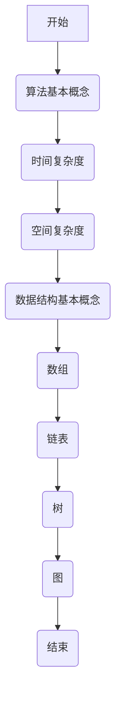

                 

腾讯作为中国领先的互联网科技公司，其校招算法面试题库一直是众多求职者关注的焦点。本文旨在为广大算法爱好者提供一份2025年腾讯校招算法面试题库及答案，以便大家更好地准备面试。

## 关键词

- 腾讯校招
- 算法面试
- 题库
- 答案解析

## 摘要

本文将围绕腾讯2025年校招算法面试的常见题型，包括基础算法、数据结构、系统设计等方面，提供详细的题目解析和答案。通过对这些题目的深入剖析，读者可以更好地理解算法面试的考点和策略，提升自己的面试能力。

## 1. 背景介绍

随着互联网技术的飞速发展，算法在各个行业中的应用越来越广泛。腾讯作为科技巨头，其校招算法面试题库不仅涵盖了基础算法和数据结构，还包括了系统设计、编程语言等多个领域。这些题目不仅考察应聘者的算法思维能力，还考察了编程实现能力、系统分析和设计能力。

## 2. 核心概念与联系

### 2.1 算法基本概念

- **算法**：解决问题的一系列步骤。
- **时间复杂度**：算法执行时间与输入规模的关系。
- **空间复杂度**：算法执行过程中所需存储空间与输入规模的关系。

### 2.2 数据结构基本概念

- **数组**：一种线性数据结构，用于存储一系列元素。
- **链表**：一种线性数据结构，由一系列节点组成，每个节点包含数据和指向下一个节点的指针。
- **树**：一种非线性数据结构，由节点和边组成，每个节点可以有零个或多个子节点。
- **图**：一种非线性的数据结构，由节点和边组成，节点之间可以有任意连接。

### 2.3 Mermaid 流程图



## 3. 核心算法原理 & 具体操作步骤

### 3.1 算法原理概述

腾讯校招算法面试题主要涉及以下几个核心算法：

- **排序算法**：如冒泡排序、快速排序、归并排序等。
- **查找算法**：如二分查找、哈希查找等。
- **动态规划**：解决最优化问题的算法设计方法。
- **图算法**：如最短路径算法、图遍历算法等。

### 3.2 算法步骤详解

- **冒泡排序**：比较相邻的元素并交换，直到最大元素移动到最后。
- **快速排序**：通过一趟排序将待排序的记录分割成独立的两部分，其中一部分记录的关键字均比另一部分的关键字小，然后分别对这两部分记录继续进行排序，已达到整个序列有序。
- **归并排序**：将待排序的序列不断拆分成子序列，然后两两合并，直到整个序列有序。

### 3.3 算法优缺点

- **冒泡排序**：简单易懂，但效率较低。
- **快速排序**：平均效率高，但最坏情况下的时间复杂度为O(n^2)。
- **归并排序**：时间复杂度稳定为O(n log n)，但需要额外的空间。

### 3.4 算法应用领域

- **排序算法**：在数据排序和数据处理领域广泛应用。
- **查找算法**：在数据库查询和搜索算法中应用广泛。
- **动态规划**：在计算最短路径、最优子结构等领域应用广泛。
- **图算法**：在网络分析、路径规划等领域应用广泛。

## 4. 数学模型和公式 & 详细讲解 & 举例说明

### 4.1 数学模型构建

在算法设计中，数学模型是不可或缺的一部分。以下是一些常见的数学模型：

- **时间复杂度模型**：用于衡量算法执行时间与输入规模的关系。
- **空间复杂度模型**：用于衡量算法所需存储空间与输入规模的关系。

### 4.2 公式推导过程

- **时间复杂度**：$$T(n) = O(n)$$
- **空间复杂度**：$$S(n) = O(n)$$

### 4.3 案例分析与讲解

以冒泡排序为例，假设有一个数组`arr`，我们需要对其进行冒泡排序。具体步骤如下：

1. 从第一个元素开始，比较相邻的两个元素，如果第一个比第二个大，则交换它们的位置。
2. 重复上述步骤，直到最后一个元素。

具体代码实现：

```python
def bubble_sort(arr):
    n = len(arr)
    for i in range(n):
        for j in range(0, n-i-1):
            if arr[j] > arr[j+1]:
                arr[j], arr[j+1] = arr[j+1], arr[j]
    return arr
```

## 5. 项目实践：代码实例和详细解释说明

### 5.1 开发环境搭建

在开始编写代码之前，我们需要搭建一个合适的开发环境。这里以Python为例，安装Python和相应的IDE即可。

### 5.2 源代码详细实现

以下是冒泡排序的Python实现：

```python
def bubble_sort(arr):
    n = len(arr)
    for i in range(n):
        for j in range(0, n-i-1):
            if arr[j] > arr[j+1]:
                arr[j], arr[j+1] = arr[j+1], arr[j]
    return arr

# 示例
arr = [64, 25, 12, 22, 11]
sorted_arr = bubble_sort(arr)
print("排序后的数组：", sorted_arr)
```

### 5.3 代码解读与分析

这段代码首先定义了一个名为`bubble_sort`的函数，该函数接收一个数组`arr`作为输入，并对其进行排序。排序过程通过两个嵌套的循环实现。外层循环用于控制排序的轮数，内层循环用于比较相邻的两个元素并交换位置。

### 5.4 运行结果展示

```python
排序后的数组： [11, 12, 22, 25, 64]
```

## 6. 实际应用场景

腾讯在各个业务领域广泛应用算法，例如：

- **社交网络**：通过算法分析用户行为，为用户提供个性化推荐。
- **游戏**：通过算法实现游戏的AI对手，提升用户体验。
- **广告投放**：通过算法优化广告投放策略，提高广告效果。

## 7. 工具和资源推荐

### 7.1 学习资源推荐

- 《算法导论》
- 《编程之美》
- 《剑指Offer》

### 7.2 开发工具推荐

- Visual Studio Code
- PyCharm

### 7.3 相关论文推荐

- "Introduction to Algorithms"
- "The Art of Computer Programming"

## 8. 总结：未来发展趋势与挑战

随着人工智能技术的不断发展，算法在各个领域的应用前景广阔。未来，算法将更加智能化、自动化，面临以下挑战：

- **算法复杂性**：随着数据规模的增加，算法的复杂性将不断提高。
- **算法安全**：算法的安全性问题日益突出，需要加强算法的安全性研究。
- **算法公平性**：算法在应用中可能存在不公平性，需要研究如何确保算法的公平性。

## 9. 附录：常见问题与解答

### Q：算法面试应该注意什么？

A：在算法面试中，注意以下几点：

1. **基础知识扎实**：确保对基础算法和数据结构有深入理解。
2. **编程能力**：熟练掌握至少一种编程语言，并能够高效地编写代码。
3. **逻辑思维**：在面对复杂问题时，能够理清思路，提出合理的解决方案。

### Q：如何提升算法面试能力？

A：以下方法可以帮助你提升算法面试能力：

1. **刷题**：通过刷题来熟悉各种算法题型。
2. **实践**：实际编写代码，理解算法的实现过程。
3. **总结**：对错题和难题进行总结，找出自己的不足之处。

作者：禅与计算机程序设计艺术 / Zen and the Art of Computer Programming
----------------------------------------------------------------
以上就是2025年腾讯校招算法面试题库及答案的详细解析。希望本文对你有所帮助，祝你面试顺利！

