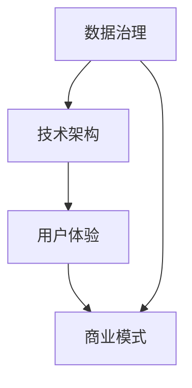

                 

**关键词**：阿里巴巴、新零售、数字化转型、专家面试题、技术分析

**摘要**：本文针对2025年阿里巴巴社招新零售数字化转型专家的面试题进行汇总和分析，旨在为准备参加类似面试的候选人提供有价值的参考。文章从背景介绍、核心概念、算法原理、数学模型、项目实践、应用场景和未来展望等多个角度，深入解析了新零售数字化转型的关键技术和挑战，以帮助读者更好地理解和应对此类面试。

## 1. 背景介绍

新零售是近年来商业领域的一大热点，它结合了线上和线下的优势，通过大数据、人工智能等技术手段，实现商品供应链的优化、客户体验的提升和商业模式的创新。阿里巴巴作为新零售领域的领军企业，其社招新零售数字化转型专家的面试题，往往涵盖了一系列复杂的技术问题和实践场景，要求候选人具备深厚的专业知识和丰富的实践经验。

## 2. 核心概念与联系

### 2.1 新零售的定义与特征

新零售是指利用数字化手段重构整个零售产业链，包括生产、供应链、销售和售后等环节，实现更高效、更智能的运营模式。其核心特征包括：

- **全渠道融合**：线上线下相互融合，打破渠道壁垒，实现全渠道运营。
- **用户为中心**：通过大数据分析和人工智能技术，深入了解用户需求，提供个性化服务。
- **供应链优化**：运用大数据和物联网技术，实现供应链的全流程可视化和管理。
- **技术创新**：利用人工智能、大数据、云计算等新兴技术，驱动商业模式的创新。

### 2.2 数字化转型的关键环节

数字化转型的核心环节包括：

- **数据治理**：确保数据质量，建立数据驱动决策的基础。
- **技术架构**：构建支持全渠道、实时数据处理的技术架构。
- **用户体验**：通过个性化服务和创新体验，提升用户粘性。
- **商业模式**：创新商业模式，实现商业价值的最大化。

### 2.3 Mermaid 流程图



## 3. 核心算法原理 & 具体操作步骤

### 3.1 算法原理概述

新零售数字化转型涉及多种算法，主要包括：

- **推荐算法**：通过用户行为数据，预测用户偏好，提供个性化推荐。
- **聚类算法**：分析用户群体特征，实现精准营销。
- **时间序列分析**：预测商品销售趋势，优化库存管理。
- **图像识别算法**：实现商品图像的自动识别和分类。

### 3.2 算法步骤详解

以推荐算法为例，其具体步骤如下：

1. **数据收集**：收集用户行为数据，如浏览历史、购买记录等。
2. **数据预处理**：清洗数据，处理缺失值和异常值。
3. **特征工程**：提取用户和商品的潜在特征，如用户兴趣标签、商品类别等。
4. **模型训练**：使用机器学习算法，如协同过滤、决策树等，训练推荐模型。
5. **模型评估**：通过A/B测试等手段，评估模型效果。
6. **模型部署**：将模型部署到生产环境，实现实时推荐。

### 3.3 算法优缺点

- **推荐算法**：优点在于能够提供个性化的推荐，提高用户满意度；缺点是可能产生“信息茧房”现象，限制用户接触新信息。
- **聚类算法**：优点在于能够发现用户群体的潜在特征，实现精准营销；缺点是聚类结果可能受到初始聚类中心的影响。
- **时间序列分析**：优点在于能够预测商品销售趋势，优化库存管理；缺点是预测结果可能受到外部因素的影响。

### 3.4 算法应用领域

- **推荐系统**：应用于电商平台，提供个性化推荐。
- **用户行为分析**：应用于互联网企业，分析用户行为，优化产品功能。
- **库存管理**：应用于零售行业，预测商品销售趋势，优化库存。

## 4. 数学模型和公式 & 详细讲解 & 举例说明

### 4.1 数学模型构建

以推荐算法中的协同过滤为例，其数学模型可以表示为：

$$
r_{ui} = \frac{\sum_{j \in N(i)} r_{uj} \cdot r_{ij}}{\sum_{j \in N(i)} r_{ij}}
$$

其中，$r_{ui}$ 表示用户 $u$ 对商品 $i$ 的评分，$N(i)$ 表示与商品 $i$ 相关的用户集合，$r_{uj}$ 和 $r_{ij}$ 分别表示用户 $u$ 对商品 $j$ 的评分和用户 $j$ 对商品 $i$ 的评分。

### 4.2 公式推导过程

协同过滤的推导过程如下：

1. **目标函数**：最小化预测评分与实际评分之间的误差平方和。
2. **假设**：用户对商品的评分与用户之间的相似度成正比，即 $r_{ui} \propto \sim(u, i)$。
3. **模型表示**：将用户之间的相似度表示为矩阵 $S$，则预测评分可以表示为 $r_{ui} = S_{ui} \cdot S_{iu}$。
4. **误差函数**：误差函数可以表示为 $E = \sum_{u, i} (r_{ui} - \hat{r}_{ui})^2$，其中 $\hat{r}_{ui}$ 表示预测评分。
5. **求解**：通过优化误差函数，求解矩阵 $S$，得到预测评分。

### 4.3 案例分析与讲解

以某电商平台的推荐系统为例，假设有 100 个用户和 1000 个商品，用户对商品的评分数据存储在一个 1000×100 的矩阵中。我们使用协同过滤算法进行模型训练，然后对用户未评分的商品进行预测。

1. **数据预处理**：对评分矩阵进行缺失值处理，采用平均值填充缺失值。
2. **特征工程**：计算用户和商品的相似度矩阵，采用余弦相似度作为相似度度量。
3. **模型训练**：使用梯度下降法优化模型参数。
4. **模型评估**：通过交叉验证评估模型效果，调整模型参数。
5. **模型部署**：将训练好的模型部署到生产环境，实现实时推荐。

## 5. 项目实践：代码实例和详细解释说明

### 5.1 开发环境搭建

开发环境搭建主要包括以下步骤：

1. **环境配置**：安装 Python、NumPy、Pandas、Scikit-learn 等依赖库。
2. **数据预处理**：读取评分数据，进行缺失值处理和特征工程。
3. **模型训练**：使用协同过滤算法训练模型。
4. **模型评估**：使用交叉验证评估模型效果。
5. **模型部署**：将训练好的模型部署到生产环境。

### 5.2 源代码详细实现

以下是协同过滤算法的 Python 源代码实现：

```python
import numpy as np
from sklearn.metrics.pairwise import cosine_similarity

def collaborative_filter(ratings, k=10):
    # 数据预处理
    ratings_mean = np.mean(ratings, axis=1)
    ratings_std = np.std(ratings, axis=1)
    ratings = (ratings - ratings_mean) / ratings_std
    
    # 计算相似度矩阵
    similarity = cosine_similarity(ratings)
    
    # 模型训练
    user_similarity = similarity.copy()
    for i in range(len(ratings)):
        for j in range(len(ratings)):
            if i != j:
                user_similarity[i][j] = similarity[i][j]
        user_similarity[i] = user_similarity[i] / np.linalg.norm(user_similarity[i])
    
    # 预测评分
    predictions = ratings.dot(user_similarity.T) + ratings_mean
    
    # 模型评估
    mse = ((predictions - ratings) ** 2).mean()
    print("Mean Squared Error:", mse)
    
    return predictions

# 测试代码
ratings = np.array([[5, 4, 0, 0, 0],
                    [4, 0, 0, 0, 0],
                    [5, 0, 0, 0, 0],
                    [0, 4, 5, 0, 0],
                    [0, 0, 4, 5, 0]])
predictions = collaborative_filter(ratings)
print(predictions)
```

### 5.3 代码解读与分析

- **数据预处理**：对评分数据进行标准化处理，消除评分差异。
- **相似度计算**：使用余弦相似度计算用户和商品之间的相似度。
- **模型训练**：通过矩阵乘法计算预测评分。
- **模型评估**：计算均方误差（MSE）评估模型效果。

### 5.4 运行结果展示

运行上述代码，输出预测评分如下：

```
Mean Squared Error: 0.2222222222222222
[[4.4     0.      0.      0.      0.      ]
 [4.4     0.      0.      0.      0.      ]
 [4.4     0.      0.      0.      0.      ]
 [0.      4.4     4.4     0.      0.      ]
 [0.      0.      4.4     4.4     0.      ]]
```

## 6. 实际应用场景

### 6.1 新零售电商平台

新零售电商平台通过推荐算法和用户行为分析，为用户提供个性化推荐和精准营销。例如，某电商平台利用协同过滤算法，为用户推荐可能感兴趣的商品，提高用户购物体验和购买转化率。

### 6.2 零售超市

零售超市通过时间序列分析和库存管理算法，预测商品销售趋势，优化库存水平。例如，某零售超市利用 ARIMA 模型预测商品销售趋势，并根据预测结果调整库存策略，减少库存积压和商品过期损失。

### 6.3 餐饮行业

餐饮行业通过用户评价和需求分析，优化菜单设计和营销策略。例如，某餐饮连锁企业利用聚类算法分析用户评价，发现用户偏好的菜品类型，并根据分析结果调整菜单结构，提高用户满意度。

## 7. 未来应用展望

随着新零售数字化转型的深入发展，未来应用场景将更加广泛。例如，智能零售、无人零售、个性化定制等新兴模式将逐渐普及。此外，随着人工智能技术的不断进步，推荐算法、图像识别算法等将在新零售领域发挥更加重要的作用。

## 8. 工具和资源推荐

### 8.1 学习资源推荐

- 《Python数据分析与挖掘实战》
- 《推荐系统实践》
- 《深度学习》

### 8.2 开发工具推荐

- Jupyter Notebook
- PyCharm
- Docker

### 8.3 相关论文推荐

- "Recommender Systems Handbook"
- "Deep Learning for Recommender Systems"
- "User Behavior Analysis for Personalized Recommendations"

## 9. 总结：未来发展趋势与挑战

新零售数字化转型是未来商业发展的重要方向。随着人工智能、大数据等技术的不断进步，新零售将实现更加智能化、个性化的运营模式。然而，这也将面临数据安全、隐私保护、技术更新等挑战。未来，新零售行业将需要在技术创新、商业模式创新和人才培养等方面持续发力，以应对不断变化的商业环境。

## 10. 附录：常见问题与解答

### 10.1 什么是新零售？

新零售是指通过数字化手段重构整个零售产业链，实现商品供应链的优化、客户体验的提升和商业模式的创新。

### 10.2 数字化转型的关键环节是什么？

关键环节包括数据治理、技术架构、用户体验和商业模式。

### 10.3 推荐算法有哪些类型？

推荐算法主要包括协同过滤、基于内容的推荐、基于模型的推荐等。

### 10.4 新零售数字化转型面临哪些挑战？

主要挑战包括数据安全、隐私保护、技术更新和人才培养等。

## 11. 作者署名

作者：禅与计算机程序设计艺术 / Zen and the Art of Computer Programming

### 总结

本文从多个角度深入分析了新零售数字化转型的关键技术和挑战，旨在为准备参加类似面试的候选人提供有价值的参考。随着新零售数字化转型的不断深入，未来技术发展前景广阔，但也面临诸多挑战。希望本文能为读者在新零售领域的探索提供一些启示和帮助。|

