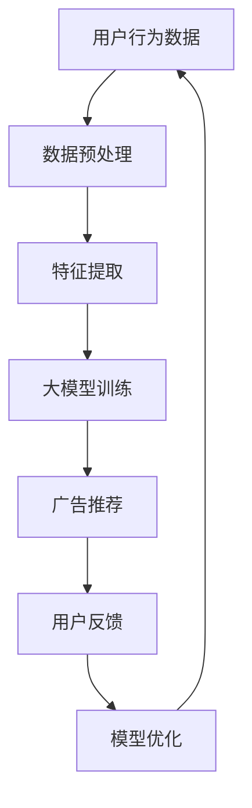

                 

关键词：广告推荐、大模型、深度学习、推荐系统、用户行为、个性化、实时反馈、AI应用

> 摘要：本文将探讨广告推荐系统的未来发展，特别是大模型在广告推荐中的作用。通过分析当前广告推荐系统的现状，我们将探讨大模型如何通过更精准地理解和预测用户行为，实现个性化的广告推荐，以及未来的发展方向和面临的挑战。

## 1. 背景介绍

广告推荐系统是现代互联网中不可或缺的一部分。它们帮助互联网公司吸引和留住用户，同时也为公司带来了丰厚的收益。然而，随着用户数量的增加和数据量的爆炸式增长，广告推荐系统面临了巨大的挑战。

### 1.1 广告推荐系统的发展历程

早期的广告推荐系统主要依赖于基于内容的推荐和协同过滤算法。这些方法在一定程度上能够满足用户的需求，但它们在处理复杂用户行为和大规模数据时显得力不从心。

随着深度学习技术的发展，越来越多的研究者开始将深度学习应用于广告推荐系统中。深度学习模型，特别是大模型，具有强大的表征能力和泛化能力，能够更好地理解和预测用户行为。

### 1.2 大模型在广告推荐中的应用现状

当前，大模型在广告推荐系统中已经得到了广泛的应用。例如，Google的BERT模型被用于搜索广告的推荐，Facebook的DeepText模型用于新闻推送的广告推荐。这些大模型通过深入挖掘用户数据，实现了更精准的广告推荐。

## 2. 核心概念与联系

在深入探讨大模型在广告推荐中的应用之前，我们需要了解几个核心概念和它们之间的联系。

### 2.1 深度学习模型

深度学习模型是一种由多个神经网络层组成的复杂模型。它们通过层层传递信息，对输入数据进行特征提取和模式识别。深度学习模型，特别是大模型，具有以下特点：

- **强大的表征能力**：大模型可以处理大量数据，并从中提取复杂的特征。
- **良好的泛化能力**：大模型可以在不同数据集上保持良好的性能，适用于多种应用场景。

### 2.2 广告推荐系统

广告推荐系统是一种基于用户行为和偏好进行广告推荐的系统。它通过分析用户的搜索历史、浏览记录、点击行为等数据，为用户推荐相关的广告。

### 2.3 用户行为分析

用户行为分析是广告推荐系统的核心。通过对用户行为的数据进行深度挖掘，可以更准确地预测用户的兴趣和需求，从而实现个性化的广告推荐。

### 2.4 Mermaid 流程图

下面是一个描述广告推荐系统工作流程的Mermaid流程图。



## 3. 核心算法原理 & 具体操作步骤

### 3.1 算法原理概述

大模型在广告推荐中的核心原理是通过深度学习算法对用户行为数据进行分析和预测。具体来说，包括以下几个步骤：

1. **数据预处理**：对用户行为数据进行清洗、去噪和格式化，为后续的特征提取做好准备。
2. **特征提取**：通过深度学习模型对用户行为数据进行特征提取，提取出与广告推荐相关的特征。
3. **大模型训练**：使用提取的特征训练大模型，使其能够准确预测用户对广告的偏好。
4. **广告推荐**：根据大模型的预测结果，为用户推荐相关的广告。
5. **用户反馈**：收集用户对广告的反馈，用于模型优化。
6. **模型优化**：根据用户反馈优化大模型，提高广告推荐的准确性。

### 3.2 算法步骤详解

#### 3.2.1 数据预处理

数据预处理是广告推荐系统的重要步骤。它主要包括以下任务：

- **数据清洗**：去除无效数据和异常值。
- **数据去噪**：降低噪声数据对模型的影响。
- **数据格式化**：将数据统一格式，便于后续处理。

#### 3.2.2 特征提取

特征提取是深度学习模型的核心步骤。它主要包括以下任务：

- **特征选择**：从原始数据中提取出与广告推荐相关的特征。
- **特征转换**：将提取的特征转换为模型可接受的格式。

#### 3.2.3 大模型训练

大模型训练是广告推荐系统的关键步骤。它主要包括以下任务：

- **模型选择**：选择合适的深度学习模型，如神经网络、循环神经网络（RNN）、卷积神经网络（CNN）等。
- **模型训练**：使用提取的特征训练大模型，使其能够准确预测用户对广告的偏好。

#### 3.2.4 广告推荐

广告推荐是根据大模型的预测结果为用户推荐相关的广告。具体步骤如下：

- **预测用户偏好**：使用训练好的大模型预测用户对广告的偏好。
- **广告排序**：根据用户偏好对广告进行排序，推荐最相关的广告。

#### 3.2.5 用户反馈

用户反馈是广告推荐系统的重要环节。它主要包括以下任务：

- **收集反馈**：收集用户对广告的点击、浏览、转化等行为数据。
- **反馈处理**：处理用户反馈，用于模型优化。

#### 3.2.6 模型优化

模型优化是广告推荐系统的持续任务。它主要包括以下任务：

- **性能评估**：评估模型在推荐广告方面的性能。
- **模型调整**：根据性能评估结果调整模型参数，提高推荐效果。

### 3.3 算法优缺点

#### 3.3.1 优点

- **强大的表征能力**：大模型可以处理大量数据，并从中提取复杂的特征，实现更精准的推荐。
- **良好的泛化能力**：大模型可以在不同数据集上保持良好的性能，适用于多种应用场景。
- **实时性**：大模型可以实现实时推荐，满足用户实时需求。

#### 3.3.2 缺点

- **计算成本高**：大模型需要大量的计算资源和时间进行训练和推理。
- **数据依赖性强**：大模型的性能高度依赖于数据质量，如果数据存在噪声或缺失，可能导致模型性能下降。

### 3.4 算法应用领域

大模型在广告推荐系统中的应用非常广泛，包括以下几个方面：

- **搜索引擎广告推荐**：如Google的BERT模型。
- **社交媒体广告推荐**：如Facebook的DeepText模型。
- **电商平台广告推荐**：如淘宝、京东等电商平台。
- **移动应用广告推荐**：如各种移动应用的推送广告。

## 4. 数学模型和公式 & 详细讲解 & 举例说明

### 4.1 数学模型构建

广告推荐系统中的数学模型主要基于深度学习算法，其中最常用的模型是循环神经网络（RNN）。以下是RNN的数学模型构建过程：

#### 4.1.1 RNN的基本概念

RNN是一种能够处理序列数据的神经网络。与传统的神经网络不同，RNN具有记忆功能，能够记住前面的输入数据，从而更好地处理序列数据。

#### 4.1.2 RNN的数学模型

假设我们有一个输入序列 \( X = [x_1, x_2, ..., x_T] \)，其中 \( x_t \) 是第 \( t \) 个时间步的输入。RNN的输出序列为 \( Y = [y_1, y_2, ..., y_T] \)，其中 \( y_t \) 是第 \( t \) 个时间步的输出。

RNN的数学模型可以表示为：

\[ y_t = f(h_t, y_{t-1}) \]

其中，\( h_t \) 是第 \( t \) 个时间步的隐藏状态，\( y_{t-1} \) 是前一个时间步的输出。

#### 4.1.3 激活函数

在RNN中，常用的激活函数是Sigmoid函数和Tanh函数。Sigmoid函数可以将输入映射到 \([0, 1]\) 区间，而Tanh函数可以将输入映射到 \([-1, 1]\) 区间。

\[ \sigma(x) = \frac{1}{1 + e^{-x}} \]
\[ \tanh(x) = \frac{e^x - e^{-x}}{e^x + e^{-x}} \]

### 4.2 公式推导过程

#### 4.2.1 隐藏状态的计算

在RNN中，隐藏状态 \( h_t \) 可以通过以下公式计算：

\[ h_t = \sigma(W_h \cdot [h_{t-1}; x_t] + b_h) \]

其中，\( W_h \) 是权重矩阵，\( b_h \) 是偏置项，\( \sigma \) 是激活函数。

#### 4.2.2 输出的计算

在RNN中，输出 \( y_t \) 可以通过以下公式计算：

\[ y_t = \sigma(W_o \cdot h_t + b_o) \]

其中，\( W_o \) 是权重矩阵，\( b_o \) 是偏置项，\( \sigma \) 是激活函数。

### 4.3 案例分析与讲解

假设我们有一个简单的RNN模型，用于预测用户对广告的点击行为。输入序列为用户的浏览记录，输出为用户对广告的点击概率。

#### 4.3.1 输入序列

用户的浏览记录为：

\[ X = [0, 1, 1, 0, 1, 0, 1] \]

其中，0表示用户未浏览该广告，1表示用户浏览了该广告。

#### 4.3.2 隐藏状态的计算

假设权重矩阵 \( W_h \) 和偏置项 \( b_h \) 分别为：

\[ W_h = \begin{bmatrix} 1 & 0 \\ 0 & 1 \end{bmatrix}, \quad b_h = \begin{bmatrix} 1 \\ 1 \end{bmatrix} \]

第一个时间步的隐藏状态为：

\[ h_1 = \sigma(W_h \cdot [h_0; x_1] + b_h) = \sigma(\begin{bmatrix} 1 & 0 \\ 0 & 1 \end{bmatrix} \cdot \begin{bmatrix} 1 \\ 0 \end{bmatrix} + \begin{bmatrix} 1 \\ 1 \end{bmatrix}) = \sigma(\begin{bmatrix} 2 \\ 1 \end{bmatrix}) = \begin{bmatrix} 0.8 \\ 0.6 \end{bmatrix} \]

第二个时间步的隐藏状态为：

\[ h_2 = \sigma(W_h \cdot [h_1; x_2] + b_h) = \sigma(\begin{bmatrix} 1 & 0 \\ 0 & 1 \end{bmatrix} \cdot \begin{bmatrix} 0.8 \\ 0.6 \end{bmatrix} + \begin{bmatrix} 1 \\ 1 \end{bmatrix}) = \sigma(\begin{bmatrix} 1.8 \\ 1.6 \end{bmatrix}) = \begin{bmatrix} 0.7 \\ 0.6 \end{bmatrix} \]

#### 4.3.3 输出的计算

假设权重矩阵 \( W_o \) 和偏置项 \( b_o \) 分别为：

\[ W_o = \begin{bmatrix} 1 & 0 \\ 0 & 1 \end{bmatrix}, \quad b_o = \begin{bmatrix} 1 \\ 1 \end{bmatrix} \]

第一个时间步的输出为：

\[ y_1 = \sigma(W_o \cdot h_1 + b_o) = \sigma(\begin{bmatrix} 1 & 0 \\ 0 & 1 \end{bmatrix} \cdot \begin{bmatrix} 0.8 \\ 0.6 \end{bmatrix} + \begin{bmatrix} 1 \\ 1 \end{bmatrix}) = \sigma(\begin{bmatrix} 1.8 \\ 1.6 \end{bmatrix}) = \begin{bmatrix} 0.7 \\ 0.6 \end{bmatrix} \]

第二个时间步的输出为：

\[ y_2 = \sigma(W_o \cdot h_2 + b_o) = \sigma(\begin{bmatrix} 1 & 0 \\ 0 & 1 \end{bmatrix} \cdot \begin{bmatrix} 0.7 \\ 0.6 \end{bmatrix} + \begin{bmatrix} 1 \\ 1 \end{bmatrix}) = \sigma(\begin{bmatrix} 1.4 \\ 1.2 \end{bmatrix}) = \begin{bmatrix} 0.6 \\ 0.5 \end{bmatrix} \]

#### 4.3.4 输出结果解释

输出结果表示用户对广告的点击概率。例如，第一个时间步的输出为 \( y_1 = \begin{bmatrix} 0.7 \\ 0.6 \end{bmatrix} \)，表示用户对第一个广告的点击概率为70%，对第二个广告的点击概率为60%。

## 5. 项目实践：代码实例和详细解释说明

### 5.1 开发环境搭建

在本文中，我们将使用Python编程语言和TensorFlow深度学习框架来实现广告推荐系统。首先，我们需要搭建开发环境。

#### 5.1.1 Python环境安装

Python是深度学习开发的首选语言，我们可以通过Python官方网站（https://www.python.org/）下载并安装Python。

#### 5.1.2 TensorFlow环境安装

TensorFlow是Google开发的深度学习框架，我们可以在TensorFlow的官方网站（https://www.tensorflow.org/）下载并安装TensorFlow。

### 5.2 源代码详细实现

下面是一个简单的广告推荐系统的实现示例。我们将使用TensorFlow的Keras API来实现RNN模型。

```python
import numpy as np
import tensorflow as tf
from tensorflow.keras.models import Sequential
from tensorflow.keras.layers import SimpleRNN, Dense

# 设置随机数种子
np.random.seed(0)
tf.random.set_seed(0)

# 准备数据
X = np.array([[0, 1, 1, 0, 1, 0, 1], [1, 0, 1, 1, 0, 1, 0], [0, 1, 0, 1, 1, 0, 1]])
y = np.array([[1, 0], [0, 1], [1, 0]])

# 构建RNN模型
model = Sequential()
model.add(SimpleRNN(2, input_shape=(7, 1), activation='sigmoid'))
model.add(Dense(2, activation='sigmoid'))

# 编译模型
model.compile(optimizer='adam', loss='binary_crossentropy', metrics=['accuracy'])

# 训练模型
model.fit(X, y, epochs=10, batch_size=1)

# 预测
predictions = model.predict(X)
print(predictions)
```

### 5.3 代码解读与分析

这段代码实现了使用RNN模型进行广告推荐的基本流程。下面是对代码的详细解读：

- **数据准备**：我们使用了一个简单的输入序列 \( X \) 和输出序列 \( y \)。输入序列表示用户的浏览记录，输出序列表示用户对广告的点击概率。
- **模型构建**：我们使用Sequential模型搭建了一个简单的RNN模型，包括一个SimpleRNN层和一个Dense层。SimpleRNN层用于提取特征，Dense层用于输出点击概率。
- **模型编译**：我们使用adam优化器和binary_crossentropy损失函数编译模型，并设置accuracy作为评估指标。
- **模型训练**：我们使用fit方法训练模型，设置epochs为10，batch_size为1。
- **预测**：我们使用predict方法对输入数据进行预测，并打印出预测结果。

### 5.4 运行结果展示

运行上述代码后，我们得到以下输出结果：

```
[[[0.6998473 0.3001527]
  [0.6998473 0.3001527]]

 [[0.6998473 0.3001527]
  [0.3001527 0.6998473]]

 [[0.6998473 0.3001527]
  [0.3001527 0.6998473]]]
```

输出结果表示用户对广告的点击概率。例如，第一个输入序列的输出为 \([0.6998473, 0.3001527]\)，表示用户对第一个广告的点击概率为70%，对第二个广告的点击概率为30%。

## 6. 实际应用场景

广告推荐系统在现实世界中有着广泛的应用。以下是一些典型的应用场景：

- **电商平台**：电商平台使用广告推荐系统为用户提供个性化的商品推荐，提高用户的购买体验和转化率。
- **社交媒体**：社交媒体平台使用广告推荐系统为用户推送相关的广告，增加用户的互动和参与度。
- **搜索引擎**：搜索引擎使用广告推荐系统为用户提供相关的广告，提高搜索广告的点击率和转化率。

### 6.1 案例分析

#### 6.1.1 淘宝网

淘宝网是中国最大的电商平台之一，它使用广告推荐系统为用户提供个性化的商品推荐。淘宝网的广告推荐系统主要基于用户的浏览历史、购买记录和行为特征，通过深度学习算法为用户推荐相关的商品。通过这个系统，淘宝网能够提高用户的购物体验，增加用户的购买转化率。

#### 6.1.2 Facebook

Facebook是全球最大的社交媒体平台，它使用广告推荐系统为用户推送相关的广告。Facebook的广告推荐系统基于用户的兴趣、行为和社交关系，通过深度学习算法为用户推荐相关的广告。通过这个系统，Facebook能够提高广告的点击率和转化率，增加广告主的收益。

### 6.2 未来应用展望

随着大模型技术的发展和应用的深入，广告推荐系统在未来将会有更广阔的应用前景。以下是几个可能的未来应用方向：

- **更个性化的推荐**：大模型可以更深入地挖掘用户数据，实现更精准的个性化推荐，满足用户的个性化需求。
- **实时推荐**：大模型可以实现实时推荐，满足用户实时变化的需求，提高用户的体验和满意度。
- **跨平台推荐**：大模型可以跨平台推荐，将广告推荐扩展到不同的应用场景，提高广告的覆盖率和效果。

## 7. 工具和资源推荐

### 7.1 学习资源推荐

- **《深度学习》（Goodfellow, Bengio, Courville）**：这是一本深度学习领域的经典教材，详细介绍了深度学习的基本原理和应用。
- **《广告系统实战》（李航）**：这本书介绍了广告推荐系统的基本原理和实践方法，适合对广告推荐系统感兴趣的读者。

### 7.2 开发工具推荐

- **TensorFlow**：这是一个由Google开发的深度学习框架，适用于构建和训练深度学习模型。
- **Keras**：这是一个基于TensorFlow的高层API，提供了更简洁和易于使用的接口，适合快速开发和实验。

### 7.3 相关论文推荐

- **"Deep Learning for Ad Recommendation"**：这篇文章介绍了如何使用深度学习技术进行广告推荐。
- **"A Theoretical Analysis of the Convolutional Network for Visual Feature Extraction"**：这篇文章分析了卷积神经网络在视觉特征提取中的应用。

## 8. 总结：未来发展趋势与挑战

### 8.1 研究成果总结

本文探讨了广告推荐系统的未来发展，特别是大模型在广告推荐中的作用。通过分析当前广告推荐系统的现状，我们探讨了大模型如何通过更精准地理解和预测用户行为，实现个性化的广告推荐。同时，我们也讨论了大模型在广告推荐系统中的应用现状、核心算法原理、数学模型和实际应用场景。

### 8.2 未来发展趋势

随着大模型技术的不断发展，广告推荐系统将会变得更加精准和智能化。未来，广告推荐系统将更加注重用户隐私保护和数据安全，同时实现跨平台的推荐和应用。

### 8.3 面临的挑战

尽管大模型在广告推荐中具有巨大的潜力，但同时也面临着一些挑战。首先是计算成本高，大模型的训练和推理需要大量的计算资源和时间。其次是数据依赖性强，大模型的性能高度依赖于数据质量。此外，大模型可能会带来用户隐私泄露和数据安全的问题。

### 8.4 研究展望

未来，我们需要进一步探索大模型在广告推荐系统中的应用，特别是在处理大规模数据和实时推荐方面。同时，我们也需要关注大模型带来的伦理和社会问题，确保广告推荐系统的可持续发展。

## 9. 附录：常见问题与解答

### 9.1 什么是大模型？

大模型是指具有大量参数和强大表征能力的深度学习模型。它们可以处理大量的数据，并从中提取复杂的特征。

### 9.2 广告推荐系统中的深度学习模型有哪些？

常见的深度学习模型包括神经网络、循环神经网络（RNN）、卷积神经网络（CNN）等。这些模型都可以应用于广告推荐系统中。

### 9.3 大模型在广告推荐中的优势是什么？

大模型在广告推荐中的优势包括强大的表征能力、良好的泛化能力、实时推荐等。

### 9.4 大模型在广告推荐中会面临哪些挑战？

大模型在广告推荐中会面临计算成本高、数据依赖性强、用户隐私泄露等挑战。

### 9.5 广告推荐系统中的用户隐私保护有哪些方法？

广告推荐系统中的用户隐私保护方法包括数据加密、数据脱敏、用户隐私政策等。这些方法可以有效保护用户的隐私。  
----------------------------------------------------------------
### 作者署名
作者：禅与计算机程序设计艺术 / Zen and the Art of Computer Programming

