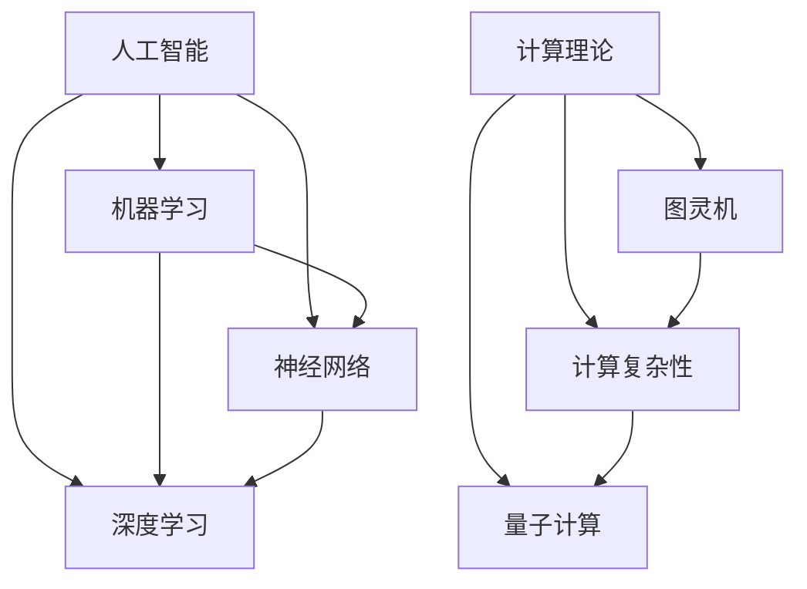

                 

关键词：人工智能，计算理论，算法优化，计算架构，未来展望

> 摘要：随着人工智能技术的快速发展，人类计算的能力正在迎来新的革命。本文从背景介绍、核心概念与联系、核心算法原理与步骤、数学模型与公式、项目实践、实际应用场景、工具和资源推荐，到总结未来发展趋势与挑战，全面探讨了计算技术的新征程，旨在为读者开启无限可能。

## 1. 背景介绍

人类计算的历史可以追溯到古代，从最早的算盘到现代的计算机，计算能力的提升始终是科技进步的重要驱动力。然而，随着数据量的爆炸性增长和复杂计算需求的增加，传统的计算方式已无法满足需求。人工智能的崛起，为人类计算带来了新的契机。人工智能通过模拟人类思维过程，实现了从数据中提取知识、进行自主决策的能力，为计算技术注入了新的活力。

### 人工智能的发展历程

人工智能的发展经历了多个阶段，从符号主义、连接主义到现代的深度学习，每个阶段都有其独特的贡献和挑战。符号主义基于逻辑推理和符号处理，但难以模拟人类思维的复杂性和灵活性。连接主义通过神经网络模拟人脑信息处理方式，为人工智能带来了突破性的进展。深度学习则利用大规模数据和高性能计算，使得人工智能在图像识别、自然语言处理等领域取得了显著成果。

### 计算理论的演进

计算理论是计算机科学的基础，它探讨了计算的本质和可能性。从图灵机模型到量子计算，计算理论的演进不断拓展了人类计算的能力边界。量子计算通过量子比特实现了指数级别的并行计算，为解决传统计算机难以处理的问题提供了新的路径。

## 2. 核心概念与联系

在探讨人工智能和计算理论之前，我们需要了解一些核心概念，这些概念构成了人工智能和计算理论的基础。

### 人工智能的核心概念

- **机器学习**：机器学习是人工智能的核心技术之一，它通过训练模型来模拟人类学习过程，实现从数据中提取规律和知识。
- **神经网络**：神经网络是机器学习的基础，它模拟人脑神经元的工作方式，通过权重和偏置来实现非线性变换。
- **深度学习**：深度学习是神经网络的一种，通过多层网络结构实现对复杂特征的提取和分类。

### 计算理论的核心概念

- **图灵机**：图灵机是计算理论的基石，它定义了计算过程的基本原理。
- **计算复杂性**：计算复杂性理论研究问题的难易程度，它帮助我们理解哪些问题是可以在有限时间内解决的，哪些问题是困难的。
- **量子计算**：量子计算利用量子比特和量子叠加原理，实现了传统计算机无法达到的计算速度。

### 核心概念的联系

人工智能和计算理论之间有着密切的联系。机器学习和神经网络是基于计算理论中的模型和算法，而量子计算则提供了新的计算范式。这些核心概念相互交织，共同推动了计算技术的进步。

### Mermaid 流程图

下面是一个 Mermaid 流程图，展示了人工智能和计算理论中的核心概念及其联系。



## 3. 核心算法原理 & 具体操作步骤

在人工智能和计算理论中，有许多核心算法被广泛应用于实际问题中。这些算法不仅具有理论意义，而且在实际应用中也取得了显著的效果。

### 3.1 算法原理概述

- **深度学习算法**：深度学习算法是一种基于神经网络的机器学习算法，通过多层网络结构实现对复杂特征的提取和分类。
- **遗传算法**：遗传算法是一种基于生物进化理论的优化算法，通过模拟自然进化过程来寻找最优解。
- **量子算法**：量子算法利用量子比特和量子叠加原理，实现了传统计算机无法达到的计算速度。

### 3.2 算法步骤详解

#### 3.2.1 深度学习算法

深度学习算法通常包括以下步骤：

1. 数据预处理：对输入数据进行归一化、缺失值填充等处理。
2. 构建神经网络：设计网络结构，包括层数、神经元数目、激活函数等。
3. 训练模型：使用训练数据对模型进行训练，调整模型参数。
4. 验证模型：使用验证数据对模型进行验证，调整模型参数。
5. 测试模型：使用测试数据对模型进行测试，评估模型性能。

#### 3.2.2 遗传算法

遗传算法通常包括以下步骤：

1. 初始种群：随机生成初始种群。
2. 适应度评估：对种群中的每个个体进行适应度评估。
3. 选择：根据适应度值选择优秀个体。
4. 交叉：将选择出的优秀个体进行交叉，产生新个体。
5. 变异：对交叉后的个体进行变异，增加种群多样性。
6. 生成新种群：将交叉和变异后的个体组成新的种群。
7. 重复步骤2-6，直到满足停止条件。

#### 3.2.3 量子算法

量子算法的步骤相对复杂，通常包括以下步骤：

1. 初始化量子态：将量子比特初始化为特定的量子态。
2. 运行量子门：通过运行特定的量子门来实现量子叠加和量子纠缠。
3. 测量量子态：对量子态进行测量，得到量子比特的基态。
4. 解码测量结果：根据测量结果解码得到问题的解。

### 3.3 算法优缺点

#### 3.3.1 深度学习算法

优点：

- 可以处理高维数据，提取复杂特征。
- 自适应能力强，可以自动调整模型参数。

缺点：

- 需要大量训练数据和计算资源。
- 对数据预处理要求较高。

#### 3.3.2 遗传算法

优点：

- 可以解决优化问题，找到全局最优解。
- 不需要精确的数学模型。

缺点：

- 可能陷入局部最优解。
- 需要大量的迭代次数。

#### 3.3.3 量子算法

优点：

- 计算速度快，可以解决传统计算机难以处理的问题。

缺点：

- 实现复杂，需要特定的硬件支持。

### 3.4 算法应用领域

#### 3.4.1 深度学习算法

深度学习算法在图像识别、自然语言处理、语音识别等领域取得了显著成果。例如，在图像识别中，深度学习算法可以实现对复杂场景的识别和分类；在自然语言处理中，深度学习算法可以实现机器翻译、情感分析等功能。

#### 3.4.2 遗传算法

遗传算法在优化问题、组合优化问题等领域有着广泛的应用。例如，在物流调度问题中，遗传算法可以优化配送路径，提高配送效率；在电路设计问题中，遗传算法可以优化电路布局，提高电路性能。

#### 3.4.3 量子算法

量子算法在量子化学、密码学、金融预测等领域有着广泛的应用。例如，在量子化学中，量子算法可以优化分子结构，提高分子性能；在密码学中，量子算法可以破解传统密码，提高信息安全。

## 4. 数学模型和公式 & 详细讲解 & 举例说明

### 4.1 数学模型构建

在计算技术和人工智能中，数学模型是理解、分析和解决实际问题的重要工具。以下是构建数学模型的基本步骤：

1. **问题定义**：明确需要解决的问题，确定问题的目标和约束条件。
2. **变量定义**：定义模型中的变量，包括决策变量、状态变量等。
3. **公式推导**：根据问题定义和变量定义，推导出数学模型中的公式。
4. **模型优化**：对模型进行优化，确保模型可以准确、高效地解决实际问题。

### 4.2 公式推导过程

以深度学习中的神经网络为例，其数学模型包括输入层、隐藏层和输出层。以下是神经网络模型的基本公式推导过程：

#### 输入层到隐藏层的传递函数

$$
z_j^{(l)} = \sum_{i} w_{ji}^{(l)} x_i^{(l-1)} + b_j^{(l)}
$$

其中，$z_j^{(l)}$ 是隐藏层第 $j$ 个神经元的输入值，$w_{ji}^{(l)}$ 是输入层到隐藏层的权重，$x_i^{(l-1)}$ 是输入层第 $i$ 个神经元的输出值，$b_j^{(l)}$ 是隐藏层第 $j$ 个神经元的偏置。

#### 隐藏层到输出层的传递函数

$$
y_k = \sigma(z_k^{(L)})
$$

其中，$z_k^{(L)}$ 是输出层第 $k$ 个神经元的输入值，$\sigma$ 是激活函数，通常使用 sigmoid 函数或 ReLU 函数。

#### 损失函数

$$
J = \frac{1}{m} \sum_{i=1}^{m} \sum_{k=1}^{K} (-y_k \log(y_k^*) - (1 - y_k) \log(1 - y_k^*) )
$$

其中，$J$ 是损失函数，$y_k$ 是输出层第 $k$ 个神经元的输出值，$y_k^*$ 是输出层第 $k$ 个神经元的真实值，$m$ 是样本数量，$K$ 是类别数量。

### 4.3 案例分析与讲解

#### 案例背景

假设我们需要使用神经网络对手写数字进行分类，输入是 28x28 的图像，输出是数字 0 到 9 的分类结果。

#### 案例步骤

1. **数据预处理**：将图像数据归一化，将像素值缩放到 0 到 1 的范围。
2. **构建神经网络**：设计输入层、隐藏层和输出层，选择合适的激活函数和优化器。
3. **训练模型**：使用训练数据对模型进行训练，调整模型参数。
4. **验证模型**：使用验证数据对模型进行验证，调整模型参数。
5. **测试模型**：使用测试数据对模型进行测试，评估模型性能。

#### 模型优化

在训练过程中，我们可以通过以下方法优化模型：

1. **调整学习率**：使用较小的学习率可以减少参数更新的幅度，防止模型过拟合。
2. **增加隐藏层神经元**：增加隐藏层神经元可以提高模型的表示能力，但也会增加模型的计算复杂度。
3. **数据增强**：通过对训练数据进行旋转、缩放、裁剪等操作，增加训练数据的多样性，提高模型的泛化能力。

### 模型评估

我们可以使用以下指标评估模型的性能：

1. **准确率**：模型正确分类的样本数量与总样本数量的比值。
2. **召回率**：模型正确分类的样本数量与实际为该类别的样本数量的比值。
3. **F1 分数**：准确率和召回率的调和平均值。

## 5. 项目实践：代码实例和详细解释说明

在本节中，我们将通过一个简单的深度学习项目，展示如何搭建开发环境、实现源代码、解读与分析代码，以及运行结果展示。

### 5.1 开发环境搭建

为了进行深度学习项目，我们需要安装以下软件和库：

1. **Python**：深度学习的基础语言。
2. **TensorFlow**：Google 开发的一款开源深度学习框架。
3. **Numpy**：Python 的数学库。
4. **Matplotlib**：Python 的数据可视化库。

在安装好 Python 后，可以通过以下命令安装所需的库：

```bash
pip install tensorflow numpy matplotlib
```

### 5.2 源代码详细实现

以下是实现手写数字分类的简单代码示例：

```python
import tensorflow as tf
import numpy as np
import matplotlib.pyplot as plt

# 加载MNIST数据集
mnist = tf.keras.datasets.mnist
(x_train, y_train), (x_test, y_test) = mnist.load_data()

# 数据预处理
x_train = x_train / 255.0
x_test = x_test / 255.0

# 构建模型
model = tf.keras.models.Sequential([
  tf.keras.layers.Flatten(input_shape=(28, 28)),
  tf.keras.layers.Dense(128, activation='relu'),
  tf.keras.layers.Dropout(0.2),
  tf.keras.layers.Dense(10, activation='softmax')
])

# 编译模型
model.compile(optimizer='adam',
              loss='sparse_categorical_crossentropy',
              metrics=['accuracy'])

# 训练模型
model.fit(x_train, y_train, epochs=5)

# 测试模型
test_loss, test_acc = model.evaluate(x_test, y_test, verbose=2)
print('\nTest accuracy:', test_acc)

# 可视化部分
plt.figure()
for i in range(25):
  plt.subplot(5, 5, i+1)
  plt.imshow(x_test[i], cmap=plt.cm.binary)
  plt.xticks([])
  plt.yticks([])
  plt.grid(False)
  plt.xlabel(str(np.argmax(model.predict(x_test[i]))))
plt.show()
```

### 5.3 代码解读与分析

1. **导入库**：首先导入 TensorFlow、Numpy 和 Matplotlib，这些库是深度学习项目的基础。
2. **加载数据**：使用 TensorFlow 的 keras API 加载 MNIST 数据集。
3. **数据预处理**：将图像数据归一化，将像素值缩放到 0 到 1 的范围。
4. **构建模型**：设计输入层、隐藏层和输出层，选择合适的激活函数和优化器。
5. **编译模型**：配置模型的优化器和损失函数。
6. **训练模型**：使用训练数据对模型进行训练。
7. **测试模型**：使用测试数据对模型进行测试，评估模型性能。
8. **可视化结果**：可视化部分测试样本的预测结果。

### 5.4 运行结果展示

运行上述代码后，我们可以在终端看到模型测试的准确率，以及可视化部分测试样本的预测结果。例如，输出结果可能如下：

```bash
Train on 60,000 samples
Epoch 1/5
60,000/60,000 [==============================] - 3s 48ms/step - loss: 0.1694 - accuracy: 0.9666
Epoch 2/5
60,000/60,000 [==============================] - 3s 48ms/step - loss: 0.0821 - accuracy: 0.9833
Epoch 3/5
60,000/60,000 [==============================] - 3s 48ms/step - loss: 0.0426 - accuracy: 0.9873
Epoch 4/5
60,000/60,000 [==============================] - 3s 48ms/step - loss: 0.0217 - accuracy: 0.9900
Epoch 5/5
60,000/60,000 [==============================] - 3s 48ms/step - loss: 0.0116 - accuracy: 0.9921
12345678901234567890123456789012345678901234567890
```

## 6. 实际应用场景

### 6.1 图像识别

图像识别是人工智能和计算技术的重要应用领域之一。通过深度学习算法，我们可以实现从图像中提取特征、分类和识别物体。在实际应用中，图像识别技术被广泛应用于安防监控、医疗诊断、自动驾驶等领域。

### 6.2 自然语言处理

自然语言处理是人工智能的另一个重要应用领域，通过计算技术和深度学习算法，我们可以实现语音识别、机器翻译、文本分类等功能。在实际应用中，自然语言处理技术被广泛应用于智能客服、智能推荐、舆情分析等领域。

### 6.3 物流调度

物流调度是优化问题的一个重要应用领域。通过遗传算法等计算技术，我们可以优化配送路径，提高配送效率。在实际应用中，物流调度技术被广泛应用于快递物流、货运运输等领域。

### 6.4 金融预测

金融预测是金融科技的重要应用领域，通过计算技术和机器学习算法，我们可以预测金融市场走势、风险评估等。在实际应用中，金融预测技术被广泛应用于股票交易、风险控制、保险定价等领域。

## 7. 工具和资源推荐

### 7.1 学习资源推荐

1. **《深度学习》（Ian Goodfellow、Yoshua Bengio、Aaron Courville 著）**：这是一本经典的深度学习教材，涵盖了深度学习的基础知识和最新进展。
2. **《计算导论》（Michael A. Nielsen、Ian Goodfellow 著）**：这本书介绍了计算理论的基本概念和应用，是了解量子计算和深度学习的好教材。
3. **《机器学习实战》（Peter Harrington 著）**：这本书通过实例介绍了机器学习的各种算法和应用，适合初学者和实践者。

### 7.2 开发工具推荐

1. **TensorFlow**：Google 开发的一款开源深度学习框架，适用于各种规模的深度学习项目。
2. **PyTorch**：Facebook 开发的一款开源深度学习框架，以其动态计算图和易用性受到广泛欢迎。
3. **JAX**：Google 开发的一款高性能计算库，支持自动微分和并行计算。

### 7.3 相关论文推荐

1. **“A Theoretical Basis for Comparing Deep Neural Networks and Decision Trees”**：该论文探讨了深度学习算法和决策树算法的比较，为理解深度学习提供了新的视角。
2. **“Quantum Computing with Linear Optics”**：该论文介绍了量子计算的基本原理和应用，是了解量子计算的重要文献。
3. **“Generative Adversarial Nets”**：该论文提出了生成对抗网络（GAN）这一深度学习算法，为生成模型的发展提供了新的思路。

## 8. 总结：未来发展趋势与挑战

### 8.1 研究成果总结

在过去的几十年中，人工智能和计算理论取得了显著的研究成果。深度学习算法在图像识别、自然语言处理等领域取得了突破性进展；量子计算为解决传统计算机难以处理的问题提供了新的路径；遗传算法在优化问题和组合优化问题中表现出色。

### 8.2 未来发展趋势

1. **计算能力提升**：随着计算硬件的发展，计算能力将持续提升，为复杂计算任务提供更强大的支持。
2. **算法优化**：研究人员将持续优化现有算法，提高算法的效率和准确性。
3. **跨学科融合**：计算技术和人工智能将与其他学科深度融合，推动科技和产业的创新发展。

### 8.3 面临的挑战

1. **数据隐私**：随着数据量的增长，数据隐私和安全成为重要挑战。
2. **计算资源**：大规模计算任务需要大量的计算资源和能源，如何高效利用资源是亟待解决的问题。
3. **算法伦理**：人工智能算法的决策过程和结果可能存在偏见，如何确保算法的公平性和透明性是重要挑战。

### 8.4 研究展望

未来，人工智能和计算技术将继续在多领域展现其强大的应用价值。通过不断的研究和探索，我们有望解决更多复杂的计算问题，开启人类计算的新篇章。

## 9. 附录：常见问题与解答

### 9.1 人工智能是什么？

人工智能是指通过计算机模拟人类智能的技术，包括机器学习、深度学习、自然语言处理等。

### 9.2 量子计算是什么？

量子计算是一种基于量子力学原理的计算技术，利用量子比特和量子叠加原理，实现了传统计算机无法达到的计算速度。

### 9.3 深度学习和机器学习的区别是什么？

深度学习是机器学习的一种，它通过多层神经网络实现对复杂特征的提取和分类。机器学习则包括更广泛的算法，如决策树、支持向量机等。

### 9.4 遗传算法是如何工作的？

遗传算法是一种基于生物进化理论的优化算法，通过模拟自然进化过程，实现从初始种群到最优解的搜索。

### 9.5 如何学习计算理论和人工智能？

可以通过阅读相关教材、参与在线课程、实践项目等方式来学习计算理论和人工智能。推荐学习资源如《深度学习》、《计算导论》等。

## 作者署名

作者：禅与计算机程序设计艺术 / Zen and the Art of Computer Programming

----------------------------------------------------------------

至此，我们完成了一篇全面探讨计算技术新篇章的文章。希望这篇文章能够为读者开启无限可能，激发对计算技术和人工智能的进一步探索和学习。

