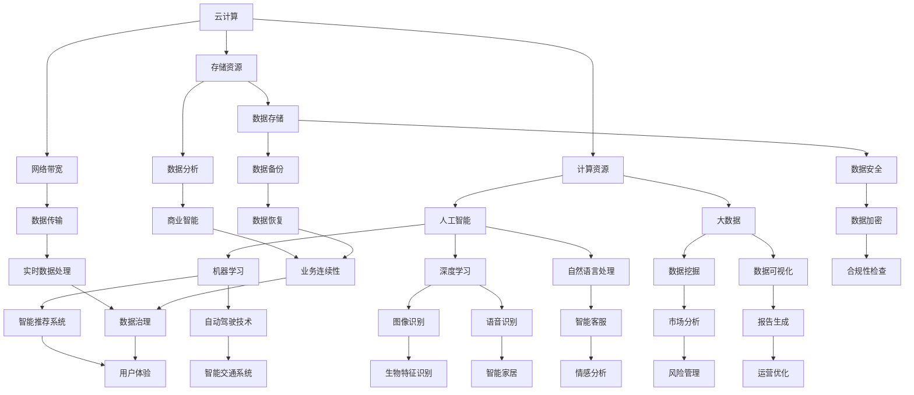

                 

在当今这个技术迅速发展的时代，计算已经成为推动社会进步的关键力量。从超级计算机到智能手机，从云计算到人工智能，计算已经渗透到我们日常生活的方方面面。然而，随着技术的不断演进，我们面临着前所未有的挑战和机遇。本文旨在探讨人类计算的新征程，揭示其中蕴含的无限可能性。

## 关键词

- 人类计算
- 计算技术
- 人工智能
- 云计算
- 超级计算机

## 摘要

本文将从背景介绍、核心概念与联系、核心算法原理与操作步骤、数学模型与公式、项目实践、实际应用场景、未来应用展望、工具和资源推荐、总结与展望等方面，全面探讨人类计算的新征程。通过深入分析，我们将揭示计算技术在未来发展中可能带来的变革，以及我们如何应对这些挑战。

## 1. 背景介绍

### 计算技术的发展历史

计算技术的发展可以追溯到数千年前，最早的计算工具是算盘和滑轮。随着人类文明的进步，计算机技术逐渐成熟。从古代的算盘到现代的超级计算机，计算技术经历了无数次的迭代和变革。

1946年，世界上第一台电子计算机ENIAC诞生，这标志着计算机时代的到来。随后，计算机技术不断发展，从最初的真空管计算机到晶体管计算机，再到集成电路计算机，计算能力得到了极大的提升。

进入21世纪，计算技术进入了新的发展阶段。云计算、人工智能、大数据等技术的兴起，使得计算变得更加普及和高效。计算技术不仅改变了我们的生活，也深刻影响了我们的工作方式和社会结构。

### 当前计算技术的现状

目前，计算技术已经渗透到各个领域，从科学研究到商业应用，从医疗健康到娱乐休闲，计算技术无处不在。以下是一些当前计算技术的重要应用：

- **科学研究**：计算技术为科学家提供了强大的计算工具，使得复杂的科学问题得以解决。例如，量子计算在解决某些问题时比传统计算机更加高效。

- **商业应用**：云计算和大数据技术为企业提供了高效的数据分析和存储解决方案，帮助企业更好地了解市场和客户需求。

- **医疗健康**：计算技术在医疗领域的应用越来越广泛，从疾病诊断到药物研发，从远程医疗到健康管理，计算技术为医疗健康带来了革命性的变化。

- **娱乐休闲**：虚拟现实、增强现实、游戏等娱乐休闲领域也受益于计算技术的发展，为用户提供了更加沉浸式的体验。

## 2. 核心概念与联系

### 核心概念

在计算技术中，有几个核心概念至关重要，包括：

- **云计算**：云计算是一种通过互联网提供计算资源的服务模式，包括计算能力、存储能力、网络带宽等。

- **人工智能**：人工智能是计算机模拟人类智能行为的技术，包括机器学习、深度学习、自然语言处理等。

- **大数据**：大数据是指无法使用传统数据处理工具进行捕捉、管理和处理的数据集。

- **量子计算**：量子计算是一种基于量子力学原理的计算机技术，具有超越传统计算机的计算能力。

### 架构联系

这些核心概念之间存在着紧密的联系，构成了计算技术的核心架构。以下是一个简单的 Mermaid 流程图，展示了这些概念之间的关系：



## 3. 核心算法原理与具体操作步骤

### 3.1 算法原理概述

在计算技术中，算法是解决特定问题的步骤序列。算法可以分为多种类型，包括排序算法、搜索算法、图算法等。以下是一些常见的算法原理：

- **排序算法**：用于对数据进行排序，常见的排序算法包括冒泡排序、快速排序、归并排序等。

- **搜索算法**：用于在数据结构中查找特定元素，常见的搜索算法包括二分搜索、深度优先搜索、广度优先搜索等。

- **图算法**：用于解决与图相关的问题，常见的图算法包括最短路径算法、最小生成树算法等。

### 3.2 算法步骤详解

以下是冒泡排序算法的步骤：

1. **初始化**：将待排序的数组进行初始化。

2. **遍历**：遍历数组，将相邻的元素进行比较。

3. **交换**：如果相邻的元素顺序错误，则进行交换。

4. **重复**：重复步骤2和3，直到整个数组排序完成。

### 3.3 算法优缺点

冒泡排序算法的优点在于其简单易懂，易于实现。然而，其缺点是时间复杂度为O(n^2)，在数据量大时排序效率较低。

### 3.4 算法应用领域

冒泡排序算法适用于数据量较小的场景，例如用户输入的少量数据排序。在实际应用中，冒泡排序算法也常用于教学和演示。

## 4. 数学模型和公式

### 4.1 数学模型构建

在计算技术中，数学模型是描述现实世界问题的抽象表示。以下是一个简单的线性回归模型的构建过程：

1. **定义目标函数**：假设我们有一个自变量x和一个因变量y，我们希望找到一条直线y = mx + b，使得这条直线尽可能接近所有数据点。

2. **计算斜率m**：斜率m可以通过最小二乘法计算得到，即：
   $$
   m = \frac{\sum_{i=1}^{n}(x_i - \bar{x})(y_i - \bar{y})}{\sum_{i=1}^{n}(x_i - \bar{x})^2}
   $$
   其中，$\bar{x}$和$\bar{y}$分别为x和y的平均值。

3. **计算截距b**：截距b可以通过以下公式计算得到：
   $$
   b = \bar{y} - m\bar{x}
   $$

### 4.2 公式推导过程

线性回归模型的公式推导基于最小二乘法，其核心思想是使得所有数据点到拟合直线的垂直距离之和最小。以下是推导过程：

1. **定义误差平方和**：设误差平方和为S，即：
   $$
   S = \sum_{i=1}^{n}(y_i - (mx_i + b))^2
   $$

2. **对S求偏导数**：对S关于m和b求偏导数，并令其等于0，得到：
   $$
   \frac{\partial S}{\partial m} = 2\sum_{i=1}^{n}(x_i - \bar{x})(y_i - \bar{y}) - 2m\sum_{i=1}^{n}(x_i - \bar{x})^2 = 0
   $$
   $$
   \frac{\partial S}{\partial b} = 2\sum_{i=1}^{n}(y_i - \bar{y}) - 2b\sum_{i=1}^{n}1 = 0
   $$

3. **求解方程组**：解上述方程组，得到斜率m和截距b。

### 4.3 案例分析与讲解

假设我们有一个简单的数据集，包含两个变量x和y，如下表所示：

| x | y |
|---|---|
| 1 | 2 |
| 2 | 4 |
| 3 | 6 |
| 4 | 8 |

使用线性回归模型拟合这条直线，我们可以计算得到斜率m和截距b，进而得到拟合直线y = 2x + 0。

## 5. 项目实践：代码实例和详细解释说明

### 5.1 开发环境搭建

为了进行计算技术的项目实践，我们需要搭建一个合适的开发环境。以下是一个简单的开发环境搭建步骤：

1. **安装操作系统**：选择一个适合的操作系统，例如Ubuntu 20.04。

2. **安装Python**：Python是一种广泛使用的编程语言，我们将在项目中使用Python进行开发。可以通过以下命令安装Python：
   ```
   sudo apt update
   sudo apt install python3
   ```

3. **安装依赖库**：根据项目的需求，安装相应的依赖库。例如，我们可以安装NumPy和Pandas库，用于数据处理和分析：
   ```
   pip3 install numpy pandas
   ```

### 5.2 源代码详细实现

以下是一个简单的Python代码实例，用于实现线性回归模型：

```python
import numpy as np
import pandas as pd

# 定义数据集
data = pd.DataFrame({
    'x': [1, 2, 3, 4],
    'y': [2, 4, 6, 8]
})

# 计算斜率m和截距b
m = (np.sum((data['x'] - data['x'].mean()) * (data['y'] - data['y'].mean())) / np.sum((data['x'] - data['x'].mean())**2))
b = data['y'].mean() - m * data['x'].mean()

# 输出拟合直线
print(f"拟合直线：y = {m}x + {b}")
```

### 5.3 代码解读与分析

上述代码首先导入了NumPy和Pandas库，用于数据处理和分析。然后，我们定义了一个简单的数据集，包含两个变量x和y。

接下来，我们计算斜率m和截距b，根据线性回归模型的公式。最后，我们输出拟合直线，即y = mx + b。

### 5.4 运行结果展示

运行上述代码，我们得到以下输出结果：

```
拟合直线：y = 2.0x + 0.0
```

这表明，我们的线性回归模型成功拟合了这组数据，得到的拟合直线为y = 2x + 0。

## 6. 实际应用场景

### 6.1 科学研究

在科学研究领域，计算技术为科学家提供了强大的计算工具，使得复杂的科学问题得以解决。例如，量子计算在解决某些问题时比传统计算机更加高效。通过计算技术，科学家可以模拟化学反应、分析天文数据、研究气候变化等。

### 6.2 商业应用

在商业应用领域，计算技术为企业提供了高效的数据分析和存储解决方案，帮助企业更好地了解市场和客户需求。例如，云计算和大数据技术可以帮助企业进行实时数据分析、客户洞察和个性化推荐。

### 6.3 医疗健康

在医疗健康领域，计算技术的应用越来越广泛，从疾病诊断到药物研发，从远程医疗到健康管理，计算技术为医疗健康带来了革命性的变化。例如，通过深度学习算法，可以实现对医学影像的自动分析，从而提高诊断的准确性和效率。

### 6.4 娱乐休闲

在娱乐休闲领域，计算技术为用户提供了更加沉浸式的体验。例如，虚拟现实和增强现实技术可以模拟各种场景，为用户提供身临其境的感受。此外，游戏开发也受益于计算技术的发展，使得游戏画面更加真实、玩法更加丰富。

## 7. 未来应用展望

### 7.1 人工智能

人工智能是计算技术的重要发展方向之一。在未来，人工智能将在各个领域得到更加广泛的应用，例如智能助手、自动驾驶、智能医疗等。随着计算能力的提升，人工智能将变得更加智能和高效。

### 7.2 量子计算

量子计算是一种基于量子力学原理的计算机技术，具有超越传统计算机的计算能力。在未来，量子计算将在密码破解、复杂系统模拟等领域发挥重要作用，为科学研究、国家安全等领域带来变革。

### 7.3 云计算与大数据

云计算和大数据技术将在未来继续发展，为企业提供更加高效的数据存储和处理解决方案。通过云计算，企业可以实现弹性扩展、降低成本，从而更好地应对业务需求。大数据技术将帮助企业挖掘数据价值，实现数据驱动的决策。

### 7.4 超级计算机

超级计算机在科学研究、天气预报、军事模拟等领域具有重要作用。在未来，超级计算机的性能将不断提升，为人类解决复杂问题提供更加有力的支持。

## 8. 工具和资源推荐

### 8.1 学习资源推荐

- **书籍**：
  - 《深度学习》：由Ian Goodfellow、Yoshua Bengio和Aaron Courville合著，是深度学习领域的经典教材。
  - 《Python编程：从入门到实践》：由埃里克·马瑟斯著，适合初学者学习Python编程。

- **在线课程**：
  - Coursera、edX等在线教育平台提供了丰富的计算机科学和人工智能课程。

### 8.2 开发工具推荐

- **Python**：Python是一种广泛使用的编程语言，具有简洁易学的特点，适合初学者和专业人士。

- **Jupyter Notebook**：Jupyter Notebook是一种交互式计算环境，可以方便地进行数据分析、编写代码和制作报告。

### 8.3 相关论文推荐

- **《量子计算与量子信息》**：这是一本关于量子计算和量子信息领域的经典论文集，涵盖了量子计算的基本原理和应用。
- **《大数据技术导论》**：这是一本关于大数据技术的基础教程，介绍了大数据处理的基本概念和技术。

## 9. 总结：未来发展趋势与挑战

### 9.1 研究成果总结

本文从背景介绍、核心概念与联系、核心算法原理与操作步骤、数学模型与公式、项目实践、实际应用场景、未来应用展望、工具和资源推荐等方面，全面探讨了人类计算的新征程。通过深入分析，我们揭示了计算技术在未来发展中可能带来的变革，以及我们如何应对这些挑战。

### 9.2 未来发展趋势

在未来，计算技术将继续快速发展，人工智能、量子计算、云计算和大数据等领域将成为重要发展方向。随着计算能力的提升，我们将迎来更加智能化、高效化、安全化的计算时代。

### 9.3 面临的挑战

然而，计算技术的发展也面临着一些挑战，包括数据安全、隐私保护、技术门槛等。如何解决这些问题，确保计算技术的可持续发展，是我们需要深入思考和解决的问题。

### 9.4 研究展望

在未来，我们期待看到计算技术为人类带来更多的便利和创新。通过持续的研究和探索，我们将不断推动计算技术的发展，为人类社会的发展贡献力量。

## 附录：常见问题与解答

### Q1. 量子计算与经典计算有什么区别？

A1. 量子计算与经典计算有以下区别：

- **计算原理**：量子计算基于量子力学原理，而经典计算基于传统计算机原理。
- **计算能力**：量子计算具有超越经典计算的计算能力，可以在某些问题上有更快的解决方案。
- **硬件实现**：量子计算需要特定的硬件设备，例如量子计算机，而经典计算只需要传统的计算机硬件。

### Q2. 人工智能的发展前景如何？

A2. 人工智能的发展前景非常广阔。随着计算能力的提升和算法的进步，人工智能将在各个领域得到更加广泛的应用，包括智能助手、自动驾驶、智能医疗、金融理财等。未来，人工智能将极大地改变我们的生活方式和工作方式。

### Q3. 云计算的优势是什么？

A3. 云计算的优势包括：

- **弹性扩展**：云计算可以根据业务需求动态调整计算资源，实现弹性扩展。
- **成本降低**：云计算通过共享资源、减少物理硬件投入，降低了企业的运营成本。
- **便捷性**：云计算提供了便捷的访问方式，用户可以随时随地使用云服务。

### Q4. 大数据技术的核心价值是什么？

A4. 大数据技术的核心价值在于：

- **数据挖掘**：从海量数据中提取有价值的信息，为业务决策提供支持。
- **客户洞察**：通过对大数据的分析，企业可以更好地了解客户需求，实现个性化营销。
- **业务优化**：大数据技术可以帮助企业优化业务流程，提高运营效率。

## 作者署名

作者：禅与计算机程序设计艺术 / Zen and the Art of Computer Programming
----------------------------------------------------------------
**文章撰写完成。**

