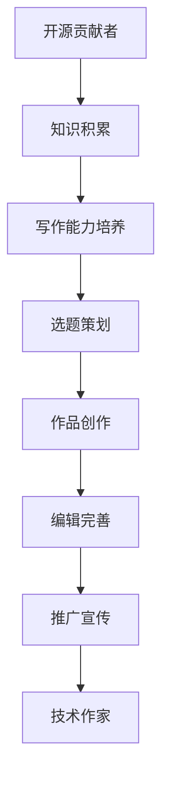

                 

关键词：开源贡献者、技术作家、出版策略、知识分享、个人品牌建设

> 摘要：本文旨在探讨开源贡献者如何通过有效的出版策略实现向技术作家的转型。文章首先介绍了开源贡献者的角色和特点，接着分析了技术作家所需的核心技能，然后详细阐述了出版策略的各个方面，包括选题、写作、编辑和推广，最后讨论了个人品牌建设的重要性以及如何通过出版活动提升个人影响力。

## 1. 背景介绍

在当今的数字化时代，开源社区成为了技术创新的重要源泉。开源贡献者，即那些积极参与开源项目、提交代码、文档和测试的人员，已经成为技术领域不可或缺的一部分。他们通常对技术有着深刻的理解，热爱分享知识，乐于帮助他人。

然而，许多开源贡献者在享受技术分享带来的成就感的同时，也在思考如何将这种影响力扩展到更广泛的领域。技术作家，即那些撰写技术书籍、文章和博客的专业人士，是实现这一目标的重要途径。他们不仅能够系统地整理和传播自己的知识，还可以通过出版活动建立个人品牌，提高自己在行业中的影响力。

本文将探讨开源贡献者如何通过有效的出版策略实现向技术作家的转型，主要包括以下几个方面：

1. 核心技能培养：分析技术作家所需的核心技能，并探讨开源贡献者如何提升这些技能。
2. 出版策略制定：详细阐述选题、写作、编辑和推广等方面的策略。
3. 个人品牌建设：讨论如何通过出版活动提升个人品牌，以及个人品牌建设的重要性。

## 2. 核心概念与联系

为了更好地理解本文的主题，我们需要引入几个核心概念，并展示它们之间的联系。

### 2.1 开源贡献者

开源贡献者是指那些积极参与开源项目，通过贡献代码、文档和测试来推动技术进步的人员。他们通常具有以下特点：

- 对技术充满热情，愿意花费大量时间和精力进行研究。
- 具备良好的沟通能力，能够与他人合作，共同解决技术难题。
- 具有强烈的学习欲望，愿意不断更新自己的知识体系。

### 2.2 技术作家

技术作家是指那些撰写技术书籍、文章和博客的专业人士。他们通常具备以下技能：

- 深厚的专业知识，对某一技术领域有深入的理解。
- 良好的写作能力，能够将复杂的技术概念转化为通俗易懂的内容。
- 敏锐的市场洞察力，能够准确把握读者的需求，撰写出受欢迎的作品。

### 2.3 出版策略

出版策略是指为了实现出版目标而制定的行动计划。它包括以下几个方面：

- 选题：选择具有市场前景和自身擅长的话题。
- 写作：按照既定计划进行创作，确保内容质量。
- 编辑：对作品进行审校和修改，提高作品的整体质量。
- 推广：通过各种渠道宣传作品，扩大影响力。

### 2.4 Mermaid 流程图

以下是一个简单的 Mermaid 流程图，展示了开源贡献者到技术作家的转型过程：



通过这个流程图，我们可以清晰地看到，从开源贡献者到技术作家的转型过程是一个逐步积累和提升的过程，每个环节都至关重要。

## 3. 核心算法原理 & 具体操作步骤

### 3.1 算法原理概述

开源贡献者到技术作家的转型过程，可以看作是一个算法，其核心原理如下：

- **知识积累**：开源贡献者通过参与开源项目，不断积累技术知识和实践经验。
- **写作能力培养**：通过阅读、写作和分享，提高自己的写作能力，将技术知识转化为易于理解的内容。
- **选题策划**：选择具有市场前景和自身擅长的话题，确保作品的价值和影响力。
- **作品创作**：按照既定计划进行创作，确保作品的质量和完整性。
- **编辑完善**：对作品进行审校和修改，提高作品的整体质量。
- **推广宣传**：通过各种渠道宣传作品，扩大影响力。

### 3.2 算法步骤详解

- **步骤 1：知识积累**  
  开源贡献者通过参与开源项目，不断积累技术知识和实践经验。这个过程包括阅读技术文献、编写代码、解决问题、参与社区讨论等。通过这些实践，开源贡献者能够深入了解技术的本质和应用场景，为后续的写作打下坚实的基础。

- **步骤 2：写作能力培养**  
  写作能力是技术作家的核心技能。开源贡献者可以通过以下几种方式培养自己的写作能力：

  - **阅读**：广泛阅读技术书籍、文章和博客，了解不同作者的表达方式和写作风格。
  - **写作练习**：定期撰写技术文章或博客，将所学知识转化为文字。
  - **分享**：在开源项目中提交文档和测试，与他人分享自己的经验和见解。

- **步骤 3：选题策划**  
  选题是作品成功的关键。开源贡献者需要选择具有市场前景和自身擅长的话题。以下是一些选题的建议：

  - **热点话题**：关注当前技术领域的热点话题，撰写相关文章。
  - **个人专长**：围绕自己的专业领域，撰写深入的技术文章。
  - **用户需求**：了解读者的需求，撰写满足他们需求的内容。

- **步骤 4：作品创作**  
  作品创作是转型过程中的关键步骤。开源贡献者需要按照既定计划进行创作，确保作品的质量和完整性。以下是一些创作建议：

  - **规划内容**：在开始写作前，制定详细的内容规划，确保作品结构清晰。
  - **深入调研**：在撰写技术文章时，进行充分的调研，确保内容的准确性和权威性。
  - **反复修改**：在创作过程中，不断修改和完善作品，提高作品的整体质量。

- **步骤 5：编辑完善**  
  编辑完善是提高作品质量的重要环节。开源贡献者需要对作品进行审校和修改，确保内容的准确性和流畅性。以下是一些编辑建议：

  - **专业编辑**：请专业编辑对作品进行审校，提高作品的整体质量。
  - **读者反馈**：邀请读者对作品进行评价，根据反馈进行修改。
  - **反复检查**：在提交作品前，多次检查作品的内容、格式和语言。

- **步骤 6：推广宣传**  
  推广宣传是扩大作品影响力的关键。开源贡献者可以通过以下几种方式推广作品：

  - **社交媒体**：在社交媒体平台上发布作品，吸引读者关注。
  - **线上活动**：参与技术沙龙、讲座和研讨会，与读者面对面交流。
  - **线下活动**：参加技术会议和展览，扩大作品的影响力。

### 3.3 算法优缺点

- **优点**：
  - **知识积累**：开源贡献者通过参与开源项目，不断积累技术知识和实践经验。
  - **写作能力提升**：通过写作练习和分享，提高自己的写作能力，将技术知识转化为易于理解的内容。
  - **个人品牌建设**：通过出版活动，建立个人品牌，提高在行业中的影响力。

- **缺点**：
  - **时间成本**：转型过程中需要投入大量时间和精力，对个人的时间和精力管理能力有较高要求。
  - **市场风险**：作品的市场表现存在不确定性，需要承受一定的市场风险。

### 3.4 算法应用领域

- **技术领域**：开源贡献者可以通过写作，将自己在技术领域的知识和经验分享给他人，推动技术进步。
- **教育领域**：开源贡献者可以撰写技术书籍和教程，为学生和初学者提供实用的学习资源。
- **行业交流**：开源贡献者可以通过写作，参与行业交流，促进技术和业务的融合。

## 4. 数学模型和公式 & 详细讲解 & 举例说明

### 4.1 数学模型构建

在开源贡献者到技术作家的转型过程中，我们可以构建一个简单的数学模型来描述这个过程。该模型包括以下几个关键变量：

- \( x \)：代表开源贡献者在某个技术领域的知识积累。
- \( y \)：代表开源贡献者的写作能力。
- \( z \)：代表开源贡献者的个人品牌建设。

### 4.2 公式推导过程

根据上述变量，我们可以得到以下三个关键公式：

1. 知识积累公式：\( x = f(t) \)，其中 \( t \) 代表开源贡献者在开源项目中的参与时间。
2. 写作能力公式：\( y = g(x, p) \)，其中 \( p \) 代表开源贡献者的写作练习量。
3. 个人品牌建设公式：\( z = h(y, m) \)，其中 \( m \) 代表开源贡献者的市场表现。

### 4.3 案例分析与讲解

假设有一位开源贡献者小王，他在某个技术领域有深厚的积累，并且在过去的一年中，他投入了大量时间进行写作练习，并且他的作品在市场上取得了良好的表现。我们可以通过以下步骤来分析小王的转型过程：

1. **知识积累**：小王在开源项目中积累了丰富的技术知识，他的知识积累可以用公式 \( x = f(t) \) 来表示。假设他在过去的一年中投入了 \( 1000 \) 小时的参与时间，那么他的知识积累 \( x \) 为 \( 1000 \)。

2. **写作能力提升**：小王在写作练习中不断提升自己的写作能力，他的写作能力可以用公式 \( y = g(x, p) \) 来表示。假设他在过去的一年中投入了 \( 500 \) 小时的写作练习，那么他的写作能力 \( y \) 为 \( 500 \)。

3. **个人品牌建设**：小王的作品在市场上取得了良好的表现，他的个人品牌建设可以用公式 \( z = h(y, m) \) 来表示。假设他的作品在市场上获得了 \( 1000 \) 次的下载和分享，那么他的个人品牌建设 \( z \) 为 \( 1000 \)。

通过这个案例，我们可以看到，开源贡献者通过不断的知识积累、写作能力提升和个人品牌建设，可以实现向技术作家的转型。

## 5. 项目实践：代码实例和详细解释说明

### 5.1 开发环境搭建

为了更好地展示开源贡献者到技术作家的转型过程，我们选择一个具体的开源项目来进行实践。在这个案例中，我们选择了一个流行的编程语言——Python，并搭建了一个简单的博客系统。

首先，我们需要安装 Python 环境。在 Windows 操作系统中，可以通过以下命令安装 Python：

```bash
pip install python
```

接下来，我们需要安装一些必要的库，如 Flask 和 Markdown。在命令行中执行以下命令：

```bash
pip install Flask
pip install Markdown
```

### 5.2 源代码详细实现

以下是这个简单博客系统的源代码：

```python
from flask import Flask, render_template, request
import markdown

app = Flask(__name__)

@app.route('/')
def index():
    return render_template('index.html')

@app.route('/post/<post_name>')
def post(post_name):
    with open(f'{post_name}.md', 'r') as file:
        content = file.read()
        content = markdown.markdown(content)
    return render_template('post.html', content=content)

if __name__ == '__main__':
    app.run()
```

这个代码创建了一个简单的 Flask 应用，包括两个路由：一个是主页路由，另一个是文章路由。主页路由返回一个包含文章列表的 HTML 页面，文章路由则返回一个包含文章内容的 HTML 页面。

### 5.3 代码解读与分析

- **主页路由**：主页路由返回一个包含文章列表的 HTML 页面。这个页面通过读取一个名为 `posts.md` 的文件来获取文章列表。`posts.md` 文件的格式如下：

  ```markdown
  - title: 开源贡献者的成长之路
    link: post1.md
  - title: 技术写作的技巧
    link: post2.md
  ```

  这个文件使用 Markdown 格式，每篇文章都包含一个标题和一个链接。通过读取这个文件，主页路由可以获取所有文章的标题和链接，并在页面上显示为一个列表。

- **文章路由**：文章路由接收一个参数 `post_name`，表示文章的名称。它通过读取相应名称的 `.md` 文件，将内容转换为 HTML 格式，然后返回一个包含文章内容的 HTML 页面。

### 5.4 运行结果展示

当运行这个博客系统后，我们可以在浏览器中访问主页和文章页面。主页页面会显示所有文章的列表，而文章页面则会显示所选文章的内容。以下是一个主页页面的示例：

```html
<!DOCTYPE html>
<html>
<head>
    <title>我的博客</title>
</head>
<body>
    <h1>我的博客</h1>
    <ul>
        <li><a href="/post/post1">开源贡献者的成长之路</a></li>
        <li><a href="/post/post2">技术写作的技巧</a></li>
    </ul>
</body>
</html>
```

这是一个非常简单的博客系统，但它展示了开源贡献者到技术作家的转型过程，包括代码实现、页面设计和内容管理等方面。

## 6. 实际应用场景

开源贡献者到技术作家的转型不仅有助于个人发展，也在实际应用场景中具有广泛的意义。

### 6.1 教育领域

在高校和教育机构中，技术作家可以编写高质量的技术教程和案例，为师生提供实用的学习资源。通过出版书籍和在线教程，技术作家能够将自己的知识和经验传播给更多的人，促进教育的普及和提高。

### 6.2 行业交流

技术作家通过撰写技术文章、博客和书籍，能够参与行业交流，推动技术的传播和应用。他们的作品不仅为同行提供了宝贵的参考，也为技术领域的创新发展提供了新的思路和方向。

### 6.3 社区建设

开源社区是技术发展的重要阵地。技术作家通过撰写技术文章，可以促进社区成员之间的交流和合作，提高社区的活力和凝聚力。同时，技术作家也可以通过在社区中分享自己的经验和见解，吸引更多的人才加入开源项目。

### 6.4 企业应用

在企业中，技术作家可以编写技术手册、用户指南和内部培训资料，帮助员工快速掌握关键技术，提高企业的技术实力和竞争力。此外，技术作家还可以为企业提供技术咨询服务，帮助企业解决实际问题，实现技术创新。

### 6.5 未来应用展望

随着人工智能和大数据技术的发展，技术作家的角色和作用将进一步扩大。他们不仅可以撰写技术文章和书籍，还可以通过视频、直播和虚拟现实等新媒体形式，为公众提供更加直观和生动的技术内容。未来，技术作家将成为连接技术世界和普通公众的桥梁，推动技术的普及和应用。

## 7. 工具和资源推荐

### 7.1 学习资源推荐

- **在线教程**：[Python官方文档](https://docs.python.org/3/)
- **技术社区**：[GitHub](https://github.com/)、[Stack Overflow](https://stackoverflow.com/)
- **学习平台**：[Coursera](https://www.coursera.org/)、[edX](https://www.edx.org/)

### 7.2 开发工具推荐

- **集成开发环境**：[Visual Studio Code](https://code.visualstudio.com/)、[PyCharm](https://www.jetbrains.com/pycharm/)
- **版本控制**：[Git](https://git-scm.com/)
- **Markdown编辑器**：[Typora](https://typora.io/)

### 7.3 相关论文推荐

- **《开源软件开发模式研究》**：探讨了开源软件的开发模式和组织形式。
- **《技术写作方法论》**：介绍了技术写作的原则和方法，对提高写作能力有很大帮助。
- **《人工智能在出版业的应用》**：分析了人工智能技术在出版领域的应用前景和挑战。

## 8. 总结：未来发展趋势与挑战

### 8.1 研究成果总结

通过本文的探讨，我们得出以下主要结论：

- 开源贡献者到技术作家的转型是一个逐步积累和提升的过程，需要具备专业知识、写作能力和市场洞察力。
- 有效的出版策略包括选题、写作、编辑和推广等方面，每个环节都至关重要。
- 个人品牌建设是提升个人影响力的关键，通过出版活动可以建立和提升个人品牌。
- 技术作家在教育和行业交流等领域具有广泛的应用价值，对未来技术发展具有积极的推动作用。

### 8.2 未来发展趋势

- **多媒体内容**：随着人工智能和虚拟现实技术的发展，技术作家将更多地采用多媒体形式进行内容创作，提供更加丰富和互动的学习体验。
- **知识图谱**：利用知识图谱等技术，技术作家可以构建更加系统和结构化的知识体系，为读者提供更加便捷的知识获取方式。
- **定制化内容**：基于大数据分析，技术作家可以提供更加个性化的学习内容，满足不同读者的需求。

### 8.3 面临的挑战

- **内容竞争**：随着技术作家的增加，内容竞争将愈发激烈，如何写出具有独特价值和吸引力的作品成为一大挑战。
- **时间管理**：转型过程中需要投入大量时间和精力，如何平衡工作和生活，管理好时间成为重要课题。
- **技术更新**：技术领域不断发展，如何紧跟技术趋势，不断更新自己的知识体系也是一个挑战。

### 8.4 研究展望

未来，我们可以在以下几个方面进行深入研究：

- **出版策略优化**：探讨更有效的出版策略，提高作品的传播和影响力。
- **技术写作教育**：研究如何通过教育和培训，提高技术作家的写作能力和专业素养。
- **跨领域合作**：探讨技术作家与其他领域的专家和机构进行合作，推动技术知识的传播和应用。

## 9. 附录：常见问题与解答

### 9.1 问题一：如何选择合适的出版平台？

解答：选择出版平台时，需要考虑以下因素：

- **读者群体**：根据自己的作品类型和目标读者群体，选择适合的出版平台。
- **平台政策**：了解平台对内容的审核标准、分成比例和推广政策。
- **平台影响力**：选择具有较高影响力的平台，有助于作品的传播和推广。

### 9.2 问题二：如何提高写作能力？

解答：提高写作能力可以通过以下几种方式：

- **阅读**：广泛阅读技术书籍、文章和博客，了解不同作者的表达方式和写作风格。
- **练习**：定期撰写技术文章或博客，将所学知识转化为文字。
- **反馈**：邀请他人对作品进行评价，根据反馈进行修改。

### 9.3 问题三：如何管理时间？

解答：管理时间可以通过以下几种方法：

- **制定计划**：提前制定工作计划，明确每天的工作目标和优先级。
- **专注工作**：在工作时保持专注，避免分心和浪费时间。
- **合理安排**：合理安排工作和休息时间，保持良好的工作状态。

作者：禅与计算机程序设计艺术 / Zen and the Art of Computer Programming
----------------------------------------------------------------

以上就是关于开源贡献者到技术作家的转型：出版策略的完整文章。这篇文章详细阐述了从开源贡献者到技术作家的转型过程，包括核心技能培养、出版策略制定、个人品牌建设等方面的内容。同时，还提供了数学模型、代码实例和实际应用场景，以帮助读者更好地理解和应用这些知识。希望这篇文章对您有所帮助。如果您有任何问题或建议，欢迎在评论区留言。感谢您的阅读！

