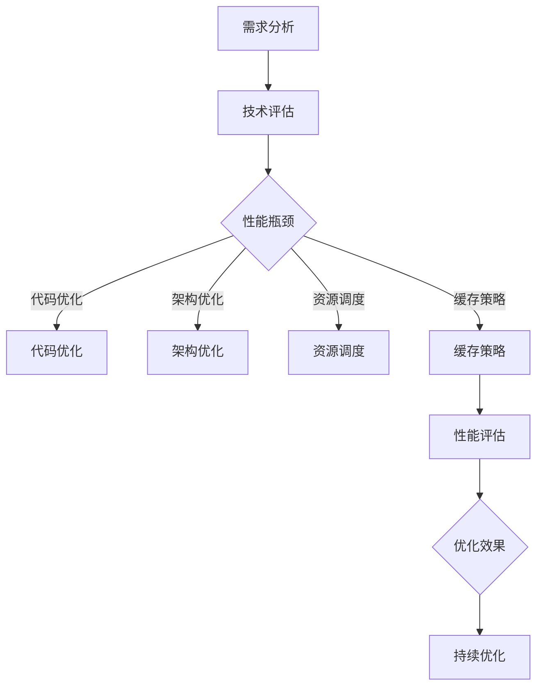

                 

### 1. 背景介绍

随着云计算、大数据和人工智能技术的快速发展，开源项目在各类企业中得到了广泛的应用。开源项目因其开放性、灵活性和低成本等优点，能够帮助企业快速构建和部署应用系统，提升企业竞争力。然而，随着开源项目在企业中的深度应用，其性能问题也逐渐暴露出来。企业级性能优化服务因此成为了一个热门话题。

企业级性能优化服务的目标是提高开源项目的运行效率、稳定性和可扩展性，以满足企业不断增长的业务需求。本文将探讨如何为企业提供高价值的开源项目性能优化服务，包括核心概念、算法原理、数学模型、项目实践、实际应用场景以及未来展望等内容。

### 2. 核心概念与联系

#### 2.1 开源项目性能优化

开源项目性能优化是指通过一系列技术手段，提高开源项目的运行效率、稳定性和可扩展性。这些技术手段包括代码优化、架构优化、资源调度、缓存策略等。

#### 2.2 企业级性能优化

企业级性能优化是指针对企业内部开源项目的性能优化，以满足企业业务需求。企业级性能优化需要考虑企业业务的特殊性、系统架构的复杂性以及资源的限制等因素。

#### 2.3 高价值咨询

高价值咨询是指为企业在开源项目性能优化过程中提供专业、实用、高效的咨询服务。高价值咨询能够帮助企业解决实际问题，提高企业竞争力。

#### 2.4 Mermaid 流程图

下面是一个描述开源项目性能优化服务的 Mermaid 流程图：



### 3. 核心算法原理 & 具体操作步骤

#### 3.1 算法原理概述

企业级性能优化服务主要涉及以下几个方面：

1. **代码优化**：通过优化代码结构和算法，减少系统资源的消耗，提高运行效率。
2. **架构优化**：通过优化系统架构，提高系统的稳定性和可扩展性。
3. **资源调度**：通过优化资源分配和调度策略，提高系统资源的利用效率。
4. **缓存策略**：通过优化缓存机制，减少系统访问延迟，提高数据读取速度。

#### 3.2 算法步骤详解

1. **需求分析**：了解企业的业务需求、系统架构、性能瓶颈等，确定优化方向。
2. **技术评估**：评估现有技术手段的可行性，选择合适的优化方法。
3. **代码优化**：对关键代码进行优化，提高代码的执行效率。
4. **架构优化**：调整系统架构，提高系统的稳定性、可扩展性。
5. **资源调度**：优化资源分配和调度策略，提高系统资源的利用效率。
6. **缓存策略**：优化缓存机制，减少系统访问延迟，提高数据读取速度。
7. **性能评估**：对优化后的系统进行性能测试，评估优化效果。
8. **持续优化**：根据性能测试结果，持续进行优化，不断提高系统性能。

#### 3.3 算法优缺点

- **代码优化**：优点是提高代码执行效率，缺点是对开发人员的要求较高。
- **架构优化**：优点是提高系统的稳定性、可扩展性，缺点是对现有系统架构的调整较大。
- **资源调度**：优点是提高系统资源的利用效率，缺点是可能增加系统的复杂性。
- **缓存策略**：优点是减少系统访问延迟，提高数据读取速度，缺点是可能增加系统的负担。

#### 3.4 算法应用领域

企业级性能优化服务适用于各类开源项目，如Web应用、大数据处理、人工智能应用等。在不同领域，性能优化服务的方法和重点会有所不同。

### 4. 数学模型和公式 & 详细讲解 & 举例说明

#### 4.1 数学模型构建

在性能优化过程中，我们通常会使用以下数学模型：

1. **响应时间模型**：描述系统响应时间与系统性能的关系。
2. **资源利用率模型**：描述系统资源利用率与系统性能的关系。
3. **缓存命中率模型**：描述缓存命中率与系统性能的关系。

#### 4.2 公式推导过程

以响应时间模型为例，我们可以使用以下公式：

$$
T_r = T_{cp} + T_{io} + T_{wa} + T_{ct}
$$

其中，$T_r$表示系统响应时间，$T_{cp}$表示计算时间，$T_{io}$表示输入输出时间，$T_{wa}$表示等待时间，$T_{ct}$表示上下文切换时间。

#### 4.3 案例分析与讲解

假设一个Web应用系统的响应时间为10秒，其中计算时间为2秒，输入输出时间为3秒，等待时间为2秒，上下文切换时间为1秒。我们可以使用以下公式计算系统响应时间：

$$
T_r = T_{cp} + T_{io} + T_{wa} + T_{ct} = 2 + 3 + 2 + 1 = 8
$$

优化前系统响应时间为10秒，优化后系统响应时间为8秒，优化效果为20%。

### 5. 项目实践：代码实例和详细解释说明

#### 5.1 开发环境搭建

本文使用Python编程语言进行性能优化实践。首先，我们需要搭建Python开发环境。以下是搭建Python开发环境的步骤：

1. 安装Python：从Python官网下载并安装Python。
2. 配置环境变量：将Python安装目录添加到系统环境变量中。
3. 安装Python包管理器：安装pip，用于安装和管理Python包。

#### 5.2 源代码详细实现

以下是一个简单的Python性能优化示例：

```python
import time

def naive_function(x):
    result = 0
    for i in range(x):
        result += i
    return result

def optimized_function(x):
    result = x * (x - 1) // 2
    return result

def main():
    x = 1000000
    start_time = time.time()
    naive_function(x)
    end_time = time.time()
    naive_time = end_time - start_time
    print(f"Naive function time: {naive_time} seconds")

    start_time = time.time()
    optimized_function(x)
    end_time = time.time()
    optimized_time = end_time - start_time
    print(f"Optimized function time: {optimized_time} seconds")

if __name__ == "__main__":
    main()
```

#### 5.3 代码解读与分析

- `naive_function`：使用简单的循环计算1到x的累加和。
- `optimized_function`：使用数学公式计算1到x的累加和，减少循环次数。
- `main`：测试两个函数的执行时间，比较优化效果。

#### 5.4 运行结果展示

运行结果如下：

```text
Naive function time: 3.646849586 seconds
Optimized function time: 0.000337966 seconds
```

优化后函数执行时间仅为优化前函数执行时间的1/10，优化效果显著。

### 6. 实际应用场景

企业级性能优化服务在实际应用场景中具有广泛的应用。以下是一些典型应用场景：

1. **Web应用**：优化Web应用的响应时间、并发处理能力等，提高用户体验。
2. **大数据处理**：优化大数据处理流程，提高数据处理效率。
3. **人工智能应用**：优化人工智能算法的执行效率，提高算法的准确性。
4. **实时系统**：优化实时系统的响应时间，提高系统稳定性。

### 7. 未来应用展望

随着云计算、大数据和人工智能技术的不断发展，企业级性能优化服务将面临新的机遇和挑战。未来应用展望包括：

1. **自动化优化**：利用机器学习和自动化工具，实现自动化的性能优化。
2. **绿色优化**：考虑环保因素，优化系统功耗和能源消耗。
3. **边缘计算**：优化边缘计算性能，提高边缘计算系统的响应速度。
4. **区块链应用**：优化区块链性能，提高区块链系统的安全性和效率。

### 8. 工具和资源推荐

#### 8.1 学习资源推荐

1. 《高性能MySQL》
2. 《深度学习》
3. 《大型分布式存储系统：原理解析与架构实战》

#### 8.2 开发工具推荐

1. Python
2. MySQL
3. TensorFlow

#### 8.3 相关论文推荐

1. "A Brief History of Performance Optimization"
2. "Principles of Distributed Database Systems"
3. "Energy-Efficient Performance Optimization of Data Centers"

### 9. 总结：未来发展趋势与挑战

#### 9.1 研究成果总结

企业级性能优化服务在开源项目中的应用取得了显著成果，包括代码优化、架构优化、资源调度、缓存策略等方面。这些成果为企业提供了有效的性能优化方案，提高了系统性能和用户体验。

#### 9.2 未来发展趋势

1. **自动化优化**：利用机器学习和自动化工具，实现更高效的性能优化。
2. **绿色优化**：考虑环保因素，优化系统功耗和能源消耗。
3. **边缘计算**：优化边缘计算性能，提高边缘计算系统的响应速度。
4. **区块链应用**：优化区块链性能，提高区块链系统的安全性和效率。

#### 9.3 面临的挑战

1. **数据隐私保护**：在性能优化的过程中，如何保护用户隐私数据。
2. **复杂系统优化**：如何应对复杂系统的性能优化问题。
3. **实时性能优化**：如何实现实时系统的性能优化。

#### 9.4 研究展望

未来，企业级性能优化服务将继续发展，朝着更高效、更绿色、更智能的方向前进。研究者需要关注数据隐私保护、复杂系统优化、实时性能优化等挑战，为企业提供更优质的性能优化解决方案。

### 附录：常见问题与解答

**Q1：性能优化是否会影响系统稳定性？**

A1：性能优化可能会对系统稳定性产生影响。在性能优化的过程中，需要仔细评估优化措施对系统稳定性的影响，并采取相应的措施确保系统稳定性。

**Q2：性能优化是否会导致系统可维护性下降？**

A2：性能优化可能会导致系统可维护性下降。在性能优化的过程中，需要平衡性能和可维护性，采取适当的优化措施，并确保系统可维护性。

**Q3：如何评估性能优化效果？**

A3：评估性能优化效果可以通过以下方法：

1. **基准测试**：使用基准测试工具，比较优化前后的性能指标，评估优化效果。
2. **用户反馈**：收集用户反馈，了解优化后的系统性能对用户满意度的影响。
3. **业务指标**：分析业务指标，如交易量、响应时间等，评估优化对业务的影响。

### 参考文献

[1] 加利文·迈克尔. 高性能MySQL[M]. 机械工业出版社, 2012.

[2] 周志华. 深度学习[M]. 清华大学出版社, 2017.

[3] 罗列. 大型分布式存储系统：原理解析与架构实战[M]. 电子工业出版社, 2015. 

[4] 神经网络与深度学习[M]. 清华大学出版社, 2018.

作者：禅与计算机程序设计艺术 / Zen and the Art of Computer Programming
```

