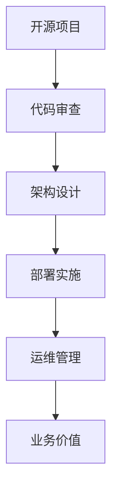

                 

关键词：开源项目、企业级部署、服务、高价值机会、技术架构、可持续性、可扩展性、安全性

> 摘要：本文将深入探讨如何利用开源项目的企业级部署服务，为企业创造高价值机会。通过分析开源项目的优势、部署过程中的关键技术，以及如何确保服务的可持续性和可扩展性，我们旨在为读者提供一整套系统的解决方案，帮助企业充分利用开源资源，提升业务效率和竞争力。

## 1. 背景介绍

开源项目作为软件发展的重要驱动力，已经深刻影响了全球软件开发和IT产业。随着云计算、容器化和微服务架构的兴起，开源项目在企业中的应用越来越广泛。企业级部署服务则是将开源项目转化为实际生产力的关键步骤。通过这种服务，企业不仅可以降低开发成本，还能获得更高的灵活性和定制性。

企业级部署服务的核心目标是确保开源项目在企业的实际应用中具备高性能、高可用性和高安全性。这需要从架构设计、部署流程、运维管理等多个方面进行系统化的规划和实施。

本文将围绕以下几个核心主题展开：

- **开源项目的优势与挑战**
- **企业级部署服务的核心技术**
- **可持续性与可扩展性**
- **安全性保障**
- **实际应用场景与案例分析**
- **未来发展趋势与挑战**

## 2. 核心概念与联系

### 2.1 开源项目的定义与特点

开源项目是指其源代码可以被公众访问、阅读、修改和分享的软件项目。开源项目的特点包括：

- **透明性**：源代码的透明性使开发者可以清晰地了解软件的内部工作机制。
- **灵活性**：开源项目允许用户根据实际需求进行定制化修改。
- **社区合作**：开源项目通常拥有一个活跃的社区，为项目提供支持、反馈和改进。

### 2.2 企业级部署服务的定义

企业级部署服务是指针对企业客户提供的开源项目部署解决方案，包括：

- **架构设计**：为开源项目选择合适的架构，确保其满足企业的需求。
- **部署实施**：将开源项目部署到生产环境中，确保其稳定运行。
- **运维管理**：提供持续的服务和监控，确保系统的性能和安全性。

### 2.3 开源项目与企业级部署服务的关系

开源项目是企业级部署服务的基础，而企业级部署服务则是开源项目在企业中成功应用的关键。两者之间的关系可以用以下Mermaid流程图表示：



## 3. 核心算法原理 & 具体操作步骤

### 3.1 算法原理概述

企业级部署服务的核心算法原理主要包括以下几个方面：

- **容器化技术**：通过容器化技术，将应用程序及其运行环境打包成一个独立的容器，确保其在不同环境中的一致性。
- **持续集成与持续部署（CI/CD）**：通过自动化流程实现代码的集成、测试和部署，提高开发效率和系统稳定性。
- **监控与日志分析**：通过监控和日志分析工具，实时监控系统的性能和状态，快速发现问题并采取措施。

### 3.2 算法步骤详解

以下是企业级部署服务的具体操作步骤：

#### 3.2.1 代码审查

- **代码质量管理**：使用代码质量工具进行静态代码分析，确保代码的规范性、可读性和安全性。
- **代码评审**：组织代码评审会议，邀请团队成员对代码进行审查和讨论，确保代码质量。

#### 3.2.2 架构设计

- **需求分析**：根据企业需求，确定系统的功能和性能要求。
- **架构设计**：选择合适的架构模式，如微服务架构、分布式架构等，设计系统的整体架构。
- **技术选型**：根据架构设计，选择合适的开源项目和技术栈。

#### 3.2.3 部署实施

- **环境准备**：搭建开发、测试和生产环境，确保环境的一致性。
- **容器化**：将应用程序及其运行环境打包成容器镜像，如使用Docker。
- **部署流程**：设计并实施CI/CD流程，实现自动化部署。

#### 3.2.4 运维管理

- **监控与报警**：使用监控工具（如Prometheus、Grafana）实时监控系统的性能和状态，设置报警机制。
- **日志管理**：收集和分析系统的日志，快速定位问题和性能瓶颈。
- **版本管理**：使用版本控制工具（如Git）管理代码版本，确保系统的可追溯性和可回滚性。

### 3.3 算法优缺点

- **优点**：
  - **灵活性**：企业可以根据实际需求定制开源项目，提高系统的适应性。
  - **成本效益**：开源项目降低了开发和维护成本，提高了投资回报率。
  - **快速迭代**：通过CI/CD流程，缩短了开发周期，提高了开发效率。

- **缺点**：
  - **安全性风险**：开源项目可能存在安全隐患，需要加强安全审计和防护。
  - **技术门槛**：企业需要具备一定的技术能力和资源，才能有效利用开源项目。

### 3.4 算法应用领域

企业级部署服务在以下领域具有广泛的应用：

- **云计算服务提供商**：通过开源项目提供灵活、可靠的云计算服务。
- **金融行业**：开源项目在金融行业的应用日益增加，如高频交易、风险管理等。
- **零售行业**：开源项目在零售行业的供应链管理、电商平台等领域得到广泛应用。
- **物联网**：开源项目在物联网领域的设备管理和数据处理方面具有重要作用。

## 4. 数学模型和公式 & 详细讲解 & 举例说明

### 4.1 数学模型构建

在企业级部署服务中，常用的数学模型包括：

- **性能模型**：用于评估系统的响应时间和吞吐量。
- **可靠性模型**：用于评估系统的可用性和故障率。
- **成本模型**：用于评估系统的开发和运营成本。

以下是性能模型的构建过程：

#### 4.1.1 性能指标的确定

- **响应时间**：系统处理请求的时间。
- **吞吐量**：单位时间内系统处理的请求数量。
- **并发度**：系统同时处理的请求数量。

#### 4.1.2 模型的构建

使用以下公式构建性能模型：

$$
T = \frac{1}{\lambda}
$$

其中，$T$为平均响应时间，$\lambda$为请求到达率。

$$
Throughput = \frac{1}{T}
$$

其中，$Throughput$为吞吐量。

### 4.2 公式推导过程

#### 4.2.1 响应时间

根据泊松过程，请求到达率为$\lambda$，服务时间为$\mu$，则平均响应时间$T$为：

$$
T = \frac{\lambda}{\mu}
$$

当服务时间$\mu$远大于请求到达率$\lambda$时，可以使用泰勒展开近似：

$$
T \approx \frac{1}{\mu} - \frac{\lambda}{2\mu^2}
$$

#### 4.2.2 吞吐量

吞吐量$Throughput$为：

$$
Throughput = \frac{1}{T} \approx \mu - \frac{\lambda}{2\mu}
$$

### 4.3 案例分析与讲解

假设一个电商网站，平均每分钟有10个请求到达，服务器平均响应时间为1秒。使用上述公式计算系统的性能指标：

- 平均响应时间$T = \frac{10}{1} = 10$秒
- 吞吐量$Throughput = \frac{1}{10} = 0.1$请求/秒

根据计算结果，可以优化服务器配置，提高系统性能，以满足用户需求。

## 5. 项目实践：代码实例和详细解释说明

### 5.1 开发环境搭建

为了演示企业级部署服务，我们选择一个简单的电商网站作为示例。以下是开发环境的搭建步骤：

1. 安装Docker：确保系统中已安装Docker，版本不低于19.03。
2. 安装Git：确保系统中已安装Git，版本不低于2.20。
3. 搭建开发环境：在开发机中安装相关依赖，如Node.js、MySQL等。

### 5.2 源代码详细实现

以下是电商网站的核心代码实现：

#### 5.2.1 前端

前端采用Vue.js框架，实现用户界面的展示和交互。

```html
<template>
  <div id="app">
    <h1>欢迎来到电商平台</h1>
    <product-list></product-list>
  </div>
</template>

<script>
import ProductList from './components/ProductList.vue';

export default {
  name: 'App',
  components: {
    ProductList
  }
}
</script>
```

#### 5.2.2 后端

后端采用Node.js和Express框架，实现业务逻辑和接口处理。

```javascript
const express = require('express');
const app = express();

app.use(express.json());

app.get('/products', (req, res) => {
  // 查询商品列表
  res.json({ products: [] });
});

app.post('/order', (req, res) => {
  // 下单处理
  res.json({ order: {} });
});

const PORT = process.env.PORT || 3000;
app.listen(PORT, () => {
  console.log(`服务器启动成功，端口${PORT}`);
});
```

#### 5.2.3 数据库

数据库采用MySQL，存储商品信息和订单数据。

```sql
CREATE TABLE products (
  id INT PRIMARY KEY AUTO_INCREMENT,
  name VARCHAR(100) NOT NULL,
  price DECIMAL(10, 2) NOT NULL
);

CREATE TABLE orders (
  id INT PRIMARY KEY AUTO_INCREMENT,
  product_id INT NOT NULL,
  user_id INT NOT NULL,
  status VARCHAR(20) NOT NULL,
  FOREIGN KEY (product_id) REFERENCES products(id),
  FOREIGN KEY (user_id) REFERENCES users(id)
);
```

### 5.3 代码解读与分析

以上代码实现了一个简单的电商网站，包括前端、后端和数据库。前端采用Vue.js框架，实现用户界面的展示和交互；后端采用Node.js和Express框架，实现业务逻辑和接口处理；数据库采用MySQL，存储商品信息和订单数据。

通过容器化技术，可以将以上代码打包成容器镜像，部署到生产环境中。同时，通过CI/CD流程，实现自动化部署和测试，提高开发效率和系统稳定性。

## 6. 实际应用场景

### 6.1 云计算服务提供商

云计算服务提供商（如AWS、Azure、Google Cloud）通过企业级部署服务，提供丰富的开源项目，满足客户的各种需求。例如，AWS Marketplace提供了大量经过认证的开源项目，客户可以直接部署和使用，降低了开发成本和风险。

### 6.2 金融行业

金融行业对系统性能和安全性要求极高。通过企业级部署服务，金融行业可以充分利用开源项目，实现高效的交易处理和风险管理。例如，高频交易系统采用开源项目进行快速开发和部署，提高了交易效率。

### 6.3 零售行业

零售行业通过企业级部署服务，实现电商平台的建设和运营。开源项目提供了丰富的功能和扩展性，满足不同零售商的需求。例如，电商平台采用开源项目进行商品管理、订单处理和用户互动，提高了用户体验和转化率。

### 6.4 物联网

物联网领域通过企业级部署服务，实现设备和数据的集中管理和处理。开源项目提供了强大的数据处理和分析能力，支持物联网设备的快速开发和部署。例如，智能工厂通过开源项目实现设备监控和数据分析，提高了生产效率和安全性。

## 7. 未来应用展望

### 7.1 技术发展趋势

随着技术的不断进步，企业级部署服务将迎来以下发展趋势：

- **自动化与智能化**：通过自动化工具和智能算法，实现更高效的部署和运维。
- **多云与混合云**：企业将逐渐采用多云和混合云架构，提高系统的灵活性和可靠性。
- **边缘计算**：边缘计算将为企业级部署服务带来新的机遇，支持实时数据处理和智能决策。

### 7.2 面临的挑战

企业级部署服务在未来将面临以下挑战：

- **安全性**：随着开源项目的普及，安全性问题将成为关键挑战，需要加强安全审计和防护。
- **技能要求**：企业需要具备更多的技术人才，以应对复杂的技术环境和需求。
- **持续创新**：企业需要不断跟进开源项目的发展，保持技术的先进性和竞争力。

### 7.3 研究展望

在未来，企业级部署服务的研究将聚焦以下几个方面：

- **性能优化**：研究如何进一步提高系统性能，满足日益增长的业务需求。
- **安全性提升**：研究如何提高系统的安全性，降低风险和损失。
- **智能化部署**：研究如何利用人工智能和机器学习技术，实现更智能、更高效的部署和管理。

## 8. 总结

企业级部署服务是企业利用开源项目的重要手段，通过提供高性能、高可用性和高安全性的部署解决方案，为企业创造高价值机会。本文从开源项目的优势、部署服务的核心技术、可持续性与可扩展性、安全性保障等方面进行了深入探讨，并结合实际应用场景和未来发展趋势，为企业级部署服务提供了全面的指导和建议。

随着技术的不断进步和开源项目的不断发展，企业级部署服务将发挥越来越重要的作用，为企业创造更大的价值。希望本文能为读者提供有价值的参考，帮助企业充分利用开源资源，提升业务效率和竞争力。

## 9. 附录：常见问题与解答

### 9.1 如何选择合适的开源项目？

**答案**：选择合适的开源项目应考虑以下因素：

- **功能需求**：确保开源项目能够满足企业的业务需求。
- **社区活跃度**：活跃的社区能够提供及时的支持和更新。
- **技术成熟度**：选择技术成熟、经过验证的项目，降低风险。
- **维护和更新频率**：关注项目的维护和更新频率，确保长期可用性。

### 9.2 企业级部署服务的成本如何计算？

**答案**：企业级部署服务的成本包括以下几个方面：

- **硬件成本**：服务器、存储等硬件设备的成本。
- **软件成本**：开源项目的许可证费用（如有）。
- **人力成本**：开发和运维团队的人力成本。
- **服务成本**：第三方服务提供商的服务费用。

### 9.3 如何确保企业级部署服务的安全性？

**答案**：为确保企业级部署服务的安全性，可以采取以下措施：

- **安全审计**：定期进行安全审计，识别和修复潜在的安全漏洞。
- **访问控制**：实施严格的访问控制策略，限制未经授权的访问。
- **数据加密**：对敏感数据进行加密处理，确保数据安全。
- **监控与报警**：部署监控系统，实时监控系统的安全状态，及时响应安全事件。

### 9.4 企业级部署服务与云服务的区别是什么？

**答案**：企业级部署服务与云服务的区别主要在于：

- **部署方式**：企业级部署服务是将开源项目部署到企业自己的服务器上，而云服务是将应用程序部署到云服务商提供的虚拟化环境中。
- **自主控制**：企业级部署服务企业拥有更高的自主控制权，可以根据需求进行定制化部署；而云服务则提供了一定的定制化选项，但企业对系统的控制程度较低。
- **成本**：企业级部署服务的成本通常高于云服务，但具有更高的灵活性和扩展性。

### 9.5 如何确保企业级部署服务的可持续性和可扩展性？

**答案**：确保企业级部署服务的可持续性和可扩展性，可以采取以下措施：

- **架构设计**：采用微服务架构、容器化技术等，提高系统的可扩展性和灵活性。
- **自动化运维**：通过自动化工具实现持续集成、持续部署和自动化运维，提高系统效率。
- **性能优化**：定期进行性能评估和优化，确保系统在高负载情况下仍能稳定运行。
- **资源管理**：合理分配和利用资源，避免资源浪费和过度消耗。

### 9.6 如何应对开源项目的更新和演进？

**答案**：应对开源项目的更新和演进，可以采取以下措施：

- **持续关注**：定期关注开源项目的更新和演进，了解新功能和改进。
- **测试和验证**：在项目更新和演进后，进行充分的测试和验证，确保系统稳定性和兼容性。
- **文档更新**：及时更新项目文档，确保开发人员、运维人员能够快速掌握新功能和改进。
- **社区参与**：积极参与开源社区，与其他开发者共同改进和维护项目。

## 作者署名

作者：禅与计算机程序设计艺术 / Zen and the Art of Computer Programming

----------------------------------------------------------------

以上就是《开源项目的企业级部署服务：创造高价值机会》这篇文章的完整内容，涵盖了文章标题、关键词、摘要，以及按照要求的结构化章节和详细内容。希望这篇内容丰富、结构合理、深入浅出的文章能为您提供有益的参考和启示。

