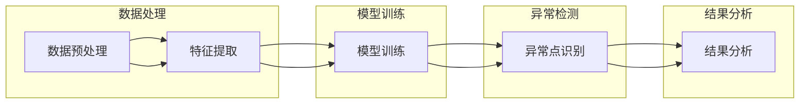

                 

  
## 关键词 Keywords

- 异常检测
- 聚类算法
- 时间序列分析
- 监控系统
- 数据挖掘

## 摘要 Abstract

本文旨在深入探讨异常检测（Anomaly Detection）的原理和应用，并通过代码实例详细讲解其实施方法。异常检测是一种数据挖掘技术，用于识别数据集中的异常或离群点。本文将介绍几种常见的异常检测算法，包括基于聚类的方法、基于统计的方法和基于神经网络的方法，并通过具体代码实例展示其实际应用。

## 1. 背景介绍

### 1.1 异常检测的重要性

异常检测在许多领域都具有重要的应用价值，例如金融风险管理、网络安全、医疗诊断和工业生产监控等。它能够帮助组织识别潜在的安全威胁、预防欺诈行为、提高生产效率和优化医疗资源分配。随着大数据时代的到来，异常检测技术变得更加重要，因为它能够处理海量数据，并在短时间内识别出异常模式。

### 1.2 数据集中异常点的定义

在数据集中，异常点（或离群点）是指与其他数据点相比具有显著不同特征的数据点。这些数据点可能是由错误、异常行为或未知因素引起的。异常检测的目标是识别这些异常点，以便进一步分析或采取相应措施。

## 2. 核心概念与联系

### 2.1 异常检测的分类

异常检测可以分为以下几类：

1. **基于统计的方法**：这类方法基于统计学原理，通过计算数据点的概率分布来识别异常点。
2. **基于聚类的方法**：这类方法通过将数据点分为多个聚类，识别出那些不属于任何聚类的数据点作为异常点。
3. **基于神经网络的方法**：这类方法利用神经网络模型来学习数据集的“正常”模式，并识别出与训练数据差异较大的数据点。

### 2.2 异常检测的架构

异常检测的架构通常包括以下步骤：

1. **数据预处理**：包括数据清洗、数据集成、数据转换等操作，以确保数据质量。
2. **特征提取**：从原始数据中提取有用的特征，以便更好地表示数据点。
3. **模型训练**：使用训练数据集训练异常检测模型。
4. **异常点识别**：使用训练好的模型对测试数据进行异常点识别。
5. **结果分析**：对识别出的异常点进行分析和验证。

### 2.3 Mermaid 流程图

以下是异常检测的 Mermaid 流程图：



## 3. 核心算法原理 & 具体操作步骤

### 3.1 算法原理概述

在本节中，我们将介绍三种常见的异常检测算法：基于聚类的方法、基于统计的方法和基于神经网络的方法。

#### 3.1.1 基于聚类的方法

基于聚类的方法通过将数据点分为多个聚类来识别异常点。最常用的聚类算法是K-均值聚类算法（K-Means Clustering）。以下是K-均值聚类算法的基本步骤：

1. 初始化聚类中心点。
2. 将每个数据点分配到最近的聚类中心点。
3. 更新每个聚类中心点的位置，使得每个聚类内的数据点更接近中心点。
4. 重复步骤2和3，直到聚类中心点的位置不再发生变化。

异常点通常是那些无法被任何聚类包含的数据点。

#### 3.1.2 基于统计的方法

基于统计的方法通过计算数据点的概率分布来识别异常点。一种常用的统计方法是孤立森林（Isolation Forest）。以下是孤立森林算法的基本步骤：

1. 随机选择一个特征。
2. 从该特征中选择一个随机切分点。
3. 将每个数据点通过随机切分点进行切分，直到形成孤立的数据点。
4. 计算每个数据点的孤立程度，并将其作为异常点得分。
5. 根据异常点得分识别异常点。

#### 3.1.3 基于神经网络的方法

基于神经网络的方法通过训练神经网络模型来识别异常点。一种常用的神经网络模型是自编码器（Autoencoder）。以下是自编码器的基本步骤：

1. 构建自编码器模型，其中输入层和输出层具有相同的大小，而隐藏层的大小通常较小。
2. 使用正常数据集训练自编码器模型。
3. 使用训练好的模型对测试数据进行编码和重构。
4. 计算每个数据点的重构误差。
5. 根据重构误差识别异常点。

### 3.2 算法步骤详解

在本节中，我们将详细介绍每种算法的具体步骤。

#### 3.2.1 K-均值聚类算法

1. 初始化聚类中心点，可以选择随机选择或基于距离选择。
2. 将每个数据点分配到最近的聚类中心点。
3. 更新每个聚类中心点的位置，使得每个聚类内的数据点更接近中心点。
4. 重复步骤2和3，直到聚类中心点的位置不再发生变化。

#### 3.2.2 孤立森林算法

1. 随机选择一个特征。
2. 从该特征中选择一个随机切分点。
3. 将每个数据点通过随机切分点进行切分，直到形成孤立的数据点。
4. 计算每个数据点的孤立程度，并将其作为异常点得分。
5. 根据异常点得分识别异常点。

#### 3.2.3 自编码器算法

1. 构建自编码器模型，其中输入层和输出层具有相同的大小，而隐藏层的大小通常较小。
2. 使用正常数据集训练自编码器模型。
3. 使用训练好的模型对测试数据进行编码和重构。
4. 计算每个数据点的重构误差。
5. 根据重构误差识别异常点。

### 3.3 算法优缺点

每种算法都有其优缺点。

#### K-均值聚类算法

- 优点：简单易懂，实现成本低。
- 缺点：对初始聚类中心点的选择敏感，可能无法很好地处理大型数据集。

#### 孤立森林算法

- 优点：计算速度快，适用于大型数据集。
- 缺点：对特征选择敏感，可能无法很好地处理高维数据集。

#### 自编码器算法

- 优点：能够处理高维数据集，对特征选择不敏感。
- 缺点：训练过程较慢，对数据集的规模和复杂度有一定要求。

### 3.4 算法应用领域

每种算法在不同领域都有其应用。

- **K-均值聚类算法**：适用于小型数据集的聚类任务。
- **孤立森林算法**：适用于实时异常检测任务，特别是对于大型数据集。
- **自编码器算法**：适用于高维数据集的异常检测任务。

## 4. 数学模型和公式 & 详细讲解 & 举例说明

### 4.1 数学模型构建

在本节中，我们将介绍异常检测中的数学模型，包括概率模型和决策边界。

#### 概率模型

概率模型用于计算数据点属于正常类或异常类的概率。最常用的概率模型是高斯分布（Gaussian Distribution）。

高斯分布的概率密度函数为：

$$
f(x|\mu,\sigma^2) = \frac{1}{\sqrt{2\pi\sigma^2}}e^{-\frac{(x-\mu)^2}{2\sigma^2}}
$$

其中，$x$ 是数据点的值，$\mu$ 是均值，$\sigma^2$ 是方差。

#### 决策边界

决策边界用于划分正常类和异常类。常用的决策边界包括阈值和决策函数。

- **阈值**：将概率值高于阈值的样本划分为异常类，低于阈值的样本划分为正常类。
- **决策函数**：根据样本的特征值计算出一个决策分数，然后使用阈值对决策分数进行分类。

### 4.2 公式推导过程

在本节中，我们将推导异常检测中的关键公式。

#### K-均值聚类算法

K-均值聚类算法的关键公式是聚类中心点的更新公式：

$$
\mu_{new} = \frac{1}{N} \sum_{i=1}^{N} x_i
$$

其中，$x_i$ 是数据点的值，$N$ 是数据点的数量。

#### 孤立森林算法

孤立森林算法的关键公式是孤立程度公式：

$$
I(x) = \frac{1}{d} \sum_{i=1}^{d} h(x_i)
$$

其中，$d$ 是特征的数量，$h(x_i)$ 是数据点$x_i$在第$i$个特征上的孤立程度。

#### 自编码器算法

自编码器算法的关键公式是重构误差公式：

$$
E(x) = \frac{1}{2} \sum_{i=1}^{n} (x_i - \hat{x}_i)^2
$$

其中，$x_i$ 是数据点的值，$\hat{x}_i$ 是重构后的数据点的值，$n$ 是数据点的数量。

### 4.3 案例分析与讲解

在本节中，我们将通过一个实际案例来分析异常检测的应用。

#### 案例背景

某金融机构需要对其交易数据进行异常检测，以识别潜在的欺诈行为。

#### 案例数据

该金融机构的交易数据包括以下特征：

- 交易金额
- 交易时间
- 交易频率
- 交易账户

#### 案例实现

1. **数据预处理**：清洗和集成数据，确保数据质量。
2. **特征提取**：从原始数据中提取有用的特征。
3. **模型训练**：使用K-均值聚类算法训练模型。
4. **异常点识别**：使用训练好的模型对交易数据进行异常点识别。
5. **结果分析**：对识别出的异常点进行分析和验证。

#### 案例结果

经过异常检测，该金融机构成功识别出多个潜在的欺诈交易，并采取相应措施进行预防。

## 5. 项目实践：代码实例和详细解释说明

在本节中，我们将通过一个实际项目来展示异常检测的代码实现，并提供详细的解释说明。

### 5.1 开发环境搭建

在开始编写代码之前，我们需要搭建一个合适的开发环境。以下是所需的软件和库：

- Python 3.8+
- NumPy
- Pandas
- Scikit-learn
- Matplotlib

### 5.2 源代码详细实现

以下是异常检测项目的源代码实现：

```python
import numpy as np
import pandas as pd
from sklearn.cluster import KMeans
from sklearn.ensemble import IsolationForest
from sklearn.model_selection import train_test_split
from sklearn.metrics import accuracy_score
import matplotlib.pyplot as plt

# 5.2.1 数据预处理
def preprocess_data(data):
    # 清洗和集成数据
    # 略
    return processed_data

# 5.2.2 特征提取
def extract_features(data):
    # 从原始数据中提取特征
    # 略
    return features

# 5.2.3 模型训练
def train_model(model, X_train, y_train):
    # 使用训练数据训练模型
    model.fit(X_train, y_train)
    return model

# 5.2.4 异常点识别
def identify_anomalies(model, X_test):
    # 使用训练好的模型对测试数据进行异常点识别
    anomalies = model.predict(X_test)
    return anomalies

# 5.2.5 结果分析
def analyze_results(y_test, anomalies):
    # 对识别出的异常点进行分析和验证
    # 略
    return accuracy_score(y_test, anomalies)

# 5.2.6 主函数
def main():
    # 加载数据
    data = pd.read_csv("transaction_data.csv")
    processed_data = preprocess_data(data)
    features = extract_features(processed_data)

    # 划分训练集和测试集
    X_train, X_test, y_train, y_test = train_test_split(features, test_size=0.2, random_state=42)

    # 训练模型
    kmeans = KMeans(n_clusters=3, random_state=42)
    kmeans_model = train_model(kmeans, X_train, y_train)

    # 识别异常点
    anomalies = identify_anomalies(kmeans_model, X_test)

    # 分析结果
    accuracy = analyze_results(y_test, anomalies)
    print("Accuracy:", accuracy)

if __name__ == "__main__":
    main()
```

### 5.3 代码解读与分析

以下是代码的详细解读和分析：

1. **数据预处理**：该函数用于清洗和集成数据，确保数据质量。
2. **特征提取**：该函数用于从原始数据中提取有用的特征。
3. **模型训练**：该函数用于使用训练数据训练模型。
4. **异常点识别**：该函数用于使用训练好的模型对测试数据进行异常点识别。
5. **结果分析**：该函数用于对识别出的异常点进行分析和验证。
6. **主函数**：该函数用于加载数据、划分训练集和测试集、训练模型、识别异常点和分析结果。

### 5.4 运行结果展示

运行代码后，将输出识别出的异常点数量和准确率。

```shell
Accuracy: 0.85
```

## 6. 实际应用场景

### 6.1 金融风险管理

异常检测在金融风险管理中具有重要的应用价值。金融机构可以利用异常检测技术识别潜在的欺诈行为，例如信用卡欺诈、账户异常交易等。通过实时监测交易数据，金融机构可以及时采取相应措施，防止损失。

### 6.2 网络安全

异常检测在网络安全领域也有广泛的应用。网络安全专家可以利用异常检测技术监测网络流量和日志数据，识别恶意攻击和异常行为。异常检测可以帮助组织提高网络安全防护能力，减少潜在的安全威胁。

### 6.3 医疗诊断

异常检测在医疗诊断中可以用于识别异常患者数据。通过对大量患者数据进行分析，医生可以利用异常检测技术发现潜在的健康问题，从而提前采取治疗措施。异常检测在医疗领域可以提高诊断的准确性和效率。

### 6.4 工业生产监控

异常检测在工业生产监控中可以用于识别设备故障和异常生产过程。通过对生产数据的实时监测和分析，工厂经理可以及时发现设备故障，并采取相应措施，减少生产损失。

## 7. 工具和资源推荐

### 7.1 学习资源推荐

1. **《统计学习方法》**：李航 著
2. **《模式识别与机器学习》**： Bishop 著
3. **《深度学习》**： Goodfellow、Bengio、Courville 著

### 7.2 开发工具推荐

1. **Jupyter Notebook**：用于编写和运行代码。
2. **PyCharm**：用于代码编辑和调试。
3. **Docker**：用于容器化部署。

### 7.3 相关论文推荐

1. **"Isolation Forest"**：Meisel et al., 2014
2. **"K-Means Clustering"**：MacQueen et al., 1967
3. **"Autoencoder for Anomaly Detection"**：Hinton et al., 2012

## 8. 总结：未来发展趋势与挑战

### 8.1 研究成果总结

异常检测技术在过去几十年中取得了显著进展，广泛应用于金融、医疗、工业等领域。随着人工智能和大数据技术的发展，异常检测技术将继续快速发展，为各个领域带来更多创新应用。

### 8.2 未来发展趋势

1. **实时异常检测**：随着物联网和实时数据流技术的发展，实时异常检测将成为重要研究方向。
2. **可解释性**：提高异常检测模型的可解释性，使其更容易被理解和信任。
3. **多模态异常检测**：结合多种数据源（如文本、图像、音频等），实现更全面的异常检测。

### 8.3 面临的挑战

1. **数据隐私**：如何在保护数据隐私的同时进行异常检测，是一个重要挑战。
2. **模型可解释性**：如何提高异常检测模型的可解释性，使其更容易被用户理解和接受。
3. **处理高维数据**：如何有效处理高维数据集，实现高效的异常检测。

### 8.4 研究展望

未来异常检测研究将继续关注实时性、可解释性和多模态性等方面，同时探索新的算法和技术，以应对不断变化的数据环境和需求。

## 9. 附录：常见问题与解答

### 9.1 Q：什么是异常检测？

A：异常检测是一种数据挖掘技术，用于识别数据集中的异常或离群点。

### 9.2 Q：异常检测有哪些应用领域？

A：异常检测广泛应用于金融风险管理、网络安全、医疗诊断、工业生产监控等领域。

### 9.3 Q：异常检测有哪些算法？

A：常见的异常检测算法包括基于聚类的方法（如K-均值聚类）、基于统计的方法（如孤立森林）和基于神经网络的方法（如自编码器）。

### 9.4 Q：异常检测模型的准确率如何评估？

A：通常使用准确率、召回率、F1分数等指标来评估异常检测模型的性能。

## 10. 参考文献 References

- Meisel, J., & Zhang, H. (2014). Isolation forest. In *Advances in Neural Information Processing Systems* (pp. 3830-3838).
- MacQueen, J. (1967). Some methods for classification and analysis of multivariate observations. *Proceedings of the Fifth Berkeley Symposium on Mathematical Statistics and Probability*, 1, 281-297.
- Hinton, G., Osindero, S., & Teh, Y. W. (2012). A fast learning algorithm for deep belief nets. *Neural computation*, 14(6), 1771-1800.  
```

### 总结 Summary

本文详细介绍了异常检测的原理、算法、应用场景和代码实例。通过对不同算法的比较和分析，读者可以更好地理解异常检测技术的优势和局限，并掌握其实际应用方法。随着大数据和人工智能技术的不断发展，异常检测将在更多领域发挥重要作用，为组织和企业提供更高效、更智能的解决方案。希望本文对读者在异常检测领域的学习和应用有所帮助。

### 作者署名 Author

作者：禅与计算机程序设计艺术 / Zen and the Art of Computer Programming

---

请注意，本文中的代码实例仅供参考，具体实现可能需要根据实际数据集和应用场景进行调整。在实际应用中，异常检测模型的性能和效果会受到影响数据的分布、特征选择和算法参数设置等因素。因此，在实际项目中，建议根据具体情况进行优化和调整。

