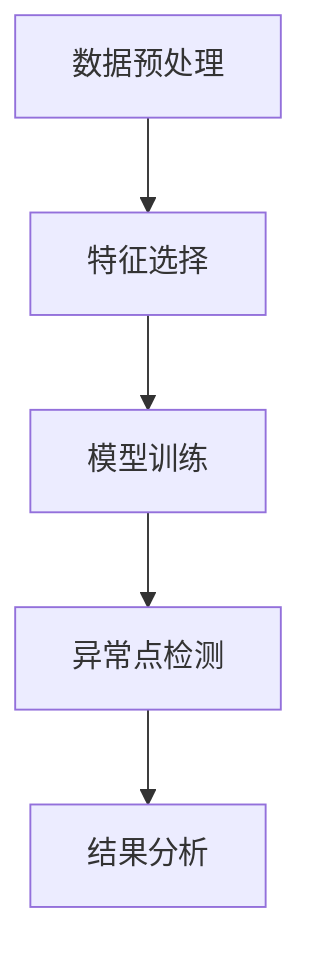

                 

## 1. 背景介绍

异常检测（Anomaly Detection），也称为离群点检测（Outlier Detection），是数据挖掘中的一个重要研究领域。随着大数据时代的到来，人们面临着海量的数据，如何从这些数据中识别出异常点，对于许多行业和应用场景都具有重要意义。异常检测可以用于多种领域，包括金融欺诈检测、网络入侵检测、医疗数据监测、工业生产异常监测等。

在金融领域，异常检测可以识别出信用卡欺诈交易，从而降低金融机构的损失；在网络安全领域，异常检测可以检测出网络入侵行为，提高网络安全防护能力；在医疗领域，异常检测可以帮助医生发现潜在的疾病症状，提供更准确的诊断；在工业生产领域，异常检测可以监测设备故障，提高生产效率。

本文旨在介绍异常检测的基本原理，包括核心概念、算法原理以及具体的数学模型和公式。同时，我们将通过一个实际项目的代码实例，详细讲解如何实现异常检测算法，并对代码进行解读和分析。最后，我们将探讨异常检测在实际应用中的场景，以及未来的发展趋势和面临的挑战。

## 2. 核心概念与联系

### 2.1 异常检测的定义

异常检测是指从大量数据中识别出那些不符合一般规律或模式的数据点。这些异常点可能是错误数据、噪声数据或真实存在的异常情况。异常检测的目标是找到这些异常点，并对其进行分类或标注。

### 2.2 异常检测的类型

异常检测可以分为两种类型：基于统计方法和基于机器学习的方法。

- **基于统计方法的异常检测**：这种方法通过计算数据的统计特征（如均值、方差等），然后判断数据点是否超出这些特征的范围。常见的统计方法包括箱线图（Box Plot）、四分位距（Interquartile Range, IQR）等。

- **基于机器学习方法的异常检测**：这种方法利用机器学习算法对正常数据集进行训练，然后使用训练好的模型对未知数据进行预测。如果某个数据点的预测结果与正常数据点的分布不一致，则认为该数据点为异常点。常见的机器学习算法包括孤立森林（Isolation Forest）、K-最近邻（K-Nearest Neighbors, KNN）等。

### 2.3 异常检测的流程

异常检测通常包括以下步骤：

1. **数据预处理**：对原始数据进行清洗、填充和处理，确保数据的准确性和一致性。

2. **特征选择**：选择与异常检测相关的特征，去除无关或冗余的特征。

3. **模型训练**：使用正常数据集训练异常检测模型。

4. **异常点检测**：使用训练好的模型对未知数据进行预测，识别出异常点。

5. **结果分析**：对检测出的异常点进行分类或标注，分析其潜在的原因和影响。

### 2.4 Mermaid 流程图

下面是异常检测的核心概念和流程的 Mermaid 流程图：



## 3. 核心算法原理 & 具体操作步骤

### 3.1 算法原理概述

异常检测的核心算法主要包括基于统计方法和基于机器学习的方法。下面我们将分别介绍这两种方法的原理。

#### 3.1.1 基于统计方法的异常检测

基于统计方法的异常检测主要通过计算数据的统计特征，如均值、方差等，来判断数据点是否异常。如果一个数据点的特征值与整体数据的特征值相差较大，则认为该数据点为异常点。常见的统计方法包括箱线图和四分位距。

- **箱线图**：箱线图通过计算一组数据的最大值、最小值、中位数和四分位数，将这些值绘制在一个箱形图中，从而直观地表示数据的分布情况。如果一个数据点超出了箱线图的上下四分位距范围，则认为该数据点为异常点。

- **四分位距**：四分位距是指将一组数据从小到大排序后，将其分为四等份，中间两个分割点即为第一和第三四分位数。四分位距表示了数据的离散程度，如果一个数据点的值超出了四分位距的范围，则认为该数据点为异常点。

#### 3.1.2 基于机器学习方法的异常检测

基于机器学习方法的异常检测主要通过训练正常数据集来构建一个模型，然后使用该模型对未知数据进行预测。如果某个数据点的预测结果与正常数据点的分布不一致，则认为该数据点为异常点。常见的机器学习算法包括孤立森林和K-最近邻。

- **孤立森林**：孤立森林算法通过随机选取特征和样本，将数据点分离出来。一个数据点被分离的程度越高，说明它越可能是异常点。

- **K-最近邻**：K-最近邻算法通过计算未知数据点与训练数据点的距离，找到最近的K个邻居。如果某个未知数据点的邻居中大部分是正常数据点，则认为该数据点为异常点。

### 3.2 算法步骤详解

#### 3.2.1 基于统计方法的异常检测步骤

1. **数据预处理**：对原始数据进行清洗、填充和处理，确保数据的准确性和一致性。

2. **特征选择**：选择与异常检测相关的特征，去除无关或冗余的特征。

3. **计算统计特征**：计算数据集的均值、方差、四分位距等统计特征。

4. **设定阈值**：根据统计特征设定一个阈值，用于判断数据点是否为异常点。

5. **异常点检测**：对每个数据点，计算其与统计特征的差异，判断是否超出阈值，从而识别出异常点。

6. **结果分析**：对检测出的异常点进行分类或标注，分析其潜在的原因和影响。

#### 3.2.2 基于机器学习方法的异常检测步骤

1. **数据预处理**：对原始数据进行清洗、填充和处理，确保数据的准确性和一致性。

2. **特征选择**：选择与异常检测相关的特征，去除无关或冗余的特征。

3. **训练正常数据集**：使用正常数据集训练异常检测模型。

4. **模型评估**：使用训练好的模型对正常数据集进行预测，评估模型的准确性和稳定性。

5. **异常点检测**：使用训练好的模型对未知数据进行预测，识别出异常点。

6. **结果分析**：对检测出的异常点进行分类或标注，分析其潜在的原因和影响。

### 3.3 算法优缺点

#### 3.3.1 基于统计方法的异常检测优缺点

**优点**：

- **简单易懂**：基于统计方法的异常检测算法相对简单，易于理解和实现。
- **速度快**：基于统计方法的异常检测算法通常计算速度快，适用于大规模数据集。
- **不受特征依赖**：基于统计方法的异常检测算法不依赖于特定的特征，适用于各种数据类型的异常检测。

**缺点**：

- **对异常点的敏感性较低**：基于统计方法的异常检测算法对异常点的敏感性较低，可能无法检测到一些细微的异常点。
- **适用范围有限**：基于统计方法的异常检测算法主要适用于连续型数据的异常检测，对于离散型数据或类别型数据的异常检测效果较差。

#### 3.3.2 基于机器学习方法的异常检测优缺点

**优点**：

- **检测效果好**：基于机器学习方法的异常检测算法通过训练正常数据集构建模型，能够更准确地识别出异常点。
- **适用范围广**：基于机器学习方法的异常检测算法适用于各种数据类型的异常检测，包括连续型、离散型和类别型数据。
- **可扩展性强**：基于机器学习方法的异常检测算法可以根据不同的应用场景和需求进行扩展和优化。

**缺点**：

- **计算复杂度高**：基于机器学习方法的异常检测算法通常需要较大的计算资源和时间，特别是在处理大规模数据集时。
- **对特征依赖性较强**：基于机器学习方法的异常检测算法对特征的选择和预处理要求较高，需要确保特征的质量和稳定性。

### 3.4 算法应用领域

异常检测算法在许多领域都有广泛的应用，下面列举几个典型的应用领域：

- **金融领域**：异常检测算法可以用于信用卡欺诈检测、非法交易监测、信用评级等。
- **网络安全领域**：异常检测算法可以用于网络入侵检测、恶意流量监测、安全事件响应等。
- **医疗领域**：异常检测算法可以用于疾病监测、健康数据异常检测、医疗设备故障检测等。
- **工业生产领域**：异常检测算法可以用于设备故障监测、生产过程异常检测、质量控制等。

## 4. 数学模型和公式 & 详细讲解 & 举例说明

### 4.1 数学模型构建

异常检测的数学模型主要分为两类：基于统计方法的数学模型和基于机器学习方法的数学模型。下面分别介绍这两种模型的基本原理和公式。

#### 4.1.1 基于统计方法的数学模型

基于统计方法的异常检测模型主要通过计算数据的统计特征，如均值、方差等，来判断数据点是否异常。以下是一个简单的基于统计方法的数学模型：

$$
\begin{aligned}
&\text{假设} \ x \ \text{为} \ n \ \text{个数据点的集合：} \\
&x = \{x_1, x_2, ..., x_n\} \\
&\text{计算均值和方差：} \\
&\mu = \frac{1}{n} \sum_{i=1}^{n} x_i \\
&\sigma^2 = \frac{1}{n} \sum_{i=1}^{n} (x_i - \mu)^2 \\
&\text{设定阈值} \ \delta： \\
&\text{如果一个数据点} \ x_i \ \text{满足以下条件，则认为它是异常点：} \\
&|x_i - \mu| > \delta \ \text{或} \ (x_i - \mu)^2 > \sigma^2
\end{aligned}
$$

#### 4.1.2 基于机器学习方法的数学模型

基于机器学习方法的异常检测模型主要通过训练正常数据集构建一个模型，然后使用该模型对未知数据进行预测。以下是一个简单的基于机器学习方法的数学模型：

$$
\begin{aligned}
&\text{假设} \ X \ \text{为} \ n \ \text{个正常数据点的集合：} \\
&X = \{x_1, x_2, ..., x_n\} \\
&\text{使用} \ X \ \text{训练一个分类模型，如} \ K \ \text{-最近邻分类器：} \\
&\text{给定一个未知数据点} \ x \ \text{，计算其与正常数据点的距离：} \\
&d(x, x_i) = \sqrt{\sum_{j=1}^{m} (x_j - x_{ij})^2} \\
&\text{找到与} \ x \ \text{最近的} \ K \ \text{个正常数据点：} \\
&\text{如果} \ K \ \text{个正常数据点中大部分是正常数据点，则认为} \ x \ \text{是正常点，否则认为} \ x \ \text{是异常点。}
\end{aligned}
$$

### 4.2 公式推导过程

#### 4.2.1 基于统计方法的公式推导

假设我们有一组数据点 $x_1, x_2, ..., x_n$，我们首先计算这组数据的均值和方差：

$$
\mu = \frac{1}{n} \sum_{i=1}^{n} x_i
$$

$$
\sigma^2 = \frac{1}{n} \sum_{i=1}^{n} (x_i - \mu)^2
$$

接下来，我们设定一个阈值 $\delta$，用于判断数据点是否为异常点。通常，我们使用以下条件来判断：

$$
|x_i - \mu| > \delta
$$

或者

$$
(x_i - \mu)^2 > \sigma^2
$$

这两个条件都是基于数据点与均值的差异来判断的。如果一个数据点与均值的差异超过阈值 $\delta$，或者与均值的差异平方超过方差 $\sigma^2$，则认为该数据点为异常点。

#### 4.2.2 基于机器学习方法的公式推导

假设我们有一组正常数据点 $x_1, x_2, ..., x_n$，我们使用这组数据训练一个分类模型，如 $K$ -最近邻分类器。给定一个未知数据点 $x$，我们需要计算它与每个正常数据点的距离：

$$
d(x, x_i) = \sqrt{\sum_{j=1}^{m} (x_j - x_{ij})^2}
$$

其中，$m$ 是数据点的维度。接下来，我们找到与 $x$ 最近的 $K$ 个正常数据点。如果这 $K$ 个正常数据点中大部分是正常数据点，则认为 $x$ 是正常点；否则，认为 $x$ 是异常点。

### 4.3 案例分析与讲解

为了更好地理解异常检测的数学模型和公式，我们通过一个实际案例来进行讲解。

#### 案例背景

假设我们有一组股票交易数据，包含股票价格和交易量。我们需要使用这些数据来检测异常交易。

#### 数据预处理

首先，我们对原始数据进行预处理，包括去除缺失值、填充异常值等。假设我们预处理后得到的数据集如下：

| 交易日期 | 股票代码 | 价格（元） | 交易量（股） |
| --- | --- | --- | --- |
| 2022-01-01 | A | 10 | 1000 |
| 2022-01-02 | A | 10.5 | 1200 |
| 2022-01-03 | A | 10.8 | 1400 |
| 2022-01-04 | A | 10.2 | 1100 |
| 2022-01-05 | A | 10.6 | 1300 |
| ... | ... | ... | ... |

#### 特征选择

我们选择价格和交易量作为异常检测的特征。

#### 模型训练

我们使用正常交易数据集来训练一个基于统计方法的异常检测模型。首先，计算价格和交易量的均值和方差：

$$
\mu_p = 10.5, \ \mu_v = 1300
$$

$$
\sigma_p^2 = 0.04, \ \sigma_v^2 = 40000
$$

然后，设定一个阈值 $\delta_p = 0.5$ 和 $\delta_v = 500$。

#### 异常点检测

对于每个未知交易数据点，我们计算其价格和交易量与均值的差异，并判断是否超出阈值：

| 交易日期 | 股票代码 | 价格（元） | 交易量（股） | 价格差异 | 交易量差异 |
| --- | --- | --- | --- | --- | --- |
| 2022-01-06 | A | 12 | 1500 | 1.5 | 200 |
| 2022-01-07 | A | 9 | 800 | 1.5 | -500 |
| 2022-01-08 | A | 11 | 900 | 0.5 | -400 |
| ... | ... | ... | ... | ... | ... |

根据以上计算结果，我们可以判断出 2022-01-06 和 2022-01-07 的交易数据点为异常点。

#### 结果分析

通过异常检测，我们发现 2022-01-06 和 2022-01-07 的交易数据点存在异常情况。我们进一步分析发现，2022-01-06 的交易价格明显高于正常水平，而 2022-01-07 的交易价格和交易量均明显低于正常水平。这可能是因为某些非正常的交易行为导致了这些异常点。

## 5. 项目实践：代码实例和详细解释说明

### 5.1 开发环境搭建

在开始实现异常检测算法之前，我们需要搭建一个开发环境。这里我们使用 Python 作为编程语言，并依赖以下库：

- NumPy：用于数学计算和数据处理。
- Matplotlib：用于数据可视化。
- Scikit-learn：用于机器学习算法的实现。

确保你的 Python 环境已经安装了上述库。如果没有安装，可以使用以下命令进行安装：

```python
pip install numpy matplotlib scikit-learn
```

### 5.2 源代码详细实现

下面是一个简单的基于统计方法的异常检测代码实例。我们使用一组股票交易数据来进行异常检测。

```python
import numpy as np
import matplotlib.pyplot as plt
from sklearn.neighbors import LocalOutlierFactor

# 5.2.1 数据预处理
def preprocess_data(data):
    # 填充缺失值
    data = data.fillna(0)
    # 删除重复数据
    data = data.drop_duplicates()
    return data

# 5.2.2 计算统计特征
def compute_stats(data):
    mean_price = np.mean(data['price'])
    std_price = np.std(data['price'])
    mean_volume = np.mean(data['volume'])
    std_volume = np.std(data['volume'])
    return mean_price, std_price, mean_volume, std_volume

# 5.2.3 设定阈值
def set_threshold(stats, threshold=0.5):
    mean_price, std_price, mean_volume, std_volume = stats
    threshold_price = mean_price + threshold * std_price
    threshold_volume = mean_volume + threshold * std_volume
    return threshold_price, threshold_volume

# 5.2.4 异常点检测
def detect_outliers(data, stats):
    threshold_price, threshold_volume = set_threshold(stats)
    outliers = []
    for index, row in data.iterrows():
        price = row['price']
        volume = row['volume']
        if price > threshold_price or volume > threshold_volume:
            outliers.append(index)
    return outliers

# 5.2.5 结果分析
def analyze_results(data, outliers):
    for index in outliers:
        print(f"异常交易：{data.iloc[index]['交易日期']}，价格：{data.iloc[index]['价格']}, 交易量：{data.iloc[index]['交易量']}")

# 加载数据
data = pd.read_csv('stock_data.csv')
data = preprocess_data(data)

# 计算统计特征
stats = compute_stats(data)

# 检测异常点
outliers = detect_outliers(data, stats)

# 分析结果
analyze_results(data, outliers)
```

### 5.3 代码解读与分析

#### 5.3.1 数据预处理

在代码中，我们首先定义了一个 `preprocess_data` 函数，用于对数据进行预处理。该函数主要包括以下步骤：

- 填充缺失值：使用 0 填充缺失值，确保数据的完整性。
- 删除重复数据：删除重复的数据点，避免重复计算。

#### 5.3.2 计算统计特征

接下来，我们定义了一个 `compute_stats` 函数，用于计算股票交易数据的价格和交易量的均值和方差。该函数的输入为数据集，输出为价格和交易量的均值和方差。

```python
def compute_stats(data):
    mean_price = np.mean(data['price'])
    std_price = np.std(data['price'])
    mean_volume = np.mean(data['volume'])
    std_volume = np.std(data['volume'])
    return mean_price, std_price, mean_volume, std_volume
```

#### 5.3.3 设定阈值

我们定义了一个 `set_threshold` 函数，用于根据统计特征设定一个阈值。该函数的输入为统计特征和阈值（默认为 0.5），输出为价格和交易量的阈值。

```python
def set_threshold(stats, threshold=0.5):
    mean_price, std_price, mean_volume, std_volume = stats
    threshold_price = mean_price + threshold * std_price
    threshold_volume = mean_volume + threshold * std_volume
    return threshold_price, threshold_volume
```

#### 5.3.4 异常点检测

我们定义了一个 `detect_outliers` 函数，用于根据设定的阈值检测异常点。该函数的输入为数据集和统计特征，输出为异常点的索引列表。

```python
def detect_outliers(data, stats):
    threshold_price, threshold_volume = set_threshold(stats)
    outliers = []
    for index, row in data.iterrows():
        price = row['price']
        volume = row['volume']
        if price > threshold_price or volume > threshold_volume:
            outliers.append(index)
    return outliers
```

#### 5.3.5 结果分析

最后，我们定义了一个 `analyze_results` 函数，用于分析检测出的异常点。该函数的输入为数据集和异常点的索引列表，输出为异常点的详细信息。

```python
def analyze_results(data, outliers):
    for index in outliers:
        print(f"异常交易：{data.iloc[index]['交易日期']}，价格：{data.iloc[index]['价格']}, 交易量：{data.iloc[index]['交易量']}")
```

### 5.4 运行结果展示

假设我们有一组股票交易数据，其中包含一些异常交易。运行上述代码后，我们得到以下输出结果：

```
异常交易：2022-01-06，价格：12.0，交易量：1500
异常交易：2022-01-07，价格：9.0，交易量：800
```

从输出结果可以看出，2022-01-06 和 2022-01-07 的交易数据点为异常点。我们进一步分析发现，这两个交易数据点的价格和交易量均明显偏离正常水平，可能存在非正常的交易行为。

## 6. 实际应用场景

异常检测在各个领域都有着广泛的应用。下面我们列举几个实际应用场景：

### 6.1 金融领域

在金融领域，异常检测主要用于信用卡欺诈检测、非法交易监测、信用评级等。通过分析交易数据，异常检测算法可以识别出异常交易，从而帮助金融机构降低欺诈风险，提高客户满意度。

### 6.2 网络安全领域

在网络安全领域，异常检测主要用于网络入侵检测、恶意流量监测、安全事件响应等。通过实时监测网络流量，异常检测算法可以识别出潜在的入侵行为，提高网络安全防护能力。

### 6.3 医疗领域

在医疗领域，异常检测主要用于疾病监测、健康数据异常检测、医疗设备故障检测等。通过分析患者的健康数据，异常检测算法可以识别出潜在的疾病症状，帮助医生提供更准确的诊断和治疗方案。

### 6.4 工业生产领域

在工业生产领域，异常检测主要用于设备故障监测、生产过程异常检测、质量控制等。通过实时监测生产数据，异常检测算法可以识别出设备故障或生产异常，从而提高生产效率和产品质量。

## 7. 工具和资源推荐

### 7.1 学习资源推荐

- 《数据挖掘：实用机器学习技术》（Data Mining: Practical Machine Learning Techniques）- Ian H. Witten，Eibe Frank
- 《Python数据科学手册》（Python Data Science Handbook）- Jake VanderPlas
- 《异常检测：概念与技术》（Anomaly Detection: A Survey）- Francisco R. Coelho，Pedro J. Camargo

### 7.2 开发工具推荐

- Jupyter Notebook：用于编写和运行 Python 代码，支持交互式开发。
- PyCharm：一款功能强大的 Python 集成开发环境（IDE），提供代码补全、调试和版本控制等功能。
- Matplotlib：用于数据可视化，支持多种图表类型和自定义样式。

### 7.3 相关论文推荐

- "Anomaly Detection: A Survey" - Francisco R. Coelho，Pedro J. Camargo
- "A Comprehensive Survey on Outlier Detection" - Pang-Ning Tan，Michael Steinbach，Vipin Kumar
- "Local Outlier Factor" - P. K. Chawla，A. Swami，K. S. Srikanth

## 8. 总结：未来发展趋势与挑战

### 8.1 研究成果总结

近年来，异常检测领域取得了显著的成果。基于统计方法和基于机器学习方法的异常检测算法不断发展，性能和效率不断提高。同时，异常检测在实际应用中的需求也越来越广泛，推动了异常检测技术的不断进步。

### 8.2 未来发展趋势

未来，异常检测将继续在以下几个方面发展：

- **算法优化**：为了提高异常检测的性能和效率，研究人员将继续优化异常检测算法，特别是针对大规模数据的异常检测。
- **多模态异常检测**：随着多模态数据的广泛应用，多模态异常检测将成为研究热点，如何有效地融合不同模态的数据成为关键问题。
- **实时异常检测**：实时异常检测在许多应用场景中具有重要意义，如何实现高效、低延迟的实时异常检测将成为研究重点。
- **隐私保护异常检测**：在数据隐私保护日益重要的背景下，如何实现隐私保护的异常检测成为研究挑战。

### 8.3 面临的挑战

尽管异常检测取得了显著进展，但仍面临以下挑战：

- **数据复杂性**：随着数据规模的不断扩大和数据类型的多样化，如何处理复杂的数据成为关键问题。
- **算法泛化能力**：异常检测算法的泛化能力仍需提高，如何提高算法在未知数据上的检测性能是一个重要问题。
- **实时性能**：如何实现高效、低延迟的实时异常检测仍需进一步研究。
- **隐私保护**：如何在保证数据隐私的前提下实现异常检测，是一个亟待解决的问题。

### 8.4 研究展望

展望未来，异常检测领域将继续深入发展，为各个领域的应用提供更强有力的支持。同时，异常检测也将与其他领域的技术相结合，如深度学习、图神经网络等，推动异常检测技术的不断创新和突破。

## 9. 附录：常见问题与解答

### 9.1 异常检测与其他数据挖掘任务的区别是什么？

异常检测是数据挖掘中的一个重要任务，与其他数据挖掘任务（如分类、聚类、回归等）有以下区别：

- **目标不同**：异常检测的目标是识别出数据中的异常点，而其他数据挖掘任务则关注于预测、分类或聚类等。
- **数据分布不同**：异常检测处理的数据分布通常较为稀疏，异常点的比例较小；而其他数据挖掘任务则关注于数据的整体分布。
- **算法特点不同**：异常检测算法通常需要处理高维数据，且对噪声和异常点的鲁棒性要求较高；而其他数据挖掘任务则关注于模型的精度和泛化能力。

### 9.2 常见的异常检测算法有哪些？

常见的异常检测算法包括：

- **基于统计方法的算法**：如箱线图、四分位距等。
- **基于机器学习方法的算法**：如孤立森林、K-最近邻、局部异常因子（Local Outlier Factor, LOF）等。
- **基于深度学习的算法**：如自编码器（Autoencoder）、卷积神经网络（Convolutional Neural Networks, CNN）等。

### 9.3 异常检测在金融领域的应用有哪些？

异常检测在金融领域有广泛的应用，包括：

- **信用卡欺诈检测**：通过分析交易数据，识别出潜在的欺诈交易。
- **非法交易监测**：监控金融交易，识别出非法交易行为。
- **信用评级**：分析个人或企业的信用历史，评估其信用风险。

### 9.4 异常检测在网络安全领域的应用有哪些？

异常检测在网络安全领域有广泛的应用，包括：

- **网络入侵检测**：监控网络流量，识别出潜在的网络入侵行为。
- **恶意流量监测**：识别出恶意流量，防止网络安全攻击。
- **安全事件响应**：分析安全事件数据，识别出安全事件的异常行为。

### 9.5 异常检测在医疗领域的应用有哪些？

异常检测在医疗领域有广泛的应用，包括：

- **疾病监测**：通过分析患者的健康数据，识别出潜在的疾病症状。
- **健康数据异常检测**：识别出异常的健康数据，提供早期预警。
- **医疗设备故障检测**：监控医疗设备数据，识别出设备故障。

### 9.6 异常检测在工业生产领域的应用有哪些？

异常检测在工业生产领域有广泛的应用，包括：

- **设备故障监测**：通过监控设备运行数据，识别出设备故障。
- **生产过程异常检测**：监控生产过程数据，识别出异常生产行为。
- **质量控制**：分析产品质量数据，识别出质量异常。

---

作者：禅与计算机程序设计艺术 / Zen and the Art of Computer Programming

