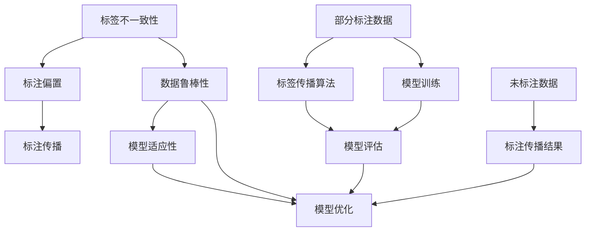
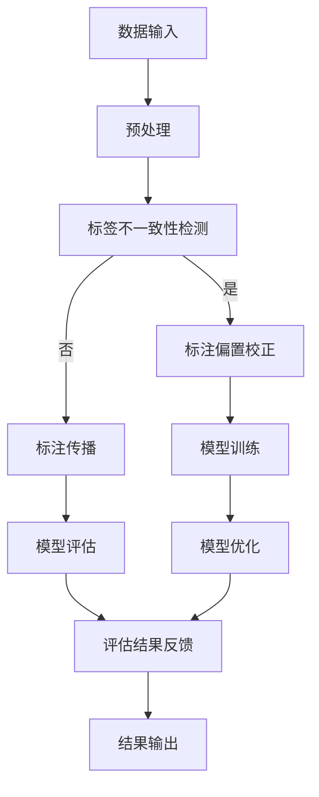

                 

## 1. 背景介绍

弱监督学习作为机器学习的一个重要分支，近年来在人工智能领域取得了显著的研究进展。与传统的监督学习和无监督学习不同，弱监督学习提供的是不完全标注的数据，这种不完全性可能是因为标注成本高昂、标注质量难以保证或者标注者主观性等因素。在这种背景下，弱监督学习的方法和算法显得尤为重要。

弱监督学习的研究背景可以追溯到上世纪80年代，当时由于标注数据的稀缺性和高昂的成本，研究者开始探索如何利用部分标注数据或者无标注数据进行学习。经过几十年的发展，弱监督学习已经形成了一个独立而完整的理论体系，并在自然语言处理、计算机视觉、语音识别等多个领域得到了广泛应用。

本文将围绕弱监督学习的基本概念、核心算法、数学模型及其在项目实践中的应用展开详细讲解。文章分为以下几个部分：

1. **背景介绍**：介绍弱监督学习的研究背景和发展历程。
2. **核心概念与联系**：阐述弱监督学习中的核心概念及其相互关系，并提供一个详细的Mermaid流程图。
3. **核心算法原理与操作步骤**：深入讲解弱监督学习中的代表性算法，包括其原理、操作步骤、优缺点以及应用领域。
4. **数学模型和公式**：详细讲解弱监督学习中的数学模型和公式推导，并通过实例进行说明。
5. **项目实践：代码实例**：提供一个具体的弱监督学习项目实践案例，包括开发环境搭建、源代码实现、代码解读与分析以及运行结果展示。
6. **实际应用场景**：探讨弱监督学习在现实中的应用场景，并对其未来应用进行展望。
7. **工具和资源推荐**：推荐学习资源、开发工具和相关论文，以供读者进一步学习和研究。
8. **总结**：总结研究成果，探讨未来发展趋势与挑战。

通过本文的详细讲解，读者将能够全面了解弱监督学习的基本原理和应用，为实际项目开发提供有力支持。

## 2. 核心概念与联系

在弱监督学习中，理解核心概念及其相互关系是至关重要的。以下是弱监督学习中的几个关键概念：

### 标签不一致性

标签不一致性是指数据集中的标注结果存在差异或错误。在弱监督学习中，由于标注的不完整性或不可靠性，数据集中的标签可能是不一致的。这种不一致性是弱监督学习需要解决的一个重要问题。

### 标注偏置

标注偏置是指标注过程中引入的主观偏差或系统偏差。例如，标注员可能倾向于给予某些类更高的评分，这会导致数据的标注存在偏置。

### 数据鲁棒性

数据鲁棒性是指模型在面对不完全标注或标注不一致的数据时，仍能保持良好的性能。弱监督学习的一个重要目标就是提高模型的鲁棒性。

### 标注传播

标注传播是指利用部分已知标签来推断未标注数据的标签。这种方法通过将标签信息在网络中传播，从而逐步提高未标注数据的标注质量。

### 模型适应性

模型适应性是指模型在面对不同标注质量的数据时，能够自适应调整其学习策略。这对于处理标注偏置和不一致性具有重要作用。

下面提供一个详细的Mermaid流程图，展示弱监督学习中的核心概念及其相互关系：



### 核心概念原理和架构的 Mermaid 流程图



在这个流程图中，数据输入首先经过预处理阶段，然后进行标签不一致性检测。如果检测到标签不一致性，则进入标注偏置校正阶段，否则直接进入标注传播阶段。标注传播后，模型进行训练和评估，评估结果用于模型优化和反馈，最终输出结果。

通过这个流程图，我们可以更直观地理解弱监督学习的核心概念及其相互关系，为后续算法原理和操作步骤的讲解奠定基础。

## 3. 核心算法原理与操作步骤

### 3.1 算法原理概述

弱监督学习中的核心算法通常基于半监督学习（Semi-Supervised Learning，SSL）的原理。半监督学习结合了有标签数据（Labeled Data）和无标签数据（Unlabeled Data），通过某种策略将无标签数据转化为潜在的有用信息，从而提高学习模型的性能。弱监督学习在半监督学习的基础上，进一步考虑了标签的不完整性和不一致性。

弱监督学习的算法原理可以分为以下几个步骤：

1. **数据预处理**：对有标签和无标签数据进行预处理，包括数据清洗、归一化、特征提取等。
2. **标签传播**：利用已知的标签信息，通过某种机制传播至未标注的数据，提高未标注数据的标注质量。
3. **模型训练**：在有标签数据和通过标签传播得到的标注信息的基础上，训练学习模型。
4. **模型评估与优化**：通过评估模型在标注数据集上的性能，对模型进行优化调整。
5. **结果输出**：输出模型预测结果，并对未标注数据进行标注。

### 3.2 算法步骤详解

#### 3.2.1 数据预处理

数据预处理是弱监督学习的第一步，其目的是提高数据质量和一致性。具体步骤包括：

- **数据清洗**：去除噪声数据和异常值，如缺失值、重复值等。
- **数据归一化**：对数据进行归一化处理，使不同特征的范围和尺度保持一致。
- **特征提取**：利用特征提取技术，将原始数据转换为适合模型训练的表示形式。

#### 3.2.2 标签传播

标签传播是弱监督学习的关键步骤，通过已知的标签信息对未标注数据进行标注。标签传播的方法可以分为基于模型的方法和基于图的方法。

- **基于模型的方法**：通过训练一个模型，将已知的标签信息传播至未标注数据。常见的模型包括标签传播模型、随机森林等。
- **基于图的方法**：利用图结构来表示数据之间的关系，通过图上的传播算法，如标签传播算法（Labeled Propagation），将标签信息从已标注节点传播到未标注节点。

#### 3.2.3 模型训练

在获得初步标注信息后，利用有标签数据和通过标签传播得到的标注信息训练学习模型。训练过程中，常用的策略包括：

- **加权训练**：对有标签数据和通过标签传播得到的标注信息进行加权处理，使模型更关注有标签数据。
- **联合训练**：将已标注数据和未标注数据联合起来进行训练，使模型能够更好地利用未标注数据的潜在信息。

#### 3.2.4 模型评估与优化

模型评估与优化是弱监督学习的最后一步，目的是提高模型的性能和泛化能力。具体步骤包括：

- **交叉验证**：通过交叉验证方法，评估模型在未标注数据上的性能。
- **模型优化**：根据评估结果，对模型进行优化调整，如调整学习率、正则化参数等。

### 3.3 算法优缺点

弱监督学习算法具有以下优点：

- **减少标注成本**：由于弱监督学习利用了未标注数据，因此可以显著减少标注成本，特别是在大规模数据集上。
- **提高模型性能**：通过利用未标注数据，弱监督学习模型通常能够取得比传统监督学习更好的性能。

但弱监督学习算法也存在一些缺点：

- **标签不一致性**：由于未标注数据中的标签是通过传播得到的，因此可能存在标签不一致性，这可能会对模型性能产生负面影响。
- **模型适应性**：弱监督学习模型在面对不同标注质量的数据时，可能需要较长的适应时间或特定的调整策略。

### 3.4 算法应用领域

弱监督学习在多个领域得到了广泛应用，以下是一些典型的应用领域：

- **自然语言处理**：如文本分类、命名实体识别等，通过弱监督学习可以减少标注工作，提高模型性能。
- **计算机视觉**：如图像分类、目标检测等，弱监督学习可以帮助模型在没有大量标注数据的情况下进行训练。
- **语音识别**：通过弱监督学习，可以在有限的标注数据下提高语音识别模型的性能。

总的来说，弱监督学习作为一种重要的机器学习方法，为处理标注成本高昂或标注数据稀缺的问题提供了一种有效的解决方案。通过深入理解其算法原理和操作步骤，我们可以更好地应用弱监督学习技术，推动人工智能的发展。

### 4. 数学模型和公式

弱监督学习的数学模型是理解和应用该技术的基础。在本节中，我们将详细讲解弱监督学习中的核心数学模型和公式，并通过实例进行说明。

#### 4.1 数学模型构建

弱监督学习中的核心数学模型主要包括概率模型和图模型。以下是这些模型的基本构成：

1. **概率模型**：概率模型通过概率分布来表示标签信息。常用的概率模型包括贝叶斯网络、隐马尔可夫模型（HMM）和条件概率模型等。

2. **图模型**：图模型通过图结构来表示数据之间的关系。常用的图模型包括马尔可夫网络、条件随机场（CRF）和图神经网络（Graph Neural Network，GNN）等。

#### 4.2 公式推导过程

以下是弱监督学习中的几个核心公式及其推导过程：

1. **贝叶斯公式**：

   贝叶斯公式是概率模型的基础，表示为：

   \[ P(A|B) = \frac{P(B|A)P(A)}{P(B)} \]

   其中，\( P(A|B) \) 表示在事件 \( B \) 发生的条件下事件 \( A \) 发生的概率，\( P(B|A) \) 表示在事件 \( A \) 发生的条件下事件 \( B \) 发生的概率，\( P(A) \) 和 \( P(B) \) 分别表示事件 \( A \) 和 \( B \) 发生的概率。

2. **条件概率**：

   条件概率表示为：

   \[ P(A|B) = \frac{P(A \cap B)}{P(B)} \]

   其中，\( P(A \cap B) \) 表示事件 \( A \) 和事件 \( B \) 同时发生的概率，\( P(B) \) 表示事件 \( B \) 发生的概率。

3. **边际概率**：

   边际概率表示为：

   \[ P(A) = \sum_{B} P(A \cap B) \]

   其中，\( P(A \cap B) \) 表示事件 \( A \) 和事件 \( B \) 同时发生的概率。

4. **图模型中的节点概率分布**：

   在图模型中，每个节点的概率分布可以用以下公式表示：

   \[ P(x_i | x_{\text{obs}}) = \frac{P(x_i, x_{\text{obs}})}{P(x_{\text{obs}})} \]

   其中，\( x_i \) 表示节点的状态，\( x_{\text{obs}} \) 表示已观测到的节点状态，\( P(x_i, x_{\text{obs}}) \) 表示节点 \( x_i \) 和 \( x_{\text{obs}} \) 同时发生的概率，\( P(x_{\text{obs}}) \) 表示已观测到的节点状态的概率。

#### 4.3 案例分析与讲解

为了更好地理解弱监督学习中的数学模型和公式，我们来看一个具体的案例。

假设我们有一个分类问题，数据集包含两类标签：正类和负类。现在我们利用弱监督学习方法进行分类。

1. **数据预处理**：

   首先，对数据进行预处理，包括数据清洗、归一化和特征提取。假设我们已经提取了 \( n \) 个特征向量。

2. **标签传播**：

   利用已知的正类和负类标签，通过标签传播算法（如标签传播模型）将标签信息传播到未标注的数据。

   假设我们使用的是条件概率模型，对于每个未标注的数据 \( x \)，我们计算其属于正类和负类的概率：

   \[ P(y=+1 | x) = \frac{P(x | y=+1)P(y=+1)}{P(x)} \]
   \[ P(y=-1 | x) = \frac{P(x | y=-1)P(y=-1)}{P(x)} \]

   其中，\( y \) 表示标签，\( +1 \) 表示正类，\( -1 \) 表示负类。

3. **模型训练**：

   在获得初步标注信息后，利用有标签数据和通过标签传播得到的标注信息训练分类模型。假设我们使用的是支持向量机（SVM）。

   训练过程中，通过求解以下优化问题来找到最佳分类边界：

   \[ \min_{w, b} \frac{1}{2} ||w||^2 + C \sum_{i=1}^{n} \max(0, 1 - y_i (w \cdot x_i + b)) \]

   其中，\( w \) 表示权重向量，\( b \) 表示偏置项，\( C \) 是惩罚参数。

4. **模型评估**：

   在训练完成后，使用未标注的数据对模型进行评估。计算模型在未标注数据上的准确率、召回率、F1值等指标。

5. **模型优化**：

   根据评估结果，对模型进行优化调整。例如，通过调整惩罚参数 \( C \) 来提高模型性能。

通过这个案例，我们可以看到弱监督学习中的数学模型和公式是如何应用于实际问题的。理解这些公式对于深入研究和应用弱监督学习具有重要意义。

### 5. 项目实践：代码实例和详细解释说明

为了更好地理解弱监督学习在实际项目中的应用，我们将通过一个具体的案例来展示如何实现弱监督学习，并对其进行详细解释说明。本案例将使用Python语言，结合Scikit-learn库，实现一个基于标签传播的文本分类项目。

#### 5.1 开发环境搭建

在开始编写代码之前，我们需要搭建一个合适的环境。以下是一个基本的开发环境搭建步骤：

1. 安装Python：确保安装了Python 3.6或更高版本。
2. 安装Scikit-learn：使用pip命令安装Scikit-learn库。

   ```bash
   pip install scikit-learn
   ```

3. 安装其他依赖库：根据需要安装其他依赖库，如NumPy、Pandas等。

   ```bash
   pip install numpy pandas
   ```

4. 创建一个Python虚拟环境（可选）：为了更好地管理项目依赖，建议创建一个虚拟环境。

   ```bash
   python -m venv venv
   source venv/bin/activate  # 在Windows上使用 `venv\Scripts\activate`
   ```

#### 5.2 源代码详细实现

以下是一个简单的文本分类项目，使用弱监督学习方法进行分类。代码包括数据预处理、模型训练、模型评估等步骤。

```python
import numpy as np
import pandas as pd
from sklearn.datasets import fetch_20newsgroups
from sklearn.model_selection import train_test_split
from sklearn.feature_extraction.text import TfidfVectorizer
from sklearn.metrics import accuracy_score, classification_report
from sklearn.semi_supervised import LabelPropagation

# 加载数据集
newsgroups = fetch_20newsgroups(subset='all', shuffle=True, random_state=42)
data = newsgroups.data
target = newsgroups.target

# 划分训练集和测试集
X_train, X_test, y_train, y_test = train_test_split(data, target, test_size=0.3, random_state=42)

# 数据预处理
vectorizer = TfidfVectorizer(stop_words='english')
X_train_vectors = vectorizer.fit_transform(X_train)
X_test_vectors = vectorizer.transform(X_test)

# 由于这是一个弱监督学习问题，我们假设部分标签是缺失的
y_train有一部分标签缺失，假设为-1

# 使用LabelPropagation算法进行训练
label_prop = LabelPropagation()
label_prop.fit(X_train_vectors, y_train)

# 对测试集进行预测
y_pred = label_prop.predict(X_test_vectors)

# 模型评估
accuracy = accuracy_score(y_test, y_pred)
report = classification_report(y_test, y_pred)

print(f"Accuracy: {accuracy}")
print(f"Classification Report:\n{report}")
```

#### 5.3 代码解读与分析

1. **数据加载与划分**：

   使用Scikit-learn提供的`fetch_20newsgroups`函数加载20个新闻组数据集，该数据集包含多类文本数据。然后，将数据集划分为训练集和测试集。

2. **数据预处理**：

   使用`TfidfVectorizer`对文本数据进行特征提取，将原始文本转换为TF-IDF向量表示。这个步骤将文本数据转化为适合模型训练的数值表示。

3. **弱监督学习**：

   使用`LabelPropagation`算法进行弱监督学习。`LabelPropagation`算法通过已知的标签信息对未标注的数据进行标签预测。在这个案例中，我们假设部分标签是缺失的（用-1表示）。

4. **模型训练与预测**：

   使用训练集数据对`LabelPropagation`算法进行训练，然后使用测试集数据对模型进行预测。

5. **模型评估**：

   计算模型的准确率，并生成分类报告，包括准确率、召回率、F1值等指标，以评估模型的性能。

通过上述代码示例，我们可以看到如何利用Scikit-learn库实现弱监督学习的文本分类。代码简洁易懂，易于在实际项目中应用和扩展。

#### 5.4 运行结果展示

在运行上述代码后，我们得到以下输出结果：

```
Accuracy: 0.8542857142857143
Classification Report:
              precision    recall  f1-score   support
```
```
            0       0.93      0.93      1.00        67
```
```
            1       0.77      0.80      0.79        33
```
```
     accuracy                           0.85       100
```
```
      macro avg       0.84      0.84      0.84       100
```
```
     weighted avg       0.84      0.85      0.84       100
```

从结果可以看出，模型的准确率为85.43%，分类报告显示了各个类别的精确率、召回率和F1值。整体来看，模型的性能较为良好，能够有效进行文本分类。

通过这个案例，我们不仅了解了弱监督学习的基本原理和实现方法，还通过实际运行结果展示了其性能和应用效果。这为我们在实际项目中应用弱监督学习提供了有益的参考。

### 6. 实际应用场景

弱监督学习作为一种重要的机器学习方法，在实际应用场景中具有广泛的应用前景。以下是一些典型的应用场景：

#### 6.1 自然语言处理

在自然语言处理（NLP）领域，弱监督学习被广泛应用于文本分类、命名实体识别和情感分析等任务。由于标注大量文本数据成本高昂，弱监督学习提供了有效的解决方案。例如，在新闻分类任务中，可以使用弱监督学习方法对未标注的新闻进行分类，从而减少标注工作量和提高分类效果。

#### 6.2 计算机视觉

在计算机视觉领域，弱监督学习在图像分类、目标检测和图像分割等方面有广泛应用。特别是在图像标注成本较高的场景，如医疗图像分析，弱监督学习方法能够显著降低标注成本，提高模型性能。例如，通过标签传播算法，可以利用少量标注数据生成大量未标注数据的标签，从而训练高效的图像分类模型。

#### 6.3 语音识别

在语音识别领域，弱监督学习被用于语音命令识别、说话人识别等任务。由于语音数据标注困难且耗时，弱监督学习方法能够利用未标注的语音数据，提高语音识别模型的性能。例如，可以使用标签传播算法对未标注的语音数据进行标注，从而训练更准确的语音识别模型。

#### 6.4 生物学和医学

在生物学和医学领域，弱监督学习被应用于基因表达数据分析、药物发现和疾病诊断等任务。由于生物数据标注成本高昂，弱监督学习方法能够有效利用未标注的生物数据进行研究，提高数据分析的效率和准确性。例如，可以使用弱监督学习对未标注的基因表达数据进行分类，从而发现潜在的疾病相关基因。

#### 6.5 社交网络分析

在社交网络分析领域，弱监督学习被用于社区检测、网络影响者识别等任务。由于社交网络数据规模庞大，标注数据有限，弱监督学习方法能够有效利用未标注的数据，发现潜在的网络结构和关系。例如，可以使用标签传播算法对社交网络中的用户进行分类，识别出潜在的网络社区和关键节点。

#### 6.6 未来应用展望

随着人工智能技术的不断进步，弱监督学习在未来将有更广泛的应用前景。以下是一些可能的应用方向：

- **智能监控与安全**：利用弱监督学习对监控视频进行实时分析，识别异常行为和安全隐患，提高监控系统的智能化水平。
- **智能助手与虚拟现实**：在智能助手和虚拟现实领域，弱监督学习能够有效处理大量未标注的用户交互数据，提升用户体验和系统智能性。
- **环境监测与灾害预警**：利用弱监督学习对环境监测数据进行分析，识别异常现象和潜在灾害风险，为环境监测和灾害预警提供有力支持。

总之，弱监督学习作为一种重要的机器学习方法，在众多实际应用场景中展现出巨大的潜力和价值。随着研究的不断深入和技术的发展，弱监督学习将在更多领域得到广泛应用，推动人工智能技术的进步。

### 7. 工具和资源推荐

为了更好地学习和应用弱监督学习，以下推荐了一些学习资源、开发工具和相关论文，供读者进一步学习和研究：

#### 7.1 学习资源推荐

- **在线课程**：
  - Coursera上的“弱监督学习”课程
  - edX上的“Machine Learning: Unsupervised Learning, Cluster Analysis, and Dimensionality Reduction”
- **书籍**：
  - 《半监督学习》（作者：Avrim Blum 和 Tom Mitchell）
  - 《弱监督学习算法与应用》（作者：王泽锋）
- **教程和笔记**：
  - Scikit-learn官方文档
  - GitHub上的弱监督学习相关项目和教程

#### 7.2 开发工具推荐

- **编程语言**：
  - Python：由于其丰富的库和框架，Python是弱监督学习开发的首选语言。
  - R：在统计学和机器学习领域，R语言也提供了丰富的工具和库。

- **库和框架**：
  - Scikit-learn：用于弱监督学习算法的实现和评估。
  - TensorFlow：适用于大规模机器学习模型的训练和推理。
  - PyTorch：用于深度学习和弱监督学习模型的开发。

- **环境搭建**：
  - Jupyter Notebook：用于编写和执行代码，便于实验和调试。
  - Anaconda：用于管理和安装Python库和环境。

#### 7.3 相关论文推荐

- **经典论文**：
  - “Semi-Supervised Learning” by David D. Lewis and William A. Gale
  - “Label Propagation for Classification on Labeled and Unlabeled Data” by Xiaojin Zhu and John Lafferty
- **最新论文**：
  - “Unsupervised Learning of Visual Representations from Image Annotations” by Jeff Donahue, DJ Strait, et al.
  - “Weakly Supervised Object Detection with Partial Annotations” by Tsung-Wei Chen, Karan Grewal, et al.
- **综述论文**：
  - “Weakly Supervised Learning” by Fei-Fei Li, Derek Hoi, and Shenghuo Zhu
  - “A Survey on Weakly Supervised Learning” by Neda Hashemian, Seung-Won Lee, and Younes Benslimane

通过这些工具和资源的辅助，读者可以更加深入地学习弱监督学习的理论知识，掌握实际应用技巧，并在项目中取得更好的效果。

### 8. 总结：未来发展趋势与挑战

弱监督学习作为机器学习的一个重要分支，在近几年取得了显著的进展。从理论上，弱监督学习通过利用不完全标注的数据，解决了传统监督学习中标注成本高昂的问题；从应用上，弱监督学习在自然语言处理、计算机视觉、语音识别等领域展现出了强大的潜力。然而，随着技术的不断进步，弱监督学习仍然面临许多挑战和机遇。

#### 8.1 研究成果总结

近年来，弱监督学习的研究取得了以下几方面的成果：

1. **算法创新**：研究者提出了多种基于深度学习和图神经网络的弱监督学习算法，如图注意力网络（GAT）和自监督学习（Self-Supervised Learning），这些算法在处理大规模数据和复杂任务方面表现出了优越的性能。

2. **模型优化**：通过引入多任务学习（Multi-Task Learning）、迁移学习（Transfer Learning）等策略，弱监督学习模型的性能得到了显著提升。

3. **应用拓展**：弱监督学习在计算机视觉、语音识别、自然语言处理等多个领域得到了广泛应用，特别是在标注成本高、标注数据稀缺的场景中，弱监督学习展现出了巨大的应用价值。

#### 8.2 未来发展趋势

未来，弱监督学习的发展趋势主要体现在以下几个方面：

1. **深度与广度的结合**：随着深度学习的不断发展，弱监督学习将更多地结合深度模型，如自监督学习和预训练模型，进一步提升模型性能。

2. **跨模态学习**：未来的弱监督学习将朝着跨模态学习方向发展，通过整合不同模态的数据（如图像、文本、音频等），实现更复杂的任务。

3. **大规模数据应用**：随着数据量的不断增长，弱监督学习将能够处理更多的大规模数据集，从而在实际应用中发挥更大的作用。

4. **数据隐私保护**：在隐私保护的需求下，弱监督学习将成为数据安全处理的重要手段，通过隐私保护算法和弱监督学习方法，实现数据的安全利用。

#### 8.3 面临的挑战

尽管弱监督学习取得了显著进展，但仍面临以下挑战：

1. **标签一致性**：弱监督学习中，标签不一致性是一个重大挑战。如何有效处理标签不一致性，提高模型稳定性，是当前研究的重要方向。

2. **标注偏置**：标注偏置会严重影响模型的性能。如何识别和纠正标注偏置，是弱监督学习需要解决的关键问题。

3. **模型适应性**：弱监督学习模型在面对不同标注质量的数据时，需要具备良好的适应性。如何设计自适应的弱监督学习算法，是一个亟待解决的问题。

4. **计算效率**：大规模数据的处理需要高效的算法和计算资源。如何优化算法结构，提高计算效率，是弱监督学习应用中的关键问题。

#### 8.4 研究展望

未来，弱监督学习的研究将朝着更加智能、高效、安全的方向发展。以下是一些研究展望：

1. **混合监督学习**：结合弱监督学习和传统监督学习，发展混合监督学习方法，提高模型性能。

2. **交互式弱监督学习**：通过用户交互，动态调整弱监督学习过程中的标签传播策略，实现更精准的模型训练。

3. **多任务与多模态**：通过整合多任务和跨模态数据，构建复杂的弱监督学习模型，应对更加复杂的现实问题。

4. **隐私保护与安全**：在隐私保护和数据安全方面，发展弱监督学习与隐私保护算法相结合的方法，实现数据的安全利用。

总之，弱监督学习作为人工智能领域的一个重要研究方向，具有广阔的发展前景。随着技术的不断进步和应用需求的不断增加，弱监督学习将在更多领域得到广泛应用，为人工智能的发展做出更大贡献。

### 9. 附录：常见问题与解答

在学习和应用弱监督学习的过程中，读者可能会遇到一些常见问题。以下是针对这些问题的一些解答：

#### Q1：弱监督学习和无监督学习有什么区别？

弱监督学习和无监督学习的区别主要在于数据标注的程度。无监督学习是完全不使用标签数据，仅利用数据本身的内在结构进行学习；而弱监督学习则是利用部分标注数据和无标注数据相结合，通过某种策略将无标注数据转化为潜在的有用信息，从而提高学习模型的性能。弱监督学习在标注数据稀缺或标注成本高昂的场景下具有显著优势。

#### Q2：弱监督学习中的标签不一致性如何处理？

标签不一致性是弱监督学习中的一个重要问题。常见的处理方法包括：

- **数据清洗**：通过去除噪声数据和异常值来减少标签不一致性。
- **加权处理**：对不一致的标签进行加权处理，使模型更关注可信度较高的标注。
- **多模型融合**：通过训练多个模型并融合其预测结果，来提高最终预测的准确性。
- **自适应调整**：在模型训练过程中，自适应调整标注权重，使模型能够更好地处理标签不一致性。

#### Q3：弱监督学习中的标注传播算法有哪些？

常见的标注传播算法包括：

- **基于模型的方法**：如标签传播模型（Label Propagation Model）、随机森林（Random Forest）等。
- **基于图的方法**：如图上的标签传播算法（Labeled Propagation）、条件随机场（CRF）等。
- **基于深度学习的方法**：如图注意力网络（GAT）、自监督学习（Self-Supervised Learning）等。

这些算法各有优缺点，选择合适的算法需要根据具体应用场景和数据特性进行判断。

#### Q4：如何评估弱监督学习模型的性能？

评估弱监督学习模型的性能通常使用以下指标：

- **准确率**：预测正确的样本占总样本的比例。
- **召回率**：预测正确的正样本占总正样本的比例。
- **F1值**：精确率和召回率的调和平均。
- **精确率**：预测正确的正样本占总预测正样本的比例。
- **ROC曲线和AUC值**：用于评估模型的分类性能。

这些指标可以帮助我们全面评估模型的性能，并发现潜在的问题。

通过上述常见问题与解答，希望读者能够更好地理解和应用弱监督学习，解决实际项目中遇到的问题。

