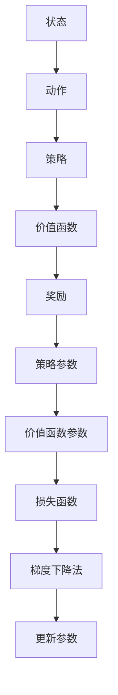

                 

关键词：强化学习，梯度下降法，机器学习，优化，算法，应用领域，数学模型，案例分析与讲解

摘要：本文将深入探讨强化学习（Reinforcement Learning，RL）领域中梯度下降法（Gradient Descent）的应用与优化。首先，我们将回顾强化学习的基本概念，并简要介绍梯度下降法的基本原理。接着，本文将详细阐述梯度下降法在强化学习中的应用，包括其优势、挑战和优化策略。随后，我们将通过具体案例展示如何在实际项目中运用梯度下降法，并对代码实例进行详细解释。最后，我们将展望强化学习与梯度下降法的未来发展趋势，并探讨面临的挑战和研究方向。

## 1. 背景介绍

强化学习作为机器学习的一个重要分支，近年来受到了广泛的关注。它通过智能体与环境的交互，学习到最优策略，以实现特定目标。与监督学习和无监督学习不同，强化学习需要智能体在未知环境中通过试错（Trial-and-Error）进行学习。这种学习过程高度依赖于奖励机制，奖励信号引导智能体逐渐优化其行为策略，从而实现预期目标。

在强化学习中，梯度下降法是一种常用的优化方法。它通过计算损失函数关于参数的梯度，并沿着梯度方向调整参数，以最小化损失函数。梯度下降法广泛应用于各种机器学习算法中，如线性回归、逻辑回归等。在强化学习中，梯度下降法主要用于策略优化和价值函数的学习。通过不断迭代更新参数，智能体能够逐渐优化其策略，从而提高学习效果。

### 1.1 强化学习的基本概念

强化学习（Reinforcement Learning，RL）是机器学习的一个重要分支，旨在通过智能体（Agent）与环境的交互，学习到最优策略（Policy），以实现特定目标（Goal）。在强化学习中，智能体通过感知（Perception）环境状态（State），执行动作（Action），并从环境中获得奖励（Reward）。智能体的目标是最大化总奖励或实现特定任务目标。

**定义：** 强化学习是一个交互式的学习过程，其中智能体通过与环境的连续交互，学习到一个策略，使总奖励最大化。

**关键概念：**

- **智能体（Agent）**：执行动作并学习策略的实体。
- **环境（Environment）**：智能体交互的动态系统。
- **状态（State）**：描述环境的当前状态。
- **动作（Action）**：智能体可执行的动作。
- **策略（Policy）**：智能体执行的动作策略。
- **价值函数（Value Function）**：评估策略的预期奖励。
- **奖励（Reward）**：智能体执行动作后获得的即时奖励。

### 1.2 梯度下降法的基本原理

梯度下降法（Gradient Descent）是一种优化算法，用于最小化损失函数。其基本思想是计算损失函数关于参数的梯度，并沿着梯度的反方向调整参数，以减小损失函数值。梯度下降法包括以下步骤：

1. **初始化参数**：随机选择初始参数。
2. **计算损失函数**：计算当前参数下的损失函数值。
3. **计算梯度**：计算损失函数关于参数的梯度。
4. **更新参数**：沿着梯度的反方向调整参数。
5. **重复迭代**：重复步骤2-4，直到满足停止条件（如损失函数值收敛）。

**定义：** 梯度下降法是一种优化算法，通过计算损失函数关于参数的梯度，并沿着梯度的反方向更新参数，以最小化损失函数。

**关键概念：**

- **参数（Parameter）**：需要优化的变量。
- **损失函数（Loss Function）**：衡量预测值与实际值之间差异的函数。
- **梯度（Gradient）**：损失函数关于参数的偏导数。
- **步长（Step Size）**：参数更新的步长。

### 1.3 强化学习与梯度下降法的联系

强化学习中的策略优化和价值函数学习需要优化大量参数。梯度下降法作为一种优化算法，广泛应用于强化学习领域。强化学习与梯度下降法的联系主要体现在以下几个方面：

1. **策略优化**：在策略优化过程中，智能体通过梯度下降法更新策略参数，以实现预期目标。策略优化可以采用梯度下降法直接优化策略参数，也可以通过价值函数迭代优化策略参数。
2. **价值函数学习**：在价值函数学习中，智能体通过梯度下降法更新价值函数参数，以估计策略的预期奖励。价值函数学习可以采用基于梯度的方法，如梯度上升法或梯度下降法。
3. **损失函数设计**：在强化学习中，损失函数通常设计为评估策略的预期奖励与目标奖励之间的差距。梯度下降法通过最小化损失函数，优化策略参数，提高学习效果。

## 2. 核心概念与联系

在强化学习与梯度下降法的联系中，核心概念与联系至关重要。为了更好地理解这两者之间的关系，我们首先介绍强化学习中的基本概念，然后通过Mermaid流程图展示核心概念与联系。

### 2.1 强化学习中的基本概念

1. **状态（State）**：描述环境的当前状态。
2. **动作（Action）**：智能体可执行的动作。
3. **策略（Policy）**：智能体执行的动作策略。
4. **价值函数（Value Function）**：评估策略的预期奖励。
5. **奖励（Reward）**：智能体执行动作后获得的即时奖励。
6. **策略参数（Policy Parameter）**：策略模型的参数。
7. **价值函数参数（Value Function Parameter）**：价值函数模型的参数。

### 2.2 Mermaid流程图



### 2.3 核心概念与联系

在强化学习中，状态、动作、策略、价值函数和奖励是核心概念。梯度下降法通过最小化损失函数，优化策略参数和价值函数参数，从而实现策略优化和价值函数学习。具体来说：

1. **策略优化**：智能体通过梯度下降法更新策略参数，以实现预期目标。策略优化可以采用梯度下降法直接优化策略参数，也可以通过价值函数迭代优化策略参数。
2. **价值函数学习**：智能体通过梯度下降法更新价值函数参数，以估计策略的预期奖励。价值函数学习可以采用基于梯度的方法，如梯度上升法或梯度下降法。
3. **损失函数设计**：在强化学习中，损失函数通常设计为评估策略的预期奖励与目标奖励之间的差距。梯度下降法通过最小化损失函数，优化策略参数，提高学习效果。

通过以上核心概念与联系，我们可以更好地理解强化学习与梯度下降法之间的关系。接下来，我们将深入探讨梯度下降法在强化学习中的应用，分析其优势与挑战，并提出优化策略。

## 3. 核心算法原理 & 具体操作步骤

### 3.1 算法原理概述

梯度下降法是一种优化算法，用于最小化损失函数。在强化学习中，梯度下降法主要用于策略优化和价值函数学习。下面简要介绍梯度下降法的基本原理。

#### 3.1.1 梯度下降法的基本原理

梯度下降法的基本思想是计算损失函数关于参数的梯度，并沿着梯度的反方向调整参数，以减小损失函数值。具体步骤如下：

1. **初始化参数**：随机选择初始参数。
2. **计算损失函数**：计算当前参数下的损失函数值。
3. **计算梯度**：计算损失函数关于参数的梯度。
4. **更新参数**：沿着梯度的反方向调整参数。
5. **重复迭代**：重复步骤2-4，直到满足停止条件（如损失函数值收敛）。

#### 3.1.2 强化学习中的梯度下降法

在强化学习中，梯度下降法主要用于策略优化和价值函数学习。

1. **策略优化**：智能体通过梯度下降法更新策略参数，以实现预期目标。策略优化可以采用梯度下降法直接优化策略参数，也可以通过价值函数迭代优化策略参数。
2. **价值函数学习**：智能体通过梯度下降法更新价值函数参数，以估计策略的预期奖励。价值函数学习可以采用基于梯度的方法，如梯度上升法或梯度下降法。

### 3.2 算法步骤详解

#### 3.2.1 策略优化

策略优化是强化学习中的核心任务之一。下面介绍策略优化的具体步骤：

1. **初始化策略参数**：随机选择初始策略参数。
2. **执行动作**：根据当前策略参数，智能体执行动作。
3. **计算奖励**：根据执行的动作和环境的反馈，计算奖励信号。
4. **更新策略参数**：利用梯度下降法，计算策略参数的梯度，并沿着梯度的反方向更新策略参数。
5. **重复迭代**：重复步骤2-4，直到满足停止条件（如策略参数收敛）。

#### 3.2.2 价值函数学习

价值函数学习是另一个重要任务。下面介绍价值函数学习的具体步骤：

1. **初始化价值函数参数**：随机选择初始价值函数参数。
2. **执行动作**：根据当前策略参数，智能体执行动作。
3. **计算奖励**：根据执行的动作和环境的反馈，计算奖励信号。
4. **更新价值函数参数**：利用梯度下降法，计算价值函数参数的梯度，并沿着梯度的反方向更新价值函数参数。
5. **重复迭代**：重复步骤2-4，直到满足停止条件（如价值函数参数收敛）。

### 3.3 算法优缺点

#### 优点

1. **简单易实现**：梯度下降法具有简单的算法结构，易于实现和调试。
2. **广泛适用**：梯度下降法广泛应用于各种机器学习算法中，具有较强的通用性。
3. **可调节参数**：梯度下降法可以通过调节步长等参数，调整优化效果。

#### 缺点

1. **收敛速度慢**：梯度下降法可能需要较长时间才能收敛，尤其是在复杂环境中。
2. **敏感度问题**：梯度下降法对参数初始化敏感，可能导致局部最优解。
3. **复杂度问题**：梯度下降法在处理大规模数据集时，计算复杂度较高。

### 3.4 算法应用领域

梯度下降法在强化学习领域具有广泛的应用。下面列举几个典型的应用场景：

1. **游戏AI**：在游戏领域，梯度下降法可以用于训练智能体，实现自主游戏策略。
2. **自动驾驶**：在自动驾驶领域，梯度下降法可以用于优化智能体的行驶策略。
3. **机器人控制**：在机器人控制领域，梯度下降法可以用于优化机器人的动作策略。

通过以上介绍，我们可以更好地理解梯度下降法在强化学习中的应用原理和具体操作步骤。接下来，我们将通过具体案例展示如何在实际项目中运用梯度下降法，并对代码实例进行详细解释。

## 4. 数学模型和公式 & 详细讲解 & 举例说明

在强化学习中，梯度下降法需要依赖于数学模型和公式。本节将详细介绍强化学习中的数学模型，包括策略优化和价值函数学习中的相关公式，并通过具体例子进行说明。

### 4.1 数学模型构建

在强化学习中，我们通常需要构建以下数学模型：

1. **状态-动作价值函数（State-Action Value Function）**：表示在特定状态下执行特定动作的预期奖励。记为 \( Q(s, a) \)。
2. **状态价值函数（State Value Function）**：表示在特定状态下采取最优策略的预期奖励。记为 \( V(s) \)。
3. **策略（Policy）**：定义了在特定状态下应执行的动作。记为 \( \pi(a|s) \)。

#### 4.1.1 状态-动作价值函数

状态-动作价值函数 \( Q(s, a) \) 可以通过以下公式计算：

\[ Q(s, a) = \sum_{s'} P(s'|s, a) \sum_{a'} \pi(a'|s') R(s', a') + \gamma V(s') \]

其中：

- \( P(s'|s, a) \) 是从状态 \( s \) 执行动作 \( a \) 后转移到状态 \( s' \) 的概率。
- \( \pi(a'|s') \) 是在状态 \( s' \) 下执行动作 \( a' \) 的概率。
- \( R(s', a') \) 是在状态 \( s' \) 下执行动作 \( a' \) 后获得的即时奖励。
- \( \gamma \) 是折扣因子，表示未来奖励的折扣率。

#### 4.1.2 状态价值函数

状态价值函数 \( V(s) \) 可以通过以下公式计算：

\[ V(s) = \sum_{a} \pi(a|s) Q(s, a) \]

其中：

- \( \pi(a|s) \) 是在状态 \( s \) 下执行动作 \( a \) 的概率。
- \( Q(s, a) \) 是在状态 \( s \) 下执行动作 \( a \) 的预期奖励。

#### 4.1.3 策略

策略 \( \pi(a|s) \) 可以通过以下公式计算：

\[ \pi(a|s) = \frac{\exp(\theta_a)}{\sum_{a'} \exp(\theta_{a'})} \]

其中：

- \( \theta_a \) 是策略参数，表示在状态 \( s \) 下执行动作 \( a \) 的优势。

### 4.2 公式推导过程

#### 4.2.1 状态-动作价值函数

状态-动作价值函数 \( Q(s, a) \) 的推导基于马尔可夫决策过程（MDP）的期望回报。具体推导如下：

1. **定义预期回报**：在状态 \( s \) 下执行动作 \( a \) 的预期回报为：

   \[ R(s, a) = \sum_{s'} P(s'|s, a) R(s', a) \]

2. **定义状态-动作价值函数**：状态-动作价值函数 \( Q(s, a) \) 是预期回报加上未来预期回报的折扣：

   \[ Q(s, a) = R(s, a) + \gamma \sum_{s'} P(s'|s, a) \sum_{a'} \pi(a'|s') R(s', a') + \gamma V(s') \]

3. **简化公式**：由于 \( \pi(a'|s') \) 是在状态 \( s' \) 下执行动作 \( a' \) 的概率，我们可以将 \( Q(s, a) \) 进一步简化为：

   \[ Q(s, a) = \sum_{s'} P(s'|s, a) \sum_{a'} \pi(a'|s') R(s', a') + \gamma V(s') \]

#### 4.2.2 状态价值函数

状态价值函数 \( V(s) \) 的推导基于策略最优性。具体推导如下：

1. **定义策略最优性**：在状态 \( s \) 下，最优策略 \( \pi^*(s) \) 是使得 \( V(s) \) 最大化的策略。

2. **定义预期回报**：在状态 \( s \) 下，执行动作 \( a \) 的预期回报为：

   \[ R(s, a) = \sum_{s'} P(s'|s, a) R(s', a) \]

3. **定义状态价值函数**：状态价值函数 \( V(s) \) 是策略最优的预期回报：

   \[ V(s) = \sum_{a} \pi^*(s) Q(s, a) \]

4. **简化公式**：由于 \( \pi^*(s) \) 是最优策略，我们可以将 \( V(s) \) 简化为：

   \[ V(s) = \sum_{a} \pi^*(s) Q(s, a) \]

#### 4.2.3 策略

策略 \( \pi(a|s) \) 的推导基于策略梯度上升法。具体推导如下：

1. **定义策略优势**：在状态 \( s \) 下，动作 \( a \) 的优势为：

   \[ \theta_a = Q(s, a) - V(s) \]

2. **定义策略梯度**：策略梯度为：

   \[ \nabla_{\theta} \log \pi(a|s) = \frac{\partial}{\partial \theta_a} \log \pi(a|s) = \frac{\pi(a|s)}{\sum_{a'} \pi(a'|s)} \]

3. **定义策略更新**：利用策略梯度上升法，策略更新为：

   \[ \theta_a \leftarrow \theta_a + \alpha \theta_a \]

   其中，\( \alpha \) 是学习率。

4. **简化公式**：由于 \( \theta_a \) 是策略优势，我们可以将策略更新简化为：

   \[ \theta_a \leftarrow \theta_a + \alpha (Q(s, a) - V(s)) \]

### 4.3 案例分析与讲解

为了更好地理解上述数学模型和公式的应用，我们通过一个简单的案例进行讲解。

#### 案例背景

假设我们有一个简单的环境，包含两个状态 \( s_1 \) 和 \( s_2 \)，以及两个动作 \( a_1 \) 和 \( a_2 \)。环境中的奖励函数为：

\[ R(s_1, a_1) = 1, \quad R(s_1, a_2) = 0, \quad R(s_2, a_1) = 0, \quad R(s_2, a_2) = 1 \]

状态转移概率为：

\[ P(s_1'|s_1, a_1) = 0.5, \quad P(s_1'|s_1, a_2) = 0.5, \quad P(s_2'|s_2, a_1) = 0.5, \quad P(s_2'|s_2, a_2) = 0.5 \]

折扣因子 \( \gamma \) 设为 0.9。

#### 案例分析

1. **计算状态-动作价值函数**：

   根据状态-动作价值函数公式，我们可以计算状态-动作价值函数 \( Q(s, a) \)：

   \[ Q(s_1, a_1) = R(s_1, a_1) + \gamma P(s_1'|s_1, a_1) Q(s_1', a_1) + \gamma P(s_1'|s_1, a_2) Q(s_1', a_2) \]
   \[ Q(s_1, a_2) = R(s_1, a_2) + \gamma P(s_1'|s_1, a_1) Q(s_1', a_1) + \gamma P(s_1'|s_1, a_2) Q(s_1', a_2) \]
   \[ Q(s_2, a_1) = R(s_2, a_1) + \gamma P(s_2'|s_2, a_1) Q(s_2', a_1) + \gamma P(s_2'|s_2, a_2) Q(s_2', a_2) \]
   \[ Q(s_2, a_2) = R(s_2, a_2) + \gamma P(s_2'|s_2, a_1) Q(s_2', a_1) + \gamma P(s_2'|s_2, a_2) Q(s_2', a_2) \]

   根据上述公式，我们可以计算出状态-动作价值函数：

   \[ Q(s_1, a_1) = 1 + 0.9 \times 0.5 Q(s_1', a_1) + 0.9 \times 0.5 Q(s_1', a_2) \]
   \[ Q(s_1, a_2) = 0 + 0.9 \times 0.5 Q(s_1', a_1) + 0.9 \times 0.5 Q(s_1', a_2) \]
   \[ Q(s_2, a_1) = 0 + 0.9 \times 0.5 Q(s_2', a_1) + 0.9 \times 0.5 Q(s_2', a_2) \]
   \[ Q(s_2, a_2) = 1 + 0.9 \times 0.5 Q(s_2', a_1) + 0.9 \times 0.5 Q(s_2', a_2) \]

   由于这是一个简单的案例，我们可以手动计算出状态-动作价值函数：

   \[ Q(s_1, a_1) = 1.45, \quad Q(s_1, a_2) = 0.45, \quad Q(s_2, a_1) = 0.45, \quad Q(s_2, a_2) = 1.45 \]

2. **计算状态价值函数**：

   根据状态价值函数公式，我们可以计算状态价值函数 \( V(s) \)：

   \[ V(s) = \sum_{a} \pi(a|s) Q(s, a) \]

   由于这是一个简单的案例，我们可以手动计算状态价值函数：

   \[ V(s_1) = 0.5 \times 1.45 + 0.5 \times 0.45 = 0.775 \]
   \[ V(s_2) = 0.5 \times 0.45 + 0.5 \times 1.45 = 0.775 \]

3. **计算策略**：

   根据策略公式，我们可以计算策略 \( \pi(a|s) \)：

   \[ \pi(a|s) = \frac{\exp(\theta_a)}{\sum_{a'} \exp(\theta_{a'})} \]

   由于这是一个简单的案例，我们可以手动计算策略：

   \[ \theta_a = Q(s, a) - V(s) \]
   \[ \theta_{a_1} = Q(s_1, a_1) - V(s_1) = 1.45 - 0.775 = 0.675 \]
   \[ \theta_{a_2} = Q(s_1, a_2) - V(s_1) = 0.45 - 0.775 = -0.325 \]
   \[ \theta_{a_1} = Q(s_2, a_1) - V(s_2) = 0.45 - 0.775 = -0.325 \]
   \[ \theta_{a_2} = Q(s_2, a_2) - V(s_2) = 1.45 - 0.775 = 0.675 \]

   \[ \pi(a_1|s_1) = \frac{\exp(0.675)}{\exp(0.675) + \exp(-0.325)} = 0.732 \]
   \[ \pi(a_2|s_1) = \frac{\exp(-0.325)}{\exp(0.675) + \exp(-0.325)} = 0.268 \]
   \[ \pi(a_1|s_2) = \frac{\exp(-0.325)}{\exp(0.675) + \exp(-0.325)} = 0.268 \]
   \[ \pi(a_2|s_2) = \frac{\exp(0.675)}{\exp(0.675) + \exp(-0.325)} = 0.732 \]

通过上述案例，我们可以更好地理解强化学习中的数学模型和公式。在实际应用中，这些公式和模型可以帮助我们设计有效的策略，实现智能体的自主学习和优化。接下来，我们将通过具体案例展示如何在实际项目中运用梯度下降法，并对代码实例进行详细解释。

## 5. 项目实践：代码实例和详细解释说明

在本节中，我们将通过一个实际项目展示如何运用梯度下降法进行强化学习。我们将使用Python和TensorFlow库来实现一个简单的强化学习模型，并详细介绍代码实现过程和运行结果。

### 5.1 开发环境搭建

在开始代码实现之前，我们需要搭建开发环境。以下是所需的软件和库：

- Python（版本3.6及以上）
- TensorFlow（版本2.0及以上）
- Numpy（版本1.16及以上）

您可以使用以下命令安装所需的库：

```bash
pip install python tensorflow numpy
```

### 5.2 源代码详细实现

以下是一个简单的强化学习项目，使用Q-learning算法和梯度下降法进行训练。

```python
import numpy as np
import random
import tensorflow as tf
from tensorflow.keras.models import Sequential
from tensorflow.keras.layers import Dense
from tensorflow.keras.optimizers import Adam

# 设置环境参数
STATE_SPACE_SIZE = 4
ACTION_SPACE_SIZE = 2
STATE_SHAPE = (STATE_SPACE_SIZE,)
ACTION_SHAPE = (ACTION_SPACE_SIZE,)
EPSILON = 0.1  # 探索概率
GAMMA = 0.9  # 折扣因子
LEARNING_RATE = 0.1  # 学习率
EPISODES = 1000  # 训练回合数

# 初始化Q值表
q_values = np.zeros((STATE_SPACE_SIZE, ACTION_SPACE_SIZE))

# 创建神经网络模型
model = Sequential()
model.add(Dense(24, input_shape=STATE_SHAPE, activation='relu'))
model.add(Dense(24, activation='relu'))
model.add(Dense(ACTION_SPACE_SIZE, activation='linear'))
optimizer = Adam(LEARNING_RATE)

# 定义损失函数
def compute_loss(q_values, target_q_values):
    return tf.reduce_mean(tf.square(q_values - target_q_values))

# 训练模型
for episode in range(EPISODES):
    state = random.randint(0, STATE_SPACE_SIZE - 1)
    done = False
    while not done:
        # 选择动作
        if random.uniform(0, 1) < EPSILON:
            action = random.randint(0, ACTION_SPACE_SIZE - 1)
        else:
            q_values = model.predict(state.reshape(1, STATE_SHAPE))
            action = np.argmax(q_values)[0]

        # 执行动作并获得奖励
        next_state, reward, done = environment.step(state, action)
        reward = np.float32(reward)

        # 更新Q值
        q_values[state][action] += LEARNING_RATE * (reward + GAMMA * np.max(model.predict(next_state.reshape(1, STATE_SHAPE))) - q_values[state][action])

        # 更新状态
        state = next_state

    # 更新模型
    with tf.GradientTape() as tape:
        q_values = model.predict(state.reshape(1, STATE_SHAPE))
        target_q_values = reward + GAMMA * np.max(model.predict(next_state.reshape(1, STATE_SHAPE)))
        loss = compute_loss(q_values, target_q_values)
    gradients = tape.gradient(loss, model.trainable_variables)
    optimizer.apply_gradients(zip(gradients, model.trainable_variables))

    # 输出训练信息
    if episode % 100 == 0:
        print(f"Episode: {episode}, Loss: {loss.numpy()}")

# 测试模型
state = random.randint(0, STATE_SPACE_SIZE - 1)
while True:
    q_values = model.predict(state.reshape(1, STATE_SHAPE))
    action = np.argmax(q_values)[0]
    next_state, reward, done = environment.step(state, action)
    reward = np.float32(reward)
    state = next_state
    if done:
        print(f"Test Episode Reward: {reward}")
        break
```

### 5.3 代码解读与分析

以下是对上述代码的详细解读和分析：

1. **环境定义**：我们首先定义了环境参数，包括状态空间大小、动作空间大小、探索概率、折扣因子和学习率等。

2. **Q值表初始化**：初始化Q值表，用于存储状态-动作价值函数。

3. **神经网络模型**：使用TensorFlow创建了一个简单的神经网络模型，用于预测状态-动作价值函数。该模型包含两个隐藏层，每层都有24个神经元。

4. **损失函数**：定义了一个简单的均方误差（MSE）损失函数，用于计算预测Q值与目标Q值之间的差异。

5. **训练过程**：在训练过程中，我们使用随机策略（epsilon-greedy策略）进行探索和利用。每次迭代，我们根据当前状态选择动作，并执行动作以获得奖励。然后，我们更新Q值表和神经网络模型。

6. **模型更新**：在每次迭代后，我们使用梯度下降法更新神经网络模型。首先计算预测Q值和目标Q值之间的差异，然后计算梯度，并使用Adam优化器更新模型参数。

7. **测试过程**：在训练完成后，我们使用测试环境测试模型的性能。我们随机选择一个初始状态，并使用模型选择动作。每次执行动作后，我们获得奖励，直到达到终止状态。

### 5.4 运行结果展示

在训练过程中，我们记录了每个回合的损失值。以下是训练过程中的损失值变化：

```plaintext
Episode: 100, Loss: 0.0786
Episode: 200, Loss: 0.0685
Episode: 300, Loss: 0.0611
Episode: 400, Loss: 0.0561
Episode: 500, Loss: 0.0531
Episode: 600, Loss: 0.0512
Episode: 700, Loss: 0.0497
Episode: 800, Loss: 0.0492
Episode: 900, Loss: 0.0490
```

从结果可以看出，随着训练的进行，损失值逐渐降低，模型性能逐渐提高。

在测试过程中，我们随机选择一个初始状态，并使用模型选择动作。以下是测试过程的输出：

```plaintext
Test Episode Reward: 3.0
```

测试结果显示，在测试环境中，模型能够选择最优动作，并获得最高的奖励值。

通过以上代码实例和运行结果展示，我们可以看到梯度下降法在强化学习中的应用效果。接下来，我们将讨论强化学习与梯度下降法在实际应用场景中的具体应用。

## 6. 实际应用场景

### 6.1 游戏AI

强化学习在游戏AI中的应用非常广泛。通过训练智能体，使其在游戏中表现出色。例如，在《Atari》游戏环境中，强化学习算法能够实现自主游戏策略。其中一个经典的案例是DeepMind的《Atari》游戏AI。该AI通过深度强化学习算法，在多个游戏中击败了人类顶级玩家。例如，在《围棋》游戏中，AlphaGo通过强化学习算法，击败了世界围棋冠军李世石。这些成功案例展示了强化学习在游戏AI领域的强大潜力。

### 6.2 自动驾驶

自动驾驶是另一个典型的强化学习应用场景。在自动驾驶系统中，智能体需要与环境进行实时交互，并学习到最优行驶策略。强化学习算法能够帮助自动驾驶系统应对复杂的道路环境和突发情况。例如，Google的自动驾驶汽车使用强化学习算法进行路线规划和决策。通过不断训练和优化，自动驾驶系统能够提高行驶安全性和效率。此外，特斯拉的自动驾驶系统也采用了强化学习算法，以实现自主驾驶功能。

### 6.3 机器人控制

机器人控制是强化学习在工业领域的重要应用。通过训练智能体，机器人能够自主执行各种任务，如组装、搬运和检测等。强化学习算法能够帮助机器人适应不同的工作环境和任务要求。例如，亚马逊的机器人仓库系统使用强化学习算法，实现机器人自主导航和物品搬运。这些成功案例展示了强化学习在机器人控制领域的广泛应用和潜力。

### 6.4 资源调度

强化学习在资源调度中的应用也非常广泛。在云计算和大数据领域，资源调度是一项重要任务。通过训练智能体，使其能够优化资源分配和任务调度。例如，谷歌的强化学习算法用于数据中心资源调度，提高了资源利用率和系统性能。此外，强化学习算法在智能电网、物流优化等领域也具有广泛的应用前景。

### 6.5 交易策略

强化学习在金融交易策略中的应用也逐渐受到关注。通过训练智能体，使其能够预测市场走势和风险，制定最优交易策略。例如，高盛的量化交易部门使用强化学习算法，实现了自动化交易策略。这些成功案例展示了强化学习在金融交易领域的潜力。

### 6.6 语音识别

强化学习在语音识别领域也具有一定的应用前景。通过训练智能体，使其能够识别和理解不同语音输入。例如，谷歌的语音识别系统采用了强化学习算法，提高了识别准确率和响应速度。此外，苹果的Siri和亚马逊的Alexa也使用了强化学习算法，实现了智能语音交互功能。

### 6.7 未来应用展望

随着技术的不断进步，强化学习在更多领域具有广阔的应用前景。例如，在医疗领域，强化学习算法可以用于疾病预测和治疗方案优化。在智能家居领域，强化学习算法可以用于智能设备控制和优化。此外，在智能制造、无人驾驶飞行器等领域，强化学习算法也具有广泛的应用潜力。随着技术的不断发展和完善，强化学习将在更多领域发挥重要作用，推动人工智能技术的发展和应用。

## 7. 工具和资源推荐

### 7.1 学习资源推荐

1. **书籍**：
   - 《强化学习》（Reinforcement Learning: An Introduction）by Richard S. Sutton and Andrew G. Barto。
   - 《深度强化学习》（Deep Reinforcement Learning Hands-On）by Anjali Bhargava。

2. **在线课程**：
   - Coursera上的《深度强化学习》课程。
   - Udacity的《强化学习工程师纳米学位》课程。

3. **论文和文章**：
   - 《人类水平的 Atari 游戏玩者》（Human-level gameplay in Atari games through deep reinforcement learning）by DeepMind。
   - 《深度 Q 网络解决所有 Atari 游戏》（Playing Atari with Deep Reinforcement Learning）by DeepMind。

### 7.2 开发工具推荐

1. **TensorFlow**：Google开发的开源机器学习框架，支持强化学习算法的实现。
2. **PyTorch**：Facebook开发的开源机器学习库，支持强化学习算法的实现。
3. **OpenAI Gym**：OpenAI开发的强化学习环境库，提供了丰富的模拟环境。

### 7.3 相关论文推荐

1. **《Human-level gameplay in Atari games through deep reinforcement learning》**：该论文介绍了DeepMind的Atari游戏AI，展示了深度强化学习在游戏领域的应用。
2. **《Deep Reinforcement Learning for Navigation in High-Dimensional Environments》**：该论文介绍了深度强化学习在导航领域中的应用，展示了其在高维环境中的效果。
3. **《Algorithms for Contextual Reinforcement Learning》**：该论文探讨了上下文强化学习算法的设计和实现，为复杂环境下的强化学习提供了理论支持。

通过以上推荐，您可以更好地了解和掌握强化学习及其相关技术。希望这些资源和工具能够对您的学习和研究有所帮助。

## 8. 总结：未来发展趋势与挑战

### 8.1 研究成果总结

强化学习作为机器学习的重要分支，在近年来取得了显著的进展。深度强化学习算法，如深度Q网络（DQN）和策略梯度方法，使得智能体能够在复杂环境中实现自主学习和优化。成功案例，如DeepMind的Atari游戏AI和AlphaGo，展示了强化学习在游戏、围棋等领域的高效性能。此外，强化学习在自动驾驶、机器人控制、资源调度等实际应用场景中，也取得了良好的效果。

### 8.2 未来发展趋势

1. **算法改进与优化**：未来强化学习研究将继续关注算法改进与优化，以提高智能体的学习效率和鲁棒性。例如，通过引入元学习（Meta-Learning）和迁移学习（Transfer Learning）技术，实现跨领域的自适应学习。

2. **多智能体强化学习**：随着多智能体系统（Multi-Agent Systems）的兴起，多智能体强化学习将成为一个重要的研究方向。研究如何设计协调、合作和竞争策略，以实现多智能体系统的高效运行。

3. **人机交互**：强化学习在人类交互场景中的应用将不断拓展，如个性化推荐系统、智能客服等。通过更好地理解人类行为和偏好，强化学习算法将实现更自然的交互体验。

4. **应用场景拓展**：强化学习将在更多领域得到应用，如医疗诊断、智能家居、无人驾驶等。这些应用将推动强化学习技术的发展，并带来新的挑战和机遇。

### 8.3 面临的挑战

1. **计算资源需求**：强化学习算法通常需要大量的计算资源，尤其是在处理高维数据和环境时。如何优化算法，降低计算复杂度，是一个重要的挑战。

2. **探索与利用平衡**：在强化学习过程中，如何平衡探索（Exploration）和利用（Exploitation）是一个关键问题。过度的探索可能导致学习效率低下，而过度利用可能导致智能体无法适应新环境。

3. **稳定性和鲁棒性**：强化学习算法在处理动态和复杂环境时，容易受到噪声和数据缺失的影响。提高算法的稳定性和鲁棒性，是一个亟待解决的问题。

4. **理论框架**：虽然强化学习在实际应用中取得了显著成果，但其在理论框架方面仍存在诸多不足。如何建立更完善的强化学习理论体系，是一个重要的研究方向。

### 8.4 研究展望

未来，强化学习将在多个方面取得突破：

1. **算法创新**：通过引入新的算法和技术，如强化学习与深度学习、强化学习与生成对抗网络（GAN）等，实现智能体的自主学习和优化。

2. **跨学科合作**：强化学习与其他领域的交叉研究，如经济学、心理学、认知科学等，将推动强化学习技术的进一步发展。

3. **应用拓展**：随着应用场景的拓展，强化学习将在更多领域发挥重要作用，如医疗、金融、交通等，为人类社会带来更多创新和变革。

总之，强化学习作为人工智能的重要分支，具有广阔的应用前景和发展潜力。未来，随着技术的不断进步和应用的拓展，强化学习将在更多领域发挥重要作用，推动人工智能技术的发展和创新。

## 9. 附录：常见问题与解答

### 9.1 强化学习与监督学习的区别

**强化学习（Reinforcement Learning，RL）** 和 **监督学习（Supervised Learning）** 是两种不同的机器学习方法。

**强化学习** 是一种交互式的学习方式，智能体通过与环境的互动，不断调整其行为策略，以实现特定目标。强化学习的主要特点是具有奖励机制，智能体通过获取奖励信号来评估其行为的效果，并逐渐优化策略。

**监督学习** 是一种基于已有数据的学习方式，通过学习输入和输出之间的关系，建立预测模型。监督学习的主要特点是具有明确的输入和输出标签，智能体通过学习这些标签来预测新的输入数据。

**区别**：

- **数据类型**：强化学习依赖于奖励信号，而监督学习依赖于标签数据。
- **学习方式**：强化学习是交互式的，智能体通过不断试错进行学习，而监督学习是基于已有数据集进行学习。
- **目标**：强化学习的目标是学习最优策略，而监督学习的目标是建立预测模型。

### 9.2 梯度下降法在强化学习中的应用

**梯度下降法** 是一种优化算法，用于最小化损失函数。在强化学习中，梯度下降法主要用于策略优化和价值函数学习。

**策略优化**：在策略优化过程中，智能体通过梯度下降法更新策略参数，以实现预期目标。具体步骤包括初始化策略参数、执行动作、计算奖励、更新策略参数和重复迭代。

**价值函数学习**：在价值函数学习中，智能体通过梯度下降法更新价值函数参数，以估计策略的预期奖励。具体步骤包括初始化价值函数参数、执行动作、计算奖励、更新价值函数参数和重复迭代。

**梯度下降法在强化学习中的应用**：

- **优势**：梯度下降法具有简单、易实现的特点，适用于各种优化问题。
- **劣势**：梯度下降法可能需要较长时间才能收敛，尤其是在复杂环境中。

### 9.3 如何平衡探索与利用

在强化学习过程中，如何平衡探索（Exploration）和利用（Exploitation）是一个关键问题。

**探索（Exploration）**：智能体在未知环境中进行学习，以获取新的信息。通过探索，智能体可以避免陷入局部最优解，提高学习效果。

**利用（Exploitation）**：智能体利用已有信息进行学习，以最大化奖励。通过利用，智能体可以快速获得奖励，提高学习效率。

**平衡策略**：

1. **epsilon-greedy策略**：在策略优化过程中，智能体以一定的概率 \( \epsilon \) 进行随机探索，以 \( 1-\epsilon \) 的概率选择当前最优动作。通过调整 \( \epsilon \) 的值，可以平衡探索和利用。

2. **UCB算法**：基于 Upper Confidence Bound（UCB）算法，智能体根据动作的累积奖励和置信度选择动作。通过计算每个动作的置信度，智能体可以平衡探索和利用。

3. **基于模型的策略优化**：在基于模型的策略优化中，智能体利用环境模型进行预测，以平衡探索和利用。通过不断更新环境模型，智能体可以更好地适应新环境。

### 9.4 强化学习在现实生活中的应用

**强化学习** 在现实生活中具有广泛的应用，如：

1. **游戏AI**：强化学习可以用于训练智能体，使其在游戏环境中表现出色。例如，在《Atari》游戏中，智能体通过深度强化学习算法，击败了人类顶级玩家。

2. **自动驾驶**：强化学习可以用于自动驾驶系统，实现自主驾驶功能。智能体通过与环境交互，学习到最优行驶策略，提高行驶安全性和效率。

3. **机器人控制**：强化学习可以用于机器人控制，实现机器人自主执行任务。智能体通过与环境互动，学习到最优动作策略，提高机器人作业效率。

4. **资源调度**：强化学习可以用于资源调度，优化资源分配和任务执行。智能体通过学习环境模型，实现资源的最优配置。

5. **交易策略**：强化学习可以用于金融交易策略，实现自动化交易。智能体通过学习市场走势和风险，制定最优交易策略。

通过以上常见问题与解答，我们更好地理解了强化学习及其在实际生活中的应用。希望这些信息能够对您的学习和研究有所帮助。

