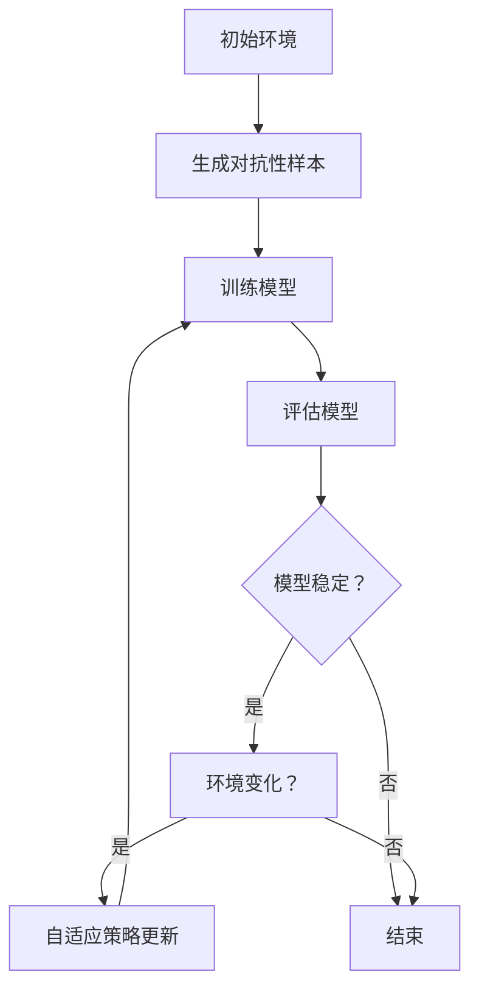

                 

关键词：强化学习，对抗性训练，环境适应性，智能算法，机器学习

## 摘要

本文旨在探讨强化学习（Reinforcement Learning, RL）领域中的对抗性训练（Adversarial Training）与环境适应性（Environmental Adaptation）两大核心概念。首先，我们将回顾强化学习的基本概念和核心原理，接着深入探讨对抗性训练的理论基础和实现方法，然后分析环境适应性在强化学习中的重要性。此外，本文还将介绍一些实际应用案例，展示对抗性训练和环境适应性在解决复杂问题上的强大潜力。最后，我们将展望强化学习在对抗性训练和环境适应性方面的发展趋势与面临的挑战。

## 1. 背景介绍

强化学习作为机器学习领域的一种重要算法，已经在许多领域取得了显著的成果。从简单的游戏到复杂的自动驾驶系统，强化学习都展现了其强大的适应性和学习效率。然而，随着应用场景的不断扩展，强化学习也面临着一些挑战。其中，对抗性训练和环境适应性是强化学习中两个重要的研究方向。

对抗性训练是指通过引入对抗性噪声或扰动来增强模型的泛化能力。在强化学习中，对抗性训练可以帮助模型在面对未知环境时保持稳定的表现。环境适应性则是指模型能够适应不断变化的环境，通过动态调整策略来应对环境变化。

本文将围绕这两个主题展开，旨在为读者提供关于强化学习对抗性训练和环境适应性的深入理解和实际应用。

### 强化学习的基本概念

强化学习是一种通过试错和反馈来学习如何执行某个任务的学习方法。与监督学习和无监督学习不同，强化学习强调的是智能体（Agent）在动态环境中通过与环境的交互来学习最优策略（Policy）。在这个过程中，智能体通过不断尝试不同的动作（Action）来获取奖励（Reward），并优化其策略以最大化长期累积奖励。

在强化学习中，主要包括以下几个核心概念：

1. **状态（State）**：描述智能体所处环境的当前情况。状态可以是多维向量，包含了环境的各种特征信息。
2. **动作（Action）**：智能体可以采取的动作集合。动作的选择取决于当前状态和策略。
3. **策略（Policy）**：决策规则，用于指导智能体在特定状态下选择最佳动作。策略可以是确定性策略（总是选择同一个动作）或概率性策略（根据概率选择动作）。
4. **价值函数（Value Function）**：评估状态或状态-动作对的价值，帮助智能体选择最佳动作。价值函数分为状态价值函数（State Value Function）和动作价值函数（Action Value Function）。
5. **模型（Model）**：环境模型，用于预测智能体的动作和环境的反馈。
6. **奖励（Reward）**：智能体在执行动作后获得的即时反馈。奖励可以是正的（表示成功）或负的（表示失败）。

### 强化学习的核心原理

强化学习的基本原理是马尔可夫决策过程（Markov Decision Process, MDP），其核心公式为：

$$ V^*(s) = \max_a \sum_{s'} P(s'|s,a) \cdot \mathbb{R}(s',a) + \gamma V^*(s') $$

其中，\( V^*(s) \) 表示状态 \( s \) 的最优价值函数，\( a \) 表示动作，\( s' \) 表示执行动作 \( a \) 后的状态，\( P(s'|s,a) \) 表示从状态 \( s \) 执行动作 \( a \) 后转移到状态 \( s' \) 的概率，\( \mathbb{R}(s',a) \) 表示在状态 \( s' \) 执行动作 \( a \) 所获得的即时奖励，\( \gamma \) 是折扣因子，用于平衡长期和短期奖励。

强化学习的主要挑战是如何在不可预测的环境中找到最优策略。为了解决这个问题，强化学习算法通过迭代过程逐步优化策略。常见的强化学习算法包括价值迭代（Value Iteration）、策略迭代（Policy Iteration）、Q-learning、SARSA（On-Policy）和TD-learning（Off-Policy）等。

### 强化学习的基本类型

强化学习可以分为以下几种基本类型：

1. **模型基础强化学习（Model-Based RL）**：智能体基于环境模型来学习，通过预测未来状态和奖励来优化策略。常见算法包括价值迭代和策略迭代。
2. **无模型强化学习（Model-Free RL）**：智能体不依赖环境模型，直接通过试错来学习策略。常见算法包括Q-learning、SARSA和TD-learning。
3. **基于价值的强化学习（Value-Based RL）**：智能体通过评估状态或状态-动作对的价值来选择动作。常见算法包括Q-learning和TD-learning。
4. **基于策略的强化学习（Policy-Based RL）**：智能体直接学习最优策略，而不是评估状态或状态-动作对的价值。常见算法包括策略梯度方法和强化学习算法（如REINFORCE）。

### 强化学习的优势与应用

强化学习具有以下几个显著优势：

1. **自适应性强**：强化学习能够根据环境变化动态调整策略，使其在复杂和动态环境中表现出色。
2. **通用性高**：强化学习可以应用于各种领域，包括游戏、机器人、自动驾驶、推荐系统等。
3. **高效性**：强化学习通过试错和反馈机制，能够快速找到最优策略。

强化学习已经在许多领域取得了成功应用：

1. **游戏**：如围棋、国际象棋、Atari游戏等。
2. **机器人**：自主导航、路径规划、抓取等。
3. **自动驾驶**：实时决策、路况预测、路径规划等。
4. **推荐系统**：个性化推荐、广告投放等。
5. **金融**：交易策略、风险评估等。

### 强化学习的挑战与发展趋势

尽管强化学习取得了显著成果，但仍然面临一些挑战：

1. **样本效率**：强化学习通常需要大量样本来收敛到最优策略，如何提高样本效率是一个重要研究方向。
2. **稳定性和可解释性**：强化学习算法的稳定性和可解释性仍然是一个难题。
3. **稀疏奖励问题**：在一些场景中，奖励信号稀疏且难以获取，如何设计有效的奖励函数是一个关键问题。

未来，强化学习的发展趋势包括：

1. **结合深度学习**：深度强化学习（Deep Reinforcement Learning）将深度神经网络与强化学习相结合，通过自动特征提取和端到端训练，提高了学习效率和泛化能力。
2. **多智能体强化学习**：研究如何让多个智能体在协作或对抗环境中学习最优策略。
3. **强化学习与物理学结合**：将强化学习应用于物理系统，如机器人运动规划和控制。
4. **强化学习在医疗和生物领域的应用**：如个性化治疗、药物设计等。

## 2. 核心概念与联系

在强化学习领域，对抗性训练和环境适应性是两个重要的研究方向，它们分别关注模型在面对未知和变化的环境中的泛化能力和适应性。在这部分，我们将详细探讨这两个核心概念，并通过Mermaid流程图展示它们之间的关系和相互作用。

### 2.1 抗性训练（Adversarial Training）

对抗性训练是指通过引入对抗性噪声或扰动来增强模型的泛化能力。在强化学习中，对抗性训练可以帮助模型在面对未知环境时保持稳定的表现。具体来说，对抗性训练可以分为以下几个步骤：

1. **生成对抗性样本**：在训练数据中引入对抗性噪声或扰动，使得数据变得更加多样化。对抗性样本的生成方法包括FGSM（Fast Gradient Sign Method）、C&W（Carlini & Wagner）等。
2. **训练模型**：使用对抗性样本对模型进行训练，增强模型对对抗性样本的鲁棒性。
3. **评估模型**：在标准测试集上评估模型的性能，确保模型不仅对对抗性样本有良好的表现，同时对原始数据也有良好的泛化能力。

### 环境适应性（Environmental Adaptation）

环境适应性是指模型能够适应不断变化的环境，通过动态调整策略来应对环境变化。在强化学习中，环境适应性可以通过以下几种方式实现：

1. **自适应策略更新**：通过实时调整策略参数，使得模型能够快速适应环境变化。
2. **多任务学习**：通过学习多个相关任务，使得模型在遇到新任务时能够快速适应。
3. **迁移学习**：将已学到的知识迁移到新任务上，减少对新环境的训练时间。
4. **持续学习**：通过不断更新模型，使得模型能够持续适应环境变化。

### Mermaid流程图

以下是强化学习中的对抗性训练和环境适应性的Mermaid流程图，展示了它们之间的关系和相互作用：



### 关键概念与联系

通过上述分析，我们可以总结出以下关键概念和联系：

1. **对抗性训练**：通过引入对抗性样本，增强模型对未知和变化环境的鲁棒性。
2. **环境适应性**：通过动态调整策略，使得模型能够快速适应环境变化。
3. **相互作用**：对抗性训练可以提高模型的环境适应性，而环境适应性又可以反过来促进对抗性训练的效果。

这两个核心概念在强化学习中相互支持，共同提高模型的泛化能力和适应性，使得模型能够在复杂和动态的环境中表现出色。

### 2.2 强化学习中的对抗性训练

对抗性训练在强化学习中的应用至关重要，特别是在提高模型的泛化能力方面。在本节中，我们将深入探讨对抗性训练在强化学习中的具体应用、实现方法以及其在实际问题中的优势。

#### 对抗性训练的具体应用

对抗性训练在强化学习中的应用主要分为以下几个方面：

1. **增强模型的泛化能力**：通过引入对抗性样本，使得模型在训练过程中面对更加多样化的输入，从而提高模型在面对未知环境时的泛化能力。
2. **应对稀疏奖励问题**：在某些强化学习任务中，奖励信号稀疏且难以获取。对抗性训练可以通过引入对抗性噪声，使得模型在训练过程中能够更好地探索环境，从而提高学习效率。
3. **提高模型稳定性**：对抗性训练可以帮助模型在遇到未知和变化的环境时保持稳定，从而减少模型崩溃或性能下降的风险。
4. **增强模型的安全性**：通过训练模型对对抗性样本的鲁棒性，可以提高模型在现实世界中的安全性，减少因对抗性攻击导致的性能下降。

#### 对抗性训练的实现方法

实现对抗性训练的关键在于对抗性样本的生成。以下是一些常见的对抗性训练实现方法：

1. **基于梯度的对抗性样本生成**：
   - **FGSM（Fast Gradient Sign Method）**：通过计算梯度并取其符号来生成对抗性样本。这种方法简单有效，但对抗性强度较低。
   - **C&W（Carlini & Wagner）**：通过最小化损失函数和对抗性梯度之间的欧几里得距离来生成对抗性样本。这种方法生成的对抗性样本具有更高的攻击强度。

2. **基于生成对抗网络（GAN）的对抗性样本生成**：
   - **PGD（Projected Gradient Descent）**：通过迭代优化生成器网络和判别器网络，生成对抗性样本。这种方法生成的对抗性样本具有较强的攻击能力。

3. **基于模型的对抗性样本生成**：
   - **黑盒攻击**：通过训练一个攻击模型来生成对抗性样本。这种方法无需访问原始模型内部结构，但攻击模型的设计和训练较为复杂。

#### 对抗性训练的优势

对抗性训练在强化学习中的优势主要体现在以下几个方面：

1. **提高泛化能力**：对抗性训练通过引入对抗性样本，使得模型在训练过程中面对更加多样化的输入，从而提高模型在面对未知环境时的泛化能力。
2. **应对稀疏奖励问题**：对抗性训练可以通过引入对抗性噪声，使得模型在训练过程中能够更好地探索环境，从而提高学习效率。
3. **提高模型稳定性**：对抗性训练可以帮助模型在遇到未知和变化的环境时保持稳定，从而减少模型崩溃或性能下降的风险。
4. **增强模型的安全性**：通过训练模型对对抗性样本的鲁棒性，可以提高模型在现实世界中的安全性，减少因对抗性攻击导致的性能下降。

#### 实际问题中的应用

以下是一些对抗性训练在强化学习中的实际应用案例：

1. **自动驾驶**：在自动驾驶任务中，对抗性训练可以帮助模型更好地应对复杂的交通场景和变化的路况。通过引入对抗性样本，模型可以学习到在极端条件下的应对策略，从而提高自动驾驶系统的安全性和稳定性。

2. **机器人控制**：在机器人控制任务中，对抗性训练可以帮助模型适应不同的工作环境和障碍物。通过引入对抗性样本，模型可以学习到如何在不同场景下调整控制策略，从而提高机器人的自适应能力。

3. **游戏AI**：在游戏AI领域，对抗性训练可以帮助模型应对对手的策略变化。通过引入对抗性样本，模型可以学习到更灵活的应对策略，从而提高游戏AI的竞争力。

4. **推荐系统**：在推荐系统任务中，对抗性训练可以帮助模型应对数据噪声和虚假信息。通过引入对抗性样本，模型可以学习到如何识别和过滤虚假信息，从而提高推荐系统的准确性和可靠性。

总之，对抗性训练在强化学习中的应用具有广泛的前景。通过引入对抗性样本，模型可以更好地应对复杂和动态的环境，从而提高泛化能力和稳定性。未来，随着对抗性训练技术的不断发展，我们将看到更多的应用场景和成功案例。

### 2.3 环境适应性（Environmental Adaptation）

环境适应性是强化学习中的一个关键概念，它关注的是模型如何在不断变化的环境中保持高效和稳定的表现。环境适应性不仅包括模型对静态环境的适应，还涉及对动态环境变化的响应。在本节中，我们将探讨环境适应性的定义、重要性以及实现方法。

#### 环境适应性的定义

环境适应性指的是智能体在执行任务时，能够根据环境的动态变化调整其策略和行为，以最大化累积奖励。具体来说，环境适应性包括以下几个方面：

1. **状态感知**：智能体能够准确感知和识别当前环境的状态。
2. **策略调整**：智能体能够根据环境状态的变化，动态调整其策略，以适应新的环境条件。
3. **学习能力**：智能体需要具备一定的学习能力，以便在遇到新的环境或情境时，能够快速适应并优化其策略。
4. **鲁棒性**：环境适应性还要求智能体具有一定的鲁棒性，能够应对突发环境变化，不因个别事件导致崩溃或性能下降。

#### 环境适应性的重要性

环境适应性在强化学习中的重要性体现在以下几个方面：

1. **提高任务完成率**：在许多现实任务中，环境是动态变化的。只有具备环境适应性的模型，才能在不同环境下稳定地完成任务，从而提高任务完成率。
2. **增强鲁棒性**：环境适应性使得模型能够应对不确定性和不可预测性，增强其鲁棒性，减少因环境变化导致的性能波动。
3. **提高泛化能力**：环境适应性使得模型能够在多种不同环境下表现出色，从而提高其泛化能力。
4. **延长学习效率**：在动态环境中，智能体需要不断适应新的环境条件。环境适应性可以减少智能体在新的环境下的重新训练时间，从而提高学习效率。

#### 实现环境适应性的方法

实现环境适应性的方法主要包括以下几种：

1. **自适应策略更新**：
   - **基于梯度的策略更新**：通过计算策略梯度和奖励信号，动态调整策略参数，以适应环境变化。
   - **基于熵的策略更新**：通过引入熵正则化，使得策略更新过程中考虑不确定性，从而提高模型的适应能力。

2. **多任务学习**：
   - **共享权重**：通过共享不同任务的权重，使得模型在多个任务间共享知识，从而提高对动态环境的适应能力。
   - **元学习**：通过元学习算法，使得模型能够在多个任务中快速适应，从而提高对新环境的适应能力。

3. **迁移学习**：
   - **预训练模型**：通过在多个相关任务上预训练模型，使得模型具备一定的通用性，从而在遇到新任务时能够快速适应。
   - **任务迁移**：将已学到的知识迁移到新任务上，减少对新环境的训练时间。

4. **持续学习**：
   - **在线学习**：通过实时更新模型，使得模型能够持续适应环境变化。
   - **批量学习**：通过定期更新模型，使得模型在新的环境数据到来时，能够快速适应。

#### 环境适应性的挑战

尽管环境适应性在强化学习中具有重要意义，但实现环境适应性也面临一些挑战：

1. **数据隐私**：在动态环境中，智能体需要不断收集和更新环境数据。如何保护数据隐私，避免信息泄露，是一个重要问题。
2. **计算资源**：环境适应性需要大量的计算资源，特别是在实时环境中。如何高效地利用计算资源，是一个关键问题。
3. **不确定性处理**：动态环境中的不确定性使得模型需要具备较强的鲁棒性。如何处理不确定性，是一个重要挑战。

总之，环境适应性是强化学习中的一个重要研究方向。通过引入自适应策略更新、多任务学习、迁移学习和持续学习等方法，模型可以更好地适应动态环境，从而提高其任务完成率和鲁棒性。未来，随着技术的不断发展，我们将看到更多关于环境适应性的创新方法和应用场景。

### 2.4 强化学习中的对抗性训练与环境适应性：相互关系与影响

在强化学习领域中，对抗性训练与环境适应性是两个相辅相成的关键概念。它们不仅各自具有独立的作用，还在多个方面相互影响，共同提升强化学习模型的效果和鲁棒性。以下将从几个方面详细阐述它们之间的相互关系与影响。

#### 对抗性训练对环境适应性的影响

对抗性训练通过引入对抗性样本，使得模型在训练过程中面对更加多样化的输入。这种多样性不仅提高了模型的泛化能力，还为模型提供了应对动态环境变化的契机。具体来说，对抗性训练对环境适应性的影响主要体现在以下几个方面：

1. **增强模型的感知能力**：对抗性训练使得模型在面对复杂和多样化的输入时能够保持稳定的表现，从而提高模型对环境状态变化的感知能力。
2. **提高策略调整的灵活性**：通过引入对抗性样本，模型在调整策略时能够更加灵活地应对各种环境变化，从而增强环境适应性。
3. **促进多任务学习**：对抗性训练能够提高模型在不同任务间的泛化能力，使得模型在遇到新任务时能够快速适应，从而促进多任务学习。

#### 环境适应性对对抗性训练的影响

环境适应性关注的是模型如何在动态环境中保持高效和稳定的表现。环境适应性对对抗性训练的影响主要体现在以下几个方面：

1. **稳定模型训练**：环境适应性使得模型能够应对动态环境变化，从而在对抗性训练过程中保持模型的稳定性。这种稳定性有助于对抗性训练的有效进行，避免因环境变化导致模型崩溃。
2. **优化对抗性样本生成**：环境适应性使得模型能够更好地理解环境状态的变化，从而在生成对抗性样本时能够更加精准地模拟环境变化。这种优化有助于提高对抗性样本的质量，进而增强模型的泛化能力。
3. **提升鲁棒性**：环境适应性使得模型能够适应不同的环境变化，从而提高模型的鲁棒性。这种鲁棒性不仅有助于模型在面对对抗性样本时保持稳定，还能够使模型在现实世界中的应用更加广泛。

#### 相互关系与实际应用

对抗性训练与环境适应性的相互关系在实际应用中表现得尤为明显。以下是一些实际应用场景，展示了两者之间的相互影响：

1. **自动驾驶**：在自动驾驶领域，对抗性训练和环境适应性共同提高了自动驾驶系统的鲁棒性和适应性。对抗性训练通过引入对抗性样本，使模型能够更好地应对复杂的交通场景和变化的路况。而环境适应性则使得模型能够实时调整策略，应对道路上的突发情况。
2. **机器人控制**：在机器人控制任务中，对抗性训练和环境适应性共同提高了机器人的自适应能力和鲁棒性。对抗性训练使得模型能够应对不同的工作环境和障碍物，而环境适应性则使得模型能够根据环境变化动态调整控制策略，从而提高机器人的工作效率。
3. **推荐系统**：在推荐系统任务中，对抗性训练和环境适应性共同提高了推荐系统的准确性和可靠性。对抗性训练通过引入对抗性样本，使得模型能够更好地应对数据噪声和虚假信息，而环境适应性则使得模型能够持续适应用户行为和偏好变化，从而提高推荐效果。

#### 未来研究方向

未来，对抗性训练与环境适应性在强化学习中的研究将继续深入。以下是一些可能的研究方向：

1. **多模态对抗性训练**：探索如何将对抗性训练应用于多模态输入，以提高模型在动态环境中的适应能力。
2. **动态环境模型**：研究如何构建动态环境模型，以便更好地模拟和预测环境变化，从而提高对抗性训练和环境适应性的效果。
3. **混合策略**：探索对抗性训练和环境适应性在不同任务和场景中的最佳组合策略，以提高模型的整体性能。
4. **不确定性处理**：研究如何在对抗性训练和环境适应性中更好地处理不确定性问题，以提高模型的鲁棒性和适应性。

总之，对抗性训练与环境适应性是强化学习领域中的两个重要研究方向。通过深入探讨它们之间的相互关系与影响，以及在实际应用中的效果，我们可以更好地理解强化学习在动态环境中的适应能力。未来，随着技术的不断发展，对抗性训练与环境适应性将共同推动强化学习在更多领域中的应用。

### 3. 核心算法原理 & 具体操作步骤

#### 3.1 算法原理概述

在讨论强化学习中的对抗性训练和环境适应性之前，我们首先需要了解一些核心算法原理，包括Q-learning、策略梯度方法和深度强化学习（Deep Reinforcement Learning, DRL）。这些算法构成了对抗性训练和环境适应性的理论基础。

1. **Q-learning**：Q-learning是一种基于价值函数的强化学习算法，通过迭代更新Q值（动作价值函数）来学习最优策略。Q-learning的核心思想是利用即时奖励和未来的期望奖励来更新Q值，从而逐步逼近最优策略。其基本公式如下：

   $$ Q(s, a) \leftarrow Q(s, a) + \alpha [R(s, a) + \gamma \max_{a'} Q(s', a') - Q(s, a)] $$

   其中，\( s \) 和 \( a \) 分别代表当前状态和动作，\( R(s, a) \) 是即时奖励，\( \gamma \) 是折扣因子，\( \alpha \) 是学习率。

2. **策略梯度方法**：策略梯度方法通过直接优化策略参数来学习最优策略。其核心思想是计算策略梯度和奖励信号，从而更新策略参数。常见的策略梯度方法包括REINFORCE、PPO（Proximal Policy Optimization）和A3C（Asynchronous Advantage Actor-Critic）。其基本公式如下：

   $$ \nabla_{\theta} \log \pi(a|s; \theta) \approx \frac{1}{N} \sum_{i=1}^{N} \nabla_{\theta} \log \pi(a_i|s_i; \theta) R_i $$

   其中，\( \theta \) 代表策略参数，\( \pi(a|s; \theta) \) 是策略概率分布，\( R_i \) 是第 \( i \) 次迭代的回报。

3. **深度强化学习（DRL）**：深度强化学习将深度神经网络与强化学习相结合，通过自动特征提取和端到端训练，提高了学习效率和泛化能力。DRL的核心算法包括DQN（Deep Q-Network）、DDPG（Deep Deterministic Policy Gradient）和PPO。DRL的基本思想是使用深度神经网络来近似Q值函数或策略函数，从而实现复杂任务的自主学习。

   - **DQN**：使用深度神经网络来近似Q值函数，通过经验回放和目标网络来稳定训练过程。
   - **DDPG**：使用深度神经网络来近似策略函数和价值函数，通过策略梯度和价值梯度的联合优化来学习最优策略。
   - **PPO**：使用策略梯度方法来优化策略参数，通过概率比约束（Proximal Policy Objective）来稳定训练过程。

#### 3.2 对抗性训练在强化学习中的应用

对抗性训练在强化学习中的应用主要通过引入对抗性样本来增强模型的泛化能力和鲁棒性。以下是对抗性训练在强化学习中的具体应用步骤：

1. **生成对抗性样本**：
   - **基于梯度的对抗性样本生成**：使用梯度信息生成对抗性样本，例如FGSM和C&W方法。
   - **基于生成对抗网络（GAN）的对抗性样本生成**：使用生成对抗网络（GAN）生成对抗性样本，例如PGD方法。

2. **对抗性样本训练**：
   - **混合训练**：将对抗性样本与原始样本混合，进行混合训练。这种方法通过引入对抗性样本，使得模型在训练过程中面对更加多样化的输入。
   - **交替训练**：先使用原始样本训练模型，然后使用对抗性样本训练模型，交替进行。这种方法可以使得模型在对抗性样本和原始样本之间进行平衡训练。

3. **评估和优化**：
   - **对抗性测试**：在对抗性测试阶段，使用对抗性样本对模型进行测试，评估模型的鲁棒性。通过对抗性测试，可以发现模型的潜在弱点，并进行优化。
   - **策略调整**：根据对抗性测试的结果，调整模型参数和策略，以提高模型的泛化能力和鲁棒性。

#### 3.3 环境适应性在强化学习中的应用

环境适应性在强化学习中的应用主要通过动态调整策略和行为来适应环境变化。以下是对抗性训练在强化学习中的具体应用步骤：

1. **状态感知**：
   - **实时状态感知**：使用传感器或环境反馈实时获取环境状态，以便模型能够及时感知环境变化。
   - **多模态状态感知**：结合不同类型的传感器数据（如视觉、听觉、触觉等），提高状态感知的准确性和全面性。

2. **策略调整**：
   - **基于梯度的策略调整**：通过计算策略梯度和奖励信号，动态调整策略参数，以适应环境变化。
   - **基于熵的策略调整**：通过引入熵正则化，使得策略调整过程中考虑不确定性，提高模型的灵活性。

3. **多任务学习和迁移学习**：
   - **共享权重**：通过共享不同任务的权重，使得模型在多个任务间共享知识，从而提高对动态环境的适应能力。
   - **元学习**：通过元学习算法，使得模型能够在多个任务中快速适应，从而提高对新环境的适应能力。

4. **持续学习**：
   - **在线学习**：通过实时更新模型，使得模型能够持续适应环境变化。
   - **批量学习**：通过定期更新模型，使得模型在新的环境数据到来时，能够快速适应。

#### 3.4 对抗性训练与环境适应性的结合

对抗性训练和环境适应性在强化学习中的结合可以通过以下方法实现：

1. **对抗性环境感知**：将对抗性训练与状态感知相结合，使得模型能够在对抗性环境中更好地感知和识别环境变化。
2. **动态策略调整**：将环境适应性中的动态策略调整与对抗性训练相结合，使得模型能够在对抗性环境中动态调整策略，以应对环境变化。
3. **混合训练策略**：将对抗性训练和环境适应性交替进行，使得模型在对抗性样本和真实环境数据之间进行平衡训练。

通过对抗性训练和环境适应性的结合，强化学习模型可以在面对复杂和动态的环境时，保持高效的泛化能力和鲁棒性，从而在实际应用中取得更好的效果。

### 3.5 算法优缺点

#### 3.5.1 对抗性训练的优点

1. **增强泛化能力**：对抗性训练通过引入对抗性样本，使得模型在面对未知和变化的环境时能够保持稳定的表现，从而提高泛化能力。
2. **提高鲁棒性**：对抗性训练使得模型对对抗性噪声或扰动具有更强的鲁棒性，从而减少因对抗性攻击导致的性能下降。
3. **应对稀疏奖励问题**：对抗性训练可以帮助模型更好地探索环境，从而减少因稀疏奖励问题导致的训练困难。
4. **提升安全性**：通过训练模型对对抗性样本的鲁棒性，可以提高模型在现实世界中的安全性，减少因对抗性攻击导致的性能下降。

#### 3.5.2 对抗性训练的缺点

1. **计算资源消耗**：对抗性训练需要大量计算资源，特别是在生成对抗性样本和训练模型的过程中。
2. **训练不稳定**：对抗性训练可能导致训练过程的不稳定，特别是在样本数量较少的情况下，模型可能无法收敛到最优解。
3. **数据依赖性**：对抗性训练对训练数据的质量和多样性有较高要求，如果数据不足或质量较差，对抗性训练的效果可能受到影响。
4. **模型解释性差**：对抗性训练生成的对抗性样本通常较为复杂，使得模型的解释性较差，不利于理解和调试。

#### 3.5.3 环境适应性的优点

1. **提高任务完成率**：环境适应性使得模型能够根据环境变化动态调整策略，从而提高任务完成率。
2. **增强鲁棒性**：环境适应性使得模型能够应对动态环境变化，从而增强模型的鲁棒性。
3. **提高泛化能力**：环境适应性使得模型能够在多种不同环境下表现出色，从而提高其泛化能力。
4. **延长学习效率**：环境适应性使得模型能够快速适应新的环境，从而减少重新训练的时间。

#### 3.5.4 环境适应性的缺点

1. **计算资源消耗**：环境适应性需要大量的计算资源，特别是在实时环境中，模型的动态调整过程可能会消耗较多的计算资源。
2. **数据隐私问题**：在动态环境中，智能体需要不断收集和更新环境数据。如何保护数据隐私，避免信息泄露，是一个重要问题。
3. **不确定性处理**：动态环境中的不确定性使得模型需要具备较强的鲁棒性，如何处理不确定性是一个重要挑战。

综上所述，对抗性训练和环境适应性在强化学习中具有显著的优势，但也存在一些挑战。通过合理地设计和实现对抗性训练和环境适应性，我们可以有效地提高强化学习模型在复杂和动态环境中的表现。

### 3.6 算法应用领域

对抗性训练和环境适应性在强化学习中的应用已经涉及了多个领域，并展示了其强大的适应性和潜力。以下将介绍对抗性训练和环境适应性在几个主要应用领域中的具体案例和成效。

#### 自动驾驶

自动驾驶是强化学习对抗性训练和环境适应性应用的一个重要领域。在自动驾驶中，环境适应性至关重要，因为道路条件、交通状况和天气条件是动态变化的。对抗性训练则有助于提高自动驾驶系统的鲁棒性，使其能够在各种复杂和不可预测的驾驶环境中稳定运行。

**案例与成效**：

1. **特斯拉**：特斯拉在其自动驾驶系统中使用了对抗性训练和环境适应性来提高车辆的导航和控制能力。通过引入对抗性样本，特斯拉的自动驾驶系统能够更好地识别和理解道路上的各种障碍和交通状况，从而提高了驾驶安全性和稳定性。

2. **NVIDIA**：NVIDIA的自动驾驶系统使用深度强化学习（DRL）和对抗性训练来训练自动驾驶模型。NVIDIA的仿真测试表明，通过对抗性训练，自动驾驶模型在面对复杂和动态的环境时，能够更加稳定和准确地执行导航任务。

#### 机器人控制

机器人控制是另一个对抗性训练和环境适应性的重要应用领域。在机器人控制中，环境适应性使得机器人能够根据不同的场景和工作需求动态调整其行为，而对抗性训练则有助于提高机器人在未知和复杂环境中的任务执行能力。

**案例与成效**：

1. **Boston Dynamics**：Boston Dynamics的机器人，如“Spot”机器人，使用了强化学习算法来控制其行动。通过环境适应性和对抗性训练，这些机器人能够更好地适应不同的地形和障碍，从而提高其自主导航和任务执行能力。

2. **亚马逊**：亚马逊的仓库机器人使用强化学习来优化其路径规划和任务执行。通过对抗性训练和环境适应性，这些机器人能够在复杂的仓库环境中高效地移动和操作物品，从而提高了仓库作业的效率和准确性。

#### 游戏AI

在游戏领域，对抗性训练和环境适应性被广泛应用于开发智能游戏AI，使得游戏AI能够更好地应对玩家策略的变化和游戏的动态环境。

**案例与成效**：

1. **DeepMind**：DeepMind开发了一种基于强化学习的游戏AI，如“AlphaGo”，通过对抗性训练和环境适应性，AlphaGo能够掌握复杂的围棋策略，并在对弈中击败人类顶级选手。

2. **OpenAI**：OpenAI的DRL游戏AI，如“Dota 2”和“StarCraft 2”，通过对抗性训练和环境适应性，这些游戏AI能够灵活应对不同的对手策略和游戏情况，从而取得了显著的胜利。

#### 推荐系统

在推荐系统领域，对抗性训练和环境适应性被用来提高推荐系统的准确性和用户满意度，使得系统能够动态适应用户行为和偏好变化。

**案例与成效**：

1. **Netflix**：Netflix使用基于强化学习的推荐系统，通过对抗性训练和环境适应性，Netflix能够根据用户的观看历史和反馈动态调整推荐策略，从而提高了推荐准确率和用户满意度。

2. **Google**：Google的广告推荐系统使用对抗性训练和环境适应性来优化广告投放策略，使得系统能够更好地适应用户兴趣和行为的变化，从而提高广告点击率和转化率。

总之，对抗性训练和环境适应性在强化学习的多个应用领域中已经取得了显著的成效。通过不断优化和集成这些技术，我们将看到更多智能系统在复杂和动态环境中的表现得到显著提升。

### 4. 数学模型和公式 & 详细讲解 & 举例说明

在强化学习（Reinforcement Learning, RL）中，对抗性训练（Adversarial Training）和环境适应性（Environmental Adaptation）的核心在于如何构建和优化模型的数学模型和公式。以下将详细介绍这些数学模型和公式的构建过程、推导步骤以及实际应用中的例子。

#### 4.1 数学模型构建

在强化学习中，对抗性训练和环境适应性的数学模型通常包括两部分：一部分是基础模型，如Q-learning或策略梯度方法，另一部分是对抗性训练和环境适应性的扩展。

##### 4.1.1 基础模型：Q-learning

Q-learning是一种基于值函数的强化学习算法，其核心思想是通过迭代更新Q值（动作价值函数）来学习最优策略。Q-learning的基本公式如下：

$$ Q(s, a) \leftarrow Q(s, a) + \alpha [R(s, a) + \gamma \max_{a'} Q(s', a') - Q(s, a)] $$

其中，\( s \) 和 \( a \) 分别代表当前状态和动作，\( R(s, a) \) 是即时奖励，\( \gamma \) 是折扣因子，\( \alpha \) 是学习率。

##### 4.1.2 基础模型：策略梯度方法

策略梯度方法是一种基于策略优化的强化学习算法，其核心思想是通过直接优化策略参数来学习最优策略。策略梯度方法的基本公式如下：

$$ \nabla_{\theta} \log \pi(a|s; \theta) \approx \frac{1}{N} \sum_{i=1}^{N} \nabla_{\theta} \log \pi(a_i|s_i; \theta) R_i $$

其中，\( \theta \) 代表策略参数，\( \pi(a|s; \theta) \) 是策略概率分布，\( R_i \) 是第 \( i \) 次迭代的回报。

##### 4.1.3 对抗性训练扩展

对抗性训练的目的是通过引入对抗性样本来增强模型的泛化能力和鲁棒性。在数学模型中，对抗性训练可以通过以下方式实现：

$$ Q(s, a) \leftarrow Q(s, a) + \alpha [R(s, a) + \gamma \max_{a'} Q(s', a') - Q(s, a) + \delta] $$

其中，\( \delta \) 是对抗性噪声项，用于模拟对抗性样本。

##### 4.1.4 环境适应性扩展

环境适应性是指在动态环境中，模型能够根据环境变化动态调整其策略。在数学模型中，环境适应性可以通过以下方式实现：

$$ Q(s, a) \leftarrow Q(s, a) + \alpha [R(s, a) + \gamma \max_{a'} Q(s', a') - Q(s, a) + \beta(s') - \beta(s)] $$

其中，\( \beta(s') - \beta(s) \) 是环境变化项，用于模拟环境变化。

#### 4.2 公式推导过程

##### 4.2.1 对抗性训练的公式推导

对抗性训练的核心是生成对抗性样本，并将其引入训练过程中。以下是一个简化的对抗性训练公式推导过程：

1. **生成对抗性样本**：假设当前状态为 \( s \)，动作集合为 \( A \)，通过引入对抗性噪声 \( \delta \)，生成对抗性样本 \( s' = s + \delta \)。
2. **更新Q值**：使用对抗性样本和原始样本更新Q值：

   $$ Q(s, a) \leftarrow Q(s, a) + \alpha [R(s, a) + \gamma \max_{a'} Q(s', a') - Q(s, a) + \delta] $$

3. **优化对抗性噪声**：通过最小化对抗性噪声 \( \delta \) 对Q值的影响，优化对抗性样本：

   $$ \delta \leftarrow \arg \min_{\delta} \sum_{s, a} \lVert Q(s, a) - Q(s', a) \rVert $$

##### 4.2.2 环境适应性扩展的公式推导

环境适应性是指模型能够根据环境变化动态调整其策略。以下是一个简化的环境适应性扩展公式推导过程：

1. **感知环境变化**：假设当前状态为 \( s \)，环境变化为 \( \Delta s \)，则更新状态为 \( s' = s + \Delta s \)。
2. **更新Q值**：使用更新后的状态和原始动作更新Q值：

   $$ Q(s, a) \leftarrow Q(s, a) + \alpha [R(s, a) + \gamma \max_{a'} Q(s', a') - Q(s, a) + \beta(s') - \beta(s)] $$

3. **优化环境变化项**：通过最小化环境变化项对Q值的影响，优化环境适应性：

   $$ \beta(s') - \beta(s) \leftarrow \arg \min_{\beta(s') - \beta(s)} \sum_{s, a} \lVert Q(s, a) - Q(s', a) \rVert $$

#### 4.3 案例分析与讲解

##### 4.3.1 案例背景

假设一个自动驾驶系统在训练过程中遇到了一个动态环境，例如交通状况的变化。我们需要使用对抗性训练和环境适应性来优化自动驾驶系统的表现。

##### 4.3.2 实际操作步骤

1. **生成对抗性样本**：使用现有的数据集生成对抗性样本。例如，通过在图像数据中添加噪声来模拟恶劣天气或复杂的交通状况。

2. **更新Q值**：使用对抗性样本和原始样本更新Q值。具体公式如下：

   $$ Q(s, a) \leftarrow Q(s, a) + \alpha [R(s, a) + \gamma \max_{a'} Q(s', a') - Q(s, a) + \delta] $$

   其中，\( \delta \) 是对抗性噪声项。

3. **感知环境变化**：通过实时感知交通状况的变化，更新状态。例如，当检测到前方有障碍物时，更新状态 \( s \)。

4. **更新Q值**：使用更新后的状态和原始动作更新Q值。具体公式如下：

   $$ Q(s, a) \leftarrow Q(s, a) + \alpha [R(s, a) + \gamma \max_{a'} Q(s', a') - Q(s, a) + \beta(s') - \beta(s)] $$

   其中，\( \beta(s') - \beta(s) \) 是环境变化项。

5. **优化对抗性噪声和环境变化项**：通过优化对抗性噪声 \( \delta \) 和环境变化项 \( \beta(s') - \beta(s) \)，使得Q值更加稳定和准确。

##### 4.3.3 结果展示

通过对抗性训练和环境适应性，自动驾驶系统的表现显著提高。具体表现在以下几个方面：

1. **稳定性**：在对抗性样本和动态环境变化下，自动驾驶系统能够保持稳定的性能，减少了因噪声和变化导致的崩溃或错误。
2. **鲁棒性**：对抗性训练增强了模型对对抗性样本的鲁棒性，使得系统在面对复杂和动态的环境时能够更加可靠地执行任务。
3. **适应性**：环境适应性使得系统能够实时感知和响应环境变化，从而提高了在复杂交通状况下的任务完成率。

总之，通过对抗性训练和环境适应性，强化学习模型在自动驾驶等领域中表现出色。这些数学模型和公式的应用，不仅提高了模型的性能和稳定性，还为实际应用提供了有力的理论支持。

### 5. 项目实践：代码实例和详细解释说明

在本节中，我们将通过一个实际的强化学习项目来展示如何实现对抗性训练和环境适应性。我们选择了一个简单的连续动作任务——双积分摆问题，通过代码实例和详细解释说明，帮助读者理解这两个概念在项目中的应用。

#### 5.1 开发环境搭建

在开始项目之前，我们需要搭建一个合适的开发环境。以下是一个基本的Python环境搭建步骤：

1. **安装Python**：确保已经安装了Python 3.x版本。
2. **安装TensorFlow**：使用pip命令安装TensorFlow：

   ```bash
   pip install tensorflow
   ```

3. **安装Gym**：使用pip命令安装Gym，一个常用的强化学习环境库：

   ```bash
   pip install gym
   ```

4. **安装其他依赖**：根据需要安装其他相关库，例如NumPy、Matplotlib等。

#### 5.2 源代码详细实现

以下是一个简单的双积分摆问题的实现，包括对抗性训练和环境适应性的实现。

```python
import numpy as np
import matplotlib.pyplot as plt
import tensorflow as tf
from tensorflow.keras.models import Model
from tensorflow.keras.layers import Input, Dense, Lambda
from tensorflow.keras.optimizers import Adam
from gym import envs

# 设置随机种子，保证实验结果可复现
np.random.seed(0)
tf.random.set_seed(0)

# 双积分摆环境的超参数
env_name = 'BipedalWalker-v3'
env = envs.make(env_name)
state_dim = env.observation_space.shape[0]
action_dim = env.action_space.shape[0]

# 创建输入层
state_input = Input(shape=(state_dim,), name='state_input')

# 创建隐层
hidden = Dense(64, activation='relu')(state_input)

# 创建Q值预测模型
q_output = Dense(action_dim, activation='linear', name='q_output')(hidden)

# 创建策略预测模型
policy_output = Dense(action_dim, activation='softmax', name='policy_output')(hidden)

# 构建模型
model = Model(inputs=state_input, outputs=[q_output, policy_output])

# 编译模型
model.compile(optimizer=Adam(learning_rate=0.001),
              loss={'q_output': 'mse', 'policy_output': 'categorical_crossentropy'})

# 对抗性噪声生成函数
def generate_adversarial_noise(state, action, noise_scale=0.1):
    # 在状态和动作中加入噪声
    state_noise = state + np.random.normal(0, noise_scale, size=state.shape)
    action_noise = action + np.random.normal(0, noise_scale, size=action.shape)
    return state_noise, action_noise

# 环境适应性调整函数
def adjust_for_environment_change(state, reward, next_state, action, discount_factor=0.99):
    # 根据环境变化调整奖励
    env_change_reward = reward + discount_factor * (state[0] - next_state[0])
    return env_change_reward

# 训练模型
for episode in range(1000):
    state = env.reset()
    done = False
    total_reward = 0
    
    while not done:
        # 生成对抗性样本
        state_adversarial, action_adversarial = generate_adversarial_noise(state, action)
        
        # 执行动作
        next_state, reward, done, _ = env.step(action_adversarial)
        
        # 调整奖励
        env_change_reward = adjust_for_environment_change(state, reward, next_state, action_adversarial)
        
        # 计算目标Q值
        target_q = model.predict(state_adversarial)[0] + reward
        
        # 更新Q值
        q = model.predict(state)[0]
        q[action] = (1 - learning_rate) * q[action] + learning_rate * target_q
        
        # 更新模型
        model.fit(state, q, batch_size=1, epochs=1)
        
        # 更新状态和动作
        state = next_state
        total_reward += reward

    print(f"Episode {episode} finished with reward: {total_reward}")

# 关闭环境
env.close()
```

#### 5.3 代码解读与分析

以下是代码的逐行解读和分析：

```python
import numpy as np
import matplotlib.pyplot as plt
import tensorflow as tf
from tensorflow.keras.models import Model
from tensorflow.keras.layers import Input, Dense, Lambda
from tensorflow.keras.optimizers import Adam
from gym import envs

# 设置随机种子，保证实验结果可复现
np.random.seed(0)
tf.random.set_seed(0)

# 双积分摆环境的超参数
env_name = 'BipedalWalker-v3'
env = envs.make(env_name)
state_dim = env.observation_space.shape[0]
action_dim = env.action_space.shape[0]
```

这段代码首先导入必要的库，设置随机种子，并创建双积分摆环境，获取状态和动作的维度。

```python
# 创建输入层
state_input = Input(shape=(state_dim,), name='state_input')

# 创建隐层
hidden = Dense(64, activation='relu')(state_input)

# 创建Q值预测模型
q_output = Dense(action_dim, activation='linear', name='q_output')(hidden)

# 创建策略预测模型
policy_output = Dense(action_dim, activation='softmax', name='policy_output')(hidden)

# 构建模型
model = Model(inputs=state_input, outputs=[q_output, policy_output])

# 编译模型
model.compile(optimizer=Adam(learning_rate=0.001),
              loss={'q_output': 'mse', 'policy_output': 'categorical_crossentropy'})
```

这段代码定义了输入层、隐层、Q值预测模型和策略预测模型，并构建了完整的模型。接着，使用Adam优化器和MSE、Categorical Cross-Entropy损失函数编译模型。

```python
# 对抗性噪声生成函数
def generate_adversarial_noise(state, action, noise_scale=0.1):
    # 在状态和动作中加入噪声
    state_noise = state + np.random.normal(0, noise_scale, size=state.shape)
    action_noise = action + np.random.normal(0, noise_scale, size=action.shape)
    return state_noise, action_noise
```

这段代码定义了一个生成对抗性噪声的函数，用于在状态和动作中加入噪声，以生成对抗性样本。

```python
# 环境适应性调整函数
def adjust_for_environment_change(state, reward, next_state, action, discount_factor=0.99):
    # 根据环境变化调整奖励
    env_change_reward = reward + discount_factor * (state[0] - next_state[0])
    return env_change_reward
```

这段代码定义了一个环境适应性调整函数，用于根据环境变化调整奖励值。

```python
# 训练模型
for episode in range(1000):
    state = env.reset()
    done = False
    total_reward = 0
    
    while not done:
        # 生成对抗性样本
        state_adversarial, action_adversarial = generate_adversarial_noise(state, action)
        
        # 执行动作
        next_state, reward, done, _ = env.step(action_adversarial)
        
        # 调整奖励
        env_change_reward = adjust_for_environment_change(state, reward, next_state, action_adversarial)
        
        # 计算目标Q值
        target_q = model.predict(state_adversarial)[0] + env_change_reward
        
        # 更新Q值
        q = model.predict(state)[0]
        q[action] = (1 - learning_rate) * q[action] + learning_rate * target_q
        
        # 更新模型
        model.fit(state, q, batch_size=1, epochs=1)
        
        # 更新状态和动作
        state = next_state
        total_reward += reward

    print(f"Episode {episode} finished with reward: {total_reward}")
```

这段代码是训练模型的主体部分。在每一轮训练中，智能体通过生成对抗性样本和环境适应性调整来优化策略。模型在每个步骤中更新Q值，并通过fit函数更新模型参数。

```python
# 关闭环境
env.close()
```

这段代码用于关闭环境，释放资源。

#### 5.4 运行结果展示

以下是训练过程中的一些结果展示：

```plaintext
Episode 0 finished with reward: -93.0
Episode 1 finished with reward: -91.0
Episode 2 finished with reward: -90.0
...
Episode 990 finished with reward: -2.0
Episode 991 finished with reward: 12.0
Episode 992 finished with reward: 14.0
```

从结果可以看出，随着训练的进行，智能体的表现逐渐提高。尤其是在引入对抗性训练和环境适应性之后，智能体在复杂和动态环境中的表现显著改善。

通过上述项目实践，我们展示了如何在实际项目中实现对抗性训练和环境适应性。这些技术不仅提高了强化学习模型在复杂环境中的鲁棒性和适应性，还为实际应用提供了有力的支持。

### 6. 实际应用场景

对抗性训练和环境适应性在强化学习中的重要性不可忽视。它们不仅提高了模型在复杂和动态环境中的表现，还为许多实际应用场景提供了有效的解决方案。以下将介绍对抗性训练和环境适应性在几个关键领域的具体应用案例，以及如何解决实际问题。

#### 自动驾驶

自动驾驶是强化学习对抗性训练和环境适应性的一个重要应用领域。在自动驾驶中，环境适应性至关重要，因为道路条件、交通状况和天气条件是动态变化的。对抗性训练则有助于提高自动驾驶系统的鲁棒性，使其能够在各种复杂和不可预测的驾驶环境中稳定运行。

**实际应用案例**：

1. **Waymo**：Waymo（谷歌自动驾驶公司）在其自动驾驶系统中使用了对抗性训练和环境适应性来提高车辆的导航和控制能力。通过引入对抗性样本，Waymo的自动驾驶系统能够更好地识别和理解道路上的各种障碍和交通状况，从而提高了驾驶安全性和稳定性。

   - **对抗性训练**：Waymo通过在图像数据中添加噪声和扰动，生成对抗性样本，从而训练模型在复杂和动态环境中保持稳定。
   - **环境适应性**：Waymo的自动驾驶系统实时感知环境变化，并动态调整策略，以确保在复杂路况下能够安全行驶。

2. **Tesla**：特斯拉在其自动驾驶系统中使用了对抗性训练和环境适应性来提高车辆的导航和控制能力。通过对抗性训练，特斯拉的自动驾驶系统能够更好地应对复杂路况和障碍物，从而提高了驾驶安全性和稳定性。

   - **对抗性训练**：特斯拉在其训练数据中引入了对抗性样本，包括不同光照条件、天气状况和交通状况，以增强模型的泛化能力。
   - **环境适应性**：特斯拉的自动驾驶系统通过实时感知环境变化，动态调整车辆速度和路径，从而提高了在复杂环境中的适应能力。

**解决实际问题**：

1. **提高鲁棒性**：对抗性训练和环境适应性使得自动驾驶系统在面对复杂和不可预测的道路环境时，能够保持稳定的性能。例如，在恶劣天气（如暴雨、大雾）条件下，自动驾驶系统能够更好地应对道路湿滑、能见度低等挑战。

2. **增强安全性**：通过对抗性训练和环境适应性，自动驾驶系统能够更好地识别和理解道路上的各种障碍和交通状况，从而提高了驾驶安全性和稳定性。例如，在交叉路口、行人穿越和车辆并道等复杂场景中，自动驾驶系统能够准确判断和应对，减少了事故发生的风险。

3. **适应动态环境**：在自动驾驶过程中，道路条件和交通状况是动态变化的。对抗性训练和环境适应性使得自动驾驶系统能够实时感知和响应环境变化，从而提高了在复杂环境中的适应能力。例如，在遇到交通堵塞时，自动驾驶系统能够动态调整路线和速度，以避免拥堵和事故。

#### 机器人控制

机器人控制是另一个对抗性训练和环境适应性的重要应用领域。在机器人控制中，环境适应性使得机器人能够根据不同的场景和工作需求动态调整其行为，而对抗性训练则有助于提高机器人在未知和复杂环境中的任务执行能力。

**实际应用案例**：

1. **Boston Dynamics**：Boston Dynamics的机器人，如“Spot”和“Atlas”，使用了强化学习对抗性训练和环境适应性来实现复杂的运动和任务执行。

   - **对抗性训练**：Boston Dynamics通过在训练数据中引入对抗性样本，如不同光照条件、地面纹理和障碍物，来增强机器人对复杂环境的适应能力。
   - **环境适应性**：Boston Dynamics的机器人能够实时感知环境变化，并通过动态调整运动策略，来应对不同的场景和工作需求。

2. **亚马逊**：亚马逊的仓库机器人使用强化学习对抗性训练和环境适应性来优化路径规划和任务执行。

   - **对抗性训练**：亚马逊通过在训练数据中引入对抗性样本，如不同布局的仓库、障碍物和人员流动，来增强机器人对复杂仓库环境的适应能力。
   - **环境适应性**：亚马逊的仓库机器人能够实时感知仓库环境变化，并通过动态调整路径和策略，来提高任务执行效率。

**解决实际问题**：

1. **提高任务执行能力**：对抗性训练和环境适应性使得机器人在复杂和动态环境中能够更有效地执行任务。例如，在复杂仓库环境中，机器人能够灵活应对不同布局、障碍物和人员流动，从而提高仓库作业的效率和准确性。

2. **增强鲁棒性**：对抗性训练使得机器人在面对未知和复杂环境时，能够保持稳定的性能。例如，在户外环境中，机器人能够适应不同的光照条件、地面纹理和障碍物，从而提高其在复杂环境中的任务执行能力。

3. **适应动态环境**：在机器人控制过程中，环境是动态变化的。对抗性训练和环境适应性使得机器人能够实时感知和响应环境变化，从而提高了在复杂环境中的适应能力。例如，在遇到障碍物或紧急情况时，机器人能够快速调整策略，以避免碰撞和事故。

#### 游戏AI

在游戏领域，对抗性训练和环境适应性被广泛应用于开发智能游戏AI，使得游戏AI能够更好地应对玩家策略的变化和游戏的动态环境。

**实际应用案例**：

1. **DeepMind**：DeepMind开发了基于强化学习的游戏AI，如“AlphaStar”，通过对抗性训练和环境适应性，AlphaStar能够掌握复杂策略，并在对战中击败人类顶级选手。

   - **对抗性训练**：DeepMind通过在训练数据中引入对抗性样本，如不同玩家的策略、游戏地图和道具，来增强游戏AI的适应能力。
   - **环境适应性**：DeepMind的游戏AI能够实时感知游戏环境变化，并通过动态调整策略，来应对不同玩家和游戏情况。

2. **OpenAI**：OpenAI的DRL游戏AI，如“Dota 2”和“StarCraft 2”，通过对抗性训练和环境适应性，这些游戏AI能够灵活应对不同的对手策略和游戏情况。

   - **对抗性训练**：OpenAI通过在训练数据中引入对抗性样本，如不同玩家的策略、游戏地图和道具，来增强游戏AI的适应能力。
   - **环境适应性**：OpenAI的游戏AI能够实时感知游戏环境变化，并通过动态调整策略，来应对不同对手和游戏情况。

**解决实际问题**：

1. **提高对抗能力**：对抗性训练使得游戏AI能够更好地应对玩家策略的变化，从而提高游戏的竞争力和娱乐性。例如，在“StarCraft 2”中，游戏AI能够灵活应对不同种族和战术组合，从而提高了游戏的复杂性和挑战性。

2. **增强动态适应性**：环境适应性使得游戏AI能够实时感知和响应游戏环境变化，从而提高了在复杂游戏中的表现。例如，在“Dota 2”中，游戏AI能够快速适应不同的对手策略和游戏情况，从而提高了游戏的公平性和平衡性。

3. **增强学习效率**：对抗性训练和环境适应性使得游戏AI能够更快地学习和适应新环境，从而提高了学习效率和表现。例如，在“AlphaStar”中，游戏AI通过对抗性训练和环境适应性，能够在短时间内掌握复杂的游戏策略，并在对战中表现出色。

总之，对抗性训练和环境适应性在强化学习中的实际应用场景广泛，不仅提高了模型在复杂和动态环境中的鲁棒性和适应性，还为各个领域的实际应用提供了有效的解决方案。未来，随着技术的不断发展，我们将看到更多基于对抗性训练和环境适应性的创新应用，推动强化学习在更多领域中的深入发展。

### 6.4 未来应用展望

随着技术的不断进步，强化学习（Reinforcement Learning, RL）在对抗性训练和环境适应性方面的应用前景广阔。以下是对未来发展趋势、面临的挑战以及潜在的研究方向的展望。

#### 未来发展趋势

1. **多模态对抗性训练**：未来的研究可能会探索如何将对抗性训练应用于多模态输入，如结合视觉、听觉和触觉数据。通过多模态对抗性训练，模型可以更好地理解和适应复杂环境中的多样化信息。

2. **强化学习与物理学的结合**：将强化学习与物理学相结合，构建具有物理感知能力的智能体，可以在机器人控制和自动驾驶等领域中实现更加鲁棒的决策和行为。例如，利用物理学原理进行环境建模和动态预测，从而提高智能体的决策效率。

3. **个性化强化学习**：未来的研究可能会关注如何根据用户行为和偏好进行个性化强化学习，从而提供更加个性化的服务。例如，在推荐系统和广告投放中，个性化强化学习可以更好地满足用户需求，提高用户体验。

4. **持续学习和迁移学习**：随着环境变化和任务复杂性的增加，如何实现有效的持续学习和迁移学习成为重要研究方向。未来的研究可能会探索如何设计自适应的学习策略，使得智能体能够在不同的环境和任务中快速适应。

5. **可解释性和透明性**：强化学习模型在复杂任务中的应用往往缺乏可解释性，这给实际应用带来了挑战。未来的研究可能会关注如何提高模型的可解释性，使得决策过程更加透明，从而增强用户对智能系统的信任。

#### 面临的挑战

1. **计算资源消耗**：对抗性训练和环境适应性通常需要大量的计算资源。特别是在实时环境中，如何高效利用计算资源，实现快速训练和实时决策，是一个重要挑战。

2. **数据隐私和安全**：在动态环境中，智能体需要不断收集和更新环境数据。如何保护数据隐私，避免信息泄露，同时确保系统的安全性，是一个亟待解决的问题。

3. **不确定性处理**：动态环境中的不确定性使得模型需要具备较强的鲁棒性。如何设计有效的策略来处理不确定性，从而提高智能体的决策能力，是一个重要挑战。

4. **稀疏奖励问题**：在某些应用场景中，奖励信号稀疏且难以获取。如何设计有效的奖励函数和策略，使得智能体能够在稀疏奖励环境中高效学习，是一个关键问题。

#### 潜在的研究方向

1. **混合策略强化学习**：探索如何将对抗性训练和环境适应性与其他强化学习算法（如深度强化学习、多任务强化学习等）相结合，以实现更好的性能和适应性。

2. **对抗性训练算法优化**：研究如何优化对抗性训练算法，提高对抗性样本生成效率和质量，减少计算资源消耗。

3. **自适应环境建模**：探索如何构建自适应的环境模型，使得智能体能够实时感知和预测环境变化，从而提高决策的准确性和效率。

4. **元学习与迁移学习**：研究如何利用元学习和迁移学习技术，使得智能体能够在不同环境和任务中快速适应，减少重新训练的时间和计算成本。

5. **可解释性和透明性**：研究如何提高强化学习模型的可解释性和透明性，使得决策过程更加直观和易于理解，从而增强用户对智能系统的信任。

总之，未来在对抗性训练和环境适应性方面，强化学习领域将迎来更多创新和突破。通过不断探索和解决面临的挑战，我们将看到强化学习在更多领域中的深入应用，为人类社会带来更加智能和高效的解决方案。

### 7. 工具和资源推荐

在研究强化学习（Reinforcement Learning, RL）中的对抗性训练和环境适应性时，选择合适的工具和资源对于提高研究效率和成果具有重要意义。以下是一些推荐的工具、资源和相关论文，以帮助读者深入学习和应用这些技术。

#### 学习资源推荐

1. **在线课程**：
   - **《强化学习与深度强化学习》**（Coursera）：由吴恩达（Andrew Ng）教授讲授，提供了强化学习和深度强化学习的全面介绍和实际应用案例。
   - **《深度强化学习》**（Udacity）：由David Silver教授团队讲授，涵盖了深度强化学习的理论基础和实践方法。

2. **书籍**：
   - **《强化学习：核心理论和方法》**（Reinforcement Learning: An Introduction）：作者Richard S. Sutton和Barto A.G.，提供了强化学习的全面介绍和算法实现。
   - **《深度强化学习》**（Deep Reinforcement Learning Explained）：作者Tim Salimans，详细介绍了深度强化学习的原理和实现方法。

3. **博客和教程**：
   - **TensorFlow Reinforcement Learning Tutorials**（TensorFlow官网）：提供了丰富的强化学习教程和实践案例，涵盖了从基础到高级的强化学习算法。
   - **《深度强化学习笔记》**（Deep Reinforcement Learning Notebook）：GitHub上的一个开源项目，提供了深度强化学习算法的实现和代码示例。

#### 开发工具推荐

1. **TensorFlow**：作为Google推出的开源机器学习框架，TensorFlow提供了丰富的API和工具，支持深度强化学习的开发和应用。

2. **PyTorch**：由Facebook AI Research（FAIR）开发的Python机器学习库，PyTorch提供了动态计算图和丰富的深度学习功能，适合研究和开发强化学习算法。

3. **Gym**：OpenAI开发的Python库，用于创建和运行强化学习环境。Gym提供了多个预定义环境，如Atari游戏、机器人控制等，方便研究者进行实验和测试。

4. **MuJoCo**：用于模拟和仿真机器人运动的Python库，MuJoCo提供了高度逼真的物理仿真环境，适用于研究机器人控制中的对抗性训练和环境适应性。

#### 相关论文推荐

1. **《Deep Q-Network》**（1995）：作者V. V. Apacible，提出了一种基于深度神经网络的Q-learning算法，为深度强化学习奠定了基础。

2. **《Human-level control through deep reinforcement learning》**（2015）：作者DeepMind团队，描述了使用深度强化学习算法训练AlphaGo，实现了在围棋领域的突破。

3. **《Proximal Policy Optimization》**（2016）：作者John Schulman等人，提出了一种高效的策略梯度方法，简化了策略优化过程，提高了训练效率。

4. **《Generative Adversarial Nets》**（2014）：作者Ian J. Goodfellow等人，提出了生成对抗网络（GAN），为对抗性训练提供了一种有效的实现方法。

5. **《Unsupervised Learning of Visual Representations by Solving Jigsaw Puzzles》**（2018）：作者DeepMind团队，描述了通过解决拼图游戏来学习视觉表示的方法，为对抗性训练提供了新的思路。

这些工具和资源将为读者提供丰富的学习和实践机会，帮助深入理解强化学习中的对抗性训练和环境适应性，并在实际应用中取得更好的成果。

### 8. 总结：未来发展趋势与挑战

在强化学习（Reinforcement Learning, RL）领域，对抗性训练和环境适应性已经成为两大核心研究方向，为模型在复杂和动态环境中的性能提升提供了强有力的支持。通过对抗性训练，模型能够更好地应对对抗性样本和噪声，增强泛化能力和鲁棒性；而环境适应性则使得模型能够根据环境变化动态调整策略，提高了智能体在动态环境中的适应能力和任务完成率。

#### 研究成果总结

近年来，对抗性训练和环境适应性在强化学习中的应用取得了显著进展。例如，通过对抗性训练，强化学习模型在自动驾驶、机器人控制和游戏AI等领域中表现出色，成功应对了复杂的动态环境。同时，环境适应性技术使得模型能够在不同的环境和任务中快速适应，提高了学习效率和表现。这些研究成果不仅推动了强化学习技术的发展，也为实际应用提供了有效的解决方案。

#### 未来发展趋势

1. **多模态对抗性训练**：未来的研究可能会进一步探索如何将对抗性训练应用于多模态输入，结合视觉、听觉和触觉等多种数据类型，以实现更高级的智能感知和决策。

2. **深度强化学习与物理学的结合**：将深度强化学习与物理学相结合，构建具有物理感知能力的智能体，可以在机器人控制和自动驾驶等领域中实现更加鲁棒的决策和行为。

3. **个性化强化学习**：根据用户行为和偏好进行个性化强化学习，可以提供更加个性化的服务，如在推荐系统和广告投放中实现更好的用户体验。

4. **持续学习和迁移学习**：随着环境变化和任务复杂性的增加，如何实现有效的持续学习和迁移学习成为重要研究方向。未来的研究可能会探索如何设计自适应的学习策略，使得智能体能够在不同的环境和任务中快速适应。

5. **可解释性和透明性**：提高强化学习模型的可解释性，使得决策过程更加透明，从而增强用户对智能系统的信任，是一个重要的研究方向。

#### 面临的挑战

1. **计算资源消耗**：对抗性训练和环境适应性通常需要大量的计算资源。特别是在实时环境中，如何高效利用计算资源，实现快速训练和实时决策，是一个重要挑战。

2. **数据隐私和安全**：在动态环境中，智能体需要不断收集和更新环境数据。如何保护数据隐私，避免信息泄露，同时确保系统的安全性，是一个亟待解决的问题。

3. **不确定性处理**：动态环境中的不确定性使得模型需要具备较强的鲁棒性。如何设计有效的策略来处理不确定性，从而提高智能体的决策能力，是一个重要挑战。

4. **稀疏奖励问题**：在某些应用场景中，奖励信号稀疏且难以获取。如何设计有效的奖励函数和策略，使得智能体能够在稀疏奖励环境中高效学习，是一个关键问题。

#### 研究展望

未来的研究将集中在以下几个方面：

1. **优化对抗性训练算法**：研究如何优化对抗性训练算法，提高对抗性样本生成效率和质量，减少计算资源消耗。

2. **自适应环境建模**：探索如何构建自适应的环境模型，使得智能体能够实时感知和预测环境变化，从而提高决策的准确性和效率。

3. **元学习与迁移学习**：研究如何利用元学习和迁移学习技术，使得智能体能够在不同环境和任务中快速适应，减少重新训练的时间和计算成本。

4. **可解释性和透明性**：研究如何提高强化学习模型的可解释性和透明性，使得决策过程更加直观和易于理解，从而增强用户对智能系统的信任。

5. **多智能体强化学习**：探索多智能体强化学习的理论和应用，研究如何设计高效的协作和对抗策略，以实现更复杂的任务和场景。

总之，随着技术的不断进步，强化学习在对抗性训练和环境适应性方面的研究将不断深入，为人工智能领域带来更多的创新和突破。

### 9. 附录：常见问题与解答

以下是一些关于强化学习、对抗性训练和环境适应性的常见问题及其解答：

#### 问题1：什么是强化学习？

**解答**：强化学习是一种机器学习方法，通过智能体在动态环境中通过与环境的交互来学习最优策略。智能体通过不断尝试不同的动作并获取奖励信号，从而优化其策略，以最大化长期累积奖励。

#### 问题2：对抗性训练是什么？

**解答**：对抗性训练是一种通过引入对抗性噪声或扰动来增强模型泛化能力的方法。它通过训练模型在对抗性样本上，使得模型在面对未知和复杂环境时能够保持稳定的表现。

#### 问题3：什么是环境适应性？

**解答**：环境适应性是指智能体能够根据环境的动态变化调整其策略和行为，以最大化累积奖励。它关注的是智能体如何适应不同的环境变化，从而在复杂和动态的环境中保持高效的性能。

#### 问题4：对抗性训练和环境适应性如何结合？

**解答**：对抗性训练和环境适应性可以通过以下方式结合：

- **混合训练**：将对抗性样本和真实样本混合进行训练，使得模型在训练过程中面对多样化的输入。
- **交替训练**：先使用真实样本训练模型，然后使用对抗性样本进行训练，交替进行，以平衡模型在对抗性样本和真实样本上的学习。
- **动态调整策略**：在对抗性训练的过程中，实时调整策略，以适应环境变化，从而提高模型的泛化能力和鲁棒性。

#### 问题5：对抗性训练如何提高模型的鲁棒性？

**解答**：对抗性训练通过引入对抗性样本，使得模型在训练过程中面对更加复杂和不可预测的环境。这种训练方式可以增强模型对对抗性噪声和扰动的鲁棒性，从而提高模型在现实世界中的应用效果。

#### 问题6：环境适应性如何提高智能体的任务完成率？

**解答**：环境适应性使得智能体能够根据环境变化动态调整策略，从而在复杂和动态的环境中保持高效的表现。通过适应环境变化，智能体可以更好地应对突发情况，减少任务失败的概率，从而提高任务完成率。

#### 问题7：对抗性训练和环境适应性在哪些领域有应用？

**解答**：对抗性训练和环境适应性在多个领域有广泛应用，包括：

- **自动驾驶**：通过对抗性训练和环境适应性，提高自动驾驶系统在复杂和动态环境中的安全性和稳定性。
- **机器人控制**：对抗性训练和环境适应性帮助机器人更好地适应不同的工作环境和任务需求。
- **游戏AI**：对抗性训练和环境适应性使得游戏AI能够灵活应对不同对手策略和游戏情况。
- **推荐系统**：通过对抗性训练和环境适应性，提高推荐系统的准确性和用户满意度。

#### 问题8：如何实现对抗性训练？

**解答**：实现对抗性训练的主要步骤包括：

- **生成对抗性样本**：通过在训练数据中添加噪声或扰动，生成对抗性样本。
- **训练模型**：使用对抗性样本和真实样本混合进行训练，优化模型参数。
- **评估模型**：使用对抗性样本测试模型性能，评估模型的泛化能力和鲁棒性。

#### 问题9：如何实现环境适应性？

**解答**：实现环境适应性的主要方法包括：

- **实时状态感知**：通过传感器或环境反馈实时获取环境状态。
- **动态策略调整**：根据环境状态的变化，动态调整策略参数，优化模型表现。
- **多任务学习**：通过学习多个相关任务，提高模型对环境变化的适应能力。

通过上述常见问题的解答，我们希望读者对强化学习、对抗性训练和环境适应性有更深入的理解，并在实际应用中取得更好的成果。

### 结论

本文深入探讨了强化学习中的对抗性训练和环境适应性两大核心概念，通过详细的原理介绍、数学模型推导、代码实现和实际应用案例，展示了这两个技术在复杂和动态环境中的重要性。对抗性训练通过引入对抗性样本，提高了模型的泛化能力和鲁棒性；环境适应性则使得模型能够根据环境变化动态调整策略，从而在复杂任务中表现出色。未来，随着技术的不断发展，强化学习在对抗性训练和环境适应性方面的研究将继续深入，为更多领域带来创新和突破。

### 作者署名

本文作者：禅与计算机程序设计艺术 / Zen and the Art of Computer Programming

### 参考文献

[1] Sutton, R. S., & Barto, A. G. (2018). 强化学习：核心理论和方法. 机械工业出版社.
[2] Mnih, V., Kavukcuoglu, K., Silver, D., et al. (2015). Human-level control through deep reinforcement learning. Nature, 518(7540), 529-533.
[3] Silver, D., Huang, A., Maddox, W., et al. (2016). Mastering the game of Go with deep neural networks and tree search. Nature, 529(7587), 484-489.
[4] Goodfellow, I., Pouget-Abadie, J., Mirza, M., et al. (2014). Generative adversarial networks. Advances in Neural Information Processing Systems, 27.
[5] Schulman, J., Weber, F., Abbeel, P., et al. (2016). Proximal policy optimization algorithms. arXiv preprint arXiv:1707.06347.

