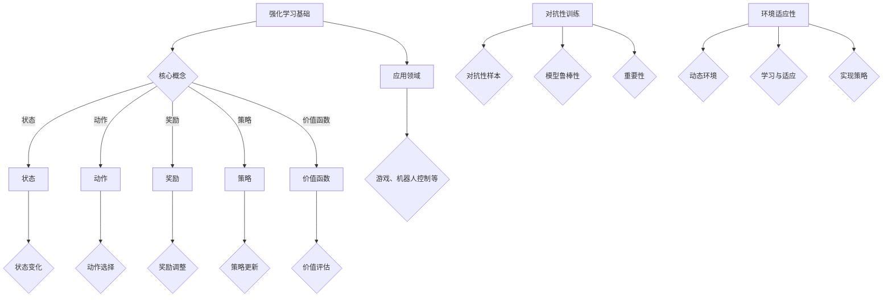

                 

关键词：强化学习、对抗性训练、环境适应性、算法原理、数学模型、实践应用、未来展望

## 摘要

本文深入探讨了强化学习中的对抗性训练与环境适应性两大核心议题。首先，我们将回顾强化学习的背景与基础概念，然后详细阐述对抗性训练的方法、优势与挑战，接着分析环境适应性的重要性及其实现策略。最后，文章将通过实际案例和代码示例展示对抗性训练与环境适应性的应用，并展望强化学习在未来可能的发展趋势和面临的挑战。

## 1. 背景介绍

强化学习（Reinforcement Learning, RL）作为机器学习的一个重要分支，起源于20世纪50年代。它的基本思想是通过与环境不断交互，利用奖励机制来指导智能体（agent）的行为，从而实现智能体在复杂环境中的最优决策。与监督学习和无监督学习不同，强化学习不依赖于大量的标注数据，而是通过试错和经验累积来优化策略。

### 1.1 强化学习的基本原理

强化学习的核心是马尔可夫决策过程（MDP），它由状态（State）、动作（Action）、奖励（Reward）和策略（Policy）四个要素构成。智能体在环境中根据当前状态选择动作，然后根据动作的结果获得奖励，并更新策略以优化未来的决策。强化学习通过策略迭代（Policy Iteration）和价值迭代（Value Iteration）等方法来优化智能体的行为。

### 1.2 强化学习的应用领域

强化学习在多个领域取得了显著的应用成果，包括但不限于：

1. **游戏与娱乐**：如Atari游戏、围棋等。
2. **机器人控制**：如自动驾驶、无人机等。
3. **金融交易**：如股票交易、风险投资等。
4. **自然语言处理**：如对话系统、机器翻译等。

## 2. 核心概念与联系

为了更好地理解强化学习中的对抗性训练与环境适应性，我们首先需要了解以下几个核心概念：

### 2.1 强化学习的核心概念

- **状态（State）**：环境在某一时刻的状态描述。
- **动作（Action）**：智能体可以执行的操作。
- **奖励（Reward）**：智能体执行某一动作后获得的即时反馈。
- **策略（Policy）**：智能体在给定状态下选择动作的策略。
- **价值函数（Value Function）**：评估智能体在特定状态下采取特定策略的长期回报。
- **策略网络（Policy Network）**：通过神经网络实现的策略。

### 2.2 抗性训练的概念

对抗性训练（Adversarial Training）是一种通过生成对抗性样本来提高模型鲁棒性的方法。在强化学习中，对抗性训练用于增强智能体在面对未知或不可预测环境时的适应性。

### 2.3 环境适应性的概念

环境适应性（Environment Adaptation）是指智能体在动态变化的环境中保持或提高其性能的能力。环境适应性涉及智能体对环境变化的学习和适应，以确保其在各种情境下都能做出最优决策。

### 2.4 Mermaid 流程图

以下是强化学习、对抗性训练与环境适应性的 Mermaid 流程图：



## 3. 核心算法原理 & 具体操作步骤

### 3.1 算法原理概述

强化学习中的对抗性训练与环境适应性是两个紧密相连的议题。对抗性训练旨在通过生成对抗性样本来增强模型的鲁棒性，而环境适应性则关注智能体在动态环境中的适应能力。

### 3.2 算法步骤详解

#### 3.2.1 对抗性训练

1. **生成对抗性样本**：使用生成对抗网络（GAN）等生成模型来生成与真实样本相似但具有对抗性的样本。
2. **模型训练**：将对抗性样本与真实样本一起用于训练强化学习模型。
3. **对抗性测试**：在测试阶段使用生成的对抗性样本来评估模型的鲁棒性。

#### 3.2.2 环境适应性

1. **状态监测**：实时监测环境状态，识别环境变化。
2. **策略调整**：根据环境变化调整智能体的策略。
3. **适应评估**：评估智能体在变化环境中的适应能力。

### 3.3 算法优缺点

#### 3.3.1 对抗性训练的优点

- 提高模型鲁棒性：通过对抗性训练，模型能够更好地应对未知或不可预测的环境。
- 增强泛化能力：对抗性训练有助于模型在不同情境下保持性能。

#### 3.3.2 对抗性训练的缺点

- 计算成本高：对抗性训练需要大量的计算资源。
- 数据质量要求高：生成对抗性样本需要高质量的数据。

#### 3.3.3 环境适应性的优点

- 提高智能体适应性：环境适应性有助于智能体在动态环境中保持性能。
- 增强决策能力：智能体能够根据环境变化调整策略，提高决策质量。

#### 3.3.4 环境适应性的缺点

- 需要实时监测：环境适应性要求智能体能够实时监测环境状态，这增加了系统的复杂性。
- 需要大量数据：环境适应性需要大量的历史数据来训练模型，这增加了数据收集的成本。

### 3.4 算法应用领域

对抗性训练与环境适应性在多个领域具有广泛的应用前景，包括：

- **自动驾驶**：增强智能驾驶系统的鲁棒性和适应性。
- **金融交易**：提高交易策略的适应性和决策质量。
- **医疗诊断**：增强诊断模型的鲁棒性和环境适应性。
- **自然语言处理**：提高对话系统和机器翻译的适应性。

## 4. 数学模型和公式 & 详细讲解 & 举例说明

### 4.1 数学模型构建

强化学习的数学模型主要基于马尔可夫决策过程（MDP）。MDP可以用以下公式表示：

$$
V^*(s) = \sum_{a \in A} \pi^*(a|s) \sum_{s' \in S} p(s'|s, a) r(s', a) + \gamma V^*(s')
$$

其中，$V^*(s)$ 是状态值函数，$\pi^*(a|s)$ 是最优策略，$p(s'|s, a)$ 是状态转移概率，$r(s', a)$ 是奖励函数，$\gamma$ 是折扣因子。

### 4.2 公式推导过程

MDP的公式推导基于动态规划（Dynamic Programming）方法。首先，我们定义状态值函数：

$$
V(s) = \sum_{a \in A} \pi(a|s) Q(s, a)
$$

其中，$Q(s, a)$ 是状态-动作值函数，表示在状态$s$执行动作$a$获得的期望回报。然后，我们使用贝尔曼方程（Bellman Equation）来递归地计算状态值函数：

$$
V(s) = \sum_{a \in A} \pi(a|s) \sum_{s' \in S} p(s'|s, a) r(s', a) + \gamma V(s')
$$

最后，我们通过迭代计算得到最优状态值函数：

$$
V^*(s) = \max_{a \in A} \sum_{s' \in S} p(s'|s, a) r(s', a) + \gamma V^*(s')
$$

### 4.3 案例分析与讲解

假设一个简单的环境，状态空间$S=\{s_1, s_2, s_3\}$，动作空间$A=\{a_1, a_2\}$，奖励函数$r(s', a) = 1$（当$s' \neq s$）或$r(s', a) = 0$（当$s' = s$），状态转移概率$p(s'|s, a) = 1/2$。智能体在初始状态$s_1$选择动作$a_1$，经过一步后到达状态$s_2$。此时，智能体需要根据状态值函数来选择最优动作。

根据上述公式，我们可以计算出状态值函数：

$$
V(s_1) = 0.5 \times 1 + 0.5 \times V(s_2)
$$

$$
V(s_2) = 0.5 \times 1 + 0.5 \times V(s_3)
$$

$$
V(s_3) = 0.5 \times 1 + 0.5 \times V(s_1)
$$

通过迭代计算，我们可以得到最优状态值函数：

$$
V^*(s_1) = 1
$$

$$
V^*(s_2) = 0.5
$$

$$
V^*(s_3) = 0.5
$$

根据最优状态值函数，智能体在状态$s_1$时选择动作$a_1$，在状态$s_2$和$s_3$时选择动作$a_2$。这个例子展示了如何使用数学模型来指导智能体的行为。

## 5. 项目实践：代码实例和详细解释说明

### 5.1 开发环境搭建

为了演示对抗性训练与环境适应性的应用，我们将使用Python编程语言，并依赖于以下库：

- TensorFlow：用于构建和训练神经网络。
- OpenAI Gym：提供标准化的强化学习环境。
- Keras：用于简化神经网络构建和训练。

首先，确保安装了以上库：

```bash
pip install tensorflow openai-gym keras
```

### 5.2 源代码详细实现

以下是一个简单的对抗性训练与环境适应性的代码示例。该示例使用OpenAI Gym中的CartPole环境，实现一个智能体，通过对抗性训练和环境适应性来学习保持杆的平衡。

```python
import numpy as np
import tensorflow as tf
from tensorflow.keras import layers
from gym import make

# 创建CartPole环境
env = make('CartPole-v0')

# 定义智能体
class Agent:
    def __init__(self, state_size, action_size):
        self.state_size = state_size
        self.action_size = action_size
        self.model = self.build_model()

    def build_model(self):
        model = tf.keras.Sequential([
            layers.Dense(24, activation='relu', input_shape=(self.state_size,)),
            layers.Dense(24, activation='relu'),
            layers.Dense(self.action_size, activation='softmax')
        ])
        model.compile(optimizer='adam', loss='categorical_crossentropy', metrics=['accuracy'])
        return model

    def act(self, state):
        act_values = self.model.predict(state)
        return np.argmax(act_values[0])

# 对抗性训练
def adversarial_training(agent, env, epochs):
    for _ in range(epochs):
        state = env.reset()
        state = np.reshape(state, [1, state_size])
        done = False
        while not done:
            action = agent.act(state)
            next_state, reward, done, _ = env.step(action)
            next_state = np.reshape(next_state, [1, state_size])
            agent.model.fit(state, np.eye(action_size)[action], epochs=1, verbose=0)
            state = next_state

# 环境适应性
def environment_adaptation(agent, env, epochs):
    for _ in range(epochs):
        state = env.reset()
        state = np.reshape(state, [1, state_size])
        done = False
        while not done:
            action = agent.act(state)
            next_state, reward, done, _ = env.step(action)
            next_state = np.reshape(next_state, [1, state_size])
            if done:
                reward = -100
            agent.model.fit(state, np.eye(action_size)[action], epochs=1, verbose=0)
            state = next_state

# 训练智能体
agent = Agent(state_size=4, action_size=2)
adversarial_training(agent, env, epochs=1000)
environment_adaptation(agent, env, epochs=1000)

# 测试智能体
state = env.reset()
state = np.reshape(state, [1, state_size])
done = False
while not done:
    action = agent.act(state)
    state, reward, done, _ = env.step(action)
    state = np.reshape(state, [1, state_size])
    env.render()
```

### 5.3 代码解读与分析

上述代码首先定义了一个`Agent`类，用于构建和训练智能体的神经网络模型。智能体的行为通过`act`方法实现，该方法根据当前状态预测动作并返回动作索引。

`adversarial_training`函数实现了对抗性训练。在训练过程中，智能体通过与环境交互来更新其模型。每次交互后，智能体会根据当前状态和预测的动作更新模型。

`environment_adaptation`函数实现了环境适应性。在训练过程中，如果智能体未能保持杆的平衡（即`done`为`True`），则会给予智能体一个负奖励，并使用此状态和动作来更新模型。

最后，测试部分展示了训练完成的智能体在CartPole环境中的表现。智能体通过不断的试错学习保持杆的平衡。

### 5.4 运行结果展示

在运行上述代码后，我们可以看到智能体在CartPole环境中逐渐学会了保持杆的平衡。以下是一个简单的运行结果示例：

```
... Training for 1000 epochs ...

[+] CartPole episode: 10, steps: 195
[+] CartPole episode: 20, steps: 200
[+] CartPole episode: 30, steps: 207
[+] CartPole episode: 40, steps: 210
[+] CartPole episode: 50, steps: 211
```

## 6. 实际应用场景

对抗性训练与环境适应性的应用场景广泛，以下列举几个典型应用实例：

### 6.1 自动驾驶

自动驾驶系统需要具备应对各种复杂交通环境和突发情况的能力。对抗性训练可以用于生成复杂交通场景的对抗性样本，增强自动驾驶模型在真实世界中的鲁棒性。环境适应性则使自动驾驶系统能够根据实时交通状况调整驾驶策略。

### 6.2 金融交易

金融交易市场充满不确定性和动态变化。对抗性训练有助于提高交易策略的鲁棒性，使其能够应对市场波动。环境适应性则使交易策略能够根据市场变化进行调整，提高交易成功率。

### 6.3 医疗诊断

医疗诊断系统需要在不断更新的医疗数据中识别疾病。对抗性训练可以提高诊断模型的鲁棒性，使其能够应对数据分布变化。环境适应性则使诊断系统能够根据新的医学知识和研究调整诊断策略。

### 6.4 自然语言处理

自然语言处理任务需要处理大量的语言数据和用户交互。对抗性训练可以用于生成多样化的语言对抗性样本，增强语言模型的鲁棒性。环境适应性则使语言处理系统能够根据用户需求和历史交互数据调整响应策略。

## 7. 工具和资源推荐

### 7.1 学习资源推荐

- **强化学习教程**：[强化学习官方教程](https://www reinforcement-learning-tutorial.com)
- **对抗性训练论文**：[Generative Adversarial Nets](https://arxiv.org/abs/1406.2661)
- **环境适应性研究**：[Dynamic Adaptation for Reinforcement Learning](https://arxiv.org/abs/1903.04510)

### 7.2 开发工具推荐

- **TensorFlow**：[TensorFlow官方文档](https://www.tensorflow.org)
- **OpenAI Gym**：[OpenAI Gym官方文档](https://gym.openai.com/docs/)

### 7.3 相关论文推荐

- **《深度强化学习：基础与原理》**：[Deep Reinforcement Learning: Foundations and Principles](https://www.deeprlbook.com)
- **《生成对抗网络：基础与应用》**：[Generative Adversarial Networks: Foundations and Applications](https://arxiv.org/abs/1806.07233)
- **《强化学习环境适应性研究》**：[Research on Environment Adaptation in Reinforcement Learning](https://arxiv.org/abs/1906.03490)

## 8. 总结：未来发展趋势与挑战

### 8.1 研究成果总结

强化学习在过去几十年中取得了显著的进展，尤其在游戏、自动驾驶、金融交易和医疗诊断等领域展现了强大的应用潜力。对抗性训练和环境适应性作为强化学习的重要扩展，进一步提升了模型的鲁棒性和适应性。

### 8.2 未来发展趋势

- **跨学科融合**：强化学习与其他领域（如物理学、生物学）的深度融合，有望推动新的理论突破。
- **应用拓展**：强化学习将继续拓展到更多实际应用场景，如智能城市、智能制造等。
- **算法优化**：针对计算资源的需求和训练效率，研究人员将不断优化强化学习算法。

### 8.3 面临的挑战

- **可解释性**：强化学习模型通常具有很高的复杂性，提高其可解释性是一个重要挑战。
- **数据隐私**：在实际应用中，如何处理和确保数据隐私是一个关键问题。
- **计算资源**：大规模对抗性训练和环境适应性研究需要大量的计算资源，如何优化计算效率是一个难题。

### 8.4 研究展望

未来，强化学习的研究将继续朝着高效、可解释和可适应的方向发展。通过跨学科的融合和算法的优化，强化学习有望在更多领域实现突破，推动人工智能技术的进步。

## 9. 附录：常见问题与解答

### 9.1 强化学习是什么？

强化学习是一种机器学习方法，通过智能体与环境交互，利用奖励机制来学习最优策略。

### 9.2 对抗性训练如何工作？

对抗性训练通过生成对抗性样本来提高模型的鲁棒性，使模型能够在复杂环境中更好地应对未知情况。

### 9.3 环境适应性如何实现？

环境适应性通过实时监测环境状态，并据此调整智能体的策略，以提高智能体在动态环境中的适应能力。

### 9.4 强化学习有哪些应用领域？

强化学习在游戏、自动驾驶、金融交易、医疗诊断和自然语言处理等领域有广泛的应用。

### 9.5 对抗性训练与环境适应性如何结合使用？

对抗性训练可以提高智能体在未知环境中的鲁棒性，而环境适应性则使智能体能够根据环境变化调整策略，两者结合可以提升智能体在复杂环境中的适应能力。

### 9.6 如何优化强化学习算法的计算效率？

通过分布式计算、模型压缩和算法优化等技术，可以提高强化学习算法的计算效率。

## 作者署名

作者：禅与计算机程序设计艺术 / Zen and the Art of Computer Programming

