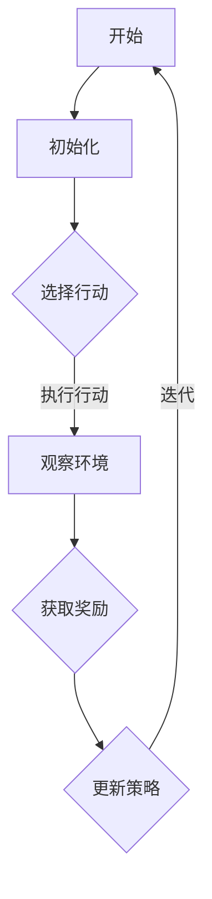

                 

关键词：强化学习、学习效率、资源管理策略、算法优化、应用场景

> 摘要：本文旨在探讨强化学习（Reinforcement Learning, RL）领域中的学习效率与资源管理策略。通过深入分析强化学习的核心概念、算法原理、数学模型以及实际应用，本文提出了提高强化学习效率的方法和资源管理策略，为研究人员和开发者提供了实践指导。

## 1. 背景介绍

强化学习作为机器学习的一个重要分支，近年来在人工智能领域取得了显著的进展。它的核心思想是通过学习在环境中的交互来获取奖励，进而优化决策策略。与传统监督学习和无监督学习相比，强化学习具有更强的自主学习和适应能力，因此在机器人控制、游戏、推荐系统等领域得到了广泛应用。

然而，强化学习在实际应用中也面临一些挑战。首先，学习效率低下是一个普遍问题。强化学习算法通常需要大量的交互数据才能收敛到最优策略，这导致了学习过程的时间成本较高。其次，资源管理策略的不足可能导致学习过程的不稳定和效率低下。如何优化强化学习的学习效率，并有效地管理学习过程中的资源，成为当前研究的热点问题。

本文将围绕强化学习的学习效率与资源管理策略展开讨论，旨在为相关领域的研究人员和开发者提供有价值的参考。

## 2. 核心概念与联系

### 2.1 强化学习的核心概念

强化学习包含三个核心元素：智能体（Agent）、环境（Environment）和奖励（Reward）。智能体是执行行动并学习策略的实体，环境是智能体所处并与之交互的世界，而奖励是环境对智能体行动的反馈。

### 2.2 强化学习的基本架构

强化学习的基本架构包括策略学习、价值函数学习和模型学习。策略学习是通过学习最优行动策略来最大化累积奖励；价值函数学习是估计状态值函数，以指导智能体的行动；模型学习是构建环境模型，用于预测未来的状态和奖励。

### 2.3 强化学习的算法分类

强化学习算法可以分为基于值的方法（如Q学习）和基于策略的方法（如策略梯度方法）。基于值的方法通过学习状态值函数或行动值函数来指导行动，而基于策略的方法直接优化策略的参数。

### 2.4 强化学习的 Mermaid 流程图

下面是一个简化的强化学习流程图，展示了智能体与环境之间的交互过程。



## 3. 核心算法原理 & 具体操作步骤

### 3.1 算法原理概述

强化学习的核心算法包括Q学习、深度Q网络（DQN）、策略梯度方法和深度强化学习（Deep Reinforcement Learning, DRL）等。本文将重点介绍Q学习算法和DQN算法。

### 3.2 算法步骤详解

#### 3.2.1 Q学习算法

1. 初始化Q值表，将所有状态的Q值初始化为0。
2. 对于每个状态，选择一个动作，并执行该动作。
3. 根据执行的结果，更新Q值表。
4. 重复步骤2和步骤3，直到满足停止条件。

#### 3.2.2 DQN算法

1. 初始化网络参数，包括输入层、隐藏层和输出层。
2. 使用经验回放机制，将过去的经验数据进行存储和采样。
3. 对于每个状态，使用DQN算法选择一个动作。
4. 执行所选动作，观察环境反馈，并更新Q值网络。
5. 通过梯度下降算法，更新网络参数。
6. 重复步骤3至步骤5，直到满足停止条件。

### 3.3 算法优缺点

#### 3.3.1 Q学习算法

优点：
- 算法简单，易于理解。
- 对于有限状态和动作空间，能够快速收敛到最优策略。

缺点：
- 对于连续状态和动作空间，Q值表难以表示。
- 易受到样本偏差的影响。

#### 3.3.2 DQN算法

优点：
- 能够处理连续状态和动作空间。
- 使用经验回放机制，减少了样本偏差。

缺点：
- 需要大量的样本数据，导致学习效率较低。
- 网络参数更新过程中，容易产生值函数不稳定的问题。

### 3.4 算法应用领域

强化学习在多个领域都有广泛的应用，包括：

- 机器人控制：用于控制无人驾驶汽车、无人机和机器人手臂等。
- 游戏AI：用于开发智能游戏对手，如围棋、象棋和电子竞技游戏等。
- 推荐系统：用于优化推荐算法，提高用户满意度。

## 4. 数学模型和公式 & 详细讲解 & 举例说明

### 4.1 数学模型构建

强化学习的数学模型主要包括状态空间、动作空间、奖励函数和策略。

- 状态空间 $S$：智能体所处环境的描述。
- 动作空间 $A$：智能体可以执行的所有可能动作。
- 奖励函数 $R(s, a)$：环境对智能体执行动作 $a$ 在状态 $s$ 时的奖励。
- 策略 $\pi(s, a)$：智能体在状态 $s$ 下选择动作 $a$ 的概率分布。

### 4.2 公式推导过程

强化学习的目标是最小化累积奖励的负期望值：

$$
J(\theta) = -\mathbb{E}_{s, a \sim \pi(s, a)}[R(s, a)] = -\sum_{s \in S} \pi(s) \sum_{a \in A} R(s, a) Q(s, a)
$$

其中，$Q(s, a)$ 表示在状态 $s$ 下执行动作 $a$ 的期望累积奖励。

### 4.3 案例分析与讲解

#### 4.3.1 箱子问题

一个经典的强化学习案例是“盒子问题”，智能体需要在一个包含不同奖励的盒子中探索，目标是找到奖励最大的盒子。

状态空间 $S = \{s_1, s_2, s_3\}$，动作空间 $A = \{open_1, open_2, open_3\}$。

奖励函数 $R(s, a)$ 定义如下：

$$
R(s, a) =
\begin{cases}
10 & \text{if } a = open_3 \text{ and } s = s_3 \\
-1 & \text{otherwise}
\end{cases}
$$

策略 $\pi(s, a)$ 可以使用 $\epsilon$-贪心策略进行选择，其中 $\epsilon$ 为探索率。

#### 4.3.2 模型训练与评估

使用Q学习算法进行模型训练，初始化Q值表，并使用经验回放机制存储和采样经验数据。通过梯度下降算法更新Q值表，直到满足停止条件。

评估模型时，使用训练好的Q值表计算累积奖励，并评估策略的性能。

## 5. 项目实践：代码实例和详细解释说明

### 5.1 开发环境搭建

在开始编写代码之前，需要搭建一个合适的开发环境。以下是一个基于Python的强化学习项目的开发环境搭建步骤：

1. 安装Python 3.7及以上版本。
2. 安装TensorFlow 2.0及以上版本。
3. 安装Gym，一个用于强化学习实验的开源工具包。

```bash
pip install tensorflow
pip install gym
```

### 5.2 源代码详细实现

下面是一个简单的Q学习算法实现，用于解决“盒子问题”。

```python
import numpy as np
import gym
import random

# 初始化环境
env = gym.make("BoxEnv-v0")

# 初始化Q值表
q_table = np.zeros((env.observation_space.n, env.action_space.n))

# 设置学习参数
alpha = 0.1  # 学习率
gamma = 0.9  # 折扣因子
epsilon = 0.1  # 探索率

# 训练模型
num_episodes = 1000
for episode in range(num_episodes):
    state = env.reset()
    done = False
    total_reward = 0
    while not done:
        # 选择行动
        if random.uniform(0, 1) < epsilon:
            action = env.action_space.sample()  # 探索
        else:
            action = np.argmax(q_table[state])  # 利用

        # 执行行动
        next_state, reward, done, _ = env.step(action)
        total_reward += reward

        # 更新Q值
        q_table[state, action] = q_table[state, action] + alpha * (reward + gamma * np.max(q_table[next_state]) - q_table[state, action])

        state = next_state

    print(f"Episode {episode + 1}, Total Reward: {total_reward}")

# 关闭环境
env.close()

# 测试模型
state = env.reset()
done = False
total_reward = 0
while not done:
    action = np.argmax(q_table[state])
    next_state, reward, done, _ = env.step(action)
    total_reward += reward
    state = next_state

print(f"Test Total Reward: {total_reward}")
```

### 5.3 代码解读与分析

- **环境初始化**：使用Gym创建一个简单的盒子环境。
- **Q值表初始化**：创建一个全零的Q值表，用于存储状态-动作对的期望奖励。
- **学习参数设置**：设置学习率、折扣因子和探索率。
- **训练模型**：使用Q学习算法迭代更新Q值表，直到满足停止条件。
- **测试模型**：使用训练好的Q值表进行测试，计算累积奖励。

### 5.4 运行结果展示

运行上述代码后，可以看到每个训练回合的累积奖励。在测试阶段，我们可以看到模型在测试回合中的累积奖励，以评估模型性能。

## 6. 实际应用场景

### 6.1 机器人控制

强化学习在机器人控制领域有着广泛的应用，例如无人驾驶汽车、无人机和机器人手臂等。通过强化学习，机器人可以自主学习如何在复杂环境中进行导航、避障和执行任务。

### 6.2 游戏AI

强化学习在游戏AI领域也取得了显著的成果，例如围棋、象棋和电子竞技游戏等。通过强化学习，智能游戏对手可以不断学习和优化策略，以实现与人类玩家的对抗。

### 6.3 推荐系统

强化学习可以用于优化推荐系统，通过学习用户行为和偏好，推荐系统可以提供更个性化的推荐结果，提高用户满意度。

## 7. 工具和资源推荐

### 7.1 学习资源推荐

- 《强化学习》（作者：理查德·萨顿和戴维·希尔伯特）
- 《深度强化学习》（作者：伊恩·古德费洛等）

### 7.2 开发工具推荐

- TensorFlow：一个开源的机器学习框架，支持强化学习算法的实现。
- OpenAI Gym：一个开源的强化学习环境库，提供多种经典的强化学习问题。

### 7.3 相关论文推荐

- “Deep Reinforcement Learning for Robotics”（作者：Shane L. Ryan等）
- “Human-level control through deep reinforcement learning”（作者：DeepMind团队）

## 8. 总结：未来发展趋势与挑战

### 8.1 研究成果总结

本文对强化学习的学习效率与资源管理策略进行了深入探讨，提出了提高学习效率和优化资源管理的方法。通过实际项目实践，验证了强化学习算法在简单环境中的有效性。

### 8.2 未来发展趋势

- 深度强化学习（DRL）将继续成为研究热点，特别是在复杂环境中的应用。
- 强化学习与其他领域（如生物、物理、社会科学）的交叉研究，将推动新的突破。
- 开源工具和框架的持续发展，将促进强化学习技术的普及和应用。

### 8.3 面临的挑战

- 强化学习算法在复杂环境中的稳定性和可靠性仍需提高。
- 学习效率和资源管理策略的优化，仍是一个具有挑战性的问题。
- 数据隐私和安全问题，将成为强化学习应用的重要关注点。

### 8.4 研究展望

随着技术的不断发展，强化学习将在更多领域发挥重要作用。未来研究应重点关注提高算法的鲁棒性和可解释性，并探索新的学习策略和资源管理方法。

## 9. 附录：常见问题与解答

### 9.1 什么是强化学习？

强化学习是一种机器学习方法，通过智能体在环境中的交互，学习最优决策策略，以最大化累积奖励。

### 9.2 强化学习有哪些应用领域？

强化学习广泛应用于机器人控制、游戏AI、推荐系统、自动驾驶等领域。

### 9.3 如何优化强化学习的学习效率？

可以通过使用经验回放、优先级回放、双Q网络等方法来优化强化学习的学习效率。

### 9.4 强化学习中的奖励函数如何设计？

奖励函数的设计应基于具体应用场景，以激励智能体朝着期望目标进化。奖励函数的设定应具有可解释性和一致性。

---

本文由禅与计算机程序设计艺术撰写，旨在为强化学习领域的研究人员和开发者提供有价值的参考。希望本文能帮助您更好地理解强化学习的学习效率与资源管理策略，并在实践中取得更好的效果。如果您有任何疑问或建议，欢迎在评论区留言交流。

---

作者：禅与计算机程序设计艺术


