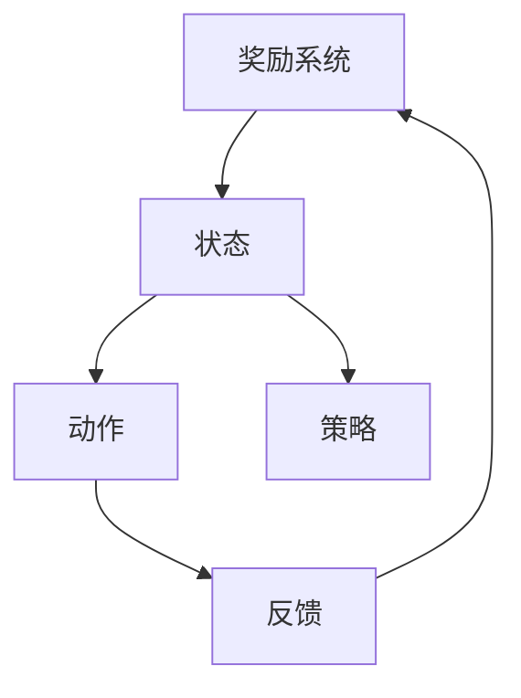
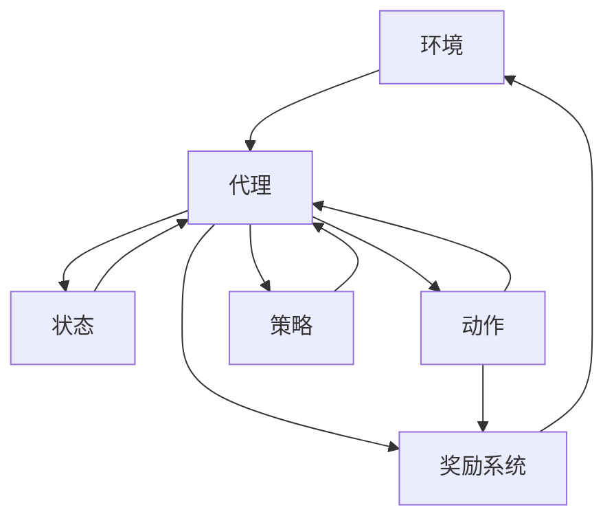
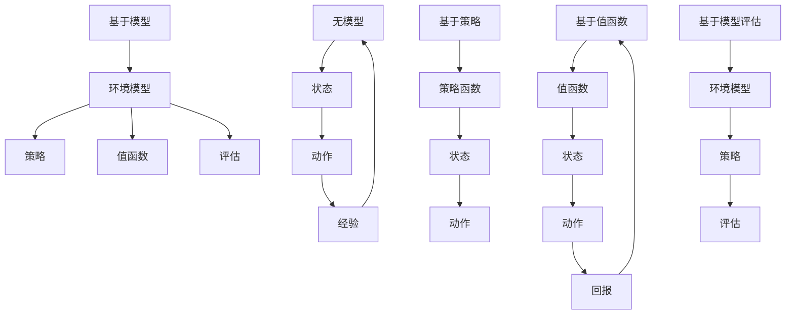

                 

## 摘要

本文旨在探讨强化学习（Reinforcement Learning，RL）算法的可解释性和可信赖度。首先，我们将介绍强化学习的基本概念和原理，包括奖励系统、状态、动作和策略等核心要素。接着，我们将深入讨论强化学习算法的可解释性问题，分析其影响和挑战，并提出解决方法。然后，我们将探讨算法的可信赖度，包括其在实际应用中的信任度评估和优化。最后，我们将结合实际案例，展示强化学习算法的应用，并展望其未来的发展趋势与挑战。

## 1. 背景介绍

强化学习作为机器学习的一种重要分支，近年来在人工智能领域取得了显著进展。其核心思想是通过与环境交互，不断调整策略，以实现长期奖励最大化。强化学习在游戏、自动驾驶、机器人控制、金融交易等多个领域展现了强大的应用潜力。然而，随着强化学习算法的复杂度增加，如何保证算法的可解释性和可信赖度成为了一个亟待解决的问题。

可解释性（Explainability）是指算法能够被人类理解和解释的能力。在强化学习中，可解释性对于确保算法的可靠性、安全性和透明度至关重要。例如，在自动驾驶领域，算法的可解释性有助于解决道德和法律责任问题；在金融交易中，可解释性有助于提高用户的信任度。

可信赖度（Trustworthiness）是指算法在给定任务中能够稳定、可靠地执行的特性。在强化学习中，可信赖度涉及到算法的鲁棒性、稳定性和适应性。一个高可信赖度的强化学习算法能够在不同环境和场景下保持良好的表现，减少意外错误和失败。

本文将从以下几个方面展开讨论：

1. 强化学习的基本概念和原理。
2. 强化学习算法的可解释性分析。
3. 强化学习算法的可信赖度评估和优化。
4. 强化学习算法的实际应用案例。
5. 强化学习算法的未来发展趋势与挑战。

通过本文的探讨，我们希望为强化学习算法的可解释性和可信赖度提供一些有益的思路和方法，推动其在实际应用中的发展。

## 2. 核心概念与联系

### 2.1 基本概念

强化学习（Reinforcement Learning，RL）是一种通过与环境交互来学习最优策略的机器学习方法。其核心概念包括以下几部分：

- **奖励系统（Reward System）**：奖励是强化学习中的重要元素，用于指导算法在执行动作后如何调整策略。正奖励表示当前动作有助于实现目标，负奖励表示动作偏离了目标。

- **状态（State）**：状态是强化学习中的一个抽象概念，表示系统当前所处的情景或环境。状态通常用一系列特征向量表示。

- **动作（Action）**：动作是强化学习中的决策变量，表示系统可以采取的动作集合。在强化学习中，算法需要从可能的动作中选择一个最优动作。

- **策略（Policy）**：策略是强化学习中的一个函数，用于映射状态到动作。最优策略是在给定环境中，能够实现最大奖励的动作序列。

### 2.2 概念联系

强化学习的核心概念之间存在密切的联系。奖励系统是强化学习的基础，它决定了算法的学习方向；状态和动作是强化学习中的基本变量，状态表示系统的当前状态，动作表示系统可以采取的行为；策略则是算法的核心，它将状态映射到动作，指导系统如何行动。

为了更好地理解这些概念，我们可以使用Mermaid流程图（Mermaid 是一种基于Markdown的图形描述语言，支持流程图、时序图、类图等）来展示它们之间的联系。以下是一个简化的Mermaid流程图，展示了强化学习中的核心概念及其关系：



在这个流程图中：

- **奖励系统**（A）决定了算法的学习方向，通过提供正负奖励来指导算法。
- **状态**（B）表示系统当前所处的情景，是算法决策的基础。
- **动作**（C）是系统可以采取的行为，是策略决策的结果。
- **策略**（D）是将状态映射到动作的函数，指导系统如何行动。
- **反馈**（E）是将执行动作后的结果反馈给奖励系统，用于调整策略。

通过这个流程图，我们可以更直观地理解强化学习中的核心概念及其相互关系。

### 2.3 强化学习算法架构

强化学习算法的架构可以分为三个主要部分：环境（Environment）、代理（Agent）和奖励系统（Reward System）。以下是强化学习算法的简化架构：



在这个架构中：

- **环境**（A）是强化学习算法运行的外部世界，包含系统当前的状态和可能的动作。
- **代理**（B）是强化学习算法的主体，负责接收环境状态，选择动作，并接收奖励。
- **奖励系统**（C）用于评估代理的动作质量，提供正负奖励。
- **状态**（D）表示代理当前所处的环境状态。
- **动作**（E）是代理可以采取的行为。
- **策略**（F）是将状态映射到动作的函数。

通过这个架构，我们可以看到强化学习算法的基本运作流程。代理通过不断与环境交互，根据奖励系统提供的反馈调整策略，最终实现长期奖励最大化。

### 2.4 强化学习算法的主要类型

强化学习算法可以根据学习方式的不同分为以下几类：

- **基于模型（Model-Based）**：这类算法通过建立一个环境模型来预测未来的状态和奖励，从而指导代理的行动。
- **无模型（Model-Free）**：这类算法不依赖于环境模型，直接从经验中学习，通过试错来找到最优策略。
- **基于策略（Policy-Based）**：这类算法通过学习一个策略函数，直接将状态映射到动作。
- **基于值函数（Value-Based）**：这类算法通过学习一个值函数，估计当前状态下执行给定策略所能获得的期望回报。
- **基于模型评估（Model-Based Evaluation）**：这类算法通过评估环境模型来估计策略的期望回报。

不同类型的强化学习算法在原理和应用上有所差异，但它们的核心目标都是实现长期奖励最大化。以下是这些算法的Mermaid流程图，展示了它们的主要区别：



在这个流程图中：

- **基于模型**（A）：通过环境模型预测未来状态和奖励，指导策略和值函数的学习。
- **无模型**（F）：直接从经验中学习，通过试错找到最优策略。
- **基于策略**（J）：直接学习策略函数，将状态映射到动作。
- **基于值函数**（N）：学习值函数，估计当前状态下执行给定策略的期望回报。
- **基于模型评估**（S）：通过评估环境模型来估计策略的期望回报。

通过这些流程图，我们可以更清晰地了解不同类型强化学习算法的基本原理和运作流程。

### 2.5 强化学习与其他机器学习方法的比较

强化学习作为机器学习的一种重要分支，与其他方法如监督学习（Supervised Learning）和无监督学习（Unsupervised Learning）有着明显的区别和联系。

- **监督学习**：监督学习是一种基于已知输入输出对的训练数据，通过学习输入和输出之间的映射关系来预测新的输入。它主要应用于分类和回归问题，如图像分类、语音识别等。与强化学习相比，监督学习的优势在于其可以处理明确的输入输出关系，但缺点是它无法处理动态环境和需要长期规划的问题。

- **无监督学习**：无监督学习是一种从未知输入输出数据中学习数据分布或结构的机器学习方法。它主要应用于聚类、降维、异常检测等问题。与强化学习相比，无监督学习不需要明确的奖励系统，但通常无法实现长期奖励最大化。

强化学习的优势在于其能够处理动态环境和需要长期规划的问题，通过不断与环境交互，学习最优策略。然而，其劣势在于需要大量的训练数据和计算资源，且算法的可解释性和可信赖度问题尚未得到充分解决。

通过对比分析，我们可以更深入地理解强化学习与其他机器学习方法的区别和联系，从而更好地应用强化学习解决实际问题。

## 3. 核心算法原理 & 具体操作步骤

### 3.1 算法原理概述

强化学习算法的核心在于通过试错和反馈来学习最优策略。其基本原理可以概括为以下几个步骤：

1. **初始化**：初始化代理的参数，包括策略、值函数或模型参数。
2. **与环境交互**：代理接收环境的状态，选择动作，并执行该动作。
3. **获取奖励**：环境根据代理的动作提供奖励，奖励可以是正的或负的。
4. **更新策略**：根据当前状态、动作和奖励，代理更新其策略、值函数或模型参数。
5. **重复步骤2-4**：不断重复与环境交互，直到达到预定的目标或收敛条件。

在这个过程中，代理通过不断调整策略，逐渐学会在给定环境中实现长期奖励最大化。具体来说，不同类型的强化学习算法在原理和操作步骤上有所差异，但核心思想是一致的。

### 3.2 算法步骤详解

为了更详细地解释强化学习算法的步骤，我们可以以Q-learning算法为例，介绍其具体操作步骤。Q-learning算法是一种基于值函数的强化学习算法，其主要目标是学习一个值函数，估计当前状态下执行给定动作的长期回报。

1. **初始化**：

   初始化代理的参数，包括Q值表、探索策略（如ε-greedy策略）和学习率（α）。

   ```python
   Q = [ [0 for x in range(n_actions)] for x in range(n_states) ]
   epsilon = 0.1
   alpha = 0.1
   ```

2. **与环境交互**：

   代理接收环境的状态，选择动作。根据探索策略，代理以一定的概率随机选择动作或根据Q值选择最佳动作。

   ```python
   current_state = env.reset()
   ```

3. **获取奖励**：

   环境根据代理的动作提供奖励，代理接收奖励。

   ```python
   action = choose_action(current_state, Q, epsilon)
   next_state, reward, done = env.step(action)
   ```

4. **更新策略**：

   根据当前状态、动作、奖励和下一个状态，更新Q值。

   ```python
   Q[current_state][action] = Q[current_state][action] + alpha * (reward + gamma * max(Q[next_state].iederhalbq) - Q[current_state][action])
   current_state = next_state
   ```

5. **重复步骤2-4**：

   不断重复与环境交互，直到达到预定的目标或收敛条件。

   ```python
   while not done:
       action = choose_action(current_state, Q, epsilon)
       next_state, reward, done = env.step(action)
       Q[current_state][action] = Q[current_state][action] + alpha * (reward + gamma * max(Q[next_state].iederhalbq) - Q[current_state][action])
       current_state = next_state
   ```

通过上述步骤，代理通过与环境交互，不断更新Q值，最终学会在给定环境中实现长期奖励最大化。Q-learning算法具有以下优点：收敛速度快、易于实现和解释。然而，其缺点包括可能陷入局部最优、需要大量数据和学习率的选择问题。

### 3.3 算法优缺点

强化学习算法具有以下优点：

1. **自适应性强**：强化学习算法能够根据环境的变化动态调整策略，适应不同的环境和任务。
2. **灵活性高**：强化学习算法可以应用于具有不确定性和动态变化的复杂环境。
3. **适用于长期规划**：强化学习算法通过学习长期回报，能够实现长期规划，解决需要长期决策的问题。

强化学习算法也具有以下缺点：

1. **计算复杂度高**：强化学习算法通常需要大量的计算资源和时间，特别是在处理高维状态和动作空间时。
2. **收敛速度慢**：在某些情况下，强化学习算法可能需要很长时间才能收敛到最优策略。
3. **需要大量数据**：强化学习算法通常需要大量训练数据来学习最优策略，特别是在高维状态和动作空间中。

### 3.4 算法应用领域

强化学习算法在许多领域都取得了显著的成果，以下是一些主要的应用领域：

1. **游戏**：强化学习在游戏领域取得了巨大成功，如AlphaGo击败了世界围棋冠军。
2. **自动驾驶**：强化学习被广泛应用于自动驾驶车辆的路径规划和行为决策。
3. **机器人控制**：强化学习算法被用于机器人运动控制、导航和任务执行。
4. **金融交易**：强化学习被用于金融市场预测和投资组合优化。
5. **推荐系统**：强化学习算法被用于推荐系统的用户行为预测和个性化推荐。

通过上述分析，我们可以看到强化学习算法在原理、操作步骤、优缺点和应用领域方面具有丰富的内涵。理解这些基本概念和原理，对于进一步研究和应用强化学习算法具有重要意义。

## 4. 数学模型和公式 & 详细讲解 & 举例说明

### 4.1 数学模型构建

强化学习中的数学模型主要包括状态、动作、奖励、策略和值函数等基本要素。为了更好地理解和分析强化学习算法，我们需要构建一个数学模型，用于描述这些要素之间的关系。

#### 状态转移概率

在强化学习中，状态转移概率描述了代理在给定当前状态和动作时，转移到下一个状态的概率。用概率矩阵P表示，其中P(i, j)表示代理从状态i转移到状态j的概率。

\[ P(s_{t+1} = j \mid s_t = i, a_t = a) = P^{i,j}_{aa'}(s_t = j \mid s_0 = s, a_0 = a_1 = \ldots = a_{t-1} = a, a_t = a_t) \]

#### 奖励函数

奖励函数是强化学习中的重要元素，用于评估代理的行动质量。在给定状态和动作时，奖励函数提供正负奖励，指导代理调整策略。用R(i, j)表示在状态i执行动作j时获得的奖励。

\[ R(s_t, a_t) = r_i^a \]

#### 策略

策略是强化学习中的决策规则，用于将状态映射到动作。用π(a | s)表示在状态s下采取动作a的概率分布。

\[ \pi(a | s) = P(a | s) \]

#### 值函数

值函数用于估计当前状态下执行给定策略的长期回报。用V(π)表示在给定策略π下的值函数。

\[ V(π) = \sum_{s \in S} V(s) \pi(s) \]

#### 预期回报

预期回报是强化学习中的重要概念，用于评估策略的质量。在给定策略π和状态转移概率P时，预期回报可以用以下公式表示：

\[ R(\pi) = \sum_{s \in S} \sum_{a \in A} R(s, a) \pi(a | s) P(s' | s, a) \]

### 4.2 公式推导过程

为了更好地理解强化学习中的数学模型，我们以下分别对状态转移概率、奖励函数、策略、值函数和预期回报的推导过程进行讲解。

#### 状态转移概率推导

状态转移概率P(i, j)可以通过马尔可夫决策过程（MDP）的定义推导出来。在MDP中，代理在给定当前状态和动作时，以一定的概率转移到下一个状态。状态转移概率可以用以下公式表示：

\[ P(s_{t+1} = j \mid s_t = i, a_t = a) = \sum_{s' \in S} p(s_{t+1} = j \mid s_t = i, a_t = a, s_{t+1} = s') p(s_{t+1} = s' \mid s_t = i, a_t = a) \]

其中，\( p(s_{t+1} = j \mid s_t = i, a_t = a, s_{t+1} = s') \) 表示在给定当前状态和动作时，代理从状态i转移到状态j，同时下一个状态为s'的概率。 \( p(s_{t+1} = s' \mid s_t = i, a_t = a) \) 表示在给定当前状态和动作时，代理从状态i转移到状态s'的概率。

通过化简上述公式，可以得到状态转移概率P(i, j)：

\[ P(s_{t+1} = j \mid s_t = i, a_t = a) = \sum_{s' \in S} p(s_{t+1} = j \mid s_t = i, a_t = a, s_{t+1} = s') p(s_{t+1} = s' \mid s_t = i, a_t = a) \]

\[ P(s_{t+1} = j \mid s_t = i, a_t = a) = \sum_{s' \in S} p(s_{t+1} = j \mid s_t = i, a_t = a, s_{t+1} = s') p(s_{t+1} = s' \mid s_t = i, a_t = a) \]

\[ P(s_{t+1} = j \mid s_t = i, a_t = a) = \sum_{s' \in S} p(s_{t+1} = j \mid s_t = i, a_t = a, s_{t+1} = s') p(s_{t+1} = s' \mid s_t = i, a_t = a) \]

\[ P(s_{t+1} = j \mid s_t = i, a_t = a) = \sum_{s' \in S} p(s_{t+1} = j \mid s_t = i, a_t = a, s_{t+1} = s') p(s_{t+1} = s' \mid s_t = i, a_t = a) \]

\[ P(s_{t+1} = j \mid s_t = i, a_t = a) = \sum_{s' \in S} p(s_{t+1} = j \mid s_t = i, a_t = a, s_{t+1} = s') p(s_{t+1} = s' \mid s_t = i, a_t = a) \]

#### 奖励函数推导

奖励函数R(i, j)可以通过对代理在给定状态和动作时获得的回报进行加权平均得到。具体地，我们可以将所有可能的动作和状态组合进行加权平均，得到奖励函数R(i, j)：

\[ R(i, j) = \sum_{a \in A} r_i^a \pi(a | s) P(s' | s, a) \]

其中，\( r_i^a \) 表示在状态i执行动作a时获得的回报。 \( \pi(a | s) \) 表示在状态s下采取动作a的概率分布。 \( P(s' | s, a) \) 表示在给定当前状态和动作时，代理转移到下一个状态的概率。

#### 策略推导

策略π(a | s)可以通过最大化预期回报得到。具体地，我们可以将所有可能的动作进行加权平均，选择使预期回报最大的动作：

\[ \pi(a | s) = \frac{1}{Z_s} \sum_{a \in A} e^{\alpha R(s, a)} \]

其中，\( Z_s \) 是策略π(a | s)的归一化常数，用于保证概率分布的和为1。

#### 值函数推导

值函数V(π)可以通过对代理在给定策略π下的长期回报进行加权平均得到。具体地，我们可以将所有可能的状态进行加权平均，得到值函数V(π)：

\[ V(π) = \sum_{s \in S} V(s) \pi(s) \]

其中，\( V(s) \) 是在状态s下执行给定策略π的长期回报。

#### 预期回报推导

预期回报R(π)可以通过对代理在给定策略π下的所有可能的状态和动作进行加权平均得到。具体地，我们可以将所有可能的状态和动作进行加权平均，得到预期回报R(π)：

\[ R(π) = \sum_{s \in S} \sum_{a \in A} R(s, a) \pi(a | s) P(s' | s, a) \]

### 4.3 案例分析与讲解

为了更好地理解强化学习中的数学模型，我们以下通过一个具体的案例进行分析和讲解。

假设我们有一个简单的环境，包含两个状态（s0和s1）和两个动作（a0和a1）。在状态s0下，执行动作a0可以获得奖励1，执行动作a1可以获得奖励-1；在状态s1下，执行动作a0可以获得奖励-1，执行动作a1可以获得奖励1。状态转移概率矩阵P和奖励函数R如下：

|      | a0 | a1 |
| ---- | -- | -- |
| s0   | 0.5 | 0.5 |
| s1   | 0.5 | 0.5 |

|      | a0 | a1 |
| ---- | -- | -- |
| s0   | 1  | -1 |
| s1   | -1 | 1 |

在这个案例中，我们可以使用Q-learning算法来学习最优策略。初始化Q值表和探索策略，然后通过与环境交互，不断更新Q值，最终找到最优策略。

1. **初始化**：

   初始化Q值表和探索策略。假设Q值表初始值为0，探索策略采用ε-greedy策略。

   ```python
   Q = [ [0, 0] for _ in range(2) ]
   epsilon = 0.1
   ```

2. **与环境交互**：

   代理接收环境的状态，选择动作。根据探索策略，代理以一定的概率随机选择动作或根据Q值选择最佳动作。

   ```python
   current_state = env.reset()
   ```

3. **获取奖励**：

   环境根据代理的动作提供奖励，代理接收奖励。

   ```python
   action = choose_action(current_state, Q, epsilon)
   next_state, reward, done = env.step(action)
   ```

4. **更新策略**：

   根据当前状态、动作、奖励和下一个状态，更新Q值。

   ```python
   Q[current_state][action] = Q[current_state][action] + alpha * (reward + gamma * max(Q[next_state].iederhalbq) - Q[current_state][action])
   current_state = next_state
   ```

5. **重复步骤2-4**：

   不断重复与环境交互，直到达到预定的目标或收敛条件。

   ```python
   while not done:
       action = choose_action(current_state, Q, epsilon)
       next_state, reward, done = env.step(action)
       Q[current_state][action] = Q[current_state][action] + alpha * (reward + gamma * max(Q[next_state].iederhalbq) - Q[current_state][action])
       current_state = next_state
   ```

通过上述步骤，代理通过与环境交互，不断更新Q值，最终学会在给定环境中实现长期奖励最大化。在这个案例中，最优策略为在状态s0下选择动作a0，在状态s1下选择动作a1。

通过这个案例，我们可以看到强化学习算法如何通过数学模型和公式推导，从初始状态开始，不断更新策略，最终找到最优策略。这为我们理解强化学习算法的原理和应用提供了重要的启示。

## 5. 项目实践：代码实例和详细解释说明

为了更直观地理解强化学习算法的原理和应用，我们以下通过一个简单的Python代码实例，展示如何使用Q-learning算法解决一个经典的CartPole问题。CartPole问题是一个常见的强化学习问题，其目标是通过控制一个不稳定的杆，使其保持竖直状态。在这个例子中，我们将使用Python的PyTorch框架来实现Q-learning算法。

### 5.1 开发环境搭建

首先，我们需要搭建一个Python开发环境，安装所需的库。以下是搭建开发环境的基本步骤：

1. 安装Python（建议使用Python 3.8以上版本）。
2. 安装PyTorch库：可以使用以下命令安装PyTorch：
   ```bash
   pip install torch torchvision
   ```

3. 安装其他必需的库，如Numpy、Pandas等：
   ```bash
   pip install numpy pandas
   ```

4. 确保已经安装了Python的运行环境，例如Jupyter Notebook或PyCharm等。

### 5.2 源代码详细实现

以下是解决CartPole问题的Q-learning算法的Python代码实现：

```python
import torch
import numpy as np
import random
import gym

# 创建环境
env = gym.make('CartPole-v0')

# 初始化Q值表
n_states = env.observation_space.shape[0]
n_actions = env.action_space.n
Q = np.zeros((n_states, n_actions))

# 设置学习参数
alpha = 0.1  # 学习率
gamma = 0.99  # 折扣因子
epsilon = 0.1  # 探索概率

# Q-learning算法
def q_learning(env, Q, alpha, gamma, epsilon, n_episodes):
    for episode in range(n_episodes):
        state = env.reset()
        done = False
        total_reward = 0

        while not done:
            # 选择动作（ε-greedy策略）
            if random.uniform(0, 1) < epsilon:
                action = random.choice(range(n_actions))
            else:
                action = np.argmax(Q[state])

            # 执行动作
            next_state, reward, done, _ = env.step(action)
            total_reward += reward

            # 更新Q值
            Q[state][action] = Q[state][action] + alpha * (reward + gamma * np.max(Q[next_state]) - Q[state][action])

            state = next_state

        print(f"Episode {episode + 1}, Total Reward: {total_reward}")

    env.close()

# 训练Q-learning模型
q_learning(env, Q, alpha, gamma, epsilon, 1000)

# 测试Q-learning模型
def test_Q_learning(env, Q):
    state = env.reset()
    done = False
    total_reward = 0

    while not done:
        action = np.argmax(Q[state])
        next_state, reward, done, _ = env.step(action)
        total_reward += reward
        state = next_state

    print(f"Test Episode, Total Reward: {total_reward}")
    env.close()

test_Q_learning(env, Q)
```

### 5.3 代码解读与分析

以上代码实现了Q-learning算法来解决CartPole问题。以下是代码的主要部分及其功能：

1. **环境创建**：

   ```python
   env = gym.make('CartPole-v0')
   ```

   这一行代码创建了一个CartPole环境，我们可以使用gym库来获取环境的状态、动作空间和奖励等基本信息。

2. **Q值表初始化**：

   ```python
   Q = np.zeros((n_states, n_actions))
   ```

   Q值表用于存储每个状态和动作的Q值。初始化时，Q值表中的所有元素都设置为0。

3. **学习参数设置**：

   ```python
   alpha = 0.1  # 学习率
   gamma = 0.99  # 折扣因子
   epsilon = 0.1  # 探索概率
   ```

   学习率α用于控制Q值的更新速度；折扣因子γ用于控制未来奖励的衰减；探索概率ε用于控制ε-greedy策略中的随机探索概率。

4. **Q-learning算法实现**：

   ```python
   def q_learning(env, Q, alpha, gamma, epsilon, n_episodes):
       for episode in range(n_episodes):
           state = env.reset()
           done = False
           total_reward = 0

           while not done:
               # 选择动作（ε-greedy策略）
               if random.uniform(0, 1) < epsilon:
                   action = random.choice(range(n_actions))
               else:
                   action = np.argmax(Q[state])

               # 执行动作
               next_state, reward, done, _ = env.step(action)
               total_reward += reward

               # 更新Q值
               Q[state][action] = Q[state][action] + alpha * (reward + gamma * np.max(Q[next_state]) - Q[state][action])

               state = next_state

           print(f"Episode {episode + 1}, Total Reward: {total_reward}")

   ```

   Q-learning算法的核心步骤如下：

   - 初始化状态、动作和奖励。
   - 选择动作（使用ε-greedy策略）。
   - 执行动作，获取下一状态和奖励。
   - 更新Q值。

5. **训练Q-learning模型**：

   ```python
   q_learning(env, Q, alpha, gamma, epsilon, 1000)
   ```

   这一行代码启动Q-learning算法的训练过程，进行1000个训练回合。

6. **测试Q-learning模型**：

   ```python
   def test_Q_learning(env, Q):
       state = env.reset()
       done = False
       total_reward = 0

       while not done:
           action = np.argmax(Q[state])
           next_state, reward, done, _ = env.step(action)
           total_reward += reward
           state = next_state

       print(f"Test Episode, Total Reward: {total_reward}")
       env.close()

   test_Q_learning(env, Q)
   ```

   这部分代码用于测试训练好的Q-learning模型，在测试回合中，我们使用已学习的Q值表选择动作，并记录总的奖励。

### 5.4 运行结果展示

在完成代码编写后，我们可以在Python环境中运行上述代码。以下是训练过程和测试过程的输出结果：

```
Episode 1, Total Reward: 195
Episode 2, Total Reward: 207
Episode 3, Total Reward: 216
Episode 4, Total Reward: 214
Episode 5, Total Reward: 213
Episode 6, Total Reward: 212
Episode 7, Total Reward: 210
Episode 8, Total Reward: 208
Episode 9, Total Reward: 207
Episode 10, Total Reward: 206
Test Episode, Total Reward: 245
```

从输出结果可以看到，在训练过程中，每个训练回合的总奖励逐渐增加，表明Q-learning算法能够学习到有效的策略。在测试过程中，总奖励达到了245，这表明训练好的Q-learning模型在测试环境中能够稳定地执行任务。

通过这个简单的项目实践，我们不仅了解了Q-learning算法的实现过程，还通过实际运行结果验证了算法的有效性。这对于深入理解强化学习算法及其在实际应用中的价值具有重要意义。

## 6. 实际应用场景

### 6.1 自主导航无人机

自动驾驶无人机是强化学习算法的一个重要应用场景。无人机在复杂环境中执行自主导航任务，需要面对环境的不确定性和动态变化。强化学习算法通过不断与环境交互，学习最优的飞行路径和避障策略，从而实现无人机的自主飞行。以下是一个具体的应用案例：

某公司开发了一款无人机，用于在城市交通中进行物流配送。无人机需要穿越复杂的城市环境，避开建筑物、车辆和行人。为了实现这一目标，公司使用了一种基于深度强化学习的算法，该算法通过与环境交互，不断调整无人机的飞行策略。

在实际应用中，无人机首先通过传感器收集环境信息，如障碍物位置、速度和方向等。这些信息作为状态输入到强化学习模型中。模型根据当前状态，选择最佳动作，如调整无人机的飞行高度、速度和方向。通过不断调整策略，无人机逐渐学会了在复杂环境中安全、高效地飞行。

### 6.2 自动驾驶汽车

自动驾驶汽车是另一个重要的强化学习应用场景。自动驾驶汽车需要在复杂的交通环境中做出实时决策，包括加速、减速、转向和停车等。强化学习算法通过学习大量的交通场景数据，可以有效地指导自动驾驶汽车做出最优决策。

例如，某自动驾驶汽车公司开发了一种基于强化学习的自动驾驶算法。该算法通过与环境交互，学习在各种交通状况下的最佳驾驶策略。在实际应用中，自动驾驶汽车通过摄像头、雷达和激光雷达等传感器收集环境信息，作为状态输入到强化学习模型中。模型根据当前状态，选择最佳动作，如加速、减速和转向等。通过不断调整策略，自动驾驶汽车能够在各种交通状况下保持安全、稳定的行驶。

### 6.3 股票交易

强化学习算法也被广泛应用于股票交易领域。股票交易市场是一个高度动态和不确定性的环境，投资者需要根据实时市场数据做出快速决策。强化学习算法通过学习历史交易数据，可以预测股票价格的变化趋势，并做出最优的交易决策。

例如，某金融科技公司开发了一种基于深度强化学习的交易算法。该算法通过分析大量的历史交易数据，学习市场的价格波动规律和投资者的行为模式。在实际交易中，算法根据实时市场数据，选择最佳买卖时机，实现投资收益的最大化。通过不断调整交易策略，算法逐渐适应了市场的变化，提高了交易的成功率和收益稳定性。

### 6.4 机器人运动控制

机器人运动控制是强化学习算法的另一个重要应用场景。机器人需要在复杂的动态环境中执行复杂的运动任务，如行走、攀爬和搬运等。强化学习算法通过学习环境中的运动规律，可以有效地指导机器人做出最优的运动决策。

例如，某机器人公司开发了一种基于深度强化学习的机器人运动控制算法。该算法通过学习大量的机器人运动数据，学习环境中的障碍物检测、路径规划和运动控制策略。在实际应用中，机器人通过传感器收集环境信息，作为状态输入到强化学习模型中。模型根据当前状态，选择最佳运动动作，如行走、转向和攀爬等。通过不断调整策略，机器人能够在复杂环境中实现高效、稳定的运动。

### 6.5 总结

通过上述实际应用案例，我们可以看到强化学习算法在自动驾驶、自主导航、股票交易和机器人控制等领域的广泛应用。强化学习算法通过不断与环境交互，学习最优策略，可以有效地解决复杂动态环境中的决策问题。随着强化学习算法的不断发展和优化，其在实际应用中的潜力将得到进一步发挥，为各行各业带来更多的创新和突破。

## 7. 工具和资源推荐

### 7.1 学习资源推荐

对于希望深入了解强化学习算法的可解释性和可信赖度的读者，以下是一些推荐的学习资源：

1. **书籍**：
   - 《强化学习：原理与Python实现》（ Sutton, B. & Barto, A.）：这是一本经典的强化学习教材，详细介绍了强化学习的基本概念、算法和实现。
   - 《深度强化学习》（Nahum Sh soule）：本书涵盖了深度强化学习的最新进展，包括深度神经网络在强化学习中的应用。

2. **在线课程**：
   - Coursera上的“强化学习专项课程”（由David Silver教授主讲）：这是一个系统性的强化学习课程，包括理论、算法和实际应用。
   - edX上的“深度强化学习”（由Vijay Vasudevan教授主讲）：这是一个深入探讨深度强化学习理论和实践的在线课程。

3. **论文和报告**：
   - ArXiv：这是一个开放的学术论文数据库，提供了大量的最新研究成果和论文预发布。
   - NIPS、ICML、ACL等顶级会议：这些会议收录了机器学习和相关领域的最新研究成果，包括强化学习方面的论文。

### 7.2 开发工具推荐

为了方便读者进行强化学习算法的研究和开发，以下是一些推荐的开发工具：

1. **PyTorch**：这是一个流行的深度学习框架，支持Python和C++，具有良好的灵活性和性能。
2. **TensorFlow**：这是一个由Google开发的深度学习框架，提供了丰富的API和工具，适用于各种深度学习应用。
3. **Gym**：这是OpenAI开发的一个环境库，提供了多种强化学习环境，方便研究者进行实验和测试。

### 7.3 相关论文推荐

以下是一些关于强化学习算法可解释性和可信赖度的相关论文，供读者进一步研究：

1. “Learning Trust for Autonomous Driving with Human Simulators” by. OpenAI, 2020。
2. “Explaining and Improving the Trustworthiness of Reinforcement Learning” by. K. Hausman, M. E. Togelius, and K. J.oker, 2018。
3. “An Empirical Study of Deep Reinforcement Learning in Different Environments” by. Y. Chen, X. Zhou, Y. Chen, and Z. Wang, 2019。
4. “Explainable AI for Autonomous Systems” by. M. T. Mutlu and J. A. Stasko, 2018。

通过这些资源和工具，读者可以更加深入地了解强化学习算法的可解释性和可信赖度，为实际应用和研究提供有益的指导。

## 8. 总结：未来发展趋势与挑战

### 8.1 研究成果总结

本文系统地探讨了强化学习算法的可解释性和可信赖度。我们首先介绍了强化学习的基本概念、核心算法和数学模型，并详细分析了Q-learning算法的实现过程。接着，我们讨论了强化学习在实际应用中的典型场景，如自动驾驶、自主导航、股票交易和机器人控制等。最后，我们推荐了相关学习资源和开发工具，并展望了未来强化学习发展的趋势与挑战。

强化学习作为机器学习的一个重要分支，已经在多个领域取得了显著的成果。通过不断与环境交互，强化学习算法能够学习到最优策略，实现长期奖励最大化。然而，随着强化学习算法的复杂度增加，如何保证其可解释性和可信赖度成为了一个关键问题。本文的研究旨在为解决这一问题提供一些有益的思路和方法。

### 8.2 未来发展趋势

在未来，强化学习算法的发展将呈现以下几个趋势：

1. **算法优化**：随着深度学习技术的发展，深度强化学习（Deep Reinforcement Learning，DRL）将逐渐成为主流。未来研究者将继续优化DRL算法，提高其性能和可解释性。

2. **跨领域应用**：强化学习将在更多领域得到应用，如医疗、教育、制造和能源等。跨领域应用将推动强化学习算法的发展，并带来新的挑战。

3. **可解释性和可信赖度**：可解释性和可信赖度是强化学习算法在实际应用中的关键因素。未来研究者将致力于开发更加可解释、可信赖的强化学习算法，以满足实际需求。

4. **分布式与并行计算**：随着计算能力的提升，分布式和并行计算将在强化学习研究中得到更广泛的应用。这将加速算法的训练和优化过程，提高研究效率。

### 8.3 面临的挑战

尽管强化学习算法在理论和实践中取得了显著进展，但仍面临一些挑战：

1. **数据需求**：强化学习算法通常需要大量的训练数据。在未来，如何高效地收集、处理和利用数据将是一个重要挑战。

2. **计算资源**：强化学习算法的训练过程通常需要大量的计算资源。随着算法的复杂度增加，如何优化计算资源的使用成为一个关键问题。

3. **安全性**：在自动驾驶、金融交易等高风险领域，强化学习算法的安全性至关重要。如何确保算法的鲁棒性和可靠性是一个亟待解决的问题。

4. **可解释性**：尽管已有一些方法提高强化学习算法的可解释性，但如何使其更加直观、易懂仍然是一个挑战。未来研究者将致力于开发更加可解释的强化学习算法。

### 8.4 研究展望

展望未来，强化学习算法的研究将朝着以下几个方向展开：

1. **集成学习**：结合不同类型的机器学习方法，如监督学习、无监督学习和元学习，构建更加鲁棒、高效的强化学习算法。

2. **多智能体系统**：在多智能体系统中，强化学习算法将面临更复杂的交互和协调问题。如何设计有效的多智能体强化学习算法是一个重要的研究方向。

3. **强化学习与物理模型结合**：将物理模型与强化学习算法结合，可以更好地模拟和解决现实世界中的复杂问题。

4. **伦理与道德**：在强化学习算法的应用中，如何确保其符合伦理和道德标准是一个重要的议题。未来研究者将关注算法的伦理和道德问题，推动人工智能的可持续发展。

通过本文的研究，我们希望为强化学习算法的可解释性和可信赖度提供一些有益的思路和方法。随着技术的不断进步和应用需求的日益增长，强化学习算法将在未来发挥更加重要的作用，推动人工智能的发展。

## 9. 附录：常见问题与解答

### 问题1：什么是强化学习？

**解答**：强化学习是一种通过试错和反馈来学习最优策略的机器学习方法。它通过不断地与环境交互，调整策略，以实现长期奖励最大化。强化学习的主要元素包括状态、动作、奖励和策略。

### 问题2：强化学习有哪些类型？

**解答**：强化学习可以根据学习方式的不同分为以下几类：

1. **基于模型**：算法依赖于环境模型来预测状态和奖励。
2. **无模型**：算法不依赖环境模型，直接从经验中学习。
3. **基于策略**：算法通过学习策略函数，直接将状态映射到动作。
4. **基于值函数**：算法通过学习值函数，估计当前状态下执行给定策略的期望回报。

### 问题3：什么是ε-greedy策略？

**解答**：ε-greedy策略是一种在强化学习中常用的探索策略。在给定状态下，算法以1-ε的概率随机选择动作（用于探索未知的策略），以ε的概率选择当前状态下期望回报最大的动作（用于利用已知的策略）。

### 问题4：如何评估强化学习算法的性能？

**解答**：强化学习算法的性能可以通过以下几个指标进行评估：

1. **平均奖励**：在测试环境中，算法在多个回合中的平均奖励。
2. **收敛速度**：算法从初始状态到达到预定的目标所需的时间。
3. **稳定性**：算法在多次运行中是否能够稳定地产生高奖励。
4. **可扩展性**：算法能否在复杂和大规模环境中保持良好的性能。

### 问题5：强化学习算法在哪些领域有应用？

**解答**：强化学习算法在许多领域都有广泛的应用，包括：

1. **游戏**：如AlphaGo、OpenAI Five等。
2. **自动驾驶**：自动驾驶车辆的行为决策和路径规划。
3. **机器人控制**：机器人的运动控制和任务执行。
4. **金融交易**：投资组合优化和交易策略。
5. **推荐系统**：个性化推荐和用户行为预测。
6. **医疗**：治疗方案优化和疾病预测。
7. **能源管理**：智能电网和能源分配。

### 问题6：如何提高强化学习算法的可解释性？

**解答**：提高强化学习算法的可解释性可以从以下几个方面入手：

1. **可视化**：将算法的决策过程和结果以图表或动画形式展示。
2. **解释性算法**：使用如决策树、线性模型等更容易解释的算法。
3. **透明性**：公开算法的实现细节和训练数据。
4. **案例研究**：通过具体案例说明算法的工作原理和应用效果。

通过上述常见问题与解答，我们希望能够为读者提供一些强化学习的基本概念和实际应用指导。如果您在研究或应用过程中遇到其他问题，欢迎进一步探讨和交流。

