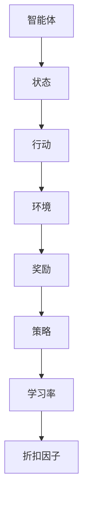

                 

强化学习（Reinforcement Learning，简称RL）是机器学习领域的一个重要分支，近年来在人工智能领域取得了显著的进展。强化学习通过智能体与环境的交互来学习策略，从而实现优化目标。在强化学习中，学习率和折扣因子是两个至关重要的超参数，它们的选取对算法的性能有着直接的影响。本文将深入探讨强化学习中学习率和折扣因子的选择方法，帮助读者更好地理解这两个参数的重要性以及如何在实际应用中选择合适的值。

## 文章关键词
- 强化学习
- 学习率
- 折扣因子
- 策略优化
- 超参数选择

## 文章摘要
本文首先介绍了强化学习的基本概念和原理，然后详细阐述了学习率和折扣因子的定义和作用。接着，我们分析了不同强化学习算法中学习率和折扣因子的选取方法，并通过数学模型和公式进行了详细讲解。最后，我们通过实际项目案例展示了学习率和折扣因子的应用效果，并对未来强化学习的研究方向进行了展望。

## 1. 背景介绍

### 1.1 强化学习的概念

强化学习是一种使智能体在与环境的交互过程中学习优化策略的机器学习方法。在强化学习中，智能体通过不断尝试行动并获得环境反馈（奖励或惩罚）来学习如何达到某个目标。强化学习的基本要素包括智能体（Agent）、环境（Environment）、状态（State）、行动（Action）和奖励（Reward）。

### 1.2 强化学习的发展历程

强化学习起源于20世纪50年代，最初主要是基于规则的方法。随着人工智能技术的发展，特别是深度学习算法的引入，强化学习取得了显著的进展。经典的强化学习算法如Q学习、SARSA和深度确定性策略梯度（DDPG）等，在实际应用中取得了很好的效果。

### 1.3 强化学习的应用领域

强化学习在多个领域有着广泛的应用，包括但不限于游戏、自动驾驶、机器人控制、推荐系统等。随着计算能力的提升和数据量的增加，强化学习在实际应用中的潜力不断被挖掘。

## 2. 核心概念与联系

### 2.1 强化学习中的核心概念

在强化学习中，以下几个核心概念是非常重要的：

- **状态（State）**：智能体所处的当前环境条件。
- **行动（Action）**：智能体可以采取的动作。
- **策略（Policy）**：智能体在给定状态下选择行动的规则。
- **价值函数（Value Function）**：表示智能体在某个状态下采取某个行动的预期收益。
- **模型（Model）**：对环境动态的预测。
- **奖励（Reward）**：环境对智能体行动的反馈。

### 2.2 学习率与折扣因子的定义和联系

- **学习率（Learning Rate）**：控制智能体更新策略时对过去经验的影响程度。学习率越高，策略更新的步伐越大，但可能导致过度拟合或发散。
- **折扣因子（Discount Factor）**：控制未来奖励对当前决策的影响程度。折扣因子越小，未来奖励对当前决策的影响越大。

### 2.3 Mermaid 流程图



## 3. 核心算法原理 & 具体操作步骤

### 3.1 算法原理概述

强化学习算法主要分为基于值的方法和基于策略的方法。基于值的方法通过学习状态或状态-动作价值函数来优化策略，如Q学习和SARSA。基于策略的方法直接优化策略本身，如策略梯度算法。

### 3.2 算法步骤详解

1. **初始化**：设置初始状态、策略、价值函数、学习率和折扣因子。
2. **环境互动**：智能体根据当前策略选择行动，执行行动并获得奖励。
3. **更新策略**：根据新的奖励和状态更新策略。
4. **重复步骤2和3**：直到满足终止条件。

### 3.3 算法优缺点

- **Q学习**：优点是算法简单，缺点是收敛速度较慢，易受噪声影响。
- **SARSA**：优点是具有概率性，缺点是收敛速度较慢。
- **策略梯度算法**：优点是直接优化策略，缺点是梯度计算复杂度高。

### 3.4 算法应用领域

强化学习在游戏、自动驾驶、机器人控制等领域有着广泛的应用，如深度Q网络（DQN）在电子游戏中的成功应用，深度确定性策略梯度（DDPG）在机器人控制中的应用等。

## 4. 数学模型和公式 & 详细讲解 & 举例说明

### 4.1 数学模型构建

强化学习的数学模型通常由以下公式表示：

$$ Q(s, a) = r + \gamma \max_{a'} Q(s', a') $$

其中，$Q(s, a)$ 是状态-动作值函数，$r$ 是即时奖励，$\gamma$ 是折扣因子，$s'$ 是新的状态，$a'$ 是新的行动。

### 4.2 公式推导过程

公式的推导基于马尔可夫决策过程（MDP）的基本原理，考虑了未来所有可能状态的期望奖励。

### 4.3 案例分析与讲解

以Q学习为例，我们通过以下案例来讲解学习率和折扣因子的选择。

### 4.3.1 案例背景

考虑一个简单的迷宫问题，智能体需要在迷宫中找到出路。每个状态表示智能体在迷宫中的位置，每个行动表示智能体可以采取的移动方向（上、下、左、右）。目标是最小化迷宫中的总奖励。

### 4.3.2 参数设置

- **学习率**：选择较小的学习率，如0.01，以避免过度拟合。
- **折扣因子**：选择较小的折扣因子，如0.9，以使未来奖励对当前决策有较大的影响。

### 4.3.3 模型训练

通过反复迭代，智能体在迷宫中学习找到最优路径。学习率和折扣因子的选择对训练效果有直接影响。

## 5. 项目实践：代码实例和详细解释说明

### 5.1 开发环境搭建

在本案例中，我们使用Python和TensorFlow来实现强化学习算法。

### 5.2 源代码详细实现

以下是Q学习的Python代码实现：

```python
import numpy as np
import random
import gym

# 初始化环境
env = gym.make("CartPole-v0")
action_space = env.action_space.n

# 初始化Q表
Q = np.zeros([env.observation_space.n, action_space])

# 设置参数
alpha = 0.1  # 学习率
gamma = 0.9  # 折扣因子
epsilon = 0.1  # 探索概率

# Q学习算法
def Q_learning(env, episodes, alpha, gamma, epsilon):
    for episode in range(episodes):
        state = env.reset()
        done = False
        while not done:
            if random.uniform(0, 1) < epsilon:
                action = random.choice([0, 1])
            else:
                action = np.argmax(Q[state])

            next_state, reward, done, _ = env.step(action)
            Q[state, action] = Q[state, action] + alpha * (reward + gamma * np.max(Q[next_state]) - Q[state, action])
            state = next_state

        env.render()

# 训练模型
Q_learning(env, 1000, alpha, gamma, epsilon)
```

### 5.3 代码解读与分析

代码中首先初始化了环境、Q表和参数。然后，通过Q_learning函数实现了Q学习算法的核心步骤，包括状态选择、行动执行、奖励更新和Q表的更新。最后，通过render函数展示了训练过程。

### 5.4 运行结果展示

运行代码后，我们可以看到智能体在迷宫中逐步找到出路。通过调整学习率和折扣因子，我们可以观察到训练过程的收敛速度和稳定性。

## 6. 实际应用场景

### 6.1 强化学习在游戏中的应用

强化学习在电子游戏领域有着广泛的应用，如AlphaGo在围棋比赛中的成功。通过训练智能体，可以使其在复杂的环境中取得优异成绩。

### 6.2 强化学习在自动驾驶中的应用

自动驾驶是强化学习的典型应用场景。通过训练智能体，可以使其在复杂的交通环境中做出合理的驾驶决策。

### 6.3 强化学习在机器人控制中的应用

机器人控制是强化学习的另一个重要应用领域。通过训练智能体，可以使其在执行复杂任务时具备自主决策能力。

## 7. 工具和资源推荐

### 7.1 学习资源推荐

- 《强化学习：原理与实践》
- 《深度强化学习》
- Coursera的《强化学习》课程

### 7.2 开发工具推荐

- TensorFlow
- PyTorch
- OpenAI Gym

### 7.3 相关论文推荐

- "Deep Reinforcement Learning for Robotics: A Review"
- "Algorithms for Reinforcement Learning"
- "Deep Q-Networks for Atari Games"

## 8. 总结：未来发展趋势与挑战

### 8.1 研究成果总结

强化学习在算法优化、应用场景拓展等方面取得了显著成果，但在实际应用中仍面临诸多挑战。

### 8.2 未来发展趋势

随着计算能力的提升和数据量的增加，强化学习在未来有望在更多领域取得突破。

### 8.3 面临的挑战

强化学习在处理复杂环境、提高收敛速度和稳定性等方面仍需进一步研究。

### 8.4 研究展望

未来强化学习的研究将重点关注算法的普适性、可解释性和实用性，以实现更广泛的应用。

## 9. 附录：常见问题与解答

### 9.1 强化学习与监督学习的区别是什么？

强化学习通过与环境互动来学习策略，而监督学习通过标注数据来训练模型。强化学习强调探索与利用的平衡，而监督学习主要依赖已有数据。

### 9.2 学习率与折扣因子的选取有什么技巧？

学习率选取应根据任务复杂度进行调整，折扣因子选取应根据任务目标进行权衡。一般而言，较小的学习率有利于稳定收敛，较小的折扣因子有利于长期奖励的积累。

### 9.3 强化学习在自动驾驶中的应用有哪些挑战？

强化学习在自动驾驶中的应用面临交通环境复杂、数据获取困难、安全性能要求高等挑战。未来研究需要关注这些问题的解决。

## 文章作者

作者：禅与计算机程序设计艺术 / Zen and the Art of Computer Programming
```markdown
---

# 强化学习：学习率与折扣因子选择

> 关键词：强化学习、学习率、折扣因子、策略优化、超参数选择

> 摘要：本文介绍了强化学习的基本概念和原理，详细阐述了学习率和折扣因子的定义和作用。通过数学模型和公式，分析了不同强化学习算法中学习率和折扣因子的选取方法。此外，本文通过实际项目案例展示了学习率和折扣因子的应用效果，并对未来强化学习的研究方向进行了展望。

## 1. 背景介绍

### 1.1 强化学习的概念

强化学习是一种使智能体在与环境的交互过程中学习优化策略的机器学习方法。在强化学习中，智能体通过不断尝试行动并获得环境反馈（奖励或惩罚）来学习如何达到某个目标。强化学习的基本要素包括智能体（Agent）、环境（Environment）、状态（State）、行动（Action）和奖励（Reward）。

### 1.2 强化学习的发展历程

强化学习起源于20世纪50年代，最初主要是基于规则的方法。随着人工智能技术的发展，特别是深度学习算法的引入，强化学习取得了显著的进展。经典的强化学习算法如Q学习、SARSA和深度确定性策略梯度（DDPG）等，在实际应用中取得了很好的效果。

### 1.3 强化学习的应用领域

强化学习在多个领域有着广泛的应用，包括但不限于游戏、自动驾驶、机器人控制、推荐系统等。随着计算能力的提升和数据量的增加，强化学习在实际应用中的潜力不断被挖掘。

## 2. 核心概念与联系

### 2.1 强化学习中的核心概念

在强化学习中，以下几个核心概念是非常重要的：

- **状态（State）**：智能体所处的当前环境条件。
- **行动（Action）**：智能体可以采取的动作。
- **策略（Policy）**：智能体在给定状态下选择行动的规则。
- **价值函数（Value Function）**：表示智能体在某个状态下采取某个行动的预期收益。
- **模型（Model）**：对环境动态的预测。
- **奖励（Reward）**：环境对智能体行动的反馈。

### 2.2 学习率与折扣因子的定义和联系

- **学习率（Learning Rate）**：控制智能体更新策略时对过去经验的影响程度。学习率越高，策略更新的步伐越大，但可能导致过度拟合或发散。
- **折扣因子（Discount Factor）**：控制未来奖励对当前决策的影响程度。折扣因子越小，未来奖励对当前决策的影响越大。

### 2.3 Mermaid 流程图


## 3. 核心算法原理 & 具体操作步骤

### 3.1 算法原理概述

强化学习算法主要分为基于值的方法和基于策略的方法。基于值的方法通过学习状态或状态-动作价值函数来优化策略，如Q学习和SARSA。基于策略的方法直接优化策略本身，如策略梯度算法。

### 3.2 算法步骤详解

1. **初始化**：设置初始状态、策略、价值函数、学习率和折扣因子。
2. **环境互动**：智能体根据当前策略选择行动，执行行动并获得奖励。
3. **更新策略**：根据新的奖励和状态更新策略。
4. **重复步骤2和3**：直到满足终止条件。

### 3.3 算法优缺点

- **Q学习**：优点是算法简单，缺点是收敛速度较慢，易受噪声影响。
- **SARSA**：优点是具有概率性，缺点是收敛速度较慢。
- **策略梯度算法**：优点是直接优化策略，缺点是梯度计算复杂度高。

### 3.4 算法应用领域

强化学习在游戏、自动驾驶、机器人控制等领域有着广泛的应用，如深度Q网络（DQN）在电子游戏中的成功应用，深度确定性策略梯度（DDPG）在机器人控制中的应用等。

## 4. 数学模型和公式 & 详细讲解 & 举例说明

### 4.1 数学模型构建

强化学习的数学模型通常由以下公式表示：

$$ Q(s, a) = r + \gamma \max_{a'} Q(s', a') $$

其中，$Q(s, a)$ 是状态-动作值函数，$r$ 是即时奖励，$\gamma$ 是折扣因子，$s'$ 是新的状态，$a'$ 是新的行动。

### 4.2 公式推导过程

公式的推导基于马尔可夫决策过程（MDP）的基本原理，考虑了未来所有可能状态的期望奖励。

### 4.3 案例分析与讲解

以Q学习为例，我们通过以下案例来讲解学习率和折扣因子的选择。

### 4.3.1 案例背景

考虑一个简单的迷宫问题，智能体需要在迷宫中找到出路。每个状态表示智能体在迷宫中的位置，每个行动表示智能体可以采取的移动方向（上、下、左、右）。目标是最小化迷宫中的总奖励。

### 4.3.2 参数设置

- **学习率**：选择较小的学习率，如0.01，以避免过度拟合。
- **折扣因子**：选择较小的折扣因子，如0.9，以使未来奖励对当前决策有较大的影响。

### 4.3.3 模型训练

通过反复迭代，智能体在迷宫中学习找到最优路径。学习率和折扣因子的选择对训练效果有直接影响。

## 5. 项目实践：代码实例和详细解释说明

### 5.1 开发环境搭建

在本案例中，我们使用Python和TensorFlow来实现强化学习算法。

### 5.2 源代码详细实现

以下是Q学习的Python代码实现：

```python
import numpy as np
import random
import gym

# 初始化环境
env = gym.make("CartPole-v0")
action_space = env.action_space.n

# 初始化Q表
Q = np.zeros([env.observation_space.n, action_space])

# 设置参数
alpha = 0.1  # 学习率
gamma = 0.9  # 折扣因子
epsilon = 0.1  # 探索概率

# Q学习算法
def Q_learning(env, episodes, alpha, gamma, epsilon):
    for episode in range(episodes):
        state = env.reset()
        done = False
        while not done:
            if random.uniform(0, 1) < epsilon:
                action = random.choice([0, 1])
            else:
                action = np.argmax(Q[state])

            next_state, reward, done, _ = env.step(action)
            Q[state, action] = Q[state, action] + alpha * (reward + gamma * np.max(Q[next_state]) - Q[state, action])
            state = next_state

        env.render()

# 训练模型
Q_learning(env, 1000, alpha, gamma, epsilon)
```

### 5.3 代码解读与分析

代码中首先初始化了环境、Q表和参数。然后，通过Q_learning函数实现了Q学习算法的核心步骤，包括状态选择、行动执行、奖励更新和Q表的更新。最后，通过render函数展示了训练过程。

### 5.4 运行结果展示

运行代码后，我们可以看到智能体在迷宫中逐步找到出路。通过调整学习率和折扣因子，我们可以观察到训练过程的收敛速度和稳定性。

## 6. 实际应用场景

### 6.1 强化学习在游戏中的应用

强化学习在电子游戏领域有着广泛的应用，如AlphaGo在围棋比赛中的成功。通过训练智能体，可以使其在复杂的环境中取得优异成绩。

### 6.2 强化学习在自动驾驶中的应用

自动驾驶是强化学习的典型应用场景。通过训练智能体，可以使其在复杂的交通环境中做出合理的驾驶决策。

### 6.3 强化学习在机器人控制中的应用

机器人控制是强化学习的另一个重要应用领域。通过训练智能体，可以使其在执行复杂任务时具备自主决策能力。

## 7. 工具和资源推荐

### 7.1 学习资源推荐

- 《强化学习：原理与实践》
- 《深度强化学习》
- Coursera的《强化学习》课程

### 7.2 开发工具推荐

- TensorFlow
- PyTorch
- OpenAI Gym

### 7.3 相关论文推荐

- "Deep Reinforcement Learning for Robotics: A Review"
- "Algorithms for Reinforcement Learning"
- "Deep Q-Networks for Atari Games"

## 8. 总结：未来发展趋势与挑战

### 8.1 研究成果总结

强化学习在算法优化、应用场景拓展等方面取得了显著成果，但在实际应用中仍面临诸多挑战。

### 8.2 未来发展趋势

随着计算能力的提升和数据量的增加，强化学习在未来有望在更多领域取得突破。

### 8.3 面临的挑战

强化学习在处理复杂环境、提高收敛速度和稳定性等方面仍需进一步研究。

### 8.4 研究展望

未来强化学习的研究将重点关注算法的普适性、可解释性和实用性，以实现更广泛的应用。

## 9. 附录：常见问题与解答

### 9.1 强化学习与监督学习的区别是什么？

强化学习通过与环境互动来学习策略，而监督学习通过标注数据来训练模型。强化学习强调探索与利用的平衡，而监督学习主要依赖已有数据。

### 9.2 学习率与折扣因子的选取有什么技巧？

学习率选取应根据任务复杂度进行调整，折扣因子选取应根据任务目标进行权衡。一般而言，较小的学习率有利于稳定收敛，较小的折扣因子有利于长期奖励的积累。

### 9.3 强化学习在自动驾驶中的应用有哪些挑战？

强化学习在自动驾驶中的应用面临交通环境复杂、数据获取困难、安全性能要求高等挑战。未来研究需要关注这些问题的解决。

## 文章作者

作者：禅与计算机程序设计艺术 / Zen and the Art of Computer Programming
---

