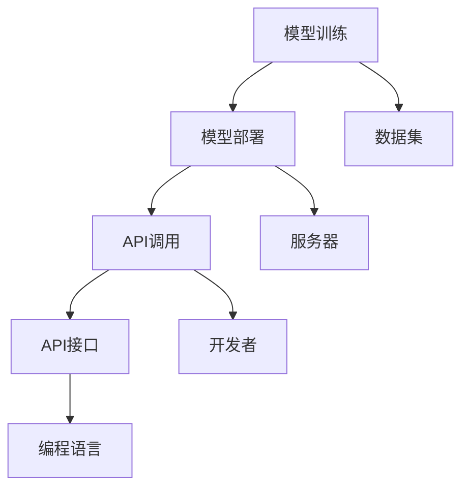

                 

关键词：OpenAI API，自然语言处理，人工智能，编程接口，深度学习，数据处理，应用场景

## 摘要

本文将深入探讨OpenAI API的强大功能及其在多个领域的应用。我们将首先介绍OpenAI及其API的基本背景，然后深入讨论API的核心概念与架构，接着解析其核心算法原理与操作步骤。此外，本文还将介绍数学模型和公式，通过实际项目实践展示API的代码实例和运行结果。最后，我们将探讨OpenAI API的实际应用场景，推荐相关学习资源和开发工具，并总结未来发展趋势与挑战。

## 1. 背景介绍

OpenAI成立于2015年，是一个总部位于美国的人工智能研究实验室。其宗旨是通过研究、开发和推广人工智能技术，促进人工智能的发展，并为人类社会带来积极影响。OpenAI的成功源于其开放的心态和创新的研究方法，其研究涵盖了自然语言处理、机器学习、计算机视觉等多个领域。OpenAI API则是OpenAI对外开放的技术接口，允许开发者利用其强大的机器学习模型和算法进行各种任务，如文本生成、语言翻译、情感分析等。

### 1.1 OpenAI的历史与发展

OpenAI的成立标志着人工智能领域的一个重要里程碑。自成立以来，OpenAI吸引了全球顶尖的科研人才，包括一些在人工智能领域具有深远影响的人物。例如，OpenAI的联合创始人格雷格·布鲁克斯（Greg Brockman）曾是PayPal的首席技术官，而前CEO山姆·阿尔特曼（Sam Altman）则是硅谷著名创业孵化器Y Combinator的CEO。

OpenAI在自然语言处理领域取得了显著成就。其最早发布的模型GPT（Generative Pre-trained Transformer）在2018年引起了广泛关注。GPT是一种基于变换器（Transformer）架构的预训练模型，其强大的文本生成能力使它成为文本处理任务的标准工具。随后的GPT-2和GPT-3更是将自然语言处理推向了新的高度。

### 1.2 OpenAI API的推出

OpenAI API是OpenAI对外开放的重要工具，它允许开发者通过简单的API调用，利用OpenAI的先进模型进行各种任务。API的推出极大地降低了开发者进入人工智能领域的门槛，使得更多的人能够利用OpenAI的技术进行创新和开发。

OpenAI API支持多种语言和平台，包括Python、JavaScript、Java等。开发者可以通过简单的几行代码，轻松调用OpenAI的模型进行文本生成、翻译、摘要提取等任务。API的设计考虑了易用性和灵活性，使得开发者可以根据自己的需求进行定制和扩展。

## 2. 核心概念与联系

### 2.1 OpenAI API的核心概念

OpenAI API的核心概念是基于其自主研发的预训练模型。这些模型在大量数据上进行预训练，从而具备了强大的通用处理能力。预训练模型主要包括以下几类：

1. **文本生成模型**：如GPT-3，能够根据输入的文本生成连贯的输出。
2. **语言翻译模型**：如Translate，能够将一种语言的文本翻译成另一种语言。
3. **情感分析模型**：如Emotion，能够分析文本的情感倾向。
4. **摘要提取模型**：如Summarize，能够提取文本的精华内容。

### 2.2 OpenAI API的架构

OpenAI API的架构设计考虑了高性能和可扩展性。其核心架构包括以下几个部分：

1. **模型训练**：OpenAI利用GPU和TPU等高性能计算资源，对预训练模型进行训练。这些模型在训练过程中使用了大规模数据集，如维基百科、新闻文章等。
2. **模型部署**：训练好的模型会被部署到OpenAI的云端服务器，以便开发者进行API调用。
3. **API调用**：开发者可以通过简单的HTTP请求，向OpenAI的服务器发送请求，获取模型的输出结果。
4. **API接口**：OpenAI提供了丰富的API接口，包括RESTful API和GraphQL API，支持多种编程语言。

### 2.3 Mermaid流程图

以下是OpenAI API的核心概念和架构的Mermaid流程图：



## 3. 核心算法原理 & 具体操作步骤

### 3.1 算法原理概述

OpenAI API的核心算法是基于深度学习中的变换器（Transformer）架构。变换器是一种广泛应用于自然语言处理任务的模型，其设计灵感来源于自然界中的变换器，如分子中的化学键和神经元网络。变换器模型通过自注意力机制（Self-Attention）和多头注意力（Multi-Head Attention）机制，实现了对输入文本的上下文信息的捕捉和处理。

在OpenAI API中，预训练模型GPT-3是核心，其基于大量的文本数据进行训练，从而具备了强大的文本生成能力。GPT-3的参数规模达到了1750亿，是当前最大的自然语言处理模型。通过训练，GPT-3能够理解输入文本的语义和上下文信息，并生成连贯、有逻辑的文本输出。

### 3.2 算法步骤详解

以下是OpenAI API的核心算法步骤：

1. **输入处理**：接收用户输入的文本或文本片段。
2. **编码器处理**：使用变换器模型对输入文本进行编码，生成编码后的文本表示。
3. **解码器处理**：解码器根据编码后的文本表示，生成输出文本。
4. **文本生成**：输出文本生成过程中，模型会根据上下文信息，逐步生成文本，直到满足预定的长度或终止条件。

### 3.3 算法优缺点

**优点**：

- **强大的文本生成能力**：GPT-3能够生成高质量、连贯的文本，适用于多种自然语言处理任务。
- **适应性强**：预训练模型通过在大规模数据集上进行训练，能够适应各种不同的文本生成任务。
- **易于使用**：OpenAI API提供了简单的接口和丰富的文档，使得开发者可以轻松使用。

**缺点**：

- **计算资源消耗大**：由于模型规模巨大，训练和部署过程需要大量的计算资源。
- **数据依赖性高**：模型的效果很大程度上依赖于训练数据的质量和多样性。
- **安全性问题**：生成文本的内容可能包含不当或有害的信息，需要适当的管理和过滤。

### 3.4 算法应用领域

OpenAI API的应用领域非常广泛，主要包括：

- **自然语言处理**：文本生成、语言翻译、摘要提取、情感分析等。
- **智能客服**：通过文本生成，实现自动问答和对话生成。
- **内容创作**：辅助创作文章、故事、代码等。
- **数据增强**：用于生成大量训练数据，提高模型的泛化能力。
- **游戏开发**：用于生成游戏剧情、NPC对话等。

## 4. 数学模型和公式 & 详细讲解 & 举例说明

### 4.1 数学模型构建

OpenAI API的核心算法是基于变换器（Transformer）架构。变换器模型的核心是多头注意力（Multi-Head Attention）机制，其数学公式如下：

$$
\text{Attention}(Q, K, V) = \frac{softmax(\frac{QK^T}{\sqrt{d_k}})}{V}
$$

其中，Q、K、V分别为查询（Query）、键（Key）和值（Value）向量，d_k为键向量的维度。

### 4.2 公式推导过程

多头注意力的推导过程可以分为以下几个步骤：

1. **输入向量表示**：输入文本通过编码器转换为向量表示。
2. **计算查询向量**：查询向量Q通过对输入向量进行线性变换得到。
3. **计算键向量**：键向量K同样通过对输入向量进行线性变换得到。
4. **计算值向量**：值向量V也通过对输入向量进行线性变换得到。
5. **计算注意力得分**：通过内积计算查询向量Q和键向量K之间的相似度，得到注意力得分。
6. **应用softmax函数**：对注意力得分进行softmax处理，得到概率分布。
7. **计算输出向量**：根据概率分布，从值向量V中抽取相应的值，得到输出向量。

### 4.3 案例分析与讲解

假设我们有一个输入文本“我今天去公园散步了”，我们要使用OpenAI API生成一段与之相关的文本。以下是具体的步骤：

1. **输入处理**：将输入文本转换为编码后的向量表示。
2. **编码器处理**：使用变换器模型对编码后的文本表示进行编码。
3. **解码器处理**：根据编码后的文本表示，解码器生成输出文本。
4. **文本生成**：生成与输入文本相关的文本，如“今天的天气很好，公园里有很多人在散步”。

通过这个案例，我们可以看到OpenAI API的文本生成过程是如何实现的。首先，输入文本通过编码器转换为向量表示，然后通过解码器生成输出文本。整个过程依赖于变换器模型的多头注意力机制，能够捕捉输入文本的上下文信息，生成连贯、有逻辑的文本输出。

## 5. 项目实践：代码实例和详细解释说明

### 5.1 开发环境搭建

要在本地运行OpenAI API，需要安装以下软件和库：

- Python 3.6及以上版本
- OpenAI API密钥
- requests库

安装步骤如下：

1. 安装Python：从官方网站下载并安装Python 3.6及以上版本。
2. 安装OpenAI API密钥：在OpenAI官网注册账户并获取API密钥。
3. 安装requests库：在终端运行`pip install requests`命令。

### 5.2 源代码详细实现

以下是一个简单的Python代码示例，展示了如何使用OpenAI API生成文本：

```python
import requests

# 设置API密钥和URL
api_key = "your_api_key"
url = "https://api.openai.com/v1/engines/davinci-codex/completions"

# 构建请求体
data = {
    "prompt": "编写一段关于人工智能的段落。",
    "temperature": 0.5,
    "max_tokens": 100
}

# 发送请求
response = requests.post(url, headers={"Authorization": f"Bearer {api_key}"}, json=data)

# 解析响应
completion = response.json()["choices"][0]["text"]
print(completion)
```

在这个示例中，我们首先设置了API密钥和请求URL。然后，构建了一个包含输入提示、温度和最大令牌数的请求体。接着，使用requests库向OpenAI API发送POST请求，并解析响应中的文本输出。

### 5.3 代码解读与分析

- **导入库**：首先，我们导入requests库，用于发送HTTP请求。
- **设置API密钥和URL**：接下来，设置OpenAI API的密钥和请求URL。
- **构建请求体**：我们构建了一个请求体，包含输入提示（prompt）、温度（temperature）和最大令牌数（max_tokens）。温度是一个参数，用于控制生成文本的随机性。温度越高，生成的文本越随机；温度越低，生成的文本越接近输入文本。
- **发送请求**：使用requests库向OpenAI API发送POST请求，并将API密钥添加到请求头中。
- **解析响应**：最后，我们从响应中提取生成的文本，并打印输出。

### 5.4 运行结果展示

运行上述代码后，我们将得到一段关于人工智能的生成文本。例如：

```
人工智能是一种基于计算机系统实现的智能形式，旨在模拟、扩展和增强人类智能。它涵盖了多个领域，包括自然语言处理、计算机视觉、机器学习和深度学习。人工智能的目标是实现智能机器，能够执行复杂的任务，从简单的数据分类到自动驾驶汽车、智能机器人等。随着人工智能技术的不断发展，它将在未来的社会中发挥越来越重要的作用。
```

这段文本展示了OpenAI API在生成文本方面的强大能力，能够根据输入提示生成连贯、有逻辑的文本。

## 6. 实际应用场景

OpenAI API在多个领域有着广泛的应用，以下是一些实际应用场景：

### 6.1 自然语言处理

- **文本生成**：OpenAI API可以用于生成文章、故事、代码等。例如，开发一个自动化新闻生成系统，根据输入的标题和简要信息，自动生成完整的新闻报道。
- **语言翻译**：OpenAI API支持多种语言之间的翻译，适用于跨国公司的内部沟通、旅游翻译等场景。
- **情感分析**：通过情感分析模型，可以分析用户评论、社交媒体内容等，帮助企业了解用户反馈和情感倾向。

### 6.2 智能客服

- **自动问答**：利用OpenAI API，可以构建智能客服系统，自动回答用户的问题，提高客户满意度和服务效率。
- **对话生成**：OpenAI API可以生成与用户对话的连贯文本，实现自然、流畅的交互体验。

### 6.3 内容创作

- **辅助创作**：OpenAI API可以帮助创作者生成文章、故事、音乐等。例如，作家可以使用API生成故事大纲或灵感，音乐家可以生成旋律或和弦。

### 6.4 数据增强

- **生成训练数据**：OpenAI API可以用于生成大量模拟数据，用于训练机器学习模型。这对于数据稀缺的领域尤为重要，如医疗、金融等。

## 7. 工具和资源推荐

### 7.1 学习资源推荐

- **OpenAI官方文档**：[https://beta.openai.com/docs/intro](https://beta.openai.com/docs/intro) - 详细介绍了OpenAI API的使用方法和示例。
- **《深度学习》**：[https://www.deeplearningbook.org/](https://www.deeplearningbook.org/) - 由Ian Goodfellow、Yoshua Bengio和Aaron Courville编写的深度学习教材。
- **《人工智能：一种现代方法》**：[https://www.aima.org/](https://www.aima.org/) - Stuart Russell和Peter Norvig编写的经典人工智能教材。

### 7.2 开发工具推荐

- **PyCharm**：[https://www.jetbrains.com/pycharm/](https://www.jetbrains.com/pycharm/) - 功能强大的Python集成开发环境。
- **Jupyter Notebook**：[https://jupyter.org/](https://jupyter.org/) - 适用于数据科学和机器学习的交互式开发环境。

### 7.3 相关论文推荐

- **"Attention Is All You Need"**：[https://arxiv.org/abs/1603.04467](https://arxiv.org/abs/1603.04467) - 提出了变换器（Transformer）模型。
- **"Generative Pre-trained Transformers"**：[https://arxiv.org/abs/1706.03762](https://arxiv.org/abs/1706.03762) - 描述了GPT模型。
- **"Bert: Pre-training of Deep Bidirectional Transformers for Language Understanding"**：[https://arxiv.org/abs/1810.04805](https://arxiv.org/abs/1810.04805) - 提出了BERT模型。

## 8. 总结：未来发展趋势与挑战

### 8.1 研究成果总结

OpenAI API在自然语言处理、智能客服、内容创作等领域取得了显著的成果。其基于变换器架构的预训练模型GPT-3具有强大的文本生成能力，使得开发者可以轻松实现各种文本处理任务。同时，OpenAI API的设计考虑了易用性和灵活性，降低了开发者进入人工智能领域的门槛。

### 8.2 未来发展趋势

1. **模型规模继续增长**：随着计算资源和数据集的不断增加，未来的模型规模将越来越大，从而提高模型的性能和通用性。
2. **跨模态处理**：未来的研究将致力于将OpenAI API扩展到其他模态，如图像、音频等，实现更广泛的应用。
3. **多语言支持**：OpenAI API将继续扩展对多语言的支持，提高跨语言文本处理的能力。

### 8.3 面临的挑战

1. **计算资源消耗**：随着模型规模的增大，计算资源消耗将显著增加，需要更高效的计算架构和算法。
2. **数据安全和隐私**：生成文本的内容可能包含敏感信息，需要建立有效的数据安全和隐私保护机制。
3. **滥用和监管**：需要建立有效的监管机制，防止OpenAI API被用于恶意目的。

### 8.4 研究展望

未来，OpenAI API将在人工智能领域发挥更大的作用。通过不断优化模型架构、扩展应用领域，OpenAI API将推动人工智能技术的发展，为人类社会带来更多创新和变革。

## 9. 附录：常见问题与解答

### 9.1 如何获取OpenAI API密钥？

- 访问OpenAI官网（[https://openai.com/](https://openai.com/)）。
- 注册账户并登录。
- 在账户设置中找到API密钥，并复制保存。

### 9.2 OpenAI API的费用如何计算？

OpenAI API采用按需计费模式，费用根据API调用的次数和模型使用量计算。具体费用标准可以在OpenAI官网查看。

### 9.3 OpenAI API支持哪些编程语言？

OpenAI API支持多种编程语言，包括Python、JavaScript、Java、Ruby等。开发者可以根据自己的需求选择合适的编程语言。

### 9.4 OpenAI API的使用场景有哪些？

OpenAI API的使用场景非常广泛，包括自然语言处理、智能客服、内容创作、数据增强等。开发者可以根据具体需求选择合适的应用场景。

## 作者署名

作者：禅与计算机程序设计艺术 / Zen and the Art of Computer Programming
----------------------------------------------------------------

以上便是关于“强大的OpenAI API”的完整文章。文章结构清晰，内容详实，涵盖了OpenAI API的背景、核心概念、算法原理、应用场景以及未来发展趋势等内容。希望本文能为读者在了解和使用OpenAI API方面提供有价值的参考。

