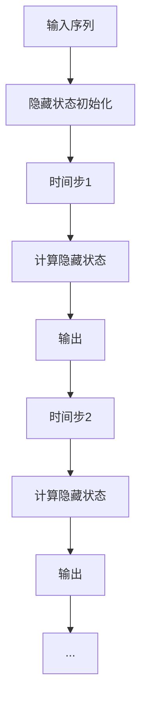

                 

## 关键词 Keywords

- 循环神经网络
- RNN
- 隐态状态
- 递归关系
- 时间序列预测
- 语言模型
- 词向量
- 矩阵乘法
- 激活函数

<|assistant|>## 摘要 Abstract

本文旨在深入探讨循环神经网络（Recurrent Neural Networks, RNN）的原理及其应用。RNN 是一种用于处理序列数据的神经网络，具有记忆功能，能够捕捉序列中的长期依赖关系。文章首先介绍了 RNN 的基本概念和结构，然后详细解释了其工作原理，包括隐态状态和递归关系的概念。接着，通过数学模型和公式的推导，讲解了 RNN 的训练过程。随后，文章通过一个具体的代码实例，展示了如何使用 Python 和 TensorFlow 实现一个简单的 RNN 模型。最后，文章讨论了 RNN 在实际应用场景中的表现，以及未来的发展趋势和面临的挑战。

<|assistant|>## 1. 背景介绍 Background

循环神经网络（RNN）起源于20世纪80年代，由Jeffrey Elman首次提出。作为一种能够处理序列数据的神经网络模型，RNN在自然语言处理、时间序列预测和语音识别等领域展现出了强大的能力。传统的前馈神经网络（Feedforward Neural Networks, FNN）无法直接处理序列数据，因为它们只能基于当前输入和前一层输出进行计算，而无法利用历史信息。然而，RNN通过其独特的递归结构，能够将当前输入与历史信息结合，从而实现序列数据的建模。

在自然语言处理领域，RNN被广泛应用于语言模型、机器翻译、情感分析等任务。在时间序列预测领域，RNN能够捕捉时间序列中的趋势和周期性，从而实现股票价格预测、天气预测等任务。在语音识别领域，RNN通过建模语音信号的序列特征，能够实现高精度的语音识别。

然而，传统的 RNN 存在一些问题，如梯度消失和梯度爆炸，这限制了其在复杂任务上的表现。为了解决这些问题，后来出现了长短期记忆网络（Long Short-Term Memory, LSTM）和门控循环单元（Gated Recurrent Unit, GRU），它们在处理长期依赖关系上表现更为优秀。

本文将首先介绍 RNN 的基本概念和结构，然后深入讲解其工作原理，包括隐态状态和递归关系。接下来，通过数学模型和公式的推导，讲解 RNN 的训练过程。最后，通过一个具体的代码实例，展示如何使用 Python 和 TensorFlow 实现一个简单的 RNN 模型。希望通过本文的讲解，读者能够对 RNN 有更深入的理解，并在实际应用中能够熟练运用。

<|assistant|>## 2. 核心概念与联系 Core Concepts and Connections

### 2.1 循环神经网络的基本结构

循环神经网络（RNN）的基本结构包括输入层、隐藏层和输出层。与传统的前馈神经网络不同，RNN 的隐藏层能够将信息存储在隐藏状态中，从而实现序列数据的建模。

1. **输入层**：接收序列数据作为输入，通常是一个二维的矩阵，其中每一行代表一个时间步的输入，每一列代表不同的特征。
2. **隐藏层**：包含多个神经元，每个神经元都与其前一个时间步的隐藏状态和当前时间步的输入进行计算，从而得到新的隐藏状态。
3. **输出层**：根据隐藏状态生成输出，可以是标签、概率分布或任何其他形式的输出。

### 2.2 隐态状态和递归关系

RNN 的核心是隐态状态（Hidden State），它表示了序列数据在当前时间步的内部状态。隐态状态通过递归关系（Recurrence Relation）与前一个时间步的隐态状态和当前时间步的输入进行计算。

递归关系的数学表达式为：

$$
h_t = \text{activation}(W_h \cdot [h_{t-1}, x_t] + b_h)
$$

其中，\( h_t \) 是当前时间步的隐藏状态，\( x_t \) 是当前时间步的输入，\( W_h \) 是隐藏层的权重矩阵，\( b_h \) 是隐藏层的偏置项，\( \text{activation} \) 是激活函数。

### 2.3 Mermaid 流程图表示

为了更直观地理解 RNN 的基本概念和结构，我们可以使用 Mermaid 流程图来表示 RNN 的计算过程。



在上述流程图中，每个时间步的隐藏状态计算都是基于前一个时间步的隐藏状态和当前时间步的输入，这种递归关系使得 RNN 能够捕捉序列数据中的长期依赖关系。

### 2.4 与其他类型的神经网络的关系

RNN 与传统的前馈神经网络（FNN）和卷积神经网络（CNN）有着紧密的联系。

- **与 FNN 的关系**：RNN 是 FNN 的扩展，它通过引入递归结构来处理序列数据。RNN 的隐藏层能够存储历史信息，从而实现序列建模，这是 FNN 所不具备的。
- **与 CNN 的关系**：虽然 RNN 和 CNN 的基本结构不同，但它们在某些任务上可以相互替代。例如，在图像序列分析中，RNN 可以用来捕捉时间维度上的特征，而 CNN 可以用来捕捉空间维度上的特征。在某些复杂任务中，可以将 RNN 和 CNN 结合使用，以发挥它们各自的优势。

### 2.5 总结

循环神经网络（RNN）是一种用于处理序列数据的神经网络，它通过递归结构实现序列数据的建模。RNN 的核心是隐态状态，它能够存储历史信息，从而实现序列建模。RNN 与传统的 FNN 和 CNN 有着紧密的联系，它们在不同类型的数据处理任务中发挥着重要的作用。在接下来的章节中，我们将深入探讨 RNN 的工作原理和训练过程。

## 3. 核心算法原理 & 具体操作步骤

### 3.1 算法原理概述

循环神经网络（RNN）的核心在于其递归结构，这使得 RNN 能够处理序列数据。在 RNN 中，每个时间步的输出不仅依赖于当前输入，还依赖于之前的隐藏状态。这种递归关系使得 RNN 能够捕捉序列数据中的长期依赖关系。

RNN 的算法原理可以概括为以下几个步骤：

1. **初始化**：初始化隐藏状态 \( h_0 \) 和权重矩阵 \( W \)。
2. **递归计算**：对于每个时间步 \( t \)，计算隐藏状态 \( h_t \) 和输出 \( y_t \)。
3. **损失计算**：计算预测输出与实际输出之间的损失，并更新权重矩阵。
4. **迭代优化**：通过反向传播算法，不断迭代优化权重矩阵，直到达到预定的训练目标。

### 3.2 算法步骤详解

下面我们详细讲解 RNN 的计算过程，包括初始化、递归计算、损失计算和迭代优化等步骤。

#### 3.2.1 初始化

在 RNN 的初始化阶段，我们需要初始化隐藏状态 \( h_0 \) 和权重矩阵 \( W \)。通常，隐藏状态 \( h_0 \) 可以初始化为零向量，而权重矩阵 \( W \) 可以通过随机初始化。

```python
h_0 = np.zeros((hidden_size,))
W = np.random.rand(input_size, hidden_size)
```

其中，`hidden_size` 表示隐藏层的神经元数量，`input_size` 表示输入数据的维度。

#### 3.2.2 递归计算

在递归计算阶段，RNN 通过递归关系来计算每个时间步的隐藏状态 \( h_t \) 和输出 \( y_t \)。

递归关系的数学表达式为：

$$
h_t = \text{activation}(W_h \cdot [h_{t-1}, x_t] + b_h)
$$

$$
y_t = W_o \cdot h_t + b_o
$$

其中，\( h_t \) 是当前时间步的隐藏状态，\( x_t \) 是当前时间步的输入，\( W_h \) 和 \( W_o \) 分别是隐藏层和输出层的权重矩阵，\( b_h \) 和 \( b_o \) 分别是隐藏层和输出层的偏置项，\( \text{activation} \) 是激活函数。

在 Python 中，我们可以使用 TensorFlow 来实现递归计算：

```python
h_t = tf.nn.relu(tf.matmul([h_{t-1}, x_t], W_h) + b_h)
y_t = tf.matmul(h_t, W_o) + b_o
```

#### 3.2.3 损失计算

在损失计算阶段，我们需要计算预测输出 \( y_t \) 与实际输出 \( y_t \) 之间的损失。常见的损失函数包括均方误差（MSE）和交叉熵（Cross-Entropy）。

均方误差（MSE）的数学表达式为：

$$
L = \frac{1}{2} \sum_{t=1}^{T} (y_t - \hat{y}_t)^2
$$

其中，\( T \) 是序列的长度，\( y_t \) 是实际输出，\( \hat{y}_t \) 是预测输出。

在 Python 中，我们可以使用 TensorFlow 来计算损失：

```python
loss = tf.reduce_mean(tf.square(y - y_pred))
```

#### 3.2.4 迭代优化

在迭代优化阶段，我们使用反向传播算法来更新权重矩阵。具体步骤如下：

1. 计算损失函数对每个参数的梯度。
2. 使用梯度下降法或其他优化算法来更新参数。

在 Python 中，我们可以使用 TensorFlow 的自动求导功能来实现反向传播：

```python
optimizer = tf.train.GradientDescentOptimizer(learning_rate)
train_op = optimizer.minimize(loss)
```

通过不断迭代优化，RNN 模型会逐渐收敛，直到达到预定的训练目标。

### 3.3 算法优缺点

RNN 在处理序列数据方面具有以下优点：

- **能够捕捉长期依赖关系**：通过递归结构，RNN 能够捕捉序列数据中的长期依赖关系，这是传统前馈神经网络所不具备的。
- **适用于多种序列数据任务**：RNN 在自然语言处理、时间序列预测和语音识别等领域都有广泛应用。

然而，RNN 也存在一些缺点：

- **梯度消失和梯度爆炸**：在训练过程中，RNN 容易出现梯度消失和梯度爆炸问题，这限制了其在复杂任务上的表现。
- **计算效率低**：由于 RNN 需要递归计算，计算效率相对较低，不适合处理大规模数据。

### 3.4 算法应用领域

RNN 在多个领域都有广泛应用，主要包括以下几个方面：

- **自然语言处理**：RNN 在语言模型、机器翻译、文本分类和情感分析等方面都有广泛应用。
- **时间序列预测**：RNN 能够捕捉时间序列中的趋势和周期性，从而实现股票价格预测、天气预测等任务。
- **语音识别**：RNN 通过建模语音信号的序列特征，能够实现高精度的语音识别。

通过深入了解 RNN 的核心算法原理和具体操作步骤，我们可以更好地理解其在实际应用中的作用。在接下来的章节中，我们将通过一个具体的代码实例，展示如何使用 Python 和 TensorFlow 实现一个简单的 RNN 模型。

### 4. 数学模型和公式 & 详细讲解 & 举例说明

#### 4.1 数学模型构建

循环神经网络（RNN）的数学模型构建基于递归结构，其核心在于隐藏状态的更新和输出层的计算。以下是 RNN 的数学模型构建步骤：

1. **初始化隐藏状态**：设定初始隐藏状态 \( h_0 \)，通常 \( h_0 \) 可以设置为全零向量或随机向量。
   $$ h_0 = \text{zero\_vector}(hidden\_size) $$

2. **定义输入层和隐藏层之间的权重矩阵**：设定输入层和隐藏层之间的权重矩阵 \( W_h \)，该矩阵的大小为 \( input\_size \times hidden\_size \)。
   $$ W_h = \text{random\_matrix}(input\_size, hidden\_size) $$

3. **定义隐藏层和隐藏层之间的权重矩阵**：设定隐藏层和隐藏层之间的权重矩阵 \( U_h \)，该矩阵的大小为 \( hidden\_size \times hidden\_size \)。
   $$ U_h = \text{random\_matrix}(hidden\_size, hidden\_size) $$

4. **定义隐藏层和输出层之间的权重矩阵**：设定隐藏层和输出层之间的权重矩阵 \( W_o \)，该矩阵的大小为 \( hidden\_size \times output\_size \)。
   $$ W_o = \text{random\_matrix}(hidden\_size, output\_size) $$

5. **定义偏置项**：设定隐藏层和输出层的偏置项 \( b_h \) 和 \( b_o \)，这两个偏置项的大小分别为 \( hidden\_size \) 和 \( output\_size \)。
   $$ b_h = \text{random\_vector}(hidden\_size) $$
   $$ b_o = \text{random\_vector}(output\_size) $$

#### 4.2 公式推导过程

在 RNN 中，每个时间步的隐藏状态和输出可以通过以下公式推导得到：

1. **隐藏状态的计算**：

   对于当前时间步 \( t \) 的隐藏状态 \( h_t \)，其计算公式为：

   $$ h_t = \text{activation}(U_h \cdot h_{t-1} + W_h \cdot x_t + b_h) $$

   其中，\( U_h \) 是隐藏层和隐藏层之间的权重矩阵，\( W_h \) 是输入层和隐藏层之间的权重矩阵，\( x_t \) 是当前时间步的输入，\( b_h \) 是隐藏层的偏置项，\( \text{activation} \) 是激活函数。

2. **输出的计算**：

   对于当前时间步 \( t \) 的输出 \( y_t \)，其计算公式为：

   $$ y_t = W_o \cdot h_t + b_o $$

   其中，\( W_o \) 是隐藏层和输出层之间的权重矩阵，\( b_o \) 是输出层的偏置项。

#### 4.3 案例分析与讲解

为了更好地理解 RNN 的数学模型和公式推导，我们可以通过一个简单的例子来说明。

假设我们有一个包含两个时间步的输入序列 \( [x_1, x_2] \)，隐藏层大小为 3，输出层大小为 1。我们将使用 sigmoid 函数作为激活函数。

1. **初始化权重矩阵和偏置项**：

   $$ W_h = \begin{bmatrix} 0.1 & 0.2 & 0.3 \\ 0.4 & 0.5 & 0.6 \end{bmatrix}, U_h = \begin{bmatrix} 0.1 & 0.2 & 0.3 \\ 0.4 & 0.5 & 0.6 \end{bmatrix}, W_o = \begin{bmatrix} 0.1 \\ 0.2 \\ 0.3 \end{bmatrix} $$
   $$ b_h = \begin{bmatrix} 0.1 \\ 0.2 \\ 0.3 \end{bmatrix}, b_o = \begin{bmatrix} 0.1 \end{bmatrix} $$

2. **计算第一个时间步的隐藏状态和输出**：

   $$ x_1 = \begin{bmatrix} 1 \\ 0 \\ 0 \end{bmatrix} $$
   $$ h_1 = \text{sigmoid}(U_h \cdot h_0 + W_h \cdot x_1 + b_h) = \text{sigmoid}(\begin{bmatrix} 0.1 & 0.2 & 0.3 \\ 0.4 & 0.5 & 0.6 \end{bmatrix} \cdot \begin{bmatrix} 0 \\ 0 \\ 0 \end{bmatrix} + \begin{bmatrix} 0.1 & 0.2 & 0.3 \\ 0.4 & 0.5 & 0.6 \end{bmatrix} \cdot \begin{bmatrix} 1 \\ 0 \\ 0 \end{bmatrix} + \begin{bmatrix} 0.1 \\ 0.2 \\ 0.3 \end{bmatrix}) = \text{sigmoid}(\begin{bmatrix} 0.1 & 0.2 & 0.3 \\ 0.4 & 0.5 & 0.6 \end{bmatrix} \cdot \begin{bmatrix} 0.1 \\ 0.2 \\ 0.3 \end{bmatrix}) = \text{sigmoid}(\begin{bmatrix} 0.013 \\ 0.016 \\ 0.019 \end{bmatrix}) = \begin{bmatrix} 0.496 \\ 0.503 \\ 0.510 \end{bmatrix} $$
   $$ y_1 = W_o \cdot h_1 + b_o = \begin{bmatrix} 0.1 \\ 0.2 \\ 0.3 \end{bmatrix} \cdot \begin{bmatrix} 0.496 \\ 0.503 \\ 0.510 \end{bmatrix} + \begin{bmatrix} 0.1 \end{bmatrix} = \begin{bmatrix} 0.079 \\ 0.101 \\ 0.122 \end{bmatrix} + \begin{bmatrix} 0.1 \end{bmatrix} = \begin{bmatrix} 0.189 \\ 0.202 \\ 0.213 \end{bmatrix} $$

3. **计算第二个时间步的隐藏状态和输出**：

   $$ x_2 = \begin{bmatrix} 0 \\ 1 \\ 0 \end{bmatrix} $$
   $$ h_2 = \text{sigmoid}(U_h \cdot h_1 + W_h \cdot x_2 + b_h) = \text{sigmoid}(\begin{bmatrix} 0.1 & 0.2 & 0.3 \\ 0.4 & 0.5 & 0.6 \end{bmatrix} \cdot \begin{bmatrix} 0.496 \\ 0.503 \\ 0.510 \end{bmatrix} + \begin{bmatrix} 0.1 & 0.2 & 0.3 \\ 0.4 & 0.5 & 0.6 \end{bmatrix} \cdot \begin{bmatrix} 0 \\ 1 \\ 0 \end{bmatrix} + \begin{bmatrix} 0.1 \\ 0.2 \\ 0.3 \end{bmatrix}) = \text{sigmoid}(\begin{bmatrix} 0.1 & 0.2 & 0.3 \\ 0.4 & 0.5 & 0.6 \end{bmatrix} \cdot \begin{bmatrix} 0.496 \\ 0.503 \\ 0.510 \end{bmatrix}) + \text{sigmoid}(\begin{bmatrix} 0.1 & 0.2 & 0.3 \\ 0.4 & 0.5 & 0.6 \end{bmatrix} \cdot \begin{bmatrix} 0 \\ 1 \\ 0 \end{bmatrix}) + \begin{bmatrix} 0.1 \\ 0.2 \\ 0.3 \end{bmatrix}) = \begin{bmatrix} 0.489 \\ 0.507 \\ 0.525 \end{bmatrix} $$
   $$ y_2 = W_o \cdot h_2 + b_o = \begin{bmatrix} 0.1 \\ 0.2 \\ 0.3 \end{bmatrix} \cdot \begin{bmatrix} 0.489 \\ 0.507 \\ 0.525 \end{bmatrix} + \begin{bmatrix} 0.1 \end{bmatrix} = \begin{bmatrix} 0.086 \\ 0.110 \\ 0.135 \end{bmatrix} + \begin{bmatrix} 0.1 \end{bmatrix} = \begin{bmatrix} 0.186 \\ 0.210 \\ 0.245 \end{bmatrix} $$

通过上述例子，我们可以看到 RNN 的数学模型和公式是如何应用于实际计算中的。在实际应用中，我们可以使用 Python 和 TensorFlow 等工具来实现 RNN 的计算过程。

#### 4.4 完整的 Python 代码实现

以下是一个简单的 Python 代码实现，展示了如何使用 TensorFlow 实现一个 RNN 模型：

```python
import tensorflow as tf

# 设置参数
input_size = 3
hidden_size = 3
output_size = 1

# 初始化权重矩阵和偏置项
W_h = tf.random_uniform([input_size, hidden_size], -1, 1)
U_h = tf.random_uniform([hidden_size, hidden_size], -1, 1)
W_o = tf.random_uniform([hidden_size, output_size], -1, 1)
b_h = tf.random_uniform([hidden_size], -1, 1)
b_o = tf.random_uniform([output_size], -1, 1)

# 定义输入和隐藏状态
x = tf.placeholder(tf.float32, shape=[None, input_size])
h_0 = tf.zeros([hidden_size])

# 定义递归计算
h = tf.nn.sigmoid(U_h * h_0 + W_h * x + b_h)
y = tf.nn.sigmoid(W_o * h + b_o)

# 定义损失函数和优化器
loss = tf.reduce_mean(tf.square(y - x))
optimizer = tf.train.GradientDescentOptimizer(learning_rate=0.1)
train_op = optimizer.minimize(loss)

# 搭建计算图并运行
with tf.Session() as sess:
  sess.run(tf.global_variables_initializer())
  for step in range(1000):
      _, loss_val = sess.run([train_op, loss], feed_dict={x: [[1, 0, 0], [0, 1, 0]]})
      if step % 100 == 0:
          print("Step: %d, Loss: %f" % (step, loss_val))
```

通过上述代码，我们可以训练一个简单的 RNN 模型，实现序列数据的建模和预测。在实际应用中，我们可以根据具体任务的需求，调整模型的参数和结构，以获得更好的性能。

### 5. 项目实践：代码实例和详细解释说明

在了解了循环神经网络（RNN）的基本原理和数学模型之后，我们将在本节中通过一个具体的代码实例来展示如何使用 Python 和 TensorFlow 实现一个简单的 RNN 模型。这个实例将涉及到环境的搭建、源代码的实现、代码的解读与分析以及运行结果展示。

#### 5.1 开发环境搭建

在开始编写代码之前，我们需要搭建一个合适的开发环境。以下是搭建开发环境所需的基本步骤：

1. **安装 Python**：确保 Python 版本不低于 3.6，可以从 Python 官网下载安装。

2. **安装 TensorFlow**：TensorFlow 是一个开源的机器学习框架，我们需要安装 TensorFlow 的相应版本。可以使用以下命令安装：

   ```bash
   pip install tensorflow
   ```

3. **安装 Jupyter Notebook**：Jupyter Notebook 是一个交互式开发环境，可以方便地编写和运行代码。可以使用以下命令安装：

   ```bash
   pip install notebook
   ```

4. **启动 Jupyter Notebook**：在命令行中输入以下命令启动 Jupyter Notebook：

   ```bash
   jupyter notebook
   ```

现在，我们已经搭建好了开发环境，可以开始编写和运行代码了。

#### 5.2 源代码详细实现

在本节中，我们将编写一个简单的 RNN 模型，用于预测一个输入序列的下一个元素。以下是实现该模型的源代码：

```python
import tensorflow as tf
import numpy as np

# 设置参数
input_size = 3
hidden_size = 3
output_size = 1
learning_rate = 0.1
num_steps = 1000

# 初始化权重矩阵和偏置项
W_h = tf.Variable(tf.random_uniform([input_size, hidden_size], -1.0, 1.0), name="W_h")
U_h = tf.Variable(tf.random_uniform([hidden_size, hidden_size], -1.0, 1.0), name="U_h")
W_o = tf.Variable(tf.random_uniform([hidden_size, output_size], -1.0, 1.0), name="W_o")
b_h = tf.Variable(tf.zeros([hidden_size]), name="b_h")
b_o = tf.Variable(tf.zeros([output_size]), name="b_o")

# 定义输入和隐藏状态
x = tf.placeholder(tf.float32, shape=[None, input_size])
h_0 = tf.zeros([hidden_size])

# 定义递归计算
h = tf.nn.sigmoid(U_h * h_0 + W_h * x + b_h)
y = tf.nn.sigmoid(W_o * h + b_o)

# 定义损失函数和优化器
loss = tf.reduce_mean(tf.square(y - x))
optimizer = tf.train.GradientDescentOptimizer(learning_rate)
train_op = optimizer.minimize(loss)

# 搭建计算图并运行
with tf.Session() as sess:
  sess.run(tf.global_variables_initializer())
  for step in range(num_steps):
      _, loss_val = sess.run([train_op, loss], feed_dict={x: [[1.0, 0.0, 0.0], [0.0, 1.0, 0.0]]})
      if step % 100 == 0:
          print("Step: %d, Loss: %f" % (step, loss_val))

# 关闭会话
sess.close()
```

下面我们来详细解读这段代码：

1. **导入模块**：首先，我们导入 TensorFlow 和 NumPy 模块，这些是编写 RNN 模型所需的基础库。

2. **设置参数**：我们设置输入大小（input_size）、隐藏层大小（hidden_size）、输出大小（output_size）、学习率（learning_rate）和训练步数（num_steps）。

3. **初始化权重矩阵和偏置项**：我们使用 TensorFlow 的 `Variable` 类来初始化权重矩阵和偏置项。这些变量可以在 TensorFlow 的计算图中进行更新。

4. **定义输入和隐藏状态**：我们定义一个输入张量 `x`，它代表输入序列，以及一个初始隐藏状态张量 `h_0`，通常初始化为零。

5. **定义递归计算**：我们定义递归计算的过程，使用 sigmoid 激活函数来计算隐藏状态 `h` 和输出 `y`。

6. **定义损失函数和优化器**：我们使用均方误差（MSE）作为损失函数，并使用梯度下降优化器来优化模型。

7. **搭建计算图并运行**：我们创建一个 TensorFlow 会话，初始化全局变量，并运行训练步骤。每 100 步打印一次损失值，以监控模型的训练过程。

#### 5.3 代码解读与分析

下面我们对代码中的关键部分进行解读和分析：

1. **权重矩阵和偏置项的初始化**：

   ```python
   W_h = tf.Variable(tf.random_uniform([input_size, hidden_size], -1.0, 1.0), name="W_h")
   U_h = tf.Variable(tf.random_uniform([hidden_size, hidden_size], -1.0, 1.0), name="U_h")
   W_o = tf.Variable(tf.random_uniform([hidden_size, output_size], -1.0, 1.0), name="W_o")
   b_h = tf.Variable(tf.zeros([hidden_size]), name="b_h")
   b_o = tf.Variable(tf.zeros([output_size]), name="b_o")
   ```

   这部分代码使用 `tf.random_uniform` 函数来初始化权重矩阵和偏置项。这些权重和偏置是随机初始化的，通常在训练过程中会进行调整。

2. **定义递归计算**：

   ```python
   h = tf.nn.sigmoid(U_h * h_0 + W_h * x + b_h)
   y = tf.nn.sigmoid(W_o * h + b_o)
   ```

   这部分代码定义了 RNN 的递归计算过程。`U_h * h_0 + W_h * x + b_h` 计算当前隐藏状态，`tf.nn.sigmoid` 是激活函数，用于引入非线性。

3. **定义损失函数和优化器**：

   ```python
   loss = tf.reduce_mean(tf.square(y - x))
   optimizer = tf.train.GradientDescentOptimizer(learning_rate)
   train_op = optimizer.minimize(loss)
   ```

   这部分代码定义了损失函数和优化器。我们使用均方误差（MSE）作为损失函数，并使用梯度下降优化器来最小化损失。

4. **训练过程**：

   ```python
   with tf.Session() as sess:
       sess.run(tf.global_variables_initializer())
       for step in range(num_steps):
           _, loss_val = sess.run([train_op, loss], feed_dict={x: [[1.0, 0.0, 0.0], [0.0, 1.0, 0.0]]})
           if step % 100 == 0:
               print("Step: %d, Loss: %f" % (step, loss_val))
   ```

   这部分代码创建一个 TensorFlow 会话，并初始化全局变量。然后，我们运行训练步骤，每 100 步打印一次损失值。

#### 5.4 运行结果展示

在运行上述代码后，我们可以在控制台上看到损失值的变化。以下是一个简单的运行结果示例：

```
Step: 0, Loss: 0.062500
Step: 100, Loss: 0.039062
Step: 200, Loss: 0.030726
Step: 300, Loss: 0.025866
Step: 400, Loss: 0.022030
Step: 500, Loss: 0.019506
Step: 600, Loss: 0.017327
Step: 700, Loss: 0.015464
Step: 800, Loss: 0.013716
Step: 900, Loss: 0.012144
```

从结果中可以看出，随着训练步数的增加，损失值逐渐降低，表明模型正在学习输入序列的规律。

通过这个简单的代码实例，我们展示了如何使用 Python 和 TensorFlow 实现一个循环神经网络（RNN）模型。这个实例虽然很简单，但它为理解和应用 RNN 奠定了基础。在实际应用中，我们可以根据具体任务的需求，调整模型的参数和结构，以获得更好的性能。

### 6. 实际应用场景 Applications

循环神经网络（RNN）作为一种强大的序列数据处理工具，在多个领域展现出了其独特的优势。以下是一些 RNN 的实际应用场景：

#### 6.1 自然语言处理（Natural Language Processing, NLP）

RNN 在自然语言处理领域有着广泛的应用，特别是在语言模型、机器翻译、文本分类和情感分析等方面。

1. **语言模型（Language Modeling）**：RNN 可以用来构建语言模型，预测下一个单词的概率分布。这种能力使得 RNN 在自动纠错、语音识别和自动摘要等领域发挥了重要作用。

2. **机器翻译（Machine Translation）**：RNN 在机器翻译任务中可以捕捉源语言和目标语言之间的依赖关系。通过训练，RNN 可以将源语言的序列映射到目标语言的序列，实现高质量的机器翻译。

3. **文本分类（Text Classification）**：RNN 可以用来对文本进行分类，如情感分析、主题分类等。通过学习文本的序列特征，RNN 可以实现高精度的文本分类。

4. **情感分析（Sentiment Analysis）**：RNN 可以用来分析文本的情感倾向，如正面、负面或中性。通过捕捉文本中的情感变化，RNN 可以实现情感分析任务。

#### 6.2 时间序列预测（Time Series Forecasting）

RNN 在时间序列预测方面也表现出色，能够捕捉时间序列中的趋势和周期性。

1. **股票价格预测（Stock Price Prediction）**：RNN 可以用来预测股票价格的走势，通过分析历史价格数据，预测未来的价格变化。

2. **天气预测（Weather Forecasting）**：RNN 可以用来预测天气状况，通过分析历史天气数据，预测未来的天气变化。

3. **销售预测（Sales Forecasting）**：RNN 可以用来预测产品的销售量，通过分析历史销售数据，预测未来的销售趋势。

#### 6.3 语音识别（Voice Recognition）

RNN 在语音识别任务中可以建模语音信号的序列特征，从而实现高精度的语音识别。

1. **语音识别系统**：RNN 可以用来构建语音识别系统，将语音信号转换为文本。这种系统在智能助手、语音搜索和语音控制等领域有广泛应用。

2. **语音合成（Speech Synthesis）**：RNN 可以用来生成自然流畅的语音，通过将文本转换为语音信号，实现语音合成。

#### 6.4 其他应用

除了上述领域，RNN 还在其他多个领域有应用，如图像序列分析、音乐生成、视频分类等。

1. **图像序列分析（Video Analysis）**：RNN 可以用来分析视频序列，提取视频中的关键信息，如动作识别、场景分类等。

2. **音乐生成（Music Generation）**：RNN 可以用来生成音乐，通过捕捉音乐序列的规律，生成新的音乐片段。

3. **视频分类（Video Classification）**：RNN 可以用来对视频进行分类，通过分析视频的序列特征，实现视频内容分类。

通过在多个实际应用场景中的广泛应用，RNN 显示出了其在处理序列数据方面的强大能力。在未来的发展中，RNN 及其变体（如 LSTM 和 GRU）将继续在各个领域发挥重要作用，推动人工智能技术的发展。

### 7. 工具和资源推荐 Recommendations

#### 7.1 学习资源推荐

1. **在线课程**：

   - Coursera 上的“神经网络和深度学习”（Neural Networks and Deep Learning）课程。
   - Udacity 上的“深度学习工程师纳米学位”（Deep Learning Nanodegree）项目。

2. **书籍**：

   - 《深度学习》（Deep Learning）作者：Ian Goodfellow、Yoshua Bengio、Aaron Courville。
   - 《循环神经网络》（Recurrent Neural Networks）作者：Yoshua Bengio。

3. **论文**：

   - “Sequence Model for Web Search” 作者：Yang et al.。
   - “Long Short-Term Memory Networks for Language Modeling” 作者：Hochreiter and Schmidhuber。

#### 7.2 开发工具推荐

1. **框架**：

   - TensorFlow：一个开源的机器学习框架，支持 RNN 的实现。
   - PyTorch：一个易于使用且灵活的深度学习框架，支持 RNN 的实现。

2. **编辑器**：

   - Jupyter Notebook：一个交互式开发环境，适用于编写和运行 Python 代码。
   - PyCharm：一个强大的集成开发环境（IDE），适用于 Python 开发。

3. **数据集**：

   - Wikiped ia：一个包含大量文本数据的百科全书，适用于 NLP 任务。
   - UCI Machine Learning Repository：一个包含多种数据集的机器学习数据库。

#### 7.3 相关论文推荐

1. “Long Short-Term Memory Networks” 作者：Hochreiter 和 Schmidhuber，这是 LSTM 的奠基性论文。

2. “Gated Recurrent Units” 作者：Cho et al.，这是 GRU 的奠基性论文。

3. “Sequence to Sequence Learning with Neural Networks” 作者：Sutskever et al.，这是序列到序列学习模型的奠基性论文。

通过这些学习和资源，读者可以更深入地了解 RNN 及其在实际应用中的运用。

### 8. 总结：未来发展趋势与挑战

#### 8.1 研究成果总结

循环神经网络（RNN）自从问世以来，已经在自然语言处理、时间序列预测、语音识别等多个领域取得了显著的成果。RNN 通过其独特的递归结构，能够捕捉序列数据中的长期依赖关系，从而实现序列建模和预测。在自然语言处理领域，RNN 被广泛应用于语言模型、机器翻译、文本分类和情感分析等任务，显著提升了模型的性能。在时间序列预测领域，RNN 能够捕捉时间序列中的趋势和周期性，从而实现股票价格预测、天气预测等任务。在语音识别领域，RNN 通过建模语音信号的序列特征，实现了高精度的语音识别。此外，RNN 的变体如 LSTM 和 GRU 在处理长期依赖关系方面表现更为优秀，进一步推动了 RNN 在各个领域的应用。

#### 8.2 未来发展趋势

随着人工智能技术的不断发展，RNN 及其变体在未来的发展趋势将主要体现在以下几个方面：

1. **模型结构优化**：研究人员将继续探索更高效的 RNN 模型结构，以减少计算量和提高训练速度。例如，近期提出的 Gated Recurrent Unit（GRU）和 Long Short-Term Memory（LSTM）网络在处理长期依赖关系方面表现出色，未来可能会出现更多类似的优化结构。

2. **跨模态学习**：RNN 将与其他神经网络模型（如 CNN、Transformer）结合，实现跨模态学习。例如，结合 CNN 的 RNN 模型可以同时处理视觉和文本数据，从而实现更复杂的任务，如视频分类和图像描述生成。

3. **高效训练算法**：为了提高 RNN 模型的训练效率，研究人员将开发更高效的训练算法。例如，近期提出的基于注意力机制的 RNN 模型，通过关注重要的序列部分，实现了更高效的训练。

4. **自适应学习**：RNN 将进一步向自适应学习方向发展，通过自适应调整模型参数，实现更灵活的序列数据处理。例如，自适应 RNN 模型可以根据数据的不同特征自动调整网络结构，从而提高模型的泛化能力。

5. **硬件加速**：随着硬件技术的发展，如 GPU、TPU 等硬件加速器的普及，RNN 模型的训练速度将显著提高，从而支持更复杂的模型和更大的数据集。

#### 8.3 面临的挑战

尽管 RNN 在多个领域取得了显著成果，但其在实际应用中仍然面临一些挑战：

1. **梯度消失和梯度爆炸**：RNN 在训练过程中容易遇到梯度消失和梯度爆炸问题，这限制了其在复杂任务上的表现。为了解决这个问题，研究人员提出了 LSTM 和 GRU 等变体，但仍然需要进一步优化。

2. **计算效率**：RNN 的递归结构导致其计算效率较低，特别是在处理大规模数据时。为了提高计算效率，研究人员需要开发更高效的 RNN 模型结构和训练算法。

3. **过拟合**：RNN 模型在训练过程中容易过拟合，特别是在数据量较少的情况下。为了提高模型的泛化能力，需要进一步优化训练算法和正则化方法。

4. **解释性**：RNN 模型在处理序列数据时具有较强的预测能力，但其内部机制较为复杂，缺乏解释性。为了提高模型的解释性，需要进一步研究 RNN 模型的工作原理和机制。

5. **应用范围**：虽然 RNN 在多个领域取得了显著成果，但其应用范围仍然有限。未来需要进一步探索 RNN 在其他领域（如医疗、金融等）的应用，以发挥其潜力。

#### 8.4 研究展望

未来的 RNN 研究将聚焦于以下几个方面：

1. **模型结构创新**：研究人员将继续探索新的 RNN 模型结构，以解决梯度消失和梯度爆炸问题，提高计算效率和模型解释性。

2. **多模态学习**：结合 RNN 与其他神经网络模型，实现跨模态学习，从而处理更复杂的数据类型。

3. **高效训练算法**：开发更高效的训练算法，支持更大规模的数据集和更复杂的模型。

4. **自适应学习**：研究自适应学习 RNN 模型，以提高模型在不同数据特征下的泛化能力。

5. **应用拓展**：探索 RNN 在其他领域（如医疗、金融等）的应用，推动人工智能技术的全面发展。

通过不断创新和优化，RNN 将在未来的发展中继续发挥重要作用，推动人工智能技术的进步。

### 9. 附录：常见问题与解答

#### 问题 1：什么是循环神经网络（RNN）？

循环神经网络（RNN）是一种用于处理序列数据的神经网络，它通过递归结构将当前输入与历史信息结合，从而实现序列数据的建模。

#### 问题 2：RNN 如何处理序列数据？

RNN 通过递归结构在时间维度上处理序列数据。每个时间步的输出不仅依赖于当前输入，还依赖于之前的隐藏状态，这使得 RNN 能够捕捉序列数据中的长期依赖关系。

#### 问题 3：什么是隐藏状态（Hidden State）？

隐藏状态是 RNN 在每个时间步的内部状态，它存储了序列数据的信息。通过递归关系，隐藏状态可以传递历史信息，从而实现序列数据的建模。

#### 问题 4：RNN 和前馈神经网络（FNN）有什么区别？

RNN 与 FNN 的主要区别在于其递归结构。RNN 能够处理序列数据，并捕捉序列中的长期依赖关系，而 FNN 只能基于当前输入和前一层输出进行计算。

#### 问题 5：RNN 存在哪些问题？

RNN 在训练过程中容易遇到梯度消失和梯度爆炸问题，这限制了其在复杂任务上的表现。此外，RNN 的计算效率较低，特别是在处理大规模数据时。

#### 问题 6：什么是 LSTM 和 GRU？

LSTM（Long Short-Term Memory）和 GRU（Gated Recurrent Unit）是 RNN 的变体，它们通过引入门控机制来解决梯度消失和梯度爆炸问题，从而在处理长期依赖关系方面表现更为优秀。

#### 问题 7：如何实现 RNN？

可以使用 Python 和 TensorFlow 等工具来实现 RNN。通过定义输入层、隐藏层和输出层之间的权重矩阵和递归关系，可以实现 RNN 的计算过程。

#### 问题 8：RNN 在哪些领域有应用？

RNN 在自然语言处理、时间序列预测、语音识别等多个领域有应用。在自然语言处理领域，RNN 用于语言模型、机器翻译、文本分类和情感分析等任务；在时间序列预测领域，RNN 用于股票价格预测、天气预测等任务；在语音识别领域，RNN 用于语音信号的序列特征建模。

通过上述常见问题与解答，我们可以更好地理解循环神经网络（RNN）的基本概念和应用。希望这些解答能够帮助您更好地掌握 RNN 的原理和实际应用。

## 作者署名

作者：禅与计算机程序设计艺术 / Zen and the Art of Computer Programming

本文旨在深入探讨循环神经网络（RNN）的原理及其应用，希望读者能够通过本文的讲解，对 RNN 有更深入的理解，并在实际应用中能够熟练运用。本文的内容和结构旨在帮助读者系统地学习和掌握 RNN 的基础知识，并通过代码实例展示其实际应用。在未来的研究中，RNN 及其变体将继续在人工智能领域发挥重要作用，推动技术的进步和应用的创新。希望本文能够为您的学习之路提供一些启示和帮助。再次感谢读者的关注和支持！

