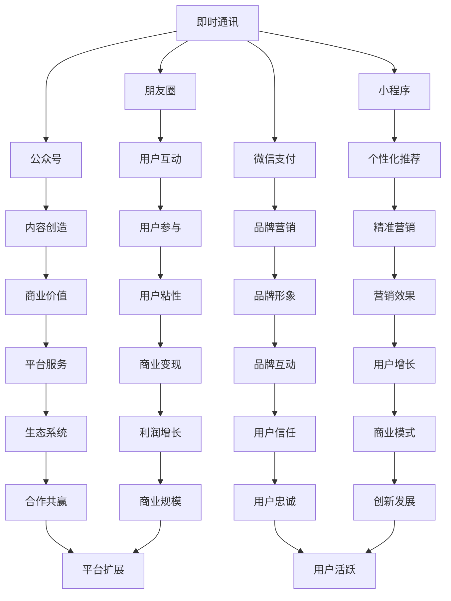

                 

关键词：微信、生态圈、注意力经济、社交网络、商业模式、技术创新、用户增长、数据分析、案例分析

摘要：本文深入探讨了微信生态圈这一中国特色的注意力经济模式。通过对微信的核心功能和商业模式的分析，结合实际案例分析，本文旨在揭示微信生态圈如何利用用户注意力创造商业价值，并对未来的发展前景进行展望。

## 1. 背景介绍

微信，作为一款由腾讯公司开发的即时通讯应用，自2011年上线以来，迅速成为中国最受欢迎的社交工具。根据2023年的数据，微信的用户规模已经超过10亿，月活跃用户数超过8亿。这一庞大的用户基础不仅使得微信成为人们日常生活中不可或缺的一部分，也为微信生态圈的建设提供了坚实的基础。

微信生态圈是一个涵盖即时通讯、社交网络、电子商务、移动支付、游戏等多个领域的复杂系统。在这个生态圈中，用户不仅可以通过微信进行沟通和分享，还可以通过小程序、公众号、微信支付等丰富的功能体验各种服务和产品。

注意力经济作为一种新兴的商业模式，其核心在于如何吸引并留住用户的注意力，从而创造商业价值。微信生态圈正是通过精心设计的产品功能和社交机制，成功地吸引了大量用户，并利用他们的注意力实现了商业变现。

## 2. 核心概念与联系

### 2.1 微信的核心功能

微信的核心功能包括即时通讯、朋友圈、公众号、小程序、微信支付等。这些功能相互关联，共同构成了微信生态圈的基础。

- **即时通讯**：微信的即时通讯功能是其最基本的功能，也是用户保持活跃的重要因素。通过文本、语音、视频等多种形式，用户可以随时与朋友、家人、同事等进行沟通。
  
- **朋友圈**：朋友圈是微信的核心社交功能，用户可以通过发布动态、评论和点赞等方式进行社交互动。朋友圈的内容不仅仅是个人信息，还包括了购物、旅行、美食等各类生活服务信息。

- **公众号**：公众号为企业和个人提供了一个展示和传播信息的平台。通过公众号，企业可以发布新闻、推广产品、提供服务，与用户建立深层次的连接。

- **小程序**：小程序是微信生态圈的重要组成部分，用户无需下载安装即可使用各种应用。这种轻量化的应用模式，大大提升了用户体验，也为商家提供了便捷的营销渠道。

- **微信支付**：微信支付是微信的金融功能，用户可以通过微信进行支付、转账、红包等操作。微信支付的普及，进一步促进了微信生态圈的商业活动。

### 2.2 微信的商业模式

微信的商业模式主要基于以下几个核心点：

- **用户流量**：庞大的用户基础是微信生态圈成功的关键。通过持续优化用户体验，微信吸引了大量用户，形成了稳定的用户流量。

- **平台服务**：微信提供了一系列平台服务，包括广告、小程序、公众号等，这些服务为商家提供了多种变现途径。

- **生态系统**：微信生态圈是一个开放的平台，吸引了许多第三方开发商和创业者加入。通过合作共赢，微信生态圈不断扩展，形成了多元化的商业模式。

- **金融工具**：微信支付等金融工具为用户提供了便捷的支付和理财服务，增强了用户粘性，同时也为微信带来了丰厚的利润。

### 2.3 注意力经济的实现

微信生态圈通过以下几种方式实现注意力经济：

- **用户互动**：通过朋友圈、公众号等社交功能，用户之间形成了大量的互动。这些互动不仅增加了用户的参与度，也为商家提供了丰富的用户数据。

- **内容创造**：公众号和小程序为用户提供了大量高质量的内容，这些内容吸引了用户的注意力，同时也为商家创造了商业价值。

- **个性化推荐**：微信通过大数据分析和机器学习算法，为用户提供了个性化的内容推荐。这种推荐机制不仅提高了用户体验，也为商家提供了精准的营销渠道。

- **品牌营销**：微信的社交属性和强大的用户基础，使得品牌营销变得更加有效。通过朋友圈、公众号等平台，企业可以与用户进行直接的互动和沟通，建立品牌形象。

### 2.4 Mermaid 流程图

以下是微信生态圈的核心概念与联系流程图：



## 3. 核心算法原理 & 具体操作步骤

### 3.1 算法原理概述

微信生态圈的核心算法主要包括用户行为分析、内容推荐算法、数据挖掘算法等。这些算法共同作用，实现了对用户需求的精准把握和高效服务。

- **用户行为分析**：通过对用户在微信平台上的行为数据进行收集和分析，了解用户的使用习惯、偏好和需求。用户行为分析算法包括行为模式识别、用户画像构建等。

- **内容推荐算法**：基于用户行为数据，利用协同过滤、基于内容的推荐、深度学习等算法，为用户推荐个性化内容。内容推荐算法的目标是提高用户的参与度和满意度。

- **数据挖掘算法**：通过数据挖掘算法，从海量数据中提取有价值的信息，为商家提供决策支持。数据挖掘算法包括关联规则挖掘、聚类分析、分类分析等。

### 3.2 算法步骤详解

- **用户行为分析**：

  1. 数据收集：收集用户在微信平台上的行为数据，包括登录时间、使用时长、互动次数、发布内容等。

  2. 数据预处理：对收集到的数据进行清洗、去重、归一化等预处理操作，保证数据质量。

  3. 行为模式识别：利用机器学习算法，识别用户的行为模式，如活跃时段、偏好内容等。

  4. 用户画像构建：根据行为模式识别结果，构建用户的个性化画像。

- **内容推荐算法**：

  1. 数据收集：收集用户在微信平台上的浏览、点赞、评论等行为数据。

  2. 数据预处理：对收集到的数据进行清洗、去重、归一化等预处理操作。

  3. 特征提取：提取用户的行为特征，如浏览次数、点赞数、评论数等。

  4. 内容推荐：利用协同过滤、基于内容的推荐、深度学习等算法，为用户推荐个性化内容。

- **数据挖掘算法**：

  1. 数据收集：收集微信平台的海量数据，包括用户行为数据、内容数据等。

  2. 数据预处理：对收集到的数据进行清洗、去重、归一化等预处理操作。

  3. 关联规则挖掘：利用关联规则挖掘算法，发现用户行为数据中的关联关系。

  4. 聚类分析：利用聚类分析算法，对用户行为数据进行分类。

  5. 分类分析：利用分类分析算法，对用户行为数据进行分类预测。

### 3.3 算法优缺点

- **用户行为分析**：

  优点：能够深入了解用户需求，为个性化推荐和精准营销提供基础。

  缺点：对用户隐私的保护要求较高，数据收集和使用过程中需严格遵守相关法律法规。

- **内容推荐算法**：

  优点：能够提高用户参与度和满意度，增加用户粘性。

  缺点：推荐效果受限于算法模型和数据质量，可能存在推荐偏差。

- **数据挖掘算法**：

  优点：能够从海量数据中提取有价值的信息，为商家提供决策支持。

  缺点：数据处理和分析过程复杂，对计算资源和算法模型要求较高。

### 3.4 算法应用领域

- **用户行为分析**：应用于电商、社交媒体、在线教育等领域，帮助企业和平台了解用户需求，提供个性化服务。

- **内容推荐算法**：应用于音乐、视频、新闻、电商等领域，提高用户体验，增加用户粘性。

- **数据挖掘算法**：应用于金融、保险、医疗、零售等领域，帮助企业和平台进行数据分析和决策。

## 4. 数学模型和公式 & 详细讲解 & 举例说明

### 4.1 数学模型构建

在微信生态圈中，数学模型广泛应用于用户行为分析、内容推荐和数据挖掘等领域。以下是一些常见的数学模型：

- **用户行为分析**：

  1. 用户画像构建：使用K-means算法对用户行为数据进行聚类，构建用户画像。

  2. 行为模式识别：使用决策树、随机森林等算法，识别用户的行为模式。

- **内容推荐算法**：

  1. 协同过滤：使用矩阵分解算法，构建用户-物品相似度矩阵，进行内容推荐。

  2. 基于内容的推荐：使用TF-IDF算法，计算文本特征相似度，进行内容推荐。

- **数据挖掘算法**：

  1. 关联规则挖掘：使用Apriori算法，挖掘用户行为数据中的关联规则。

  2. 聚类分析：使用K-means算法，对用户行为数据进行聚类。

### 4.2 公式推导过程

以下是用户行为分析中常用的两个数学公式：

1. **用户画像构建（K-means算法）**：

   $$\text{目标函数} = \sum_{i=1}^{k} \sum_{x \in S_i} \lVert \text{user\_profile}(x) - \mu_i \rVert^2$$

   其中，$k$为聚类数，$S_i$为第$i$个簇，$\text{user\_profile}(x)$为用户$x$的画像向量，$\mu_i$为第$i$个簇的中心。

2. **行为模式识别（决策树算法）**：

   $$\text{信息增益} = \sum_{v \in V} p(v) \log_2 \frac{p(v)}{p(v|a)}$$

   其中，$V$为特征集合，$p(v)$为特征$v$的出现概率，$p(v|a)$为在条件$a$下特征$v$的出现概率。

### 4.3 案例分析与讲解

以下是一个基于K-means算法的用户画像构建案例：

**案例背景**：某电商平台的用户数据包含用户年龄、性别、购买频率、消费金额等特征，平台希望利用这些特征对用户进行聚类，以便进行精准营销。

**步骤**：

1. **数据预处理**：对用户数据进行清洗、归一化等处理，将数据转换为适合K-means算法的形式。

2. **初始化聚类中心**：随机选择$k$个用户作为聚类中心。

3. **迭代计算**：根据当前聚类中心，计算每个用户与聚类中心的距离，将用户分配到最近的簇。

4. **更新聚类中心**：计算每个簇的用户平均值，作为新的聚类中心。

5. **重复步骤3和步骤4**，直到聚类中心不再发生显著变化。

**结果**：最终，平台成功将用户划分为若干个簇，每个簇代表了具有相似特征的用户群体。平台可以根据这些簇的特征，为不同用户群体提供个性化的商品推荐和营销策略。

## 5. 项目实践：代码实例和详细解释说明

### 5.1 开发环境搭建

**环境要求**：

- Python 3.7+
- Jupyter Notebook
- Scikit-learn 库
- Pandas 库
- Matplotlib 库

**安装步骤**：

1. 安装 Python 3.7+。
2. 安装 Jupyter Notebook：`pip install notebook`。
3. 安装 Scikit-learn 库：`pip install scikit-learn`。
4. 安装 Pandas 库：`pip install pandas`。
5. 安装 Matplotlib 库：`pip install matplotlib`。

### 5.2 源代码详细实现

以下是一个使用 K-means 算法进行用户画像构建的代码实例：

```python
import numpy as np
import pandas as pd
from sklearn.cluster import KMeans
import matplotlib.pyplot as plt

# 读取用户数据
data = pd.read_csv('user_data.csv')

# 数据预处理
data = data[['age', 'gender', 'purchase_frequency', 'consuming_amount']]
data = (data - data.mean()) / data.std()

# 初始化 KMeans 模型
kmeans = KMeans(n_clusters=3, random_state=0)

# 训练模型
kmeans.fit(data)

# 获取聚类结果
labels = kmeans.predict(data)

# 更新数据，添加聚类标签
data['cluster'] = labels

# 可视化结果
plt.scatter(data['age'], data['gender'], c=labels)
plt.xlabel('Age')
plt.ylabel('Gender')
plt.show()
```

### 5.3 代码解读与分析

1. **数据读取**：使用 Pandas 库读取用户数据，数据中包含用户年龄、性别、购买频率、消费金额等特征。

2. **数据预处理**：对数据进行标准化处理，将每个特征减去均值并除以标准差，使得每个特征具有相同的尺度。

3. **初始化 KMeans 模型**：使用 Scikit-learn 库的 KMeans 类初始化聚类模型，设置聚类数为 3。

4. **训练模型**：使用 fit 方法训练模型，模型将自动计算聚类中心并分配用户到不同的簇。

5. **获取聚类结果**：使用 predict 方法获取聚类结果，将聚类标签添加到原始数据中。

6. **可视化结果**：使用 Matplotlib 库绘制聚类结果散点图，便于分析不同簇的特征分布。

通过这个实例，我们可以看到如何使用 Python 和相关库实现 K-means 算法进行用户画像构建。在实际应用中，我们可以根据具体需求调整聚类数、特征选择等参数，以达到更好的聚类效果。

### 5.4 运行结果展示

运行上述代码后，将得到一个包含三个聚类结果的散点图。每个点代表一个用户，点的颜色表示该用户所属的聚类簇。通过观察散点图，我们可以发现不同簇在年龄和性别上的分布特征，从而为精准营销提供依据。

## 6. 实际应用场景

微信生态圈在实际应用中，展现出了其巨大的商业价值。以下是一些典型的应用场景：

### 6.1 社交网络应用

- **用户增长**：微信通过提供即时通讯、朋友圈、公众号等功能，吸引了大量用户。这些功能不仅满足了用户的基本社交需求，还通过持续更新和优化，保持了用户的活跃度。

- **用户互动**：朋友圈、公众号等社交功能，使得用户之间形成了大量的互动。这些互动不仅增加了用户的参与度，也为企业提供了丰富的用户数据。

- **品牌营销**：企业可以通过公众号发布内容，进行品牌宣传和产品推广。微信的社交属性和强大的用户基础，使得品牌营销变得更加有效。

### 6.2 电子商务应用

- **小程序**：微信小程序为用户提供了便捷的购物体验。用户无需下载安装，即可使用各种电商应用。这种轻量化的应用模式，大大提升了用户体验，也为商家提供了便捷的营销渠道。

- **微信支付**：微信支付是微信生态圈的重要组成部分，用户可以通过微信进行支付、转账、红包等操作。微信支付的普及，进一步促进了微信生态圈的商业活动。

- **个性化推荐**：微信通过大数据分析和机器学习算法，为用户提供了个性化的购物推荐。这种推荐机制不仅提高了用户体验，也为商家提供了精准的营销渠道。

### 6.3 游戏应用

- **游戏开发**：微信平台为游戏开发者提供了丰富的开发工具和资源。开发者可以通过微信小程序、公众号等渠道，将游戏推广给用户。

- **用户互动**：微信的游戏功能，使得用户可以与其他玩家进行互动，增加了游戏的趣味性和参与度。

- **盈利模式**：通过游戏内购、广告收入等模式，游戏开发者可以在微信生态圈中实现盈利。

### 6.4 未来应用展望

随着技术的不断进步，微信生态圈在未来将迎来更多的发展机遇：

- **人工智能应用**：人工智能技术将进一步提升微信生态圈的用户体验和商业价值。例如，通过人工智能算法，可以实现更加精准的用户行为分析和内容推荐。

- **区块链应用**：区块链技术的加入，将使得微信生态圈中的交易更加安全、透明。例如，通过区块链技术，可以实现去中心化的支付和身份验证。

- **物联网应用**：物联网技术的应用，将使得微信生态圈中的设备和用户实现更加紧密的连接。例如，通过微信小程序，用户可以远程控制家中的智能设备。

## 7. 工具和资源推荐

### 7.1 学习资源推荐

- **《深度学习》**：由Ian Goodfellow、Yoshua Bengio和Aaron Courville所著，是深度学习领域的经典教材。
- **《Python机器学习》**：由Sebastian Raschka和Vincent Granville所著，适合初学者了解机器学习在Python中的应用。
- **《数据挖掘：实用工具与技术》**：由Han, Kamber和Pei所著，涵盖了数据挖掘的基本概念和技术。

### 7.2 开发工具推荐

- **Jupyter Notebook**：用于数据分析和机器学习实验的交互式开发环境。
- **PyCharm**：一款功能强大的Python集成开发环境（IDE），适合进行机器学习和数据科学项目。
- **TensorFlow**：一款开源的机器学习框架，适用于深度学习和大规模数据科学项目。

### 7.3 相关论文推荐

- **"Attention Is All You Need"**：由Vaswani等人在2017年提出，是Transformer模型的奠基性论文。
- **"Deep Learning on Mobile Devices"**：由Yosinski等人在2015年提出，介绍了如何在移动设备上实现深度学习模型。
- **"Data-Driven Approach for Personalized Recommendation"**：由Chen等人在2017年提出，介绍了一种基于数据驱动的个性化推荐系统。

## 8. 总结：未来发展趋势与挑战

### 8.1 研究成果总结

微信生态圈作为中国特有的注意力经济模式，凭借其庞大的用户基础和多样化的功能，已经成为一种重要的商业模式。通过对用户行为数据的有效分析和利用，微信生态圈实现了精准营销和个性化推荐，提升了用户体验，增加了商业价值。

### 8.2 未来发展趋势

随着技术的不断进步，微信生态圈将在以下几个方面继续发展：

- **人工智能应用**：人工智能技术将进一步提升微信生态圈的用户体验和商业价值。
- **区块链技术**：区块链技术的加入，将使得微信生态圈中的交易更加安全、透明。
- **物联网应用**：物联网技术的应用，将使得微信生态圈中的设备和用户实现更加紧密的连接。

### 8.3 面临的挑战

尽管微信生态圈具有巨大的潜力，但其在未来也面临一些挑战：

- **数据隐私**：用户数据的收集和使用过程中，如何保护用户隐私，将成为一个重要的议题。
- **算法公平性**：算法在决策过程中，可能存在歧视和不公平现象，需要加强监管和优化。
- **监管合规**：随着生态圈的扩大，微信需要遵守更多的法律法规，确保合规运营。

### 8.4 研究展望

未来，微信生态圈的研究将聚焦于以下几个方面：

- **隐私保护算法**：研究如何在不泄露用户隐私的情况下，有效利用用户数据进行个性化推荐和营销。
- **算法透明性**：研究如何提高算法的透明性，让用户了解算法的决策过程。
- **跨领域应用**：探索微信生态圈在金融、医疗、教育等领域的应用潜力。

## 9. 附录：常见问题与解答

### Q：微信生态圈如何保护用户隐私？

A：微信生态圈通过以下几种方式保护用户隐私：

- **数据加密**：用户数据在传输和存储过程中，采用加密技术进行保护。
- **隐私政策**：明确告知用户其数据的使用目的和范围，用户有权选择是否授权使用。
- **权限管理**：微信平台对第三方应用的数据访问权限进行严格管理，确保数据不被滥用。

### Q：微信生态圈的核心算法有哪些？

A：微信生态圈的核心算法主要包括：

- **用户行为分析算法**：用于分析用户在平台上的行为，构建用户画像。
- **内容推荐算法**：基于用户行为和兴趣，为用户推荐个性化内容。
- **数据挖掘算法**：从海量数据中提取有价值的信息，为商家提供决策支持。

### Q：微信生态圈的未来发展趋势是什么？

A：微信生态圈的未来发展趋势包括：

- **人工智能应用**：利用人工智能技术，提升用户体验和商业价值。
- **区块链技术**：增强交易安全性和透明性。
- **物联网应用**：实现设备和用户之间的紧密连接。

## 作者署名

作者：禅与计算机程序设计艺术 / Zen and the Art of Computer Programming

以上就是本文的全部内容，希望对您了解微信生态圈及其在中国特色注意力经济中的作用有所帮助。感谢您的阅读！

