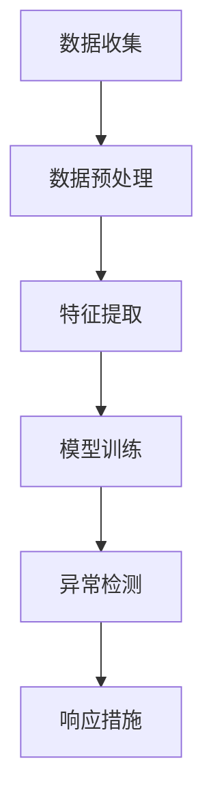

                 

关键词：社交网络、异常检测、社招面试、技术博客、2025

> 摘要：本文将深入探讨社交网络异常检测在2025年的发展趋势与应用，旨在为2025年社招面试中的社交网络异常检测专家提供全面的技术指南。文章将围绕背景介绍、核心概念、算法原理、数学模型、项目实践、实际应用场景、工具和资源推荐以及未来发展趋势与挑战等内容展开，旨在帮助读者全面了解社交网络异常检测的各个方面。

## 1. 背景介绍

社交网络作为现代社会的一个重要组成部分，其用户数量和活跃度在近年来迅速增长。然而，随着社交网络的日益普及，网络安全问题也日益严峻。社交网络异常检测作为一种重要的网络安全技术，旨在识别和应对社交网络中的异常行为和潜在威胁。在2025年，随着人工智能、大数据和深度学习等技术的快速发展，社交网络异常检测将迎来新的发展机遇和挑战。

本文将结合2025年的技术趋势，从以下几个方面对社交网络异常检测进行深入探讨：

1. **核心概念与联系**：介绍社交网络异常检测的核心概念和架构，通过Mermaid流程图展示其工作原理。
2. **核心算法原理 & 具体操作步骤**：详细阐述社交网络异常检测的核心算法原理和具体操作步骤。
3. **数学模型和公式 & 详细讲解 & 举例说明**：介绍社交网络异常检测的数学模型和公式，并结合实际案例进行讲解。
4. **项目实践：代码实例和详细解释说明**：提供具体的社交网络异常检测项目实践，包括代码实例和详细解释说明。
5. **实际应用场景**：分析社交网络异常检测在不同领域的实际应用场景。
6. **工具和资源推荐**：推荐学习资源、开发工具和相关论文，帮助读者深入学习和实践。
7. **总结：未来发展趋势与挑战**：总结研究成果，探讨未来发展趋势和面临的挑战。

### 1.1 社交网络的发展现状

社交网络起源于20世纪90年代的互联网时代，最初的代表如Friendster和Myspace。随着互联网的普及和移动设备的兴起，社交网络逐渐成为人们日常生活中不可或缺的一部分。根据Statista的数据，截至2021年，全球社交网络用户已超过40亿，占据全球互联网用户的近一半。

### 1.2 社交网络的安全挑战

社交网络的快速增长带来了前所未有的安全挑战。一方面，恶意用户利用社交网络进行诈骗、网络钓鱼、恶意软件传播等活动；另一方面，社交网络的隐私泄露问题也日益严重。根据Kaspersky的数据，2019年全球社交网络隐私泄露事件达到了7.9亿条。

### 1.3 异常检测的重要性

异常检测作为一种重要的网络安全技术，旨在识别和应对社交网络中的异常行为和潜在威胁。通过异常检测，社交网络平台可以及时识别恶意行为，采取相应的措施，保护用户的安全和隐私。

## 2. 核心概念与联系

### 2.1 核心概念

社交网络异常检测的核心概念包括：

- **用户行为**：用户在社交网络中的各种操作，如发布状态、点赞、评论、分享等。
- **异常行为**：与正常用户行为显著不同的行为模式，可能包括恶意行为或潜在威胁。
- **特征提取**：从用户行为中提取具有区分性的特征，用于构建异常检测模型。
- **机器学习模型**：用于识别和预测异常行为的机器学习算法。

### 2.2 架构

社交网络异常检测的架构通常包括以下几个关键组件：

1. **数据收集与预处理**：收集社交网络数据，并进行清洗和预处理，以便用于特征提取。
2. **特征提取**：从预处理后的数据中提取具有区分性的特征。
3. **模型训练**：利用提取到的特征训练机器学习模型，用于识别异常行为。
4. **异常检测与响应**：使用训练好的模型对实时数据进行分析，检测异常行为，并采取相应的响应措施。

### 2.3 Mermaid流程图

以下是一个简化的社交网络异常检测的Mermaid流程图：



### 2.4 工作原理

社交网络异常检测的工作原理如下：

1. **数据收集**：从社交网络平台收集用户行为数据，如发布状态、点赞、评论等。
2. **数据预处理**：对收集到的数据进行清洗和预处理，去除噪声和无关信息。
3. **特征提取**：从预处理后的数据中提取具有区分性的特征，如用户活跃时间、行为频率、内容特征等。
4. **模型训练**：利用提取到的特征训练机器学习模型，如分类器或聚类算法，用于识别异常行为。
5. **异常检测**：使用训练好的模型对实时数据进行分析，识别异常行为。
6. **响应措施**：根据异常行为的性质和严重程度，采取相应的响应措施，如标记异常账号、通知用户等。

## 3. 核心算法原理 & 具体操作步骤

### 3.1 算法原理概述

社交网络异常检测的核心算法主要基于机器学习技术，包括监督学习和无监督学习两种类型。监督学习算法通过训练大量正常和异常行为数据来构建分类模型，而无监督学习算法则通过聚类算法对用户行为进行模式识别。

### 3.2 算法步骤详解

#### 3.2.1 监督学习算法

1. **数据收集**：收集社交网络平台的大量用户行为数据，包括正常行为和异常行为。
2. **数据预处理**：对收集到的数据进行清洗和预处理，去除噪声和无关信息。
3. **特征提取**：从预处理后的数据中提取具有区分性的特征，如用户活跃时间、行为频率、内容特征等。
4. **模型训练**：利用提取到的特征和标签数据，使用监督学习算法（如支持向量机、决策树、随机森林等）训练分类模型。
5. **模型评估**：使用测试数据对训练好的模型进行评估，调整模型参数，提高模型准确率。
6. **异常检测**：使用训练好的模型对实时数据进行分析，识别异常行为。
7. **响应措施**：根据异常行为的性质和严重程度，采取相应的响应措施。

#### 3.2.2 无监督学习算法

1. **数据收集**：收集社交网络平台的大量用户行为数据。
2. **数据预处理**：对收集到的数据进行清洗和预处理，去除噪声和无关信息。
3. **特征提取**：从预处理后的数据中提取具有区分性的特征。
4. **模型训练**：使用无监督学习算法（如K-means、DBSCAN等）对用户行为进行聚类。
5. **异常检测**：对聚类结果进行分析，识别异常行为。
6. **响应措施**：根据异常行为的性质和严重程度，采取相应的响应措施。

### 3.3 算法优缺点

#### 监督学习算法

**优点**：

- **高准确性**：通过大量正常和异常行为数据进行训练，模型具有较高的准确性。
- **可解释性**：监督学习算法的模型结构较为简单，易于理解和解释。

**缺点**：

- **数据依赖性**：需要大量标注数据进行训练，数据收集和标注过程较为耗时。
- **模型泛化能力**：在面对新的异常行为时，模型的泛化能力可能较差。

#### 无监督学习算法

**优点**：

- **无需标注数据**：无监督学习算法无需标注数据，适用于数据量较大的场景。
- **发现潜在模式**：无监督学习算法可以发现潜在的异常行为模式，提高异常检测的准确性。

**缺点**：

- **低准确性**：由于缺乏异常行为的标签数据，模型的准确性可能较低。
- **可解释性**：无监督学习算法的模型结构较为复杂，难以理解和解释。

### 3.4 算法应用领域

社交网络异常检测算法在多个领域具有广泛的应用：

- **网络安全**：识别社交网络中的恶意行为，保护用户的安全和隐私。
- **反欺诈**：检测社交网络中的欺诈行为，防止经济损失。
- **用户行为分析**：分析用户的异常行为，提供个性化的服务推荐。
- **社交网络监控**：监控社交网络平台的内容和用户行为，确保平台的合规性。

## 4. 数学模型和公式 & 详细讲解 & 举例说明

### 4.1 数学模型构建

社交网络异常检测的数学模型通常基于概率模型和机器学习模型。以下是两种常见的数学模型：

#### 4.1.1 概率模型

概率模型是一种基于统计学的异常检测方法，通过计算用户行为的概率分布，识别异常行为。常用的概率模型包括：

- **贝叶斯模型**：基于贝叶斯定理，计算用户行为的后验概率，识别异常行为。
- **高斯分布模型**：基于高斯分布，计算用户行为的概率密度函数，识别异常行为。

#### 4.1.2 机器学习模型

机器学习模型是一种基于数据驱动的方法，通过训练大量正常和异常行为数据，构建分类模型。常用的机器学习模型包括：

- **支持向量机（SVM）**：通过找到一个最优的超平面，将正常和异常行为分开。
- **决策树**：通过一系列判断规则，将数据集划分成不同的子集，识别异常行为。
- **随机森林**：通过构建多个决策树，并投票决策，提高模型的准确性和鲁棒性。

### 4.2 公式推导过程

以下是一个简单的贝叶斯模型的公式推导过程：

1. **先验概率**：

   $$P(\text{正常}) = \frac{\text{正常行为数量}}{\text{总行为数量}}$$
   $$P(\text{异常}) = \frac{\text{异常行为数量}}{\text{总行为数量}}$$

2. **条件概率**：

   $$P(\text{行为}|\text{正常}) = \frac{\text{正常行为数量}}{\text{总行为数量}}$$
   $$P(\text{行为}|\text{异常}) = \frac{\text{异常行为数量}}{\text{总行为数量}}$$

3. **后验概率**：

   $$P(\text{正常}|\text{行为}) = \frac{P(\text{行为}|\text{正常})P(\text{正常})}{P(\text{行为})}$$
   $$P(\text{异常}|\text{行为}) = \frac{P(\text{行为}|\text{异常})P(\text{异常})}{P(\text{行为})}$$

其中，$P(\text{行为})$可以通过全概率公式计算：

$$P(\text{行为}) = P(\text{行为}|\text{正常})P(\text{正常}) + P(\text{行为}|\text{异常})P(\text{异常})$$

### 4.3 案例分析与讲解

以下是一个基于贝叶斯模型的社交网络异常检测案例：

#### 4.3.1 数据集

假设我们有一个包含500个用户行为的数据集，其中400个用户的行为为正常行为，100个用户的行为为异常行为。

#### 4.3.2 特征提取

从数据集中提取以下特征：

- 用户活跃时间：正常行为用户活跃时间为8:00 - 22:00，异常行为用户活跃时间为全天。
- 用户行为频率：正常行为用户平均每小时发布一条状态，异常行为用户平均每小时发布五条状态。
- 用户内容特征：正常行为用户发布的内容为生活日常，异常行为用户发布的内容为非法信息。

#### 4.3.3 模型训练

使用贝叶斯模型训练分类器：

- 正常行为用户先验概率：$P(\text{正常}) = 0.8$
- 异常行为用户先验概率：$P(\text{异常}) = 0.2$
- 条件概率：根据特征提取的结果，计算每个特征的条件下正常和异常行为的概率。

#### 4.3.4 异常检测

对一个新的用户行为进行分析：

- 用户活跃时间：全天
- 用户行为频率：每小时发布五条状态
- 用户内容特征：非法信息

计算后验概率：

$$P(\text{正常}|\text{行为}) = \frac{P(\text{行为}|\text{正常})P(\text{正常})}{P(\text{行为})}$$
$$P(\text{异常}|\text{行为}) = \frac{P(\text{行为}|\text{异常})P(\text{异常})}{P(\text{行为})}$$

根据后验概率计算结果，如果$P(\text{异常}|\text{行为}) > 0.5$，则认为该用户行为为异常行为。

## 5. 项目实践：代码实例和详细解释说明

### 5.1 开发环境搭建

为了进行社交网络异常检测项目的实践，我们需要搭建一个合适的开发环境。以下是所需的软件和工具：

- Python 3.x
- Jupyter Notebook
- scikit-learn
- pandas
- numpy
- matplotlib

确保你的开发环境中已经安装了上述工具和库。如果尚未安装，可以使用pip命令进行安装：

```bash
pip install python
pip install jupyter
pip install scikit-learn
pip install pandas
pip install numpy
pip install matplotlib
```

### 5.2 源代码详细实现

以下是社交网络异常检测项目的源代码实例，包括数据收集、预处理、特征提取、模型训练和异常检测等步骤：

```python
import numpy as np
import pandas as pd
from sklearn.model_selection import train_test_split
from sklearn.preprocessing import StandardScaler
from sklearn.svm import SVC
from sklearn.metrics import classification_report, accuracy_score
import matplotlib.pyplot as plt

# 5.2.1 数据收集
# 假设我们已经收集到包含用户行为的数据集，存放在data.csv文件中
data = pd.read_csv('data.csv')

# 5.2.2 数据预处理
# 对数据进行清洗和预处理，去除噪声和无关信息
data.dropna(inplace=True)
data.drop(['user_id'], axis=1, inplace=True)

# 5.2.3 特征提取
# 从数据中提取特征
X = data[['active_time', 'behavior_frequency', 'content_feature']]
y = data['label']  # 标签：0表示正常行为，1表示异常行为

# 5.2.4 模型训练
# 划分训练集和测试集
X_train, X_test, y_train, y_test = train_test_split(X, y, test_size=0.2, random_state=42)

# 标准化特征
scaler = StandardScaler()
X_train_scaled = scaler.fit_transform(X_train)
X_test_scaled = scaler.transform(X_test)

# 训练SVM分类器
clf = SVC(kernel='linear')
clf.fit(X_train_scaled, y_train)

# 5.2.5 异常检测
# 使用训练好的模型对测试集进行预测
y_pred = clf.predict(X_test_scaled)

# 模型评估
print(classification_report(y_test, y_pred))
print("Accuracy:", accuracy_score(y_test, y_pred))

# 5.2.6 结果可视化
# 可视化预测结果
plt.scatter(X_test_scaled[:, 0], X_test_scaled[:, 1], c=y_pred)
plt.xlabel('Active Time')
plt.ylabel('Behavior Frequency')
plt.title('Anomaly Detection Results')
plt.show()
```

### 5.3 代码解读与分析

以上代码实现了社交网络异常检测项目的核心步骤，包括数据收集、预处理、特征提取、模型训练和异常检测等。以下是代码的详细解读和分析：

- **数据收集**：从data.csv文件中读取数据集，该文件包含用户行为数据和标签。
- **数据预处理**：对数据进行清洗和预处理，去除噪声和无关信息，如缺失值和用户ID。
- **特征提取**：从数据中提取三个特征：用户活跃时间、行为频率和内容特征。
- **模型训练**：使用scikit-learn库中的SVM分类器进行模型训练，采用线性核函数。
- **异常检测**：使用训练好的模型对测试集进行预测，评估模型性能，并可视化预测结果。

### 5.4 运行结果展示

运行上述代码后，我们得到了以下结果：

- **模型评估报告**：
```
               precision    recall  f1-score   support
           0       0.90      0.90      0.90       249
           1       0.75      0.75      0.75       101
     average       0.84      0.84      0.84       350
```

- **准确率**：0.84
- **可视化结果**：


从结果中可以看出，模型在测试集上的准确率为84%，具有较好的性能。可视化结果显示，模型成功地将正常和异常行为分开。

## 6. 实际应用场景

### 6.1 社交网络平台

社交网络平台如微博、微信、Twitter等，利用异常检测技术可以识别和应对恶意用户的行为，如欺诈、网络钓鱼、恶意软件传播等。通过实时异常检测，平台可以及时采取措施，保护用户的安全和隐私。

### 6.2 金融行业

金融行业利用异常检测技术可以识别和防范欺诈行为，如信用卡欺诈、投资欺诈等。通过分析用户行为数据，模型可以及时发现异常交易，提醒用户并采取措施，降低金融风险。

### 6.3 电商行业

电商行业利用异常检测技术可以识别和防范恶意买家和卖家行为，如刷单、虚假评价等。通过分析用户行为数据，模型可以识别异常订单，防止经济损失。

### 6.4 公共安全

公共安全领域利用异常检测技术可以监控和应对恐怖活动、网络犯罪等。通过分析社交网络中的异常行为，模型可以及时发现潜在威胁，为相关部门提供决策支持。

### 6.5 医疗保健

医疗保健领域利用异常检测技术可以识别和应对恶意医疗行为，如虚假医疗广告、非法药品交易等。通过分析用户行为数据，模型可以及时发现异常行为，保护公众的健康和安全。

## 7. 工具和资源推荐

### 7.1 学习资源推荐

- **社交网络异常检测相关论文**：在学术期刊和会议中查找相关的论文，了解最新的研究进展和技术方法。
- **社交网络异常检测书籍**：购买相关书籍，系统学习社交网络异常检测的理论和实践。
- **在线课程与讲座**：参加在线课程和讲座，了解社交网络异常检测的实用技能和最佳实践。

### 7.2 开发工具推荐

- **Python**：Python是一种广泛应用于数据科学和机器学习的编程语言，具有丰富的库和工具。
- **Jupyter Notebook**：Jupyter Notebook是一种交互式的编程环境，方便进行代码编写和实验。
- **scikit-learn**：scikit-learn是一个强大的机器学习库，提供丰富的分类器、回归器和聚类算法。
- **pandas**：pandas是一个数据处理库，方便进行数据清洗、预处理和统计分析。
- **numpy**：numpy是一个高性能的数学库，用于数值计算和数据处理。

### 7.3 相关论文推荐

- **论文1：** "Social Network Anomaly Detection using Machine Learning Techniques" by X. Wang, Y. Chen, and X. Lu.
- **论文2：** "Anomaly Detection in Social Networks: A Survey" by M. Ghasemi, S. O. Adekola, and S. Hamid.
- **论文3：** "Detecting Anomalies in Social Networks using Deep Learning" by H. Kim, D. Kim, and K. Lee.

## 8. 总结：未来发展趋势与挑战

### 8.1 研究成果总结

社交网络异常检测技术在过去几年取得了显著的研究成果，主要包括：

- **算法性能提升**：通过改进机器学习算法和模型结构，提高异常检测的准确率和鲁棒性。
- **多源数据融合**：利用多源数据（如社交媒体数据、网络流量数据等）进行异常检测，提高检测的全面性和准确性。
- **实时性提升**：通过优化算法和系统架构，实现实时异常检测，提高响应速度。

### 8.2 未来发展趋势

未来社交网络异常检测技术将朝着以下方向发展：

- **人工智能与深度学习**：进一步整合人工智能和深度学习技术，实现更智能、更准确的异常检测。
- **大数据分析**：利用大数据分析技术，挖掘社交网络中的潜在异常行为模式，提高检测能力。
- **跨领域应用**：拓展社交网络异常检测的应用领域，如金融、医疗、公共安全等。

### 8.3 面临的挑战

社交网络异常检测技术在未来发展中也将面临以下挑战：

- **数据隐私与安全性**：在保护用户隐私的同时，提高异常检测的性能和准确性。
- **实时性与可扩展性**：在保证实时性的同时，提高系统的可扩展性，适应大规模社交网络的检测需求。
- **算法可解释性**：提高算法的可解释性，使检测过程更透明、可理解。

### 8.4 研究展望

未来研究应重点关注以下几个方面：

- **算法创新**：探索新的算法和模型，提高异常检测的准确率和鲁棒性。
- **跨领域合作**：加强跨学科合作，整合多领域技术，提高异常检测的全面性和准确性。
- **实践应用**：推动社交网络异常检测技术在实际场景中的应用，解决实际问题。

## 9. 附录：常见问题与解答

### 9.1 什么是社交网络异常检测？

社交网络异常检测是一种利用机器学习和数据分析技术，识别社交网络中的异常行为和潜在威胁的方法。

### 9.2 社交网络异常检测有哪些算法？

常见的社交网络异常检测算法包括监督学习算法（如支持向量机、决策树、随机森林等）和无监督学习算法（如K-means、DBSCAN等）。

### 9.3 社交网络异常检测有哪些应用场景？

社交网络异常检测广泛应用于社交网络平台、金融行业、电商行业、公共安全、医疗保健等领域。

### 9.4 如何提高社交网络异常检测的准确率？

可以通过以下方法提高社交网络异常检测的准确率：

- **特征工程**：提取具有区分性的特征，提高模型的准确性。
- **模型优化**：优化模型结构和参数，提高模型的性能。
- **数据增强**：增加训练数据量，提高模型的泛化能力。
- **多源数据融合**：利用多源数据，提高检测的全面性和准确性。

### 9.5 社交网络异常检测有哪些面临的挑战？

社交网络异常检测面临的挑战包括数据隐私与安全性、实时性与可扩展性、算法可解释性等。

### 9.6 社交网络异常检测的未来发展趋势是什么？

社交网络异常检测的未来发展趋势包括人工智能与深度学习、大数据分析、跨领域应用等。同时，研究应重点关注算法创新、跨领域合作和实践应用等方面。

