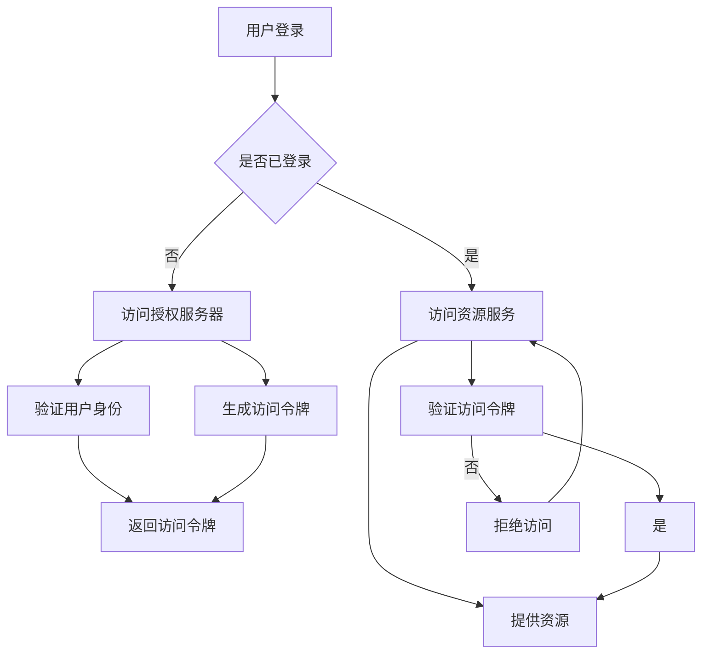

                 

关键词：微服务、OAuth2、JWT、安全性、认证、授权、身份验证、令牌、API安全。

## 摘要

本文将深入探讨微服务架构中常用的安全协议——OAuth2和JSON Web Token（JWT）。首先，我们将回顾微服务架构的背景和安全需求，然后详细介绍OAuth2和JWT的原理和实现。通过具体的案例分析，我们将展示如何在微服务环境中部署和配置这两种协议。最后，我们将讨论这两种协议的应用场景、优势和局限性，并提出未来的发展方向。

## 1. 背景介绍

### 微服务架构的兴起

微服务架构是一种构建大型应用程序的方法，它将应用程序划分为一系列小型、独立的服务。每个服务负责实现特定的功能，并且可以通过轻量级的通信机制（如HTTP/HTTPS、消息队列等）相互交互。微服务架构具有许多优点，包括：

- **可扩展性**：每个服务都可以独立扩展，从而满足不断增长的需求。
- **弹性**：一个服务失败不会影响其他服务的正常运行。
- **技术多样性**：不同服务可以使用不同的编程语言、数据库和数据存储。
- **持续集成和持续部署**：每个服务都可以独立开发、测试和部署。

### 微服务架构的安全需求

随着微服务架构的兴起，安全性成为一个至关重要的关注点。以下是一些微服务架构中的主要安全需求：

- **认证**：确保只有授权的用户和系统可以访问服务和数据。
- **授权**：确保用户只能访问他们有权访问的服务和数据。
- **数据完整性**：确保数据在传输和存储过程中未被篡改。
- **数据保密性**：确保敏感数据在传输和存储过程中得到充分保护。

## 2. 核心概念与联系

为了确保微服务的安全性，我们需要了解一些核心概念和它们之间的关系。以下是我们在本文中将会涉及的关键概念：

- **OAuth2**：一种开放标准，允许第三方应用访问用户资源，而无需直接获取用户密码。
- **JWT**：一种基于JSON的开放标准，用于在通信双方之间安全地传递信息。
- **认证**：验证用户身份的过程。
- **授权**：确定用户是否有权限执行特定操作的过程。

### OAuth2和JWT的关系

OAuth2和JWT在微服务安全中发挥着重要作用。OAuth2负责处理认证和授权，而JWT则用于在客户端和服务端之间传递安全信息。具体来说：

- **OAuth2** 提供了一种授权机制，允许客户端通过授权服务器获取访问令牌。
- **JWT** 则用于在客户端和服务器之间传递这些访问令牌，确保它们在传输过程中不会被篡改。

### Mermaid流程图

为了更好地理解OAuth2和JWT的工作流程，我们可以使用Mermaid流程图来展示它们的核心步骤：



## 3. 核心算法原理 & 具体操作步骤

### 3.1 算法原理概述

#### OAuth2

OAuth2是一种开放标准，它允许第三方应用访问用户资源，而无需直接获取用户密码。OAuth2的工作原理如下：

1. **认证**：用户在授权服务器上登录，并同意第三方应用访问其资源。
2. **授权**：授权服务器生成访问令牌，并将其发送给第三方应用。
3. **访问资源**：第三方应用使用访问令牌访问用户资源。

#### JWT

JWT是一种基于JSON的开放标准，用于在通信双方之间安全地传递信息。JWT的工作原理如下：

1. **生成JWT**：服务器使用用户的身份信息（如用户名、权限等）生成JWT。
2. **传输JWT**：客户端将JWT发送给服务器。
3. **验证JWT**：服务器验证JWT的签名和有效性，并根据JWT的内容确定用户身份和权限。

### 3.2 算法步骤详解

#### OAuth2

1. **用户登录**：用户访问第三方应用，并输入用户名和密码。
2. **认证**：第三方应用将用户名和密码发送给授权服务器，授权服务器验证用户身份并生成访问令牌。
3. **授权**：授权服务器将访问令牌发送给第三方应用。
4. **访问资源**：第三方应用使用访问令牌访问用户资源，如用户的个人信息、文件等。

#### JWT

1. **生成JWT**：服务器使用用户的身份信息和加密算法生成JWT。
2. **传输JWT**：客户端将JWT存储在本地（如浏览器Cookie中）或将其作为HTTP请求的头部发送给服务器。
3. **验证JWT**：服务器接收JWT并使用相同的加密算法验证其签名和有效性。如果JWT有效，服务器将解析JWT并获取用户身份和权限。

### 3.3 算法优缺点

#### OAuth2

**优点**：

- **安全性**：OAuth2使用令牌代替用户密码，从而减少密码泄露的风险。
- **灵活性**：OAuth2允许第三方应用访问用户资源，而无需直接获取用户密码，从而提高应用程序的可扩展性。
- **通用性**：OAuth2是一种开放标准，可以在各种不同的应用程序和服务中实现。

**缺点**：

- **复杂性**：OAuth2协议相对复杂，需要处理多种不同的令牌和认证方式。
- **性能开销**：每次请求资源时，都需要验证访问令牌，这可能会增加服务器的性能开销。

#### JWT

**优点**：

- **简单性**：JWT协议相对简单，易于实现和理解。
- **性能**：JWT可以在客户端和服务端之间快速传递，从而提高应用程序的性能。
- **安全性**：JWT使用加密算法对令牌进行签名，从而确保其在传输过程中不会被篡改。

**缺点**：

- **存储需求**：JWT通常包含大量用户信息，因此需要更多的存储空间。
- **持久性问题**：由于JWT是自包含的，因此它们可能会在传输过程中丢失或损坏。

### 3.4 算法应用领域

#### OAuth2

OAuth2适用于需要第三方应用访问用户资源的场景，例如：

- **社交媒体登录**：用户可以使用第三方应用（如Facebook、Google等）登录到其他网站。
- **API访问控制**：第三方应用可以访问用户的API，从而实现自定义功能。

#### JWT

JWT适用于需要快速、高效地传递用户信息的场景，例如：

- **Web应用**：在客户端和服务器之间传递用户身份和权限信息。
- **移动应用**：在移动设备和服务器之间传递用户信息。

## 4. 数学模型和公式 & 详细讲解 & 举例说明

### 4.1 数学模型构建

在OAuth2和JWT的实现过程中，我们需要使用一些数学模型和公式。以下是一个简单的数学模型，用于生成和验证JWT：

- **哈希函数**：用于生成JWT的签名。
- **加密算法**：用于加密JWT的负载。
- **签名算法**：用于对JWT进行签名。

### 4.2 公式推导过程

假设我们有一个JWT，它由三个部分组成：头部（Header）、负载（Payload）和签名（Signature）。我们可以使用以下公式来生成和验证JWT：

1. **生成JWT**：

   - **头部**：`{"alg":"HS256","typ":"JWT"}`，其中`alg`表示加密算法，`typ`表示JWT类型。
   - **负载**：`{"sub":"user1","exp":1506819191}`，其中`sub`表示用户ID，`exp`表示令牌过期时间。
   - **签名**：使用加密算法和密钥对头部和负载进行签名。

2. **验证JWT**：

   - **接收JWT**：从客户端接收JWT。
   - **解析JWT**：将JWT分为头部、负载和签名。
   - **验证签名**：使用加密算法和密钥验证签名是否与头部和负载匹配。

### 4.3 案例分析与讲解

假设我们使用JWT对用户进行认证，以下是一个简单的案例：

1. **生成JWT**：

   - **头部**：`{"alg":"HS256","typ":"JWT"}`。
   - **负载**：`{"sub":"user1","exp":1506819191}`。
   - **签名**：使用加密算法和密钥（如AES-256）对头部和负载进行签名，生成签名。

2. **传输JWT**：

   - 客户端将JWT存储在本地（如浏览器Cookie中）或将其作为HTTP请求的头部发送给服务器。

3. **验证JWT**：

   - 服务器接收JWT，并使用相同的加密算法和密钥验证签名是否与头部和负载匹配。
   - 如果JWT有效，服务器将解析JWT并获取用户ID和令牌过期时间。

## 5. 项目实践：代码实例和详细解释说明

### 5.1 开发环境搭建

在这个项目中，我们将使用Python和Flask框架来演示OAuth2和JWT的实现。以下是搭建开发环境的步骤：

1. 安装Python 3.x版本。
2. 安装Flask框架：`pip install flask`。
3. 安装OAuth2和JWT库：`pip install flask-oauthlib`。

### 5.2 源代码详细实现

以下是实现OAuth2和JWT认证的代码示例：

```python
from flask import Flask, request, jsonify
from flask_oauthlib.client import OAuth
import jwt
import datetime

app = Flask(__name__)
app.config['SECRET_KEY'] = 'your_secret_key'

# OAuth2配置
oauth = OAuth(app)
google = oauth.remote_app(
    'google',
    consumer_key='your_google_client_id',
    consumer_secret='your_google_client_secret',
    request_token_url=None,
    access_token_url='https://accounts.google.com/o/oauth2/token',
    authorize_url='https://accounts.google.com/o/oauth2/auth',
    from_url='https://www.google.com/m8/feeds/'
)

@app.route('/login')
def login():
    return google.authorize(callback='http://localhost:5000/auth/google/callback')

@app.route('/auth/google/callback')
def google_authorize_callback():
    # 处理OAuth2认证
    resp = google.authorized_response()
    if resp is None or resp.get('error'):
        return 'Authentication failed!'
    token = resp['access_token']
    # 生成JWT
    payload = {
        'sub': 'user1',
        'exp': datetime.datetime.utcnow() + datetime.timedelta(seconds=3600)
    }
    jwt_token = jwt.encode(payload, app.config['SECRET_KEY'], algorithm='HS256')
    return jsonify({'token': jwt_token.decode('utf-8')})

@app.route('/protected')
def protected():
    # 验证JWT
    token = request.headers.get('Authorization')
    try:
        payload = jwt.decode(token, app.config['SECRET_KEY'], algorithms=['HS256'])
        return jsonify({'user_id': payload['sub'], 'message': 'Access granted!'})
    except jwt.ExpiredSignatureError:
        return jsonify({'error': 'Token has expired!'})
    except jwt.InvalidTokenError:
        return jsonify({'error': 'Invalid token!'})

if __name__ == '__main__':
    app.run(debug=True)
```

### 5.3 代码解读与分析

这个例子演示了如何使用Flask和flask-oauthlib库实现OAuth2和JWT认证。以下是代码的主要部分：

- **OAuth2认证**：使用Google作为授权服务器，用户可以通过Google账户登录。
- **JWT生成**：在用户登录后，生成一个JWT，其中包含用户ID和令牌过期时间。
- **JWT验证**：在访问受保护资源时，验证JWT的签名和有效性。

### 5.4 运行结果展示

运行上述代码后，用户可以通过访问`http://localhost:5000/login`来登录。登录成功后，服务器将生成一个JWT，并将其返回给客户端。客户端可以将JWT作为HTTP请求的头部发送到受保护的资源。服务器将验证JWT的签名和有效性，并根据JWT的内容提供相应的访问权限。

## 6. 实际应用场景

### 6.1 社交媒体登录

在许多Web应用和移动应用中，用户可以使用社交媒体账户（如Facebook、Google等）登录，从而简化登录流程并提高用户满意度。使用OAuth2和JWT可以实现这一功能，从而确保用户信息的安全性。

### 6.2 API访问控制

许多公司提供API供第三方应用使用。为了确保API的安全性，可以使用OAuth2和JWT对API进行访问控制。只有拥有有效令牌的应用才能访问API，从而防止未授权的访问。

### 6.3 单点登录

在大型企业中，员工需要访问多个内部系统。使用OAuth2和JWT可以实现单点登录（SSO），从而简化登录流程并提高员工的工作效率。

## 7. 工具和资源推荐

### 7.1 学习资源推荐

- 《OAuth 2.0 Simplified》（https://www.oauth-simplified.com/）：这是一本关于OAuth2的免费电子书，适合初学者。
- 《JSON Web Tokens: The Complete Guide》（https://auth0.com/learn/json-web-tokens/）：这是一本关于JWT的详细指南，包括理论、实现和应用。

### 7.2 开发工具推荐

- Flask：一个流行的Python Web框架，用于实现OAuth2和JWT认证。
- Flask-OAuthlib：一个用于Flask的OAuth2库，用于实现OAuth2认证。
- PyJWT：一个用于Python的JWT库，用于生成和验证JWT。

### 7.3 相关论文推荐

- 《The OAuth 2.0 Authorization Framework》（https://tools.ietf.org/html/rfc6749）：这是OAuth2的正式规范文档。
- 《JSON Web Token (JWT) (RFC 7519)》（https://tools.ietf.org/html/rfc7519）：这是JWT的正式规范文档。

## 8. 总结：未来发展趋势与挑战

### 8.1 研究成果总结

近年来，OAuth2和JWT在微服务安全领域取得了显著成果。许多企业和开源项目已经开始采用这些协议来实现认证和授权。此外，随着云计算和物联网的发展，OAuth2和JWT的应用场景将越来越广泛。

### 8.2 未来发展趋势

1. **标准化**：随着OAuth2和JWT的广泛应用，更多的组织和项目将参与制定相关规范，从而推动这些协议的标准化。
2. **安全性增强**：随着攻击技术的不断进步，OAuth2和JWT将不断引入新的安全机制，如多重身份验证、隐私保护等。
3. **跨平台支持**：随着移动设备和物联网设备的普及，OAuth2和JWT将扩展到更多平台和设备，以实现更广泛的应用。

### 8.3 面临的挑战

1. **复杂性问题**：OAuth2和JWT协议相对复杂，实现和维护需要一定的技术知识。
2. **性能问题**：每次请求资源时，都需要验证访问令牌，这可能会增加服务器的性能开销。
3. **安全性问题**：随着攻击技术的不断进步，OAuth2和JWT可能会面临新的安全威胁。

### 8.4 研究展望

1. **安全性提升**：研究新的安全机制，如基于区块链的认证和授权，以增强OAuth2和JWT的安全性。
2. **性能优化**：研究如何优化OAuth2和JWT的认证和授权流程，以减少服务器的性能开销。
3. **易用性改进**：研究如何简化OAuth2和JWT的实现过程，以提高开发者的生产力。

## 9. 附录：常见问题与解答

### 9.1 OAuth2和JWT的区别是什么？

OAuth2是一种授权框架，用于实现第三方应用访问用户资源的认证和授权。JWT是一种基于JSON的令牌，用于在客户端和服务端之间安全地传递信息。OAuth2和JWT在微服务安全中发挥着不同的作用，但它们通常是协同使用的。

### 9.2 如何选择OAuth2和JWT？

根据具体的应用场景，可以选择OAuth2和JWT的组合。例如，在需要第三方应用访问用户资源的场景下，可以使用OAuth2进行认证和授权，并使用JWT在客户端和服务端之间传递安全信息。如果需要简化认证流程，可以选择使用JWT。

### 9.3 OAuth2和JWT的安全性如何？

OAuth2和JWT都使用加密算法对令牌进行签名，从而确保其在传输过程中不会被篡改。然而，它们也存在一些安全风险，如令牌泄露、重放攻击等。因此，在使用这些协议时，需要采取相应的安全措施，如使用HTTPS、令牌刷新机制等。

作者：禅与计算机程序设计艺术 / Zen and the Art of Computer Programming
----------------------------------------------------------------

以上就是关于《微服务安全：OAuth2和JWT的实践》的技术博客文章，希望对您有所帮助。如果您有任何问题或建议，请随时告诉我。祝您编程愉快！


