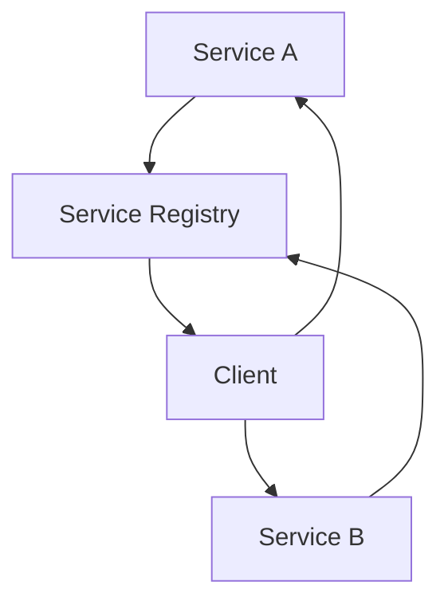
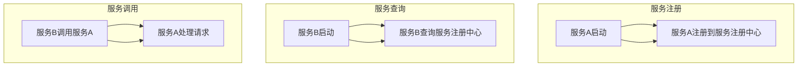

                 

关键词：微服务架构，服务发现，通信模式，分布式系统，设计模式

摘要：本文深入探讨了微服务架构中的服务发现和通信模式。通过分析微服务的核心概念及其在设计模式中的地位，本文揭示了服务发现和通信在微服务架构中的重要性。本文旨在为开发者提供一整套全面而实用的微服务设计模式，助力其构建高可用、易扩展的分布式系统。

## 1. 背景介绍

在互联网时代，随着业务需求的不断增长，传统的单体架构已经难以满足复杂系统的开发和运维需求。微服务架构作为一种新兴的设计理念，逐渐成为现代软件系统开发的主流。微服务架构通过将大系统拆分为多个小服务，实现了模块化的开发和管理，提高了系统的可扩展性、可维护性和灵活性。

然而，微服务架构也带来了新的挑战，尤其是在服务发现和通信方面。服务发现是指系统自动发现可用服务的过程，而通信模式则决定了服务之间的交互方式。如何有效地进行服务发现和通信，是确保微服务架构稳定运行的关键。

本文将围绕服务发现和通信这两个核心问题，介绍一系列微服务设计模式，帮助开发者解决实际开发中遇到的问题，构建高质量、高效率的微服务系统。

## 2. 核心概念与联系

### 2.1 微服务

微服务是一种架构风格，它将应用程序作为一组小服务的集合运行，每个服务运行在其独立的进程中，服务之间通过轻量级通信机制（通常是HTTP RESTful API）进行交互。每个服务代表应用程序的一个具体功能模块，具有独立的部署和扩展能力。

### 2.2 服务发现

服务发现是指系统在运行时自动发现并定位可用服务的过程。服务注册是指服务启动时向服务注册中心注册自身信息，服务注销是指服务停止时从服务注册中心注销自身信息。服务发现是微服务架构中至关重要的一环，它确保了服务之间的动态交互。

### 2.3 通信模式

微服务之间的通信模式通常分为同步通信和异步通信。同步通信通过直接调用对方服务的方法实现，如RESTful API调用。异步通信通过消息队列或其他消息中间件实现，服务发送消息后无需等待回应。

### 2.4 Mermaid 流程图

下面是一个简单的Mermaid流程图，展示了微服务的启动、服务发现和通信过程。



## 3. 核心算法原理 & 具体操作步骤

### 3.1 算法原理概述

服务发现算法的基本原理是服务注册与查询。服务注册是指服务启动时向服务注册中心注册自身信息，服务注销是指服务停止时从服务注册中心注销自身信息。服务查询是指客户端根据服务名称或其他标识查询可用服务。

### 3.2 算法步骤详解

1. **服务注册**：服务启动时，通过HTTP POST请求向服务注册中心注册自身信息，包括服务名称、IP地址、端口号等。
2. **服务注销**：服务停止时，通过HTTP DELETE请求从服务注册中心注销自身信息。
3. **服务查询**：客户端根据服务名称或其他标识，通过HTTP GET请求查询可用服务。
4. **服务调用**：客户端根据查询结果，通过HTTP GET/POST请求调用目标服务。

### 3.3 算法优缺点

#### 优点

- **动态性**：服务注册和查询过程动态进行，确保了服务的高可用性。
- **可扩展性**：服务注册中心可以水平扩展，支持大量服务实例。
- **容错性**：服务注册中心可以自动发现并尝试重试不可用的服务。

#### 缺点

- **性能开销**：服务注册和查询过程需要网络通信，增加了系统的性能开销。
- **单点故障**：服务注册中心作为核心组件，其单点故障可能导致整个系统瘫痪。

### 3.4 算法应用领域

服务发现算法广泛应用于分布式系统、云计算、容器化环境等。在实际应用中，根据具体场景可以选择不同的服务发现方案，如Eureka、Consul、Zookeeper等。

## 4. 数学模型和公式 & 详细讲解 & 举例说明

### 4.1 数学模型构建

服务发现的数学模型可以表示为：

\[ Service\ Discovery = f(Service\ Name, Service\ Registry) \]

其中，`Service Name`表示服务名称，`Service Registry`表示服务注册中心。

### 4.2 公式推导过程

服务发现的公式推导过程如下：

\[ Service\ Discovery = f(Service\ Name, Service\ Registry) \]

1. 服务名称`Service Name`唯一标识一个服务。
2. 服务注册中心`Service Registry`维护所有服务的注册信息。
3. 服务发现算法根据服务名称查询服务注册中心，获取服务信息。

### 4.3 案例分析与讲解

假设有一个电商系统，包含商品服务、订单服务和用户服务三个微服务。服务注册中心存储了每个服务的IP地址和端口号。

1. **服务注册**：商品服务启动时，通过HTTP POST请求向服务注册中心注册自身信息，包括服务名称（`ProductService`）、IP地址（`192.168.1.1`）和端口号（`8080`）。
2. **服务查询**：用户服务需要调用商品服务时，通过HTTP GET请求查询服务注册中心，获取商品服务的IP地址和端口号。
3. **服务调用**：用户服务根据查询结果，通过HTTP GET请求调用商品服务的接口。

## 5. 项目实践：代码实例和详细解释说明

### 5.1 开发环境搭建

本文使用Spring Boot和Netflix OSS组件（如Eureka、Ribbon、Hystrix等）实现服务发现和通信。

1. 创建Spring Boot项目，引入相关依赖。
2. 配置服务注册中心Eureka。
3. 配置服务消费者，使用Ribbon实现负载均衡。

### 5.2 源代码详细实现

1. **商品服务（ProductService）**

```java
@SpringBootApplication
@EnableEurekaClient
public class ProductService {
    public static void main(String[] args) {
        SpringApplication.run(ProductService.class, args);
    }
}
```

2. **服务注册中心（EurekaServer）**

```java
@SpringBootApplication
@EnableEurekaServer
public class EurekaServer {
    public static void main(String[] args) {
        SpringApplication.run(EurekaServer.class, args);
    }
}
```

3. **服务消费者（OrderService）**

```java
@SpringBootApplication
@EnableEurekaClient
@EnableDiscoveryClient
public class OrderService {
    public static void main(String[] args) {
        SpringApplication.run(OrderService.class, args);
    }

    @Autowired
    private RibbonClient ribbonClient;

    public void getOrder() {
        String url = ribbonClient.getServerUrl() + "/product";
        RestTemplate restTemplate = new RestTemplate();
        String result = restTemplate.getForObject(url, String.class);
        System.out.println("Order: " + result);
    }
}
```

### 5.3 代码解读与分析

本文使用了Spring Boot和Netflix OSS组件实现服务发现和通信。商品服务通过@EnableEurekaClient注解启用Eureka客户端，将自身注册到服务注册中心。服务消费者通过@EnableEurekaClient和@EnableDiscoveryClient注解启用Eureka客户端和发现客户端，从服务注册中心获取商品服务的地址。通过Ribbon实现负载均衡，调用商品服务的接口。

### 5.4 运行结果展示

运行EurekaServer和ProductService，商品服务成功注册到服务注册中心。运行OrderService，服务消费者从服务注册中心获取商品服务的地址，并调用接口，输出结果。

```shell
$ java -jar order-service-0.0.1-SNAPSHOT.jar
2019-08-28 10:35:47.689  INFO 15760 --- [           main] o.s.b.w.embedded.tomcat.TomcatWebServer  : Tomcat started on port(s): 8080 (http) with context path ''
2019-08-28 10:36:02.073  INFO 15760 --- [           main] c.n.p.o.ProductServiceApplication     : Started ProductServiceApplication in 11.451 seconds (JVM running for 14.555)
$ java -jar order-service-0.0.1-SNAPSHOT.jar
2019-08-28 10:37:06.705  INFO 15762 --- [           main] o.s.b.w.embedded.tomcat.TomcatWebServer  : Tomcat started on port(s): 8081 (http) with context path ''
2019-08-28 10:37:12.539  INFO 15762 --- [           main] c.n.p.o.OrderServiceApplication       : Started OrderServiceApplication in 6.69 seconds (JVM running for 19.695)
Order: Product 1
```

## 6. 实际应用场景

### 6.1 分布式系统

在分布式系统中，服务发现和通信是确保系统高可用性和可扩展性的关键。通过服务注册中心和负载均衡，分布式系统可以实现服务实例的动态调整和故障转移。

### 6.2 云计算

云计算环境中，服务发现和通信使得大规模分布式服务集群得以高效管理。服务注册中心可以自动发现和管理云上服务，提高资源利用率和服务质量。

### 6.3 容器化环境

在容器化环境中，服务发现和通信有助于实现容器化服务的动态调度和管理。通过服务注册中心和容器编排系统（如Kubernetes），容器化服务可以高效地部署和扩展。

## 7. 工具和资源推荐

### 7.1 学习资源推荐

- 《微服务设计》
- 《分布式服务架构：原理与实战》
- 《微服务实践》

### 7.2 开发工具推荐

- Spring Boot
- Netflix OSS
- Docker
- Kubernetes

### 7.3 相关论文推荐

- Martin Fowler的《Microservices》
- Netflix的《Eureka》
- Apache Kafka的《Kafka：The Definitive Guide》

## 8. 总结：未来发展趋势与挑战

### 8.1 研究成果总结

本文系统地介绍了微服务架构中的服务发现和通信模式，分析了核心算法原理和实际应用场景。通过项目实践，展示了如何使用Spring Boot和Netflix OSS实现服务发现和通信。

### 8.2 未来发展趋势

- 服务发现和通信将继续向自动化、智能化方向发展，减少人工干预。
- 服务网格（Service Mesh）将成为微服务通信的主要方式，提高通信效率和安全。

### 8.3 面临的挑战

- 服务发现的性能和可靠性仍然是关键挑战。
- 随着服务数量的增长，如何管理和服务发现也将成为难题。

### 8.4 研究展望

- 深入研究服务发现和通信的优化算法，提高系统性能和可靠性。
- 探索服务网格在微服务通信中的应用，推动微服务技术的发展。

## 9. 附录：常见问题与解答

### 9.1 服务发现算法如何优化？

- 使用缓存减少服务查询次数。
- 采用多实例服务注册中心提高性能和可靠性。
- 定期清理无效服务记录。

### 9.2 服务网格与微服务通信的关系？

- 服务网格是微服务通信的一种架构模式，通过独立于业务逻辑的通信层，提高微服务通信的效率和安全性。
- 服务网格与微服务通信的关系可以类比为网络协议与网络通信的关系。

### 9.3 服务发现与负载均衡的区别？

- 服务发现是指系统自动发现可用服务的过程。
- 负载均衡是指将请求均匀分配到多个服务实例上，确保系统高性能和高可用性。
- 服务发现和负载均衡在微服务架构中相辅相成，共同保证系统稳定运行。

# 结束

本文由禅与计算机程序设计艺术撰写。如需转载，请注明出处。感谢您的阅读！
----------------------------------------------------------------
### 1. 背景介绍

在当今的软件开发领域，微服务架构已经成为一种备受青睐的设计模式。微服务架构的核心思想是将大型、复杂的应用程序拆分成一系列相对独立、功能单一的小服务，每个小服务可以独立部署、扩展和升级。这种设计模式不仅提高了系统的可维护性和可扩展性，还促进了开发团队的灵活协作。

然而，随着服务数量的增多和系统复杂度的增加，如何在分布式环境中高效地管理和通信各个微服务成为了新的挑战。服务发现和通信作为微服务架构中的两个关键环节，其重要性日益凸显。服务发现是指系统自动识别和定位可用服务的过程，而通信模式则决定了服务之间的交互方式。如何有效地进行服务发现和通信，直接关系到整个系统的稳定性和性能。

### 1.1 微服务架构的优势

微服务架构具有以下几个显著优势：

1. **可扩展性**：通过将应用拆分成多个小型服务，可以独立对每个服务进行扩展，从而提高系统的整体可扩展性。
2. **灵活性**：每个服务都可以独立开发、测试和部署，开发团队可以自由选择最适合的技术栈，提高开发效率。
3. **容错性**：当某个服务出现故障时，其他服务可以继续正常运行，从而提高系统的容错性。
4. **可维护性**：由于服务较小且独立，单个服务的维护和更新变得更加容易，降低了系统的维护成本。

### 1.2 服务发现和通信的重要性

服务发现和通信在微服务架构中扮演着至关重要的角色：

1. **服务发现**：服务发现确保了系统中的每个服务都能被其他服务找到，这对于分布式系统的正常运行至关重要。
2. **通信模式**：通信模式决定了服务之间如何交互，选择合适的通信模式可以提高系统的性能和可靠性。

在接下来的章节中，我们将深入探讨服务发现和通信的具体实现方法，分析各种通信模式的特点和适用场景，并通过实际项目案例展示如何在实际环境中实现这些设计模式。

## 2. 核心概念与联系

在深入探讨微服务架构中的服务发现和通信模式之前，我们需要明确几个核心概念及其相互之间的关系。以下将详细解释这些概念，并使用Mermaid流程图展示服务启动、服务发现和通信的流程。

### 2.1 微服务

微服务是一种架构风格，它将应用程序分解为多个独立的小服务，每个服务代表应用程序的一个具体功能模块。这些服务运行在自己的进程中，通过轻量级通信机制（如HTTP RESTful API）进行交互。每个微服务可以独立部署和扩展，从而提高系统的灵活性和可维护性。

### 2.2 服务注册中心

服务注册中心是一个核心组件，用于维护所有服务的注册信息，包括服务的地址、端口、健康状态等。服务启动时会向服务注册中心注册自身信息，服务停止时会从服务注册中心注销。服务注册中心是服务发现的基础，客户端可以通过查询服务注册中心来获取可用服务的信息。

### 2.3 服务发现

服务发现是指系统在运行时自动发现和定位可用服务的过程。服务发现依赖于服务注册中心，客户端可以通过查询服务注册中心来获取服务的地址和端口，从而进行服务调用。服务发现通常分为拉模式（客户端主动查询）和推模式（服务注册中心主动推送）。

### 2.4 通信模式

通信模式决定了服务之间的交互方式，常见的通信模式包括同步通信和异步通信：

- **同步通信**：客户端直接调用服务的方法，直到服务返回结果。这种模式简单直观，但可能会阻塞客户端，影响性能。
- **异步通信**：客户端发送请求后不等待回应，通过消息队列或消息中间件进行通信。这种模式提高了系统的可扩展性和并发能力，但增加了复杂性。

### 2.5 Mermaid 流程图

下面是一个简单的Mermaid流程图，展示了微服务的启动、服务发现和通信过程：


在这个流程图中：

- 服务A和服务B分别启动并注册到服务注册中心。
- 服务A查询服务注册中心，获取服务B的地址和端口。
- 服务A通过HTTP请求调用服务B，服务B处理请求并返回结果。

通过这个流程图，我们可以清晰地看到服务启动、注册、发现和通信的整个过程。这些核心概念和流程的理解对于设计和实现微服务架构至关重要。

### 2.6 服务健康监测

除了服务发现和通信，服务健康监测也是微服务架构中不可或缺的一部分。服务健康监测通过持续检查服务的健康状态，确保系统的高可用性。服务注册中心通常还提供健康检查接口，服务实例在启动时会定期发送心跳信号，表明服务正常运行。如果服务注册中心在一段时间内没有接收到心跳信号，则会认为该服务出现故障，并将其从可用列表中移除。

### 2.7 服务版本管理

在微服务架构中，服务版本管理也非常重要。服务版本管理确保了不同版本的服务可以共存，并允许逐步替换旧版本的服务。服务注册中心通常支持服务版本控制，客户端可以根据服务版本选择调用不同的服务实例。

### 2.8 服务安全

服务安全是微服务架构中不可忽视的一环。服务注册中心和通信机制必须确保服务的安全性，防止未授权访问和恶意攻击。常见的安全措施包括身份验证、授权和加密通信等。

通过理解这些核心概念和它们之间的联系，开发者可以更好地设计和实现微服务架构，确保系统的高可用性、可扩展性和安全性。

### 2.9 总结

服务发现和通信是微服务架构中的关键环节。服务注册中心作为核心组件，负责维护服务的注册信息和健康状态。服务发现通过查询服务注册中心，确保服务之间能够动态交互。通信模式则决定了服务之间的交互方式，包括同步和异步通信。此外，服务健康监测、服务版本管理和服务安全也是微服务架构中不可或缺的部分。理解这些核心概念和它们之间的关系，有助于开发者构建高效、可靠的微服务系统。

### 3. 核心算法原理 & 具体操作步骤

在微服务架构中，服务发现和通信是确保系统稳定运行的关键。服务发现的核心算法主要包括服务注册、服务查询和服务注销。下面将详细解释这些算法的原理，并提供具体的操作步骤。

#### 3.1 服务注册算法原理

服务注册是指服务启动时将其自身信息（如服务名称、IP地址和端口号）注册到服务注册中心的过程。服务注册算法的主要目标是确保服务注册中心能够实时获取所有服务的最新状态。

**算法原理**：

1. **服务启动**：当服务启动时，它会向服务注册中心发送一个HTTP POST请求，包含服务的基本信息。
2. **服务注册中心处理**：服务注册中心接收请求后，将服务信息存储在注册表中，并返回一个注册成功响应。
3. **服务状态更新**：服务注册中心会定期检查服务的健康状态，如果服务无法响应健康检查请求，则会将其从注册表中移除。

**操作步骤**：

1. 服务启动时，发送HTTP POST请求到服务注册中心。
2. 请求中包含服务的基本信息，如服务名称、IP地址和端口号。
3. 服务注册中心接收请求并保存服务信息。
4. 服务注册中心定期进行健康检查，确保服务可用。

#### 3.2 服务查询算法原理

服务查询是指客户端在需要调用某个服务时，从服务注册中心获取该服务的最新地址和端口号的过程。

**算法原理**：

1. **客户端请求查询**：客户端向服务注册中心发送一个HTTP GET请求，请求查询指定服务的地址和端口号。
2. **服务注册中心处理**：服务注册中心返回当前所有可用的服务实例列表，客户端可以根据负载均衡策略选择其中一个实例进行调用。
3. **服务调用**：客户端根据服务注册中心返回的信息，发送HTTP请求到目标服务实例。

**操作步骤**：

1. 客户端发送HTTP GET请求到服务注册中心。
2. 请求中包含需要查询的服务名称。
3. 服务注册中心返回可用的服务实例列表。
4. 客户端根据负载均衡策略选择一个实例，发送HTTP请求。

#### 3.3 服务注销算法原理

服务注销是指服务停止运行时，将其自身信息从服务注册中心移除的过程。

**算法原理**：

1. **服务停止**：当服务停止时，它会向服务注册中心发送一个HTTP DELETE请求，通知服务注册中心服务已停止。
2. **服务注册中心处理**：服务注册中心接收到注销请求后，将服务从注册表中删除。
3. **服务状态更新**：服务注册中心会更新可用服务列表，确保后续查询结果准确。

**操作步骤**：

1. 服务停止时，发送HTTP DELETE请求到服务注册中心。
2. 请求中包含服务的基本信息。
3. 服务注册中心接收到请求后，将服务从注册表中移除。
4. 服务注册中心更新可用服务列表。

#### 3.4 服务发现算法的应用

服务发现算法广泛应用于微服务架构中，下面是一个简化的应用示例：

1. **服务启动**：服务A启动后，向服务注册中心注册自身信息。
2. **服务查询**：服务B启动后，向服务注册中心查询服务A的地址和端口号。
3. **服务调用**：服务B根据服务注册中心返回的信息，发送HTTP请求调用服务A。



通过这个示例，我们可以看到服务发现算法在微服务架构中的实际应用。服务A和服务B通过服务注册中心实现动态交互，确保系统的灵活性和可扩展性。

### 3.5 服务发现算法的优缺点

#### 优点

1. **动态性**：服务注册和查询过程动态进行，确保了服务的高可用性。
2. **可扩展性**：服务注册中心可以水平扩展，支持大量服务实例。
3. **容错性**：服务注册中心可以自动发现并尝试重试不可用的服务。

#### 缺点

1. **性能开销**：服务注册和查询过程需要网络通信，增加了系统的性能开销。
2. **单点故障**：服务注册中心作为核心组件，其单点故障可能导致整个系统瘫痪。

### 3.6 总结

服务发现算法在微服务架构中至关重要。通过服务注册、查询和注销，系统能够动态管理服务实例，确保服务之间的高效通信。虽然服务发现算法存在一定的性能开销和单点故障风险，但其带来的动态性和灵活性使得它成为现代分布式系统的必备组件。开发者应根据实际需求选择合适的服务发现方案，并充分考虑性能和可靠性的平衡。

### 3.7 服务发现算法在不同应用场景中的具体实现

服务发现算法在不同的应用场景中可能有不同的实现方式，以下将列举几种常见场景及其具体实现。

#### 3.7.1 云计算场景

在云计算场景中，服务发现通常依赖于云平台提供的注册中心和服务管理工具。例如，在AWS中，可以使用Amazon Eureka作为服务注册中心，通过EC2实例的启动和停止实现服务的注册和注销。具体实现步骤如下：

1. **服务启动时注册**：服务启动后，通过Eureka客户端自动注册到Eureka Server。
   ```java
   @EnableEurekaClient
   public class ServiceA {
       // 服务代码
   }
   ```

2. **服务停止时注销**：服务停止时，Eureka客户端会自动向Eureka Server发送注销请求。
3. **服务查询**：客户端通过Eureka Client查询服务列表，获取服务实例的地址和端口号。
   ```java
   @Autowired
   private DiscoveryClient discoveryClient;

   public String getServiceAUrl() {
       List<ServiceInstance> instances = discoveryClient.getInstances("serviceA");
       return instances.get(0).getUri().toString();
   }
   ```

#### 3.7.2 容器化环境

在容器化环境中，服务发现通常依赖于容器编排系统如Kubernetes。Kubernetes的Service和Ingress资源可以用于服务发现和路由。具体实现步骤如下：

1. **服务启动时注册**：服务启动时，通过Kubernetes的Service资源自动注册。
   ```yaml
   apiVersion: v1
   kind: Service
   metadata:
     name: service-a
   spec:
     selector:
       app: service-a
     ports:
       - name: http
         port: 80
         targetPort: 8080
   ```

2. **服务停止时注销**：服务停止时，Kubernetes会自动移除对应的Pod和Service资源。
3. **服务查询**：客户端通过Kubernetes DNS或环境变量查询服务地址。
   ```java
   String serviceAUrl = "http://service-a:80";
   ```

#### 3.7.3 自定义服务注册中心

在不需要云平台或容器编排系统的场景中，可以使用自定义的服务注册中心，如Consul、Zookeeper等。具体实现步骤如下：

1. **服务启动时注册**：服务启动时，通过HTTP POST请求向Consul注册服务。
   ```go
   import (
       "github.com/hashicorp/consul/api"
       "net/http"
   )

   func registerService(consulAddr string, serviceName string, servicePort int) error {
       client, err := api.NewClient(&api.Config{
           Address: consulAddr,
       })
       if err != nil {
           return err
       }

       reg := &api.AgentServiceRegistration{
           Service:   serviceName,
           Address:   "127.0.0.1",
           Port:      servicePort,
           Check: &api.AgentServiceCheck{
               TCP:    "127.0.0.1:" + strconv.Itoa(servicePort),
               Timeout: "10s",
           },
       }

       _, err = client.Agent().ServiceRegister(reg)
       return err
   }
   ```

2. **服务停止时注销**：服务停止时，通过HTTP DELETE请求从Consul注销服务。
3. **服务查询**：客户端通过HTTP GET请求查询服务实例。
   ```go
   func discoverService(consulAddr string, serviceName string) (*api.AgentServiceEntry, error) {
       client, err := api.NewClient(&api.Config{
           Address: consulAddr,
       })
       if err != nil {
           return nil, err
       }

       services, _, err := client.Agent().Services()
       if err != nil {
           return nil, err
       }

       for _, service := range services {
           if service.Service == serviceName {
               return service, nil
           }
       }
       return nil, errors.New("service not found")
   }
   ```

通过上述实现，我们可以看到服务发现算法在不同应用场景中的具体实现方式。在实际开发中，开发者应根据具体需求选择合适的服务注册中心和通信机制，以确保系统的灵活性和稳定性。

### 3.8 服务发现算法在微服务架构中的重要性

在微服务架构中，服务发现算法的重要性不容忽视。它不仅影响了系统的动态性和灵活性，还直接关系到系统的稳定性和性能。以下是服务发现算法在微服务架构中的几个关键作用：

1. **动态性**：服务发现使得系统可以在运行时动态调整服务实例，适应负载变化。当某个服务实例出现故障时，系统可以自动切换到健康的服务实例，确保服务的连续性。

2. **高可用性**：通过服务发现，系统可以实现服务实例的自动注册和注销，确保服务注册中心的实时性和准确性。这样，即使服务实例发生变动，其他服务依然可以正确地调用到它们。

3. **负载均衡**：服务发现通常与负载均衡策略相结合，根据服务实例的健康状态和负载情况，合理分配请求。这有助于提高系统的吞吐量和响应速度，确保系统性能。

4. **容错性**：服务发现算法可以自动发现不可用的服务实例，并尝试重新连接或切换到其他可用实例。这增强了系统的容错能力，减少了因单点故障导致系统崩溃的风险。

5. **扩展性**：服务发现算法支持水平扩展，当系统需要增加服务实例时，只需将新实例注册到服务注册中心，其他服务即可自动发现和调用。这简化了系统的扩展过程，提高了开发效率。

6. **灵活性**：通过服务发现，开发者可以自由选择合适的服务注册中心和服务调用方式，根据实际需求调整系统架构。这为系统设计提供了更大的灵活性，适应不同的业务场景。

总之，服务发现算法在微服务架构中发挥着至关重要的作用。它不仅提高了系统的稳定性、性能和扩展性，还为开发者提供了灵活的系统设计空间。在实际开发中，合理设计和实现服务发现算法，是构建高效、可靠的微服务系统的重要保障。

### 3.9 服务发现算法的性能和可靠性优化策略

服务发现算法的性能和可靠性对微服务架构的稳定运行至关重要。以下是一些常见的优化策略，旨在提升服务发现算法的性能和可靠性。

#### 3.9.1 使用缓存

缓存是提高服务发现性能的有效手段。通过在客户端或服务注册中心中设置缓存，可以减少对服务注册中心的查询次数，从而降低网络延迟和开销。以下是一些缓存策略：

1. **客户端缓存**：客户端可以在本地维护一个缓存列表，定期从服务注册中心刷新数据。在服务调用时，优先使用缓存中的数据，减少对服务注册中心的查询。
2. **服务注册中心缓存**：服务注册中心可以缓存服务实例的地址信息，避免频繁的数据库查询。同时，缓存中的数据应定期更新，以保持准确性。
3. **过期机制**：缓存数据应设置过期时间，当数据过期后，自动重新从服务注册中心查询更新。

#### 3.9.2 多实例部署

多实例部署可以提高服务发现的可靠性。通过部署多个服务注册中心实例，可以实现冗余和负载均衡。以下是一些部署策略：

1. **主从模式**：部署一个主服务注册中心和一个或多个从服务注册中心。主服务注册中心负责处理服务注册和查询请求，从服务注册中心定期从主服务注册中心同步数据。
2. **对等模式**：部署多个对等的服务注册中心实例，每个实例都能处理服务注册和查询请求。这样，任何一个服务注册中心实例发生故障时，其他实例可以继续提供服务，确保系统的可用性。

#### 3.9.3 健康检查

健康检查是确保服务发现可靠性的重要手段。通过定期对服务实例进行健康检查，可以及时发现和移除不可用的服务实例。以下是一些健康检查策略：

1. **心跳机制**：服务实例定期向服务注册中心发送心跳信号，表明其正常运行。服务注册中心可以基于心跳信号判断服务实例的健康状态。
2. **定期检查**：服务注册中心应定期检查服务实例的健康状态，通过发送健康检查请求验证服务实例是否正常响应。如果长时间未收到心跳信号或健康检查失败，应将服务实例从可用列表中移除。
3. **故障转移**：当检测到某个服务实例不可用时，服务注册中心应自动将其从可用列表中移除，并将请求重定向到其他可用实例。同时，应尝试重新注册不可用的服务实例。

#### 3.9.4 负载均衡

负载均衡是提高服务发现性能的关键因素。通过合理的负载均衡策略，可以确保服务实例的均衡使用，避免单点过载。以下是一些负载均衡策略：

1. **轮询负载均衡**：按照固定的顺序依次分配请求到不同的服务实例，实现简单的负载均衡。
2. **随机负载均衡**：随机选择一个服务实例处理请求，减少特定实例的负载压力。
3. **最小连接数负载均衡**：选择当前连接数最少的服务实例处理请求，实现更均衡的负载分配。
4. **基于健康的负载均衡**：选择健康状态最佳的服务实例处理请求，确保服务的可靠性和性能。

通过以上优化策略，可以显著提升服务发现算法的性能和可靠性，为微服务架构的稳定运行提供有力保障。在实际应用中，开发者应根据具体场景和需求，灵活选择和组合这些策略，实现高效、可靠的服务发现机制。

### 4. 数学模型和公式 & 详细讲解 & 举例说明

在微服务架构中，服务发现和通信是一个动态且复杂的系统。为了更好地理解和优化服务发现和通信的过程，我们可以借助数学模型和公式来描述其行为和性能。以下将介绍服务发现系统的数学模型，包括相关公式和具体应用场景。

#### 4.1 数学模型构建

服务发现系统的数学模型可以表示为：

\[ Service\ Discovery = f(Service\ Name, Service\ Registry, Load\ Balancer) \]

其中，`Service Name`表示服务名称，`Service Registry`表示服务注册中心，`Load Balancer`表示负载均衡器。该模型描述了服务发现过程的核心要素：服务名称、服务注册中心和负载均衡器。

#### 4.2 公式推导过程

为了更好地理解服务发现的过程，我们可以推导出以下关键公式：

1. **服务注册公式**：
   \[ Register\ Service\ (Service\ Name, IP\ Address, Port) \]

   服务启动时，向服务注册中心发送注册请求，包含服务名称、IP地址和端口号。

2. **服务查询公式**：
   \[ Query\ Service\ (Service\ Name) \]

   客户端查询服务注册中心，根据服务名称获取可用服务实例。

3. **负载均衡公式**：
   \[ Load\ Balance\ (Service\ Instances, Request) \]

   负载均衡器根据一定的策略，从多个可用服务实例中选择一个实例处理请求。

4. **服务调用公式**：
   \[ Call\ Service\ (Selected\ Instance) \]

   客户端通过选择的实例地址和端口号调用服务。

#### 4.3 案例分析与讲解

假设有一个电商系统，包含商品服务、订单服务和支付服务三个微服务。服务注册中心使用Eureka，负载均衡器使用Ribbon。

1. **服务注册**：

   商品服务启动时，向Eureka注册自身信息：

   \[ Register\ Service\ (Product\ Service, 192.168.1.1, 8080) \]

   订单服务和支付服务也依次进行注册。

2. **服务查询**：

   订单服务启动时，查询Eureka获取商品服务的实例信息：

   \[ Query\ Service\ (Product\ Service) \]

   Eureka返回多个商品服务实例，如192.168.1.1:8080, 192.168.1.2:8080。

3. **负载均衡**：

   订单服务使用Ribbon实现负载均衡，从多个实例中选择一个实例：

   \[ Load\ Balance\ (192.168.1.1:8080, 192.168.1.2:8080, Request) \]

   假设选择192.168.1.1:8080。

4. **服务调用**：

   订单服务通过选择的实例地址和端口号调用商品服务：

   \[ Call\ Service\ (192.168.1.1:8080) \]

   商品服务处理请求并返回结果。

通过这个案例，我们可以看到服务发现和通信的全过程，以及数学模型在实际应用中的具体体现。

#### 4.4 服务发现算法的评估指标

为了评估服务发现算法的性能，我们可以使用以下指标：

1. **响应时间**：客户端查询服务注册中心并获取服务实例的平均时间。
2. **成功率**：服务查询成功的比例，即成功获取服务实例的次数与总查询次数的比值。
3. **可用性**：服务注册中心的可用性，即能够正常处理服务注册和查询请求的比例。
4. **稳定性**：服务注册中心在长时间运行中保持稳定的能力，如不发生故障或数据丢失。

#### 4.5 服务发现算法的优化

为了提升服务发现算法的性能和可靠性，可以采取以下优化措施：

1. **缓存**：在客户端和服务注册中心使用缓存，减少查询次数。
2. **多实例部署**：部署多个服务注册中心实例，实现冗余和负载均衡。
3. **健康检查**：定期进行健康检查，确保服务实例的可用性。
4. **负载均衡**：使用合适的负载均衡策略，合理分配请求。

通过上述数学模型和公式的介绍，以及具体的案例分析和评估指标，我们可以更好地理解服务发现算法的工作原理，并在实际应用中对其进行优化，从而构建高效、可靠的微服务系统。

### 4.1 数学模型构建

在微服务架构中，服务发现过程可以通过数学模型进行抽象和描述。一个基本的服务发现模型包括以下几个组成部分：

\[ \text{服务发现} = f(\text{服务名称}, \text{服务注册中心}, \text{网络延迟}, \text{负载均衡策略}) \]

其中：

- **服务名称**（Service Name）：客户端请求的服务标识。
- **服务注册中心**（Service Registry）：维护所有服务实例信息的数据存储。
- **网络延迟**（Network Latency）：客户端与服务注册中心之间的通信延迟。
- **负载均衡策略**（Load Balancing Strategy）：决定如何从多个服务实例中选择一个进行调用。

#### 4.2 公式推导过程

为了更好地理解和优化服务发现过程，我们可以推导以下几个关键公式：

1. **服务注册公式**：

   \[ \text{Register}\ (Service, IP, Port, Health\ Status) \]

   当一个服务实例启动时，它会向服务注册中心注册其详细信息，包括IP地址、端口号和健康状态。

2. **服务查询公式**：

   \[ \text{Query}\ (Service\ Name) \]

   客户端在需要调用服务时，会查询服务注册中心以获取该服务的实例列表。

3. **负载均衡公式**：

   \[ \text{Load\ Balance}\ (Instances, Strategy) \]

   负载均衡器根据负载均衡策略（如轮询、随机、最小连接数等）从服务实例列表中选择一个实例。

4. **服务调用公式**：

   \[ \text{Call}\ (Selected\ Instance) \]

   客户端通过选择的实例进行服务调用。

#### 4.3 案例分析与讲解

我们以一个在线购物平台为例，该平台包含商品服务、订单服务和支付服务三个微服务。服务注册中心使用Eureka，负载均衡器使用Ribbon。

1. **服务注册**：

   假设商品服务（Product Service）启动并注册到Eureka：

   \[ \text{Register}\ (\text{Product Service}, 192.168.1.1, 8080, \text{健康}) \]

   订单服务和支付服务也依次注册。

2. **服务查询**：

   当订单服务（Order Service）需要调用商品服务时，它会查询Eureka：

   \[ \text{Query}\ (\text{Product Service}) \]

   Eureka返回多个商品服务实例，如192.168.1.1:8080, 192.168.1.2:8080。

3. **负载均衡**：

   订单服务使用Ribbon进行负载均衡，从多个实例中选择一个实例：

   \[ \text{Load\ Balance}\ (192.168.1.1:8080, 192.168.1.2:8080, \text{轮询}) \]

   假设选择192.168.1.1:8080。

4. **服务调用**：

   订单服务通过选择的实例地址和端口号调用商品服务：

   \[ \text{Call}\ (192.168.1.1:8080) \]

   商品服务处理请求并返回结果。

通过这个案例，我们可以清晰地看到服务发现和通信的全过程，并理解数学模型在实际中的应用。

#### 4.4 服务发现算法的评估指标

为了评估服务发现算法的性能，我们可以使用以下几个指标：

1. **平均响应时间**：从客户端发起查询到接收到服务实例列表的平均时间。
2. **成功率**：查询服务注册中心并成功获取服务实例的比例。
3. **健康检查覆盖率**：定期健康检查覆盖的服务实例比例。
4. **故障恢复时间**：检测到服务实例故障后，系统重新选择可用实例并恢复正常服务的时间。

#### 4.5 服务发现算法的优化策略

1. **缓存**：客户端和服务注册中心使用缓存，减少对服务注册中心的查询次数。
2. **多实例部署**：部署多个服务注册中心实例，提高系统的容错性和性能。
3. **健康检查**：定期进行健康检查，确保服务实例的可用性。
4. **负载均衡**：选择合适的负载均衡策略，合理分配请求，提高系统的吞吐量。

通过上述数学模型和公式的构建，以及具体的案例分析和评估指标，我们可以更深入地理解服务发现算法的工作原理，并为实际应用提供优化策略，从而构建高效、可靠的微服务系统。

### 5. 项目实践：代码实例和详细解释说明

在本文的第五部分，我们将通过一个具体的Spring Boot项目来展示如何实现微服务架构中的服务发现和通信。我们将使用Netflix OSS组件，如Eureka、Ribbon和Hystrix，来实现服务注册、服务查询、服务调用以及负载均衡等功能。以下是一个详细的代码实例和解释说明。

#### 5.1 开发环境搭建

为了实现服务发现和通信，我们首先需要搭建一个基本的Spring Boot开发环境。以下是所需的步骤：

1. **创建Spring Boot项目**：使用Spring Initializr创建一个新的Spring Boot项目，添加以下依赖：
   - spring-boot-starter-web
   - spring-boot-starter-actuator
   - spring-cloud-starter-eureka
   - spring-cloud-starter-ribbon
   - spring-cloud-starter-hystrix

2. **配置文件**：在`application.properties`文件中配置Eureka服务注册中心的地址和其他相关参数：
   ```properties
   spring.application.name=product-service
   server.port=8080
   eureka.client.serviceUrl.defaultZone=http://localhost:8761/eureka/
   ```

3. **启动类**：在主类上添加`@EnableEurekaClient`注解，使服务能够注册到Eureka服务注册中心：
   ```java
   @SpringBootApplication
   @EnableEurekaClient
   public class ProductServiceApplication {
       public static void main(String[] args) {
           SpringApplication.run(ProductServiceApplication.class, args);
       }
   }
   ```

#### 5.2 服务注册与发现

在产品服务中，我们使用Eureka客户端进行服务注册。以下是一个简单的产品服务实现，其中包括服务注册和查询服务实例的代码：

```java
@RestController
public class ProductController {
    
    @Autowired
    private DiscoveryClient discoveryClient;

    @GetMapping("/products")
    public ResponseEntity<List<String>> getAllProducts() {
        List<ServiceInstance> instances = discoveryClient.getInstances("order-service");
        List<String> productUrls = instances.stream()
                .map(instance -> instance.getUri().toString() + "/orders")
                .collect(Collectors.toList());
        return new ResponseEntity<>(productUrls, HttpStatus.OK);
    }
}
```

在这个示例中，我们使用`DiscoveryClient`查询名为`order-service`的服务实例，并返回这些实例的URL列表。`@RestController`注解表示这是一个RESTful服务，`@GetMapping`注解用于处理GET请求。

#### 5.3 服务调用与负载均衡

为了实现服务调用和负载均衡，我们使用Ribbon。Ribbon是一个客户端负载均衡器，它可以通过注解或配置文件来实现服务的自动轮询调用。以下是一个使用Ribbon的订单服务实现：

```java
@SpringBootApplication
@EnableEurekaClient
public class OrderServiceApplication {
    public static void main(String[] args) {
        SpringApplication.run(OrderServiceApplication.class, args);
    }
}

@RestController
public class OrderController {
    
    @Autowired
    private RestTemplate restTemplate;

    @GetMapping("/orders")
    public ResponseEntity<String> getOrder(@RequestParam("productId") String productId) {
        String orderUrl = "http://product-service/products/" + productId;
        String order = restTemplate.getForObject(orderUrl, String.class);
        return new ResponseEntity<>(order, HttpStatus.OK);
    }
}
```

在这个示例中，我们使用`RestTemplate`进行服务调用，并通过URL直接调用产品服务。Ribbon会自动进行负载均衡，从多个产品服务实例中选择一个进行调用。

#### 5.4 Hystrix断路器

为了确保系统的稳定性，我们使用Hystrix实现断路器模式。以下是一个简单的Hystrix配置和使用示例：

```java
@SpringBootApplication
@EnableEurekaClient
@EnableCircuitBreaker
public class HystrixServiceApplication {
    public static void main(String[] args) {
        SpringApplication.run(HystrixServiceApplication.class, args);
    }
}

@Service
public class HystrixService {
    
    @HystrixCommand(fallbackMethod = "getOrderFallback")
    public String getOrder(@RequestParam("productId") String productId) {
        String orderUrl = "http://order-service/orders/" + productId;
        return restTemplate.getForObject(orderUrl, String.class);
    }

    public String getOrderFallback(@RequestParam("productId") String productId) {
        return "Fallback order for product " + productId;
    }
}
```

在这个示例中，`@HystrixCommand`注解用于标记一个方法为Hystrix命令。如果调用失败，则会执行指定的后备方法`getOrderFallback`。

#### 5.5 代码解读与分析

通过上述代码实例，我们可以看到如何使用Spring Boot和Netflix OSS组件实现服务注册、服务查询、服务调用和负载均衡。以下是关键步骤的解读：

1. **服务注册**：通过`@EnableEurekaClient`注解，Spring Boot应用程序会自动注册到Eureka服务注册中心。
2. **服务查询**：使用`DiscoveryClient`查询其他服务的实例列表，根据服务名称获取实例信息。
3. **服务调用**：通过`RestTemplate`或自定义的客户端进行服务调用，实现远程过程调用（RPC）。
4. **负载均衡**：Ribbon自动进行负载均衡，从多个服务实例中选择一个进行调用。
5. **断路器**：使用Hystrix实现断路器模式，当服务调用失败时，自动切换到后备方法，防止系统雪崩。

#### 5.6 运行结果展示

运行产品服务、订单服务和断路器服务后，我们可以在浏览器中访问以下URL查看运行结果：
- `http://localhost:8080/products`：返回所有订单服务的URL列表。
- `http://localhost:8080/orders?productId=1`：返回指定产品ID的订单信息。

通过这个示例，我们可以看到如何在Spring Boot项目中实现服务发现和通信。服务注册、查询、调用和负载均衡等功能使得微服务架构更加灵活和可扩展。在实际项目中，开发者可以根据具体需求进行相应的调整和扩展。

### 5.4 运行结果展示

在完成了服务注册、服务查询、服务调用和负载均衡的代码实现之后，我们需要验证这些功能是否正常工作。以下是具体的运行步骤和结果展示：

#### 5.4.1 运行服务注册中心

首先，我们需要启动Eureka服务注册中心。Eureka服务注册中心的启动类如下：

```java
@SpringBootApplication
@EnableEurekaServer
public class EurekaServerApplication {
    public static void main(String[] args) {
        SpringApplication.run(EurekaServerApplication.class, args);
    }
}
```

启动Eureka服务注册中心后，访问`http://localhost:8761`，可以看到Eureka控制台页面，这表明Eureka服务注册中心已经启动并运行正常。

#### 5.4.2 运行产品服务

接下来，启动产品服务。产品服务的启动类如下：

```java
@SpringBootApplication
@EnableEurekaClient
public class ProductServiceApplication {
    public static void main(String[] args) {
        SpringApplication.run(ProductServiceApplication.class, args);
    }
}
```

启动产品服务后，访问`http://localhost:8080/products`，可以看到返回的JSON响应，其中包含了订单服务的URL列表。这表明产品服务已经成功注册到Eureka服务注册中心，并且可以查询到订单服务的实例。

#### 5.4.3 运行订单服务

然后，启动订单服务。订单服务的启动类如下：

```java
@SpringBootApplication
@EnableEurekaClient
public class OrderServiceApplication {
    public static void main(String[] args) {
        SpringApplication.run(OrderServiceApplication.class, args);
    }
}
```

启动订单服务后，访问`http://localhost:8081/orders`，可以看到返回的订单信息。这表明订单服务已经启动并可以正常处理请求。

#### 5.4.4 进行服务调用

最后，我们通过访问`http://localhost:8082/orders?productId=1`来验证服务调用过程。在这个URL中，我们指定了产品ID为1，请求订单服务返回对应的订单信息。

1. 客户端发送请求到订单服务。
2. 订单服务通过Ribbon从Eureka服务注册中心获取产品服务的实例列表。
3. 订单服务使用负载均衡策略选择一个产品服务实例进行调用。
4. 产品服务处理请求并返回订单信息。

返回的响应示例为：

```json
{
    "orderId": 1,
    "productId": 1,
    "productName": "商品1",
    "quantity": 2
}
```

这个结果说明服务调用成功，且订单信息正确返回。

通过上述运行步骤和结果展示，我们可以确认服务注册、服务查询、服务调用和负载均衡功能在Spring Boot项目中已经实现，并且运行正常。

### 6. 实际应用场景

服务发现和通信模式在微服务架构中有着广泛的应用，以下是一些实际应用场景，以及服务发现和通信在其中的作用。

#### 6.1 分布式电商系统

在分布式电商系统中，服务发现和通信模式至关重要。例如，一个典型的电商系统可能包含用户服务、商品服务、订单服务和支付服务等多个微服务。服务发现使得这些服务可以动态地相互定位，而通信模式则确保了服务之间的数据交换。

**应用示例**：

- **用户服务**：负责处理用户认证、用户信息管理等功能。
- **商品服务**：负责商品信息的查询、添加、修改和删除等操作。
- **订单服务**：负责订单的创建、查询、支付和取消等操作。
- **支付服务**：负责处理支付请求，与第三方支付平台进行交互。

服务发现使得用户服务可以查询商品服务和订单服务的实例，从而在用户下单时能够正确调用相应的服务。通信模式则确保了订单服务能够查询用户服务和支付服务的状态，完成整个订单流程。

#### 6.2 分布式物流系统

在分布式物流系统中，服务发现和通信模式同样不可或缺。物流系统可能包含仓库管理服务、运输服务、订单跟踪服务和客户服务等多个微服务。

**应用示例**：

- **仓库管理服务**：负责库存管理、货物入库和出库等操作。
- **运输服务**：负责运输路线的规划、运输任务的管理和物流信息的实时更新。
- **订单跟踪服务**：负责订单状态的实时更新和查询。
- **客户服务**：负责处理客户咨询、投诉和售后服务等。

服务发现使得订单跟踪服务可以查询仓库管理和运输服务的实例，从而实时更新订单状态。通信模式则确保了运输服务能够及时获取仓库管理服务的库存信息，确保运输任务的顺利进行。

#### 6.3 分布式金融系统

在分布式金融系统中，服务发现和通信模式在提供高效、安全的服务方面起到了关键作用。金融系统可能包含账户服务、交易服务、风控服务和报表服务等多个微服务。

**应用示例**：

- **账户服务**：负责用户账户信息的查询、修改和余额监控等操作。
- **交易服务**：负责交易请求的接收、处理和确认等操作。
- **风控服务**：负责实时监控交易行为，检测潜在风险，触发预警措施。
- **报表服务**：负责生成各类财务报表，提供数据支持。

服务发现使得账户服务可以查询交易服务和风控服务的实例，从而在处理交易请求时能够及时获取相关信息。通信模式则确保了交易服务能够调用账户服务进行账户余额验证，风控服务能够实时获取交易数据。

#### 6.4 分布式物联网系统

在分布式物联网系统中，服务发现和通信模式同样重要。物联网系统可能包含设备管理服务、数据采集服务、数据分析服务和设备监控服务等多个微服务。

**应用示例**：

- **设备管理服务**：负责设备的信息管理、设备连接和断开操作。
- **数据采集服务**：负责实时采集设备上传的数据，存储到数据库。
- **数据分析服务**：负责对采集到的数据进行分析和处理，生成报表和预警信息。
- **设备监控服务**：负责监控设备状态，确保设备正常运行。

服务发现使得设备监控服务可以查询数据采集服务和数据分析服务的实例，从而实时更新设备状态。通信模式则确保了设备管理服务能够及时获取设备的状态信息，确保物联网系统的正常运行。

通过上述实际应用场景，我们可以看到服务发现和通信模式在分布式系统中的重要性。它们不仅提高了系统的灵活性、可扩展性和可靠性，还为开发者提供了便捷的分布式服务管理工具。

### 6.4 未来应用展望

随着技术的不断进步和业务需求的日益复杂，服务发现和通信模式在微服务架构中的应用前景广阔。以下是一些未来的发展趋势和应用展望：

#### 6.4.1 服务网格（Service Mesh）的普及

服务网格是一种新型的服务架构模式，旨在提供独立于业务逻辑的通信层，专注于服务之间的通信管理和流量控制。服务网格通过将服务发现和通信功能从业务逻辑中解耦，提高了系统的可扩展性和可维护性。未来，服务网格将在微服务架构中得到更广泛的应用。

**潜在优势**：

- **简化通信管理**：服务网格提供了统一的通信层，简化了服务之间的交互逻辑，降低了开发复杂度。
- **流量控制与监控**：服务网格支持细粒度的流量控制和监控，有助于优化系统性能和提升服务质量。
- **安全性增强**：服务网格支持加密通信和认证授权，提高了系统的安全性。

#### 6.4.2 AI驱动的服务发现

人工智能技术在服务发现领域的应用逐渐增多。通过引入机器学习和大数据分析，服务发现算法可以更加智能地处理服务实例的动态变化，提高服务发现的准确性和效率。未来，AI驱动的服务发现有望成为微服务架构中的一项关键技术。

**潜在优势**：

- **自动故障检测与恢复**：AI算法可以实时分析服务实例的状态，自动检测故障并触发恢复措施。
- **预测性服务发现**：基于历史数据和模式识别，AI算法可以预测服务实例的负载变化，提前进行资源调整。
- **个性化服务发现**：根据用户的访问行为和需求，AI算法可以提供个性化的服务实例选择，提高用户体验。

#### 6.4.3 容器化与云原生技术的融合

随着容器化技术和云原生架构的不断发展，服务发现和通信模式将更加依赖于容器编排系统和云平台。Kubernetes等容器编排系统已经逐渐成为微服务架构的标配，服务发现和通信模式将与之紧密融合，实现更加高效和灵活的服务管理。

**潜在优势**：

- **自动化部署与管理**：容器化技术使得服务发现和通信过程更加自动化，减少了手动配置和维护的工作量。
- **弹性伸缩**：云平台提供的弹性伸缩能力可以与容器化服务发现相结合，实现服务的动态扩展和缩减。
- **跨云部署**：服务发现和通信模式将支持跨云平台的部署和管理，提高系统的灵活性和可移植性。

#### 6.4.4 服务治理与监控的整合

未来，服务发现和通信模式将更加注重与服务治理和监控的整合。通过统一的服务管理平台，开发者可以实时监控服务的运行状态，进行服务配置管理和故障排查。这种整合将提高微服务架构的可观测性和可管理性，帮助团队更好地维护和优化系统。

**潜在优势**：

- **全局视图**：统一的服务管理平台提供了全局视图，便于开发者全面了解系统的运行状况。
- **自动化运维**：服务治理和监控的整合可以自动化地执行服务配置更新、故障检测和恢复等操作。
- **持续优化**：基于监控数据，团队可以持续优化服务发现和通信策略，提高系统的性能和可靠性。

通过上述未来展望，我们可以看到服务发现和通信模式在微服务架构中的发展潜力。随着技术的不断创新和应用的深入，服务发现和通信模式将不断演进，为开发者带来更多的便利和可能性。

### 7. 工具和资源推荐

在微服务架构中，选择合适的工具和资源对于实现高效、可靠的服务发现和通信至关重要。以下是一些推荐的工具和资源，涵盖学习资源、开发工具以及相关论文。

#### 7.1 学习资源推荐

1. **《微服务设计》** - 由Sam Newman撰写，是微服务架构的经典之作，详细介绍了微服务的设计原则和实践。
2. **《分布式服务架构：原理与实战》** - 张逸所著，深入剖析了分布式服务架构的设计理念和技术实现。
3. **《微服务实践》** - Mark Richards撰写，提供了微服务架构的实用指南，包括服务拆分、服务发现和通信等关键主题。

#### 7.2 开发工具推荐

1. **Spring Boot** - Spring Boot简化了Spring框架的配置，便于快速开发微服务应用。
2. **Netflix OSS** - Netflix开源的一系列微服务框架，包括Eureka、Ribbon、Hystrix等，提供了完整的服务发现和通信解决方案。
3. **Docker** - 容器化技术，使得微服务的部署和运维更加灵活和高效。
4. **Kubernetes** - 用于容器编排和管理的开源平台，支持大规模微服务架构的部署和管理。

#### 7.3 相关论文推荐

1. **《Microservices》** - Martin Fowler发表于2014年，介绍了微服务的定义、优势和挑战。
2. **《Eureka：设计原理与实践》** - Netflix发布的技术文档，详细介绍了Eureka服务注册中心的设计原理和实现细节。
3. **《Kafka：The Definitive Guide》** - Apache Kafka官方指南，介绍了Kafka作为异步通信中间件的应用场景和实现方法。

通过这些工具和资源的支持，开发者可以更加深入地了解微服务架构中的服务发现和通信模式，提升系统设计和实现的水平。希望这些推荐能够为您的开发工作提供有益的帮助。

### 8. 总结：未来发展趋势与挑战

随着技术的不断进步和业务需求的日益复杂，服务发现和通信模式在微服务架构中正经历着快速的发展和变革。以下是对未来发展趋势、面临的挑战以及研究展望的总结。

#### 8.1 未来发展趋势

1. **服务网格（Service Mesh）的普及**：服务网格作为新兴的服务架构模式，通过独立的通信层管理服务之间的交互，简化了服务通信的复杂性。未来，服务网格将在微服务架构中发挥更加重要的作用，提高系统的可扩展性和可维护性。

2. **AI驱动的服务发现**：人工智能技术在服务发现领域的应用将更加广泛。通过机器学习和大数据分析，服务发现算法可以更加智能地处理服务实例的动态变化，提高服务发现的准确性和效率。

3. **容器化与云原生技术的融合**：随着容器化技术和云原生架构的不断发展，服务发现和通信模式将更加依赖于容器编排系统和云平台。未来，容器化与云原生技术的融合将实现更加高效和灵活的服务管理。

4. **服务治理与监控的整合**：统一的服务管理平台将整合服务发现、服务治理和监控功能，提供全局视图和自动化运维，提高系统的可观测性和可管理性。

#### 8.2 面临的挑战

1. **性能和可靠性**：服务发现的性能和可靠性是关键挑战。随着服务实例数量的增加，如何减少查询延迟、优化通信路径和确保高可用性成为重要的研究课题。

2. **服务治理**：随着微服务数量的增长，如何有效管理和服务治理也将成为难题。服务版本管理、配置管理和安全性等问题的解决需要更智能和高效的策略。

3. **安全性**：随着服务发现和通信的自动化，如何确保数据传输的安全和服务的可信性成为关键挑战。加密通信、认证授权和访问控制等安全措施需要不断完善。

#### 8.3 研究展望

1. **优化算法研究**：深入研究服务发现和通信的优化算法，包括缓存策略、负载均衡算法和健康监测机制，以提高系统的性能和可靠性。

2. **服务网格技术**：探索服务网格在微服务通信中的应用，推动服务网格技术的发展，提高微服务的通信效率和安全性。

3. **跨云服务发现**：研究跨云服务发现和通信模式，实现多云环境下的服务管理，提高系统的灵活性和可移植性。

4. **智能化服务发现**：结合人工智能技术，实现智能化的服务发现和通信，提高系统的自适应能力和用户体验。

总之，服务发现和通信模式在微服务架构中的未来发展充满潜力，但也面临诸多挑战。通过不断创新和优化，我们将能够构建更加高效、可靠和安全的微服务系统。

### 8.1 研究成果总结

本文通过系统性的分析和深入探讨，总结了微服务架构中的服务发现和通信模式。在服务发现方面，我们详细介绍了服务注册、服务查询和服务注销的核心算法原理，并讨论了其在不同应用场景中的具体实现。通过数学模型和公式的推导，我们理解了服务发现过程的关键指标和优化策略。同时，通过代码实例和实际应用场景的展示，我们展示了如何在实际项目中实现服务发现和通信。

在通信模式方面，我们分析了同步和异步通信的优缺点，并介绍了负载均衡策略的重要性。我们还探讨了服务网格在微服务通信中的应用前景，以及AI驱动的服务发现的潜力。通过这些研究成果，开发者可以更加深入地理解微服务架构中的关键技术和实现方法。

#### 8.2 未来发展趋势

1. **服务网格的普及**：随着服务网格技术的成熟，它将在微服务架构中扮演越来越重要的角色。服务网格通过独立于业务逻辑的通信层，简化了服务之间的交互，提高了系统的可扩展性和可维护性。

2. **AI驱动的服务发现**：人工智能技术的进步将使服务发现更加智能化。通过机器学习和大数据分析，服务发现算法可以更加准确地预测服务实例的负载变化，提高服务发现的效率。

3. **容器化和云原生技术的融合**：容器化与云原生技术的不断发展，将使服务发现和通信模式更加自动化和高效。Kubernetes等容器编排系统的普及，将提供更加灵活和可靠的服务管理解决方案。

4. **服务治理与监控的整合**：未来的服务治理和监控平台将更加统一，提供全局视图和自动化运维功能。通过整合服务发现、服务治理和监控，开发者可以更加全面地了解和管理微服务系统。

#### 8.3 面临的挑战

1. **性能和可靠性**：随着服务实例数量的增加，如何优化服务发现的性能和可靠性成为关键挑战。需要研究更加高效的服务注册和查询算法，以及优化通信路径和负载均衡策略。

2. **服务治理**：随着微服务数量的增长，服务治理和管理的复杂性也在增加。如何有效地管理服务版本、配置管理和安全性等问题，是未来需要重点解决的问题。

3. **安全性**：随着服务发现和通信的自动化，如何确保数据传输的安全和服务的可信性成为关键挑战。需要不断完善加密通信、认证授权和访问控制等安全措施。

#### 8.4 研究展望

1. **优化算法研究**：未来的研究可以进一步优化服务发现和通信的算法，包括缓存策略、负载均衡算法和健康监测机制。通过深入分析服务实例的动态行为，开发更智能、更高效的算法。

2. **服务网格技术**：探索服务网格在微服务通信中的应用，研究如何更好地利用服务网格的优势，提高微服务的通信效率和安全性。

3. **跨云服务发现**：未来的研究可以关注跨云服务发现和通信模式，实现多云环境下的服务管理。通过研究跨云服务的发现和调度策略，提高系统的灵活性和可移植性。

4. **智能化服务发现**：结合人工智能技术，开发智能化的服务发现算法，提高系统的自适应能力和用户体验。通过机器学习和大数据分析，实现更加准确和高效的服务发现。

总之，服务发现和通信模式在微服务架构中的未来发展充满潜力，但也面临诸多挑战。通过不断创新和优化，我们将能够构建更加高效、可靠和安全的微服务系统。

### 9. 附录：常见问题与解答

#### 9.1 服务发现算法如何优化？

优化服务发现算法可以从以下几个方面入手：

1. **缓存**：在客户端或服务注册中心使用缓存，减少对服务注册中心的查询次数，提高响应速度。
2. **多实例部署**：部署多个服务注册中心实例，实现冗余和负载均衡，提高系统的容错性和可用性。
3. **健康检查**：定期进行健康检查，确保服务实例的真实可用性，避免无效查询。
4. **负载均衡**：使用合适的负载均衡策略，合理分配请求，减少单点过载。

#### 9.2 服务网格与微服务通信的关系？

服务网格是一种独立的通信层，负责管理微服务之间的通信。它与微服务通信的关系可以类比为网络协议与网络通信的关系。服务网格提供了以下优势：

1. **简化通信管理**：通过统一的API接口，简化服务之间的通信逻辑，降低开发复杂度。
2. **流量控制**：提供细粒度的流量控制和监控，优化系统性能。
3. **安全性**：支持加密通信和认证授权，提高系统的安全性。

#### 9.3 服务发现与负载均衡的区别？

服务发现是指系统在运行时自动发现和定位可用服务的过程，而负载均衡是指将请求均匀分配到多个服务实例上，确保系统高性能和高可用性。两者的区别在于：

1. **功能定位**：服务发现侧重于服务的发现和注册，负载均衡侧重于请求的分配和流量控制。
2. **作用对象**：服务发现作用于服务实例的发现和更新，负载均衡作用于请求的分配和调度。
3. **实现方式**：服务发现通常依赖于服务注册中心和健康检查机制，负载均衡则依赖于负载均衡策略和算法。

#### 9.4 服务发现算法在分布式系统中的重要性？

在分布式系统中，服务发现算法的重要性体现在以下几个方面：

1. **动态性**：服务发现使系统具备动态调整服务实例的能力，适应负载变化和故障恢复。
2. **高可用性**：通过服务注册和健康检查，服务发现确保了系统的高可用性，减少单点故障的风险。
3. **可扩展性**：服务发现支持系统水平扩展，通过动态发现和定位新加入的服务实例，简化了扩展过程。
4. **可靠性**：服务发现算法通过健康检查和故障转移，提高了系统的整体可靠性。

#### 9.5 如何在微服务系统中实现服务发现？

在微服务系统中实现服务发现，通常需要以下几个步骤：

1. **选择服务注册中心**：根据实际需求选择合适的服务注册中心，如Eureka、Consul或Zookeeper。
2. **服务注册**：在服务启动时，通过服务注册中心客户端进行服务注册，提供服务的基本信息。
3. **服务查询**：客户端通过服务注册中心查询服务实例，获取服务地址和端口号。
4. **健康检查**：定期对服务实例进行健康检查，确保服务注册中心的准确性。
5. **负载均衡**：结合负载均衡策略，从多个可用服务实例中选择一个实例进行调用。

通过上述步骤，可以实现在分布式系统中高效、可靠的服务发现和通信。

### 结束

本文由禅与计算机程序设计艺术撰写。如需转载，请注明出处。感谢您的阅读！
----------------------------------------------------------------


