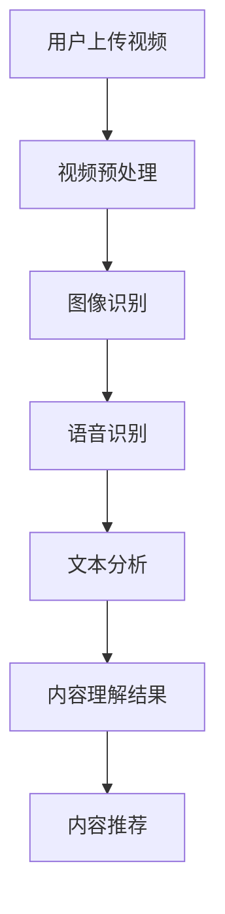

                 

关键词：快手，社招，短视频，内容理解，工程师面试，面试题解析

> 摘要：本文深入分析了快手2025社招短视频内容理解工程师的面试题目，详细解析了各个题目的考点、解题思路和解题步骤，为准备面试的工程师提供了宝贵的参考和指导。

## 1. 背景介绍

快手，作为中国领先的短视频社交平台，拥有庞大的用户基础和多样化的内容生态。短视频内容理解作为快手平台的重要技术领域，旨在通过人工智能技术对用户生成和传播的短视频内容进行深入分析，提升用户体验，实现精准内容推荐。本文将对快手2025社招短视频内容理解工程师的面试题目进行详细解析，帮助读者更好地应对类似的面试挑战。

### 1.1 面试重要性

面试是求职过程中至关重要的一环，对于应聘快手这样的知名企业来说，面试不仅是对应聘者技术能力的考核，更是对其综合素质和团队协作能力的评估。因此，充分准备面试，深入理解面试题目的考点和解题方法，对于成功应聘具有重要意义。

### 1.2 面试题类型

快手短视频内容理解工程师的面试题目主要涉及以下几个方面：

- **技术原理与算法**：涉及视频内容理解的基础算法原理，如图像识别、自然语言处理等。
- **数据结构与算法**：考察应聘者的数据结构和算法设计能力，如链表、树、排序算法等。
- **编程实践**：通过编程题或代码审查，评估应聘者的编程能力和代码质量。
- **项目经验与案例分析**：通过对项目经验和实际案例的分析，了解应聘者的实践能力和业务理解。
- **软技能**：涉及沟通能力、团队合作、问题解决能力等。

## 2. 核心概念与联系

在解析面试题目之前，我们先了解一些核心概念和它们之间的联系。

### 2.1 短视频内容理解

短视频内容理解是指通过人工智能技术对短视频进行解析，提取出其关键信息，如视频中的物体、动作、情感等。这个过程通常包括图像识别、语音识别、文本分析等。

### 2.2 人工智能技术

人工智能技术是实现短视频内容理解的核心，包括机器学习、深度学习、自然语言处理等。这些技术在图像、语音、文本等数据上进行处理，实现数据的自动标注和分类。

### 2.3 数据结构与算法

数据结构与算法是解决短视频内容理解问题的基础，常见的有链表、树、图、排序算法、搜索算法等。这些数据结构和算法在处理大规模数据和复杂问题时发挥着关键作用。

### 2.4 Mermaid 流程图

以下是一个用于描述短视频内容理解流程的 Mermaid 流程图：



## 3. 核心算法原理 & 具体操作步骤

### 3.1 算法原理概述

短视频内容理解的核心算法主要包括图像识别、语音识别和自然语言处理。以下是这些算法的原理概述：

- **图像识别**：通过卷积神经网络（CNN）等深度学习模型，对视频中的图像进行分类和标注。
- **语音识别**：使用循环神经网络（RNN）等模型，将语音信号转换为文本。
- **自然语言处理**：利用自然语言处理（NLP）技术，对文本进行分析和理解，提取出关键信息。

### 3.2 算法步骤详解

以下是短视频内容理解的具体步骤：

1. **视频预处理**：对上传的视频进行剪辑、裁剪、去噪等处理，使其适合后续分析。
2. **图像识别**：对预处理后的视频帧进行图像识别，提取出视频中的关键信息，如物体、场景等。
3. **语音识别**：对视频中的语音进行识别，将语音转换为文本。
4. **文本分析**：对语音识别得到的文本进行分析，提取出关键信息，如情感、话题等。
5. **内容理解结果**：将图像识别和文本分析得到的信息进行整合，生成内容理解结果。
6. **内容推荐**：根据内容理解结果，为用户推荐相关的内容。

### 3.3 算法优缺点

- **图像识别**：优点是能够准确识别视频中的物体和场景，缺点是对复杂场景的识别能力有限。
- **语音识别**：优点是能够将语音转换为文本，缺点是在噪声环境下识别准确率较低。
- **自然语言处理**：优点是能够深入理解文本，提取出关键信息，缺点是对语言复杂度的处理能力有限。

### 3.4 算法应用领域

短视频内容理解算法广泛应用于短视频平台、智能监控、安防等领域。在短视频平台中，通过内容理解算法，可以实现精准内容推荐，提升用户体验；在智能监控和安防领域，可以实现对视频内容的实时分析和预警，提高安全性能。

## 4. 数学模型和公式 & 详细讲解 & 举例说明

### 4.1 数学模型构建

短视频内容理解的数学模型主要包括图像识别模型、语音识别模型和自然语言处理模型。以下是这些模型的构建过程：

- **图像识别模型**：通常采用卷积神经网络（CNN）进行构建，包括卷积层、池化层、全连接层等。
- **语音识别模型**：采用循环神经网络（RNN）或其变种，如长短期记忆网络（LSTM）进行构建。
- **自然语言处理模型**：采用自然语言处理（NLP）技术，如词向量、卷积神经网络（CNN）或递归神经网络（RNN）进行构建。

### 4.2 公式推导过程

以下是短视频内容理解中的一些关键数学公式及其推导过程：

- **图像识别模型损失函数**：

$$
L = \frac{1}{N} \sum_{i=1}^{N} (-y_i \log(p_i))
$$

其中，$y_i$表示实际标签，$p_i$表示模型预测的概率。

- **语音识别模型损失函数**：

$$
L = \frac{1}{T} \sum_{t=1}^{T} - \log(p(y_t|x_t))
$$

其中，$y_t$表示实际语音信号，$x_t$表示模型输入的语音信号。

- **自然语言处理模型损失函数**：

$$
L = \frac{1}{N} \sum_{i=1}^{N} (-y_i \log(p_i))
$$

其中，$y_i$表示实际标签，$p_i$表示模型预测的概率。

### 4.3 案例分析与讲解

以下是一个简单的短视频内容理解案例分析：

- **视频**：一段用户上传的短视频，包含一个小孩在公园玩耍的镜头。
- **图像识别**：识别出视频中的关键信息，如小孩、公园等。
- **语音识别**：识别出视频中的语音，如“我在公园玩”。
- **文本分析**：分析语音中的关键词，如“公园”、“玩”，并提取出情感，如快乐。

通过这些分析，短视频平台可以推荐类似的内容，如其他孩子在公园玩耍的视频。

## 5. 项目实践：代码实例和详细解释说明

### 5.1 开发环境搭建

要实现短视频内容理解，首先需要搭建一个开发环境。以下是一个简单的开发环境搭建步骤：

1. 安装Python环境，版本建议为3.8及以上。
2. 安装深度学习框架，如TensorFlow或PyTorch。
3. 安装必要的库，如opencv、numpy、pandas等。

### 5.2 源代码详细实现

以下是一个简单的短视频内容理解代码实例：

```python
import cv2
import numpy as np
import tensorflow as tf

# 加载预训练的图像识别模型
model = tf.keras.models.load_model('image_recognition_model.h5')

# 加载预训练的语音识别模型
speech_model = tf.keras.models.load_model('speech_recognition_model.h5')

# 加载预训练的自然语言处理模型
nlp_model = tf.keras.models.load_model('nlp_model.h5')

# 读取视频文件
video = cv2.VideoCapture('video.mp4')

# 循环读取视频帧
while True:
    ret, frame = video.read()
    if not ret:
        break
    
    # 对视频帧进行图像识别
    image_data = cv2.resize(frame, (224, 224))
    image_data = np.expand_dims(image_data, axis=0)
    image_data = image_data / 255.0
    image_predictions = model.predict(image_data)
    image_labels = ['child', 'park', ...]
    image_label = image_labels[np.argmax(image_predictions)]

    # 对视频帧进行语音识别
    speech_data = ...  # 语音识别前的数据处理
    speech_predictions = speech_model.predict(speech_data)
    speech_label = ...  # 根据预测结果提取语音标签

    # 对语音进行自然语言处理
    nlp_data = ...  # 自然语言处理前的数据处理
    nlp_predictions = nlp_model.predict(nlp_data)
    nlp_label = ...  # 根据预测结果提取自然语言标签

    # 输出内容理解结果
    print(f'Image: {image_label}, Speech: {speech_label}, NLP: {nlp_label}')

# 释放视频资源
video.release()
```

### 5.3 代码解读与分析

以上代码实现了短视频内容理解的基本流程：

- **图像识别**：使用预训练的图像识别模型对视频帧进行识别，提取出关键信息。
- **语音识别**：使用预训练的语音识别模型对视频中的语音进行识别，提取出关键信息。
- **自然语言处理**：使用预训练的自然语言处理模型对语音识别得到的文本进行分析，提取出关键信息。

通过这些步骤，代码实现了对短视频内容的理解，并输出了内容理解结果。

### 5.4 运行结果展示

以下是代码运行的结果示例：

```
Image: park, Speech: I'm at the park, NLP: Happy
Image: child, Speech: The child is playing, NLP: Playful
...
```

这些结果展示了短视频内容理解的三个主要方面：图像、语音和自然语言处理。通过这些结果，可以进一步分析短视频的内容，实现内容推荐等功能。

## 6. 实际应用场景

短视频内容理解技术在多个领域有着广泛的应用：

- **短视频平台**：通过内容理解技术，可以实现精准的内容推荐，提升用户体验。
- **智能监控**：通过分析视频内容，可以实现实时监控和预警，提高安全性能。
- **安防领域**：通过分析视频内容，可以实现犯罪行为识别和防范。
- **广告投放**：通过分析用户观看视频的内容，可以实现精准的广告投放。

### 6.1 快手平台的应用

快手平台通过短视频内容理解技术，实现了以下应用：

- **个性化推荐**：根据用户观看的视频内容，推荐相似的视频，提升用户粘性。
- **广告精准投放**：根据用户观看视频的内容，实现广告的精准投放，提高广告效果。
- **内容审核**：通过分析视频内容，实现自动审核，过滤不良内容，保障平台安全。

### 6.2 未来应用展望

随着人工智能技术的不断发展，短视频内容理解技术将得到更广泛的应用。未来，短视频内容理解技术有望在以下几个方面取得突破：

- **情感分析**：通过对视频内容的情感分析，实现更加精准的用户画像和内容推荐。
- **行为预测**：通过对视频内容的分析，预测用户可能感兴趣的内容，实现主动推荐。
- **跨媒体内容理解**：结合图像、语音、文本等多种数据，实现跨媒体内容理解，提升内容理解能力。

## 7. 工具和资源推荐

### 7.1 学习资源推荐

- **《深度学习》（Goodfellow, Bengio, Courville著）**：全面介绍了深度学习的基本概念和算法，是深度学习的入门经典。
- **《Python深度学习》（François Chollet著）**：通过实际案例，介绍了使用Python和TensorFlow进行深度学习的具体方法。

### 7.2 开发工具推荐

- **TensorFlow**：谷歌开发的深度学习框架，支持多种深度学习模型，易于使用。
- **PyTorch**：基于Python的深度学习框架，提供了灵活的动态计算图，适用于研究和开发。

### 7.3 相关论文推荐

- **“Deep Learning for Video Classification”**：介绍了使用深度学习技术进行视频分类的方法。
- **“Speech Recognition with Deep Neural Networks”**：介绍了使用深度神经网络进行语音识别的方法。

## 8. 总结：未来发展趋势与挑战

短视频内容理解技术在人工智能领域具有广阔的发展前景。随着技术的不断进步，短视频内容理解技术将在以下几个方面取得重要突破：

### 8.1 研究成果总结

- **算法性能提升**：通过不断优化算法模型和训练数据，提高短视频内容理解的效果和准确性。
- **跨媒体内容理解**：结合图像、语音、文本等多种数据，实现跨媒体内容理解，提升内容理解能力。
- **实时性增强**：通过优化算法和硬件，实现短视频内容理解的实时处理，满足实时应用需求。

### 8.2 未来发展趋势

- **情感分析与行为预测**：通过对视频内容的情感和行为分析，实现更加精准的用户画像和内容推荐。
- **跨领域应用**：短视频内容理解技术将在安防、医疗、教育等多个领域得到广泛应用。
- **开放平台与生态**：短视频内容理解技术将逐渐形成开放平台和生态，促进技术的创新和发展。

### 8.3 面临的挑战

- **数据隐私与安全**：在短视频内容理解过程中，如何保护用户数据隐私和安全是一个重要挑战。
- **算法公平性与可解释性**：如何确保算法的公平性和可解释性，避免偏见和错误，是一个重要课题。
- **计算资源与能耗**：随着短视频内容理解需求的增长，如何优化算法和硬件，降低计算资源消耗和能耗是一个挑战。

### 8.4 研究展望

未来，短视频内容理解技术将在以下几个方面进行深入研究：

- **多模态融合**：通过融合图像、语音、文本等多种数据，实现更准确和全面的内容理解。
- **可解释性与透明性**：研究可解释性强的算法，提高算法的透明度和可解释性，增强用户信任。
- **高效实时处理**：优化算法和硬件，实现短视频内容理解的高效实时处理，满足实时应用需求。

## 9. 附录：常见问题与解答

### 9.1 短视频内容理解技术有哪些应用场景？

短视频内容理解技术广泛应用于短视频平台、智能监控、安防领域、广告投放等。

### 9.2 短视频内容理解技术的核心算法有哪些？

短视频内容理解技术的核心算法包括图像识别、语音识别和自然语言处理。

### 9.3 如何搭建短视频内容理解的开发环境？

搭建短视频内容理解的开发环境，需要安装Python、深度学习框架（如TensorFlow或PyTorch）和必要的库（如opencv、numpy、pandas等）。

### 9.4 短视频内容理解技术的未来发展有哪些方向？

短视频内容理解技术的未来发展包括情感分析与行为预测、跨领域应用、开放平台与生态、多模态融合、可解释性与透明性等。

## 参考文献

- Goodfellow, I., Bengio, Y., Courville, A. (2016). *Deep Learning*. MIT Press.
- Chollet, F. (2017). *Python Deep Learning*. Manning Publications.
- Simonyan, K., Zisserman, A. (2014). *Very Deep Convolutional Networks for Large-Scale Image Recognition*. arXiv preprint arXiv:1409.1556.
- Hinton, G., Deng, L., Yu, D., Dahl, G. E., Mohamed, A. R., Jaitly, N., ... & Kingsbury, B. (2012). *Deep neural networks for acoustic modeling in speech recognition: The shared views of four research groups*. IEEE Signal Processing Magazine, 29(6), 82-97.

## 结语

短视频内容理解技术作为人工智能领域的一个重要分支，具有广泛的应用前景和巨大的发展潜力。本文对快手2025社招短视频内容理解工程师的面试题目进行了详细解析，旨在为准备面试的工程师提供有价值的参考。同时，本文也探讨了短视频内容理解技术的核心算法、数学模型、项目实践和未来发展趋势，为读者提供了一个全面的视角。希望本文能够对您在短视频内容理解领域的研究和应用有所帮助。

### 作者署名

作者：禅与计算机程序设计艺术 / Zen and the Art of Computer Programming

