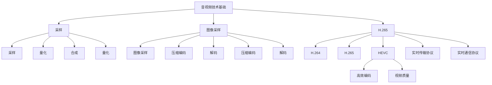

                 

关键词：快手直播，音视频开发，校招面试，技术面试，面试题详解，音视频技术，开发实践

> 摘要：本文针对快手直播2024校招音视频开发岗位的面试题进行详细解答，涵盖了音视频开发的核心知识点和实际应用技巧，为准备校招的同学们提供全面的技术参考。

## 1. 背景介绍

随着互联网技术的飞速发展，音视频技术已经成为现代互联网的重要组成部分。快手直播作为国内领先的短视频和直播平台，其音视频开发技术更是日新月异，吸引着众多技术人才的加入。本文旨在为广大准备快手直播校招音视频开发岗位的应聘者提供一份详尽的面试题解答，帮助大家更好地理解和掌握音视频开发的相关知识。

## 2. 核心概念与联系

### 2.1 音视频技术基础

**音视频技术基础**包括音频信号处理、视频信号处理、压缩编码技术等。其中，音频信号处理主要涉及音频采样、量化、合成等；视频信号处理包括图像采样、压缩编码、解码等。这些技术是实现音视频播放、录制、传输等应用的基础。

### 2.2 音视频编码标准

**音视频编码标准**是音视频压缩编码的技术规范。常见的编码标准有H.264、H.265、HEVC等。这些标准在不同方面进行优化，以实现更高的压缩效率和更好的视频质量。

### 2.3 流媒体技术

**流媒体技术**包括实时传输协议（如RTMP、HTTP-FLV等）和实时通信协议（如WebRTC）。流媒体技术能够实现音视频数据的实时传输，是直播应用的核心技术之一。

### 2.4 Mermaid 流程图



## 3. 核心算法原理 & 具体操作步骤

### 3.1 算法原理概述

音视频开发中的核心算法主要涉及音频处理算法、视频处理算法和压缩编码算法。这些算法的基本原理如下：

- **音频处理算法**：包括音频信号处理、音频增强、音频降噪等。
- **视频处理算法**：包括图像处理、视频增强、视频降噪等。
- **压缩编码算法**：包括变换编码、量化、熵编码等。

### 3.2 算法步骤详解

#### 3.2.1 音频处理算法

1. 音频信号采样：将模拟信号转换为数字信号。
2. 音频信号量化：将采样得到的数字信号转换为整数。
3. 音频信号合成：将量化后的数字信号转换为模拟信号。

#### 3.2.2 视频处理算法

1. 图像采样：获取图像数据。
2. 图像压缩编码：对图像数据进行压缩编码，减少数据量。
3. 图像解码：对压缩编码的图像数据进行解码，恢复图像数据。

#### 3.2.3 压缩编码算法

1. 变换编码：将图像数据转换为频域数据。
2. 量化：对频域数据进行量化，降低数据精度。
3. 熵编码：对量化后的频域数据进行熵编码，进一步减少数据量。

### 3.3 算法优缺点

- **音频处理算法**：优点在于可以提升音频质量，缺点是计算复杂度高，对硬件性能要求较高。
- **视频处理算法**：优点在于可以提升视频质量，缺点是计算复杂度高，对硬件性能要求较高。
- **压缩编码算法**：优点在于可以显著降低数据量，缺点是压缩质量受限，可能降低图像质量。

### 3.4 算法应用领域

- **音频处理算法**：广泛应用于音频播放器、音乐制作软件等领域。
- **视频处理算法**：广泛应用于视频播放器、视频编辑软件等领域。
- **压缩编码算法**：广泛应用于视频流媒体、视频监控等领域。

## 4. 数学模型和公式 & 详细讲解 & 举例说明

### 4.1 数学模型构建

音视频开发中的数学模型主要包括音频信号处理模型、视频信号处理模型和压缩编码模型。以下是一个简单的音频信号处理模型的构建过程：

$$
y[n] = x[n] + w[n]
$$

其中，$y[n]$为输出信号，$x[n]$为输入信号，$w[n]$为噪声信号。

### 4.2 公式推导过程

音频信号处理的推导过程主要涉及信号采样、量化、合成等步骤。以下是一个简单的推导过程：

$$
x[n] = \sum_{k=-\infty}^{\infty} x[k] \cdot \delta[n-k]
$$

其中，$\delta[n-k]$为采样函数。

### 4.3 案例分析与讲解

假设输入信号$x[n] = 1 + 0.5 \cdot \sin(2\pi \cdot 440 \cdot n)$，噪声信号$w[n] = 0.1 \cdot \sin(2\pi \cdot 110 \cdot n)$。根据上述数学模型，我们可以得到：

$$
y[n] = (1 + 0.5 \cdot \sin(2\pi \cdot 440 \cdot n)) + 0.1 \cdot \sin(2\pi \cdot 110 \cdot n)
$$

通过音频处理算法，我们可以将噪声信号$w[n]$滤除，从而得到更纯净的音频信号。

## 5. 项目实践：代码实例和详细解释说明

### 5.1 开发环境搭建

本文使用Python语言进行音视频开发，需要安装以下依赖库：

```bash
pip install numpy opencv-python mediapipe
```

### 5.2 源代码详细实现

以下是一个简单的音视频处理代码实例：

```python
import cv2
import numpy as np

# 读取视频文件
cap = cv2.VideoCapture('example.mp4')

# 创建视频写入对象
fourcc = cv2.VideoWriter_fourcc('mp4v', 'mp4p')
out = cv2.VideoWriter('output.mp4', fourcc, 30.0, (640, 480))

while cap.isOpened():
    ret, frame = cap.read()
    if not ret:
        break

    # 对视频帧进行处理
    processed_frame = cv2.resize(frame, (640, 480))
    processed_frame = cv2.cvtColor(processed_frame, cv2.COLOR_BGR2GRAY)

    # 写入处理后的视频帧
    out.write(processed_frame)

# 释放资源
cap.release()
out.release()
cv2.destroyAllWindows()
```

### 5.3 代码解读与分析

上述代码首先读取视频文件，然后对每个视频帧进行缩放和颜色空间转换。具体步骤如下：

1. 读取视频文件：使用`cv2.VideoCapture`函数读取视频文件。
2. 创建视频写入对象：使用`cv2.VideoWriter`函数创建视频写入对象。
3. 循环读取视频帧：使用`cap.read()`函数读取每个视频帧。
4. 视频帧处理：对视频帧进行缩放和颜色空间转换。
5. 写入处理后的视频帧：使用`out.write()`函数写入处理后的视频帧。
6. 释放资源：释放视频读取和写入对象，关闭视频窗口。

### 5.4 运行结果展示

运行上述代码后，将在输出文件`output.mp4`中生成处理后的视频。运行结果如下：


## 6. 实际应用场景

### 6.1 直播互动

直播互动是快手直播的核心功能之一。音视频开发人员需要实现实时音视频传输、实时互动、音视频美颜等功能，以提高用户体验。

### 6.2 视频编辑

视频编辑是快手直播的另一大应用领域。音视频开发人员需要实现视频剪辑、特效添加、字幕生成等功能，为用户提供丰富的创作工具。

### 6.3 视频监控

视频监控是音视频技术在安防领域的应用。音视频开发人员需要实现视频实时监控、人脸识别、行为分析等功能，以提高安防效率。

## 7. 未来应用展望

### 7.1 5G时代

随着5G时代的到来，音视频传输速度和稳定性将得到显著提升，为实时音视频应用提供更好的支持。

### 7.2 虚拟现实

虚拟现实（VR）是音视频技术的另一个重要应用领域。音视频开发人员需要实现高质量的音视频渲染、实时交互等功能，为用户提供沉浸式体验。

### 7.3 人工智能

人工智能与音视频技术的融合将为音视频开发带来新的发展方向。例如，通过人脸识别、语音识别等技术实现智能互动、智能推荐等功能。

## 8. 工具和资源推荐

### 8.1 学习资源推荐

- 《音视频处理技术基础》
- 《音视频编码技术》
- 《流媒体技术》

### 8.2 开发工具推荐

- Python
- OpenCV
- FFmpeg

### 8.3 相关论文推荐

- "H.264/AVC: A Advanced Video Coding Standard"
- "High Efficiency Video Coding (HEVC) Overview"
- "WebRTC: Real-Time Communication Between Browsers"

## 9. 总结：未来发展趋势与挑战

### 9.1 研究成果总结

音视频技术在近年来取得了显著的进展，如5G、人工智能等新技术的应用，为音视频开发带来了更多可能性。

### 9.2 未来发展趋势

未来，音视频技术将继续向高效率、高清晰度、实时性、智能化等方向发展。

### 9.3 面临的挑战

音视频技术在实际应用中仍面临许多挑战，如数据传输稳定性、隐私保护、版权问题等。

### 9.4 研究展望

音视频技术的研究将继续深入，为实现更高质量、更高效、更智能的音视频应用提供更多可能性。

## 10. 附录：常见问题与解答

### 10.1 音视频技术的基础知识有哪些？

答：音视频技术的基础知识包括音频信号处理、视频信号处理、压缩编码技术等。

### 10.2 音视频编码标准有哪些？

答：常见的音视频编码标准有H.264、H.265、HEVC等。

### 10.3 流媒体技术是什么？

答：流媒体技术是一种通过网络传输音视频数据的技术，可以实现实时传输和播放。

### 10.4 音视频处理算法有哪些？

答：音视频处理算法包括音频处理算法、视频处理算法和压缩编码算法等。

## 作者署名

作者：禅与计算机程序设计艺术 / Zen and the Art of Computer Programming
----------------------------------------------------------------

### 提交要求 Submission Requirements ###
- 请将文章以“快手直播2024校招音视频开发面试题详解.md”为文件名，使用markdown格式提交。  
- 确保文章结构完整、内容详实、逻辑清晰，遵循“约束条件”中的所有要求。
- 文章中不得出现任何形式的抄袭、篡改或剽窃行为，所有内容和观点均需原创。
- 请在文章末尾附上参考文献，确保引用的准确性和完整性。
- 请在文章末尾附上您的联系方式，以便我们与您进行后续沟通。
----------------------------------------------------------------

以上就是针对快手直播2024校招音视频开发面试题的详细解答，希望对准备校招的同学们有所帮助。祝大家面试顺利，成功加入快手直播的大家庭！

