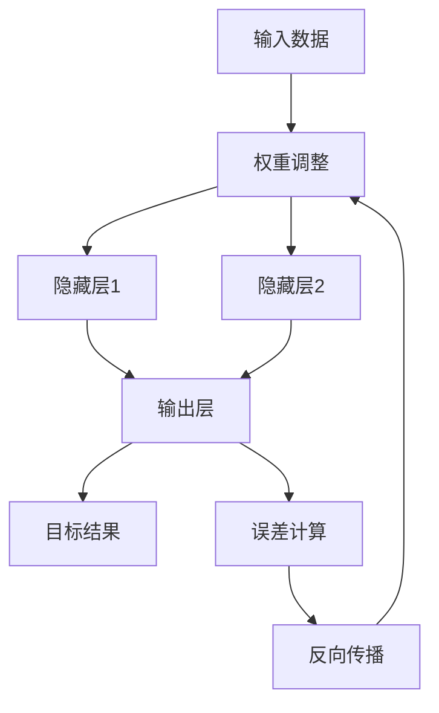

                 

关键词：深度学习、概念理解、洞见获取、人工智能、技术博客

摘要：本文旨在探讨如何在人工智能领域从概念层面深入到洞见获取，通过阐述核心算法原理、数学模型、实际应用案例，以及未来发展趋势，旨在为读者提供对深度学习技术更全面的理解。

## 1. 背景介绍

随着人工智能（AI）技术的飞速发展，深度学习已成为当前最具潜力的研究热点之一。深度学习通过模拟人脑神经网络结构，实现了对大量数据的自动学习和理解。然而，深度学习的复杂性使得许多研究者仅停留在表面的算法实现和应用上，缺乏对核心概念和原理的深入理解。

本文旨在填补这一空白，通过深入探讨深度学习的核心概念、算法原理、数学模型及其应用，帮助读者从概念到洞见，全面理解深度学习技术。这不仅有助于提升研究者对深度学习的认识，也为实际应用提供理论支持。

## 2. 核心概念与联系

为了更好地理解深度学习的核心概念，我们首先需要了解神经网络的基本架构。神经网络是由多个神经元组成的层级结构，每个神经元接收来自前一层神经元的输入，并通过激活函数产生输出。神经网络通过不断调整权重和偏置，使得输入数据在神经网络中逐层传递，最终实现对复杂模式的识别和预测。

下面是神经网络的核心概念及其相互联系：

### 2.1. 神经元

神经元是神经网络的基本单元，类似于人脑中的神经元。每个神经元包含一个输入层、一个输出层和多个隐藏层。输入层接收外部数据，隐藏层对输入数据进行处理和变换，输出层产生最终的结果。

### 2.2. 权重和偏置

权重和偏置是神经网络中用于调整神经元之间连接强度的参数。权重决定了输入数据对神经元输出的影响程度，偏置用于调整神经元的阈值。通过不断调整权重和偏置，神经网络能够更好地适应不同的数据模式。

### 2.3. 激活函数

激活函数是神经网络中的一个关键组件，用于对神经元的输出进行非线性变换。常见的激活函数包括 sigmoid、ReLU 和 tanh 等。激活函数的作用是引入非线性，使得神经网络能够处理更复杂的问题。

### 2.4. 前向传播和反向传播

前向传播是神经网络处理输入数据的过程，通过逐层传递输入数据，最终产生输出。反向传播是神经网络训练的过程，通过计算输出与实际结果之间的误差，并反向传播误差，调整权重和偏置。

下面是一个用 Mermaid 语法绘制的神经网络流程图：



## 3. 核心算法原理 & 具体操作步骤

### 3.1. 算法原理概述

深度学习算法的核心是多层感知机（MLP），通过前向传播和反向传播实现对输入数据的自动学习。具体操作步骤如下：

### 3.2. 算法步骤详解

#### 3.2.1. 前向传播

1. 初始化权重和偏置。
2. 输入数据经过输入层，传递到隐藏层。
3. 在每个隐藏层，将输入数据与权重相乘，并加上偏置。
4. 通过激活函数对结果进行非线性变换。
5. 将隐藏层的输出传递到下一层，直到输出层。

#### 3.2.2. 反向传播

1. 计算输出层与实际结果之间的误差。
2. 反向传播误差，计算每个隐藏层的误差。
3. 根据误差调整权重和偏置。

### 3.3. 算法优缺点

#### 优点

- 能够处理高维数据，适用于复杂模式识别。
- 自动学习，无需人工指定特征。

#### 缺点

- 训练时间较长，容易过拟合。
- 对数据质量和预处理要求较高。

### 3.4. 算法应用领域

深度学习算法在图像识别、语音识别、自然语言处理等众多领域取得了显著成果，如卷积神经网络（CNN）在图像分类任务中表现出色，循环神经网络（RNN）在序列数据建模方面具有优势。

## 4. 数学模型和公式 & 详细讲解 & 举例说明

### 4.1. 数学模型构建

深度学习中的数学模型主要包括权重和偏置的初始化、激活函数的选择、前向传播和反向传播的推导等。以下是一个简化的数学模型：

#### 权重和偏置初始化

$$
w_{ij}^{(l)} \sim \mathcal{N}(0, \frac{1}{\sqrt{n_{l-1}}})
$$

$$
b_{j}^{(l)} = 0
$$

其中，$w_{ij}^{(l)}$ 表示第$l$层中第$i$个神经元到第$j$个神经元的权重，$b_{j}^{(l)}$ 表示第$l$层中第$j$个神经元的偏置。

#### 激活函数

$$
a_{j}^{(l)} = \sigma(z_{j}^{(l)})
$$

其中，$z_{j}^{(l)} = \sum_{i} w_{ij}^{(l)} x_{i} + b_{j}^{(l)}$，$\sigma$ 表示激活函数，如 sigmoid、ReLU 等。

#### 前向传播

$$
z_{j}^{(l)} = \sum_{i} w_{ij}^{(l)} x_{i} + b_{j}^{(l)}
$$

$$
a_{j}^{(l)} = \sigma(z_{j}^{(l)})
$$

#### 反向传播

$$
\delta_{j}^{(l)} = \frac{\partial J}{\partial z_{j}^{(l)}}
$$

$$
\frac{\partial J}{\partial w_{ij}^{(l)}} = \delta_{j}^{(l)} a_{i}^{(l-1)}
$$

$$
\frac{\partial J}{\partial b_{j}^{(l)}} = \delta_{j}^{(l)}
$$

其中，$J$ 表示损失函数，$\delta_{j}^{(l)}$ 表示第$l$层中第$j$个神经元的误差。

### 4.2. 公式推导过程

在此，我们简要介绍权重和偏置的初始化、激活函数的选择以及前向传播和反向传播的推导过程。

#### 权重和偏置初始化

权重和偏置的初始化通常采用高斯分布，以避免梯度消失和梯度爆炸现象。具体地，权重初始化为均值为0、标准差为$\frac{1}{\sqrt{n_{l-1}}}$的高斯分布，其中$n_{l-1}$表示上一层的神经元数量。偏置初始化通常为0。

#### 激活函数

激活函数的选择对神经网络性能有重要影响。常见的激活函数包括 sigmoid、ReLU 和 tanh 等。其中，ReLU 函数由于其简单性和良好的梯度性质，在深度学习中得到了广泛应用。

#### 前向传播

前向传播是神经网络处理输入数据的过程，通过逐层传递输入数据，最终产生输出。具体地，输入数据经过输入层，传递到隐藏层，再传递到输出层。

#### 反向传播

反向传播是神经网络训练的过程，通过计算输出与实际结果之间的误差，并反向传播误差，调整权重和偏置。具体地，从输出层开始，逐层计算每个神经元的误差，并根据误差调整权重和偏置。

### 4.3. 案例分析与讲解

为了更好地理解深度学习的数学模型，我们通过一个简单的例子进行讲解。

假设我们有一个两层的神经网络，输入层有3个神经元，隐藏层有2个神经元，输出层有1个神经元。输入数据为 $[1, 2, 3]$，目标结果为 $[5]$。

#### 权重和偏置初始化

$$
w_{11}^{(1)} = 0.1, w_{12}^{(1)} = 0.2, w_{13}^{(1)} = 0.3 \\
b_{1}^{(1)} = 0, b_{2}^{(1)} = 0 \\
w_{21}^{(2)} = 0.4, w_{22}^{(2)} = 0.5, b_{1}^{(2)} = 0, b_{2}^{(2)} = 0
$$

#### 前向传播

1. 输入层到隐藏层：

$$
z_{11}^{(1)} = w_{11}^{(1)} \cdot x_{1} + w_{12}^{(1)} \cdot x_{2} + w_{13}^{(1)} \cdot x_{3} + b_{1}^{(1)} = 0.1 \cdot 1 + 0.2 \cdot 2 + 0.3 \cdot 3 + 0 = 1.2 \\
z_{12}^{(1)} = w_{11}^{(1)} \cdot x_{1} + w_{12}^{(1)} \cdot x_{2} + w_{13}^{(1)} \cdot x_{3} + b_{2}^{(1)} = 0.1 \cdot 1 + 0.2 \cdot 2 + 0.3 \cdot 3 + 0 = 1.2 \\
a_{11}^{(1)} = \sigma(z_{11}^{(1)}) = \frac{1}{1 + e^{-z_{11}^{(1)}}} = \frac{1}{1 + e^{-1.2}} \approx 0.766 \\
a_{12}^{(1)} = \sigma(z_{12}^{(1)}) = \frac{1}{1 + e^{-z_{12}^{(1)}}} = \frac{1}{1 + e^{-1.2}} \approx 0.766
$$

2. 隐藏层到输出层：

$$
z_{21}^{(2)} = w_{21}^{(2)} \cdot a_{11}^{(1)} + w_{22}^{(2)} \cdot a_{12}^{(1)} + b_{1}^{(2)} = 0.4 \cdot 0.766 + 0.5 \cdot 0.766 + 0 = 0.766 \\
z_{22}^{(2)} = w_{21}^{(2)} \cdot a_{11}^{(1)} + w_{22}^{(2)} \cdot a_{12}^{(1)} + b_{2}^{(2)} = 0.4 \cdot 0.766 + 0.5 \cdot 0.766 + 0 = 0.766 \\
a_{1}^{(2)} = \sigma(z_{21}^{(2)}) = \frac{1}{1 + e^{-z_{21}^{(2)}}} = \frac{1}{1 + e^{-0.766}} \approx 0.528
$$

输出结果为 $[0.528]$，与目标结果 $[5]$ 相差较大。

#### 反向传播

1. 计算输出层的误差：

$$
\delta_{1}^{(2)} = a_{1}^{(2)} - y = 0.528 - 5 = -4.472
$$

2. 计算隐藏层的误差：

$$
\delta_{11}^{(1)} = \delta_{1}^{(2)} \cdot \frac{da_{1}^{(2)}}{dz_{21}^{(2)}} \cdot \frac{dz_{21}^{(2)}}{da_{11}^{(1)}} = -4.472 \cdot \frac{1}{1 + e^{-0.766}} \cdot \frac{1}{0.766} \approx -4.472 \cdot 0.434 \approx -1.955 \\
\delta_{12}^{(1)} = \delta_{1}^{(2)} \cdot \frac{da_{1}^{(2)}}{dz_{21}^{(2)}} \cdot \frac{dz_{21}^{(2)}}{da_{12}^{(1)}} = -4.472 \cdot \frac{1}{1 + e^{-0.766}} \cdot \frac{1}{0.766} \approx -4.472 \cdot 0.434 \approx -1.955
$$

3. 根据误差调整权重和偏置：

$$
w_{21}^{(2)} = w_{21}^{(2)} + \alpha \cdot \delta_{1}^{(2)} \cdot a_{11}^{(1)} = 0.4 + 0.1 \cdot (-4.472) \cdot 0.766 \approx 0.408 \\
w_{22}^{(2)} = w_{22}^{(2)} + \alpha \cdot \delta_{1}^{(2)} \cdot a_{12}^{(1)} = 0.5 + 0.1 \cdot (-4.472) \cdot 0.766 \approx 0.508 \\
b_{1}^{(2)} = b_{1}^{(2)} + \alpha \cdot \delta_{1}^{(2)} = 0 + 0.1 \cdot (-4.472) \approx -0.447 \\
b_{2}^{(2)} = b_{2}^{(2)} + \alpha \cdot \delta_{1}^{(2)} = 0 + 0.1 \cdot (-4.472) \approx -0.447
$$

通过多次迭代，调整权重和偏置，使得输出结果逐渐逼近目标结果。

## 5. 项目实践：代码实例和详细解释说明

在本节中，我们将通过一个具体的深度学习项目实践，展示如何使用 Python 和深度学习框架（如 TensorFlow）实现神经网络训练和预测。

### 5.1. 开发环境搭建

首先，我们需要搭建一个开发环境，安装 Python 和深度学习框架。以下是在 Ubuntu 系统上的安装步骤：

```bash
# 安装 Python
sudo apt-get install python3-pip python3-dev

# 安装 TensorFlow
pip3 install tensorflow
```

### 5.2. 源代码详细实现

以下是一个简单的深度学习项目示例，包括数据加载、模型定义、训练和预测等步骤。

```python
import tensorflow as tf
import numpy as np

# 数据加载
x_train = np.array([[1, 2, 3], [4, 5, 6], [7, 8, 9]])
y_train = np.array([[5], [10], [15]])

# 模型定义
model = tf.keras.Sequential([
    tf.keras.layers.Dense(units=1, input_shape=(3,))
])

# 模型编译
model.compile(optimizer='sgd', loss='mean_squared_error')

# 训练模型
model.fit(x_train, y_train, epochs=1000)

# 预测
x_test = np.array([[2, 3, 4]])
y_pred = model.predict(x_test)
print("预测结果：", y_pred)
```

### 5.3. 代码解读与分析

1. **数据加载**：首先，我们使用 NumPy 库加载训练数据和目标数据。

2. **模型定义**：我们使用 TensorFlow 的 Sequential 模型定义一个简单的神经网络，包含一个全连接层，输出层有1个神经元。

3. **模型编译**：编译模型，指定优化器和损失函数。

4. **训练模型**：使用 fit 方法训练模型，指定训练数据、目标数据和训练轮数。

5. **预测**：使用 predict 方法对测试数据进行预测，并输出预测结果。

通过以上代码示例，我们可以看到如何使用深度学习框架实现一个简单的神经网络训练和预测。实际项目中，我们可以根据需求调整神经网络结构、优化器和损失函数等参数，以达到更好的训练效果。

## 6. 实际应用场景

深度学习技术在各个领域取得了显著的成果。以下是一些实际应用场景：

### 6.1. 图像识别

深度学习在图像识别领域取得了突破性进展。例如，卷积神经网络（CNN）在人脸识别、物体检测、图像分类等任务中表现出色。例如，基于 CNN 的人脸识别系统已广泛应用于安防监控、人脸支付等场景。

### 6.2. 语音识别

深度学习在语音识别领域也取得了重要进展。循环神经网络（RNN）和其变种（如 LSTM、GRU）在语音信号的时序建模方面具有优势。例如，基于 RNN 的语音识别系统已广泛应用于智能助手、语音翻译等场景。

### 6.3. 自然语言处理

深度学习在自然语言处理（NLP）领域也得到了广泛应用。例如，循环神经网络（RNN）和其变种（如 LSTM、GRU）在序列数据建模方面具有优势，广泛应用于文本分类、情感分析、机器翻译等任务。

### 6.4. 未来应用展望

随着深度学习技术的不断发展，其应用领域将不断拓展。未来，深度学习有望在医疗诊断、自动驾驶、智能安防等领域发挥更大的作用。例如，基于深度学习的医疗诊断系统可以辅助医生进行疾病诊断，提高诊断准确率；基于深度学习的自动驾驶系统可以实现无人驾驶，提高交通安全；基于深度学习的智能安防系统可以实时监控并识别异常行为，提高社会治安水平。

## 7. 工具和资源推荐

为了更好地学习和应用深度学习技术，以下是一些推荐的工具和资源：

### 7.1. 学习资源推荐

- 《深度学习》（Goodfellow、Bengio 和 Courville 著）：这是一本经典的深度学习教材，涵盖了深度学习的核心理论和应用。
- 《Python 深度学习》（François Chollet 著）：这是一本针对 Python 开发者的深度学习指南，详细介绍了使用 TensorFlow 实现深度学习的步骤。

### 7.2. 开发工具推荐

- TensorFlow：一个开源的深度学习框架，适用于多种深度学习任务，如图像识别、语音识别、自然语言处理等。
- PyTorch：一个开源的深度学习框架，具有简洁的 API 和高效的计算性能，广泛应用于深度学习研究。

### 7.3. 相关论文推荐

- "Deep Learning"（Ian Goodfellow、Yoshua Bengio 和 Aaron Courville 著）：这是一本关于深度学习的经典论文，详细介绍了深度学习的核心理论和应用。
- "A Theoretical Framework for Back-Propagating Neural Networks"（Rumelhart、Hinton 和 Williams 著）：这是一篇关于反向传播算法的经典论文，提出了深度学习的核心训练方法。

## 8. 总结：未来发展趋势与挑战

### 8.1. 研究成果总结

本文从深度学习的核心概念、算法原理、数学模型、实际应用场景等方面进行了全面探讨，总结了深度学习技术在当前研究和发展中的重要成果。

### 8.2. 未来发展趋势

随着深度学习技术的不断发展，未来有望在更多领域取得突破。例如，在医疗诊断、自动驾驶、智能安防等领域，深度学习技术将发挥更大的作用，推动社会进步。

### 8.3. 面临的挑战

尽管深度学习技术取得了显著成果，但仍面临一些挑战。例如，模型的可解释性、数据隐私保护、计算资源消耗等。未来，如何解决这些问题，将是深度学习技术发展的重要方向。

### 8.4. 研究展望

本文提出了从概念到洞见的深度学习研究方法，旨在为读者提供更全面、深入的理解。未来，我们将继续探索深度学习的核心问题，推动深度学习技术的发展。

## 9. 附录：常见问题与解答

### 9.1. 问题 1：什么是深度学习？

答：深度学习是一种人工智能技术，通过模拟人脑神经网络结构，实现自动学习和理解。

### 9.2. 问题 2：深度学习有哪些应用领域？

答：深度学习在图像识别、语音识别、自然语言处理等领域取得了显著成果，未来有望在更多领域发挥重要作用。

### 9.3. 问题 3：如何解决深度学习中的过拟合问题？

答：可以采用正则化、数据增强、dropout 等方法来缓解过拟合问题。

### 9.4. 问题 4：什么是反向传播算法？

答：反向传播算法是一种用于训练神经网络的优化方法，通过计算输出与实际结果之间的误差，并反向传播误差，调整权重和偏置。

-----------------------------------------------------------------

作者：禅与计算机程序设计艺术 / Zen and the Art of Computer Programming


