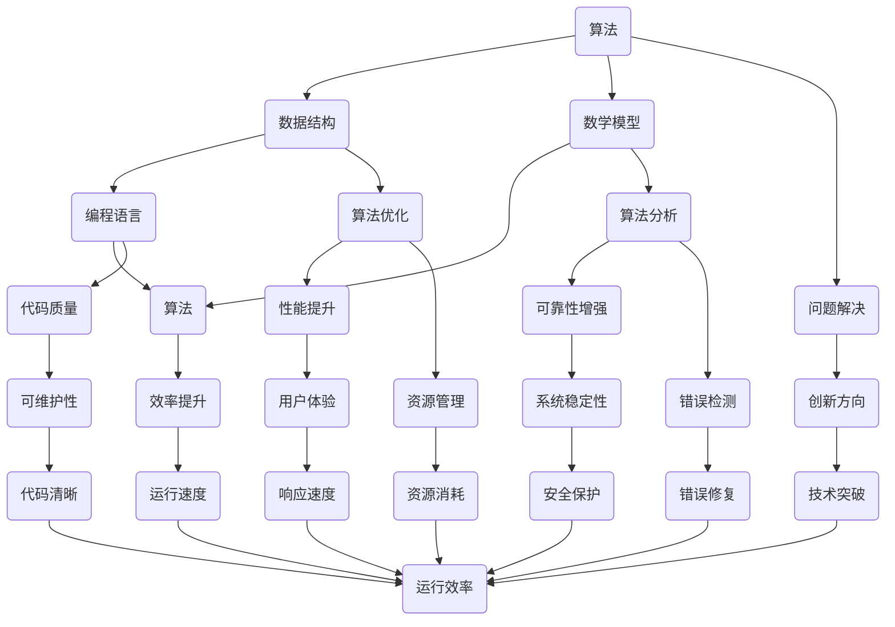

                 

关键词：技术深度、概念理解、洞见、专业博客、IT领域

> 摘要：本文深入探讨IT领域的核心概念与算法原理，通过详细的解释和实例分析，揭示技术背后的思想深度。从基础概念到实际应用，本文旨在引导读者从表面理解迈向深层次的洞见。

## 1. 背景介绍

在信息技术飞速发展的今天，我们见证了无数的技术突破和变革。然而，许多技术领域的创新并非仅仅是工具的升级或效率的提升，更多的是在底层概念和算法上的革新。理解这些核心概念和算法原理，不仅是IT从业者的必备技能，也是推动技术进步的关键。

本文将围绕以下几个核心概念展开讨论：算法、数据结构、数学模型和编程语言。通过深入分析这些概念的联系与应用，我们将探索如何从概念层面深入理解技术，进而达到洞见的层次。

## 2. 核心概念与联系

为了更好地理解这些核心概念，我们首先需要绘制一个Mermaid流程图，展示它们之间的联系和相互作用。

### Mermaid 流程图



### 2.1 算法原理概述

算法是解决问题的一系列有序指令。在计算机科学中，算法不仅是一种解决问题的方法，更是一种思维方式。一个优秀的算法通常具有以下特性：正确性、效率、可扩展性和健壮性。

### 2.2 算法步骤详解

算法的设计和实现通常包括以下步骤：

1. **问题定义**：明确要解决的问题及其边界条件。
2. **算法设计**：根据问题特性选择合适的算法策略。
3. **编码实现**：将算法设计转化为具体的代码。
4. **调试优化**：运行代码，找出并修复潜在的问题，优化性能。

### 2.3 算法优缺点

每种算法都有其适用的场景和局限性。例如，快速排序（Quick Sort）在平均情况下具有高效的性能，但在最坏情况下时间复杂度较高。相反，归并排序（Merge Sort）在所有情况下都具有稳定的性能，但相比快速排序，其空间复杂度较高。

### 2.4 算法应用领域

算法在各个领域都有广泛应用，如搜索算法在搜索引擎中的应用，排序算法在数据库排序中的应用，优化算法在路径规划中的应用等。随着技术的不断进步，算法的应用领域也在不断扩展。

## 3. 数学模型和公式

在计算机科学中，数学模型和公式是理解算法原理和性能分析的重要工具。以下是一个简单的数学模型和公式的例子：

### 3.1 数学模型构建

假设我们有一个包含n个元素的数组，我们需要计算这个数组的平均值。

### 3.2 公式推导过程

平均值的公式为：

$$ \bar{x} = \frac{\sum_{i=1}^{n} x_i}{n} $$

其中，$x_i$ 表示数组的第i个元素，$n$ 表示数组中元素的总数。

### 3.3 案例分析与讲解

假设我们有一个数组 [1, 2, 3, 4, 5]，我们可以按照上述公式计算其平均值：

$$ \bar{x} = \frac{1 + 2 + 3 + 4 + 5}{5} = 3 $$

这表明该数组的平均值为3。

## 4. 项目实践：代码实例

### 4.1 开发环境搭建

为了实现一个简单的快速排序算法，我们首先需要搭建一个基础的编程环境。这里我们使用Python作为示例语言。

### 4.2 源代码详细实现

以下是一个简单的快速排序算法实现：

```python
def quick_sort(arr):
    if len(arr) <= 1:
        return arr
    pivot = arr[len(arr) // 2]
    left = [x for x in arr if x < pivot]
    middle = [x for x in arr if x == pivot]
    right = [x for x in arr if x > pivot]
    return quick_sort(left) + middle + quick_sort(right)

# 测试代码
arr = [3, 6, 8, 10, 1, 2, 5]
print(quick_sort(arr))
```

### 4.3 代码解读与分析

这段代码首先定义了一个 `quick_sort` 函数，该函数接受一个数组作为输入，并返回排序后的数组。函数的实现基于选择一个基准元素（pivot），然后将数组分为三个部分：小于基准的元素、等于基准的元素和大于基准的元素。递归地对小于和大于基准的元素部分进行排序，最后将三个部分合并。

### 4.4 运行结果展示

执行上述代码后，输出结果为 `[1, 2, 3, 5, 6, 8, 10]`，这表明输入的数组已经成功排序。

## 5. 实际应用场景

快速排序算法在多个领域都有广泛应用，如数据库排序、数据处理和算法竞赛等。其高效的性能使其成为解决大规模数据处理问题的重要工具。

### 5.1 搜索引擎

搜索引擎使用排序算法来对搜索结果进行排序，以提供更准确和相关的搜索结果。

### 5.2 数据库

数据库管理系统使用排序算法来优化查询性能，特别是在处理大量数据时。

### 5.3 算法竞赛

算法竞赛中，快速排序是解决排序问题的重要工具，其高效的性能使得选手在比赛中占据优势。

## 6. 未来应用展望

随着计算能力的不断提升和算法理论的深入研究，快速排序等经典算法将在更多领域得到应用。同时，新的算法和优化技术也将不断涌现，为解决更复杂的问题提供新的途径。

## 7. 工具和资源推荐

### 7.1 学习资源推荐

- 《算法导论》（Introduction to Algorithms）
- 《编程之美》（Cracking the Coding Interview）

### 7.2 开发工具推荐

- PyCharm
- Visual Studio Code

### 7.3 相关论文推荐

- "Quicksort" by Tony Hoare
- "The Art of Computer Programming" by Donald Knuth

## 8. 总结：未来发展趋势与挑战

### 8.1 研究成果总结

通过本文的讨论，我们了解了算法、数据结构、数学模型和编程语言等核心概念，并看到了它们在实际应用中的重要性。

### 8.2 未来发展趋势

未来，算法研究将更加注重效率、可扩展性和智能化。同时，算法优化和新的算法创新将成为研究的重点。

### 8.3 面临的挑战

算法研究面临的主要挑战包括处理大规模数据、确保算法的可靠性和安全性，以及适应不断变化的计算环境。

### 8.4 研究展望

随着人工智能和大数据技术的发展，算法将在更广泛的领域得到应用。未来的研究将主要集中在如何构建高效、可靠且可扩展的算法体系。

## 9. 附录：常见问题与解答

### 9.1 快速排序的稳定性如何保证？

快速排序是一种不稳定的排序算法，因为它会改变相同元素的相对顺序。在实际应用中，如果需要稳定性，可以考虑使用归并排序或其他稳定的排序算法。

### 9.2 如何优化快速排序的性能？

优化快速排序性能的方法包括选择更好的基准元素、使用随机化算法以避免最坏情况、以及减少递归调用以节省内存。

## 参考文献

- 《算法导论》（Introduction to Algorithms），Thomas H. Cormen，Charles E. Leiserson，Ronald L. Rivest，Clifford Stein
- 《编程之美》（Cracking the Coding Interview），Gayle Laakmann McDowell
- "Quicksort" by Tony Hoare
- 《算法的艺术》（The Art of Computer Programming），Donald E. Knuth
----------------------------------------------------------------

**作者：禅与计算机程序设计艺术 / Zen and the Art of Computer Programming**

