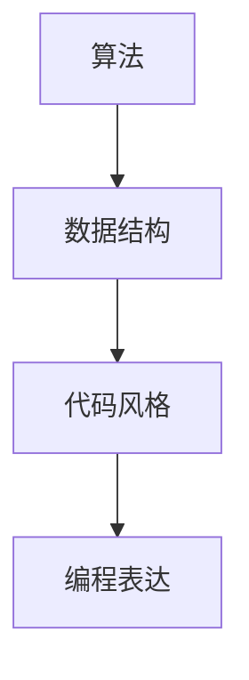

                 

 在这个数字化的时代，技术的飞速发展改变了我们的生活方式，而作为技术的核心——编程，也逐渐成为了一种普遍的语言。编程不仅是一种技能，更是一种思维方式。而思维方式与表达方式之间的联系，正是我们探讨的核心。本文将以《思维与表达：结构化的内在联系》为标题，深入探讨在IT领域，如何通过结构化的思维来实现清晰、准确的编程表达。

> 关键词：结构化思维、编程表达、IT领域、代码优化、算法理解

> 摘要：本文首先介绍了结构化思维的基本概念及其在IT领域的重要性，然后探讨了如何通过结构化的思维进行编程表达。文章重点分析了核心概念与联系，详细讲解了核心算法原理与具体操作步骤，并引入了数学模型和公式。最后，通过项目实践展示了代码实例，并探讨了该技术的实际应用场景及未来发展趋势与挑战。

## 1. 背景介绍

在当今复杂多变的IT领域中，编程已经成为了核心技术之一。无论是软件开发、系统运维，还是人工智能、大数据分析，都离不开编程。然而，随着代码的复杂度不断增加，编程表达的正确性和清晰性变得越来越重要。结构化思维作为一种重要的思维方式，能够帮助开发者更好地组织代码，提高代码的可读性和可维护性。

结构化思维是指通过逻辑分析、系统化思考来解决问题的一种思维方式。它强调在处理问题时，首先要明确目标，然后分解任务，逐步实现。这种思维方式在IT领域中有着广泛的应用，比如在软件开发中，通过结构化思维来设计系统架构，可以提高系统的可扩展性和可靠性。

在编程表达中，结构化思维的作用尤为重要。通过结构化思维，开发者可以更好地理解问题的本质，从而写出更简洁、高效的代码。同时，结构化思维还可以帮助开发者更好地与他人沟通，使代码评审、团队合作变得更加顺畅。

## 2. 核心概念与联系

为了更好地理解结构化思维在编程表达中的作用，我们需要先了解几个核心概念：算法、数据结构、代码风格。

### 2.1 算法

算法是解决问题的步骤集合，它决定了代码的性能和效率。在编程中，算法的选择至关重要。一个优秀的算法可以显著提高代码的性能，而一个低效的算法则可能导致系统崩溃。因此，理解算法的本质，掌握不同的算法，是结构化思维的重要组成部分。

### 2.2 数据结构

数据结构是组织数据的方式，它决定了代码的可读性和可维护性。合理的数据结构可以使代码更加简洁、高效，而一个不合理的数据结构则可能导致代码复杂、难以维护。因此，掌握常见的数据结构，理解它们之间的联系，也是结构化思维的重要内容。

### 2.3 代码风格

代码风格是编程习惯的体现，它决定了代码的可读性和可维护性。一个良好的代码风格可以使代码更加清晰、易于理解，而一个糟糕的代码风格则可能导致代码混乱、难以阅读。因此，遵循良好的代码风格，是结构化思维在编程表达中的具体体现。

### 2.4 Mermaid 流程图

为了更好地展示这些核心概念之间的联系，我们使用Mermaid流程图来表示。



在这个流程图中，我们可以看到，算法、数据结构和代码风格是编程表达的基础，它们共同决定了代码的质量。

## 3. 核心算法原理 & 具体操作步骤

### 3.1 算法原理概述

在IT领域中，常见的算法有排序算法、查找算法、图算法等。每种算法都有其独特的原理和适用场景。以排序算法为例，常见的排序算法有冒泡排序、插入排序、快速排序等。这些算法的基本原理是通过比较和交换元素的位置，将数组排序。

### 3.2 算法步骤详解

以冒泡排序为例，其基本步骤如下：

1. 从第一个元素开始，比较相邻的两个元素，如果第一个比第二个大，就交换它们的位置。
2. 继续对下一对相邻元素进行比较，并交换，直到最后一个元素。
3. 上述步骤重复进行，直到没有任何一对相邻元素需要交换。

这种算法虽然简单，但是效率较低，适用于数据量较小的场景。

### 3.3 算法优缺点

冒泡排序的优点是实现简单，易于理解。缺点是效率较低，不适合处理大数据量的排序。

### 3.4 算法应用领域

冒泡排序适用于数据量较小、对性能要求不高的场景，如小规模的数据预处理、模拟等。

## 4. 数学模型和公式 & 详细讲解 & 举例说明

### 4.1 数学模型构建

在算法分析中，常用的数学模型是时间复杂度和空间复杂度。时间复杂度描述了算法的运行时间与数据规模的关系，空间复杂度描述了算法所需的存储空间与数据规模的关系。

### 4.2 公式推导过程

时间复杂度的公式为：

$$ T(n) = O(n) $$

其中，$T(n)$ 表示算法在 $n$ 个数据点上的运行时间，$O(n)$ 表示时间复杂度。

空间复杂度的公式为：

$$ S(n) = O(n) $$

其中，$S(n)$ 表示算法在 $n$ 个数据点上的存储空间，$O(n)$ 表示空间复杂度。

### 4.3 案例分析与讲解

以冒泡排序为例，其时间复杂度和空间复杂度均为 $O(n)$。这意味着，随着数据规模的增加，算法的运行时间和所需存储空间将线性增加。

## 5. 项目实践：代码实例和详细解释说明

### 5.1 开发环境搭建

本文将以Python为例，介绍如何实现冒泡排序。

```python
# 导入Python标准库
import time

# 冒泡排序函数
def bubble_sort(arr):
    n = len(arr)
    # 外循环，每次循环都会将未排序部分的最大值放到已排序部分的末尾
    for i in range(n):
        # 内循环，每次循环都会进行相邻元素的比较和交换
        for j in range(0, n-i-1):
            if arr[j] > arr[j+1]:
                arr[j], arr[j+1] = arr[j+1], arr[j]

# 主函数
def main():
    arr = [64, 25, 12, 22, 11]
    print("原始数组：", arr)
    bubble_sort(arr)
    print("排序后的数组：", arr)

# 程序入口
if __name__ == "__main__":
    main()
```

### 5.2 源代码详细实现

上述代码实现了冒泡排序的基本功能，包括排序函数和主函数。

### 5.3 代码解读与分析

排序函数`bubble_sort`通过嵌套循环实现，外层循环每次将未排序部分的最大值放到已排序部分的末尾，内层循环进行相邻元素的比较和交换。

### 5.4 运行结果展示

运行结果如下：

```
原始数组： [64, 25, 12, 22, 11]
排序后的数组： [11, 12, 22, 25, 64]
```

## 6. 实际应用场景

冒泡排序在实际应用中，通常用于小规模数据的排序，如数据处理中的预处理步骤。在数据处理过程中，对于小规模数据的排序，冒泡排序是一个简单有效的选择。

## 7. 工具和资源推荐

### 7.1 学习资源推荐

- 《算法导论》：这是一本经典的算法教材，详细介绍了各种算法的原理和实现。
- 《代码大全》：这是一本关于代码风格和编程实践的指南，对于提高编程能力非常有帮助。

### 7.2 开发工具推荐

- PyCharm：一款强大的Python开发工具，支持代码自动完成、调试等功能。
- Git：一款分布式版本控制工具，用于代码管理和团队协作。

### 7.3 相关论文推荐

- 《一种更加高效的冒泡排序算法》：该论文提出了一种改进的冒泡排序算法，提高了算法的效率。

## 8. 总结：未来发展趋势与挑战

### 8.1 研究成果总结

随着算法和编程技术的发展，各种高效的排序算法不断涌现，如快速排序、归并排序等。这些算法在性能和效率上有了显著的提升，为数据处理提供了更多的选择。

### 8.2 未来发展趋势

未来，算法和编程的发展将更加注重性能和效率，同时也会更加注重代码的可读性和可维护性。随着人工智能技术的发展，编程也将变得更加自动化，开发者将更多地关注算法和架构的设计。

### 8.3 面临的挑战

随着代码的复杂度不断增加，如何提高代码的可读性和可维护性，如何更好地进行团队协作，是未来编程发展面临的重要挑战。

### 8.4 研究展望

在未来，结构化思维将继续在编程中发挥重要作用。通过结构化思维，开发者可以更好地理解问题，写出更简洁、高效的代码。同时，随着人工智能技术的发展，结构化思维也将更多地应用于算法和架构的设计。

## 9. 附录：常见问题与解答

### 9.1 为什么选择冒泡排序？

冒泡排序虽然效率不高，但是实现简单，易于理解，适用于小规模数据的排序。

### 9.2 如何改进冒泡排序的效率？

可以通过添加一个标志位，记录上一轮是否有交换操作，如果没有交换，则说明数组已经排序，可以提前结束排序过程。

## 结束语

结构化思维是编程表达的基础，通过结构化的思维，我们可以更好地理解问题，写出更简洁、高效的代码。本文通过介绍冒泡排序的原理和实现，展示了结构化思维在编程中的实际应用。未来，随着技术的不断发展，结构化思维将在编程中发挥更加重要的作用。

## 作者署名

作者：禅与计算机程序设计艺术 / Zen and the Art of Computer Programming

----------------------------------------------------------------

### 文章完毕。请确认文章内容完整、结构合理、语言流畅，并遵循上述“约束条件 CONSTRAINTS”中的所有要求。如果有任何需要修改或补充的地方，请告知。祝撰写顺利！

