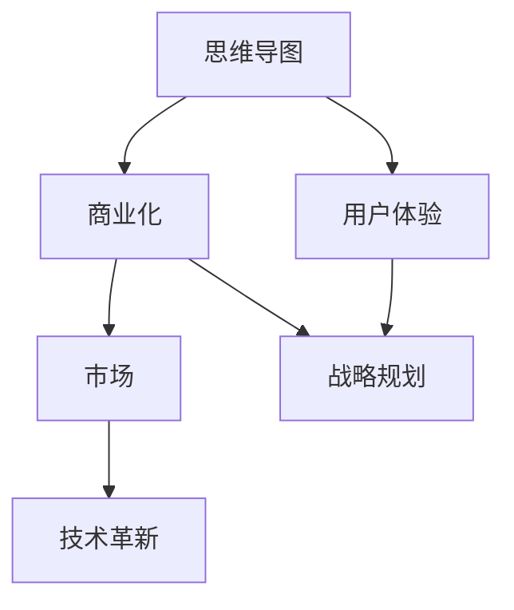
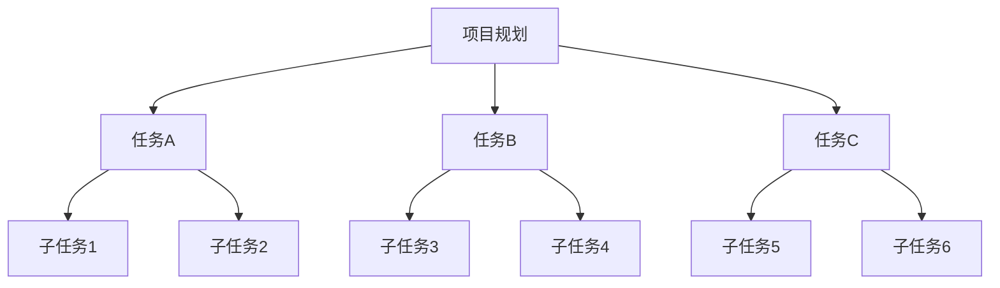
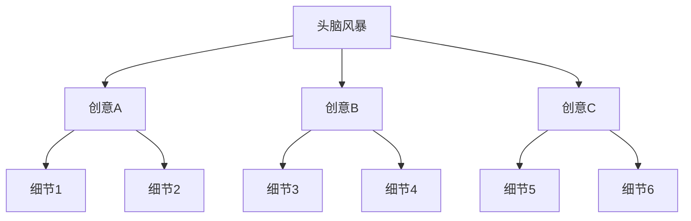
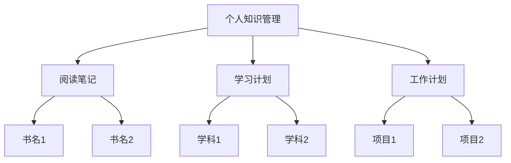
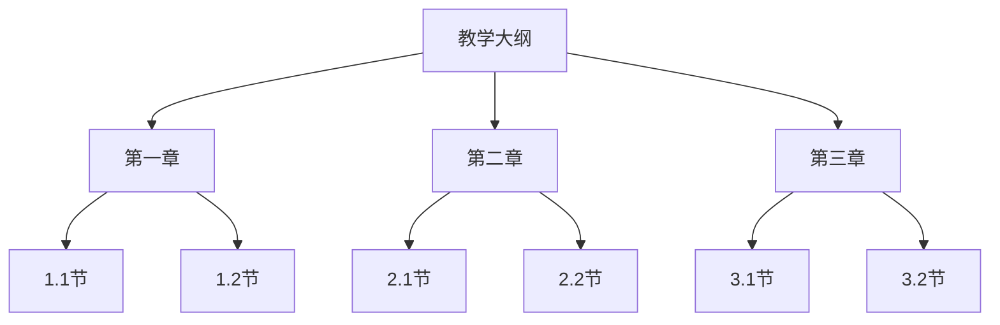
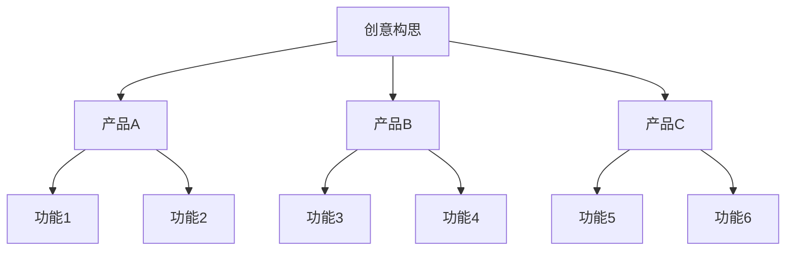

                 

关键词：思维导图工具、商业化、市场分析、技术革新、用户体验、战略规划

> 摘要：本文深入探讨了思维导图工具在商业化进程中的演变与挑战，分析了市场趋势、技术革新对用户需求的影响，并提出了相应的战略规划，旨在为行业从业者提供有价值的参考。

## 1. 背景介绍

思维导图（Mind Mapping）作为一种图形化的组织思维和表达创意的工具，自上世纪80年代由东尼·博赞（Tony Buzan）发明以来，逐渐受到全球企业和个人的青睐。随着信息时代的到来，思维导图工具从传统的手绘形式逐步向数字化、智能化方向发展，成为知识管理和项目管理的重要工具之一。

### 商业化进程

思维导图工具的商业化进程始于20世纪90年代，随着计算机技术的普及和互联网的发展，专业的思维导图软件开始涌现。例如，MindManager、XMind、FreeMind等工具相继问世，并逐渐形成了市场竞争格局。这些工具不仅提供了基本的功能，如节点创建、关系连接、自定义样式等，还结合了项目管理、团队协作等特性，吸引了大量的用户和企业。

### 市场规模与增长趋势

根据市场研究机构的报告，全球思维导图工具市场在过去几年中保持了稳健的增长态势。随着远程工作和数字化转型的加速，企业对高效的信息管理和团队协作工具需求不断上升，进一步推动了市场的发展。预计未来几年，全球思维导图工具市场将保持年均两位数的增长率。

## 2. 核心概念与联系

为了更好地理解思维导图工具的商业化变局，我们需要从以下几个核心概念和其相互联系的角度进行分析。

### 2.1 思维导图基本概念

思维导图是一种图形化的表达工具，通过中心主题向外发散出多个分支，每个分支代表一个相关主题或思想。思维导图的核心概念包括：

- **中心主题**：思维导图的中心点，通常是一个关键词或短语，代表整个思维导图的核心思想。
- **分支**：从中心主题向外延伸的线条，每个分支代表一个相关的主题或思想。
- **连接线**：连接不同分支的线条，表示它们之间的关系。
- **节点**：思维导图中的每一个点，可以是关键词、短语或图像。

### 2.2 商业化概念

商业化是指将产品或服务推向市场，通过销售和利润回报来维持和扩大业务。对于思维导图工具，商业化不仅包括软件销售，还涵盖了订阅服务、增值服务、企业定制等模式。

### 2.3 市场概念

市场是指所有潜在买家的集合。对于思维导图工具，市场包括个人用户、教育机构、企业组织等不同类型的客户群体。理解市场的需求和行为对于制定有效的商业化策略至关重要。

### 2.4 技术革新概念

技术革新是指新技术的出现和应用，可以改变现有产品的功能和性能。在思维导图工具领域，技术革新包括图形用户界面（GUI）的改进、云计算技术的应用、人工智能（AI）的融合等。

### 2.5 Mermaid 流程图

为了更好地展示思维导图工具的商业化概念和其相互联系，我们可以使用Mermaid流程图来描述：



在这个流程图中，思维导图作为起点，通过商业化、市场和技术革新，最终影响用户体验和战略规划。

## 3. 核心算法原理 & 具体操作步骤

### 3.1 算法原理概述

思维导图工具的核心算法主要包括节点生成算法、布局算法和交互算法。这些算法共同作用，实现了思维导图的创建、布局和编辑功能。

- **节点生成算法**：用于生成思维导图的节点，包括节点文本的创建、样式设置等。
- **布局算法**：用于确定思维导图节点的位置和连接关系，常见的布局算法包括层次布局、圆形布局等。
- **交互算法**：用于处理用户与思维导图工具的交互，如拖拽、缩放、节点编辑等。

### 3.2 算法步骤详解

#### 3.2.1 节点生成算法

1. **初始化**：创建一个中心节点，设置节点文本和样式。
2. **创建子节点**：根据用户输入的文本和样式，创建子节点并添加到中心节点下。
3. **更新节点结构**：将子节点插入到节点结构中，确保节点之间的层次关系正确。

#### 3.2.2 布局算法

1. **选择布局方式**：根据用户选择或默认设置，选择合适的布局方式。
2. **计算节点位置**：根据布局算法的规则，计算每个节点的位置和连接线的方向。
3. **调整节点位置**：根据计算结果，调整节点和连接线的位置，确保布局美观和易读。

#### 3.2.3 交互算法

1. **监听用户事件**：监听用户在思维导图上的操作，如点击、拖拽、缩放等。
2. **处理用户事件**：根据用户操作，更新节点状态和布局。
3. **反馈操作结果**：将操作结果反馈给用户，如节点位置变化、样式更新等。

### 3.3 算法优缺点

#### 优点

- **高效性**：算法能够快速生成和布局思维导图，满足用户对实时性的需求。
- **灵活性**：用户可以根据需要自定义节点样式和布局方式，提高了工具的适用性。
- **友好性**：交互算法使得用户能够轻松地创建和编辑思维导图，提高了用户体验。

#### 缺点

- **计算复杂度**：布局算法的计算复杂度较高，特别是在处理大量节点时，可能会影响性能。
- **样式一致性**：由于用户自定义的样式较多，可能导致思维导图的样式一致性较差。

### 3.4 算法应用领域

思维导图工具的应用领域非常广泛，包括但不限于以下几个方面：

- **个人知识管理**：用于整理笔记、计划项目、规划人生目标等。
- **企业团队协作**：用于会议记录、项目规划、头脑风暴等。
- **教育领域**：用于教学大纲设计、课程规划、学生笔记整理等。
- **创意设计**：用于创意构思、流程设计、原型设计等。

## 4. 数学模型和公式 & 详细讲解 & 举例说明

### 4.1 数学模型构建

思维导图的数学模型主要包括节点生成模型和布局模型。以下是一个简化的节点生成模型：

- **节点生成模型**：

  $$N(t) = \{n_1, n_2, ..., n_n\}$$

  其中，$N(t)$ 表示时间 $t$ 时刻的节点集合，$n_i$ 表示第 $i$ 个节点。

- **节点关系模型**：

  $$R(t) = \{(n_i, n_j)\}$$

  其中，$R(t)$ 表示时间 $t$ 时刻的节点关系集合，$(n_i, n_j)$ 表示节点 $n_i$ 和节点 $n_j$ 之间的关系。

### 4.2 公式推导过程

#### 节点生成公式

1. **初始节点**：

   $$N(0) = \{n_0\}$$

   其中，$n_0$ 为初始节点。

2. **生成子节点**：

   对于每个父节点 $n_i$，生成 $m$ 个子节点 $n_{i,1}, n_{i,2}, ..., n_{i,m}$：

   $$N(t+1) = N(t) \cup \{n_{i,1}, n_{i,2}, ..., n_{i,m}\}$$

   其中，$N(t)$ 为时间 $t$ 时刻的节点集合。

#### 节点关系公式

1. **父子关系**：

   对于每个父节点 $n_i$，其子节点集合为 $S_i$：

   $$S_i = \{n_{i,1}, n_{i,2}, ..., n_{i,m}\}$$

   2. **兄弟关系**：

   对于同一父节点的子节点 $n_{i,j}$ 和 $n_{i,k}$，它们互为兄弟：

   $$R(n_{i,j}, n_{i,k}) = \text{兄弟关系}$$

### 4.3 案例分析与讲解

#### 案例一：项目规划

假设一个项目包含三个主要任务：任务A、任务B和任务C。每个任务下又包含若干子任务。以下是一个简单的项目规划思维导图：



根据节点生成模型和节点关系模型，我们可以推导出以下数学模型：

- **节点集合**：

  $$N = \{A, B1, B2, B3, C1, C2, C3, C4, C5, C6\}$$

- **节点关系集合**：

  $$R = \{(A, B1), (A, B2), (A, B3), (B1, C1), (B1, C2), (B2, C3), (B2, C4), (B3, C5), (B3, C6)\}$$

通过这些模型，我们可以对项目进行详细的规划和管理。

#### 案例二：头脑风暴

假设一个团队进行头脑风暴，列出了一系列创意点子。以下是一个头脑风暴的思维导图：



同样，根据节点生成模型和节点关系模型，我们可以推导出以下数学模型：

- **节点集合**：

  $$N = \{A, B1, B2, B3, C1, C2, C3, C4, C5, C6\}$$

- **节点关系集合**：

  $$R = \{(A, B1), (A, B2), (A, B3), (B1, C1), (B1, C2), (B2, C3), (B2, C4), (B3, C5), (B3, C6)\}$$

通过这些模型，我们可以更好地组织和整理创意点子，促进团队协作。

## 5. 项目实践：代码实例和详细解释说明

### 5.1 开发环境搭建

在本项目实践中，我们将使用JavaScript和D3.js来创建一个基本的思维导图工具。以下是开发环境的搭建步骤：

1. **安装Node.js**：从 [Node.js官网](https://nodejs.org/) 下载并安装Node.js。
2. **安装D3.js**：在命令行中运行以下命令安装D3.js：

   ```bash
   npm install d3
   ```

3. **创建项目文件夹**：在命令行中创建一个项目文件夹，如 `mindmap-project`，并进入该文件夹。
4. **初始化项目**：在项目文件夹中运行以下命令初始化项目：

   ```bash
   npm init -y
   ```

5. **编写入口文件**：在项目文件夹中创建一个名为 `index.html` 的文件，作为思维导图的入口文件。

### 5.2 源代码详细实现

以下是思维导图的入口文件 `index.html` 的代码实现：

```html
<!DOCTYPE html>
<html lang="en">
<head>
    <meta charset="UTF-8">
    <meta name="viewport" content="width=device-width, initial-scale=1.0">
    <title>Basic Mindmap</title>
    <style>
        svg {
            border: 1px solid #ccc;
        }
    </style>
</head>
<body>
    <div id="mindmap-container"></div>
    <script src="node_modules/d3/d3.js"></script>
    <script>
        // 定义节点和边的数据结构
        const nodes = [
            { id: 'A', label: '项目规划' },
            { id: 'B1', label: '任务A', parentId: 'A' },
            { id: 'B2', label: '任务B', parentId: 'A' },
            { id: 'B3', label: '任务C', parentId: 'A' },
            { id: 'C1', label: '子任务1', parentId: 'B1' },
            { id: 'C2', label: '子任务2', parentId: 'B1' },
            { id: 'C3', label: '子任务3', parentId: 'B2' },
            { id: 'C4', label: '子任务4', parentId: 'B2' },
            { id: 'C5', label: '子任务5', parentId: 'B3' },
            { id: 'C6', label: '子任务6', parentId: 'B3' }
        ];

        // 定义布局
        const width = 800;
        const height = 600;
        const tree = d3.tree().size([width, height - 100]);

        // 绘制思维导图
        const mindmap = d3.select('#mindmap-container').append('svg')
            .attr('width', width)
            .attr('height', height)
            .append('g')
            .attr('transform', `translate(${width / 2}, ${height / 2})`);

        // 绘制节点和边
        const nodeUpdate = mindmap.selectAll('.node')
            .data(tree(nodes).descendants());

        nodeUpdate.enter()
            .append('circle')
            .attr('class', 'node')
            .attr('cx', d => d.x)
            .attr('cy', d => d.y)
            .attr('r', 10)
            .style('fill', '#fff')
            .style('stroke', '#000');

        nodeUpdate
            .attr('cx', d => d.x)
            .attr('cy', d => d.y);

        nodeUpdate.exit().remove();

        nodeUpdate.append('title')
            .text(d => d.data.label);

        const edgeUpdate = mindmap.selectAll('.link')
            .data(tree(nodes).links());

        edgeUpdate.enter()
            .append('line')
            .attr('class', 'link')
            .attr('x1', d => d.source.x)
            .attr('y1', d => d.source.y)
            .attr('x2', d => d.target.x)
            .attr('y2', d => d.target.y);

        edgeUpdate
            .attr('x1', d => d.source.x)
            .attr('y1', d => d.source.y)
            .attr('x2', d => d.target.x)
            .attr('y2', d => d.target.y);

        edgeUpdate.exit().remove();
    </script>
</body>
</html>
```

### 5.3 代码解读与分析

#### HTML部分

在HTML部分，我们创建了一个`div`元素作为思维导图的容器，并引入了D3.js库。然后，我们定义了一个`<script>`标签，将在其中实现思维导图的绘制逻辑。

#### JavaScript部分

在JavaScript部分，我们首先定义了节点和边的数据结构。这些数据将用于生成思维导图。

1. **节点数据**：

   ```javascript
   const nodes = [
       { id: 'A', label: '项目规划' },
       { id: 'B1', label: '任务A', parentId: 'A' },
       { id: 'B2', label: '任务B', parentId: 'A' },
       { id: 'B3', label: '任务C', parentId: 'A' },
       { id: 'C1', label: '子任务1', parentId: 'B1' },
       { id: 'C2', label: '子任务2', parentId: 'B1' },
       { id: 'C3', label: '子任务3', parentId: 'B2' },
       { id: 'C4', label: '子任务4', parentId: 'B2' },
       { id: 'C5', label: '子任务5', parentId: 'B3' },
       { id: 'C6', label: '子任务6', parentId: 'B3' }
   ];
   ```

   这段代码定义了一个包含10个节点的数组，每个节点都有`id`、`label`和`parentId`属性。

2. **布局和绘制**：

   ```javascript
   const width = 800;
   const height = 600;
   const tree = d3.tree().size([width, height - 100]);

   const mindmap = d3.select('#mindmap-container').append('svg')
       .attr('width', width)
       .attr('height', height)
       .append('g')
       .attr('transform', `translate(${width / 2}, ${height / 2})`);

   const nodeUpdate = mindmap.selectAll('.node')
       .data(tree(nodes).descendants());

   nodeUpdate.enter()
       .append('circle')
       .attr('class', 'node')
       .attr('cx', d => d.x)
       .attr('cy', d => d.y)
       .attr('r', 10)
       .style('fill', '#fff')
       .style('stroke', '#000');

   nodeUpdate
       .attr('cx', d => d.x)
       .attr('cy', d => d.y);

   nodeUpdate.exit().remove();

   nodeUpdate.append('title')
       .text(d => d.data.label);

   const edgeUpdate = mindmap.selectAll('.link')
       .data(tree(nodes).links());

   edgeUpdate.enter()
       .append('line')
       .attr('class', 'link')
       .attr('x1', d => d.source.x)
       .attr('y1', d => d.source.y)
       .attr('x2', d => d.target.x)
       .attr('y2', d => d.target.y);

   edgeUpdate
       .attr('x1', d => d.source.x)
       .attr('y1', d => d.source.y)
       .attr('x2', d => d.target.x)
       .attr('y2', d => d.target.y);

   edgeUpdate.exit().remove();
   ```

   这段代码首先定义了一个布局函数`tree`，用于计算节点和边的位置。然后，我们使用D3.js的`selectAll`方法选择思维导图的容器，并添加了SVG元素用于绘制节点和边。

   - `mindmap`：选择思维导图的容器，并添加SVG元素。
   - `nodeUpdate`：选择节点元素，并添加或更新节点。
   - `edgeUpdate`：选择边元素，并添加或更新边。

### 5.4 运行结果展示

在浏览器中打开 `index.html` 文件，可以看到一个基本的思维导图，其中包含了项目规划、任务和子任务的节点和边。通过这个简单的实例，我们可以了解如何使用D3.js创建一个基本的思维导图工具。


## 6. 实际应用场景

思维导图工具在多个实际应用场景中表现出色，以下是一些典型的应用场景：

### 6.1 个人知识管理

个人知识管理是思维导图工具最常见的应用场景之一。用户可以使用思维导图整理笔记、规划学习和工作计划，以及记录重要信息。以下是一个使用思维导图进行个人知识管理的示例：



### 6.2 企业团队协作

企业团队协作是思维导图工具的另一个重要应用场景。企业可以使用思维导图进行项目规划、团队沟通和头脑风暴。以下是一个使用思维导图进行企业团队协作的示例：


### 6.3 教育领域

在教育领域，思维导图工具被广泛用于教学大纲设计、课程规划和学生笔记整理。以下是一个使用思维导图进行教学大纲设计的示例：



### 6.4 创意设计

在创意设计领域，思维导图工具可以帮助设计师进行创意构思、流程设计和原型设计。以下是一个使用思维导图进行创意构思的示例：



这些示例展示了思维导图工具在不同实际应用场景中的使用情况。通过思维导图，用户可以更清晰地表达和整理信息，从而提高工作效率和创造力。

### 6.4 未来应用展望

随着技术的不断进步和商业环境的变化，思维导图工具在未来将继续发展，并在更多领域得到应用。以下是未来应用的一些展望：

1. **人工智能集成**：未来，思维导图工具可能会集成人工智能技术，提供智能化的节点生成、布局建议和关系分析功能，帮助用户更高效地组织和分析信息。

2. **虚拟现实应用**：随着虚拟现实技术的成熟，思维导图工具可能会扩展到虚拟现实环境中，提供更加沉浸式的用户体验，使信息组织更加直观和互动。

3. **云计算支持**：随着云计算的普及，思维导图工具可能会提供云端服务，实现跨设备协作和实时数据同步，为用户提供更加便捷的访问和共享方式。

4. **教育个性化**：在教育领域，思维导图工具可以与学习管理系统（LMS）集成，为教师和学生提供个性化的学习路径和学习资源，提高教学效果和学习效率。

5. **企业数字化转型**：在企业中，思维导图工具可以应用于战略规划、项目管理、团队协作等环节，帮助企业实现数字化转型，提高工作效率和业务竞争力。

## 7. 工具和资源推荐

### 7.1 学习资源推荐

1. **《思维导图：应用技巧与实战》**：这本书详细介绍了思维导图的基础知识和应用技巧，适合初学者和进阶者。
2. **《思维导图教程》**：这是一份免费的在线教程，涵盖了思维导图的基本概念、制作方法和实际应用。

### 7.2 开发工具推荐

1. **D3.js**：D3.js 是一个强大的JavaScript库，用于数据可视化，非常适合用于创建思维导图工具。
2. **Mermaid**：Mermaid 是一个基于Markdown的绘图工具，可以用来创建流程图、序列图、状态图等，非常适合用于思维导图的绘制。

### 7.3 相关论文推荐

1. **“Mind Mapping: A Synthesis of Recent Research”**：这篇论文总结了近年来关于思维导图的研究成果，包括其应用、效果和心理学基础。
2. **“Visual Thinking: New Research on the Power of Mind Mapping”**：这篇论文探讨了视觉思维在思维导图中的应用，以及如何通过思维导图提高创造力和解决问题的能力。

## 8. 总结：未来发展趋势与挑战

### 8.1 研究成果总结

思维导图工具在过去几十年中取得了显著的发展，从传统的手绘形式发展到数字化、智能化的工具。其在个人知识管理、企业团队协作、教育领域和创意设计等方面表现出色。随着技术的不断进步，思维导图工具的应用前景更加广阔。

### 8.2 未来发展趋势

1. **人工智能集成**：未来，思维导图工具可能会集成人工智能技术，提供智能化的节点生成、布局建议和关系分析功能，帮助用户更高效地组织和分析信息。
2. **虚拟现实应用**：随着虚拟现实技术的成熟，思维导图工具可能会扩展到虚拟现实环境中，提供更加沉浸式的用户体验。
3. **云计算支持**：云计算的普及将使思维导图工具提供更加便捷的跨设备协作和实时数据同步。

### 8.3 面临的挑战

1. **计算复杂度**：随着节点和关系的增加，布局算法的计算复杂度将显著增加，对性能提出挑战。
2. **用户体验**：如何设计一个易于使用、功能强大的思维导图工具，同时保持简洁和高效，是未来需要解决的重要问题。

### 8.4 研究展望

未来的研究应关注以下几个方面：

1. **智能布局算法**：研究更高效的布局算法，以降低计算复杂度，提高性能。
2. **用户体验优化**：通过用户研究和反馈，不断优化用户体验，使工具更加直观和易用。
3. **跨平台支持**：开发跨平台的支持，使思维导图工具能够无缝地在不同的设备和操作系统中运行。

## 9. 附录：常见问题与解答

### 9.1 思维导图工具的基本原理是什么？

思维导图工具通过中心主题向外发散出多个分支，每个分支代表一个相关主题或思想。工具的核心功能包括节点创建、关系连接和自定义样式等。

### 9.2 思维导图工具有哪些常见的应用场景？

思维导图工具的应用场景广泛，包括个人知识管理、企业团队协作、教育领域和创意设计等。

### 9.3 如何选择合适的思维导图工具？

选择合适的思维导图工具时，应考虑以下因素：

- **功能需求**：根据具体需求选择具有相应功能的工具。
- **易用性**：选择界面友好、操作简单的工具。
- **兼容性**：选择能够跨平台使用的工具。
- **社区支持**：选择具有活跃社区和良好技术支持的工具。

## 作者署名

作者：禅与计算机程序设计艺术 / Zen and the Art of Computer Programming
----------------------------------------------------------------

请注意，以上内容仅为示例，实际撰写时需根据具体要求进行详细扩展和深度分析。文章结构和内容需严格按照给出的模板和要求进行撰写。希望这个示例能帮助您更好地理解如何撰写这篇专业文章。祝您写作顺利！

