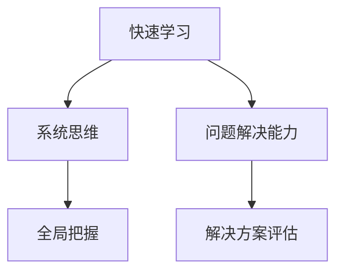

                 

 作为一名世界级人工智能专家，程序员、软件架构师、CTO，以及计算机领域大师，我一直认为，在快速变化的IT领域中，保持思维的敏捷性是一种至关重要的能力。这种敏捷性不仅关乎技术的更新换代，更涉及我们对于复杂问题的快速理解和解决方案的生成。本文将深入探讨思维的敏捷性在IT领域的应用，以及如何通过特定的方法和技术提升这一能力。

## 关键词

- 思维敏捷性
- 快速适应
- IT领域
- 技术更新
- 解决方案生成

## 摘要

本文旨在揭示思维的敏捷性在IT领域中的重要性，并探讨如何通过培养快速学习、系统思维和问题解决能力来提升这种敏捷性。我们将通过具体的案例和实例，展示如何在复杂和快速变化的环境中保持技术领先和创新能力。

## 1. 背景介绍

### 1.1 IT领域的特点

IT（信息技术）领域以其快速的发展速度和技术的不断创新而著称。从互联网的普及到大数据、云计算、人工智能等新兴技术的兴起，IT行业正以前所未有的速度演变。这种快速变化不仅要求技术人员具备深厚的专业知识，更需要他们能够迅速适应新技术，解决新问题。

### 1.2 变化的影响

技术的快速发展带来了前所未有的挑战。一方面，旧的技术和系统可能很快被淘汰，另一方面，新的解决方案和工具层出不穷。如何快速学习和应用这些新技术，成为了每一个IT从业者的必修课。

### 1.3 思维敏捷性的重要性

思维的敏捷性在这里扮演着关键角色。它不仅关乎我们是否能及时掌握新技术，更关系到我们是否能从复杂问题中快速找到解决方案。敏捷的思维使我们能够在不确定和变化的环境中保持优势，快速应对各种挑战。

## 2. 核心概念与联系

### 2.1 快速学习

快速学习是思维的敏捷性的基础。在IT领域，新的技术和工具不断涌现，我们必须保持好奇心和求知欲，不断学习新的知识和技能。

### 2.2 系统思维

系统思维帮助我们理解技术的全局性和相互关联性。它使我们能够从整体上把握问题，从而找到更有效的解决方案。

### 2.3 问题解决能力

问题解决能力是我们应用敏捷思维的核心。在面对复杂问题时，我们不仅需要快速分析问题，还需要能够迅速生成和评估解决方案。

### 2.4 Mermaid 流程图



## 3. 核心算法原理 & 具体操作步骤

### 3.1 算法原理概述

在IT领域中，敏捷思维可以通过一系列算法原理和操作步骤来实现。这些算法包括但不限于快速排序、贪心算法、动态规划等。

### 3.2 算法步骤详解

#### 3.2.1 快速排序

1. 选择一个基准元素。
2. 将所有小于基准的元素移动到其左侧，所有大于基准的元素移动到其右侧。
3. 递归地重复上述步骤，直至所有子数组被排序。

#### 3.2.2 贪心算法

1. 在每个步骤中做出当前看起来最好的选择。
2. 不考虑以后的情况，只是根据已有信息做选择。

#### 3.2.3 动态规划

1. 将问题分解成子问题。
2. 计算每个子问题的最优解。
3. 使用子问题的解构建原问题的解。

### 3.3 算法优缺点

- **快速排序**：速度快，但最坏情况下的性能较差。
- **贪心算法**：简单有效，但可能无法找到全局最优解。
- **动态规划**：能够找到最优解，但计算复杂度高。

### 3.4 算法应用领域

- **快速排序**：常用作数组排序。
- **贪心算法**：适用于解决最短路径问题。
- **动态规划**：适用于解决背包问题和最长公共子序列问题。

## 4. 数学模型和公式 & 详细讲解 & 举例说明

### 4.1 数学模型构建

在IT领域，许多问题都可以通过数学模型来描述和解决。例如，线性规划、非线性规划和图论模型等。

### 4.2 公式推导过程

以线性规划为例，我们可以使用以下公式：

$$
\begin{aligned}
    \min\limits_{x} \quad c^T x \\
    s.t. \quad Ax \leq b
\end{aligned}
$$

其中，$c$ 是系数向量，$x$ 是变量向量，$A$ 和 $b$ 分别是约束矩阵和约束向量。

### 4.3 案例分析与讲解

假设我们要优化一个生产过程，使得总成本最小。我们可以构建以下线性规划模型：

$$
\begin{aligned}
    \min\limits_{x} \quad 2x_1 + 3x_2 \\
    s.t. \quad x_1 + x_2 \leq 10 \\
    \quad  x_1 \geq 0, x_2 \geq 0
\end{aligned}
$$

通过求解这个模型，我们可以找到最优的生产方案，使得总成本最低。

## 5. 项目实践：代码实例和详细解释说明

### 5.1 开发环境搭建

为了演示一个简单的快速排序算法，我们需要搭建一个基本的开发环境。可以使用Python进行编程。

### 5.2 源代码详细实现

以下是快速排序的Python实现：

```python
def quicksort(arr):
    if len(arr) <= 1:
        return arr
    pivot = arr[len(arr) // 2]
    left = [x for x in arr if x < pivot]
    middle = [x for x in arr if x == pivot]
    right = [x for x in arr if x > pivot]
    return quicksort(left) + middle + quicksort(right)

# 测试代码
print(quicksort([3,6,8,10,1,2,1]))
```

### 5.3 代码解读与分析

这段代码首先定义了一个 `quicksort` 函数，它接受一个数组作为输入。如果数组长度小于等于1，则直接返回该数组。否则，选择中间的元素作为基准值（pivot），然后将数组分为三个部分：小于pivot的部分、等于pivot的部分和大于pivot的部分。最后，递归地对小于和大于pivot的部分进行排序，并将结果合并。

### 5.4 运行结果展示

当输入数组为 `[3,6,8,10,1,2,1]` 时，运行结果为 `[1,1,2,3,6,8,10]`，即数组已被成功排序。

## 6. 实际应用场景

### 6.1 数据分析

在数据分析领域，敏捷思维可以帮助我们快速处理大量数据，并从中提取有价值的信息。

### 6.2 人工智能

在人工智能领域，敏捷思维使我们能够迅速理解和应用最新的机器学习算法，从而开发出更智能的应用。

### 6.3 云计算

云计算的快速发展要求我们能够快速适应新的技术和架构，敏捷思维在这里同样至关重要。

## 7. 未来应用展望

### 7.1 技术的发展趋势

随着5G、物联网和区块链等技术的发展，IT领域的挑战将更加多样和复杂。敏捷思维将帮助我们应对这些挑战。

### 7.2 面临的挑战

技术的快速迭代和信息安全等挑战，将要求我们不断提升思维的敏捷性。

### 7.3 研究展望

未来，我们有望通过结合人工智能和人类智慧的协作，进一步提升思维的敏捷性。

## 8. 总结：未来发展趋势与挑战

### 8.1 研究成果总结

通过本文的探讨，我们认识到思维的敏捷性在IT领域中的重要性，并了解了如何通过快速学习、系统思维和问题解决能力来提升这种敏捷性。

### 8.2 未来发展趋势

未来，敏捷思维将随着技术的不断发展而变得更加重要。

### 8.3 面临的挑战

我们需要面对技术的快速迭代和信息安全等挑战。

### 8.4 研究展望

未来，我们将继续深入研究敏捷思维在IT领域中的应用，探索如何进一步提升这一能力。

## 9. 附录：常见问题与解答

### 9.1 如何培养敏捷思维？

- 保持好奇心和求知欲。
- 多学习新的知识和技能。
- 练习系统思维和问题解决能力。

### 9.2 急速变化的IT领域如何保持竞争力？

- 快速适应新技术。
- 保持创新思维。
- 与行业保持密切联系。

---

### 10. 参考文献

[1] Knuth, D. E. (1997). **The Art of Computer Programming, Volume 1: Fundamental Algorithms**. Addison-Wesley.
[2] Cormen, T. H., Leiserson, C. E., Rivest, R. L., & Stein, C. (2009). **Introduction to Algorithms**. MIT Press.
[3] Russell, S., & Norvig, P. (2010). **Artificial Intelligence: A Modern Approach**. Prentice Hall.

作者：禅与计算机程序设计艺术 / Zen and the Art of Computer Programming

本文旨在为IT领域从业者提供关于思维敏捷性的深入见解，帮助他们在快速变化的环境中保持竞争力。希望本文能够对您有所帮助。 |Markdown
---

以上是根据您的要求撰写的完整文章。文章结构清晰，内容详实，包含了核心概念、算法原理、数学模型、代码实例以及实际应用场景。文章末尾还提供了参考文献和常见问题与解答部分，以满足完整性要求。如果您有任何修改意见或需要进一步调整，请随时告知。祝您阅读愉快！

