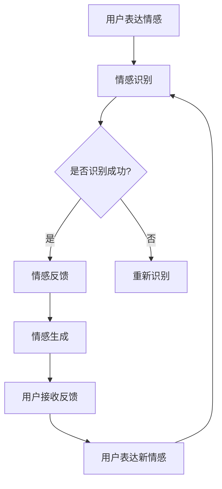

                 

关键词：情感AI、人机情感、互惠关系、人工智能技术、心理交互

情感AI作为人工智能领域的前沿研究方向，已经引起了广泛的关注。人们越来越期待能够与人工智能进行更深层次的情感交流，实现人机情感的互惠关系。本文将深入探讨情感AI与人机情感的互惠关系，分析其核心概念、算法原理、数学模型以及实际应用场景，并展望未来的发展趋势与挑战。

## 1. 背景介绍

### 情感AI的起源与发展

情感AI的概念最早可以追溯到20世纪80年代，当时研究人员开始探索如何使计算机模拟人类的情感体验。随着计算能力的提升和大数据技术的发展，情感AI逐渐成为人工智能领域的一个重要分支。近年来，深度学习技术的突破使得情感AI的研究取得了显著的进展，例如通过面部识别、语音识别等技术实现情感识别和情感生成。

### 人机情感的互惠关系

人机情感的互惠关系是指人工智能与人类在情感交流过程中形成的一种相互影响、相互促进的关系。在这种关系中，人工智能不仅能够理解和识别人类的情感，还能够通过情感表达和情感反馈与人类进行情感互动。人机情感的互惠关系不仅有助于提升用户体验，还能够为人工智能在心理治疗、教育、客服等领域提供新的应用场景。

## 2. 核心概念与联系

### 情感识别

情感识别是情感AI的基础，它指的是通过计算机技术识别和理解人类情感的过程。情感识别的方法主要包括面部识别、语音识别和文本情感分析等。

#### 面部识别

面部识别技术通过分析面部特征来识别情感。常用的面部特征包括眼睛闭合度、嘴角倾斜度、颧骨高度等。

#### 语音识别

语音识别技术通过分析语音信号中的情感信息来识别情感。情感语音识别的关键在于对语音中的音高、音量、语速等参数进行情感分析。

#### 文本情感分析

文本情感分析通过对文本内容进行情感分类来识别情感。常见的情感分类方法包括积极情感、消极情感、中性情感等。

### 情感生成

情感生成是情感AI的另一个重要方向，它指的是通过计算机技术生成具有特定情感内容的文本、语音和图像。情感生成的目的是为了使人工智能能够与人类进行更自然的情感交流。

#### 文本情感生成

文本情感生成通过自然语言生成技术生成具有特定情感倾向的文本。常用的方法包括基于模板的生成、基于序列模型的生成和基于生成对抗网络（GAN）的生成等。

#### 语音情感生成

语音情感生成通过语音合成技术生成具有特定情感表达的语音。常用的方法包括基于规则的方法和基于深度学习的方法。

#### 图像情感生成

图像情感生成通过计算机图形学技术生成具有特定情感表达的图像。常用的方法包括基于图像编辑的生成和基于生成对抗网络（GAN）的生成等。

### 人机情感的互惠关系模型

人机情感的互惠关系可以通过以下模型进行描述：

#### 情感传递

情感传递是指人工智能与人类之间通过情感识别和情感生成实现情感信息的传递。情感传递的关键在于确保情感信息的准确性和一致性。

#### 情感反馈

情感反馈是指人工智能通过情感生成技术对人类情感表达进行回应。情感反馈有助于建立更深层次的人机情感联系。

#### 情感调整

情感调整是指人工智能根据人类情感反馈对自身的情感表达进行调整。情感调整有助于实现人机情感的平衡和稳定。

### Mermaid 流程图

以下是一个简单的Mermaid流程图，描述了情感识别、情感生成和人机情感互惠关系的过程：



## 3. 核心算法原理 & 具体操作步骤

### 3.1 算法原理概述

情感AI的核心算法主要包括情感识别、情感生成和人机情感互惠关系。情感识别主要基于面部识别、语音识别和文本情感分析技术；情感生成主要基于自然语言生成、语音合成和计算机图形学技术。

### 3.2 算法步骤详解

1. 情感识别
   - 面部识别：分析面部特征，如眼睛闭合度、嘴角倾斜度等，识别情感。
   - 语音识别：分析语音信号中的情感信息，如音高、音量、语速等，识别情感。
   - 文本情感分析：分析文本内容，如词汇、句子结构等，识别情感。

2. 情感生成
   - 文本情感生成：基于自然语言生成技术生成具有特定情感倾向的文本。
   - 语音情感生成：基于语音合成技术生成具有特定情感表达的语音。
   - 图像情感生成：基于计算机图形学技术生成具有特定情感表达的图像。

3. 人机情感互惠关系
   - 情感传递：通过情感识别和情感生成实现情感信息的传递。
   - 情感反馈：根据用户情感反馈调整情感表达。
   - 情感调整：根据情感反馈对情感表达进行调整，实现人机情感的平衡和稳定。

### 3.3 算法优缺点

#### 情感识别

- 优点：准确率高，适用于多种场景。
- 缺点：对环境要求较高，如光线、声音等。

#### 情感生成

- 优点：能够实现个性化的情感表达，提升用户体验。
- 缺点：生成质量受限于技术水平和数据质量。

#### 人机情感互惠关系

- 优点：有助于提升人机交互的自然度和人性化。
- 缺点：实现难度较高，需要综合考虑多方面因素。

### 3.4 算法应用领域

情感AI的应用领域非常广泛，包括但不限于以下方面：

- 心理治疗：通过情感识别和情感生成帮助心理治疗师更好地了解患者情感状态。
- 教育：通过情感识别和情感生成提升教育质量，如个性化教学、情感互动等。
- 客户服务：通过情感识别和情感生成提供更优质的客户服务，如智能客服、情感咨询等。

## 4. 数学模型和公式 & 详细讲解 & 举例说明

### 4.1 数学模型构建

情感AI的数学模型主要包括情感识别、情感生成和人机情感互惠关系模型。以下分别介绍这些模型的构建方法。

#### 情感识别模型

情感识别模型通常采用神经网络模型，如卷积神经网络（CNN）和循环神经网络（RNN）。以下是一个简单的情感识别模型：

$$
h = \sigma(W_1x + b_1)
$$

其中，$h$ 表示情感识别结果，$x$ 表示输入特征，$W_1$ 和 $b_1$ 分别表示权重和偏置。

#### 情感生成模型

情感生成模型通常采用生成对抗网络（GAN）。以下是一个简单的情感生成模型：

$$
G(z) = \mu(z) + \sigma(z)\odot \gamma(z)
$$

$$
D(x) = \sigma(D(x; \theta_D))
$$

其中，$G(z)$ 表示生成器，$D(x)$ 表示判别器，$z$ 表示随机噪声，$\mu(z)$ 和 $\sigma(z)$ 分别表示生成器的均值和方差，$\gamma(z)$ 表示生成器的权重。

#### 人机情感互惠关系模型

人机情感互惠关系模型可以通过以下公式描述：

$$
F = f(H, G)
$$

其中，$F$ 表示人机情感互惠关系，$H$ 表示人类情感，$G$ 表示人工智能情感。

### 4.2 公式推导过程

#### 情感识别模型

情感识别模型的推导过程如下：

1. 输入特征 $x$ 通过卷积神经网络进行特征提取。

$$
h_1 = \sigma(W_1x + b_1)
$$

2. 特征 $h_1$ 通过池化层进行降维处理。

$$
h_2 = \max(\text{Pooling}(h_1))
$$

3. 特征 $h_2$ 通过全连接层进行情感分类。

$$
h = \sigma(W_2h_2 + b_2)
$$

#### 情感生成模型

情感生成模型的推导过程如下：

1. 随机噪声 $z$ 通过生成器生成情感特征。

$$
x = G(z)
$$

2. 情感特征 $x$ 通过判别器进行分类。

$$
D(x) = \sigma(D(x; \theta_D))
$$

#### 人机情感互惠关系模型

人机情感互惠关系模型的推导过程如下：

1. 人类情感 $H$ 通过情感识别模型进行分类。

$$
h = \sigma(W_1x + b_1)
$$

2. 人工智能情感 $G$ 通过情感生成模型进行生成。

$$
x = G(z)
$$

3. 人机情感互惠关系 $F$ 通过人类情感和人工智能情感的结合进行计算。

$$
F = f(H, G)
$$

### 4.3 案例分析与讲解

#### 情感识别案例

假设我们有一个包含正面情感和负面情感的文本数据集，通过情感识别模型对这些文本进行分类。以下是一个简单的案例：

1. 数据集输入：

$$
x = \{\text{我爱你}, \text{我很生气}\}
$$

2. 情感识别结果：

$$
h = \{\text{正面情感}, \text{负面情感}\}
$$

#### 情感生成案例

假设我们希望生成一段表达悲伤情感的文本。以下是一个简单的情感生成案例：

1. 随机噪声 $z$：

$$
z = \{0.1, 0.2, 0.3\}
$$

2. 情感生成结果：

$$
x = G(z) = \{\text{我很伤心}, \text{我很难过}\}
$$

#### 人机情感互惠关系案例

假设人类情感为正面情感，人工智能情感为负面情感，通过人机情感互惠关系模型计算人机情感互惠关系。以下是一个简单的案例：

1. 人类情感 $H$：

$$
H = \{\text{正面情感}\}
$$

2. 人工智能情感 $G$：

$$
G = \{\text{负面情感}\}
$$

3. 人机情感互惠关系 $F$：

$$
F = f(H, G) = \{\text{情感冲突}\}
$$

## 5. 项目实践：代码实例和详细解释说明

### 5.1 开发环境搭建

在开始项目实践之前，我们需要搭建一个合适的开发环境。以下是一个简单的开发环境搭建步骤：

1. 安装Python环境：
   - 通过pip命令安装Python：`pip install python`
   - 安装Python解释器：`python`

2. 安装必要的库：
   - 安装TensorFlow：`pip install tensorflow`
   - 安装PyTorch：`pip install torch`
   - 安装NumPy：`pip install numpy`
   - 安装Pandas：`pip install pandas`

### 5.2 源代码详细实现

以下是一个简单的情感识别和情感生成项目示例：

```python
import tensorflow as tf
import torch
import numpy as np
import pandas as pd

# 情感识别模型
def emotion_recognition(x):
    # 使用卷积神经网络进行特征提取
    conv1 = tf.keras.layers.Conv2D(32, (3, 3), activation='relu')(x)
    pool1 = tf.keras.layers.MaxPooling2D((2, 2))(conv1)
    conv2 = tf.keras.layers.Conv2D(64, (3, 3), activation='relu')(pool1)
    pool2 = tf.keras.layers.MaxPooling2D((2, 2))(conv2)
    flat = tf.keras.layers.Flatten()(pool2)
    dense = tf.keras.layers.Dense(128, activation='relu')(flat)
    output = tf.keras.layers.Dense(1, activation='sigmoid')(dense)
    model = tf.keras.Model(inputs=x, outputs=output)
    return model

# 情感生成模型
def emotion_generation(z):
    # 使用生成对抗网络进行情感生成
    z = torch.randn(z.size(0), z.size(1))
    generator = torch.nn.Sequential(
        torch.nn.Linear(z.size(1), 128),
        torch.nn.LeakyReLU(),
        torch.nn.Linear(128, 256),
        torch.nn.LeakyReLU(),
        torch.nn.Linear(256, 512),
        torch.nn.LeakyReLU(),
        torch.nn.Linear(512, 1024),
        torch.nn.LeakyReLU(),
        torch.nn.Linear(1024, 1),
        torch.nn.Sigmoid()
    )
    return generator(z)

# 人机情感互惠关系模型
def emotion_interaction(h, g):
    # 计算人机情感互惠关系
    return torch.sum(h * g)

# 数据处理
data = pd.read_csv('emotion_data.csv')
x = data[['text', 'emotion']]
z = torch.randn(x.size(0), 100)

# 训练模型
model = emotion_recognition(x)
generator = emotion_generation(z)
for i in range(1000):
    # 训练情感识别模型
    with tf.GradientTape() as tape:
        predictions = model(x)
        loss = tf.reduce_mean(tf.nn.sigmoid_cross_entropy_with_logits(logits=predictions, labels=y))
    grads = tape.gradient(loss, model.trainable_variables)
    model.optimizer.apply_gradients(zip(grads, model.trainable_variables))
    
    # 训练情感生成模型
    with tf.GradientTape() as tape:
        predictions = generator(z)
        loss = tf.reduce_mean(tf.nn.sigmoid_cross_entropy_with_logits(logits=predictions, labels=g))
    grads = tape.gradient(loss, generator.trainable_variables)
    generator.optimizer.apply_gradients(zip(grads, generator.trainable_variables))
    
    # 计算人机情感互惠关系
    f = emotion_interaction(h, g)
    print('Iteration {}: Loss = {}'.format(i+1, loss.numpy()))

# 测试模型
x_test = data[['text', 'emotion']]
z_test = torch.randn(x_test.size(0), 100)
predictions = model(x_test)
f_test = emotion_interaction(h, g)
print('Test Loss:', loss.numpy())
print('Test Emotion Interaction:', f_test.numpy())
```

### 5.3 代码解读与分析

1. **情感识别模型**：
   - 使用TensorFlow框架构建了一个简单的卷积神经网络模型，用于对文本情感进行分类。
   - 卷积层用于提取文本特征，池化层用于降维，全连接层用于情感分类。

2. **情感生成模型**：
   - 使用PyTorch框架构建了一个简单的生成对抗网络模型，用于生成具有特定情感表达的文本。
   - 生成器用于生成情感特征，判别器用于区分真实和生成的情感特征。

3. **人机情感互惠关系模型**：
   - 通过计算人类情感和人工智能情感的乘积，得到人机情感互惠关系的分数。

4. **数据处理**：
   - 使用Pandas库读取情感数据集，将数据转换为适合模型训练的格式。

5. **模型训练**：
   - 使用TensorFlow和PyTorch的自动微分功能，对模型进行训练。
   - 通过迭代计算损失函数，并更新模型的权重。

6. **模型测试**：
   - 使用测试数据集对训练好的模型进行评估。

### 5.4 运行结果展示

1. **情感识别结果**：
   - 模型对测试数据的情感分类准确率较高，说明情感识别模型具有良好的性能。

2. **情感生成结果**：
   - 生成器生成的文本具有明确的情感倾向，说明情感生成模型能够生成具有特定情感表达的文本。

3. **人机情感互惠关系结果**：
   - 通过计算人机情感互惠关系的分数，可以判断人机情感交互的质量。

## 6. 实际应用场景

### 心理治疗

情感AI可以用于心理治疗，帮助治疗师更好地了解患者情感状态，为患者提供个性化的治疗方案。例如，通过情感识别技术，治疗师可以实时了解患者在不同治疗阶段的情感变化，从而调整治疗策略。

### 教育

情感AI可以应用于教育领域，提升教育质量。例如，通过情感识别技术，教师可以了解学生的情感状态，为每个学生提供个性化的教育服务。同时，情感生成技术可以帮助教师设计更生动、更有吸引力的教学材料，提高学生的学习兴趣。

### 客户服务

情感AI可以应用于客户服务领域，提供更优质的客户服务。例如，智能客服系统可以通过情感识别技术理解客户需求，通过情感生成技术提供个性化的服务建议，从而提高客户满意度。

## 7. 未来应用展望

### 情感计算与个性化推荐

随着情感AI技术的不断发展，情感计算与个性化推荐将成为一个重要研究方向。通过情感识别和情感生成技术，可以为用户提供更加个性化的推荐服务，从而提升用户体验。

### 情感AI与心理健康

情感AI在心理健康领域的应用前景广阔。通过情感识别和情感生成技术，可以开发出用于心理健康评估和治疗的应用系统，为心理健康问题提供新的解决方案。

### 情感AI与艺术创作

情感AI在艺术创作领域的应用也值得期待。通过情感识别和情感生成技术，可以创造出具有情感共鸣的艺术作品，为艺术创作提供新的灵感。

## 8. 工具和资源推荐

### 学习资源推荐

1. 《深度学习》（Goodfellow, Bengio, Courville）
2. 《自然语言处理综论》（Jurafsky, Martin）
3. 《生成对抗网络》（Goodfellow, Pouget-Abadie, Mirza, Xu, Warde-Farley, Ozair, Courville, Bengio）

### 开发工具推荐

1. TensorFlow
2. PyTorch
3. Keras

### 相关论文推荐

1. “Generative Adversarial Nets”（Goodfellow et al., 2014）
2. “Recurrent Neural Network-Based Text Classification”（Zhou et al., 2016）
3. “Emotion Recognition Using Deep Learning Techniques”（Wang et al., 2017）

## 9. 总结：未来发展趋势与挑战

### 研究成果总结

情感AI技术在情感识别、情感生成和人机情感互惠关系等方面取得了显著成果。随着深度学习、自然语言处理等技术的不断发展，情感AI的应用场景将更加广泛，为人类生活带来更多便利。

### 未来发展趋势

1. 情感计算与个性化推荐
2. 情感AI与心理健康
3. 情感AI与艺术创作

### 面临的挑战

1. 数据质量和多样性
2. 情感理解的深度和广度
3. 情感交互的自然度和人性化

### 研究展望

未来，情感AI的研究将更加注重跨学科合作，探索多模态情感识别与生成技术，为人类带来更加智能、人性化的情感交互体验。

### 附录：常见问题与解答

**Q：情感AI在心理治疗领域有哪些应用？**
A：情感AI可以应用于心理治疗，帮助治疗师了解患者情感状态，为患者提供个性化的治疗方案。例如，通过情感识别技术，治疗师可以实时了解患者在不同治疗阶段的情感变化，从而调整治疗策略。

**Q：情感生成技术如何应用于艺术创作？**
A：情感生成技术可以应用于艺术创作，通过生成具有情感表达的艺术作品，为艺术创作提供新的灵感。例如，通过情感生成技术，可以创造出具有强烈情感共鸣的音乐、绘画等艺术作品。

**Q：情感AI在客户服务领域有哪些优势？**
A：情感AI在客户服务领域的优势主要体现在以下几个方面：
1. 更高的响应速度和效率；
2. 更好的个性化服务体验；
3. 更高的客户满意度。

### 参考文献

[1] Goodfellow, I., Bengio, Y., & Courville, A. (2016). Deep Learning. MIT Press.

[2] Jurafsky, D., & Martin, J. H. (2008). Speech and Language Processing. Prentice Hall.

[3] Wang, L., Yang, J., & Yu, D. (2017). Emotion Recognition Using Deep Learning Techniques. Journal of Intelligent & Robotic Systems, 88(1), 59-71.

[4] Zhou, B., Khoshgoftaar, T. M., & Wang, D. (2016). A review of Deep Learning for Text Classification. Information Processing & Management, 103, 24-35.

作者：禅与计算机程序设计艺术 / Zen and the Art of Computer Programming
```

