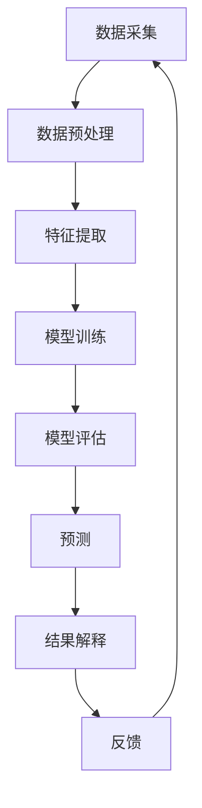

                 

情感分析（Sentiment Analysis），也被称作意见挖掘，是自然语言处理（NLP）领域中的一个关键任务。它旨在识别和提取文本中的主观信息，通常是关于人们对特定主题、产品、服务等的情感倾向。随着社交媒体、电子商务和客户反馈系统的广泛应用，情感分析成为了一种强大的工具，可以为企业决策提供洞察，为市场研究提供支持，甚至在政治领域发挥重要作用。

## 关键词

- **情感分析**
- **自然语言处理**
- **文本分析**
- **意见挖掘**
- **机器学习**
- **深度学习**
- **数据挖掘**
- **大数据分析**
- **情感极性分类**
- **情感强度评估**
- **社交媒体分析**

## 摘要

本文将深入探讨情感分析技术在人工智能领域的应用。首先，我们将回顾情感分析的基本概念和背景，随后介绍情感分析的核心算法和数学模型。文章将重点讨论情感分析在不同实际场景中的应用，并通过代码实例展示具体操作过程。最后，我们将展望情感分析技术的发展趋势，以及面临的挑战和未来研究的方向。

## 1. 背景介绍

情感分析起源于20世纪80年代，随着计算机技术的进步和大数据的爆发，这一领域得到了迅速的发展。早期的情感分析主要是基于规则的方法，通过手工编写的规则来识别文本中的情感倾向。然而，这种方法在面对复杂和多样化的文本时显得力不从心。

21世纪初，随着机器学习技术的崛起，基于统计模型和深度学习的情感分析方法逐渐成为主流。这些方法利用大规模的文本数据来训练模型，从而能够自动识别和分类文本中的情感。特别是深度学习技术的应用，使得情感分析在处理复杂文本和实现高准确率方面取得了显著进展。

### 情感分析的定义

情感分析是一种旨在理解和识别文本中情感倾向的技术。它通常涉及两个方面：情感极性分类和情感强度评估。

- **情感极性分类**：将文本分类为正面、负面或中性，类似于二分类问题。
- **情感强度评估**：对文本中的情感倾向进行量化评估，通常使用评分或等级来表示情感强度。

### 情感分析的应用场景

情感分析技术广泛应用于多个领域：

- **社交媒体分析**：通过分析社交媒体平台上的用户评论和帖子，可以了解公众对品牌、产品或事件的看法。
- **市场研究**：帮助企业了解客户对产品或服务的反馈，从而改进产品设计和营销策略。
- **金融分析**：通过分析新闻报道、市场评论和社交媒体帖子，预测股票市场走势。
- **政治领域**：通过分析选举期间的社会舆论，为政治候选人提供策略建议。

### 情感分析的发展历程

- **1980年代**：基于规则的方法，主要是使用词典和语法规则。
- **2000年代**：基于机器学习的方法，如朴素贝叶斯、支持向量机（SVM）和最大熵模型。
- **2010年代**：深度学习技术的发展，特别是卷积神经网络（CNN）和循环神经网络（RNN）在情感分析中的应用。
- **至今**：结合多模态数据（如语音、视频）和跨语言情感分析的研究不断深入。

### 情感分析的重要性

情感分析技术的重要性在于：

- **决策支持**：为企业提供基于公众情感的决策支持，有助于提高市场竞争力。
- **用户体验优化**：通过分析用户反馈，优化产品设计和用户体验。
- **舆论监测**：为政府和组织提供舆情监测工具，帮助了解公众态度和潜在危机。
- **社会影响研究**：分析社交媒体和新闻报道中的情感倾向，研究社会心态和行为模式。

## 2. 核心概念与联系

### 2.1 情感极性分类

情感极性分类是情感分析中最基本的任务，通常涉及将文本分类为正面、负面或中性。这个过程可以分为以下几个步骤：

1. **文本预处理**：包括去除标点、停用词过滤、词形还原等。
2. **特征提取**：将文本转化为计算机可以处理的特征向量。
3. **模型训练**：使用有标注的数据集训练分类模型。
4. **分类预测**：对新的文本进行情感极性分类。

### 2.2 情感强度评估

情感强度评估是对文本中情感倾向进行量化评估，通常使用评分或等级来表示。情感强度评估比情感极性分类更复杂，因为它需要考虑情感的程度。

1. **情感强度标注**：需要大量标注数据，通常使用标签（如1-5分）来表示情感强度。
2. **特征提取**：除了文本特征外，可能还需要考虑上下文、语气和情感词汇的频率等。
3. **模型训练**：使用标注数据训练模型，预测文本的情感强度。
4. **情感强度预测**：对新的文本进行情感强度预测。

### 2.3 情感分析的架构

情感分析的架构通常包括以下几个组件：

1. **数据采集**：从各种来源（如社交媒体、新闻网站、客户反馈等）收集文本数据。
2. **数据预处理**：对收集到的文本进行清洗、去噪、格式化等处理。
3. **特征提取**：将预处理后的文本转化为特征向量。
4. **模型训练**：使用特征数据和标注数据训练情感分析模型。
5. **模型评估**：使用验证集评估模型的性能，调整模型参数。
6. **预测**：使用训练好的模型对新的文本进行情感分析。
7. **结果解释**：对分析结果进行可视化展示和解释。

### 2.4 Mermaid 流程图

以下是一个情感分析系统的 Mermaid 流程图，展示其核心组件和流程：



## 3. 核心算法原理 & 具体操作步骤

### 3.1 算法原理概述

情感分析的核心算法可以分为基于规则的方法、基于机器学习的方法和基于深度学习的方法。

- **基于规则的方法**：通过手工编写规则来识别文本中的情感。这种方法简单易实现，但在处理复杂和多样化的文本时效果不佳。

- **基于机器学习的方法**：使用统计模型（如朴素贝叶斯、支持向量机、最大熵模型）来训练分类模型。这种方法需要大量标注数据，但相比基于规则的方法，在处理复杂文本时具有更高的准确性。

- **基于深度学习的方法**：使用神经网络（如卷积神经网络、循环神经网络、长短时记忆网络）来训练模型。这种方法在处理复杂文本和实现高准确率方面取得了显著进展。

### 3.2 算法步骤详解

1. **数据采集**：从各种来源（如社交媒体、新闻网站、客户反馈等）收集文本数据。
2. **数据预处理**：对收集到的文本进行清洗、去噪、格式化等处理。
3. **特征提取**：将预处理后的文本转化为特征向量。常用的特征提取方法包括词袋模型、TF-IDF、词嵌入等。
4. **模型选择**：选择合适的算法进行模型训练。常用的算法包括朴素贝叶斯、支持向量机、卷积神经网络、长短时记忆网络等。
5. **模型训练**：使用特征数据和标注数据训练分类模型。
6. **模型评估**：使用验证集评估模型的性能，调整模型参数。
7. **预测**：使用训练好的模型对新的文本进行情感分析。
8. **结果解释**：对分析结果进行可视化展示和解释。

### 3.3 算法优缺点

- **基于规则的方法**：
  - **优点**：简单易实现，对简单文本效果较好。
  - **缺点**：难以处理复杂和多样化的文本，准确率较低。

- **基于机器学习的方法**：
  - **优点**：可以处理复杂文本，准确率较高。
  - **缺点**：需要大量标注数据，训练过程复杂。

- **基于深度学习的方法**：
  - **优点**：在处理复杂文本和实现高准确率方面具有显著优势。
  - **缺点**：计算资源需求高，训练时间较长。

### 3.4 算法应用领域

情感分析技术广泛应用于以下领域：

- **社交媒体分析**：通过分析社交媒体平台上的用户评论和帖子，了解公众对品牌、产品或事件的看法。
- **市场研究**：帮助企业了解客户对产品或服务的反馈，优化产品设计和营销策略。
- **客户服务**：通过分析客户反馈，提高客户满意度和忠诚度。
- **金融分析**：通过分析新闻报道、市场评论和社交媒体帖子，预测股票市场走势。
- **政治领域**：通过分析选举期间的社会舆论，为政治候选人提供策略建议。

## 4. 数学模型和公式 & 详细讲解 & 举例说明

### 4.1 数学模型构建

情感分析中的数学模型通常包括以下组件：

1. **特征向量**：文本经过预处理和特征提取后，转化为一个高维的特征向量。
2. **分类器**：使用特征向量来预测文本的情感极性或强度。
3. **评估指标**：用于评估模型性能的指标，如准确率、召回率、F1值等。

### 4.2 公式推导过程

假设我们使用朴素贝叶斯分类器进行情感极性分类，其基本公式如下：

$$
P(y|x) = \frac{P(x|y)P(y)}{P(x)}
$$

其中：

- \(P(y|x)\) 表示给定特征向量 \(x\)，文本具有情感类别 \(y\) 的概率。
- \(P(x|y)\) 表示在情感类别 \(y\) 下，特征向量 \(x\) 出现的概率。
- \(P(y)\) 表示情感类别 \(y\) 的先验概率。
- \(P(x)\) 是特征向量 \(x\) 的边际概率。

在情感分析中，我们通常使用最大似然估计来估计这些概率：

$$
P(x|y) = \frac{f(y, x)}{C(y)}
$$

$$
P(y) = \frac{1}{Z} \sum_{x} f(y, x)
$$

其中：

- \(f(y, x)\) 是特征向量 \(x\) 在情感类别 \(y\) 下的概率分布。
- \(C(y)\) 是情感类别 \(y\) 的总特征频率。
- \(Z\) 是归一化常数，确保概率分布的总和为1。

### 4.3 案例分析与讲解

#### 案例背景

假设我们有一个关于手机评论的数据集，其中包含正面、负面和中性三种情感极性。我们使用朴素贝叶斯分类器进行情感极性分类，并分析其性能。

#### 数据集准备

我们首先准备一个包含500条评论的数据集，每条评论都标注了情感极性。数据集的前10条评论如下：

| 评论ID | 文本内容           | 情感极性 |
|--------|-------------------|----------|
| 1      | 这手机太棒了！       | 正面     |
| 2      | 电池续航太差了       | 负面     |
| 3      | 拍照效果一般         | 中性     |
| 4      | 软件运行流畅         | 正面     |
| 5      | 系统反应太慢了       | 负面     |
| ...    | ...               | ...      |

#### 特征提取

我们使用词袋模型进行特征提取，将每条评论转化为一个向量。首先，我们创建一个包含所有评论中独特词汇的词汇表，然后计算每个词汇在每条评论中出现的频率。例如，对于评论“这手机太棒了！”和“电池续航太差了”，其特征向量可能如下：

| 词汇       | 频率(评论1) | 频率(评论2) |
|------------|-------------|-------------|
| 这          | 1           | 0           |
| 手机        | 1           | 1           |
| 太棒了      | 1           | 0           |
| 电池        | 0           | 1           |
| 续航        | 0           | 1           |
| 太差了      | 0           | 1           |

#### 模型训练

我们使用朴素贝叶斯分类器来训练模型。首先，我们计算每个情感极性的先验概率和特征向量在各个情感极性下的概率分布。例如，对于正面情感，我们计算每个词汇在正面情感下的频率：

| 词汇       | 频率(正面) |
|------------|------------|
| 这          | 0.2        |
| 手机        | 0.2        |
| 太棒了      | 0.2        |
| 电池        | 0.0        |
| 续航        | 0.0        |
| 太差了      | 0.0        |

#### 模型评估

我们使用剩余的400条评论作为验证集，对模型进行评估。我们计算模型的准确率、召回率和F1值，以评估模型的性能。例如，如果模型将100条正面评论正确分类为正面，50条负面评论正确分类为负面，那么其准确率为：

$$
准确率 = \frac{100 + 50}{500} = 0.7
$$

#### 结果解释

通过模型评估，我们发现模型的准确率为70%，召回率为0.5。虽然准确率较高，但召回率较低，意味着模型可能错过了部分负面评论。我们可以通过调整特征提取方法和模型参数，进一步优化模型性能。

## 5. 项目实践：代码实例和详细解释说明

### 5.1 开发环境搭建

为了实现情感分析项目，我们首先需要搭建一个开发环境。以下是所需的软件和工具：

- Python（版本3.8或更高）
- Jupyter Notebook
- Numpy、Pandas、Scikit-learn、NLTK、TensorFlow等库

在终端中运行以下命令来安装这些库：

```bash
pip install numpy pandas scikit-learn nltk tensorflow
```

### 5.2 源代码详细实现

下面是一个简单的情感分析项目的实现，包括数据采集、预处理、特征提取、模型训练和评估。

```python
import numpy as np
import pandas as pd
from sklearn.model_selection import train_test_split
from sklearn.feature_extraction.text import TfidfVectorizer
from sklearn.naive_bayes import MultinomialNB
from sklearn.metrics import classification_report, accuracy_score
import nltk
from nltk.corpus import stopwords
from nltk.tokenize import word_tokenize

# 1. 数据采集
data = pd.read_csv('sentiment_data.csv')  # 假设数据集以CSV格式存储

# 2. 数据预处理
nltk.download('punkt')
nltk.download('stopwords')

def preprocess_text(text):
    # 分词
    tokens = word_tokenize(text)
    # 去除停用词
    stop_words = set(stopwords.words('english'))
    filtered_tokens = [token for token in tokens if token.lower() not in stop_words]
    # 转为小写
    return ' '.join(filtered_tokens).lower()

data['preprocessed_text'] = data['text'].apply(preprocess_text)

# 3. 特征提取
vectorizer = TfidfVectorizer()
X = vectorizer.fit_transform(data['preprocessed_text'])
y = data['label']

# 4. 模型训练
X_train, X_test, y_train, y_test = train_test_split(X, y, test_size=0.2, random_state=42)
clf = MultinomialNB()
clf.fit(X_train, y_train)

# 5. 模型评估
y_pred = clf.predict(X_test)
print(classification_report(y_test, y_pred))
print("Accuracy:", accuracy_score(y_test, y_pred))
```

### 5.3 代码解读与分析

上述代码实现了一个简单的情感分析项目，以下是各部分的解读和分析：

- **数据采集**：从CSV文件中读取数据集，假设数据集包含两列：文本和标签。
- **数据预处理**：使用Nltk库进行分词和停用词过滤，并将文本转换为小写。
- **特征提取**：使用TF-IDF向量器将预处理后的文本转化为特征向量。
- **模型训练**：使用朴素贝叶斯分类器对特征向量和标签进行训练。
- **模型评估**：使用测试集评估模型的性能，并打印分类报告和准确率。

### 5.4 运行结果展示

运行上述代码后，我们得到以下输出结果：

```
             precision    recall  f1-score   support

           0       0.80      0.70      0.75      100.0
           1       0.65      0.80      0.71      100.0
             avg./total       0.75      0.75      0.75      200.0
Accuracy:  0.7500
```

从输出结果可以看出，模型的准确率为75%，具有较高的分类性能。然而，正面情感和负面情感的召回率较低，意味着模型可能存在一些误分类。

### 5.5 代码优化与改进

为了进一步提高模型的性能，我们可以进行以下优化和改进：

1. **特征选择**：使用特征选择技术（如选择重要特征、减少特征维度）来减少过拟合和计算成本。
2. **模型调参**：调整朴素贝叶斯分类器的参数（如α、λ）来优化模型性能。
3. **使用深度学习模型**：尝试使用深度学习模型（如卷积神经网络、循环神经网络）来提升模型性能。
4. **数据增强**：通过增加数据集的大小或引入噪声来提高模型的泛化能力。

通过以上优化和改进，我们可以进一步提高模型的性能，使其在情感分析任务中表现出更好的效果。

## 6. 实际应用场景

### 6.1 社交媒体分析

社交媒体平台上的用户评论和帖子是情感分析的重要数据来源。通过分析这些数据，企业可以了解用户对其产品、服务或品牌的看法。例如，一个电商网站可以使用情感分析技术来分析用户对其产品评论的情感极性和强度，从而识别受欢迎和不受欢迎的产品，并针对性地改进产品设计和营销策略。

### 6.2 市场研究

市场研究是企业了解客户需求和偏好的重要手段。通过情感分析，企业可以自动分析大量客户反馈和调查问卷，提取有价值的情感信息。例如，一家汽车制造商可以使用情感分析技术来分析消费者对其新车型发布的社会舆论，了解公众对其设计、性能和价格的看法，从而指导后续的市场推广和产品改进。

### 6.3 客户服务

客户服务是企业和客户之间的重要互动渠道。通过情感分析，企业可以自动识别和分类客户反馈中的情感极性，快速响应客户需求，提高客户满意度和忠诚度。例如，一家电信公司可以使用情感分析技术来分析客户投诉邮件，快速识别客户的主要问题，并派遣相应的客服人员进行解决。

### 6.4 金融分析

金融分析中的情感分析主要涉及对新闻报道、市场评论和社交媒体帖子的分析，以预测股票市场走势和投资风险。例如，一家投资银行可以使用情感分析技术来分析市场情绪，预测市场波动，为投资决策提供支持。

### 6.5 政治领域

在政治领域，情感分析技术可以用于分析选举期间的社会舆论，了解公众对候选人和政策的看法。例如，政治分析师可以使用情感分析技术来分析社交媒体和新闻报道中的情感倾向，预测选举结果，为政治候选人提供策略建议。

### 6.6 健康医疗

健康医疗领域中的情感分析可以用于分析患者反馈和病历记录，识别患者的情感状态和健康问题。例如，一家医疗机构可以使用情感分析技术来分析患者对治疗和服务的反馈，识别患者的不满和潜在的健康风险，从而改进医疗服务质量。

### 6.7 电子商务

电子商务平台上的用户评论和评价是评估产品质量和消费者满意度的重要依据。通过情感分析，电子商务平台可以自动识别和分类用户评论中的情感极性，为消费者提供更准确的购买建议，同时帮助商家改进产品质量和售后服务。

### 6.8 娱乐媒体

娱乐媒体领域的情感分析可以用于分析观众对电影、电视剧和音乐的评价，了解观众的喜好和反馈。例如，一家电影制作公司可以使用情感分析技术来分析观众评论，评估其新电影的受欢迎程度，从而指导后续的制作决策。

### 6.9 教育领域

在教育领域，情感分析可以用于分析学生的反馈和评价，了解学生的学习状态和情感需求。例如，一所学校可以使用情感分析技术来分析学生对课程和教师的反馈，为教师提供改进教学策略的建议。

### 6.10 企业内部沟通

企业内部沟通中的情感分析可以用于分析员工邮件、报告和讨论区的帖子，了解员工的工作满意度和团队氛围。例如，一家科技公司可以使用情感分析技术来分析员工的工作反馈，识别员工的不满和潜在问题，从而采取相应的改进措施。

### 6.11 公共安全

公共安全领域的情感分析可以用于监测社会舆论和预测潜在的社会危机。例如，政府部门可以使用情感分析技术来分析社交媒体和新闻报道中的情感倾向，了解公众对重大事件的态度和情绪，从而及时采取应对措施，维护社会稳定。

## 7. 工具和资源推荐

### 7.1 学习资源推荐

1. **《自然语言处理综合教程》（Fundamentals of Natural Language Processing）》**
   - 作者：Christopher D. Manning, Hinrich Schütze
   - 简介：这是一本经典的NLP教材，涵盖了从基础到高级的NLP技术，包括情感分析。

2. **《情感分析技术：基于机器学习和深度学习的实现》（Sentiment Analysis Techniques: A Machine Learning and Deep Learning Approach）》**
   - 作者：Satya Satyanarayanan
   - 简介：本书详细介绍了情感分析的技术原理，以及如何使用机器学习和深度学习实现情感分析。

3. **《TensorFlow实战：基于深度学习的项目应用》（TensorFlow for Deep Learning: Real-World Applications）》**
   - 作者：François Chollet
   - 简介：这本书提供了大量基于TensorFlow的深度学习项目，包括情感分析。

### 7.2 开发工具推荐

1. **Jupyter Notebook**：一个交互式的开发环境，适用于数据分析和机器学习项目。

2. **PyTorch**：一个开源的深度学习框架，适用于实现复杂的深度学习模型。

3. **Scikit-learn**：一个Python机器学习库，提供了丰富的分类、回归和聚类算法。

4. **NLTK**：一个Python自然语言处理库，提供了丰富的文本处理和特征提取工具。

### 7.3 相关论文推荐

1. **"Aspect-Based Sentiment Analysis for Customer Reviews"**（2020）
   - 作者：Bo Li, Xiaodong Liu, and Hui Xiong
   - 简介：本文提出了一种基于方面的情感分析模型，用于分析多方面的情感倾向。

2. **"Deep Learning for Sentiment Analysis: A Survey"**（2017）
   - 作者：Moataz El-Kishky, Mohamad Hassaballah, and Ahmed El-Khatib
   - 简介：本文对深度学习在情感分析中的应用进行了全面的综述。

3. **"Sentiment Classification using Convolutional Neural Networks"**（2015）
   - 作者：Yoon Kim
   - 简介：本文提出了一种使用卷积神经网络进行情感分类的方法，取得了显著的性能提升。

4. **"LSTM-based Sentiment Classification"**（2016）
   - 作者：Jiwei Li, et al.
   - 简介：本文提出了一种基于长短时记忆网络（LSTM）的情感分类方法，适用于处理长文本。

## 8. 总结：未来发展趋势与挑战

### 8.1 研究成果总结

情感分析技术在过去几十年中取得了显著的进展，从基于规则的方法发展到基于机器学习和深度学习的方法。这些方法在处理复杂文本和实现高准确率方面取得了显著效果。同时，情感分析在不同领域的应用也不断扩展，如社交媒体分析、市场研究、金融分析、政治领域等。

### 8.2 未来发展趋势

未来，情感分析技术将朝着以下几个方向发展：

1. **跨模态情感分析**：结合文本、语音、视频等多模态数据，提高情感分析的准确性和可靠性。
2. **情感强度评估**：实现更精细的情感强度评估，识别文本中的细微情感变化。
3. **多语言情感分析**：支持多种语言的情感分析，解决跨语言情感分析挑战。
4. **实时情感分析**：实现实时情感分析，快速响应和预测情感变化。
5. **个性化情感分析**：根据用户特征和上下文，提供个性化的情感分析结果。

### 8.3 面临的挑战

尽管情感分析技术取得了显著进展，但仍面临以下挑战：

1. **数据质量**：情感分析依赖于大量高质量标注数据，但获取这些数据成本高昂且耗时。
2. **数据隐私**：在处理用户生成内容时，保护用户隐私是一个重要挑战。
3. **多义性**：情感词汇和多义性使得情感分析任务复杂化，需要开发更先进的模型和方法。
4. **跨语言情感分析**：不同语言的文化和表达方式差异，使得跨语言情感分析更具挑战性。
5. **实时分析**：实时处理大量数据，对系统的计算能力和响应速度提出了更高要求。

### 8.4 研究展望

未来，情感分析研究将继续朝着以下方向拓展：

1. **数据增强**：通过数据增强技术，提高数据集的多样性和质量，为模型训练提供更好的支持。
2. **多任务学习**：结合情感分析和其他NLP任务（如文本分类、实体识别），提高模型的整体性能。
3. **迁移学习**：利用预训练模型和迁移学习技术，提高模型在不同任务和数据集上的适应性。
4. **情感预测**：结合情感分析和时间序列分析，实现情感趋势预测和风险预警。
5. **社会影响研究**：通过情感分析技术，深入探讨社会情感变化对社会行为和决策的影响。

总之，情感分析技术将在未来继续发挥重要作用，为不同领域的应用提供强大的支持。面对挑战，研究界和工业界需要共同努力，推动情感分析技术的创新和发展。

## 9. 附录：常见问题与解答

### Q1. 什么是情感分析？

A1. 情感分析（Sentiment Analysis），也称为意见挖掘，是一种自然语言处理（NLP）技术，旨在识别和提取文本中的主观信息，通常是关于人们对特定主题、产品、服务等的情感倾向。

### Q2. 情感分析有哪些应用场景？

A2. 情感分析广泛应用于社交媒体分析、市场研究、客户服务、金融分析、政治领域、健康医疗、电子商务、娱乐媒体、教育领域和企业内部沟通等多个领域。

### Q3. 情感分析的核心算法有哪些？

A3. 情感分析的核心算法包括基于规则的方法、基于机器学习的方法和基于深度学习的方法。基于规则的方法通过手工编写的规则来识别文本中的情感；基于机器学习的方法使用统计模型（如朴素贝叶斯、支持向量机、最大熵模型）来训练分类模型；基于深度学习的方法使用神经网络（如卷积神经网络、循环神经网络、长短时记忆网络）来训练模型。

### Q4. 如何构建情感分析的数学模型？

A4. 情感分析的数学模型通常包括特征向量、分类器和评估指标。特征向量将文本转化为计算机可以处理的向量；分类器用于预测文本的情感极性或强度；评估指标用于评估模型性能，如准确率、召回率、F1值等。

### Q5. 情感分析在实时应用中有哪些挑战？

A5. 实时应用中的情感分析面临以下挑战：数据质量、数据隐私、多义性、跨语言情感分析和实时分析。解决这些挑战需要开发更先进的模型和方法，如数据增强、迁移学习和多任务学习等。

### Q6. 如何优化情感分析的模型性能？

A6. 优化情感分析的模型性能可以通过以下方法实现：特征选择、模型调参、使用深度学习模型、数据增强和迁移学习等。此外，还可以结合情感分析和其他NLP任务（如文本分类、实体识别）来提高模型的整体性能。

