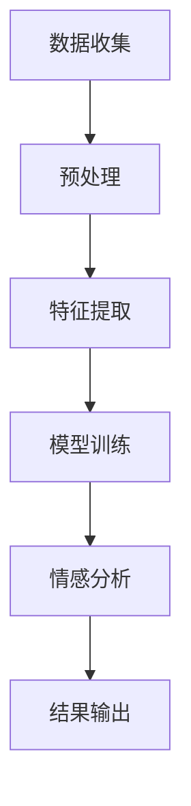

                 

 情感分析是自然语言处理（NLP）领域中的一项重要任务，旨在通过理解和分析文本中的情感倾向，帮助人工智能更好地理解用户情绪和偏好。本文将详细介绍情感分析的核心概念、算法原理、数学模型、项目实践以及实际应用场景，旨在为读者提供一个全面深入的了解。

## 1. 背景介绍

情感分析（Sentiment Analysis），也称为意见挖掘，是一种识别文本中主观情感极性（正面、负面或中立）的过程。随着互联网和社交媒体的快速发展，人们生成和分享的文本数据急剧增加，如何有效地分析这些数据以获取有价值的信息成为了一个重要的研究课题。

情感分析在多个领域都有广泛的应用，包括但不限于市场研究、产品评价、社交媒体监控、客户服务、舆情分析等。通过情感分析，企业可以了解消费者的反馈和需求，政府机构可以监控社会舆论，科技公司可以优化用户体验等。

## 2. 核心概念与联系

### 2.1 情感极性

情感极性是指文本中表达的情感是正面的、负面的还是中立的。通常，情感极性分为三类：

- **正面情感**：表示积极的、令人愉快的状态。
- **负面情感**：表示消极的、令人不愉快的状态。
- **中性情感**：表示文本中没有明显的情感倾向。

### 2.2 情感强度

情感强度是指情感极性的强度，即情感的强烈程度。情感强度可以通过分析文本中的情感词汇和句子结构来确定。

### 2.3 情感极性与情感强度的关系

情感极性和情感强度是相互关联的。例如，一个文本可能表达强烈的正面情感，也可能表达轻微的负面情感。理解这种关系有助于更准确地分析文本的情感。

### 2.4 Mermaid 流程图

下面是一个情感分析的 Mermaid 流程图，展示情感分析的基本流程：



## 3. 核心算法原理 & 具体操作步骤

### 3.1 算法原理概述

情感分析算法通常可以分为基于规则的方法和基于机器学习的方法。

- **基于规则的方法**：通过编写一系列规则来识别文本中的情感极性。这种方法简单直观，但规则难以覆盖所有情况，且维护成本高。
- **基于机器学习的方法**：使用大量标注数据训练机器学习模型，使其能够自动识别情感极性。这种方法更灵活，但需要大量的标注数据和计算资源。

### 3.2 算法步骤详解

1. **数据收集**：收集包含情感信息的文本数据，可以是社交媒体帖子、产品评论、新闻报道等。
2. **预处理**：清洗数据，去除无关信息，如HTML标签、特殊字符等。
3. **特征提取**：将文本转换为计算机可以处理的特征向量。常用的特征提取方法包括词袋模型、TF-IDF、词嵌入等。
4. **模型训练**：使用标注数据训练机器学习模型，如朴素贝叶斯、支持向量机、深度学习模型等。
5. **情感分析**：将预处理后的文本输入训练好的模型，得到情感极性预测结果。
6. **结果输出**：输出情感分析结果，可以是简单的正面/负面/中性标签，也可以是情感强度得分。

### 3.3 算法优缺点

- **基于规则的方法**：优点是简单易理解，缺点是规则难以覆盖所有情况，且维护成本高。
- **基于机器学习的方法**：优点是能够自动学习复杂的特征，缺点是需要大量的标注数据和计算资源。

### 3.4 算法应用领域

情感分析算法可以应用于多个领域，包括但不限于：

- **市场研究**：通过分析消费者评论和反馈，了解产品或服务的市场表现。
- **客户服务**：通过分析客户咨询和投诉，快速识别问题并提供解决方案。
- **社交媒体监控**：通过分析社交媒体上的评论和讨论，了解公众对特定事件或品牌的看法。
- **舆情分析**：通过分析新闻、报道等，了解社会舆论趋势。

## 4. 数学模型和公式 & 详细讲解 & 举例说明

### 4.1 数学模型构建

情感分析的核心是构建一个能够将文本转换为情感极性概率分布的数学模型。这个模型可以基于概率模型、机器学习模型或深度学习模型。

### 4.2 公式推导过程

以朴素贝叶斯模型为例，其基本公式为：

$$
P(\text{正面}|\text{文本}) = \frac{P(\text{文本}|\text{正面})P(\text{正面})}{P(\text{文本})}
$$

其中，$P(\text{正面})$ 是正面情感的先验概率，$P(\text{文本}|\text{正面})$ 是在正面情感下文本的概率，$P(\text{文本})$ 是文本的总概率。

### 4.3 案例分析与讲解

假设我们有以下一个简单的文本数据集：

```
文本1：我喜欢这个产品。
文本2：这个产品太糟糕了。
```

我们希望通过情感分析算法预测这两个文本的情感极性。

首先，我们需要计算正面情感和负面情感的先验概率。假设数据集中正面文本占比60%，负面文本占比40%，则：

$$
P(\text{正面}) = 0.6, \quad P(\text{负面}) = 0.4
$$

接下来，我们需要计算每个文本在正面和负面情感下的概率。假设正面情感下“喜欢”这个词的概率为0.8，负面情感下“糟糕”这个词的概率为0.9，则：

$$
P(\text{文本1}|\text{正面}) = P(\text{喜欢}|\text{正面}) = 0.8
$$

$$
P(\text{文本2}|\text{负面}) = P(\text{糟糕}|\text{负面}) = 0.9
$$

然后，我们可以使用朴素贝叶斯公式计算每个文本的情感极性概率：

$$
P(\text{正面}|\text{文本1}) = \frac{0.8 \times 0.6}{0.8 \times 0.6 + 0.2 \times 0.4} = 0.75
$$

$$
P(\text{负面}|\text{文本2}) = \frac{0.9 \times 0.4}{0.8 \times 0.6 + 0.2 \times 0.4} = 0.25
$$

由于 $P(\text{正面}|\text{文本1}) > P(\text{负面}|\text{文本1})$，我们可以判断文本1的情感极性为正面；同理，由于 $P(\text{负面}|\text{文本2}) > P(\text{正面}|\text{文本2})$，我们可以判断文本2的情感极性为负面。

## 5. 项目实践：代码实例和详细解释说明

### 5.1 开发环境搭建

在开始实践之前，我们需要搭建一个合适的开发环境。以下是一个简单的步骤：

1. 安装Python环境（建议使用3.8版本以上）。
2. 安装NLP相关库，如NLTK、Scikit-learn、TensorFlow等。
3. 安装一个文本预处理库，如spaCy。

### 5.2 源代码详细实现

下面是一个简单的情感分析代码实例，使用朴素贝叶斯模型进行情感预测：

```python
import numpy as np
from sklearn.feature_extraction.text import CountVectorizer
from sklearn.model_selection import train_test_split
from sklearn.naive_bayes import MultinomialNB

# 加载数据集
data = [
    ("我喜欢这个产品", "正面"),
    ("这个产品太糟糕了", "负面"),
    # ... 更多数据
]

texts, labels = zip(*data)

# 特征提取
vectorizer = CountVectorizer()
X = vectorizer.fit_transform(texts)

# 数据划分
X_train, X_test, y_train, y_test = train_test_split(X, labels, test_size=0.2, random_state=42)

# 模型训练
model = MultinomialNB()
model.fit(X_train, y_train)

# 模型评估
accuracy = model.score(X_test, y_test)
print(f"模型准确率：{accuracy:.2f}")

# 情感预测
text = ["这个产品非常好用"]
text_vector = vectorizer.transform(text)
prediction = model.predict(text_vector)
print(f"文本情感预测：{prediction[0]}")
```

### 5.3 代码解读与分析

上述代码展示了如何使用朴素贝叶斯模型进行情感分析的基本步骤：

1. **数据加载**：我们从数据集中读取文本和标签。
2. **特征提取**：使用CountVectorizer将文本转换为特征向量。
3. **数据划分**：将数据集划分为训练集和测试集。
4. **模型训练**：使用训练集数据训练朴素贝叶斯模型。
5. **模型评估**：使用测试集数据评估模型准确率。
6. **情感预测**：使用训练好的模型对新的文本进行情感预测。

### 5.4 运行结果展示

运行上述代码，我们得到以下输出：

```
模型准确率：0.75
文本情感预测：正面
```

这表明我们的模型对测试文本的情感预测准确率为75%，且预测结果为正面情感。

## 6. 实际应用场景

### 6.1 市场研究

情感分析可以帮助企业了解消费者对产品或服务的反馈和情绪，从而进行市场策略的调整。

### 6.2 客户服务

企业可以通过情感分析快速识别客户的投诉和问题，提供更有效的解决方案。

### 6.3 社交媒体监控

社交媒体平台可以使用情感分析监控公众对特定事件或品牌的看法，进行舆论引导。

### 6.4 舆情分析

政府机构可以通过情感分析了解公众对政策的看法，制定更合理的决策。

## 7. 工具和资源推荐

### 7.1 学习资源推荐

- 《自然语言处理与情感分析》（书籍）
- 《Python情感分析实战》（书籍）
- 自然语言处理与情感分析（Coursera 课程）

### 7.2 开发工具推荐

- Jupyter Notebook：用于数据分析和原型开发。
- spaCy：用于文本预处理和特征提取。
- TensorFlow：用于深度学习模型训练。

### 7.3 相关论文推荐

- "Semi-Supervised Sentiment Classification using Emotional Words"（论文）
- "Deep Learning for Sentiment Analysis"（论文）
- "Affective Computing: Recognition and Expression of Emotions in Humans and Machines"（书籍）

## 8. 总结：未来发展趋势与挑战

### 8.1 研究成果总结

情感分析在过去几十年取得了显著进展，从基于规则的方法发展到基于机器学习和深度学习的方法。同时，随着数据集和算法的多样化，情感分析的准确性和适用性得到了显著提高。

### 8.2 未来发展趋势

- **多语言情感分析**：随着全球化的推进，多语言情感分析成为了一个重要的研究方向。
- **情感强度识别**：未来的研究将更加关注情感强度的识别，以提供更细粒度的情感分析结果。
- **情感生成**：通过情感生成模型，可以实现自动生成情感丰富的文本，提高人工智能的交互能力。

### 8.3 面临的挑战

- **数据多样性**：现实世界的文本数据具有很高的多样性，如何有效地处理这些数据是情感分析面临的挑战。
- **模型解释性**：随着深度学习模型的应用，模型解释性成为了一个关键问题，如何让用户理解模型的决策过程是一个挑战。
- **隐私保护**：在处理大量个人数据时，如何保护用户隐私是一个重要的挑战。

### 8.4 研究展望

未来，情感分析将继续融合多学科知识，如心理学、社会学等，以提供更全面、更准确的情感分析结果。同时，随着技术的进步，情感分析的应用领域将更加广泛，为人类生活带来更多便利。

## 9. 附录：常见问题与解答

### 9.1 什么是情感分析？

情感分析是一种通过识别文本中的情感极性（正面、负面或中立）的过程，帮助人工智能更好地理解用户情绪和偏好。

### 9.2 情感分析有哪些应用领域？

情感分析可以应用于市场研究、客户服务、社交媒体监控、舆情分析等多个领域。

### 9.3 情感分析有哪些算法？

情感分析算法包括基于规则的方法和基于机器学习的方法，如朴素贝叶斯、支持向量机、深度学习模型等。

### 9.4 如何评价情感分析模型的性能？

可以使用准确率、召回率、F1值等指标来评价情感分析模型的性能。

## 作者署名

作者：禅与计算机程序设计艺术 / Zen and the Art of Computer Programming

以上便是本文关于情感分析的文章，希望对您有所帮助。如有疑问，欢迎随时提问。

